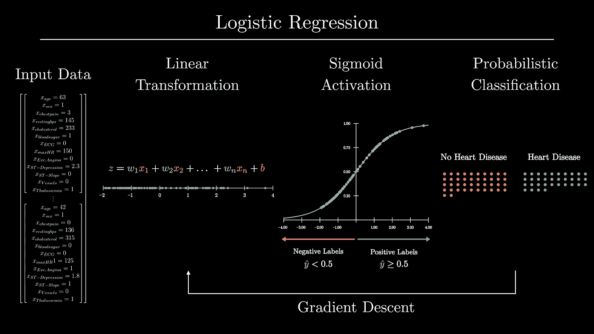
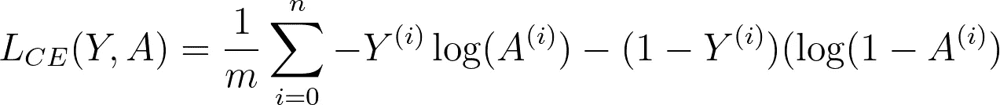
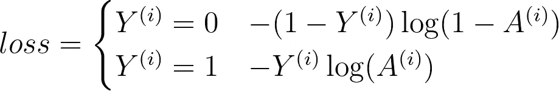
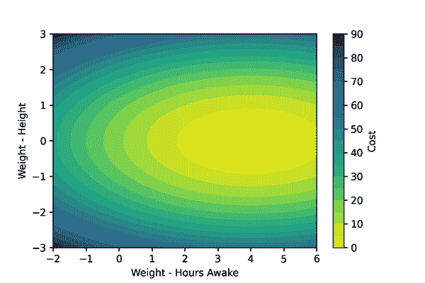
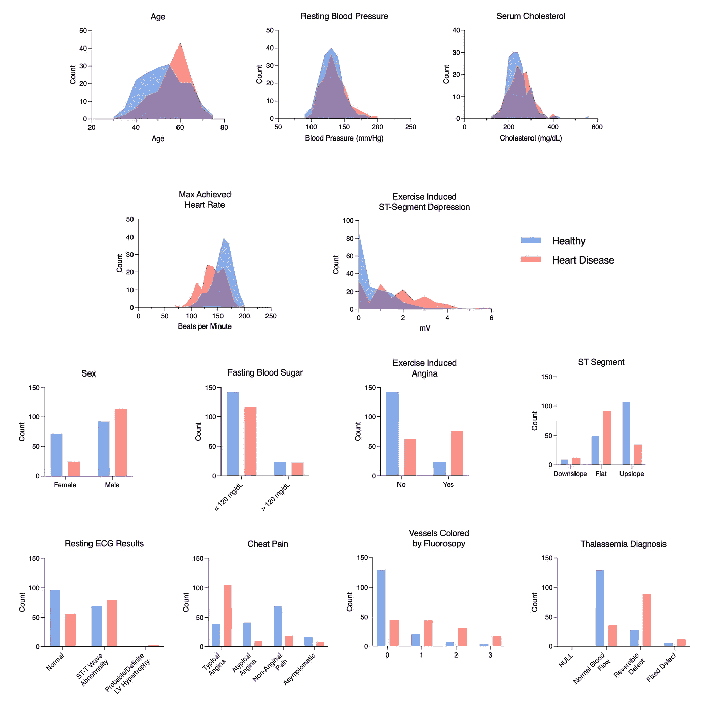

# 分解它:逻辑回归

> 原文：<https://towardsdatascience.com/breaking-it-down-logistic-regression-e5c3f1450bd>

## 用 NumPy、TensorFlow 和 UCI 心脏病数据集探索逻辑回归的基本原理



逻辑回归概述。图片作者。

```
**Outline:** 1\. [What is Logistic Regression?](#6a7a) 2\. [Breaking Down Logistic Regression](#c9d3)
   1\. [Linear Transformation](#9cd1)
   2\. [Sigmoid Activation](#bd84)
   3\. [Cross-Entropy Loss Function](#43d1)
   4\. [Gradient Descent](#cee3)
   5\. [Fitting the Model](#3930)
3\. [Learning by Example with the UCI Heart Disease Dataset](#6f98)
4\. [Training and Testing Our Classifier](#84da) 5\. [Implementing Logistic Regression with TensorFlow](#e0fa)
6\. Summary
7\. [Notes and Resources](#df98)
```

# 1.什么是逻辑回归？

[逻辑回归](https://en.wikipedia.org/wiki/Logistic_regression)是一种受监督的机器学习算法，它为输入数据集创建分类标签( [1](https://web.stanford.edu/~jurafsky/slp3/5.pdf) 、 [2](https://see.stanford.edu/materials/aimlcs229/cs229-notes1.pdf) )。逻辑回归(logit)模型在各种环境中使用，包括[医疗](https://www.ncbi.nlm.nih.gov/pmc/articles/PMC7785709/)、[研究](https://www.researchgate.net/publication/263933254_Association_between_light_exposure_at_night_and_insomnia_in_the_general_elderly_population_The_HEIJO-KYO_cohort)和[商业](http://www.computerscijournal.org/vol10no1/churn-analysis-in-telecommunication-using-logistic-regression/)分析。

理解逻辑回归背后的逻辑可以为深度学习的基础提供强有力的基础见解。

在本文中，我们将分解逻辑回归来获得对这个概念的基本理解。为此，我们将:

1.  探索逻辑回归的基本组件，并使用 NumPy 从头开始构建模型
2.  在 UCI 心脏病数据集上训练我们的模型，以根据成人的输入健康数据预测他们是否患有心脏病
3.  使用 TensorFlow 构建“正式”logit 模型

你可以用我的演练 [Jupyter 笔记本](https://github.com/JacobBumgarner/learning-repo/blob/main/logistic_regression/logistic_regression_walkthrough.ipynb)和我的 [GitHub](https://github.com/JacobBumgarner/learning-repo) learning-repo 中的 [Python](https://github.com/JacobBumgarner/learning-repo/blob/main/logistic_regression/logistic_regression.py) 脚本文件来遵循这篇文章中的代码。

# 2.分解逻辑回归

逻辑回归模型为输入数据集创建概率标签。这些标签通常是二元的(是/否)。

让我们通过一个例子来突出逻辑回归的主要方面，然后我们将开始我们的深入研究:

> 想象一下，我们有一个 logit 模型，它被训练来预测某人是否患有糖尿病。模型的输入数据是一个人的**年龄**、**身高**、**体重**和**血糖**。为了进行预测，模型将使用**逻辑**函数转换这些输入数据。该函数的输出将是在 **0** 和 **1 之间的概率标签。**这个标签离 **1** 越近，模型对这个人**有糖尿病**的把握就越大，反之亦然。
> 
> 重要的是:为了创建分类标签，我们的糖尿病 logit 模型首先必须**学习**如何衡量每条输入数据的重要性。为了预测糖尿病，很可能某人的血糖**比其身高**高**。这种学习使用一组标记的测试数据和梯度下降来进行。学习到的信息以逻辑函数中使用的**权重**和**偏差**参数值的形式存储在模型中。**

这个例子提供了逻辑回归模型做什么以及它们如何工作的卫星视图概要。我们现在准备好进行深潜了。

为了开始我们的深入探讨，让我们来分解逻辑回归的核心部分:逻辑函数。

我们将使用 NumPy 从头开始构建自己的 logit 模型，而不仅仅是从阅读中学习。这将是模型的轮廓:

在第 **2.1 节**和第 **2.2 节**中，我们将实现线性和 sigmoid 变换函数。

在 **2.3** 中，我们将定义**交叉熵成本函数**，以告知模型其预测何时为“好”和“坏”。在第 **2.4 节**中，我们将通过梯度下降帮助模型学习其参数。

最后，在第 **2.5 节**中，我们将把所有这些功能联系在一起。

## 2.1 线性变换

正如我们在上面看到的，逻辑函数首先使用其学习到的参数将**线性变换**应用于输入数据:权重**和偏差**。

**权重** ( ***W*** )参数表示每条输入数据对分类的重要性。个体重量越接近 **0** ，相应的数据对分类越不重要。**权重**向量和输入数据 **X** 的点积将数据展平成一个标量，我们可以将它放在一个数轴上。

> 例如，如果我们试图根据一个人的身高和醒着的时间来预测他是否疲劳，那么这个人的身高权重将非常接近于零。

**bias**(***b***)参数用于沿该行的判定边界( **0** )移动该标量。

**让我们想象一下逻辑函数的线性分量如何使用其学习到的权重和偏差来转换来自 UCI 心脏病数据集的输入数据。**

我们现在准备开始填充模型的函数。首先，我们需要用它的**权重**和**偏差**参数初始化我们的模型。**权重**参数将是一个`(n, 1)`形状的数组，其中`n`等于输入数据中的特征数量。**偏置**参数是一个标量。两个参数都将被初始化为 ***0。***

接下来，我们可以填充函数来计算逻辑函数的线性部分。

## 2.2 乙状结肠激活

逻辑模型通过将 **sigmoid 函数**应用于逻辑函数线性变换的输出数据来创建概率标签( ***ŷ*** )。sigmoid 函数对于从输入数据创建概率很有用，因为它压缩输入数据以产生介于 ***0*** 和 ***1*** 之间的值。

> sigmoid 函数是 logit 函数的逆函数，因此得名逻辑回归。

为了从 sigmoid 函数的输出中创建二进制标签，我们将决策边界定义为 ***0.5*** 。这意味着如果 ***ŷ ≥ 0.5*** ，我们说标号是*正*，当 ***ŷ < 0.5*** 时，我们说标号是*负*。

**让我们想象一下 sigmoid 函数是如何将输入数据从逻辑函数的线性分量转换而来的。**

现在，让我们在模型中实现这个函数。

## 2.3 交叉熵成本函数

为了教会我们的模型如何优化其 ***权重*** 和 ***偏差*** 参数，我们将输入训练数据。然而，为了让模型*学习*最优参数，它必须知道如何判断其参数在生成概率标签方面是“好”还是“坏”。

这个“良好”因子，或者概率标签和真实标签之间的差异，被称为单个样本的*损失*。我们在操作上说，如果参数在预测标签时表现不佳，损失应该是高的，如果表现良好，损失应该是低的。

然后对训练数据上的损失进行平均，以产生*成本*。

逻辑回归采用的函数是**交叉熵成本函数**。在下面的函数中， ***Y*** 是地面真实标签， ***A*** 是我们的概率标签。



交叉熵代价函数

注意，该函数根据 ***y*** 是 ***1*** 还是 ***0*** 而变化。

*   当 ***y = 1*** 时，该函数计算标签的 ***日志*** 。如果预测正确，则*损失*将为 ***0*** (即 ***log(1) = 0*** )。如果不正确，随着预测越来越接近 ***0*** ，损失会越来越大。
*   当 ***y = 0*** 时，该函数从 ***y*** 中减去 ***1*** ，然后计算标签的 ***log*** 。这种减法使正确预测的损耗*保持为低*而不正确预测的损耗*保持为高*。



1 和 0 地面真实标签的交叉熵情况

现在让我们填充函数来计算输入数据数组的交叉熵成本。

## 2.4 梯度下降

既然我们可以计算模型的成本，我们必须使用成本通过梯度下降来“调整”模型的参数。如果你需要梯度下降的复习，看看我的 [*分解:梯度下降*](https://pub.towardsai.net/breaking-it-down-gradient-descent-b94c124f1dfd) 帖子。

让我们创建一个假的场景:想象我们正在训练一个模型来预测一个成年人是否累了。我们的伪模型只得到两个输入特征:`height`和`hours spent awake`。为了准确预测一个成年人是否累了，该模型可能应该为`height`特征开发一个非常小的权重，而为`hours spent awake`特征开发一个大得多的权重。

梯度下降将使这些参数*下降*它们的梯度，这样它们的新值将产生更小的成本。记住，梯度下降使函数的输出最小化。我们可以想象下面的例子。



梯度下降示例

为了计算成本函数 w . r . t .***权重*** 和 ***偏差*** 的梯度，我们必须实现[链式规则](https://www.khanacademy.org/math/ap-calculus-ab/ab-differentiation-2-new/ab-3-1a/a/chain-rule-review)。为了找到我们参数的梯度，我们将区分成本函数和 sigmoid 函数，以找到它们的乘积。然后我们将分别区分线性函数 w . r . t .***权重*** 和 ***偏差*** 函数。

**让我们探索一下逻辑回归偏微分的直观证明:**

让我们实现这些简化的等式来计算训练示例中每个参数的平均梯度。

# 2.5 拟合模型

最后，我们已经为我们的模型构建了所有必要的组件，所以现在我们需要集成它们。我们将创建一个与*批次*和*小型批次*梯度下降兼容的函数。

*   在*批量梯度下降*中，每个训练样本用于更新模型的参数。
*   在*小批量梯度下降*中，选择训练样本的随机部分来更新参数。小批量选择在这里并不重要，但是当训练数据太大而不适合 GPU/RAM 时，它非常有用。

提醒一下，拟合模型是一个三步迭代过程:

1.  用 ***权重*** 和 ***偏差*** 对输入数据应用线性变换
2.  应用非线性 sigmoid 变换来获取概率标签。
3.  计算成本函数 w.r.t ***W*** 和 ***b*** 的梯度，并逐步降低这些参数的梯度。

让我们来构建函数！

# 3.UCI 心脏病数据集的实例学习

为了确保我们不只是孤立地创建一个模型，让我们用一个示例人类数据集来训练该模型。在临床健康的背景下，我们将训练的模型可以提高医生对患者健康风险的认识。

让我们通过 [UCI 心脏病数据集](https://archive.ics.uci.edu/ml/datasets/heart+disease)的例子来学习。

数据集包含关于成年患者心脏和身体健康的 **13** 特征。每个样本还贴有标签，以表明受试者*是否患有*或*是否患有*心脏病。

首先，我们将加载数据集，检查它是否缺少数据，并检查我们的要素列。重要的是，标签在这个数据集中是颠倒的(例如，1 =没有疾病，0 =疾病)，所以我们必须解决这个问题。

```
Number of subjects: 303
Percentage of subjects diagnosed with heart disease:  45.54%
Number of NaN values in the dataset: 0
```

让我们也把特征形象化。我已经创建了自定义人物，但是在这里看到我的[要点](https://gist.github.com/JacobBumgarner/48cdb6c374d14dac83c5a933baac267f)用 Seaborn 创建你自己的人物。



根据我们的检查，我们可以得出结论，没有明显的缺失特征。我们还可以看到，在几个特征中存在一些 stark 组分离，包括年龄(`age`)、运动诱发的心绞痛(`exang`)、胸痛(`cp`)和运动期间的心电图形状(`oldpeak` & `slope`)。这些数据将有助于训练 logit 模型！

为了结束这一部分，我们将完成数据集的准备。首先，我们将对数据进行 75/25 分割，以创建[测试和训练集](/train-test-split-and-cross-validation-in-python-80b61beca4b6)。然后我们将标准化*下面列出的连续特性。

`to_standardize = ["age", "trestbps", "chol", "thalach", "oldpeak"]`

> *除非您正在运行某种形式的正则化，否则您不必对 logit 模型的数据进行标准化。我在这里这样做只是作为一种最佳实践。

## 4.训练和测试我们的分类器

现在，我们已经构建了模型并准备好了数据集，让我们训练模型来预测健康标签。

我们将实例化模型，用我们的`x_train`和`y_train`数据训练它，并用`x_test`和`y_test`数据测试它。

```
Final model cost: 0.36
Model test prediction accuracy: 86.84%
```

这就是我们得到的结果:测试集的准确率为 86.8% 。这比 50%的随机几率要好得多，对于这么简单的模型，准确率还是挺高的。

为了更仔细地观察事物，让我们在模型的训练过程中可视化模型的特征。在第一行，我们可以看到模型在训练过程中的成本和准确性。然后在最下面一行，我们可以看到 ***权重*** 和 ***偏差*** 参数在训练过程中是如何变化的(我最喜欢的部分！).

## 5.用 TensorFlow 实现逻辑回归

在现实世界中，当您需要使用模型时，最好不要构建自己的模型。相反，我们可以依赖功能强大、设计良好的开源软件包，如 TensorFlow、PyTorch 或 scikit-learn 来满足我们的 ML/DL 需求。

下面，我们来看看用 TensorFlow 建立一个 logit 模型，并将它的训练/测试结果与我们自己的进行比较是多么简单。我们将准备数据，创建一个具有 sigmoid 激活的单层单单元模型，并使用二元交叉熵损失函数编译它。最后，我们将拟合和评估模型。

```
Epoch 5000/5000
1/1 [==============================] - 0s 3ms/step - loss: 0.3464 - accuracy: 0.8634Test Set Accuracy:
1/1 [==============================] - 0s 191ms/step - loss: 0.3788 - accuracy: 0.8553
[0.3788422644138336, 0.8552631735801697]
```

由此我们可以看到，该模型的最终训练成本为 0.34(相比于我们的 0.36)，测试集准确率为 **85.5%** ，与我们上面的结果非常相似。引擎盖下有一些小差异，但模型性能非常相似。

重要的是，TensorFlow 模型是用不到 25 行代码构建、训练和测试的，而我们在`logit_model.py`脚本中用了 200 多行代码。

# 6.摘要

在这篇文章中，我们已经探索了逻辑回归的各个方面。我们用 NumPy 从头开始构建一个模型。我们首先实现了线性和 sigmoid 转换，实现了二元交叉熵损失函数，并创建了一个拟合函数来用输入数据训练我们的模型。

为了理解逻辑回归的目的，我们然后在 UCI 心脏病数据集上训练我们的 NumPy 模型来预测患者的心脏病。我们发现这个简单的模型有 86%的预测准确率——非常令人印象深刻。

最后，在花时间学习和理解这些基础知识之后，我们看到了用 TensorFlow 构建 logit 模型是多么容易。

总之，逻辑回归是一种有用的预测分析算法。理解这个模型是研究深度学习道路上强有力的第一步。

好了，就这样了！如果你已经走了这么远，感谢你的阅读。我希望这篇文章对你了解逻辑回归的基本原理有所帮助。

# 7.注释和资源

以下是我最初学习逻辑回归时的几个问题。也许你也会对它们感兴趣！

> ***Q1:*** *逻辑回归模型基本上不就是神经网络的单个单元吗？*
> 
> ***A1:*** *有效，是的。我们可以将逻辑回归模型视为单层、单单元神经网络。* [*塞巴斯蒂安·拉什卡*](https://sebastianraschka.com/faq/docs/logisticregr-neuralnet.html) *对为什么会这样提供了一些很好的见解。许多神经网络使用 sigmoid 激活函数来生成单位输出，就像逻辑回归一样。*
> 
> ***Q2:*** *我们所说的*后勤*是什么意思？*
> 
> ***A2:*** *逻辑回归的“逻辑”来源于模型使用了* [logit](/understanding-logistic-regression-9b02c2aec102) *函数的逆函数，即 sigmoid 函数。*

```
Resources
- [UCI Heart Disease Dataset](https://www.google.com/search?client=safari&rls=en&q=uci+heart+disease+dataset&ie=UTF-8&oe=UTF-8)
- [Speech and Language Processing. Daniel Jurafsky & James H. Martin.](https://web.stanford.edu/~jurafsky/slp3/5.pdf) - [CS229 Lecture notes, Andrew Ng](https://see.stanford.edu/materials/aimlcs229/cs229-notes1.pdf)
- [Manim, 3Blue1Brown](https://github.com/3b1b/manim)
```

***除特别注明外，所有图片均为作者所有。***