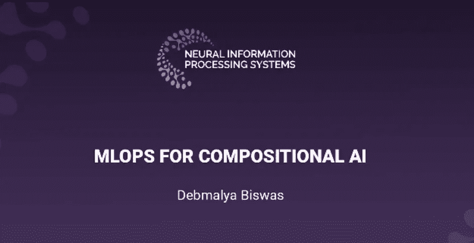
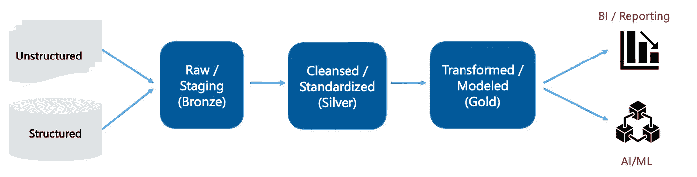
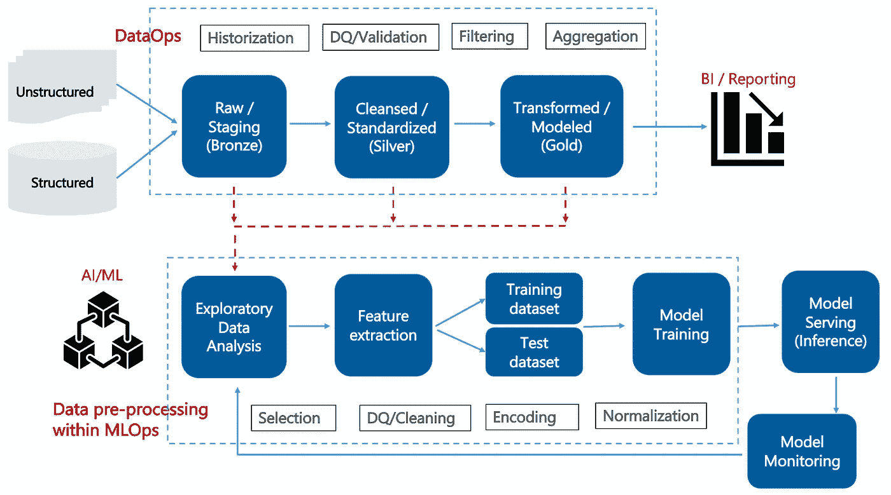
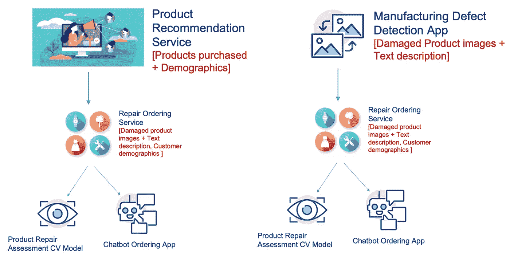
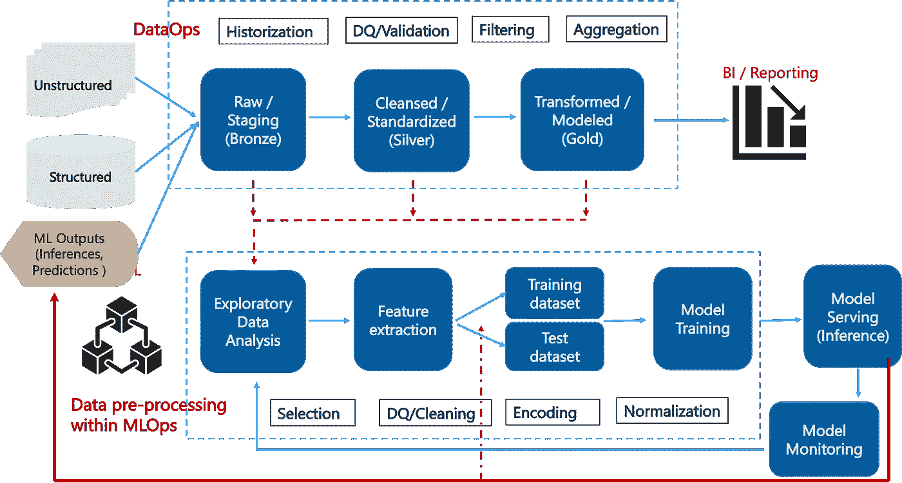

# 桥接数据操作和多操作

> 原文：<https://towardsdatascience.com/bridging-dataops-mlops-301f010caf30>

## 作为新数据源的 ML 模型推理

这是在第 36 届 [**NeurIPS**](https://neurips.cc/virtual/2022/workshop/49982) 关于部署和监控机器学习系统的挑战的研讨会([【DMML】](https://sites.google.com/view/dmmlsys-neurips2022/home))、2022 年( [pdf](https://www.researchgate.net/publication/364603411_MLOps_for_Compositional_AI) ) (SlidesLive [视频](https://slideslive.com/38994256))上提交的论文“组合 AI 的 MLOps”的博客版本。

# 介绍

作为一名数据分析和人工智能/人工智能从业者，我仍然看到这两个生态系统之间的巨大差异。

当我第一次听说 DataOps 和 MLOps——这两个框架支持数据和 ML 管道时，我想知道为什么我们需要两个独立的框架？数据是人工智能/人工智能的一个关键组成部分(至少对于受监督的人工智能来说是这样，它可能占今天企业人工智能的 80%)，尤其是在以数据为中心的人工智能时代。

对于门外汉来说，以数据为中心的人工智能将人工智能/建模从算法/建模部分重新聚焦到底层数据。这是基于一个假设，即一个好的算法或模型能够从训练数据集中挤出的“理解”量是有限的。因此，提高模型准确性的推荐方法是关注训练数据集:收集更多数据、添加合成(外部)数据、提高数据质量、尝试新颖的数据转换等等。

因此，问题仍然是为什么我们需要分别考虑数据操作和 m 操作，或者数据操作是 m 操作的一部分，嵌入在 m 操作中？让我们投入进去，希望我们不会以第三个**数据操作**框架结束— *请提出一个更好的流行词，你永远不知道你会出名* -:)

# 集成 BI 和 ML

理想的世界应该是下图这样的:

图 1:统一的 BI & AI/ML 管道(图片由作者提供)

结构化和非结构化的源数据被吸收到青铜层，在那里被净化和标准化到银层，进一步建模和转换到金层。数据现在准备好供两个 BI 报告工具& ML 管道使用。

> 然而，在现实中，我们看到这种管理/处理的数据被移动到另一个位置，例如云存储桶或另一个数据湖，在那里它被进一步转换为 ML 培训和部署的一部分。

所以图 1。在企业环境中，类似于图 2(下图):

图 DataOps 和 MLOps 管道中的数据处理(图片由作者提供)

MLOps 的数据(预处理)部分集中于将数据从源移动到 ML 模型，而不一定包括模型如何对数据本身执行。这通常包括一系列支持学习算法的转换。例如，数据科学家可能选择构建线性回归管道或探索性因素分析管道来支持 ML 模型。

*ML 训练和验证(* [*链接*](https://neptune.ai/blog/automated-testing-machine-learning) *)需要执行比传统 ETL 工具支持的功能更复杂的功能*。在复杂的数据处理、聚合和回归中经常会出现这种情况。这里推荐的方法是用有向无环图(DAG)流来补充数据处理策略。

与 BI 中更线性的数据流相比，DAG 流支持用于数据路由、统计转换和系统逻辑的可扩展有向图。像 Apache Airflow 这样的工具支持与 DAG 流相关联的创作、管理和维护，然后可以**以编程方式创作 DAG 流，以与 ETL 管道**集成。

> 不用说，这导致了冗余和 DataOps 和 MLOps 管道的碎片。可以公平地说，今天的 DataOps 更多地与 BI/结构化分析相关，而 MLOps 通过嵌入数据(预)处理来解决整个 ML 管道。

工具/平台供应商已经开始朝着这个方向努力，我们已经看到了一些解决这个问题的初始产品。雪花最近宣布 [Snowpark Python API](https://github.com/snowflakedb/snowpark-python) 允许 ML 模型在雪花内训练和部署，Snowpark 允许数据科学家使用 Python(而不是用 SQL 写代码)。

谷歌云平台(GCP)提供了 [BigQuery ML](https://cloud.google.com/bigquery-ml/docs/introduction) ，这是一个 GCP 工具，允许在 GCP 的数据仓库环境中纯粹使用 SQL 来训练 ML 模型。同样， [AWS 红移数据 API](https://docs.aws.amazon.com/redshift/latest/mgmt/data-api.html) 让任何用 Python 编写的应用都可以轻松地与红移交互。这允许 SageMaker 笔记本连接到 Redshift 集群，并在 Python 中运行数据 API 命令。就地分析提供了一种有效的方法，可将数据从 AWS 的 DWH 直接导入笔记本电脑。

# 作为新数据源的 ML 模型推理

在本节中，我们考虑 MLOps 管道的另一个缺失的“数据”方面，其中*部署的 ML 模型生成新数据，充当数据源*。

让我们考虑一个[合成 AI](/compositional-ai-the-future-of-enterprise-ai-3d5289dfa888) 场景(图 3):

图 3:合成人工智能场景(图片由作者提供)

考虑消费电子产品供应商的(在线)维修服务。该服务包括一个计算机视觉(CV)模型，该模型能够根据受损产品的快照评估所需的维修。如果用户对报价满意，则服务被转移到聊天机器人，聊天机器人与用户对话以捕捉处理请求所需的附加细节，例如损坏细节、用户名、联系细节等。

将来，当供应商寻求开发产品推荐服务时，会考虑维修服务。由维修服务收集的数据:用户拥有的产品的状态(由 CV 评估模型收集)以及他们的人口统计数据(由聊天机器人收集)——**为推荐服务**提供额外的标记训练数据。

我们继续组合场景，其中供应商进一步希望开发一个计算机视觉(CV)支持的制造缺陷检测服务。回想一下，维修服务已经标记了受损产品的图像，因此在这里也可以利用它们。**标记的图像还可以作为反馈回路提供给维修服务—** 以改进其底层 CV 模型。

> 总的来说，由部署的 ML 模型做出的推断可以作为反馈循环来提供，以增强部署的模型的现有训练数据集，或者作为新模型的训练数据集。这导致了一个场景，其中部署的 ML 模型生成新数据——充当 MLOps 管道的数据源。

图 4(下面)示出了扩展的 MLOps 流水线，其中(部署的)ML 模型推理被集成为(新的)数据源。合成数据，即合成生成的与原始训练数据集非常相似的数据(基于生成神经网络)，也可以被认为是类似的附加数据源。

图 4:(部署的)作为附加数据源的 ML 模型推理(作者图片)

# 参考

*   *以数据为中心的 AI* 。[https://datacentricai.org/](https://datacentricai.org/)
*   *数据运营的重要性:为什么重要以及如何开始？*[https://www . wipro . com/analytics/the-importance-of-data ops-why-it-matters-and-how-to-get-started/](https://www.wipro.com/analytics/the-importance-of-dataops-why-it-matters-and-how-to-get-started/)
*   D.史高丽等人。艾尔。*机器学习系统中隐藏的技术债务*。[https://proceedings . neur IPS . cc/paper/2015/file/86 df 7 dcfd 896 fcaf 2674 f 757 a 2463 EBA-paper . pdf](https://proceedings.neurips.cc/paper/2015/file/86df7dcfd896fcaf2674f757a2463eba-Paper.pdf)
*   *现场演示:用 Snowpark for Python 构建数据科学的未来*。[https://www . snow flake . com/webinar/building-the-future-of-data-science-with-snow park-for-python/](https://www.snowflake.com/webinar/building-the-future-of-data-science-with-snowpark-for-python/)
*   *什么是 BigQuery ML？*。[https://cloud.google.com/bigquery-ml/docs/introduction](https://cloud.google.com/bigquery-ml/docs/introduction)
*   *使用亚马逊红移数据 API* 。[https://docs . AWS . Amazon . com/redshift/latest/mgmt/data-API . html](https://docs.aws.amazon.com/redshift/latest/mgmt/data-api.html)
*   数据厨房。*为什么会有这么多*Ops 术语？*[https://datakitchen.io/why-are-there-so-many-ops-terms/](https://datakitchen.io/why-are-there-so-many-ops-terms/)
*   E.兹沃尼查宁。*机器学习项目中的自动化测试【MLOps 的最佳实践】*。[https://neptune.ai/blog/automated-testing-machine-learning](https://neptune.ai/blog/automated-testing-machine-learning)
*   D.比斯瓦斯*。组合人工智能:企业人工智能的未来。[https://towards data science . com/composition-ai-the-future-of-enterprise-ai-3d 5289 DFA 888](/compositional-ai-the-future-of-enterprise-ai-3d5289dfa888)*