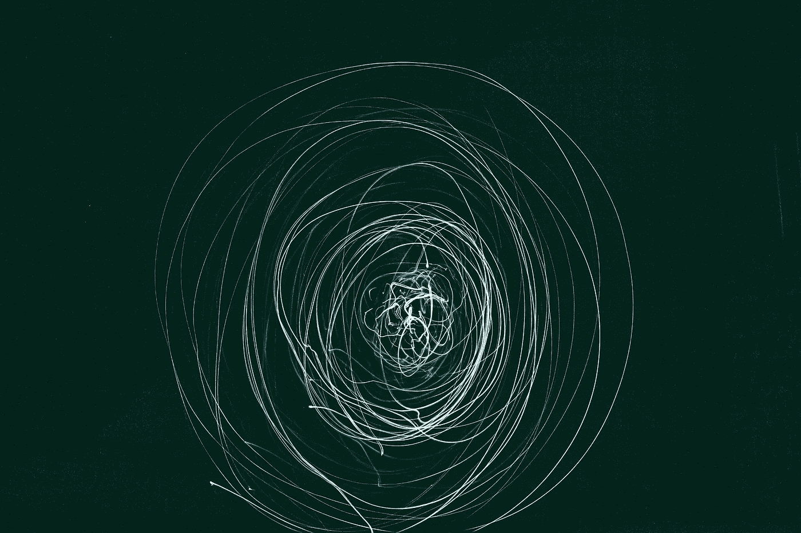
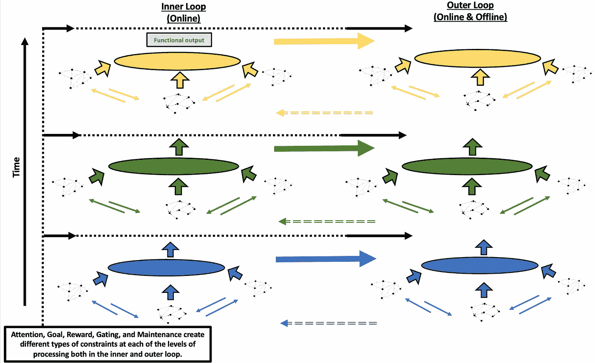
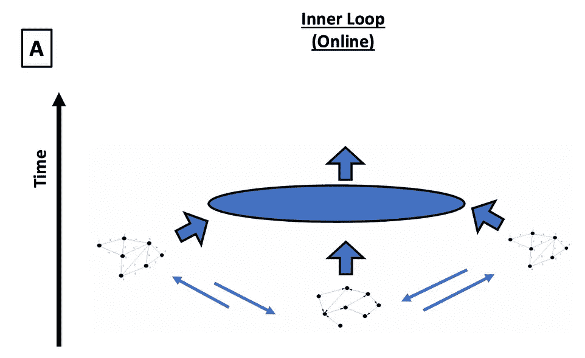
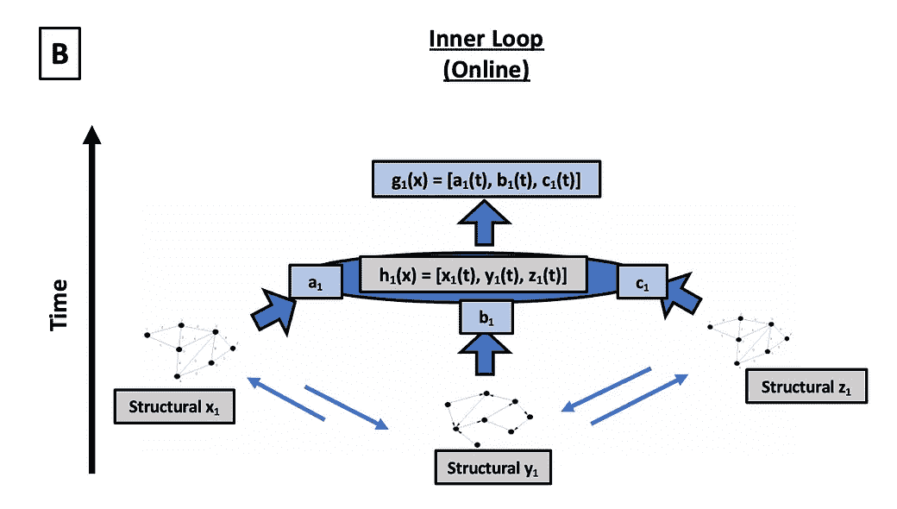
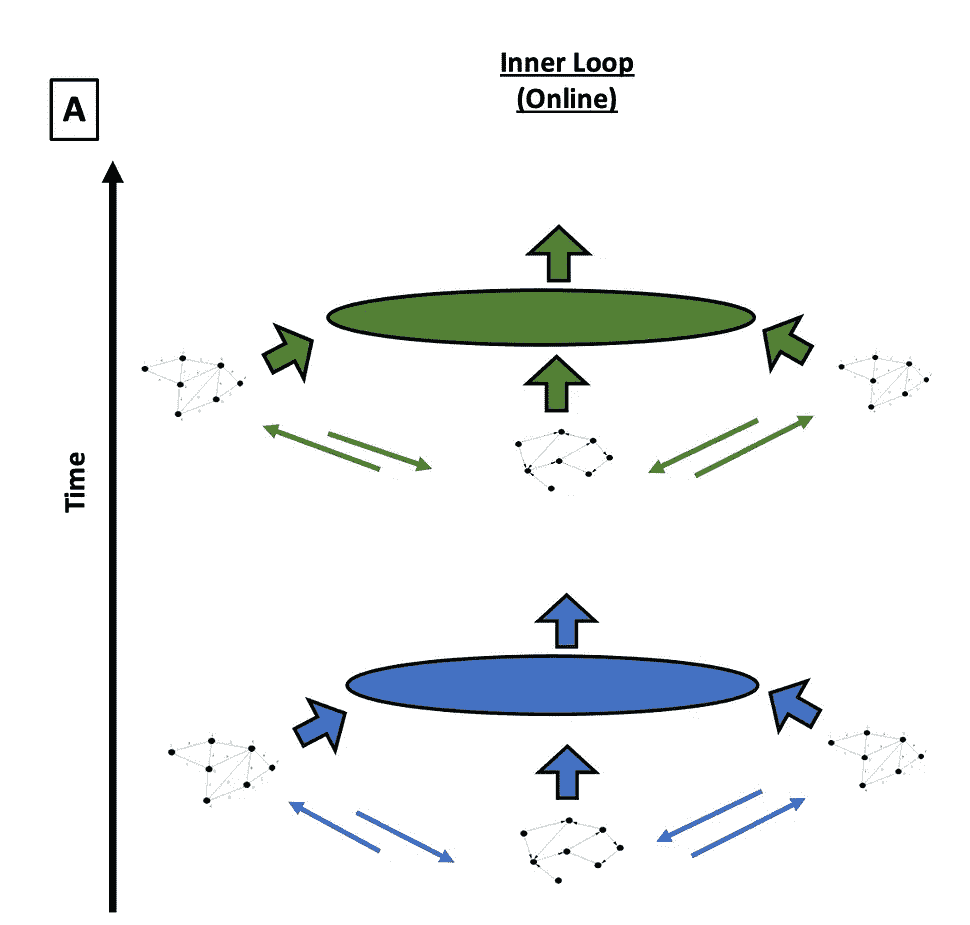
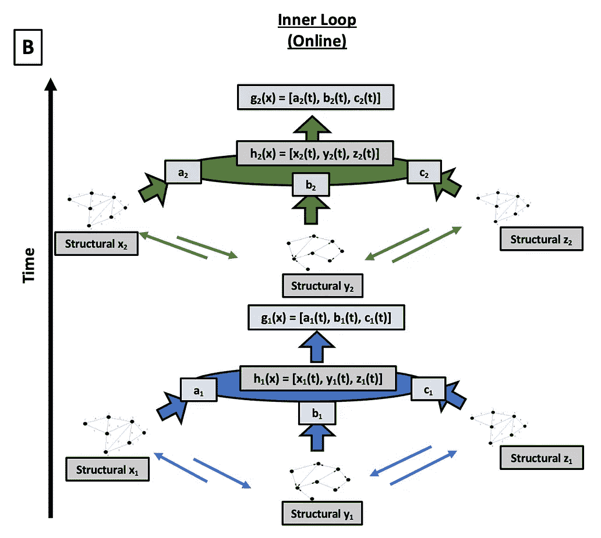
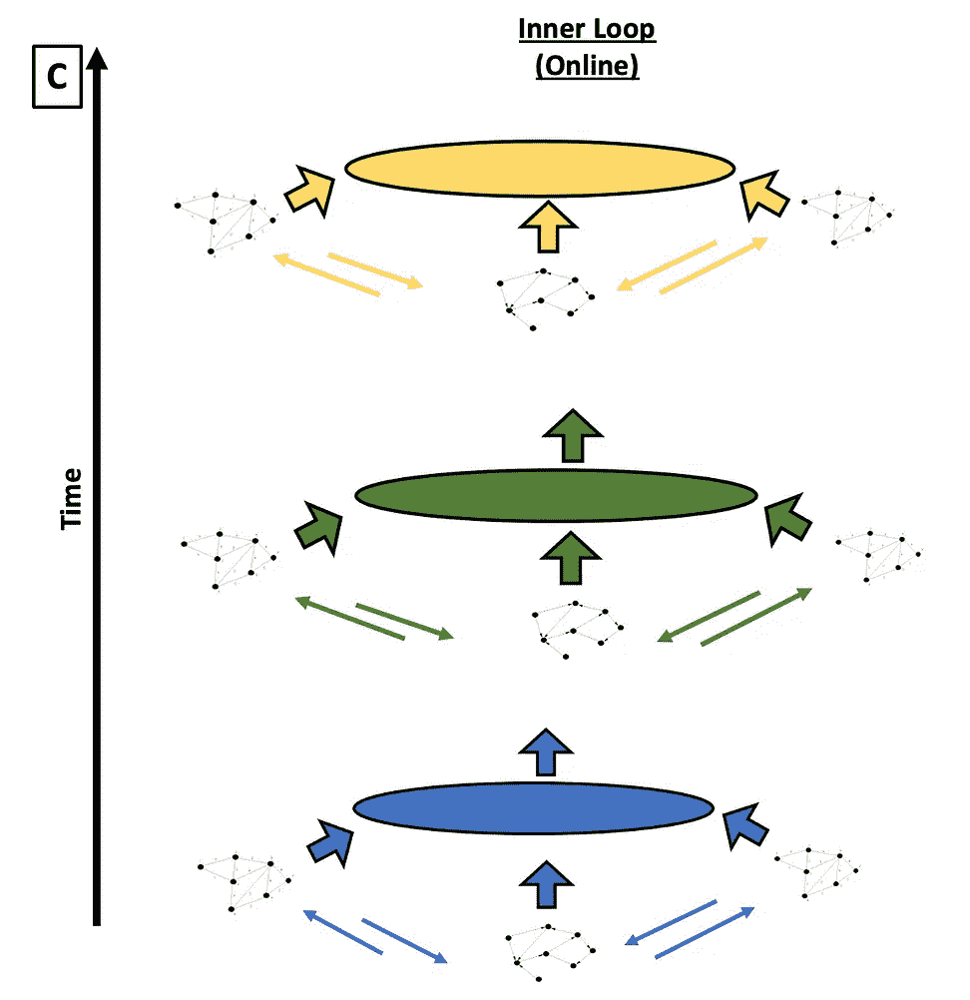
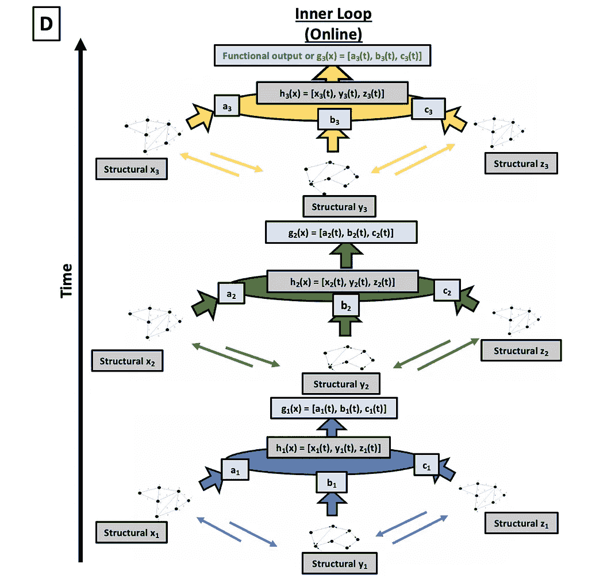
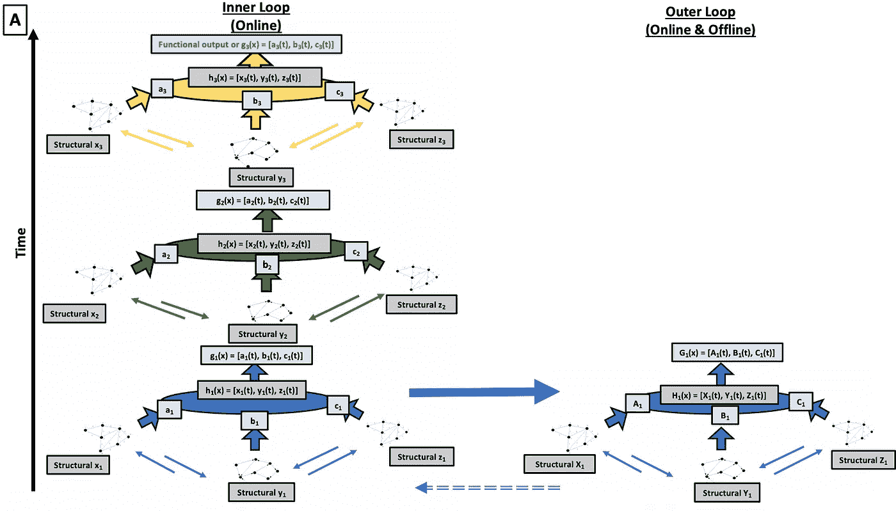
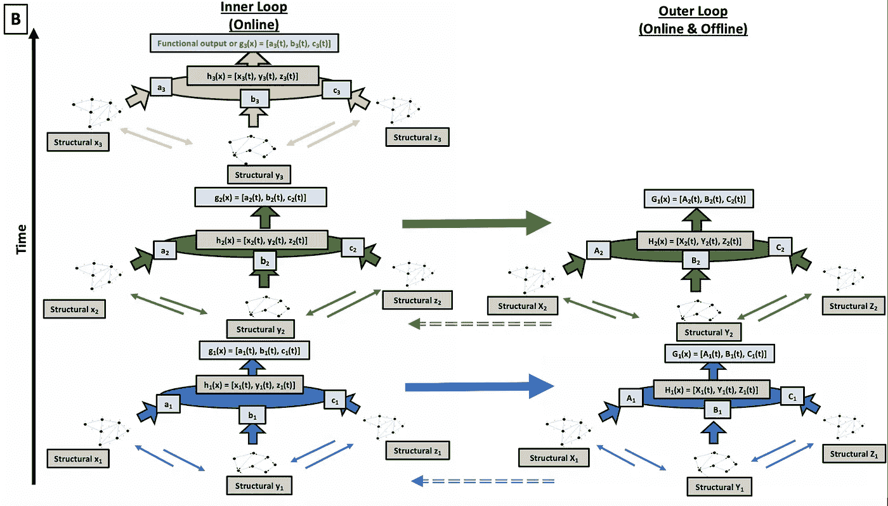

# 弥合人工智能和人工通用智能之间的鸿沟

> 原文：<https://towardsdatascience.com/bridging-the-gap-between-artificial-intelligence-and-artificial-general-intelligence-a-ten-e77c3084f9f7>

## 类人智能的十诫框架

> ***作者****:****Ananta Nair*(1，2) *和 Farnoush Banaei-Kashani*(1)
> *1。科罗拉多大学丹佛分校，2。戴尔技术公司***

**

*Gert RDA valasevi it 在 [Unsplash](https://unsplash.com/?utm_source=unsplash&utm_medium=referral&utm_content=creditCopyText) 上拍摄的照片*

# *介绍*

*虽然人工智能(AI)的概念似乎是一个未来的前景，但创造人工智能的愿望长期以来一直是人类的愿望。追溯到大约公元前 700 年的古希腊神话是第一个机器人塔罗斯。塔洛斯是赫菲斯托斯神创造的，用来守卫克里特岛，向进犯的船只投掷石块。有一天，一艘船靠近了这个岛，这个岛，这个庞然大物自动机不知道，将成为他最大的挑战。为了逃离机器，船上的女巫美狄亚设计了一个巧妙的计划，并向机器人提出了一个交易；赐予他永生作为移除他唯一的螺栓的回报。令人惊讶的是，这一提议引起了塔罗斯的共鸣，他还没有掌握自己的本性，也不理解自己对诸如永生之类的人类欲望的渴望。虽然这个故事以这个巨人的悲剧告终，但它确实表达了人类长期以来对创造智能的渴望和恐惧，以及人和机器之间的模糊界限，这是一个今天日益突出的挑战。*

*从古代世界的机械玩具到科幻小说中若隐若现的反乌托邦世界末日场景，人工智能的创造和发展长期以来一直在人类的脑海中。尽管许多人会争辩说这个领域已经经历了许多爆发和萧条，但过去十年已经取得了迄今为止最显著的进步。这些进步很大程度上来自于深度神经网络，这些网络已经成为视觉、自然语言处理和强化学习等领域的专家(Brown 等人，2020，Ramesh 等人，2022，Chowdhery 等人，2022，Schrittwieser 等人，2020，Ye 等人，2021，Baker 等人，2019，Arnab 等人，2021)。它们的应用范围很广，商业和实际部署似乎永无止境。面部识别等应用程序(Balaban 等人，2015 年)在我们的手机和日常生活中找到了共同的位置；像 Alexa 这样的虚拟助手是从 IBM 的鞋盒(Soofastaei，2021)迈出的重要一步，它只能识别 16 个单词和数字；在线翻译器能够在任意两种或多种语言之间进行精确翻译(Fan 等人，2021)，强化学习代理在棋盘和视频游戏等一系列复杂任务上实现了人类和超人的性能(Schrittwieser 等人，2020，Silver 等人，2018，Berner 等人，2019，Vinyals 等人，2019)。即使在学术界，这些工具也在一系列不同的努力中取得了重大突破，包括天气预测，蛋白质解折叠，心理健康，医学，机器人学和天体物理学(Ravuri 等人，2021，AlQuraishi，2019，Su 等人。al，2020，Lusk 等人，2021，Gillenwater 等人，2021，Pierson & Gashler，2017，Huerta 等人，2019，George & Huerta，2018)。*

*无可争议的是，这些事业中的每一项都因其独特的成就而值得称赞。然而，要达到类似于自然界的一般智能，这个领域还有许多工作要做。深度网络与 GPU 的进步合作，加速了数据处理，以掌握模式识别和其他基于统计的学习，监督和基于规则的学习，无监督和训练测试泛化，以及强化和多智能体学习(朱，2005 年，卡鲁阿纳和尼古列斯库-米齐尔，2006 年，萨顿和，2018 年，O'Reilly 等人，2021 年，莫利克等人，2020 年，贝克等人，2019 年，Stooke 等人，2021 年)。这些巧妙的数学算法和数据密集型处理技术通过将稀疏问题空间转换为密集采样，其分布可以被积分或过度拟合，从而在理想条件下取得巨大成功。这些网络甚至可以进一步转移到分布外学习，通过整合训练和测试集来实现这一点(Vogelstein 等人，2022)。然而，这种方法的一个常见副作用和日益严重的问题是创建了数据敏感的黑盒，这些黑盒难以在其明确定义的参数化之外进行归纳(Lake 等人，2017 年，Geirhos 等人，2020 年)。这些挑战使当前的人工智能工具成为伟大的优化器，但它们仍然达不到传统的智能。*

*相比之下，自然智能是进化工程的一个例外，人脑被认为是首要的例子。鉴于深度网络的最新成功但存在很大的局限性，人工智能领域现在比以往任何时候都更多地在神经网络能够做的事情和自然智能能够做的事情之间进行比较和比较(Vogelstein 等人，2022 年，Silver 等人，2021 年，Richards 等人，2019 年)。与人工智能不同，大脑不会在它试图最大化其奖励功能的绝望努力中，在每一项任务上展示或努力获得优异的表现。相反，它创造了卓越的通用学习者，这些学习者能够概括他们的抽象表现和技能，从而快速轻松地学习任何任务。这种方法不会在所有任务中产生卓越的总体表现，而是通过目标驱动的学习来调整行为，以创建一个只擅长高价值目标的系统，而其他任务的成功概率更低。这种类型的学习针对特定性能进行优化，同时留下足够的计算资源来充分执行所有任务。例如:运动员和士兵可能擅长需要场景整合、策略和身体或反射能力的任务，但是科学家不需要在这些领域中表现出色，而是可能在逻辑和推理上表现出色，或者在微调的运动动作上表现出色。虽然每个职业都可以学习其他职业的技能，但人们会根据与他们的目标一致的高价值目标来优先考虑他们的表现。*

*我们相信，这种基于创建一般目标导向的学习者而不是过度训练的特定任务代理的最大化架构学习的方法是更智能系统出现的关键。在本文中，我们使用大脑作为灵感，来识别我们认为对高阶认知至关重要的关键属性。介绍的下一部分将剖析大脑功能的组成部分，这些部分可以解决当前人工智能工具中存在的显著限制。鉴于导言的最后一节提供了框架的总体总结。接下来，第二部分阐述了我们认为导致智力的大脑功能的关键特性。这些被认为是十诫，我们相信智慧不是来自一个单独的戒律，而是来自一个包罗万象的系统，它的总和比它的一部分更强大。最后，第三部分阐述了如何将这些戒律引入到人工智能系统开发的框架中，从统计优势过渡到一般智能。虽然本文主要讨论的是可能导致类似于自然智能的自主人工智能的组件组装，但我们相信，在最终目标不是一个无所不包的系统的情况下，个人戒律本身有利于改进无数的人工智能系统和工具。通过戒律和框架的介绍，我们相信模型可以根据需要放大或缩小。*

## *1.1 把大脑逗得散架；智力的悖论*

*许多深度学习模型在它们经过强化训练的任务上已经超过了人类的表现(Schrittwieser 等人，2020 年，Silver 等人，2018 年，Berner 等人，2019 年，Vinyals 等人，2019 年)。这导致一些人甚至认为，这些模型在抽象世界和执行战略前瞻的方式上类似于人类(克罗斯等人，2021 年，巴克纳，2018 年)。尽管这可能是真的，也可能不是真的，但可以同意的是，存在一个显著的相当大的限制列表，阻止人工智能工具展示使人类成为例外的一般学习者的流动智能。虽然人工智能存在许多问题，但我们认为最显著的局限性是:1)训练时间长(Schrittwieser 等人，2020，Chowdhery 等人，2022，Berner 等人，2019)；2)无力绘制新的路径来更好地指导学习；以及 3)无法概括到新的或日益复杂、不确定和快速变化的领域(Poggio 等人，2019 年，Geirhos 等人，2020 年)。学习和保留特定任务数据的方案使深度网络如此成功，但也限制了它，因为它迫使网络使用计算密集型数据驱动的白板方法，而不是允许模型建立在它们所知道的基础上。这种僵化的问题不仅导致了长时间的训练，而且在复杂的领域中也导致了对这些网络的可信度和可靠性以及他们对所承担的任务的真正理解的令人生畏的调查(Geirhos 等人，2020 年，Hubinger 等人，2019 年，Koch 等人，2021 年)。*

*另一方面，人们相信自然智能，无论是人类还是动物，要么与生俱来，要么很快发展出先天知识，他们可以利用这些知识来建立越来越复杂的环境层次表示，并随着时间的推移而展开。尽管这种知识是什么，以及它是如何被进化编码的仍有争议，但它表明，自然智能并不遵循白板或白板方法(Wellman & Gelman，1992 年，Lake 等人，2017 年，Velickovic 等人，2021 年，Silva & Gombolay，2021 年)。此外，越来越多的人认为，大脑通过将世界分解成最小的组成部分来接受世界，尽管神经科学家不确定输入是如何处理以创建内部模型的。众所周知，这些最小的组件或概念通常被称为(van Kesteren 等人，2012；2017 年吉尔波亚&马莱特；van Kesteren & Meeter，2020 年)与日益增加的复杂性分层次地结合，以生成环境的内部模型。人们普遍假设，大脑能够通过将信息组织成抽象的整体梯度来做到这一点。这些梯度符合一个包含过程的关系记忆系统，如维持、门控、强化学习、记忆等。，不断地更新、存储、重组和回忆随着时间的推移而展开和加强的信息，以形成广义的结构知识(Whittington et al .，2019)。*

*智力的第二个支柱是将世界置于一个不断增加的复杂性和可操作的目标和子目标的关联框架中的能力(O'Reilly 等人，2014 年，O'Reilly，R. C .等人，1999 年，Reynolds & O'Reilly，2009 年，O'Reilly，2020 年)。正如 Hubinger 等人在 2019 年和 Koch 等人在 2021 年所争论的那样，当前的深度网络建立目标以分配给优化器，但是然后利用不同的模型来执行动作。这就产生了一个具有指定目标的优化器，然后这个优化器又优化了一个可以在现实世界中运行的模型。这种类型的架构不仅会导致创建者和被创建者之间的目标匹配问题，还会导致信任和可解释性的问题。例如:作者把一个代理人放在一个环境中，它必须找到并收集钥匙，用这些钥匙打开箱子并获得奖励。训练和测试环境之间的区别是对象的频率，训练集的箱子比钥匙多，而测试集的钥匙比箱子多。人们发现，环境中的这种简单差异足以迫使代理学习一种与预期完全不同的策略，即找到钥匙比打开箱子更有价值。这一结果的出现并不令人惊讶，因为代理人将钥匙视为最终目标，而不是子目标。因此，在测试中，代理不仅收集了比它可以使用的更多的密钥，而且还重复地在屏幕上显示的库存密钥区域上画圈。当部署在其训练集之外的环境中时，深度网络通常会看到这些类型的非预期策略，这导致了对深度网络输出的日益增长的关注和日益增长的怀疑。*

*另一方面，人类，甚至儿童，可以很容易地解决这个任务，因为他们使用策略的组合来决定他们的行动。当一个孩子被要求玩或观看另一个人玩视频游戏时，他能够仅基于几个学习实例来推断游戏的目的是什么，以及什么行为可以被认为是好的(奖励)或坏的(惩罚)。我们认为，幼儿的抽象水平很可能与训练有素的神经网络没有太大不同，即限制和定义抽象的复杂性和数据点可能具有相似的程度。例如:儿童将能够成功地识别他们与之互动的动物，但会像卷积神经网络一样与模糊的狗或猫的例子进行斗争。然而，儿童能够解决深层网络未能解决的任务的原因是由于以下技术的混合。虽然最初儿童可能有很高的错误率，但是他们能够通过以下方式快速学习:(1)利用学习技术的组合，例如由强化学习信号引导的指导、监督、自我监督、无监督、预测和试错学习，以形成他们环境的灵活表示，实现相同的结果，(2)利用相似性和不相似性作为基准，基于他们已经知道的对新的表示进行比较和分组， (3)询问探查性问题，例如如何、做什么和为什么确定状态转换，(4)建立和确定代理需要满足的目标和目的，(5)能够离线以新的和新颖的方式组合表示，以及(6)能够建立表示之间的因果关系。*

*我们认为，自然智能中出现的每一种学习策略都允许儿童在成年后采用他们所知道的抽象概念并构建复杂的模型。为了在一个例子中找到根源，让我们探索一个孩子将如何学习制作咖啡，或者在机器人学中经常被称为咖啡制作任务(Tsai 等人，2010)。儿童通过不断与他们的世界互动，发展灵活的运动和对环境的理解。他们不是从一种类型的训练中学习，例如有监督的或无监督的，而是利用不同训练技术和步骤的组合来达到相同的结果。这可能包括从指导中学习，观察别人，以及使用试错法。此外，通过利用多种但相互联系的形式如视觉、听觉、体感等形成的表征。有助于限制类别并形成更丰富的表示。对儿童来说，咖啡壶的表现包括视觉特征、其各种组件(如玻璃和塑料)的声音和感觉，以及赋予其容纳液体能力的形状和可拆卸顶部。我们相信表征的多模态表征的灵活性和丰富性对于允许更高水平的认知区域为世界构建复杂的表征和计划是至关重要的。*

*通过这个学习实现目标的过程，孩子会在内部或外部提出问题，以推理为什么以及如何执行特定的行动或导致特定的结果。这可能包括推理一个特定的物体是否足够大以容纳咖啡或水，以及应该使用什么样的步骤组合，首先装入咖啡或水。儿童进一步将环境的新表征与他们经历的过去表征进行对比。这可能意味着一些场景，例如将咖啡壶与其他盛液体的容器(如水瓶和水壶)进行对比，或者将它与他们过去见过或接触过的机器进行对比。儿童将使用这些表示以及指示的或自我施加的行动-结果配对来学习规则，这些规则可以形成更好更快的可操作计划。这种规则的一个例子可以包括将咖啡放在较小的容器中，而 12 杯咖啡需要较大容器中的水或 5 勺咖啡。我们相信，在任务的每一步中从现实世界中学习到的东西，将会产生一个比网络所能接收到的更加切实和有效的奖励信号。例如，如果孩子省略了添加咖啡的步骤或向机器中添加了过多的咖啡，他们将接收到比传统深度网络接收到的信号更明显的奖励或惩罚信号，从而促进更快的学习。这种学习既可以在线使用，以形成行动或结果之间的因果关系，也可以离线使用，在思考过程中模拟和简化行动，以在未来获得更快或更好的结果。*

*从神经学的角度来看，我们认为最大化学习的另一个优点，以及创造能够在大脑中跨任务域概括或转移的抽象概念的能力，是使用专门的专家。这些在结构上设计好的体系结构接受特定类型处理的特定输入，并产生在结构专家之间建立关联的功能输出。结构连接，顾名思义，是大脑中特定结构产生的连接，如灰质区域之间的白质纤维连接(Hagmann et al .，2008；伊图里亚-梅迪纳等人，2008 年；龚等，2009；Abdelnour，Dayan，Devinsky 等人，2018)。相反，功能连接与大脑区域之间的关系有关，通常不依赖于对潜在生物学的假设。功能信号是指随着时间的推移，大脑区域对的强度和激活。如果在记录的时间内区域的活动之间存在统计关系，则表明区域具有功能连接性。它可以被解释为两个或多个神经生理时间序列(如从 fMRI 或 EEG 获得的序列)之间的时间相关性和无向关联(Chang & Glover，2010；Abdelnour，Dayan，Devinsky 等人，2018)。如下所述，这些结构和功能表示可以跨由特定约束定义的级别以越来越大的复杂度进行分级处理。结构和功能连接在实现抽象和随后的大脑高级认知方面发挥着不同但相互作用的作用。我们认为，这种划分知识用于训练的方法是性能和泛化的关键优化器。*

## *1.2 组装大脑；框架路线图*

*如上所述，除了确定自然智能的关键属性外，我们还提出了一个框架来容纳它们，即十诫。这个框架的一个定义性特征是，它不是从一个单独的戒律中汲取力量，而是从一个系统中汲取力量，这个系统将所有的组成部分结合起来，使之比其各个部分更加强大。从本质上讲，我们认为大脑的运作基于可以分离和计算的基本原则。然而，正是这些原则错综复杂的相互作用导致了智能，而智能是很难隔离和定义的。本文的目的是确定这些基本原则，并提出一种执行智能的计算方法，以通知智能和自主人工智能的下一波浪潮。*

*我们模仿大脑中的优化和认知控制，将信息组织成两个层次的专家回路:内部和外部。这在很大程度上受到了全球工作空间理论(Baars 1993，1994，1997，2002 和 2005)和认知控制层次理论(Cushman & Morris，2015，O'Reilly 等人，2020)的启发。这种层次结构驱使行为从一个共享系统中出现，在这个共享系统中，内部循环与处理和完成特定任务相关联。这可能包括学习如何制作咖啡或其他任务，如导航，语言或翻译，以及信息分析。而外环执行整合内环信息的功能，以实现更复杂和更长时间尺度的认知(O'Reilly 等人，2020)。例如，这可以包括将制作咖啡的过程简化为最有效的策略，将以前制作咖啡的知识转移到新的机器上，或者甚至将以前制作咖啡的知识转移到其他饮料如茶或热巧克力上。类似地，在其他任务中，它可以包括导航到不同的目标，确定它知道和不知道的语言之间的相似性以理解单词，甚至超越统计决定论，为信息分析提供上下文化和个性化。*

*为了简单起见，如图 1 所示的框架被分成三层，每个层有一定数量的专家。尽管为了说明的目的选择了具体的数字，但是我们相信可以有 *n* 个层，具有 *n* 或 *m* 个专家。唯一的条件是内循环和外循环必须以相同的层数和每层相同的专家数相互模仿。这是因为外部循环是内部循环的模拟，只整合了内部循环中最显著的或奖励门控的信息。在大脑中，由于没有重复的区域，相同的大脑区域执行两个环路的角色。然而，为了更好地解释和透明，我们将循环复制到两个独立的实体中。诸如导致奖励或惩罚的门控表示以及由内部循环记录的环境中的显著事件或物体被传递到相应的外部循环专家和层。所有的任务都是如此，因此外部循环可以整合和巩固最相关的表示。外部循环的处理包括细化表示以开发更好的计划，重新组合表示以创建新的和新颖的动作，以及对内部循环施加自上而下的影响以改进实时处理。*

*对于这两个循环，每一层都接受许多专家的意见，这些专家是特殊的体系结构，具有最大限度地提高特定特性(例如:视觉、听觉、体感等)性能的属性。).来自结构专家模型的信息以公共语言进行处理和输出，该公共语言可以通过层中的横向连接进行集成和约束，以促进多模态表示。比如:约束一个咖啡机的形象，用冲泡咖啡的声音，形成一个更复杂的咖啡机品类。这种相同的处理可以应用于各种不同的领域，包括猫和狗的分类任务，其中狗或猫的图像受其声音和体感特征的限制，以形成更复杂的类别来识别动物。最终的公共语言输出是该类别的函数表示，并且包含跨多个结构专家的最终核心约束信息。如上所述，这可以包括由横向连接的专家确定的类别的复杂多模态表示。从第一层输出的功能信息被输入到第二层的结构专家中，他们反过来使用这些信息来创建更复杂的功能表示，以输入到第三层。该过程可以在层级的每个增加的级别上进一步重复。例如，第一级的处理可能导致形成多模态表示，而第二级的处理可能导致场景整合和动作建议，最后，第三级的处理将涉及基于预测和动作执行来评估动作。*

*内部和外部循环都以这种分层方式运行，仅有的两个区别是 1)形成的抽象级别和发生的处理的复杂性；以及 2)只有内部循环与真实世界交互，外部循环只能通过内部循环的自上而下的影响间接地这样做。当一个特定的行动-结果配对或一系列行动受到奖励，一个突出的或意想不到的事件发生，或给予一个大的惩罚时，系统通过门控信息进行学习，训练好的表征，训练坏的表征。然后，来自各个内部循环层的这些门控输入中的每一个被传递到相应的外部循环层，以便以更慢、更集成的方式保留、改进和重新组合表示。这个过程允许对动作进行分组，以创建更灵活的可概括的表示，这些表示可以在将来应用于相同或类似的任务。然后，外部循环可以使用这些表示对内部循环施加自上而下的影响，以更快地行动或使用新的行动组合。例如，如果经过反复试验，一系列动作成功地调制出咖啡，那么这个过程中涉及的所有表示都将被选通到外部循环中。然而，当内部循环重复任务时，外部循环将学习精简所有门控表示，以建议内部循环仅采取导致最快奖励的一组动作。*

*此外，为了更好地指导行为，框架的输出被结构化为目标导向的，被描述为全局 *F(X)* 函数，其中 *X* 被最大化用于特定目标。为了进一步调优系统，还使用了其他约束，如注意、维护和门控。该系统创建多个目标，每个目标被优化为特定的行为策略(例如如上所述制作咖啡，在饥饿或需要资源时获得食物或电池充电，以及在躲避天气因素时获得庇护)。这些目标中的每一个都通过使用注意力来关注最相关的信息，并通过门控和维护来鼓励系统保留该信息，从而最大化一系列导致奖励或惩罚的行动。然而，应该注意的是，不给予目标的优化和系统的外部循环完全控制，诸如注意力之类的约束可以重定向模型以关注更紧迫的目标，这些目标是时间敏感的或者可能威胁系统的整体健康的显著环境事件。例如在寻找食物时有捕食者出现，或者在煮咖啡时厨房里有火。*

*最后，可以被称为记忆的信息的学习、保持、提炼和重组由动态模型来表示。我们认为，与计算机科学不同，记忆不是一个静态的信息术语，而是一个动态的实体，它包含各种过程，如存储什么，训练和学习什么信息，以及如何随着时间的推移改变、重组和完善表示。在我们的框架中，每个专家都被表示为一个动态模型，其记忆或表示存储在专家内部的本地级别，而全局存储为跨一层和跨所有层的所有专家的累积。然而，与静态数据不同，这些存储器或表示在内环或外环中的在线或离线处理期间根据需要不断更新、改进或重新组合。最后，由于它们的统计能力，机器和深度学习技术被用作理解和优化这些动态模型的非线性的手段。*

**

***图 1:** 十诫框架图*

# *大脑功能的十诫*

## *I)大脑使用在多种形式上受过训练的多名专家，这些专家在横向上相互影响*

*与传统的计算技术不同，大脑有一个非常丰富、复杂和多模态的学习环境。例如:人类不只是将狗的类别作为视觉表征来学习，而是一个多维阵列，包括多种感官，包括听觉(吠叫)、嗅觉(麝香味)、体感(皮毛感)等。这些表示每个都由独特的专家构建，该专家基于特殊的结构分析来处理信息(例如:通过听觉皮层对听觉输入进行傅立叶分析，或者通过视觉皮层对视觉输入进行边缘、颜色和纹理检测)。尽管这些不同形态的专家针对其特定角色进行了优化，但他们有能力横向影响彼此，以帮助微调表示，并鼓励专家之间的激活绑定到同一对象/类别(O'Reilly & Munakata，2000，Herd 等人，2006，Munakata 等人，2011)。*

*这种拥有多个专家的能力允许更好地定义输入、损失函数、处理和输出的生成，其中每个专家都专门用于特定类型的处理。这种架构还允许在网络输出的生成中有更多的可解释性和透明度。此外，让专家横向影响其他专家的能力允许创建更丰富的抽象，这些抽象被约束在多维模态之间，从而导致高度调整的局部和全局表示。受全球工作空间架构(Baars 1993、1994、1997、2002 和 2005)的启发，这种多模态技术已经开始被纳入深度网络，如拉德福德等人，2021 年，戈亚尔等人，2021 年，本吉奥，2017 年，以及德阿纳和库德，2021 年。此外，CNN 的横向连接(Pogodin 等人，2021 年)也被用来展示改进的性能。*

## *II)大脑使用稀疏分布式表示和双向连接*

*进化的首要目标似乎是减少面对噪音时的不确定性。自然智能必须驾驭现实世界外部和大脑内部的噪音。大脑使用大量的噪声，神经元必须学会选择性地训练，以确保只有一组专门的神经元在阈值以上活跃，对线索做出反应(Bear 等人，2020)。虽然变得活跃的神经元是高度调谐的，但它们也是灵活的，一个或两个神经元在序列中失败不会导致一个人无法执行任务(罗尔斯&特雷韦斯，2011 年，拉德福德等人，2021 年)。*

*稀疏分布式表示是大脑用来确保对输入进行分类的多种不同方式同时有效的技术，例如跨专家。这些表征在大脑不同层次和区域的连续激活被认为是智能行为出现的主要驱动力(Beyeler 等人。al，2017，Nair，2021，Ahmad & Scheinkman，2019，Ahmad & Hawkins，2016)。此外，双向连接使用这些稀疏的分布式表示，让许多大脑区域的神经激活共同工作，以编码复杂的表示和抽象(O'Reilly 等人，2012 年)。*

*双向连接对于多重约束满足、注意力和吸引子动力学也是必不可少的。通过允许网络稳定，它允许创建一个稳定和干净的噪声输入表示(O'Reilly，Munakata，Frank 等人，2012)。然而，这种机制显然被下面讨论的学习动力进一步加强了。一些人工神经网络架构已经开始利用这些技术，如 Grewal，2021，Hunter 等人，2021。*

## *大脑使用抽象概念*

*虽然我们对大脑实现飞跃的神经过程知之甚少，但许多人怀疑魔法在于它创造的抽象类型(van Kesteren 等人，2012；2017 年吉尔波亚&马莱特；范·凯斯特伦&迈特，2020)。大脑是一个优化的一般智能系统，它被认为能够通过创建灵活的知识结构来快速和动态地学习，这些知识结构可以以新的和新颖的方式进行组合、重组和应用。这些知识结构允许生物体通过有效地分解复杂的输入并将信息编码成许多小块或抽象的心理结构来摄取世界。这些抽象然后被内部处理以构建被解释的现实的内部模型。虽然对模型输入的进展没有很好的理解，但人们普遍假设大脑通过组织成抽象的全局梯度来做到这一点(Taylor 等人，2015；美素拉姆，1998 年；琼斯&鲍威尔，1970)。*

*这种将信息组织成抽象的全局梯度，并且在此基础上的学习操作可以被认为是连续吸引子模型(Whittington，Muller，Mark 等人，2019)。在这种框架中，随着信息的获取，吸引子状态通过错误驱动学习稳定为共同的吸引子状态，具有噪声输入模式的清理后的稳定表示(O'Reilly 等人，2012)。出现的稳定表征利用自组织学习来反过来构建知识结构和系统，从这些知识结构和系统中可以出现复杂的认知。这种跨层级的表示的建立允许信息从输入按比例增加到认知的顶点层，例如推理、意识和其他更高级认知的有形行为。此外，结构和功能连接都是重要的部分，它们在大脑中扮演不同但相互作用的角色，以实现抽象和随后的更高层次的认知(Nair，2021)。*

*虽然起源于神经科学，但抽象形成和吸引子动力学的假设对人工智能社区具有很大的影响(等人，2018，任等人，2019，，2018，Ilin 等人，2017，Ashok 等人，2020)。虽然还没有完全理解在深度神经网络中形成的抽象概念在何种程度上类似于大脑，但它确实是当前和未来研究的基础。*

## *IV)大脑使用等级系统*

*长期以来，人们一直假设认知行为存在于一个层次结构中，在这个层次结构中，抽象通过增加维度级别来慢慢组合，从而达到更高层次的表示。(博特维尼克，2008；巴德雷&尼，2018；D'Mello 等人，2020 年)。根据包括 Taylor 等人(2015)在内的许多神经科学家的说法，金字塔结构的最低层代表视觉、听觉和体感等输入，而最高层代表意识、想象、推理和思维。*

*随着抽象表示在内循环和外循环的层次中建立起来，跨处理区域的信息最终被转换成一般化的知识结构。在这个层级中，特定的大脑区域或专家以不同的复杂程度和维度局部地容纳结构表征，而它们跨层的整合激活导致相应的专门化功能表征。这些表示可以被优化，以在内部循环中为手头的任务构造动作和计划，或者被馈送到外部循环中，以随着时间的推移创建甚至更复杂的高维度抽象，这可以创建长期目标、结果以及最终的世界模型。此外，该信息通常可用于优化内部循环和长期认知。这些局部和全局层中的每一层都有可能通过在不同分析级别上运行的约束满足来组织成一般化的知识结构。*

*虽然深度网络的当前技术水平确实利用了信息处理的层次结构(Murdock 等人，2016 年，Qi，2016 年，Kriegeskorte，2015 年)，但据我们所知，它们不包括使用专家创建类似于大脑的多层分析。我们认为，这种缓慢建立的语境化专家知识赋予了大脑一些认知能力。*

## *v)大脑有专门负责的区域*

*正如《戒律一》中所建议的，大脑学习创建多模态表征，这种表征可以被多种模态的多位专家所约束。尽管深度神经网络已经开始利用专门的模型进行多模态任务(拉德福德等人，2021 年)或强化学习中的多个头部(Schrittwieser 等人，2020 年，叶等人，2021 年)，但大脑在结构层面上优化其输入方面要专业得多。举例来说，仅在视觉处理领域，大脑就有一个处理信息的专门区域层级。*

*例如:初级视觉皮层或 V1 等较低的大脑区域被优化来处理边缘。而像 V2 这样的地区获取这些信息，并对其进行更高层次的处理。这可以包括确定颜色、纹理和背景-前景检测。在这些层之外，信息被进一步特殊化，分为“什么”和“哪里”路径，并且信息基于类型跨路径分布。“什么”层级的顶部是代表完整对象的下颞叶皮层(IT),“哪里”层级的顶部包括基于诸如注意力、维持和奖励等约束来引导迅速扫视或眼球运动的区域。通过自上而下的影响，这些相同的约束被进一步施加到较低水平的“在哪里”路径上。我们认为，这种自上而下的影响导致约束(如关注、维护和奖励)以不同的方式体现在我们框架中不同的结构专家身上。*

## *VI)大脑有需求，但也有目标、需要和欲望*

*自然世界中的生物是目标导向的，很可能源于进化本身。人类和动物都有需要，必须满足这些需要才能延长生存时间。当一个特定的需求被激活时，它被转化为一个目标，这个目标动员系统集合行动以获得一种特定的回报。虽然行为并不总是以目标为导向，如在探索或试错策略中所见，但即使在这些情况下，通过将突出的事件置于专注于目标的行动-结果对中，也可以学习到突出的事件，这些目标可以在以后利用。*

*另一方面，深度神经网络不会像人类一样将世界规划成可操作的目标，因为它们不会面临相同的环境和资源压力。虽然可以说深层网络有他们需要达到的目标，但通常他们的生存和健康并不直接依赖于它。人类和动物从他们周围的世界快速学习，不仅因为他们可以形成灵活的多模态表示，用于在世界上行动，而且因为他们学习的训练信号更有效。例如，吃错食物或不注意捕食者会对活的有机体产生可怕的后果，而深度神经网络会收到惩罚信号并重新开始游戏。由于这种生存偏见，大脑有大量的不动产用于处理和学习负面信息，并通过多巴胺途径预测奖励的消失(Mollick 等人，2020 年，Schechtman 等人，2010 年，Pignatelli & Beyeler，2019 年)。因此，这表明大脑被优化来微调学习以满足生存需求，无论是在持续实现相关目标还是在几次接触中从负面事件中学习。*

*虽然目标很重要，但它们不是绝对的。一个特定的目标可以优先指导行为，然而，如果一个不同的显著事件将注意力引向另一个目标，那么追求这个相同的目标可以在背景中维持。例如:如果动物正在寻找食物，饥饿的目标是指导行为以最大化食物，然而，如果一个突出的事件引导注意力，如附近捕食者的位置，食物的目标将保持为子目标，而逃离预测者的新目标将主导行为。在将完成一项复杂的任务分成更容易实现的子任务时，子目标也非常重要。*

*此外，与深度神经网络不同，除了目标，已知至少人类有需求、想要和欲望。我们认为这是制定奖励和实现时间目标的动机成分的表现。需求可以被认为是生存所必需的可操作的项目，一旦被激活，就会产生一个需要在短时间内实现的目标。另一方面，欲望是不直接与生存相关的需求，因此不会被迅速追求(例如:想要一块巧克力)。最后，愿望是更复杂的目标，需要满足多个子目标，对时间最不敏感(例如:想去托斯卡纳旅游)。这些需求和欲望很可能只在人类或可能具有更复杂认知能力的动物身上看到，以驱动系统获得新的或更好的奖励，这些奖励目前并不存在或对生存至关重要。据我们所知，这种类型的建模尚未在传统的深度网络中完成，仅在其他人工神经网络中部分完成(Herd 等人，2021 年，O'Reilly 等人，2010 年，O'Reilly 等人，2014 年，O'Reilly 等人，2020 年)。*

## *VII)大脑不仅仅是强化学习*

*尽管强化学习可以说是大脑用来学习世界的一个不可或缺的重要部分，但它不是唯一用于学习的机制(萨顿和巴尔托，2018 年，*

*加里埃皮和拉。，2014，O'Reilly 等人，2021，Doll 等人，2009，Mollick 等人，2020，Liakoni 等人，2022)。传统的深度学习网络使用类似于大脑中发现的基底神经节和皮质纹状体和中皮质多巴胺系统的演员-评论家系统(Mollick 等人，2020 年，Herd 等人，2021 年，萨顿和巴尔托，2018 年，Schrittwieser 等人，2020 年，Silver 等人，2021 年)。在该系统中，行动者接受国家的输入并输出最佳行动(或政策)，而批评家通过将其与国家价值函数进行比较来评估行动(萨顿和，2018，李，2017)。*

*虽然强化学习是大脑正在做的事情的一部分，但它是通过利用无数复杂的专门架构来实现的。例如:OFC 被认为负责刺激的情绪和动机值，ACC 对冲突和错误监控很重要，DLPFC 对复杂的高阶信息处理很重要，PFC 对整合来自这些区域的输入和与基底神经节环路协调以促进行动反应很重要(O'Reilly，2010，Droutman 等人，2015，Bear 等人，2020，O'Reilly 等人，2012)。与传统的深层网络相比，大脑具有更加复杂的层次和专门的架构，允许处理定义奖励的不同特征。这些专门区域通过四个核心机制被进一步驱动学习；1)在复杂性上分层构建的专用架构；2)自上而下的影响和约束条件的使用，例如关注、维护和奖励，这些约束条件以不同的方式在不同的级别和专家之间表现出来，以迫使系统改进其学习和输出；3)使用预测学习作为一种机制，基于系统所知道的来预测一个动作将具有的结果；以及 4)利用一系列不同类型的学习，例如监督的、自我监督的、非监督的、预测的、指导的、镜像的、试错法，来训练和定义它的奖励信号，以便它能够更好地理解世界。*

*我们相信，使用受注意力、维护和门控约束的组合学习的巨大好处导致利用不同的技术来约束系统，以形成相同动作结果的不同但重叠的表示。这有助于创建更灵活的、可以概括的表示。这一点在机器人学习中已有一定程度的体现(陈等，2021)。此外，将奖励训练作为实现特定目标的手段有助于情境化学习，以便不同的奖励可以被不同地看待，例如:在人类中，饥饿时吃食物的奖励与购买第一套房子的奖励是不同的。据我们所知，这还没有在深度网络中尝试过，但是我们相信这将对更好的情境化学习有很大的帮助。*

## *VIII)大脑使用串行架构或串并行架构*

*人们认为，决策或复杂的认知在人脑中并不是并行运作的(Herd 等人，2021 年，O'Reilly 等人，2020 年，Hayden，2018 年，Hunt 等人，2018 年，Herd 等人，2022 年，已出版)。思考这个问题最直观的方式是，由于大脑有专门的结构或专家专门研究信息处理的特定组成部分，所有不同层次的专家不可能同时参与进来。相反，当信息输入大脑时，它会在多次迭代中依次展开。层次结构第一层中的大脑区域很可能学会在并行操作中处理输入，然后将合并的表示连续传递给第二层专家，依此类推。在这个过程中，信息由相关领域并行地进行系统处理，然后被串行通信，以创建更复杂的抽象、计划和内部模型。另一方面，传统的深度网络并行处理多个信息流，以最大化 GPU 架构。虽然他们有一些专业化，需要进一步进入模型的串行处理，但它与大脑有很大不同(金等，2020，邓，2011)。*

*据信，将信息编码到网络中的串行方式和特定层中专家之间的并行处理也是大脑如此适应复杂决策的原因。与此相似的是决策的有声思维协议(Herd 等人，2021 年，Herd 等人，2022 年出版)。为了完成一个复杂的面向目标的任务，我们通常把它分成更小的连续步骤，只处理与这些步骤相关的信息。比如:计划旅行的时候；第一步包括汇编一份运输选择清单；第二步包括在我们的时间限制内选择哪种运输方式；第三步是比较成本；第 4 步需要预订最佳选项(Herd 等人，2021)。有趣的是，这种相同的串并行处理方式也适用于学习新材料。例如:作为新手学习广义相对论时，第一步包括学习简单的概念，如什么是行星？什么是太阳？什么是太阳系？；步骤 2 利用这些信息输入来建立更复杂的假设和抽象，例如什么是轨道或什么阻止这些物体相互碰撞，即重力；步骤 3 阐述了空间、时间和时空的概念；第四步讲述了什么是广义相对论。*

*我们认为，随着时间的推移，随着信息的连续展开，这种分层次建立复杂表征的方式是高阶认知的一个重要组成部分。此外，能够在不同抽象层次内部查询表示的过程，使用诸如何时、如何和为什么的陈述，允许我们更好地指导我们的学习，以形成更好地提炼和巩固表示并引导注意力的因果推理。神经科学的一些研究进一步表明，动物记录在评估选项时发现了串并行架构的使用(Hunt et al，2018)。最后，尽管串行-并行架构对于学习来说是最佳的，但人们认为，通过在实践良好的任务中使用并行架构，大脑可以随着时间的推移而优化(Herd 等人，2021 年，Herd 等人，2022 年出版)。*

## *大脑思考和推理*

*我们认为，人类和机器性能之间的一个重要区别因素来自思考和推理的能力。我们发现，幼儿很可能像当前的人工智能工具一样，开发简单的抽象概念和世界的内部模型，使它们只与他们训练的东西一样好。然而，在发展的过程中，儿童可以把他们所知道的东西，重新组合和提炼，以建立越来越复杂的成人对世界的描述和模型。我们相信这是可能的，因为人类有能力思考，或在他们的代表空间中漫步。人类和人工智能工具一样，也有计算或物理约束。例如，他们不能在世界上连续行动，例如，饥饿时无休止地寻找食物，口渴时无休止地寻找水，最终会耗尽他们所有的能量，导致死亡。相反，人类在精神上制定复杂的计划，然后选择他们应该在世界上执行哪些行动。这种在头脑中模拟世界的能力不仅允许我们组合我们已经学会应该配对在一起的表征，还允许我们组合新的表征。*

*就像一个神经网络可以用它的非策略来影响它的策略一样，人类也可以离线，结合表现来影响在线行为。在我们的框架中，当系统选择参与思考时，它可能会通过减少内环感觉机制(视觉、感觉、听觉等)的约束影响而离线，即较少的注意力、维护和门控被导向感觉输入。然而，内环低级感觉区域上的约束可以容易地响应于世界中高于阈值的显著刺激而被重新接合。通过减少对世界输入的关注，该系统可以将计算处理引向已经在系统的更高层次中形成的抽象。当系统在一个时间敏感的上下文中思考它正在解决的当前任务时，只有内部循环中的抽象是可用的。这包括与任务相关的抽象，以及来自外部循环的任何抽象，这些抽象先前已经被提炼以影响内部循环的行为。外环中的主动处理很像内环中的感觉区域，通过减少约束的影响可能会脱离。相反，当系统选择进行时间不敏感的思考或目标不敏感的思考时，通过减少对内循环或当前环境的关注，主动处理可能只发生在外循环中。然而，这种将处理限制在内循环或外循环的操作并不完美。当内部循环中注意力和其他约束没有被正确地施加时，系统将重新激活外部循环，并引入可能与任务不相关的新抽象，并对及时处理造成干扰。例如:在解决家庭作业问题时考虑午餐。*

*还应该注意的是，走神，即在没有目标强烈影响的情况下在表征空间中搜索，是可能的，因为所施加的约束是不完美的。当一个特定的任务是时间相关的，但是当前的抽象不能集中在一个解决方案上时，诸如注意力、门控和维护等约束不能对系统施加适当的支配。这导致系统在内部和外部循环表示之间徘徊。例如:当最后期限即将到来并且无法找到复杂问题的解决方案时，施加在内部循环上的约束会疲劳，并导致系统在两个循环中的表示空间中漫游，直到系统可以恢复并且可以再次正确施加约束。约束减弱的原因可能是由于系统缺乏收敛而导致的指数级资源消耗导致的计算疲劳。*

*这些心理模拟、记忆回忆和可能的走神机制都是默认模式网络的一种描述(Schacter et al .，2012，Zhou & Lei，2018)。一些研究还表明，这种相同的默认模式网络在睡眠期间也是活跃的(Horovitz 等人，2009 年，Sä mann 等人，2011 年，De Havas 等人，2012 年)。系统在睡眠期间离线或完全脱离的能力可能是必要的机制，允许信息的提炼和整合，以及抽象的灵活组合，从而导致更复杂的行为，如想象力、创造力、解决问题和概括(Rasch & Born，2013 年)。在走神期间，我们相信约束对内循环所有层面的影响都大大降低了。然而，另一方面，在睡眠期间，我们认为只有外环的较高层次是可用的，这就是为什么梦在最抽象的领域运作。最后，我们认为，当一项任务对时间不太敏感时，只有外循环在起作用。例如:当计划如何度过一个周末时，系统现在可以组合不同的和新的表示组合，而没有与任务相关的联系。*

*推理是思维的一个组成部分，它是一种机制，允许系统更好地指导和改进在表征空间中的搜索。我们相信推理是表达之间因果关系的公式化。虽然早期学习很可能是由简单的手段驱动的，如相似性和不相似性、模式匹配和强化学习，因为更复杂的机制如预测学习形成了，但系统很可能使用与目标相关的内部查询过程来将世界情境化并形成偶然的关系。这些内部查询过程将使用诸如“如何”、“为什么”和“何时”之类的语句作为假设测试行动-结果对、世界的变化以及行动与目标的相关性的手段。据我们所知，这样的思考和推理机制还没有在深度神经网络中被考虑或实现。然而，使用 SAT 解算器和想象力蒙特卡罗树搜索展开的硬编码推理外循环的示例已经实现(Ye 等人，202，Chen 等人，2019，Schrittwieser 等人，2020)。其他受生物学启发的模型包括 Russin 等人，2020 和 Russin 等人，2021。*

## *x)大脑与其他大脑协同工作*

**“人多力量大”*早有说法。这同样适用于构建更好的想法，或者更聪明的文明。人们不会在内部架构之外孤立地学习，他们会从丰富的多模态环境和其他环境中学习(巴塞特&马特，2017)。人类有专门的镜像神经元来模仿周围世界中的个体所采取的行动。当我们考虑在世界上实施这些行动时，以及当我们实际行动或被指示行动时，这种通过模仿学习也传播相同的途径到火(Heyes，2010)。此外，除了合作动态，竞争的作用也在驱动系统更好更快地学习表征的压力方面发挥了重要作用(Pinto 等人，2017，Baker 等人，2019，Sanchez，2017)。我们相信在学习过程中融入社会因素将会创造出一个更好更快的系统。*

*最近，多代理学习的使用已被纳入深度学习网络，并取得了巨大的成功。最显著的例子是 Open AI 的捉迷藏代理，Deepminds XLAND 代理(Stooke 等人，2021，Baker 等人，2019)，他们已经证明了一系列复杂的涌现行为。在机器人技术中，人类训练和人机团队以及竞争与合作实验已经证明了更快和更有效的学习(Chen et al .，2019，Pinto et al .，2017)。*

# *组装十诫框架*

*如上所述，我们的框架提出了一种将十诫融入一个系统的方法，这个系统可以通过数学和计算来执行。戒律相互建立，导致行为的出现，这种行为比它的单个组成部分更有力量。然而，应该明确指出的是，该框架的目的并不是提出一个解决问题的绝对解决方案，而是启发未来的架构和讨论，这些架构和讨论也可以建立在这些优势的基础上。*

*如上所述，该框架由两个层次循环组成；一个内环对应于处理手头的任务，一个较慢的更具整合性的外环在较长的时间框架内收集信息(O'Reilly 等人，2020 年，Cushman & Morris，2015 年，Schneider & Logan，2006 年)。为了首先组装内部循环，层次结构中的每一层都由专家构建。如图 2a 和 2b 所示，三个专家网络 *(x1，y1，z1)* 协同工作，组装出第一级*G1(x)=【a1(t)，b1(t)，C1(t)】*的输出。尽管可以使用任意数量的专家，但是他们必须遵守三个定义规则；1)每个专家被设计成只完成一种类型的处理(例如:视觉处理、听觉分析等。)，2)层中的专家必须横向连接，以及 3)来自每个专家的信息输出是可以在整个体系结构中表达的公共函数格式(即，全球通信语言)。*

*如图 2b 所示的三位专家 *(x1，y1，z1)* ，他们本身都是数据驱动的非自治动力系统*【ẋ】*=*f*(*x*， *t* ，*u*； *β* )。每个专家都有自己的一套描述其动态系统的变量，其中 *f* 代表动态(即，给定一个状态，系统在下一个时间步如何变化)；*x*代表状态， *t* 代表连续时间， *u* 代表控制输入， *β* 代表参数(Brin，& Stuck，2002)。对于每个动态模型， *x，u，*和 *β* 将是向量，其中， *x* 是系统的状态， *β* 是系统的不同多模态输入。这些输入可以是视觉系统的亮度、颜色和对比度，听觉系统的锐度或音量，以及躯体感觉系统的纹理、粗糙度和温度。在更高层次的分析中，如下所述，这些输入可能包括预测值、误差信号、发动机动作、建议计划或任何改变系统动态的因素。向量 *u* 将是对系统施加的不同控制，包括注意、维护和信息门控。这些控制对系统施加影响，并且我们相信随着时间的推移，系统将通过支配性的 *f(x)* 目标函数以及强化信号来学习。当网络收到对行动-结果对的奖励时，注意力将是一种对场景中相关显著刺激的紧急控制，这将影响记忆中信息的保持和门控。最后， *ẋ* 将是代表系统动态的微分方程(或向量场)。*

****

***图 2:** a)表示一层内循环的框架，b)表示下面给出的一层内循环的数学解释。*

*令人满意的是，通过使用数据驱动的动态建模方法，该框架远离了传统的机器和深度学习架构。然而，我们认为，由于其统计能力，当前的深度和机器学习网络对于成功找到理解系统动态的可解释解决方案至关重要。输入系统的数据会因专家而异，但数据来自自治系统的假设是正确的。为了网络学习模型的传播，每个专家的数据将被组合成一个初始的无价值问题。这些深度学习技术的统计能力的最大好处应该是有助于确定未知的 *f* 函数，在混沌中转移，以及找到坐标变换或新的坐标系，使得变换使非线性动力学看起来是线性的。稀疏回归或库普曼分析等技术已经开始使用(布伦顿等人，2016 年&。*

*随着机器学习掌握了统计空间，这些方法将成为应对非线性动态模型带来的诸多挑战的主要工具。未知和非线性 *f* 函数、不确定性和混沌以及潜在和隐藏变量等挑战可以重新表述为优化问题，其中机器学习模型可以针对数据进行优化(Brunton 等人，2022 年，Lusch 等人，2018 年)。在我们的框架中，机器学习模型可以在本地实现以理解每个专家的动态，并且在全局确定框架的总体输出，即用于创建反馈控制的所有动态模型专家的集体系统。这将需要专家根据输入进行优化，并实时主动操纵系统的各个部分，将参数转换为执行器，执行器将模型转换为反馈控制回路。虽然这种方法将在下一代人工智能工具的开发中提出新的挑战，但我们相信它将导致更透明和可推广的网络。通过使用由专业专家组成的框架，可以更好地约束投入和产出，并开发专家专用的透明度工具。调试和再培训专家将比当前具有更复杂的输入、输出和集成结构的网络更简单。此外，由于动态模型了解系统的潜在动态，即系统为什么以及如何变化，我们认为它们应该更容易适应新的和未知的情况。已经表明，动态模型对未经测试的参数进行概括，例如牛顿第二运动定律(Brunton 等人，2016 年)。我们相信这些可概括的特性也应该适用于这个专家的集体框架。*

*当用矩阵符号表示时，特征值揭示了一个动态系统将随时间做什么，或者更好地作为这些系统的解决方案。系统通常是正的、负的和虚的特征值的组合。负值表示减少和衰减或稳定系统，正值表示增加和爆炸，或不稳定，虚值表示振荡或错误和冲突。这些负特征值可能表示随机活动的减少和网络上稳定吸引子动力学的形成，而正特征值可能表示随机活动的增加和混沌和不稳定吸引子表示的形成。最后，虚特征值的作用可能会延伸到系统某些部分的激活错误，这可能会导致不正确或延迟的回忆。这可能会导致活动无法使正确的吸引子状态完全激活，从而导致诸如记错类别名称或错误地回忆过去信息等情况。*

*第二种技术和特征值的使用是图论，我们认为这是理解抽象、吸引子状态和创建一个跨框架的全球语言的关键。因为机器和深度学习方法可以帮助提供对底层系统的分析，以及找到用于将非线性空间转换成线性空间的数据驱动解决方案。我们相信图论及其子成分谱图论可以用于确定和理解这些系统中的知识成分。如上所述，像大脑这样的动态系统是连续的吸引子模型，它们组织成可以不断更新和重组的全局梯度。随着信息的输入，这些吸引子状态稳定为共同的吸引子状态，这些吸引子状态使用学习来创建稳定的表示，随着时间的推移，可以建立知识结构和系统(O'Reilly 等人，2012 年，Nair，2021 年)。通过双向和横向连接产生的分布式表示是确保这可以跨多个地区或专家发生并推动智能行为出现的关键(Nair，2021，O'Reilly 等人，2012)。在我们的框架中，每个专家都将配备所需的层内和跨多层的横向和双向连接。*

*如图 2a 和 2b 所示，三个结构专家网络 *(x1，y1，z1)* 协同工作，处理各自的任务。这种结构信息然后将被转换成功能表示 *g1(x) = [a1(t)，b1(t)，c1(t)]* ，这是来自每个专家的最重要组件的整体图像。例如:如果三个专家中的每一个都接受了类别狗的视觉 *(x1)* 、听觉 *(y1)* 、体感成分 *(z1)* 的训练，那么系统的集体结构输出将是他们的动力学的总和，表示为*h1(x)=【x1(t)，y1(t)，Z1(t)】*。另一方面，功能表示将包含该类别专家之间最相关的特性，并提供可以在整个框架中交流的全局语言。专家 *x1，y1，z1* 的结构信息将以通用格式( *a1，b1，c1* )输出，该格式可以跨层传递以约束和影响其他专家，即跨专家的横向影响将发生在这些通用语言表示上。例如:将狗的视觉(从专家 *x1* 获得，现在用全局可通信输出 *a1 表示)*与犬吠的听觉 *(* 从专家 *y1* 获得，现在用全局可通信输出 *b1 表示)*和皮毛的体感表示 *(* 从专家 z *1* 获得，现在用全局可通信输出*表示)*通过横向连接，这些公共语言输出( *a1、b1、c1* )通过创建复杂的多模态信息表示，影响专家个人处理和动态的整体画面的创建。此外，这些公共语言输出本身是非自治动态系统，其有助于层*G1(x)=【a1(t)，b1(t)，C1(t)】*的最终功能输出。*

*在大脑中，已经发现神经振荡是本征模式的线性叠加(Raj 等人，2020)。Abdelnour 等人，2018 年，证明了结构连接性和静息状态功能连接性通过拉普拉斯-本征结构相关。研究人员通过使用结构图的特征分解来预测结构和功能连接之间的关系，从而检验了这一假设。该特征向量全功能连接模型与健康的功能和结构人类数据以及非线性神经模拟进行了比较和验证。通过这一点，作者能够验证拉普拉斯特征向量可以在组结构水平上从独立成分分析预测功能网络。利用这些发现，我们相信使用解剖活动加权的区域间耦合，即结构专家，将影响神经结活动，以在我们的框架内显示相同的功能结果(Nair，2021)。因此，我们建议谱图理论可以用于隔离集群和约束基于专家内部和跨结构和功能关系的特征关系的抽象的神经集群。正如 Nair (2020)所假设的，通过将大脑可视化为一个网络，其中神经元充当通过加权连通性链接的节点，图论可以用于确定代数连通性。此外，对该网络的谱图论分析可以将连通性划分为其最小的子组件，从而产生具有高内部连通性和低外部连通性的抽象集群。这些集群可以表明信息是如何在结构专家和整个框架中被保留和操作的。可以进一步构建透明工具来理解抽象如何链接、更新、组合和重组在一起，从而更好地理解系统。*

*组装该框架的下一步如图 3 a 和 3 b 所示。可以将专家组织成分层结构，以便随着时间的推移对信息进行连续处理。尽管这里示出了三层，每层具有固定数量的专家，但是具有 *n* 或 *m* 数量专家的 *n* 层可以跨层存在。拥有串行和分级信息流的重要性在于，在每一层都会发生不同级别的处理，这些处理会通知下一批专家，这些专家可以进一步构建越来越复杂的输入信息表示，以确定适当的输出。图 3 c 和 3 d 进一步展示并建立了上面给出的内环路第二层和第三层单层的数学解释。每一层专家的数学处理与第一层保持相同，直到处理完成并执行输出。当信息被第一层专家处理时，功能输出被用于通知第二层的下一组结构专家，他们对这些抽象执行更复杂的分析。第一层中产生的函数输出通过拉普拉斯特征变换被转换回结构输入，以传递给第二层的结构专家。类似地，这些结构专家执行特定的处理并输出公共语言表示，该公共语言表示被横向约束并作为该层的最终功能表示输出，以传递给第三层中的下一组专家。在我们的例子中，第三层是框架的最后一步。它同样执行处理的最后一步，并向外界输出。*

********

***图 3:** a)表示扩展到两层的内部循环的框架，b)表示上面给出的扩展到两层的内部循环的数学解释，c)表示扩展到三层的内部循环的框架，d)表示上面给出的扩展到两层的内部循环的数学解释。*

*说详细点，如果第一层专家在对一只狗进行视觉( *x1* )、听觉( *y1* )、体感( *z1* )分析。功能输出 *g1(x) = [a1(t)，b1(t)，c1(t)]* 将被转换回结构输入，然后该结构输入将被输入到第二层的相关专家。第二层处理将整合来自第一层的环境输入，以实现更高水平的处理。这可能包括诸如场景整合( *x2* )、语言( *y2* )以及运动动作和规划( *z2* )等专家。类似于第一层，结构输入将被合并为 *h2(x) = [x2(t)，y2(t)，z2(t)]，*并被转换为全球通用语言 *a2，b2，c2* ，在此基础上横向连接可以操作以输出层 *g2(x) = [a2(t)，b2(t)，C2(t)】*的功能表示。类似地，第二层的功能性输出将被转换回结构性输入，并分别输入给第三层的相关专家。这一层将整合来自第二层的信息，以实现用于确定输出的最终抽象处理级别。这可能包括专家，如值预测( *x3* )、值评估和误差( *y3* )和电机执行( *z3* )。这些专家将整合来自较低层抽象的信息，以执行一个使目标最大化的行动，或者总体的 *f(x)* 功能。目标将代表框架必须实现的一个主动需求，比如到达一个机器人的充电站。如先前在过去的层中计算的，合并的结构输入将被合并为 *h3(x) = [x3(t)，y3(t)，z3(t)]，*并被转换成全球通用语言 *a3，b3，c3* ，横向连接可以基于该语言操作以确定将生成输出的最终函数表示。*

*此外，由于所有层都具有双向连接性，第三层可以对第二层施加自上而下的影响，以重定向专家来编码新的或特定的信息，从而在下一时间步生成更好的输出。第二层同样可以在执行期间或之后对第一层施加自上而下的影响，以收集更好的信息。此外，如果收集的这种信息导致更好的动作-结果映射，场景中的相关对象被记住，或者被门控和保持，并且注意力在将来被引导到它们。这些相同的注意、维护和门控机制充当了强加在专家动力系统上的约束。这些约束中的每一个将在不同的抽象层次上不同地显现，例如在框架的较低层次上，它可以指导场景搜索，而在框架的较高层次上，它可以指导与过去的特定动作-结果配对相关联的奖励值的语义搜索。*

*应该注意的是，框架的每一层都不是建立在从皮层下到皮层脑区域的复杂性上，而是对应于抽象层次处理的建立。例如，用于感觉运动处理的层级中的第一层中的专家将包括诸如初级视觉皮层(V1)的较低层以及诸如下颞叶皮层(IT)的较高层。而第二层中的专家将包括辅助运动区(SMA)和前运动皮层等区域，辅助运动区提出内部产生的运动规划，前运动皮层负责运动控制的各个方面，包括运动的准备。这些区域将处理从第一层输入的场景信息，以计划在第三层评估的运动输出。基于第二层的信息，第三层将构建系统的最终功能输出。第三层可以包括大脑区域，如产生神经脉冲以执行运动的初级运动皮层，以及整合不同奖励值并通过基底神经节选择进行(作用于)和不进行(不作用于)哪些动作的前额叶皮层(PFC)。这种操作类似于混合专家方法，将从较低层次到较高抽象处理层次的专家进行生物组合。此外，尽管这一框架可能不是对大脑功能的完全准确的描述，但据信较高级别的大脑区域运作并处理来自较低级别的区域的日益复杂的抽象(Nair，2020，Richards 等人，2019)。这可以在人类发展中看到，因为儿童通过感觉运动区建立对环境的抽象，然后他们可以在皮层的更高区域使用这些抽象来实现更复杂的认知规划。随着环境抽象性的提高，更高层次的规划也在提高。*

*组装完内部回路后，我们接下来开始组装外部回路，即速度较慢的整合系统。如图 4 a、4b 和 4c 所示，内环中的每一层和专家对应于外环中的镜像层和专家。拥有两个独立的相同层次的串行处理循环的目的是创建一个辅助系统，该系统可以积累和吸收来自内部循环的相关信息，以实现更复杂和更长时间尺度的认知。因此，来自每个内部循环层的每个门控表示被传递到相应的外部循环层，在那里可以进行表示的细化、更新和重组。如前所述，尽管内循环和外循环都显示了三层，每层三个专家，但是在框架中每层可以有 *n* 个层和 *n* 或 *m* 个专家。唯一存在的限制是内循环中的层数和每层的专家数必须与相应的外循环中的相匹配。尽管这种架构看起来有些矛盾和重复，但我们相信它可以产生一个更具普遍性、更易解释的框架，并体现高级认知能力的属性。此外，从神经科学的角度来看，重复的大脑区域并不存在于这种双环层次结构中。然而，我们认为相同的大脑区域同时扮演着内环和外环的角色。通过将框架分成多个副本，我们相信我们可以创建一个更易解释的表示框架，因为它与当前任务相关，并且它们是如何随着时间和学习而改进的。*

*组装后，内部循环处理世界的当前状态，并制定行动-结果表示，使特定或多个目标的回报最大化。内部循环积极参与、处理和行动世界，通过横向连接约束专家之间的表示，并通过自上而下和层间双向连接制定受控反馈。导致奖励的行动-结果表示被维护和选通，从而通过系统训练相关的权重和表示。虽然所使用的学习类型还没有明确规定，但我们相信可以使用反向传播或基于多巴胺的学习信号。这将取决于实验，取决于哪个信号在系统中导致更好的性能。然而，我们相信多巴胺系统的动态和多面性可能会带来更好的表现。来自当前任务的内部循环的这些门控表示被传递到相应的外部循环模拟专家和层。例如， *h1(x) = [x1(t)，y1(t)，z1(t)]* 和 *g1(x) = [a1(t)，b1(t)，c1(t)]，*将被输入到相应的一个外环层和专家层，最终导致 H *1(x) = [X1(t)，Y1(t)，z1(t)]和* G *1(x) = [A1(t)，B1(t)，C1(t)]，*为*当系统与现实世界交互时，门控表示从内环到外环的这种转移发生在所有任务和所有相关门控时间步。**

**外部循环的作用是通过在不直接与现实世界交互的单独循环中提炼、重组和更新这些门控表示来获取这些表示并巩固信息。例如，内部循环可以使用不同类型的学习来正确识别任务中的动作-结果配对。这可能包括在不同的时间步骤使用的指导学习和无监督学习策略，它们导致获得相同的目标，但是使用不同的动作组合。然后，这两种学习类型的门控表示将被发送到外部循环，外部循环的专家将在抽象空间中提炼和重组这些表示，并提出一种新的整合策略，该策略是由现实世界中的模型制定的先前策略的最佳元素的组合。当框架在未来的时间步骤中处于相同的情况下时，这些新的表示组合将由外部循环使用双向和自顶向下的影响施加到内部循环上。比如 G*3(x)=【A3(t)，b3(t)，C3(t)】*对内循环层施加影响三个专家*，G3(x)=【A3(t)，B3(t)，C3(t)】，*决定最终的功能输出*。***

************

****图 4:** a)表示内外环展开为一层的框架的数学解释，b)表示内外环展开为两层的框架的数学解释，c)表示内外环展开为三层的框架的数学解释。**

**外环的另一个重要性是它对思考和推理的贡献，即获取系统知道的信息，并重新组合和提炼这些信息，以建立新的更好的世界表示和模型。在人类中，这被认为是可能的，通过思考的能力或在代表空间中漫步。如上所述，这种离线组合信息的能力允许自然智能通过仅在真实世界中有目的地行动来管理计算和物理约束。在时间敏感的上下文中，内部循环会以两种方式解决任务。首先，层次结构的较高层可以指导较低层的系统从环境中收集可以连续在线处理的附加信息。第二，通过减少诸如注意力之类的约束的影响，内环的较低级别的区域将被分离，并且计算处理将被重定向到较高级别的区域。该策略将涉及仅使用来自内部循环的现有表示以及来自外部循环的表示，这些表示先前已经被细化并且通过自顶向下和双向控制来传递。这种类型的处理包括如何确定去你家乡商店的最快路线。**

**另一方面，在对时间不敏感的环境中，目标所施加的影响程度将取决于实现目标的紧迫性。在需要在一天内确定解决方案的情况下，目标会比需要在一周内确定解决方案的情况对框架施加更大的影响。在这些情况下，通过减少对内循环和当前环境的关注，主动处理可能完全发生在外循环中。在这个处理过程中，系统会在已经选通和存储在外部循环中的表示中漫游。通过推理、反射和内部查询，这些表示将被引导以新的和新颖的方式组合。反思将允许框架将预测的结果与在实现目标的背景下获得的奖励进行比较。这些表示将使用内部查询过程进行检查，该过程将假设现有动态如何以及为什么与实现目标不同，并且推理将用于形成新的因果关系，该因果关系可以将系统驱动到新的更高的奖励值。这些新的表示将被保持为在相关时间点施加在内部循环上的计划。我们认为，这些外部循环过程可以在更长的时间尺度上进一步扩展，类似于走神和做梦。**

**在这个框架中，还应该注意的是，大脑使用相同的机制来记忆过去和模拟未来(Schacter 等人，2012 年)。我们相信，通过使用表征的动态模型和构建一个外部循环来巩固和组合表征，以反映过去的事件和模拟新的未来事件，我们可以体现这些相同的认知属性。此外，我们认为这个框架应该带来的好处是类似于大脑的串行和并行处理。当内部循环正在破译如何在一项新任务中取得成功时，它输入信息，以便在循环之间串行和分层处理。然而，一旦框架掌握了任务，它就可以并行处理两个循环中的多个信息流，例如，对多个感官刺激或动作自动赋值。最后，尽管没有明确提到，我们相信通过使用噪声和上述戒律，系统的一个突现性质将是利用稀疏分布表示和吸引子动力学。这可以使用谱图理论进一步分析，谱图理论将确定内部强连接和外部弱连接的集群。**

**总之，我们将把这个框架根植到一个现实世界的例子中，利用一个经过训练的机器人来执行咖啡制作任务(Tsai 等人，2010)。与介绍性文本中的人类相似，该任务的目标是让机器人正确识别场景中的所有对象，如咖啡、水、咖啡机的部件，并组合制作咖啡所需的正确步骤。内环第一层中的专家将获取环境信息，例如物体的视觉输入、不同物体发出的声音、物体的体感感觉以及伸手够到这些物体所需的预先训练的运动动作。通过框架的第一层，机器人将以面向目标的方式与其环境进行交互，总体目标函数 *f(x)* 引导系统。然后，这些信息将被发送到框架的第二层，在这个阶段，更复杂的处理，如场景整合、计划建议和运动动作规划，可以在这些独立的横向连接的专家之间进行。这个阶段将整合来自第一阶段的感觉运动信息，整合运动反馈，并提出行动计划。通过双向连接并依靠发生在第二层的处理，这一层的专家可以对较低层的专家施加自上而下的影响，以收集新的信息来制定更好的行动计划。此外，这可能包括编码关于场景中对象的新的或特定的视觉、听觉或身体感觉信息。在训练的早期阶段(例如试错学习)或者如果框架处于巨大的时间压力下，我们相信第二级的处理可以导致第三级执行的直接动作输出，而不需要额外的处理。然而，由于这种策略会忽略更高级别的处理，而是使用简单的策略，例如过去的强化学习值，以及相似性和相异性分析，这种方法很可能会导致更低水平的奖励和实现当前目标的更低概率。然而，这种策略在速度与精度的权衡中或者在不需要大量处理的简单情况下是有用的(Herd 等人，2022 年，出版中)。**

**当表示在第二层被细化时，形成的抽象可以被发送到第三层进行最终处理。这可能包括奖励值评估和结果预测以及动作执行等过程。这个处理的最后阶段包括预测行动结果值，整合过去行动的错误，并组合一个执行的运动行动计划。在模型执行动作并从环境接收到结果之后，在结果的执行中涉及的表示可以被训练为满足目标，即奖励，或者被训练为不满足目标，即惩罚。在每一级通过这个过程选通的信息然后被传送到相应的外环层和专家。外环的第一层将对门控输入进行更高级别的处理。这将包括微调感觉运动信息的配对，并与之前使用的与该目标匹配的相似或不相似的表征进行比较。然后，信息将被发送到外环的第二级，它将整合场景中存在的所有组件，并为对象和运动计划分配奖励值，以便内环可以在稍后的时间点更快地引起注意。如果框架不能以一种新的方式合并这些表示或者合并动作以更快地执行，自上而下的影响将被施加回外部循环层次结构的第一层。这将迫使外循环中的感觉运动输出对它们的表征进行新的处理，或者在将来处于类似的情况时，保留通过对内循环的注意施加影响以注意该信息的请求。**

**在第二级中处理的信息最终被发送到外环的最高级别，即第三级。在处理的最后阶段，通过相似-不相似或奖励比较，将运动计划的表示与先前的组合和结果进行比较。如果系统有离线思考的能力，框架将被允许在表征空间中漫游。这将包括三种行为:1)反思为什么一个特定的行为在过去没有导致一个结果，并参与新的结果组合，这将导致更高的或预期的奖励-目标匹配状态；2)通过使用像 GPT-3 这样的语言模型，该模型可以生成简单的句子来检查目标是什么，为什么内部状态没有导致奖励，以及新的行动组合如何在未来导致更高的目标匹配奖励状态。使用偏微分方程来理解系统的潜在动力学是框架进行这些关联的关键；3)通过评估表示和制定内部查询来确定行动如何和为什么导致结果，系统可以制定因果动态以理解输入-输出和行动-结果关系。通过这个专家混合的过程，随着时间的推移连续展开的分层处理，以及两个循环的利用，我们相信机器人和人工智能网络可以更快地学习，并以更可解释的方式概括任务。这种相同的处理过程可以类似地应用于其他例子，如自动驾驶汽车，以及机器人群体，以实现第十条戒律中强调的智能的社会组成部分。**

# **结论**

**总之，人工智能发展的最后一波取得了巨大的胜利。这些人工智能工具与自然智能仍有许多不同之处，尤其是与人类出色的普通学习者相比。因此，在本文中，我们确定了大脑功能的组成部分，我们认为人类的智能是系统地和分层次地建立在这些组成部分上的。这些组成部分被称为十诫。我们相信，这些戒律在一个系统中共同发挥作用，成为导致更高层次认知和智能出现的基本要素。这个框架的一个定义性特征是，它不是从一个单独的戒律中汲取力量，而是从一个整体的系统中汲取力量，这个系统将所有的组成部分结合起来，使之比其各个部分更加强大。虽然这个框架是一个包罗万象的智能理论，但本文的目的同样是为了确定可以帮助克服当前人工智能挑战的基本原则，以及为下一波智能模型和完全自主或具体化的 AGI 提供信息。这十条戒律最后体现在一个框架中，这个框架混合了专家的方法，包括使用动力系统和两个认知控制回路。我们提出这项工作不是作为一个绝对的解决方案，而是作为未来架构和讨论的灵感，这些架构和讨论也可以建立在大脑功能的力量支柱上。**

# **文献学**

**Abdelnour、m . Dayan、o . Devinsky、t . Thesen 和 a . Raj(2018 年)。从解剖网络的拉普拉斯特征结构可以预测功能性大脑连接。*神经影像*， *172* ，728–739**

**艾哈迈德和霍金斯(2016 年)。神经元如何对稀疏分布表示进行操作？稀疏性、神经元和活跃树突的数学理论。 *arXiv 预印本 arXiv:1601.00720* 。**

**Ahmad，s .，& Scheinkman，L. (2019 年)。我们怎么会这么笨呢？使用高度稀疏表示的好处。 *arXiv 预印本 arXiv:1903.11257* 。**

**m . AlQuraishi(2019 年)。CASP13 的α折叠。*生物信息学*， *35* (22)，4862–4865。**

**Arnab，a .，Dehghani，m .，Heigold，g .，Sun，c .，lui，m .，和 Schmid，C. (2021 年)。Vivit:视频视觉转换器。在*IEEE/CVF 计算机视觉国际会议论文集*(第 6836–6846 页)。**

**Ashok，p .，Hashemi，v .，Křetínský，j .，，和 Mohr，S. (2020，10 月)。Deepabstract:用于加速验证的神经网络抽象。在*验证和分析自动化技术国际研讨会上*(第 92-107 页)。斯普林格，查姆。**

**巴尔斯，B. J. (1993 年)。*关于意识的认知理论*。剑桥大学出版社。**

**巴尔斯，B. J. (1997 年)。*在意识的剧场:心灵的工作空间*。美国牛津大学出版社。**

**巴尔斯，B. J. (2002 年)。有意识进入假说:起源和最近的证据。*认知科学趋势*， *6* (1)，47–52。**

**巴尔斯，B. J. (2005 年)。意识的全球工作空间理论:走向人类经验的认知神经科学。*大脑研究进展*， *150* ，45–53。**

**巴德雷，d .，&尼，D. E. (2018)。额叶皮层和行为的等级控制。*认知科学趋势*， *22* (2)，170–188。**

**Baker，b .，Kanitscheider，I .，Markov，t .，Wu，y .，Powell，g .，McGrew，b .，和 Mordatch，I. (2019)。从多代理自动课程中使用紧急工具。 *arXiv 预印本 arXiv:1909.07528* 。**

**巴拉班，S. (2015 年)。深度学习和人脸识别:最先进的技术*用于人类和活动识别的生物识别和监控技术第十二期*， *9457* ，68–75。**

**巴西特博士和马特博士(2017 年)。人类学习的网络神经科学:为大脑和行为的定量理论提供信息的潜力。*认知科学的趋势*， *21* (4)，250–264**

**纽约州本吉奥(2017 年)。意识优先。 *arXiv 预印本 arXiv:1709.08568* 。**

**贝尔，硕士，康纳斯，学士和帕拉迪索，硕士(2020)。*神经科学:探索大脑，增强版:探索大脑*。琼斯&巴特利特学习。**

**Berner，c .、Brockman，g .、Chan，b .、Cheung，v .、Dę biak，p .、Dennison，c .……、张，S. (2019)。大规模深度强化学习的 Dota 2。 *arXiv 预印本 arXiv:1912.06680* 。**

**Beyeler，m .，Rounds，e .，Carlson，K. D .，Dutt，n .，& Krichmar，J. L. (2017)。皮层中的稀疏编码和降维。 *BioRxiv* ，149880。**

**伯特温尼克，M. M. (2008)。行为和前额叶功能的层次模型。*认知科学趋势*， *12* (5)，201–208。**

**m .布林和 g .斯特克(2002 年)。*动力系统介绍*。剑桥大学出版社。**

**t .布朗、b .曼恩、n .赖德、Subbiah、m .卡普兰、J. D .、Dhariwal、p .…& amo dei，D. (2020 年)。语言模型是一次性学习者。*神经信息处理系统的进展*， *33* ，1877–1901。**

**Brunton，S. L .、Brunton，B. W .、Proctor，J. L .、& Kutz，J. N. (2016)。控制用非线性动力系统的 Koopman 不变子空间和有限线性表示。 *PloS one* ， *11* (2)，e0150171。

布伦顿，s . l .&库茨，J. N. (2022)。数据驱动的科学与工程:机器学习、动力系统和控制。剑桥大学出版社。

Brunton，S. L .，Proctor，J. L .，& Kutz，J. N. (2016)。带控制的非线性动力学的稀疏识别。 *IFAC-PapersOnLine* ， *49* (18)，710–715。

布伦顿，S. L .，普罗科特，J. L .，&库茨，J. N. (2016)。通过非线性动力系统的稀疏识别从数据中发现控制方程。*美国国家科学院院刊*， *113* (15)，3932–3937。

巴克纳特区(2018)。没有魔法的经验主义:深度卷积神经网络中的转换抽象。*合成*， *195* (12)，5339–5372。卡鲁阿纳(2006 年 6 月)。监督学习算法的实证比较。在*第 23 届机器学习国际会议论文集*(第 161–168 页)。

陈，A. S .，南，h .，奈尔，s，&芬恩，C. (2021)。可扩展机器人强化学习的示例批量探索。 *IEEE 机器人与自动化字母*， *6* (3)，4401–4408。

陈，d .，白，y .，赵，w .，阿曼特，s .，格雷瓜尔，J. M .，&戈麦斯，C. P. (2019)。深度推理网络:快速和慢速思考。 *arXiv 预印本 arXiv:1906.00855* 。

Chowdhery，a .、Narang，s .、Devlin，j .、Bosma，m .、Mishra，g .、Roberts，a .、… & Fiedel，N. (2022)。Palm:用路径扩展语言建模。 *arXiv 预印本 arXiv:2204.02311* 。

克罗斯，，j .，岳，y .&，，J. P. (2021)。使用深度强化学习来揭示大脑如何在高维环境中编码抽象的状态空间表示。*神经元*， *109* (4)，724–738。**

**f .库什曼和 a .莫里斯(2015 年)。人类目标选择的习惯性控制。*美国国家科学院院刊*， *112* (45)，13817–13822。**

**德哈瓦斯、J. A .、帕里马尔、s .、松、C. S .、& Chee、M. W. (2012 年)。睡眠剥夺会降低休息和任务执行期间的默认模式网络连接性和反相关性。*神经影像*， *59* (2)，1745–1751。**

**Dehaene，s .，Lau，h .，和 Kouider，S. (2021 年)。什么是意识，机器会有意识吗？。*机器人学、人工智能和人类*，43–56。**

**邓(2011 年 10 月)。面向信息处理的深度结构化学习综述。进行中。亚太信号与信息会议。年度峰会和会议(APSIPA-ASC)(第 1-14 页)。**

**D'Mello，A. M .，Gabrieli，J. D .，& Nee，D. E. (2020)。人类小脑分级认知控制的证据。*当代生物学*。**

**多尔，B. B .，雅各布斯，W. J .，桑菲，A. G .，，弗兰克，M. J. (2009)。强化学习的教学控制:一项行为和神经计算研究。*脑研究*， *1299* ，74–94**

**Droutman，v .，Bechara，a .，& Read，S. J. (2015 年)。岛叶皮层不同亚区在决策过程不同阶段的作用。*行为神经科学前沿*， *9* ，309。**

**范，a .，博萨莱，s .，施文克，h .，马，z .，埃尔基什基，a .，戈亚尔，s，...，朱林，A. (2021)。超越以英语为中心的多语言机器翻译。*机器学习研究杂志*， *22* (107)，1–48。**

**Gariépy，J. F .，Watson，K. K .，Du，e .，Xie，D. L .，Erb，j .，Amasino，d .，& Platt，M. L. (2014)。人类和其他动物的社会学习。*神经科学前沿*， *8* ，58。**

**Geirhos，r .，Jacobsen，J. H .，Michaelis，c .，Zemel，r .，Brendel，w .，Bethge，m .，& Wichmann，F. A. (2020)。深度神经网络中的捷径学习。*自然机器智能*， *2* (11)，665–673。**

**乔治博士和韦尔塔环境局(2018 年)。实时引力波探测和参数估计的深度学习:先进 LIGO 数据的结果。*物理字母 B* ， *778* ，64–70。**

**图式和图式介导的记忆的神经生物学。*潮流趋势。Sci。* 21，618–631(2017 年)。**

**Gillenwater，L. A .，Helmi，s .，Stene，e .，Pratte，K. A .，Zhuang，y .，Schuyler，R. P .，… & Kechris，K. J. (2021)。慢性阻塞性肺疾病多组学分型管道。 *PloS one* ， *16* (8)，e0255337。**

**格雷瓦尔，k .，福里斯特，j .，科恩，B. P .，，艾哈迈德，S. (2021)。超越点神经元:持续学习的主动树突和稀疏表示。 *bioRxiv* 。**

**Goyal，a .，Didolkar，a .，Lamb，a .，Badola，k .，Ke，N. R .，Rahaman，n .，… & Bengio，Y. (2021)。通过共享的全局工作空间协调神经模块。 *arXiv 预印本 arXiv:2103.01197* 。

海登，B. Y. (2018)。觅食视角。行为科学最新观点，24，1–6。**

**Herd，S. A .，Banich，M. T .，& O'reilly，R. C. (2006 年)。认知控制的神经机制:Stroop 任务执行和 fMRI 数据的整合模型。*认知神经科学杂志*， *18* (1)，22–32。**

**Herd，s .，Krueger，k .，Nair，a .，Mollick，j .，& O'Reilly，R. (2021)。人类决策的神经机制。*认知，情感，&行为神经科学*， *21* (1)，35–57。**

**Herd，s .，Nair，a .，Krueger，k .，& O'Reilly，R. (2022)。思考思考的神经基础。认知神经科学杂志，*正在印刷*。**

**Heyes，C. (2010 年)。镜像神经元从何而来？。*神经科学&生物行为评论*， *34* (4)，575–583。

Horovitz，S. G .、Braun，A. R .、Carr，W. S .、Picchioni，d .、Balkin，T. J .、Fukunaga，m .、& Duyn，J. H. (2009 年)。深度睡眠期间大脑默认模式网络的解耦。*美国国家科学院院刊*， *106* (27)，11376–11381。**

**Hubinger，e .，van Merwijk，c .，Mikulik，v .，Skalse，j .，和 Garrabrant，S. (2019 年)。高级机器学习系统中学习优化的风险。 *arXiv 预印本 arXiv:1906.01820* 。**

**Huerta，E. A .，Allen，g .，Andreoni，I .，Antelis，J. M .，Bachelet，e .，Berriman，G. B .，… & Zhao，Z. (2019)。通过深度学习实现实时多信使天体物理学发现。*自然评论物理*， *1* (10)，600–608。**

**亨特、L. T .、马拉塞克拉、W. N .、德伯克、A. O .、米兰达、b .、法默、S. F .、伯伦斯、T. E .、&肯纳利、S. W. (2018)。前额叶皮层注意力和决策计算的三重分离。*自然神经科学*， *21* (10)，1471。**

**Hunter，K. L .，Spracklen，l .，和 Ahmad，S. (2021 年)。两个稀疏比一个稀疏好:释放稀疏-稀疏网络的性能优势。 *arXiv 预印本 arXiv:2112.13896* 。**

**Ilin，r .，Watson，t .，& Kozma，R. (2017 年 5 月)。深度学习神经网络中的抽象层次。在 *2017 国际神经网络联合会议(IJCNN)* (第 768–774 页)。IEEE。**

**金晓波，王海祥，王晓燕，白，杨廷涛，苏铁林，孔，刘建林(2020)。基于贝叶斯优化的串行两级分解深度学习预测模型。复杂性，2020 年**

**琼斯，例如，鲍威尔，T. P. S. (1970)。猴子大脑皮层内汇聚感觉通路的解剖学研究。*脑*， *93* (4)，793–820。**

**科赫、兰戈斯科、普法乌、勒和夏基(2021 年)。深度强化学习中的客观鲁棒性。 *arXiv 预印本 arXiv:2105.14111* 。**

**新泽西州克里格斯科特(2015 年)。深度神经网络:模拟生物视觉和大脑信息处理的新框架。*视觉科学年度回顾*， *1* ，417–446。**

**莱克、B. M .、乌尔曼、T. D .、特南鲍姆、J. B .、格什曼、S. J. (2017)。建造像人一样学习和思考的机器。*行为与脑科学*， *40* 。**

**李，于(2017)。深度强化学习:综述。 *arXiv 预印本 arXiv:1701.07274* 。**

**Liakoni，v .，Lehmann，M. P .，Modirshanechi，a .，Brea，j .，Lutti，a .，Gerstner，w .，& Preuschoff，K. (2022)。惊奇-行动者-批评家模型的大脑信号:人类决策中多重学习模块的证据。*神经影像*， *246* ，118780。**

**Lusk，r .，Stene，e .，Banaei-Kashani，f .，Tabakoff，b .，Kechris，k .，和 Saba，L. M. (2021 年)。Aptardi 使用高通量 RNA 测序和 DNA 序列预测样品特异性转录组中的聚腺苷酸化位点。*自然通讯*， *12* (1)，1–13。**

**Lusch，b .，Kutz，J. N .，& Brunton，S. L. (2018 年)。非线性动力学泛线性嵌入的深度学习。*自然通讯*， *9* (1)，1–10。马尔科维茨，h .，&瓦雄，R. (1990 年)。条件推理、表示和抽象层次。*发展心理学*， *26* (6)，942。

梅苏拉姆，M. M. (1998)。从感觉到认知。*脑:神经病学杂志*， *121* (6)，1013–1052。

莫里克、J. A .、哈兹、T. E .、克鲁格、K. A .、奈尔、a .、麦基、p .、赫德、S. A .、&奥莱利、R. C. (2020)。阶段性多巴胺的系统神经科学模型。*心理复习*， *127* (6)，972。

莫泽尔，M. C .，卡萨科夫，&林赛，R. V. (2018)。状态去噪递归神经网络。 *arXiv 预印本 arXiv:1805.08394* 。

Munakata，y .，Herd，S. A .，Chatham，C. H .，Depue，B. E .，Banich，M. T .，& O'Reilly，R. C. (2011)。抑制控制的统一框架。*认知科学趋势*， *15* (10)，453–459。

梅铎，c .，李，z .，周，h .&杜里格，T. (2016)。封锁:分层深度网络的动态模型选择。在*IEEE 计算机视觉和模式识别会议论文集*(第 2583–2591 页)中。

奈尔斯(2021)。限制神经抽象的数学方法和扩展到更高级认知所需的机制。 *arXiv 预印本 arXiv:2108.05494* 。**

**纽厄尔(1994 年)。*认知的统一理论*。哈佛大学出版社。**

**奥莱利，R. C. (2010)。前额叶皮质组织的内容和方式。*神经科学趋势*， *33* (8)，355–361。**

**奥莱利，共和党(2020)。揭开动机的神秘面纱。*认知科学趋势*， *24* (6)，425–434。**

**奥赖利，R. C .，布雷弗勒，T. S .，&科恩，法学博士(1999)。基于生物学的工作记忆计算模型。*工作记忆模型:主动维护和执行控制的机制*，375–411。**

**O'Reilly，R. C .，Hazy，T. E .，Mollick，j .，Mackie，p .，& Herd，S. (2014 年)。大脑中目标驱动的认知:一个计算框架。 *arXiv 预印本 arXiv:1404.7591* 。**

**r . c . o ' Reilly，Herd，S. A .，& Pauli，W. M. (2010)。认知控制的计算模型。*神经生物学最新观点*， *20* (2)，257–261。**

**奥赖利，R. C .，& Munakata，Y. (2000 年)。认知神经科学中的计算探索:通过模拟大脑来理解思维。麻省理工出版社。**

**r . c . o ' Reilly、y . Munakata、m . j . Frank 和 t . e . Hazy(2012 年)。*计算认知神经科学*。美因茨:儿科出版社。**

**r . c . o ' Reilly，Nair，a .，Russin，J. L .，& Herd，S. A. (2020)。额叶皮层环路中的顺序交互加工如何支持习惯性加工到控制性加工的连续体。*心理学前沿*， *11* ，380。**

**r . c . o ' Reilly，Russin，J. L .，Zolfaghar，m .，& Rohrlich，J. (2021)。大脑皮层和枕叶的深度预测学习。*认知神经科学杂志*， *33* (6)，1158–1196。**

**皮尔森，H. A .，&加什勒，硕士(2017)。机器人学中的深度学习:近期研究综述。*高级机器人*， *31* (16)，821–835。**

**Pignatelli，m .，& Beyeler，A. (2019)。杏仁核回路中的价态编码。*行为科学的当前观点*， *26* ，97–106。

平托，l .，戴维森，j .，&古普塔，A. (2017，5 月)。通过竞争监督:学习任务的机器人对手。在 *2017 IEEE 机器人与自动化国际会议(ICRA)* (第 1601–1608 页)。IEEE。

波吉欧，t .，班布尔斯基，a .，&廖，Q. (2019)。深度网络中的理论问题:近似、优化和推广。 *arXiv 预印本 arXiv:1908.09375* 。**

**Pogodin，r .，Mehta，y .，Lillicrap，t .，& Latham，P. E. (2021 年)。生物学似是而非的卷积网络。*神经信息处理系统的进展*， *34* ，13924–13936。**

**祁国杰(2016)。用于语义分割的分层门控深度网络。在*IEEE 计算机视觉和模式识别会议论文集*(第 2267–2275 页)。**

**拉梅什、达里瓦尔、尼科尔、朱、陈、米(2022)。具有剪辑潜在时间的分层文本条件图像生成。 *arXiv 预印本 arXiv:2204.06125* 。**

**拉德福德、a .、金、J. W .、哈拉奇、c .、拉梅什、a .、高、g .、阿加瓦尔、s .…&苏茨基弗，I. (2021 年 7 月)。从自然语言监督中学习可转移的视觉模型。在*机器学习国际会议*(第 8748–8763 页)。PMLR。**

**Raj，a .，Cai，c .，Xie，x .，Palacios，e .，Owen，j .，Mukherjee，p .，& Nagarajan，S. (2020)。脑振荡的谱图理论。*人脑图谱*。

拉希，b .&博恩，J. (2013)。睡眠在记忆中的作用。*生理评论*。拉武里，兰茨，k .，王绍博，m .，康金，d .，拉姆，r .，米罗斯基，p .，… &穆罕默德，S. (2021)。使用雷达的深度生成模式熟练的降水临近预报。*性质*， *597* (7878)，672–677。**

**任，m .，廖，r .，费塔亚，e .，，泽梅尔，R. (2019)。基于注意吸引子网络的增量少镜头学习。*神经信息处理系统的进展*、 *32* 。**

**雷诺兹和奥赖利(2009 年)。使用强化学习开发 PFC 表示。*认知*， *113* (3)，281–292。**

**Richards，B. A .，Lillicrap，T. P .，Beaudoin，p .，Bengio，y .，Bogacz，r .，Christensen，a .，… & Kording，K. P. (2019)。神经科学的深度学习框架。*自然神经科学*， *22* (11)，1761–1770。**

**Rolls，E. T .，& Treves，A. (2011 年)。大脑中信息的神经元编码。*神经生物学进展*， *95* (3)，448–490。**

**Russin、r . c . O ' Reilly 和 y . beng io(2020 年)。深度学习需要前额叶皮层。*工作衔接 AI Cogn Sci* ， *107* ，603–616。

Russin，j .，Zolfaghar，m .，Park，S. A .，Boorman，e .，& O'Reilly，R. C. (2021 年 7 月)。用于关系推理的互补结构学习神经网络。在认知科学学会年会上。认知科学学会(美国)。会议(第 2021 卷，第 1560 页)。NIH 公共访问。

s Mann，P. G .，Wehrle，r .，Hoehn，d .，Spoormaker，V. I .，Peters，h .，Tully，c .，& Czisch，M. (2011)。开拓之脑从清醒到慢波睡眠的默认模式网络。*大脑皮层*， *21* (9)，2082–2093。

桑切斯，E. (2017)。基于游戏学习的竞争与合作:案例研究。在*促进严肃游戏学习和动机的教学技巧*(第 161-184 页)。Springer，Cham

Schacter，D. L .、Addis，D. R .、Hassabis，d .、Martin，V. C .、Spreng，R. N .、& Szpunar，K. K. (2012 年)。记忆的未来:记忆、想象和大脑。*神经元*， *76* (4)，677–694。**

**Schechtman，e .，Laufer，o .，和 Paz，R. (2010 年)。负价扩大了学习的普遍性。*神经科学杂志*， *30* (31)，10460–10464。**

**施耐德博士和洛根博士(2006 年)。认知过程的分级控制:顺序转换任务。*实验心理学杂志:普通*， *135* (4)，623。**

**Schrittwieser，j .，Antonoglou，I .，Hubert，t .，Simonyan，k .，Sifre，l .，Schmitt，s .，和 Silver，D. (2020)。通过用学习过的模型计划来掌握雅达利、围棋、国际象棋和松木。*性质*， *588* (7839)，604–609。**

**Silva，a .，& Gombolay，M. C. (2021 年 5 月)。编码人类领域知识以热启动强化学习。在*AAAI 人工智能会议记录*(第 35 卷，第 6 期，第 5042-5050 页)。**

**Silver，d .，Hubert，t .，Schrittwieser，j .，Antonoglou，I .，Lai，m .，Guez，a .，… & Hassabis，D. (2018)。一种通用的强化学习算法，可以掌握国际象棋、日本象棋和自我游戏。*理科*， *362* (6419)，1140–1144。**

**西尔弗博士、辛格博士、普雷科普博士和萨顿博士(2021 年)。奖励就够了。*人工智能*， *299* ，103535。**

**Soofastaei，A. (2021)。介绍性章节:虚拟助手。*虚拟助理*，1。**

**苏，陈，徐，张，王，等(2020)。心理健康结果研究中的深度学习:范围审查。*转化精神病学*， *10* (1)，1–26。**

**萨顿和巴尔托(2018 年)。强化学习:介绍。麻省理工出版社。**

**泰勒，p .，霍布斯，J. N .，伯罗尼，j .，，西格尔曼，H. T. (2015)。认知的全球图景:作为人类皮层网络和功能的组织原则的等级聚集。*科学报告*， *5* (1)，1–18。**

**Team，O. E. L .、Stooke，a .、Mahajan，a .、Barros，c .、Deck，c .、Bauer，j .…& Czarnecki，W. M. (2021)。开放式学习会产生能力一般的代理人。 *arXiv 预印本 arXiv:2107.12808* 。**

**蔡超群、王、李彦宏、李彦宏、戴福成(2010 年 7 月)。拟人化双臂机器人的合作与任务执行:咖啡制作的应用。在 *2010 年系统科学与工程国际会议上*(第 239-244 页)。IEEE。**

**图式和新奇如何增强记忆的形成。趋势神经科学。2012 年第 35 期，211–219 页。**

**范·凯斯特伦，M. T. R .，& Meeter，M. (2020)。如何优化大脑中的知识构建？ *npj 学科学*， *5* (1)，1–7。**

**Velickovic，p .，Bosnjak，m .，Kipf，t .，Lerchner，a .，Hadsell，r .，Pascanu，r .，& Blundell，C. (2021)。推理调制的表征。**

**Vinyals，o .，Babuschkin，I .，Czarnecki，W. M .，Mathieu，m .，Dudzik，a .，Chung，j .，…，Silver，D. (2019)。星际争霸 2 中使用多智能体强化学习的特级大师级别。*性质*， *575* (7782)，350–354。**

**Vogelstein、J. T .、Verstynen、t .、Kording、K. P .、Isik、l .、Krakauer、J. W .、Etienne-Cummings、r .……、Yang，W. (2022)。前瞻性学习:回到未来。 *arXiv 预印本 arXiv:2201.07372***

**韦尔曼，H. M .，，盖尔曼，S. A. (1992)。核心领域的基础理论。*心理学年刊*， *43* (1)，337–375。**

**惠廷顿，J. C .，穆勒，T. H .，马克，s .，陈，g .，巴里，c .，伯吉斯，n .，，T. E. (2019)。托尔曼-艾肯鲍姆机器:通过海马结构的一般化统一空间和关系记忆。 *BioRxiv* ，770495。**

**叶文伟，刘，库鲁塔奇，t，阿贝耳，p .，，高，Y. (2021)。用有限的数据掌握雅达利游戏。*神经信息处理系统的进展*、 *34* 。**

**周，谢，雷，谢(2018)。游移不定的大脑网络。*神经科学通报*， *34* (6)，1017–1028。朱，谢军(2005)。半监督学习文献调查。**