# 用卫星图像缩小碳清单中土地使用的差距

> 原文：<https://towardsdatascience.com/bridging-the-land-use-gap-in-carbon-inventories-with-satellite-imagery-c82978a1c7>

## 利用地理信息系统技术将树木和森林纳入地方 GHG 清单

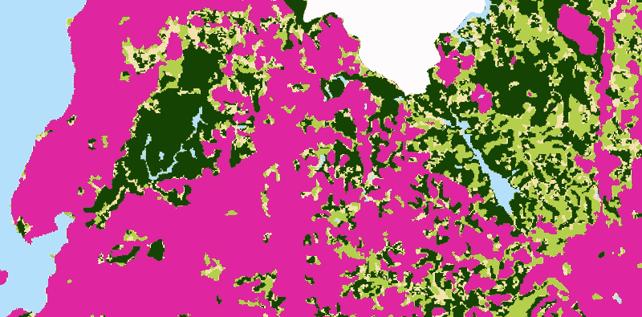

当温室气体(GHG)排放是气候变化的主要驱动力时，最近的 IPCC 报告指出，从大气中去除二氧化碳(CO2)对于限制全球变暖的影响至关重要。这与**保持和扩大树木和森林捕获和储存碳的能力**的重要性齐头并进，在地区或城市一级增强了当地集中努力的重要性。

尽管如此，许多地方 GHG 清单和气候行动计划倾向于更多地关注固定能源、运输、废物和工业过程，而不利于与土地使用相关的排放和清除。这主要是因为缺乏专业知识以及森林和树木对 GHG 的影响微不足道的想法。考虑到这一点， [WRI](https://www.googleadservices.com/pagead/aclk?sa=L&ai=DChcSEwj52JnQq_X1AhUPhJEKHYHJAZQYABAFGgJjZQ&ae=2&ohost=www.google.com&cid=CAESWOD2lGzRp23rVeOKKEuR1OVuOW7LNcf04xDqmxtRMGz9ScEG23U8MWDynPjycmgHo8BLrpK2wCdKQ4t2GyLq_p9y6GuuQNWtb-wy5HBnFNxuV-MnoVr72gY&sig=AOD64_0OxyK41tJw4nINFLdpWriaanvqjA&q&adurl&ved=2ahUKEwil_47Qq_X1AhXqGrkGHdM9B8gQ0Qx6BAgDEAE) 的**土地部门补充**试图扩展 [GPC](https://ghgprotocol.org/greenhouse-gas-protocol-accounting-reporting-standard-cities) 中为农业、林业和其他土地利用(AFOLU)的“土地”子部门提供的有限指导。

在这里，我们将研究如何将该指南应用于案例研究——巴西**的**萨尔瓦多**市——专门使用*公开可用的*空间数据**。该试点项目是在巴西 WRI 的[城市 4 森林](https://cities4forests.com/)项目下，由劳拉·卡西亚和顾问古伊列梅·伊布洛诺夫斯基在 WRI 全球办公室团队的指导和支持下开发的，该团队由大卫·吉布斯、南希·哈里斯和约翰·罗布·普尔代表。

# **萨尔瓦多市的土地使用变化**

萨尔瓦多位于巴西东海岸的大西洋雨林生态区。尽管它有很大的城市范围，有超过 280 万人口(巴西第四大城市)，它还是几片残存的大西洋雨林的家园。

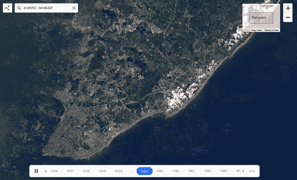

这是过去 35 年里萨尔瓦多市及其土地利用变化的样子。主要是为了城市发展而砍伐森林。图片作者。

2020 年 8 月，萨尔瓦多市政厅发布了涵盖 2014-2018 年期间的城市 [GHG 清单](http://sustentabilidade.salvador.ba.gov.br/wp-content/uploads/2020-/08/InventarioGEE_2014_2018_PMAMC.pdf)，并在同年 12 月推出了其[气候行动计划](http://sustentabilidade.salvador.ba.gov.br/wp-content/uploads/2020-/12/PMAMC_Ebook_ingles.pdf)。这两份文件都没有包括与土地利用相关的 GHG 流量。

最准确地计算清单期间(2014-2018 年)这些森林斑块和树木的 GHG 排放量和清除量的第一步是获取土地利用变化的空间数据。在这个试点项目中，数据来源于 [MapBiomas](https://mapbiomas.org/en) ，这是一个基于谷歌地球引擎的国家免费土地利用分类图像数据库，来自 Landsat 7 马赛克。

然后，我们需要查看最初(2014 年)和最后(2018 年)的数据，以便**估计土地利用随时间的变化**，或者碳储量如何变化。为此，任何 GIS 软件都可以，我们需要做的只是运行一个函数(如栅格代数或区域统计)来捕获这两年的像素值。有了这个，我们就可以确定有多少土地被转化为林地。

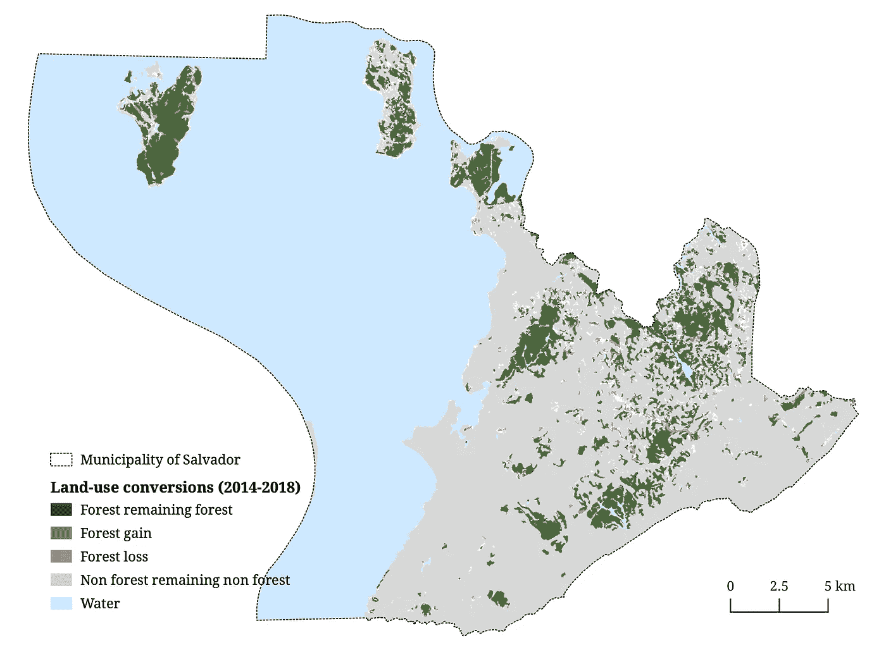

图片作者。数据来源:map biomass Project-Collection 5.0，巴西土地利用和土地覆盖图年度系列，于 2021 年 10 月 10 日通过链接访问:**mapbiomas.org**

为了使数据与最新的气专委 GHG 国家清单指南相一致，必须将其重新分类为六个主要的土地利用类别——林地*、*耕地*、*草地*、*居民点*、*湿地*和*其他土地—* ，我们可以将这些土地利用类别绘制成土地利用变化矩阵。在该矩阵中，每个单元代表在分析期间从给定土地利用类别开始到给定土地利用类别结束的土地面积。*

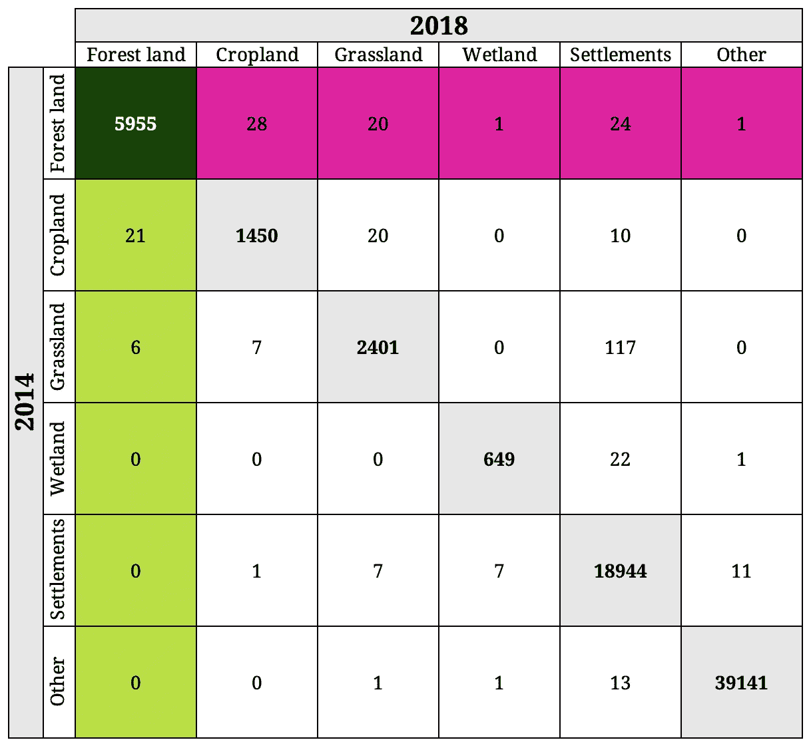

以**公顷**计的土地使用转换。**深绿色**单元格代表*森林剩余林*，**浅绿色**单元格代表*非林转变为林*，**粉红色**单元格代表*森林转变为非林*，**灰色**单元格代表清查期间保持不变用途的土地。图片作者。

从上面的矩阵可以看出，在 2014-2018 年期间，大约 74 公顷的林地被其他土地使用，而 27 公顷被重新造林。然而，在像萨尔瓦多这样土地利用相对稳定的城市，来自陆地的 GHG 通量可能会集中在我们矩阵的对角线上，这意味着大多数调查区域仍属于同一土地利用类别。

排放量和清除量可能发生在属于同一土地利用类别的土地上，甚至发生在矩阵的同一单元内。例如，*林地剩余林地*既有来自采伐和其他自然干扰的排放量，也有来自森林生长的清除量；随着时间的推移，*居住区剩余居住区*类别内城市树冠层的变化会导致树冠层损失产生的排放和维护或增加城市树冠层产生的清除。

# **超越雨林斑块:可视化城市树冠层**

我们已经测量了城市的林地覆盖面积，但仍有树木需要纳入城市结构，因为这些树木对碳的清除和排放同样重要。

到目前为止，我们能够使用中等空间分辨率的图像，也就是之前分类的 3000 万像素的陆地卫星 7 图像，但是这些还不足以识别混合在城市结构中的奇异树木。为此，精度最高的方法是对高分辨率影像进行影像分类，但这往往会超出许多城市的承受能力。因此，为了坚持只使用**公开可用数据集**的目标，我们将求助于 [iTree Canopy](https://canopy.itreetools.org/) 工具。

iTree Canopy 允许我们通过使用 Google Maps 卫星底图来量化给定地区(在我们的例子中，只有萨尔瓦多的非林地)的树冠覆盖。这是对影像的间接使用，因为与 GIS 软件中的分类不同，在 GIS 软件中，每个像素由算法分配一个类别，在这里，用户不能完全访问*原始影像及其波段*。这意味着我们不会处理像素，而是**评估图像中任意随机选择的点对应于一棵树的概率**。因此，为了使样本具有代表性，估计值取决于更多的点(在我们的例子中是 500 个)。一个简单的统计分布被计算出来，这个比例又被应用到以平方公里为单位的总调查面积上，以估算城市树木覆盖的面积。收集的**样本点**越多，**越小，**误差幅度**越小。**

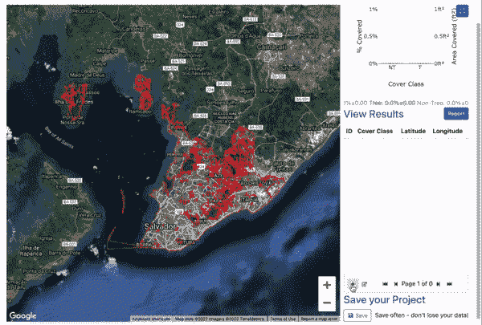

在 iTree Canopy 中，随着越来越多的点被识别为树木或非树木，误差幅度会在箱线图中动态调整。图片作者。

为了能够评估城市树冠的变化，我们必须用相同的一组点来比较 2018 年和 2014 年的图像(例如，通过使用谷歌地球来访问历史图像)。ITree Canopy 提供了模板电子表格，我们可以从中获取结果，从而获得每个类别的最终统计数据。用于开发该分类模型的指南可在[这里](https://drive.google.com/file/d/1uotfYL-zt-hsqwANg3Yv61_20Ci-PGdz/view?usp=sharing)找到。

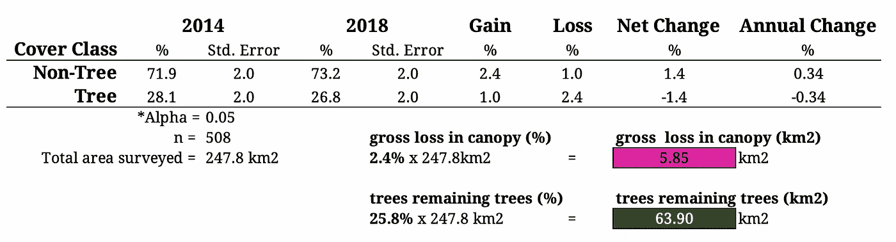

通过简单地将剩余树木和树冠损失的估计百分比乘以调查的总面积，即可计算出最终估计值。图片作者。

# 就这些吗？—说明土壤中储存的碳

计算森林和城市树冠覆盖的面积是我们努力实现的目标的关键，但这不是全部。陆地上的碳含量和在世界不同生态系统中循环的碳含量差异极大。

碳储存在多个池中:地上生物量、地下生物量、枯木、垃圾、土壤和伐木制品。在许多群落中，陆地上最大的单一碳库是地上生物量；而在其他地方，如沼泽或红树林，**土壤碳**可能是主要的碳库。枯木和凋落物碳可能占地上碳的百分之几，尽管它们也可能有很大差异。

将应用于面积计算的清除和排放因子**只能说明地上生物量**。这意味着我们需要找到一种方法来解释，至少，储存在土壤中的碳库。

这方面的来源可能因国家而异，但幸运的是，我们有令人惊叹的[土壤网格项目](https://soilgrids.org/)为我们指路。

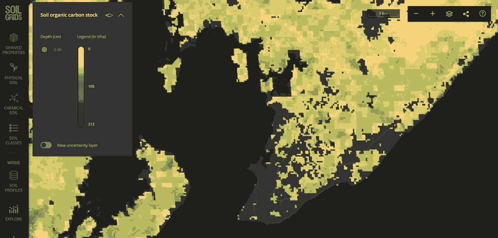

根据土壤网格萨尔瓦多土壤有机碳储量的分布。图片作者。

从土壤网格的**土壤有机碳储量**层，我们知道土壤碳在城市区域内是如何分布的。唯一受到影响的碳库是位于被砍伐地区下面的碳库。由于我们已经从土地使用转换数据中知道了哪些区域被砍伐，我们可以量化这些特定区域的土壤中储存了多少碳。这与毁林后排放到大气中的碳不同:为此，我们需要土壤排放分数。

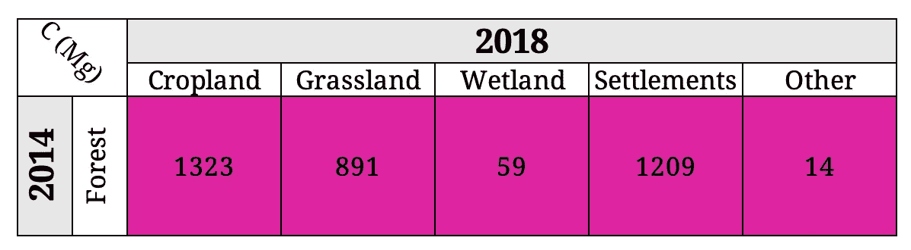

2014 年至 2018 年期间被砍伐森林的地区土壤中的碳含量，根据占用先前森林地区的土地使用类别进行分层。作者图片

# **从公顷到吨:应用排放和清除系数**

既然已经计算了森林、树木和土壤的土地利用转换，那么可以将它们与**排放和清除因素结合起来。**

这种简化的损益方法在根本上类似于其他部门的 GHG 清单，其中存量的变化被估计为**活动数据**(分类土地利用/土地利用变化的区域)和**排放系数**(每单位土地面积每个碳集合排放的碳量)的乘积。

然而，与其他部门不同，土地部门也包括清除量。**清除系数**被估计为单位面积土地利用/土地利用变化每年植被积累的碳量，并因土地利用和管理做法而异。

巴西森林的[排放因子包括地上生物量、地下生物量、枯枝碳和凋落物碳；土壤碳排放量单独计算。根据 IPCC 的默认值，森林外树木的排放因子仅包括地上和地下生物量。](https://issuu.com/mctic/docs/quarta_comunicacao_nacional_brasil_unfccc)

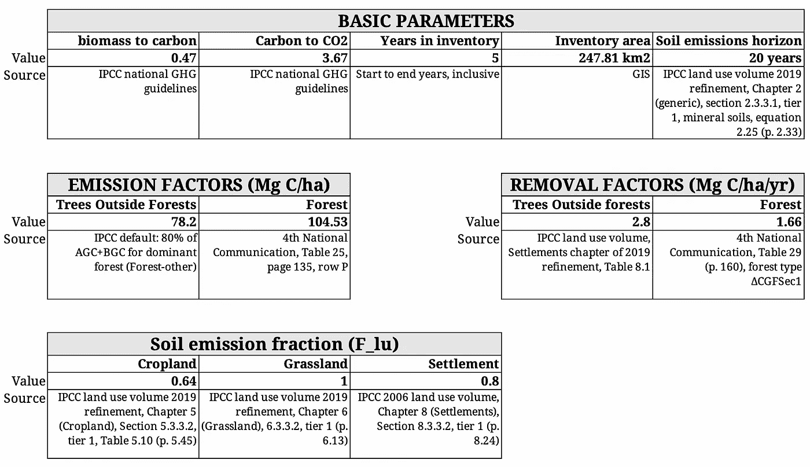

对于毁林后的每一种土地利用类型，计算了土地利用转换 20 年后保留的土壤碳的比例(例如，20 年后，80%的土壤碳保留在转换为定居点的林地中)。

# 把所有这些放在一起:萨尔瓦多做得怎么样？

**活动数据**必须包括土地使用发生变化的土地区域，以及在一段时间内保持其用途的土地。排放和清除都可能发生，因此净总 CO2 通量是所有土地面积的 CO2 排放和清除总量的总和。

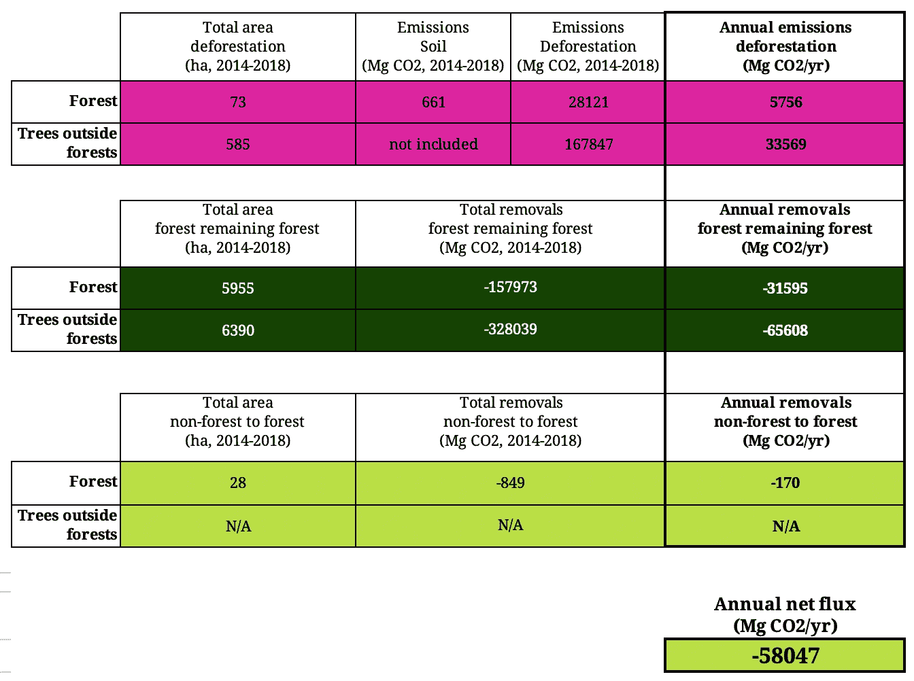

现在你知道了:2014 年至 2018 年间，萨尔瓦多的森林和树木是每年 58 毫克 CO2 的**净汇，代表 **39 毫克 CO2/年排放量**和 **97 毫克 CO2/年清除量**。排放量和清除量主要是由森林以外的树木驱动的，这些树木在清单中占主导地位(清除量是森林的 2 倍，排放量是森林的 6 倍)，并使土壤碳排放量相形见绌。**

由于用于此的所有数据来自空间来源，我们可以应用相同的因素，同时考虑像素级的活动，这样就可以直观地显示市政区域内排放量、清除量和流量的大致分布。

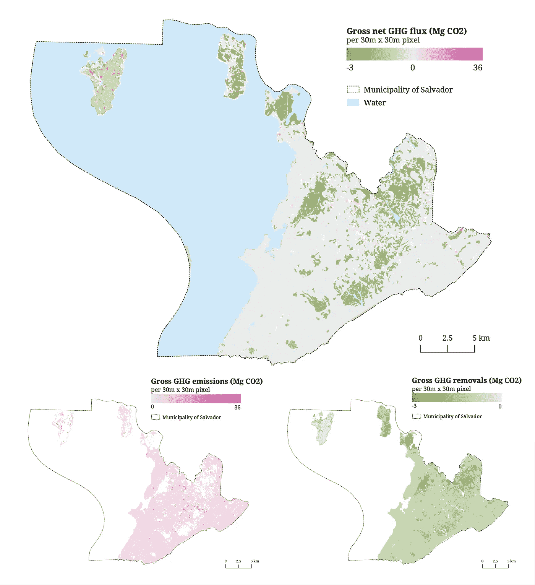

图片作者。数据来源:map biomass Project-Collection 5.0，巴西土地利用和土地覆盖图年度系列，于 2021 年 10 月 10 日通过链接访问:**mapbiomas.org**

# 最后的想法

结果表明，萨尔瓦多有机会通过减少非森林冠层损失的排放来进一步减少排放并增加其净吸收汇。在这种情况下，该清单可以成为一个很好的宣传工具，表明从气候变化的角度来看，森林以外的树木同样重要。

该试点严重依赖于空间数据，但地理处理操作相当简单，这可能意味着 GPC 的土地部门可以通过遵循 [WRI](https://www.googleadservices.com/pagead/aclk?sa=L&ai=DChcSEwj52JnQq_X1AhUPhJEKHYHJAZQYABAFGgJjZQ&ae=2&ohost=www.google.com&cid=CAESWOD2lGzRp23rVeOKKEuR1OVuOW7LNcf04xDqmxtRMGz9ScEG23U8MWDynPjycmgHo8BLrpK2wCdKQ4t2GyLq_p9y6GuuQNWtb-wy5HBnFNxuV-MnoVr72gY&sig=AOD64_0OxyK41tJw4nINFLdpWriaanvqjA&q&adurl&ved=2ahUKEwil_47Qq_X1AhXqGrkGHdM9B8gQ0Qx6BAgDEAE) 的**土地部门补充来轻松实施。**令人耳目一新的是，试点项目中使用的数据完全可以在巴西所有城市免费获得，并且易于获取，这意味着我们很快就可以看到全国碳库存中的土地使用缺口得到填补。