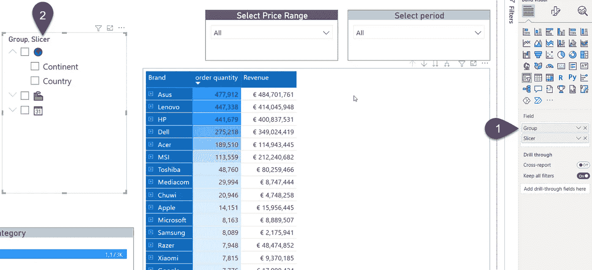
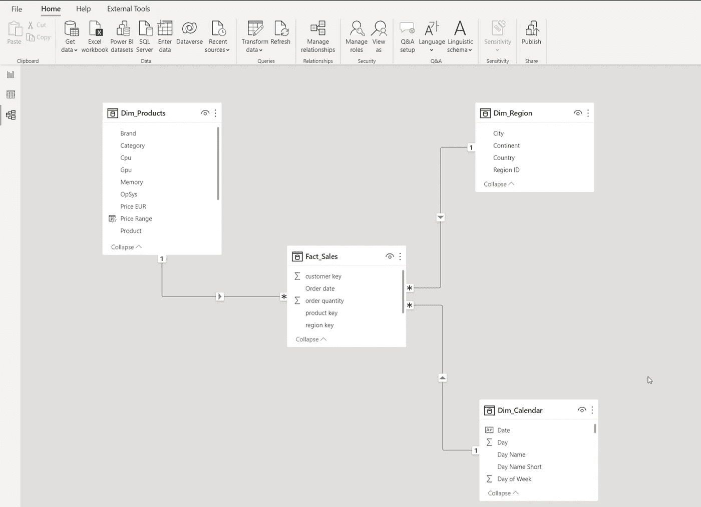
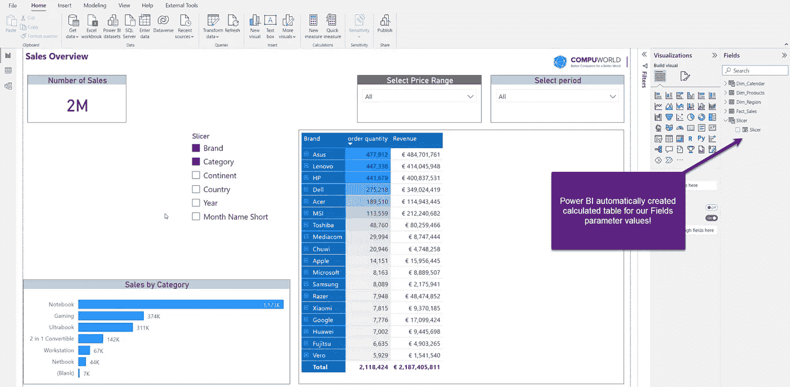
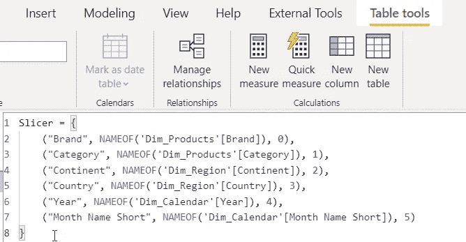
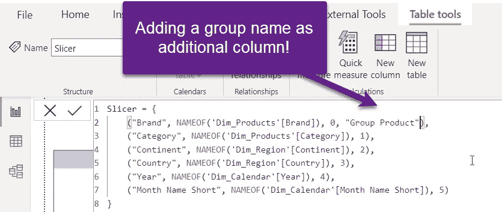
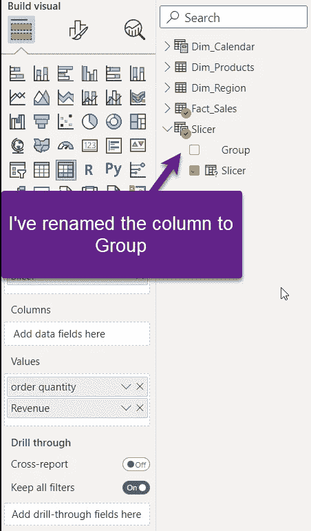
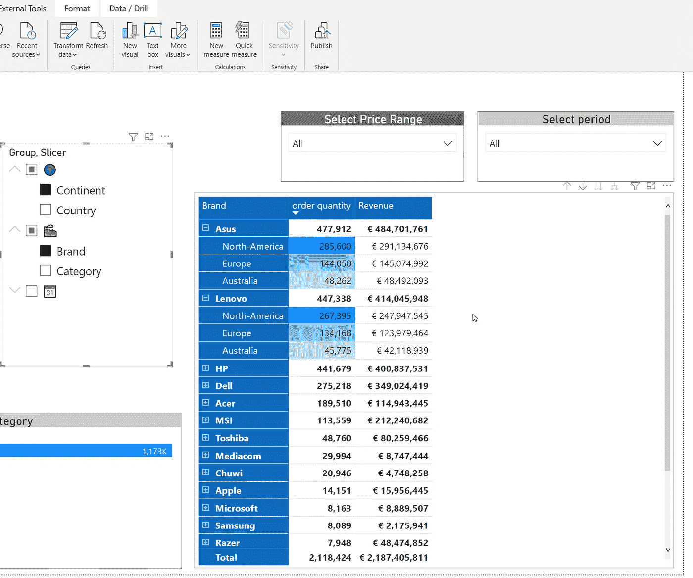
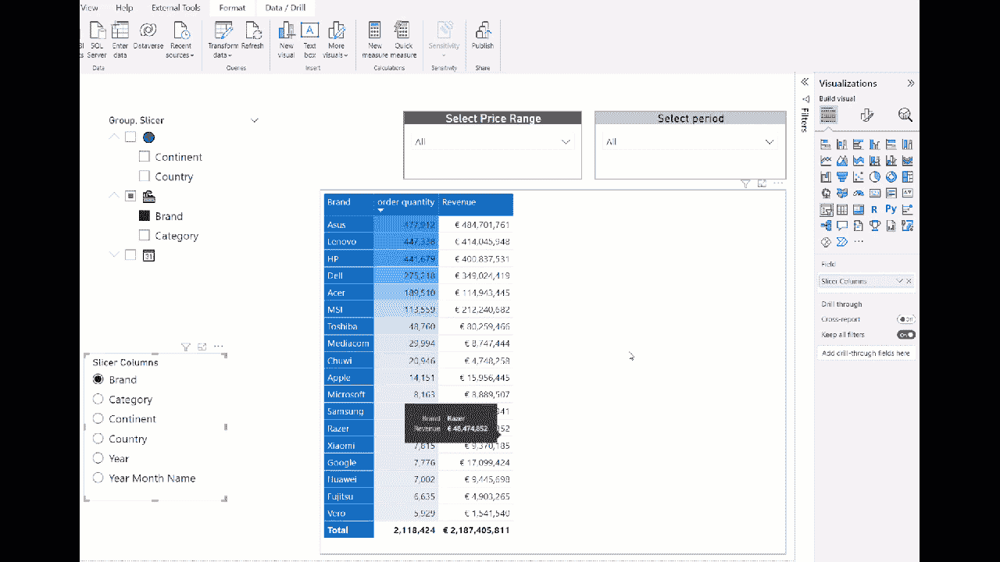

# 为 Power BI 中的现场参数注入活力

> 原文：<https://towardsdatascience.com/bring-life-to-field-parameters-in-power-bi-f284394fe4cf>

## 使用 Power BI 中的字段参数功能时，检查这个简单的技巧来增强用户体验



作者图片

老实说，我不记得有哪一个 Power BI 特性像 Fields 参数那样引起如此大的炒作，它是在 5 月 Power BI 桌面每月更新中引入的！好吧，几天后的 MS Build 事件带来了一些非常酷和有吸引力的功能，如 Datamart 或 PowerPoint 集成，这将字段参数推到了一边，但我仍然坚信字段参数是将永远改变我们在 Power BI 中构建用户体验的方式的事情之一。

我不会详细介绍这个特性本身，以及它是如何在幕后工作的，因为我的社区贡献者已经做了很好的解释。我建议你开始阅读我的朋友汤姆·马腾斯的这篇精彩文章，或者如果你喜欢看视频，可以阅读 SQL BI guys 的这篇文章。

此外，这项新功能已经有了一些非常有创意的用例，比如凯恩·斯奈德的[这个](https://tenfingerseddy.wordpress.com/2022/05/19/exploring-field-parameters-in-power-bi/)。

然而，在本文中，我想让您快速了解如何利用 Fields 参数为您的 Power BI 报告增添一些活力！

# 搭建舞台

我的数据模型非常简单:我有一个事实表和三个维度表——地区、产品和日期。



作者图片

让我们为我们的数据模型创建字段参数:


作者图片

您可能注意到了，我从每个维度表中拖出了两列，一旦确认，我的报告页面上就有了一个新的切片器，使用户能够以多种不同的方式对数据进行切片和切块。并且，不需要后台复杂的 DAX！



作者图片

多酷啊！但是，如果我们想根据某些标准对字段参数值进行分组，该怎么办呢？例如，所有与产品相关的字段应属于一个组，与地理相关的字段应属于另一个组，依此类推。

我有好消息要告诉你！但是，在我向您展示如何做到这一点之前，让我们先来看看 Power BI 在创建 Fields 参数表时自动生成的底层 DAX 代码:



作者图片

如你所见，这是“只是”达克斯！同样，我不会详细解释每个代码部分的用途，但是理解这“只是”DAX 为定制这个表提供了可能的空间！所以，我们开始吧！

# 让您的数据熠熠生辉！

这个想法是将品牌和类别字段放在一个“保护伞”下，将洲和国家放在另一个“保护伞”下，最后将年和月简称也放在第三个组下。我可以简单地为 DAX 表定义的每个成员添加一个新列，如下所示:



作者图片

但是，我有一个更好的主意！让我们给它带来一些活力，显示图标而不是文本！我将使用一个众所周知的 *UNICHAR()* 函数来提供应该被转换成图标的数值，类似于我在[这篇文章](https://medium.com/p/a4227b650e4a)中所解释的。

```
Slicer = {
    ("Brand", NAMEOF('Dim_Products'[Brand]), 0, UNICHAR(127981)),
    ("Category", NAMEOF('Dim_Products'[Category]), 1, UNICHAR(127981)),
    ("Continent", NAMEOF('Dim_Region'[Continent]), 2, UNICHAR(127757)),
    ("Country", NAMEOF('Dim_Region'[Country]), 3, UNICHAR(127757)),
    ("Year", NAMEOF('Dim_Calendar'[Year]), 4, UNICHAR(128198)),
    ("Month Name Short", NAMEOF('Dim_Calendar'[Month Name Short]), 5, UNICHAR(128198))
}
```

这是我添加了一个额外的列之后的 DAX 代码。此外，我还将新创建的列从通用的“值 4”重命名为“组”:



作者图片

是时候将我们的新设置投入使用了！因此，我将把 Group 列拖动到参数切片器的字段中，就在原始字段参数值的上方:


作者图片

哇哦！现在，我的字段参数值被分组在这些漂亮的图标下，所以我的用户可以很容易地理解各种切片选项！他们仍然可以基于来自不同组的多个不同的字段快速分割数据，但是这样数据的结构和组织要好得多！



作者图片

# 最终实现更好的用户体验

让我们做一些额外的小魔术来进一步增强用户体验！

我想让我的用户能够自己选择如何查看矩阵中的数据！换句话说，动态选择在行和列中显示什么！

我将创建此字段参数表的副本，但这一次我将为切片器启用单选，这样，如果没有选择任何内容，矩阵不会变得过于混乱:



作者图片

厉害！现在，我们的矩阵是完全可定制的，用户可以动态选择他们希望如何查看数据—在行和列之间切换！

# 结论

Fields 参数是您知道会产生巨大影响的特性之一！这不仅仅是因为它开启了无限多的可能用例，还因为它易于实现，并且可以扩展定制，从而以更高效的方式回答业务问题。

感谢阅读！

[订阅，不要错过任何媒体上的故事！](https://datamozart.medium.com/membership)