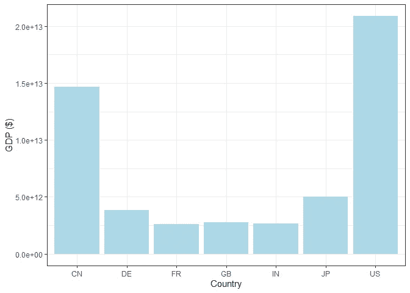
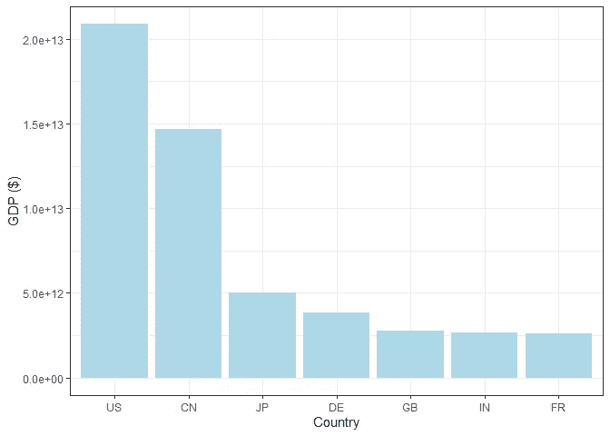
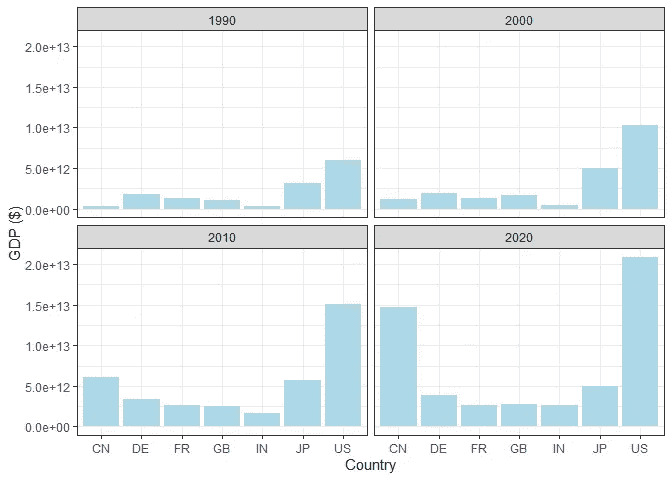
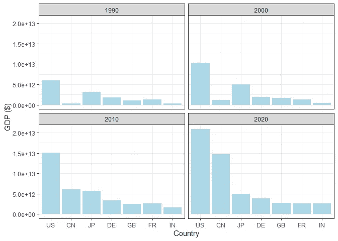
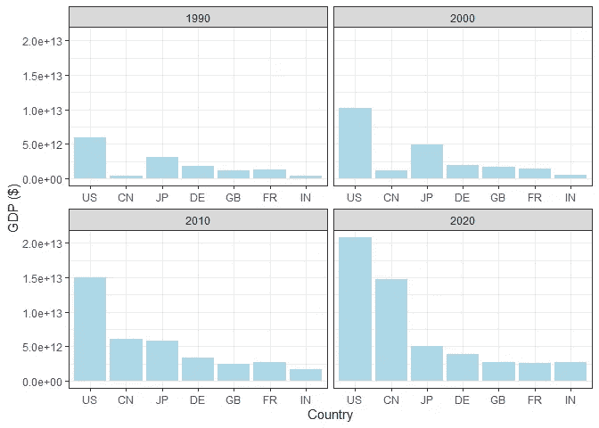
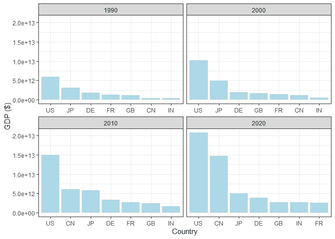

# 将秩序带入条形图的混乱中

> 原文：<https://towardsdatascience.com/bringing-order-into-bar-chart-chaos-f271ab91a6ee>

## 对单个多面 ggplot2 条形图中的条形图进行排序

作者图片

我们都喜欢秩序(或者至少是我们大多数人)。它帮助我们组织我们的思想，给我们一种平静的感觉。同样的原理也适用于数据可视化。我们喜欢它们整洁有序，因为这样看起来更美观，便于比较。条形图是一种可视化，其中这一点最为明显。在处理单个图表时，大多数人可能都熟悉对条形图进行重新排序。然而，我敢打赌，你们中的大多数人在刻面图上做这个会有问题。在下文中，我将展示如何使用来自[世界数据库](https://data.worldbank.org/indicator/NY.GDP.MKTP.CD)的国内生产总值(GDP)信息来解决这两种情况下的问题。

## 订购单个条形图

让我们只筛选四十年间世界前七大经济体:

现在，我们可以用一个条形图来比较他们的 GDP:

比较国家有点困难，因为国家标签不是由他们的 GDP 订购的。我们可以通过使用`reorder`函数按照 2020 年的 GDP 对这些国家进行降序排列来解决这个问题。

太好了！我们获得了一块有用的土地。然而，这只是 2020 年的图表。下一节将展示当同时显示不同年份的多个条形图时，如何对条形图进行排序。

## 多个图表—显示条形图

为了同时说明各国在不同时间的 GDP 对比，我们可以使用`facet_wrap`函数:

我们可以观察到与之前相同的问题—小节没有排序。让我们试着用同样的方法来解决这个问题:

问题依然存在！您可能会认为这可能只是这个 facet 布局的产物，因为在整个列中使用相同的水平轴标签会自动强制相同的条排序。如果是这种情况，可以通过允许每个面拥有自己的一组水平轴标签来解决这个问题。我们可以通过将`facet_wrap`函数的`scales`参数设置为“free_x”来做到这一点。

这也没有解决问题，因为排序又是全局进行的。下一节将展示如何使用`tidytext`包绕过这个问题。

## 对方面进行排序

顾名思义，`tidytext`包是为了便于将文本转换成整齐的格式而创建的。在这里，我们将关注于`reorder_within`函数，它允许我们在一个 facet 中重新排序条。除了将`reorder`函数与`reorder_within`函数交换之外，我们还必须从同一个包中添加一个对`scale_x_reordered`函数的调用，以使其工作。

就是这样！我们可以看到，在过去的四十年里，美国一直保持着第一的位置。然而，中国的增长率最快，而且似乎正在接近。日本和德国设法保住了领先两个国家的位置，但其他主要欧洲经济体，如法国和英国，似乎正在落后，为印度让路。

## 结论

这篇文章展示了如何订购单一和多面条形图。最终的有序分面图使我们能够更容易地对世界上最重要的经济体进行比较。所以，下次你想在多面条形图之间进行比较时，你应该知道该怎么做。对于任何问题或意见，请随时发表评论。

附注:对于那些无法停止思考那些无序砖柱的人，这里有一个挠痒痒的地方:)

作者图片