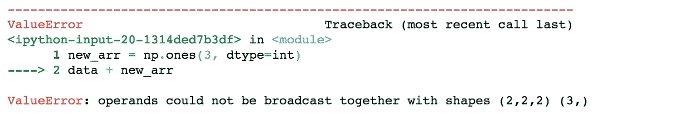
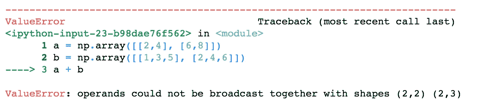

# 数字广播:你应该知道的强大技术

> 原文：<https://towardsdatascience.com/broadcasting-in-numpy-a-powerful-technique-you-should-know-7dc1dde619fa>

## 广播在幕后如何运作的细节


唐纳德·詹纳蒂在 [Unsplash](https://unsplash.com?utm_source=medium&utm_medium=referral) 上的照片

# **简介**

什么是广播？ [**广播**](https://numpy.org/doc/stable/user/basics.broadcasting.html) **是一种允许**[**Numpy**](https://numpy.org/)**在算术运算时处理不同形状数组的机制。**在广播中，我们可以把它想象成一个较小的数组，在做某些操作之前，被“广播”成与较大的数组相同的形状。通常，较小的数组将被复制多次，直到它达到与较大的数组相同的形状。注意，我们这里说的数组指的是 Numpy[*ndarrays*](https://numpy.org/doc/stable/reference/generated/numpy.ndarray.html)，是固定大小项目的多维数组。

**使用广播允许** [**向量化**](https://en.wikipedia.org/wiki/Vectorization) **，这是一种处理整个数组而不是单个元素的编程风格。如果你不熟悉矢量化的概念，我写了一篇关于矢量化的文章，你可以从中了解更多。广播通常很快，因为它对数组操作进行了矢量化，所以循环发生在优化的 C 代码中，而不是较慢的 Python 中。此外，它并不真的需要存储较小数组的所有副本；相反，有更快更有效的算法来存储。**

# **广播示例**

举个例子，假设你想给一个数组添加一个常量。最天真的方法应该是这样的:

```
import numpy as npdata = np.array([[1,2], [3,4]])
constant_arr = np.array([[5,5], [5,5]])
data + constant_arr
# result: array([[6, 7],
                 [8, 9]])
```

我们定义一个和数据形状一样的数组来保存常数，然后把它们加起来。这是因为两个数组具有完全相同的形状。

但是如果这次的数据更大，比如说，是三维的。为了迎合这一点，我们将定义另一个数组来保存常数，但这一次，用了一个更大的维度:

```
data = np.array([[[1,2], [3,4]], [[5,6], [7,8]]])
constant_arr = np.array([[[5,5], [5,5]], [[5,5], [5,5]]])
data + constant_arr
# result: array([[[ 6,  7],
                  [ 8,  9]],

                 [[10, 11],
                  [12, 13]]])
```

这个管用。然而，正如您所看到的，代码似乎变得有点混乱和多余。为了提高可读性，您可能会注意到我们可以使用`[np.full](https://numpy.org/doc/stable/reference/generated/numpy.full.html)`函数，这将允许我们定义一个给定大小的数组，其中填充了一个特定的标量值。因此，我们可以做到:

```
constant_arr = np.full((data.shape), 5)
data + constant_arr
# result: array([[[ 6,  7],
                  [ 8,  9]],

                 [[10, 11],
                  [12, 13]]])
```

现在，这个稍微好一点。一切都很好，但是有没有办法让它更简单、更简洁？

正如你所猜测的，答案是肯定的，而实现这一点的方法就是通过广播。Numpy 允许我们处理不同形状的数组，从而使我们更容易执行操作。我们可以*直接*将常量添加到任何数组中，如下所示:

```
data + 5
# result: array([[[ 6,  7],
                  [ 8,  9]],

                 [[10, 11],
                  [12, 13]]])
```

这不是简单多了吗？

# **广播失败的地方**

广播让一切变得更简洁，但它能与任意两个数组一起工作吗？

作为一个例子，让我们试着用形状为`(3,)`的填充了 1 的数组来添加前面的数据数组:

```
new_arr = np.ones(3, dtype=int)
data + new_arr
```



运行此示例时显示错误

这似乎给出了一个[值错误](https://docs.python.org/3/library/exceptions.html#ValueError)。很奇怪吧。

产生错误的原因是 Numpy 无法将较小的数组(在本例中为`new_arr`)传播到与`data`数组形状相同的数组中。请记住，广播的中心思想是试图复制较小数组中包含的数据，以匹配较大数组的形状。在这种情况下，没有办法复制一个大小为`(3,)`的数组来匹配`(2,2,2)`的形状。因此，给出值 Error。

虽然广播通常允许您使用不同大小的数组，但是有一个警告。**并非所有数组都可以在一次操作中一起使用。**

# **广播规则**

如果广播不能通用，广播什么时候起作用，什么时候失效？

假设我们试图在两个数组之间执行一些操作，数组 *a* 和 *b* 。一般来说，广播的工作原理如下:

*   如果 *a* 和 *b* 的维数不同，那么维数较少的数组增加一个元素的维数，直到该数组的维数与另一个数组的维数相匹配。

这是什么意思？举个例子，比方说`data = np.array([[1,2], [3,4]])` 我们正在努力做`data + 5` *。*我们可以假设 *a =* `data`，而 *b =* `5`。这一步将把 *b* 转换成`np.array([[5]])`，现在是二维的，形状为`(1,1)`。

*   一旦 *a* 和 *b* 的维数相等，迭代过程就开始了。我们遍历 *a* 和*b
    **的每个维度 *i* 如果 *a* 和 *b* 的维度 *i* 的形状相同，那么我们继续下一个维度 *i+1
    ** 否则如果 *b* 在维度*I*中的形状为 1
    *否则如果 *a* 在尺寸 *i* 中的形状为 1，则复制 *a* 的尺寸 *i+1、i+2、…、`*max(len(a.shape), len(b.shape))*`*】*中的数据，直到形状与 *b* 相同。(与上一个 else if 相同，但这一次， *a* 被复制，因为它的形状更小)。
    *否则，将引发“ValueError:操作数不能一起广播”，表示数组 *a* 和 *b* 不兼容，不能广播。***

回到`data + 5`的例子， *a* 和 *b* 都有两个维度，分别是`a.shape=(2,2)` 和`b.shape=(1,1)`。我们开始迭代过程。我们从尺寸 *0* 开始，观察到 *b* 在尺寸 *0* 中的形状为 1。因此，我们复制了`[5]`，通过使其成为`*b=np.array([[5], [5]])*`，形状现在变成了 2 ( *a* 在维度 *0* 上的形状)。现在，我们有了`b.shape=(2,1)` *。*接下来，我们继续下一个维度，维度 *1* ，我们再次观察到 b 的形状为 1。我们复制`5`,使 *b* 的形状为 2(与 a 的形状相同),将其转换为`*b=np.array([[5, 5], [5, 5]])*`。由于没有更多的维度可以迭代，我们停止，导致 *a* 和 *b* 在所有维度上的形状相同。最后，我们可以将它们逐个元素相加，得到结果`np.array([[6, 7], [8, 9]])`。

希望这一切都有意义。这里要注意的要点是，广播试图使两个数组的每个维度的形状相同，它通过多次复制该维度中形状为 1 的数组，直到达到目标形状。

# **更多例子**

我知道如果你是第一次学广播，有很多东西需要理解。别担心，这里还有一些例子可以帮助你更熟悉规则。

对于下面的每个示例，考虑如何转换一个数组以匹配另一个数组。

```
a = np.array([[2,4], [6,8]])
b = np.array([1,3])
a + b
# result: array([[ 3,  7],
                 [ 7, 11]])
```

在这种情况下， *b* 转化为`b=np.array([[1,3], [1,3]])`。

```
a = np.array([[2,4], [6,8]])
b = np.array([[1], [3]])
a + b
# result: array([[ 3,  5],
                 [ 9, 11]])
```

这里 *b* 转化为`b=np.array([[1,1], [3,3]])`。

```
a = np.array([[2,4], [6,8]])
b = np.array([[1,3,5], [2,4,6]])
a + b
```



运行此示例时显示错误

最后，在最后一个例子中，出现了 ValueError。这是因为 *a* 具有`(2,2)`的形状， *b* 具有`(2,3)`的形状，并且正如你所看到的，在尺寸 *1* 中 *a 和 b* 都不具有 1 的形状，因此两者都不能被复制以匹配另一个。因此，这两个数组无法广播。

希望你理解了这些例子，并且记住，一旦你练习和写更多的 Numpy，你会对广播更加熟悉。随着时间的推移，这些规则会变得更加直观。

# **总结**

如果你在这里逗留，一定要给自己一个鼓励！总而言之，我们学习了什么是广播，它在哪里失败，以及它是如何工作的。广播在 Numpy 中使用非常频繁，因此了解它在幕后是如何工作的非常重要。

我希望这篇文章很好地解释了广播背后的概念。如果你有任何问题，请告诉我，随时乐意帮忙！如果你需要的话，这里有到 Jupyter 笔记本的[链接](https://github.com/itsuncheng/medium_code/blob/main/broadcasting_tutorial/broadcasting_examples.ipynb),其中包含了本文介绍的代码。

如果你刚刚写完这篇文章，但是不确定什么是矢量化或者它是如何工作的，一定要去看看我以前的[文章](https://medium.com/towards-data-science/vectorization-must-know-technique-to-speed-up-operations-100x-faster-50b6e89ddd45)。请随意浏览我的其他文章来了解更多。下次见，再见。

我以前的一些文章:

[](/build-a-song-recommendation-system-using-streamlit-and-deploy-on-heroku-375a57ce5e85) [## 使用 Streamlit 构建歌曲推荐系统并在 Heroku 上部署

### 了解如何使用 Spotify 音乐数据集的 K 近邻构建一个简单的歌曲推荐引擎

towardsdatascience.com](/build-a-song-recommendation-system-using-streamlit-and-deploy-on-heroku-375a57ce5e85) [](/semantic-similarity-using-transformers-8f3cb5bf66d6) [## 使用转换器的语义相似度

### 使用 Pytorch 和 SentenceTransformers 计算两个文本之间的语义文本相似度

towardsdatascience.com](/semantic-similarity-using-transformers-8f3cb5bf66d6) [](/top-nlp-books-to-read-2020-12012ef41dc1) [## 2020 年最佳 NLP 读物

### 这是我个人为自然语言处理推荐的书籍列表，供实践者和理论家参考

towardsdatascience.com](/top-nlp-books-to-read-2020-12012ef41dc1) [](/top-nlp-libraries-to-use-2020-4f700cdb841f) [## 2020 年将使用的顶级 NLP 库

### AllenNLP，Fast.ai，Spacy，NLTK，TorchText，Huggingface，Gensim，OpenNMT，ParlAI，DeepPavlov

towardsdatascience.com](/top-nlp-libraries-to-use-2020-4f700cdb841f) [](/bert-text-classification-using-pytorch-723dfb8b6b5b) [## 使用 Pytorch 的 BERT 文本分类

### 文本分类是自然语言处理中的一项常见任务。我们应用 BERT，一个流行的变压器模型，对假新闻检测使用…

towardsdatascience.com](/bert-text-classification-using-pytorch-723dfb8b6b5b) 

# 参考

[广播，Numpy](https://numpy.org/doc/stable/user/basics.broadcasting.html)

[Numpy 文档，Numpy](https://numpy.org/doc/stable/index.html)

[Numpy —广播、辅导点](https://www.tutorialspoint.com/numpy/numpy_broadcasting.htm)

[Python |用 Numpy 数组广播，GeeksforGeeks](https://www.geeksforgeeks.org/python-broadcasting-with-numpy-arrays/)