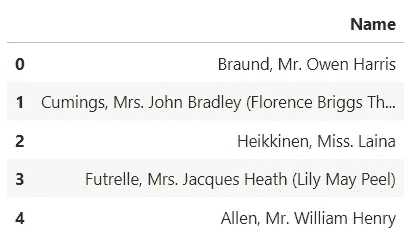
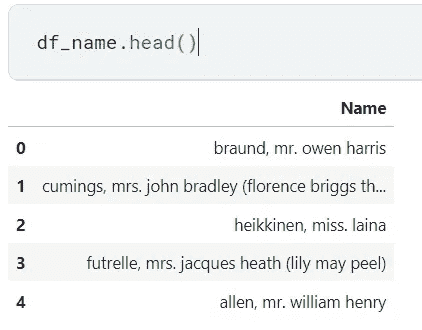
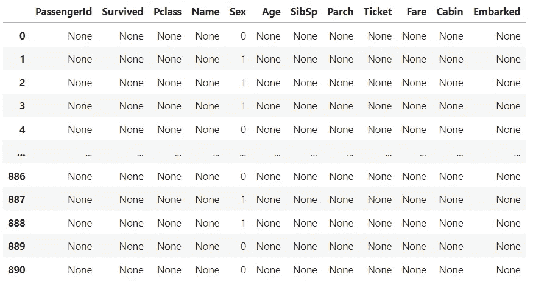
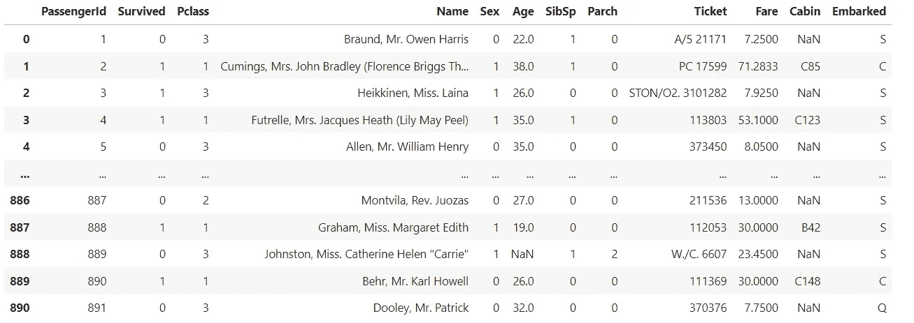

# 熊猫广播业务解释

> 原文：<https://towardsdatascience.com/broadcasting-operations-in-pandas-explained-f8e00af73963>

## 了解 Pandas 中的应用、应用映射和聚合函数的作用


来自[像素](https://www.pexels.com/ko-kr/photo/6120182/)的免费使用照片

# 介绍

Apply、Applymap 和 Aggregate 函数经常用于以用户期望的方式转换变量或整个数据。我个人将这些函数称为“广播函数”，因为它们允许我们向变量或数据中的所有数据点广播某种逻辑，比如说自定义函数。在本文中，我将向您解释这三个函数的不同之处，并通过一些例子来说明这些观点。我们使用标志性的[泰坦尼克号灾难数据集](https://www.kaggle.com/c/titanic)作为例子。具体来说，我使用了拥有公共许可证的 [OpenML](https://www.openml.org/search?type=data&sort=runs&id=40945&status=active) 中的数据集。

我们首先导入 pandas 包，并将 titanic 训练数据存储在一个名为“df”的变量中。

```
**# Dataset Source:** [**OpenML**](https://www.openml.org/search?type=data&sort=runs&id=40945&status=active)**; License(CC): Public****import** pandas **as** pd
df = pd.read_csv("../input/titanic/train.csv")
```

# 应用

简单地说，pandas 中的 apply 函数是一个变量级函数，您可以应用各种转换来转换一个变量。在这里，您可以利用 lambda 函数或自定义函数来创建您想要应用的转换逻辑。例如，如果出于某种原因，您希望将“Fare”变量乘以 100，您可以运行以下代码:

```
df['Fare'] = df['Fare'].apply(lambda x: x * 100)
```

有了这个想法，你就可以执行各种很酷的转换，只要你能够明智地按照你想要的方式精确地设计 lambda 或自定义函数。下面是一个代码示例，它从一些 xxxx/mm/dd 格式的字符串日期中提取月和日信息。

```
data['last_review_month'] = data['last_review'].apply(lambda x: datetime.datetime.strptime(x, "%Y-%m-%d").month)data['last_review_day'] = data['last_review'].apply(lambda x: datetime.datetime.strptime(x, "%Y-%m-%d").day)
```

# 应用地图

Applymap 函数是 apply 的所有数据版本，其中转换逻辑应用于数据中的每个数据点(例如，数据视图中的每个单元格)。

假设我们想把所有乘客的名字都改成小写。出于演示目的，让我们创建一个单独的数据帧，它是原始数据帧的子集，其中只有“Name”变量。

```
df_name = df.copy()[['Name']]df_name.head()
```



来源:作者

现在，我们使用 Applymap 函数来完成我们想要的。

```
df_name = df_name.applymap(lambda x: x.lower() if type(x) == str else x)
```

注意，if-else 语句可以像上面一样在 lambda 函数中编写。你可以在下面看到所有的名字现在都是小写！



来源:作者

假设我们想将类别(字符串格式)替换成相应的整数。我们可以使用 Applymap 函数来实现这一点吗？尽管 Apply 函数可能与此更相关，但我们仍然可以使用 Applymap 函数来实现相同的结果。

我们有一本字典，把性别，男性和女性分别映射到 0 和 1。

```
mapping = {"male":0, "female":1}df.applymap(mapping.get)
```



来源:作者

从上面的输出可以看出，如上所述，Applymap 函数将转换逻辑应用于每个变量中的每个数据点。因此，我们看到所有其他与“性别”变量无关的细胞都被替换为无。我们不希望这样。为了实现我们想要的，我们可以设计 lambda 函数，仅当单元格中的值是映射键之一时才替换这些值，在本例中，映射键是字符串“男性”和“女性”。

```
df.applymap(lambda x: mapping[x] if x in mapping.keys() else x)
```



来源:作者

现在我们看到，只有“性别”变量发生了变化，而其他变量保持不变。

## 聚合

最后但同样重要的是，与 Apply 和 Applymap 函数不同，Aggregation 函数返回一个新的 dataframe，其中包含用户指定的汇总统计信息。汇总汇总统计是指包括最大值、最小值、均值、中值和众数的统计。在这里，我们计算乘客的平均年龄、最大年龄和存活率。

```
df.groupby("Pclass").agg(avg_age = ("Age", "mean"),
                        max_age = ("Age", "max"), 
                        survival_rate = ("Survived", "mean"))
```

从上面的代码片段中可以看出，将 aggregation 函数与 Groupby 函数结合使用，可以成为计算不同数据点组的聚合的强大工具。

# 结论

在本文中，我使用了 Titanic Disaster 数据集来说明三个最常用的转换/广播函数的作用以及它们之间的区别。请继续关注我关于数据清理、机器学习、深度学习、自然语言处理等方面的更多文章。

如果你觉得这篇文章有帮助，请考虑通过以下链接注册 medium 来支持我: )

[joshnjuny.medium.com](https://joshnjuny.medium.com/membership)

你不仅可以看到我，还可以看到其他作者写的这么多有用和有趣的文章和帖子！

# 关于作者

*数据科学家。加州大学欧文分校信息学专业一年级博士生。*

*密歇根大学刑事司法行政记录系统(CJARS)经济学实验室的前研究领域专家，致力于统计报告生成、自动化数据质量审查、构建数据管道和数据标准化&协调。Spotify 前数据科学实习生。Inc .(纽约市)。*

他喜欢运动、健身、烹饪美味的亚洲食物、看 kdramas 和制作/表演音乐，最重要的是崇拜我们的主耶稣基督。结帐他的 [*网站*](http://seungjun-data-science.github.io) *！*