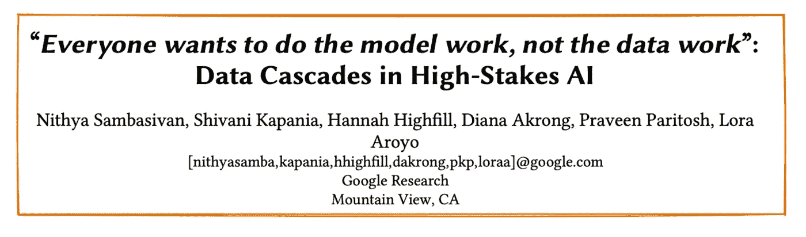
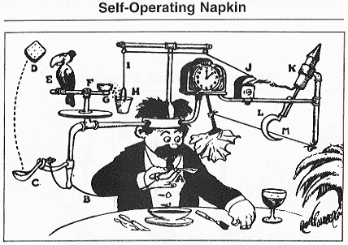

# 拓宽视角，改变数据科学对“社会公益”的态度

> 原文：<https://towardsdatascience.com/broadening-the-lens-and-changing-attitudes-of-data-science-for-social-good-297810d458f9>

## 评估非营利部门的数据工作

中国云南红河哈尼族彝族自治州。图片作者。

主流数据科学项目侧重于数据结构、编程、算法、统计建模和机器学习。虽然预测泰坦尼克号上的幸存者已经成为数据科学培训中的一项仪式，但即使是最准确的模型也不会改变历史。虽然现成的数据集对技能培养很实用，但许多学生渴望解决现实世界的问题。在一所社会工作学校，许多学生来找我，寻找机会磨练他们的数据技能，并通过为“社会公益”而工作来建立他们的简历。

获得这种经验最直接的途径是与非营利组织一起启动一个项目。虽然存在大量的机会，但许多学生对从事清洁数据工作的前景感到失望，这些工作包括清理、准备和管理数据，而不是拓展数据科学方法的边界。我经常听说非营利组织迫切需要的数据工作类型不是“智力上有趣的”——这种态度将非营利组织的大部分数据科学支持归为周末黑客马拉松。

我尊重他人的学术兴趣。我认识到我是数据科学社区中基本技术的消费者。我永远不会突破数据科学方法的界限。成为数据科学社区的正式成员并不是我的愿望。我对解决社会和环境问题感兴趣，数据科学的策略、方法和工具为开展这类工作提供了独特的机会。

**整合技术和领域专业知识**

虽然集成技术和领域专业知识是数据科学定义的一部分，但许多程序并没有教如何做。因此，非营利部门的许多数据计划都需要技术专家提供低效且不可持续的数据科学解决方案。学生们需要意识到，当见解处于业务流程和组织文化中时，是可操作的。

除了组织已经在处理的数据之外，额外的分析可能不会产生更多的数据见解。更加强调整合技术和领域专业知识可以揭示有意义和可持续创新的杠杆点。例如，更复杂的分析可能没有帮助，但存在提高工作流程效率的机会。这些节省成本的选项在拥有传统数据系统的组织中非常多。自动化不是尖端的数据科学方法。尽管如此，他们仍然可以在组织内腾出宝贵的时间，让领域专家有更多的时间使用数据来解决需要专家判断的问题。

危地马拉蒂卡尔的树根。图片由作者提供。

**重视数据工作**

大多数非营利组织没有数据，甚至不需要机器学习模型或高级统计分析。我不记得上一次遇到 p 值或相关系数能够提供有用见解的用例是什么时候了。非营利部门的大多数问题都围绕着清理、准备和管理非营利部门中杂乱的真实世界的数据。相比之下，大多数学生希望深入统计分析和机器学习。Sambasivan 和他在 Google Research 的同事在他们的论文中对这种情况进行了仔细和批判性的关注:

Sambasivan，s . Kapania，h . high fill，Akrong，d . Paritosh，p .，& Aroyo，L. M. (2021 年 5 月)。“每个人都想做模型工作，而不是数据工作”:高风险人工智能中的数据级联。在*2021 年中国计算机系统人的因素会议论文集*(第 1-15 页)。

他们令人信服地指出，“数据工作在许多社会技术领域被广泛低估……高风险领域的数据质量差可能对弱势群体和环境产生巨大影响。”虽然他们专门围绕人工智能进行讨论，但他们的观点准确描述了非营利部门的数据科学。

> 我们需要摆脱当前被动的方法，不再将数据视为“繁重的工作”。我们需要积极关注*数据卓越—* 关注数据管道的实践、政治和人类价值观，通过使用流程、标准、基础设施和激励措施来提高数据的质量和神圣性… Sambasivan 等人(2021 年)

许多培训情况为学生提供的研究数据集与现实世界组织中的数据几乎没有对应关系。使用干净、扁平的文件并直接进入零假设统计测试的学生对管理数据的混乱和多样性感到惊讶。Sambasivan 和他的同事对训练提出了类似的批评:

> 人工智能领域的学位、文凭和纳米学位的大部分课程都集中在模型开发上[42]，这使得毕业生对处理数据的科学、工程和艺术准备不足，包括数据收集、基础设施建设、数据文档和数据意义制作… Sambasivan 等人(2021)

**要码，还是不要码？**

由于用 R 和 Python 编写代码是数据科学培训计划的一个重要焦点，学生们渴望启动一个 Markdown 文件或笔记本，并开始编写代码。基于代码的解决方案是可重复研究的基础。然而，基于代码的解决方案通常不是非营利组织的最佳选择。在与非营利组织合作时，初露头角的数据科学家应该保持对业务流程动态本质的了解，无论其免税地位如何。

从这个角度来看，基于代码的解决方案对组织来说可能是不可持续的。例如，假设您使用 R 或 Python 自动化管理报告。当他们添加另一个数据流时会发生什么？他们能够调整 R 或 Python 代码来引入这些新数据吗？虽然我的实证研究涉及基于代码的解决方案，但我发现，对于非营利组织的日常数据工作来说，无代码和低代码的解决方案可能更快、更可持续。

中国算盘。图片由作者提供。

我鼓励学生们保持谨慎，不要盲目地将可再生研究的价值强加给非营利部门。对于大多数数据项目来说，再现性确实是必要的。但是，我们应该考虑再现性的*度*，而不是把它看作一个非此即彼的问题。无代码和低代码的解决方案通常有一个*配方*，它充分描述了你如何从 A 点到达 B 点，但可能没有一套清晰定义每一步的计算机代码那么优雅。许多问题通常不需要这种详细程度。如果不考虑效率和可持续性，组织可能会因投资于可再生解决方案而损失宝贵的资源。

**组织能力建设**

当你有技术专长时，非营利组织的一些数据问题很容易解决。然而，培养组织能力来解决他们的数据问题通常是更好的解决方案。从这个角度来说，数据*科学家*的帽子需要换成数据*老师*的帽子。与“我自己做更快”的态度相比，组织可能会获得更大的长期收益同样，这一点又回到了理解业务环境中的数据。我遇到很多学生拿着 [*的解答找问题*](https://en.wikipedia.org/wiki/Wikipedia:Solutions_looking_for_a_problem#:~:text=A%20solution%20looking%20for%20a,not%20offer%20any%20practical%20advantages.) *。我鼓励寻求“社会公益”体验的学生理解组织最紧迫的问题，而不是是否存在运行回归分析或机器学习模型的机会。*

Rube Goldberg 的自运营餐巾纸是在找问题的解决方案。图片来自维基百科。

**接下来的步骤**

无可否认，我对数据科学在非营利领域的发展持乐观和悲观态度。乐观地说，我看到了帮助非营利组织提高战略性使用数据的效率和有效性的巨大机会。然而，我们是否能吸引更多具有数据专业知识的人在非营利部门工作，需要我们如何评价数据工作的根本转变。有时，直接而优雅的数据问题解决方案可以让非营利组织受益匪浅。在学术界，受到重视的数据科学方法会产生行业资金。但是，我们必须小心，不要让资助成为影响的最终衡量标准。这是我悲观的一面。最终，希望将他们的技能应用于社会公益的学生必须首先理解组织的使命，然后是组织最紧迫的问题，最后是他们的数据。

我是密歇根大学的社会工作教授，对帮助学生做好准备和帮助非营利组织利用数据和信息技术更聪明地工作感兴趣，而不是更努力。如果您有兴趣了解非营利部门的数据创新，请关注我。