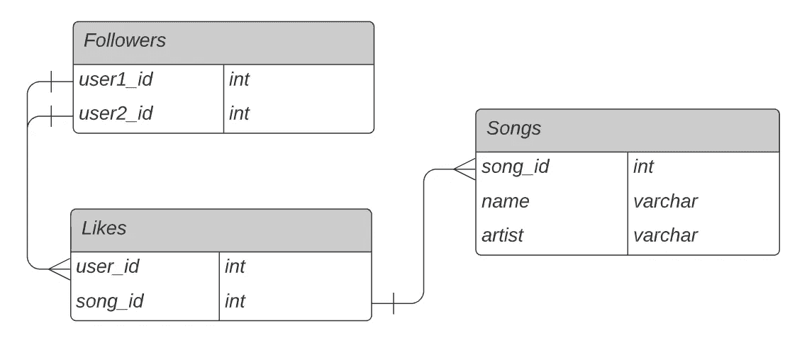
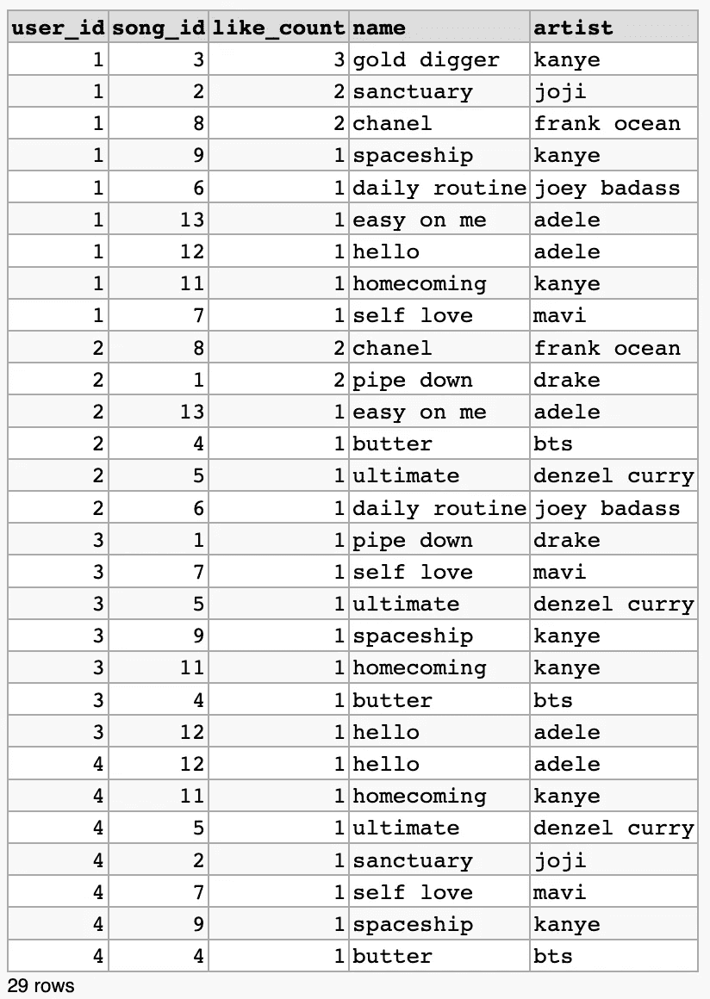

# 用 SQL 构建协同过滤音乐推荐系统

> 原文：<https://towardsdatascience.com/build-a-collaborative-filtering-music-recommendation-system-in-sql-d9d955cfde6c>

## 用 SQL 实现用户项目协同过滤推荐引擎


图片由[奥斯汀·尼尔](https://unsplash.com/@arstyy)从 [Unsplash](https://unsplash.com/photos/hgO1wFPXl3I) 拍摄

本文将用 SQL 在关系数据库中构建一个简单的用户项目协同过滤推荐系统。以下是文章提纲:

**目录**

*   协同过滤概述
    -示例
*   问题陈述
*   数据概述
*   履行
*   结束语
*   资源

# 协作过滤概述

协同过滤旨在通过用户的偏好来预测用户的兴趣。这可以通过过滤不同用户、数据源等之间的模式来实现。协同过滤如何工作背后的主要直觉如下，如果用户 A 和 B 对产品 X 有相似的品味，那么用户 A 和 B 很可能对其他产品也有相似的品味。

在协同过滤中有两种常见的方法，基于记忆的方法和基于模型的方法。本文的重点将是基于内存的方法。我们将查看用户项目组合的评级，以便为其他用户提供推荐。在我们示例的上下文中，项目将是音乐。基于用户的协同过滤本质上意味着志同道合的用户会产生强烈的相似的推荐。基于项目的协同过滤基于项目之间的相似性来推荐项目，该相似性是使用那些项目的用户评级来计算的。

这种协同过滤模型的主要缺点是它对推荐新项目不友好，这是因为没有用户/项目与之交互。这被称为[冷启动问题](https://en.wikipedia.org/wiki/Cold_start_(recommender_systems))。另一个问题来自高度稀疏的数据，特别是基于内存的模型，当数据集非常稀疏时，性能会很差。

**例题**

协作过滤算法的一些例子:

*   向用户推荐亚马逊产品——根据购买/评论过该产品或其他类似产品的其他用户向您推荐产品。
*   Udemy 课程推荐——根据其他已经完成并喜欢你已经完成的现有课程的人向你推荐课程。

如果您想了解更多关于推荐系统以及使用推荐系统解决问题的各种方法和实现的信息，请查看我的文章 [*推荐系统解释*](/recommendation-systems-explained-a42fc60591ed#:~:text=Loosely%20defined%2C%20a%20recommender%20system,Amazon%2C%20Reddit%2C%20Netflix%20etc.) ，了解推荐系统解决方案在 Python 中的直觉和实现，以及推荐系统的协作过滤、基于内容和混合方法。我还写了另一篇关于 Node2Vec 的 [*链接预测推荐系统的文章，其中也提到了您可能感兴趣的推荐系统中的问题和解决方案。*](/link-prediction-recommendation-engines-with-node2vec-c97c429351a8)

# 问题陈述

这个问题比较容易理解。假设你目前在 Spotify、Apple Music 或 Tidal 等音乐流媒体平台工作。你有一个庞大而活跃的用户群，他们有能力关注其他用户，喜欢他们喜欢的歌曲。我们希望设计一个推荐引擎，推荐用户还没有听过，但这个用户正在关注的用户已经听过并喜欢的歌曲。

# 数据概述

以下架构概述了可供用户使用的表、列和数据。

```
Table : Followers
+---------------+---------+
| Column Name   | Type    |
+---------------+---------+
| user1_id      | int     |
| user2_id      | int     |
+---------------+---------+The Followers table consists of two columns, user1_id and user2_id where the fields would be populated if user1 follows user2\. The id's are unique identifiers associated with this table and can be mapped to the activity table by merging on user_id.Table : Likes
+---------------+---------+
| Column Name   | Type    |
+---------------+---------+
| user_id       | int     |
| song_id       | int     |
+---------------+---------+The Likes table also consists of two columns, user_id and song_id. The id's are unique identifiers associated with the user and song respectively. This table implies that the user under the user_id column has liked the song under the song_id column. The song_id from the Likes table can be mapped to the song_id from the Songs table to get the song name.Table : Songs
+-----------------+-------------+
| Column Name     | Type        |
+-----------------+-------------+
| song_id         | int         |
| name            | varchar     |
| artist          | varchar     |
+-----------------+-------------+The Songs table consists of three columns, song_id, artist and name. Each song_id is mapped to a name associated with that song and an artist which created that song. 
```

下图显示了与上述数据库相关联的模式。



数据库模式概述。图片由作者提供。

# 履行

您可以使用下面的 [DB Fiddle](https://dbfiddle.uk/?rdbms=postgres_9.5&fiddle=42837d39e721d6a0224b7d4944cf8a2c) 或通过我的 [GitHub](https://github.com/vatsal220/medium_articles/tree/main/music_sql_rec_sys) 上的相应查询来实现。

我们首先将一些有用的数据插入数据库。可以执行下面的代码片段，将几行数据添加到每个适当的表中。

现在我们可以建立推荐系统了。我们可以将其分为 3 个步骤，首先创建一个包含所有 user _ ids 的 CTE。其次，创建另一个 CTE，显示他们的追随者喜欢的所有歌曲。最后，通过 likes 表，我们可以合并来自步骤 2 的 CTE，以找到朋友喜欢但用户不喜欢的歌曲。

基于我们插入到数据库中的数据，上面的查询应该产生以下结果。



每个用户推荐的歌曲，该用户还没有听过，但是该用户的追随者已经喜欢了。图片由作者提供。

根据我们插入的数据，我们注意到没有听过`song_id = 3`的`user_1`正在关注听过`song_id =3`的`user_2`、`user_3`和`user_4`。因此建议用户 1 可能也喜欢`song_id = 3`。相同的逻辑可以应用于对其余用户的其余推荐。

# 结束语

本教程的目的是展示如何通过 SQL 解决相对困难的问题。请注意，这个问题和解决方案有许多缺陷和警告。它可以通过处理各种边缘情况得到极大的改善，例如新用户没有关注任何人，新歌很少或没有参与，因此无法推荐给其他人，新发行的优先顺序等。这种解决方案的许多缺陷与推荐系统的冷启动问题有关。

您可以使用下面的 [DB Fiddle](https://dbfiddle.uk/?rdbms=postgres_9.5&fiddle=42837d39e721d6a0224b7d4944cf8a2c) 或通过我的 [GitHub](https://github.com/vatsal220/medium_articles/tree/main/music_sql_rec_sys) 上的相应查询来实现。

如果你想转型进入数据行业，并希望得到经验丰富的导师的指导和指引，那么你可能想看看最敏锐的头脑。Sharpest Minds 是一个导师平台，导师(他们是经验丰富的实践数据科学家、机器学习工程师、研究科学家、首席技术官等。)将有助于你的发展和学习在数据领域找到一份工作。点击查看它们[。](https://www.sharpestminds.com/?r=vatsal-patal)

# 资源

*   [https://towards data science . com/re commendation-systems-explained-a 42fc 60591 ed](/recommendation-systems-explained-a42fc60591ed)

如果你喜欢这篇文章，你可能也会喜欢我写的其他文章。请随意查看下面的内容。

[](/recommendation-systems-explained-a42fc60591ed)  [](/active-learning-in-machine-learning-explained-777c42bd52fa)  [](/link-prediction-recommendation-engines-with-node2vec-c97c429351a8)  [](/louvains-algorithm-for-community-detection-in-python-95ff7f675306)  [](/text-similarity-w-levenshtein-distance-in-python-2f7478986e75)  [](/text-summarization-in-python-with-jaro-winkler-and-pagerank-72d693da94e8)  [](/word2vec-explained-49c52b4ccb71) 