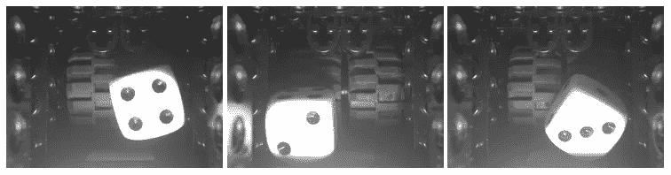
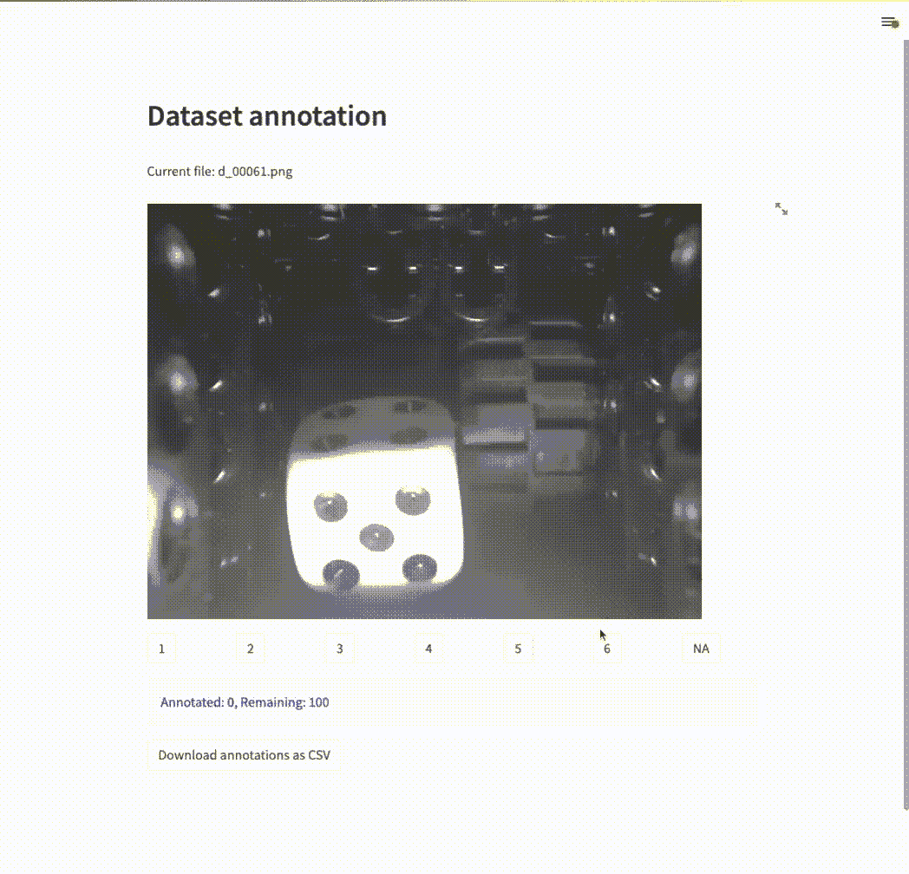

# 使用 Streamlit 用不到 50 行代码构建一个数据注释管道

> 原文：<https://towardsdatascience.com/build-a-data-annotation-pipeline-with-less-than-fifty-lines-of-code-with-streamlit-e72a3a84e259>

## 轻松创建自己的带注释的数据集

## 介绍

你将在网上看到的大多数机器和深度学习教程都使用众所周知的公共数据集。一个流行的例子是著名的英国统计学家和生物学家罗纳德·费雪的鸢尾花数据集，他在 1936 年的论文中测量了 150 种花的四个特征。在数据集中，每一种花都属于三个物种中的一个，因此我们为每个测量值设置了一个标签。然后，监督学习算法可以学习区分不同的类别。

对于现实世界的问题，我们往往不能依赖现有的数据集，需要创建自己的数据集才能建立模型。这可能是一项繁琐的工作，对罗纳德·费雪来说就是如此——手动收集和管理大量样本。有时，您已经收集了原始数据，并希望进行监督学习，但还没有对数据进行分类。这意味着要仔细检查所有东西，并让人工输入来分配标签。

如今，有几种注释工具可以用于此目的。有些是高度自动化的，例如亚马逊的[地面真相](https://aws.amazon.com/sagemaker/data-labeling/?sagemaker-data-wrangler-whats-new.sort-by=item.additionalFields.postDateTime&sagemaker-data-wrangler-whats-new.sort-order=desc)，它会在上传数据时为你提供各种信息标签。尽管如此，这些工具可能不适合手头的任务。当原型设计和开发一个最小可行的产品时，你应该有一个工具，允许你快速地处理你的数据和分配你的标签。

在本文中，我们将展示如何借助 Python 中的 streamlit 快速构建这样一个工具。

照片由[格伦·卡斯滕斯-彼得斯](https://unsplash.com/@glenncarstenspeters?utm_source=unsplash&utm_medium=referral&utm_content=creditCopyText)在 [Unsplash](https://unsplash.com/?utm_source=unsplash&utm_medium=referral&utm_content=creditCopyText) 拍摄

## 示例:注释数据集以进行分类

对于我们的示例用例，我们想要为分类任务标记图像。这可以是你选择的数据集，例如, [fashion-mnist](https://github.com/zalandoresearch/fashion-mnist) 集合。对于本教程，我使用我自己的一些数据。前段时间写了下面这篇关于骰子随机性的文章，记录了~ 3000 张随机投掷的图像(*。png 图片，640 × 480 px)。

 [## 棋盘游戏:骰子有多随机？

### 用 openCV 和假设检验分析骰子的随机性。

towardsdatascience.com](/christmas-games-how-random-are-dice-969f8a935b18) 

下面是显示前三幅图像的数据集预览:

示例*。随机骰子数据集的 png 图像。每张图片为 640 × 480 px。

我在这里上传了这些图片的一个子集(前 100，~ 10 MB) [，这样你就可以跟上了。如果您想要完整的数据集，请随时联系。在本文中，我使用 OpenCV 从图像中自动提取点数。当时，一位评论员发现了一张贴错标签的图片，显示自动标注并不完美。作为一个值得注意的评论，即使是著名的](https://drive.google.com/file/d/168vXrtgIEwYu88LVQUEXauDhom6FlSlB/view?usp=sharing) [MNIST 数据集也包含 15 个标签错误](https://www.csail.mit.edu/news/major-ml-datasets-have-tens-thousands-errors)。

对于手头的任务，我们希望进行手动注释，并为每张图像分配一个 1 到 6 之间的数字，或者不进行定义。注意，图像处理中的*注释*用于多个不同的任务，例如，绘制感兴趣区域和分配标签。在这里，我们使用注释，因为我们有一个图像，并希望为它添加一个标签，即每个骰子的点数。

## 方法

为了构建我们的管道，我们将使用 [streamlit](https://streamlit.io) ，这是一个开源 Python 库，允许您快速构建数据应用的前端。一个关键的特性是，当您更改代码时，web 服务器会更新。这使您能够在编码时直接看到 UI 是如何变化的。

# **设置**

首先，您需要一个工作的 Python 环境(例如，通过 [miniconda](https://docs.conda.io/en/latest/miniconda.html) )。

*   用`pip install streamlit`安装 streamlit
*   用`annotation.py`创建一个空的 Python 文件
*   将下载的图像复制到同一个文件夹中；这应该是`DICE_IMAGES_100`
*   对于这个项目，另外，安装 Python 图像库:`pip install Pillow`
*   用`streamlit run annotation.py`运行文件
*   访问正在运行的 web 服务器；默认为`http://localhost:8501/`

现在让我们添加一些功能。

## 代码和用户界面

streamlit 的基本事件循环从上到下运行一个脚本。在早期版本中，这意味着选择会在重新运行时丢失。如果我们想要存储注释并保存状态，这就需要一个变通方法。幸运的是，streamlit 最近引入了一个特性来做到这一点:[会话状态](https://docs.streamlit.io/library/api-reference/session-state)。发布说明包括[演示代码](https://github.com/streamlit/release-demos/blob/0.84/0.84/demos/labelling.py)，它可以作为注释项目的起点。对于我们的任务，我们要做如下工作:

*   将注释作为 dict 存储在 session_state 中。
*   显示文件夹中的图像，并给出选项供选择:`[1,2,3,4,5,6,NA]`。
*   提供一个按钮，以*.csv 格式下载注释。

总的来说，我们可以用不到 50 行代码实现这一点:

streamlit 注释工具的代码。

将上面的代码复制到`annotation.py`文件中。Streamlit 应该会检测到代码更改，并且在浏览器窗口中，您应该会看到一个通知，告知源文件已经被更改。单击重新运行以刷新页面。

## 运行实例

上面的代码运行后，我们可以点击我们的数据集。这应该是这样的:

streamlit 页面的截屏。GIF 实时播放；我们可以快速注释我们的数据集。

GIF 是实时的，我希望人们能够理解，分配标签和加载下一张图像的速度非常快，从而提供无缝的用户体验。最终，我们可以快速注释，突出该方法的实用性。在注释过程中的任何时候，我们都可以将注释的当前状态导出为*.csv。

## 限制

可以说，这种解决方案对于原型制作来说很方便，但是有几个缺点，我们应该简单讨论一下:

**并发性:**会话状态是基于每个会话的。这意味着如果另一个用户同时连接，他们将注释同一个数据集。根据使用情况，这可能是有用的，例如，当想要为相同的文件从不同的用户收集多个注释时。另一方面，当有很多文件并且想要分发作品并且只对每个图像注释一次时，这是行不通的。在这里，我们可以编写功能，这样每个用户都可以从整个集合中获得一批要注释的文件。

**文件集成:**此外，从文件管理的角度来看，当前的实现是不可扩展的。我们从脚本所在的同一文件夹中加载图像数据。这对于较大的映像集来说是不切实际的，我们更愿意集成到一个更大的文件系统，例如，通过连接到云存储，比如 S3 存储桶。

**批注记账:**将批注导出为*。csv 相当初级，当有许多数据集或注释迭代时会很不方便。在这里，与数据库(例如 MongoDB)的连接将有助于跟踪带注释的文件。此外，应该扩展存储的数据。在这种情况下，记录额外的元数据，比如时间、用户和文件散列，可能会很有趣。

# **结论**

Streamlit 是一种非常快速的构建实用程序的方法，可以在数据科学工作流程中为您提供帮助。在这里，我们用它来建立一个标签管道。然而，一些限制会阻碍该方法的可伸缩性，并且需要额外的集成。对于更大的任务，看看其他现有工具是否更适合这项工作可能是值得的。如今，注释任务也可以作为微工作的一部分被外包出去，这可能是一个值得的选择。然而，对于手头的注释任务，streamlit 方法是一个有价值的解决方案。

*我目前正在探索这种形式，以分享更多数据科学的想法。你有什么改进的建议吗，或者你有一个我应该总结的话题吗？让我知道！如果你喜欢中等并且正在考虑成为会员，可以随意使用* [*我的推荐链接*](https://medium.com/@straussmaximilian/membership) *。*