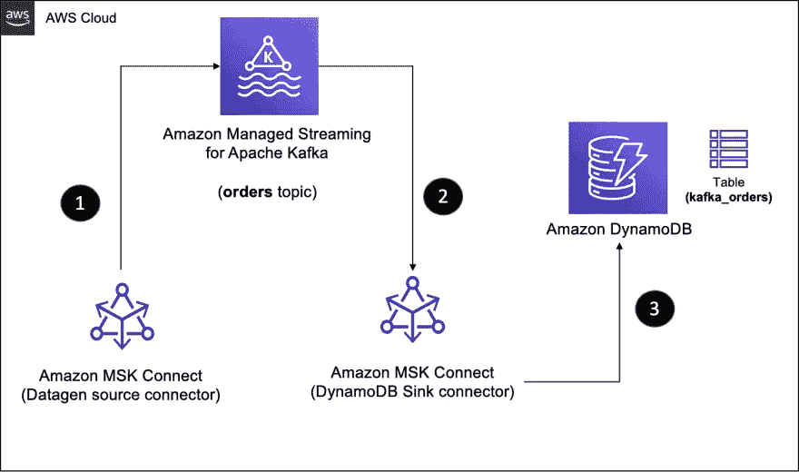
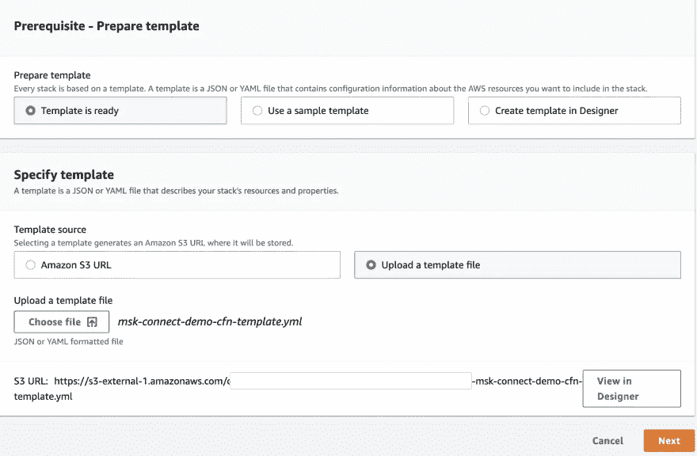
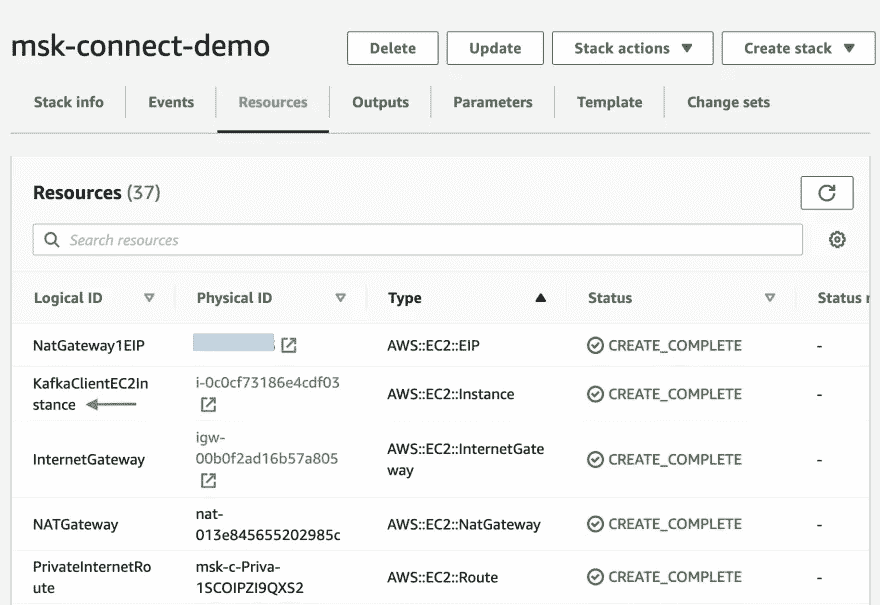
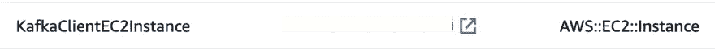
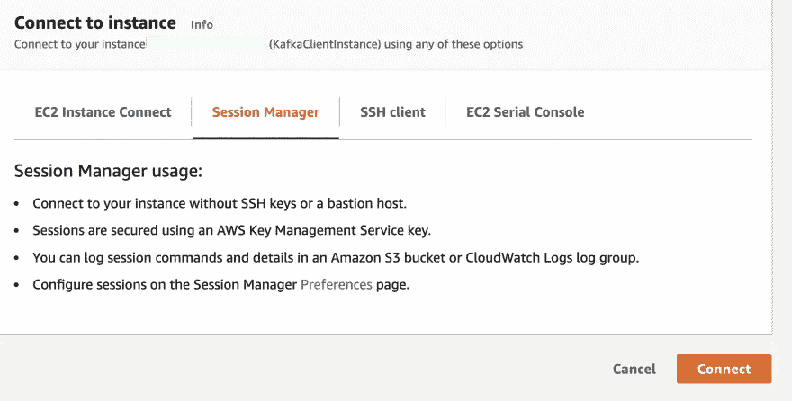
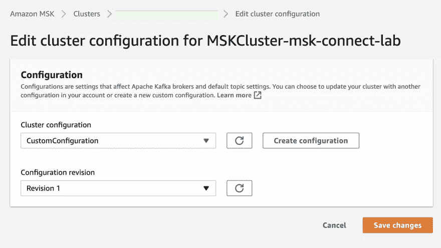
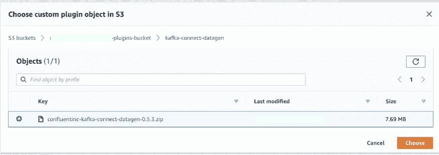
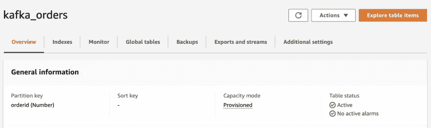

# 使用 Kafka、Kafka connect 和 DynamoDB 在 AWS 上构建数据管道

> 原文：<https://towardsdatascience.com/build-a-data-pipeline-on-aws-with-kafka-kafka-connect-and-dynamodb-97642cdb0cfb>

## **集成 DynamoDB 与 MSK 和 MSK 连接**

有许多方法可以缝合数据管道——开源组件、托管服务、ETL 工具等。在卡夫卡的世界里， [Kafka Connect](https://kafka.apache.org/documentation/#connect) 是*“Apache Kafka 和其他系统之间的流数据”*的首选工具。它有一套广泛的预建源和接收器连接器，以及*Kafka 连接器的通用框架*，该框架将其他数据系统与 Kafka 的集成标准化，并使开发自己的连接器变得更加简单，如果有必要的话。


照片由[迈克·本纳](https://unsplash.com/@mbenna?utm_source=medium&utm_medium=referral)在 [Unsplash](https://unsplash.com?utm_source=medium&utm_medium=referral) 上拍摄

这是一个由两部分组成的博客系列**,它提供了 Kafka 和 Kafka Connect 的数据管道的逐步演示。出于演示目的，我将使用 AWS，但是这些概念适用于任何等效的选项(例如，使用 Docker 在本地运行这些选项)。以下是我将使用的一些关键 AWS 服务:**

*   [亚马逊为 Apache Kafka (MSK)管理流媒体](https://docs.aws.amazon.com/msk/latest/developerguide/what-is-msk.html) —数据基础设施的核心组件。
*   [MSK 连接](https://docs.aws.amazon.com/msk/latest/developerguide/msk-connect.html) —它将用于部署为 Kafka Connect 构建的完全受管连接器，以便将数据移入各种源或从各种源提取数据。
*   [Amazon DynamoDB](https://docs.aws.amazon.com/amazondynamodb/latest/developerguide/Introduction.html) 是一个完全托管的 NoSQL 数据库服务，在这个博客系列的上下文中，它充当我们的数据管道的目标/接收器。
*   亚马逊 Aurora MySQL 是一个完全托管的、兼容 MySQL 的关系数据库引擎，在本博客系列的第二部分中使用。

以下是每个部分将涵盖的内容:

*   第一部分将保持事情相对简单——它是关于容易地开始。我将使用 [Kafka Connect Datagen source 连接器](https://github.com/confluentinc/kafka-connect-datagen)将一些样本数据泵入 MSK 主题，然后使用 [AWS DynamoDB 接收器连接器](https://docs.confluent.io/kafka-connect-aws-dynamodb/current/overview.html)将这些数据保存在 DynamoDB 表中。
*   第二部分将更上一层楼，我们将探索变更数据捕获。Datagen 连接器将被 MySQL 的 [Debezium 连接器](https://debezium.io/documentation/reference/1.9/connectors/mysql.html)所取代，它将从 Aurora MySQL 的表中实时提取数据，并将其推送到 MSK 主题。然后，我们将像以前一样继续使用 DynamoDB 接收器连接器。

# 准备基础设施组件和服务

首先，您需要部署本教程所需的所有资源。有很多，但不要担心，因为我已经为你准备好了云形成模板！

**继续之前，请从** [**此链接**](https://gist.github.com/abhirockzz/6ab9a653f1edd7aa612917a1f596b4d4) 下载模板

这是这篇博文中提出的解决方案的高级示意图。



高层架构(图片由作者提供)

> *有关逐步说明，请参考官方文档*中的 [*在 AWS CloudFormation 控制台*](https://docs.aws.amazon.com/AWSCloudFormation/latest/UserGuide/cfn-console-create-stack.html) *上创建堆栈*

使用 AWS 控制台部署 CloudFormation 模板——在**创建堆栈**向导上，选择**上传模板文件**并上传您刚刚下载的文件。



点击**下一个**，输入堆栈的名称。单击**下一步**继续—在向导的最后一页，单击**创建堆栈**开始创建资源。

您可以在 CloudFormation 控制台中跟踪进度。一旦成功，您应该拥有所有资源，包括:

*   核心基础设施:VPC、子网等。
*   服务:MSK 集群，极光 MySQL 等。
*   其他:IAM 角色、CloudWatch 日志组等。



**通过会话管理器**连接到 EC2 实例

在 CloudFormation 资源列表中，找到`KafkaClientEC2Instance` EC2 实例(在上图中突出显示)



使用会话管理器连接到它:



**启用自动主题创建**

MSK 连接要求即时创建主题。我们可以在 MSK 创建一个[定制配置](https://docs.aws.amazon.com/msk/latest/developerguide/msk-configuration-properties.html)来实现自动主题创建。

从 EC2 实例中，运行以下命令来创建自定义配置:

```
sudo -u ec2-user -i
mkdir kafka-configuration && cd kafka-configurationcat <<EOF > configuration.txt 
auto.create.topics.enable=true
EOFexport AWS_REGION=<enter MSK cluster region e.g. us-east-1>
export AWS_REGION=us-east-1aws kafka create-configuration \
    --name "CustomConfiguration" \
    --description "Topic auto-creation enabled" \
    --kafka-versions "2.6.2" \
    --region $AWS_REGION \
    --server-properties file://configuration.txt
```

继续并应用此配置:



转到您的`MSK cluster > Properties > Configuration`并选择**编辑**。
选择您刚刚创建的配置，然后**保存**。这将*重启*您的 MSK 集群——请等待此操作完成后再继续。

# 数据管道:第 1 部分

让我们首先创建管道的前半部分，它将利用 Datagen source connector 将样本事件抽取到 MSK 的一个主题中。

在本节中，您将:

*   下载 Datagen 连接器产品
*   在 MSK 创建自定义插件
*   将 Datagen 源连接器部署到 MSK 连接

最后，数据管道的前半部分将准备就绪！

## 创建自定义插件和连接器

**将 Datagen 连接器文件上传到**T1

从 Kafka 客户端 EC2 实例中，运行以下命令:

```
sudo -u ec2-user -i
mkdir kafka-connect-datagen && cd kafka-connect-datagenwget https://d1i4a15mxbxib1.cloudfront.net/api/plugins/confluentinc/kafka-connect-datagen/versions/0.5.3/confluentinc-kafka-connect-datagen-0.5.3.zip
aws s3 cp ./confluentinc-kafka-connect-datagen-0.5.3.zip s3://msk-lab-<ENTER_YOUR_AWS_ACCOUNT_ID>-plugins-bucket/cd ..
```

**创建自定义插件**

> *有关如何创建 MSK 连接插件的分步说明，请参考官方文档中的* [*使用 AWS 管理控制台*](https://docs.aws.amazon.com/msk/latest/developerguide/msk-connect-plugins.html) *创建自定义插件。*

创建定制插件时，确保选择你在上一步上传到`Amazon S3`的 Datagen 连接器 zip 文件。



**创建数据生成源连接器**

> *关于如何创建 MSK 连接连接器的逐步说明，请参考官方文档中的* [*创建连接器*](https://docs.aws.amazon.com/msk/latest/developerguide/msk-connect-connectors.html#mkc-create-connector-intro) *。*

要创建连接器:

1.  选择您刚刚创建的插件。
2.  输入连接器名称，并选择 MSK 集群和 IAM 身份验证
3.  您可以在连接器配置部分输入下面提供的内容

```
connector.class=io.confluent.kafka.connect.datagen.DatagenConnector
kafka.topic=orders
quickstart=orders
key.converter=org.apache.kafka.connect.storage.StringConverter
value.converter=org.apache.kafka.connect.json.JsonConverter
value.converter.schemas.enable=false
max.interval=10000
iterations=-1
tasks.max=1
```

> *保持其余配置不变*

1.  在**访问权限**下，为连接器选择正确的 IAM 角色(名称中带有`DatagenConnectorIAMRole`的角色)
2.  点击下一步的**进入**安全**选项——保持不变**
3.  点击**下一个**。对于**日志交付**，选择**交付到亚马逊 CloudWatch 日志**。找到并选择`/msk-connect-demo-cwlog-group`
4.  点击**下一步** —在最后一页，向下滚动并点击**创建连接器**以启动流程并等待连接器启动。

完成后，连接器转换到**运行**状态，继续以下步骤。

## 测试管道

在您继续下一步之前:

*   下载 AWS IAM JAR 文件，并将其包含在类路径中
*   为 Kafka CLI 使用者创建属性文件

在 EC2 实例中，运行以下命令:

```
sudo -u ec2-user -imkdir iam-auth && cd ./iam-auth
wget https://github.com/aws/aws-msk-iam-auth/releases/download/1.1.0/aws-msk-iam-auth-1.1.0-all.jar
cd ../cat <<EOF > /home/ec2-user/kafka/config/client-config.properties
# Sets up TLS for encryption and SASL for authN.
security.protocol = SASL_SSL# Identifies the SASL mechanism to use.
sasl.mechanism = AWS_MSK_IAM# Binds SASL client implementation.
sasl.jaas.config = software.amazon.msk.auth.iam.IAMLoginModule required;# Encapsulates constructing a SigV4 signature based on extracted credentials.
# The SASL client bound by "sasl.jaas.config" invokes this class.
sasl.client.callback.handler.class = software.amazon.msk.auth.iam.IAMClientCallbackHandler
EOFexport CLASSPATH=/home/ec2-user/iam-auth/aws-msk-iam-auth-1.1.0-all.jar
echo "export CLASSPATH=${CLASSPATH}" | tee -a ~/.bash_profile
```

首先，列出卡夫卡的主题:

```
export MSK_BOOTSTRAP_ADDRESS=<ENTER MSK CLUSTER ENDPOINT>/home/ec2-user/kafka/bin/kafka-topics.sh --bootstrap-server $MSK_BOOTSTRAP_ADDRESS --command-config /home/ec2-user/kafka/config/client-config.properties --list
```

启动 Kafka CLI 消费者:

```
/home/ec2-user/kafka/bin/kafka-console-consumer.sh --bootstrap-server $MSK_BOOTSTRAP_ADDRESS --consumer.config /home/ec2-user/kafka/config/client-config.properties --from-beginning --topic orders | jq --color-output .
```

如果一切设置正确，您应该会看到类似如下的 JSON 输出:

```
...
{
  "ordertime": 1488059390707,
  "orderid": 50,
  "itemid": "Item_845",
  "orderunits": 4.801443003705596,
  "address": {
    "city": "City_",
    "state": "State_6",
    "zipcode": 34225
  }
}
{
  "ordertime": 1496655341559,
  "orderid": 51,
  "itemid": "Item_71",
  "orderunits": 6.184874231875158,
  "address": {
    "city": "City_63",
    "state": "State_91",
    "zipcode": 77633
  }
}
...
```

# 数据管道:第 2 部分

只要 Datagen source 连接器在运行，它就会继续生成样本订单数据。根据我们的配置(`max.interval=10000`和`iterations=-1`)，它将每 10 秒产生一条记录。

接下来，我们将实现管道的另一半，它负责在 DynamoDB 接收器连接器的帮助下，将数据从 MSK 主题传送到 DynamoDB 表。

在本节中，您将:

*   下载 DynamoDB 连接器构件
*   在 MSK 创建自定义插件
*   将 DynamoDB 接收器连接器部署到 MSK 连接

## 创建自定义插件和连接器

**将 DynamoDB 连接器上传到**T3

登录 Kafka 客户端 EC2 实例:

```
sudo -u ec2-user -imkdir kafka-connect-dynamodb && cd kafka-connect-dynamodbwget https://d1i4a15mxbxib1.cloudfront.net/api/plugins/confluentinc/kafka-connect-aws-dynamodb/versions/1.3.0/confluentinc-kafka-connect-aws-dynamodb-1.3.0.zipaws s3 cp ./confluentinc-kafka-connect-aws-dynamodb-1.3.0.zip s3://msk-lab-<ENTER_YOUR_AWS_ACCOUNT_ID>-plugins-bucket/cd ..
```

**创建自定义插件**

> *关于如何创建 MSK 连接插件的分步说明，请参考官方文档中的* [*使用 AWS 管理控制台*](https://docs.aws.amazon.com/msk/latest/developerguide/msk-connect-plugins.html) *创建自定义插件。*

创建自定义插件时，确保选择您在上一步上传到`Amazon S3`的 DynamoDB 连接器 zip 文件。


**创建 DynamoDB 接收器连接器**

> *关于如何创建 MSK 连接器的逐步说明，请参考官方文档中的* [*创建连接器*](https://docs.aws.amazon.com/msk/latest/developerguide/msk-connect-connectors.html#mkc-create-connector-intro) *。*

要创建连接器:

1.  选择您刚刚创建的插件。
2.  输入连接器名称，并选择 MSK 集群和 IAM 身份验证
3.  您可以在连接器配置部分输入下面提供的内容。确保根据您的设置替换以下配置:

*   使用正确的主题名(在我们的例子中是`orders`)
*   在`confluent.topic.bootstrap.servers`中输入 MSK 代理端点
*   对于`aws.dynamodb.endpoint`和`aws.dynamodb.region`，输入您创建 DynamoDB 表的地区，例如`us-east-1`

> *保持其余配置不变*

```
connector.class=io.confluent.connect.aws.dynamodb.DynamoDbSinkConnector
tasks.max=1
topics=orders
aws.dynamodb.region=<ENTER AWS REGION e.g. us-east-1>
aws.dynamodb.endpoint=https://dynamodb.<ENTER AWS REGION>.amazonaws.com
aws.dynamodb.pk.hash=value.orderid
aws.dynamodb.pk.sort=
table.name.format=kafka_${topic}
transforms=flatten
transforms.flatten.type=org.apache.kafka.connect.transforms.Flatten$Value
transforms.flatten.delimiter=_
key.converter.schemas.enable=false
value.converter.schemas.enable=false
key.converter=org.apache.kafka.connect.storage.StringConverter
value.converter=org.apache.kafka.connect.json.JsonConverter
confluent.topic.bootstrap.servers=<ENTER MSK CLUSTER ENDPOINT>
confluent.topic.security.protocol=SASL_SSL
confluent.topic.sasl.mechanism=AWS_MSK_IAM
confluent.topic.sasl.jaas.config=software.amazon.msk.auth.iam.IAMLoginModule required;
confluent.topic.sasl.client.callback.handler.class=software.amazon.msk.auth.iam.IAMClientCallbackHandler
```

1.  在**访问权限**下，为连接器选择正确的 IAM 角色(名称中带有`DynamoDBConnectorIAMRole`的角色)
2.  点击**下一步**进入**安全**选项——保持不变
3.  点击**下一个**。对于**日志交付**，选择**交付至亚马逊云观察日志**。找到并选择`/msk-connect-demo-cwlog-group`
4.  点击下一个的**—在最后一页，向下滚动并点击**创建连接器**以启动流程并等待连接器启动。**

完成后，连接器转换到**运行**状态，继续以下步骤。

在我们继续测试管道之前，您应该知道一些事情:

**选择 DynamoDB 主键**

在上面的配置中，我们将`aws.dynamodb.pk.hash`设置为`value.orderid`，这意味着 Kafka 主题事件有效负载中的`orderid`字段将被用作分区键(将`aws.dynamodb.pk.sort`留空，但如果需要，可以用来指定 [DynamoDB 排序/范围键](https://docs.aws.amazon.com/amazondynamodb/latest/developerguide/HowItWorks.CoreComponents.html#HowItWorks.CoreComponents.PrimaryKey))。

**使用 Kafka Connect SMT 展平记录**

事件有效负载中的`address`字段具有嵌套结构。

```
"address": {
    "city": "City_63",
    "state": "State_91",
    "zipcode": 77633
  }
```

为了取消嵌套或展平(因为没有更好的词)它，我们使用了[展平](https://docs.confluent.io/platform/current/connect/transforms/flatten.html#flatten)变换(`org.apache.kafka.connect.transforms.Flatten$Value`)。这将从`address`中提取单个字段，并使它们作为单个属性- `address_city`、`address_state`、`address_zipcode`可用。很快您将在 DynamoDB 表中看到相同的内容！

## 测试端到端管道

导航到 DynamoDB 控制台。您将看到`kafka_orders`表已经存在——这是由 DynamoDB sink 连接器自动创建的。

> *该表有* `*orderid*` *作为分区键*



如果手头有 AWS CLI，您可以使用`aws dynamodb scan --table-name kafka_orders`快速查看数据。

您将得到类似的输出(注意`address_*`字段):

```
{
    "Items": [
        {
            "orderid": {
                "N": "251"
            },
            "address_zipcode": {
                "N": "68100"
            },
            "address_state": {
                "S": "State_2"
            },
            "itemid": {
                "S": "Item_46"
            },
            "ordertime": {
                "N": "1491423463934"
            },
            "address_city": {
                "S": "City_6"
            },
            "orderunits": {
                "N": "3.1272028351151926"
            }
        },
.....
```

继续，按照您喜欢的方式查询和处理 DynamoDB 表中的数据。那是你的作业！

随着连接器变得神奇，它将继续将 Kafka 主题中的记录同步到 DynamoDB 表中。请记住，只要连接器在运行，数据管道(来自`Datagen source -> MSK topic -> DynamoDB`)就将继续运行——记录将不断被添加到 MSK 的`orders`主题中，并将被保存到 DynamoDB 表中。

# 删除资源

除非您打算阅读本博客系列的第二部分(即将发布)，否则请删除参考资料。

*   删除`Amazon S3`桶的内容(`msk-lab-<YOUR ACCOUNT_ID>-plugins-bucket`)
*   删除云形成堆栈
*   删除 DynamoDB 表
*   删除 MSK 连接连接器、插件和自定义配置

# 结论

像 MSK 互联这样的托管环境负责处理繁重的工作，让您专注于构建数据架构。这篇博客的重点是让您使用一个简单的数据管道，以 DynamoDB 作为接收器。下一部分将包括变更数据捕获，并向您介绍如何使用本文中介绍的组件构建解决方案。