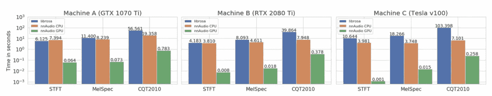
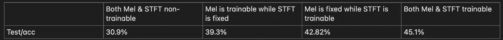
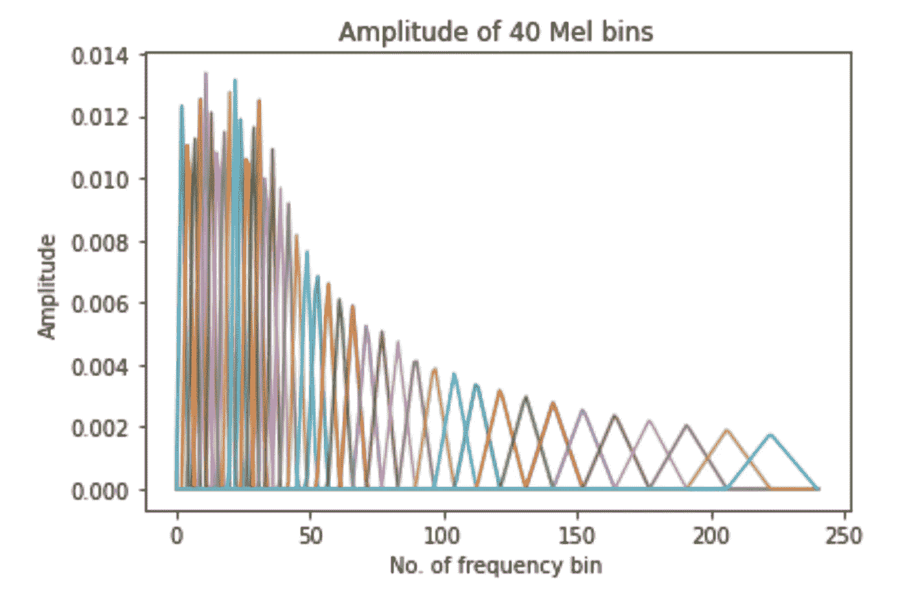
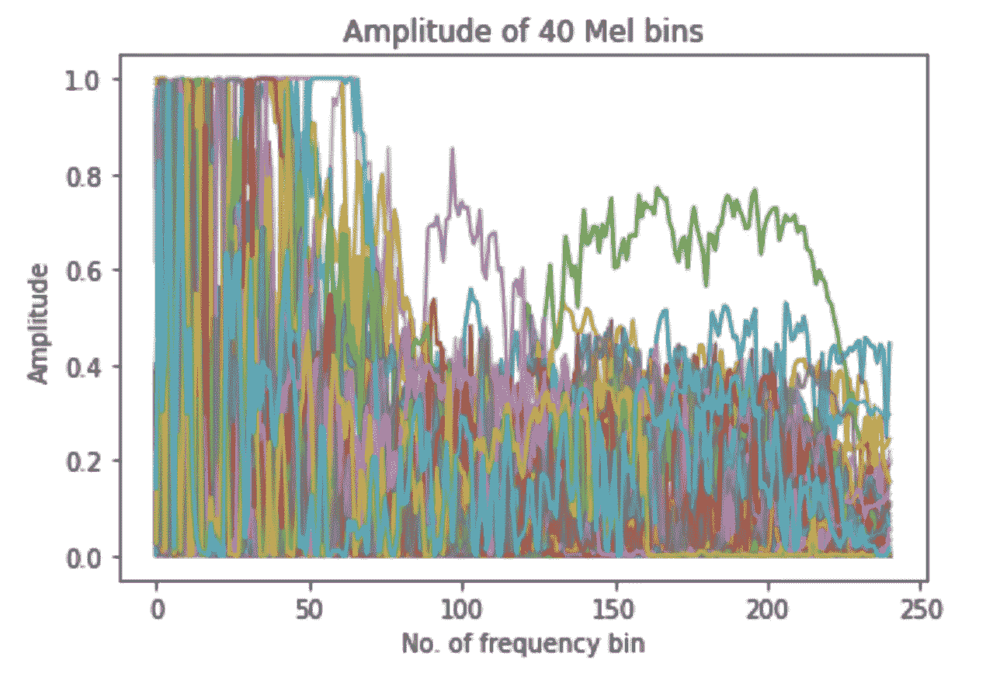
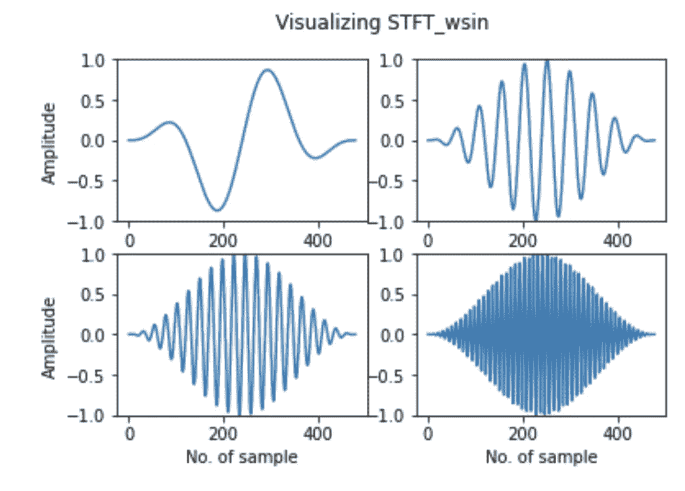
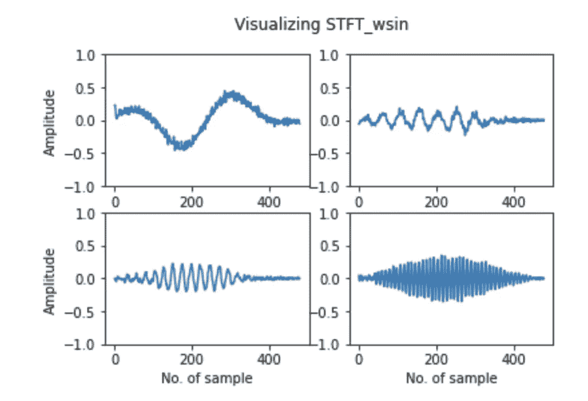

# 使用 nAudio GPU 音频处理为关键词识别(KWS)任务构建深度神经网络

> 原文：<https://towardsdatascience.com/build-a-deep-neural-network-for-the-keyword-spotting-kws-task-with-nnaudio-gpu-audio-processing-95b50018aaa8>

处理音频会使任何机器学习任务变得复杂。在本教程中，我们将介绍如何在 PyTorch 中通过直接输入音频文件来构建神经网络，这些音频文件将直接转换为可微调的频谱图。为此，我们使用 nnAudio [1]和 PyTorch。

本教程将在谷歌语音命令数据集 v2 上为关键词识别(KWS)任务构建一个分类器。KWS 是一个健全的分类问题。我们的模型将预测匹配输入声音文件的单词(文本)。在这个 KWS 任务中总共有 12 个不同的输出类。我们选择使用所有 35 个可用单词中的 10 个，其余 25 个单词归入“未知”类。从背景噪音中产生类别“寂静”。

> [谷歌语音命令数据集](https://arxiv.org/pdf/1804.03209.pdf) v2 有 105829 个话语，总共 35 个单词。该数据集包括一些词语，如“是”、“否”、“上”、“下”、“左”、“右”、“开”、“关”、“停止”和“开始”。每个话语长 1 秒。

在决定这个问题的架构之前，重要的是考虑我们将如何处理音频。我们会使用储存在我们电脑上的光谱图图像，还是 wavenet，还是其他什么？为了回答这个问题，让我们回到几年前，当我的博士生[卓建伟](https://scholar.google.com/citations?user=ZqlEvoMAAAAJ&hl=en)在 SUTD 的时候。Raven 想要建立一个音频转录模型。他很快注意到，在训练模型之前，提取光谱图并将其存储在他的计算机上既麻烦又缓慢，使得不可能调整光谱图设置。因此，他开发了[**nn audio**](https://ieeexplore.ieee.org/abstract/document/9174990)**【1】**库，该库提供了一个有用的开源工具，可以将音频直接加载到 PyTorch 层，在其中音频被动态转换为声谱图表示。

nAudio 使用 PyTorch 1D 卷积神经网络作为其后端。因此，它优化了波形到声谱图的转换过程。这使得离散傅立叶变换的基函数可以被神经网络训练，这意味着它们可以针对手头的任务进行优化。这是可能的，因为短时傅立叶变换(STFT)和梅尔基函数被实现为神经网络的第一层(前端层)。在训练期间，模型能够将梯度反向传播到前端。因此，来自音频信号的最重要的特征可以通过定制的训练频谱图来“捕获”。正如我们将看到的，这为我们训练音频分类任务提供了一种又好又快的方法。

下面的关键词识别(KWS)教程由四部分组成:

*   第 1 部分:加载数据集&简单的线性模型
*   第 2 部分:用可训练的基函数训练线性模型
*   第 3 部分:结果模型的评估
*   第 4 部分:使用更复杂的非线性模型

开始吧！

## 第 1 部分:加载数据集&简单的线性模型

在本教程中，我们将使用光谱图。在音频深度学习中，频谱图扮演着重要的角色:连接音频文件和深度学习模型。前端工具如 [librosa](https://librosa.org/doc/main/index.html) 和 nAudio 将音频波形(时域)转换为频谱图(时频域)，基本上可以采用与模型处理图像类似的方式进行处理。

**加载数据集**

首先，我们需要从谷歌获取数据。我们使用 AudioLoader 来访问[语音命令 12 类数据集](https://github.com/KinWaiCheuk/AudioLoader/blob/master/AudioLoader/speech/speech_README.md#SpeechCommandsv2)。

> AudioLoader 是一个一键式音频加载器，允许你一键下载、解压缩、数据分割和重新采样音频。它现在支持多个流行的数据集，如 MusicNet，MusdbHQ，TIMIT。

在传统的设置中，我们首先提取光谱图，将它们保存到我们的计算机中，然后将这些图像加载到模型中。这很慢，需要磁盘空间，并且很难根据手头的任务调整谱图特征。nAudio 通过作为神经网络的一部分实时计算光谱图来解决这些问题。

通过利用 PyTorch 和 GPU 处理，nAudio 可以计算不同类型的频谱图，如短时傅立叶变换(STFT)、梅尔频谱图和常数 Q 变换(CQT)。从原始 nAudio 论文[1]的下图中可以看出，在 GPU 上处理音频将计算时间缩短了 100 倍。



使用 nAudio GPU(绿色)、nAudio CPU(橙色)和 librosa(蓝色)计算不同类型光谱图的处理时间，以对数标度表示[1]。

**定义模型**

我们将首先用一个简单的单层网络来演示我们的工作流程。模型被定义为*linear model _ n audio，*继承了类*speech command(lightning module)。*可以去 [*设置 Lightning 模块*](https://github.com/heungky/nnAudio_tutorial/blob/master/Part%201_Making%20on-the-fly%20audio%20processing%20possible.ipynb) 了解*父类的更多详情。*

> *[*闪电模块*](https://pytorch-lightning.readthedocs.io/en/latest/common/lightning_module.html) *是 PyTorch 闪电中的一个模块。它可以帮助您将 PyTorch 代码组织成 6 个部分，包括训练循环(training_step)、测试循环(test_step)、优化器和 lr 调度器(configure _ optimizers)。**

*在这个项目中，我们选择使用 Mel-spectrogram，因为这些声谱图箱被缩放以匹配人类听觉频谱。因此，它们可能很好地代表了我们人类所获得的特征。*

*这个简单的模型将声音文件(x)作为输入。然后我们使用 Linearmodel_nnAudio 中的方法*n naudio . features . Mel . Mel spectrogram()*作为神经网络的第一层，将声音文件从音频波形转换成频谱图。*

*出于演示的目的，我们只定义了一个简单的模型，这里有一个额外的线性层。此 KWS 分类任务的输出包含 12 个类，因此图层的输出大小应为 12。*

*nAudio 的结果代码如下。请注意，*nnaudio . features . Mel . Mel spectrogram()*函数有许多附加参数，如果需要，这些参数将允许您对光谱图进行精细控制。*

*带 nnAudio 的线性模型*

***训练模型一个历元***

*下面是用 PyTorch Lightning 为我们的简单线性模型训练 1 个时期的代码。*

*用 nnAudio 训练线性模型*

*训练上述模型导致完成一个历元的计算时间为 17s，这比我们使用 librosa 快了大约 95 倍。*

## *第 2 部分:用可训练的基函数训练线性模型*

*在本节课中，我们将演示如何利用 nAudio 的可训练基函数来构建一个强大的分类器，在反向传播过程中，光谱图实际上会根据手头的任务进行微调。*

***设置基础功能***

*在 nAudio 中，我们可以使傅立叶内核可训练，这允许它在反向传播期间根据我们手头的特定任务进行调整。*

*您可以在下面的函数中修改 Mel-spectrogram 参数，用*可训练 _mel* 和*可训练 _STFT* 控制 Mel 和 STFT 基础是否可训练。*

***训练模特***

*我们使用一个相当标准的训练循环，在此期间，训练好的模型权重将保存在 *lighting_logs* 文件夹中。在本教程的下一步中，我们将进一步了解该模型的性能。*

## *第 3 部分:结果模型的评估*

*您已经训练了一个线性模型，但现在是时候评估模型性能并进行一些可视化了。*

***将预训练的重量加载到模型上***

*每次训练一个模型，光照模块都会将训练好的权重保存在 *lightning_logs* 文件夹中。*

***评估模型性能***

*可以使用测试集上的以下度量来评估 KWS 任务上的模型性能:*

*   *测试/损失(交叉熵)*
*   *测试/acc(精确度)*
*   *F1 矩阵(F1 分数)*
*   *困惑 _ 矩阵*

*测试集的最终精度显示如下，其中的设置略有不同，以允许内核可训练。*

**

*具有不同可训练基函数设置的线性模型的 KWS 任务中的测试/加速*

*当查看这些结果时，请记住我们有一个 12 类问题，因此随机预言将有 8.3%的准确性。从上表中，我们可以看到，通过使用可训练的基函数，与简单的线性模型相比，我们可以将 KWS 任务的准确性提高 14.2 个百分点。进一步调整超参数无疑会进一步提高性能。*

## *想象结果(奖金)*

*当权重存储在我们的检查点文件中时，我们可以在我们的第一层 nnAudio 中可视化一些已学习的内核。检查点文件内部的结构如下所示:*

```
*weight=torch.load('xxxx/checkpoints/xxxx.ckpt')
├── epoch
├── global_step
├── pytorch-lightning_version
│     
├── state_dict
│     ├─ mel_layer.mel_basis
│     ├─ mel_layer.stft.wsin
│     ├─ mel_layer.stft.wcos
│     ├─ mel_layer.stft.window_mask   
│     ├─ linearlayer.weight
│     ├─ linearlayer.bias
│     │
│     
├── callbacks
├── optimizer_states
├── lr_schedulers*
```

**state_dict* 是检查点文件中的字典键之一。它是一个有序的检测，包括基函数(如梅尔箱，STFT) 和层权重(在这种情况下是线性层)**的训练权重。***

*可视化蜂蜜罐*

**mel_layer.mel_basis* 的形状应该是[n_mels，(n_fft/2+1)]，其中 n_mels 是 mel 仓的数量，n_fft 是指用零填充后的窗口信号的长度。在本教程示例中， *mel_layer.mel_basis* 的形状为【40，241】。*

*这是不可训练的 Mel 库和可训练的 Mel 库在 200 个时期的比较。40 个 Mel 箱分别以不同的颜色显示如下:*

**

*trainable _ mel = False*

**

*trainable _ mel = True*

*注意它们是如何变化很大的，并且在我们特定的任务中特别调谐到重要的频率和模式。*

***可视化 STFT***

**mel_layer.stft.wsin* 和 *mel_layer.stft.wcos* 的形状应该是[(n_fft/2+1)，1，n_fft]。在本教程示例中，两者的形状都是[241，1，480]。*

*这是不可训练的 STFT 和可训练的 STFT 在 200 个时代的对比。从左到右，从上到下，分别是第 2、第 10、第 20、第 50 傅立叶核。*

**

*可训练 _STFT =假*

**

*可训练 _STFT =真*

## *第 4 部分:在更复杂的非线性模型中使用可训练的基函数*

*在完成本教程的第 1–3 部分后，您现在对如何将 nAudio 与可训练基函数结合使用有了大致的了解。在本教程的最后一部分，您可以看到如何轻松地调整模型函数，以适应任何类型的深度、复杂的神经网络，从而满足您的需求。唯一需要更改的是模型定义，如下例所示，我们在 nAudio 声谱图层后使用广播残差网络。*

*点击这里，查看完整、更复杂的教程示例[！](https://github.com/heungky/nnAudio_tutorial/blob/master/Part%204_Using%20nnAudio%20Trainable%20Basis%20Functions%20with%20more%20complex%20non-linear%20models.ipynb)*

***结论***

*我们已经通过使用 nAudio [1]可训练基函数，逐步完成了使用 Google 语音命令数据集 v2 构建关键字识别模型的教程。这种方法可以很容易地修改，以适应任何音频分类任务。请在评论中告诉我们您的反馈以及您对代码的处理方式！*

***致谢** 感谢我的研究助理香君怡准备代码片段，感谢卓建伟创建 nAudio！*

***参考文献***

1.  *K.W. Cheuk，H. Anderson，K. Agres 和 D. Herremans，[“nnAudio:一个使用 1D 卷积神经网络的动态 GPU 音频到频谱图转换工具箱”， *IEEE Access* ，第 8 卷，第 161981–162003 页，2020 年，doi:10.11109/Access .](https://ieeexplore.ieee.org/abstract/document/9174990)*
2.  *对于本教程的源代码，可以参考[https://github.com/heungky/nnAudio_tutorial](https://github.com/heungky/nnAudio_tutorial)*
3.  *nAudio 源代码，可以参考[https://github.com/KinWaiCheuk/nnAudio](https://github.com/KinWaiCheuk/nnAudio)*
4.  *对于 nAudio 文档，您可以参考 https://kinwaicheuk.github.io/nnAudio/index.html[的](https://kinwaicheuk.github.io/nnAudio/index.html)*
5.  *1999 年，香港大学，香港理工大学，香港理工大学，香港理工大学。[通过可训练的基本功能理解音频特征。arXiv 预印本 arXiv:2204.11437 。](https://arxiv.org/pdf/2204.11437.pdf)(关于可训练基函数的研究文章)*