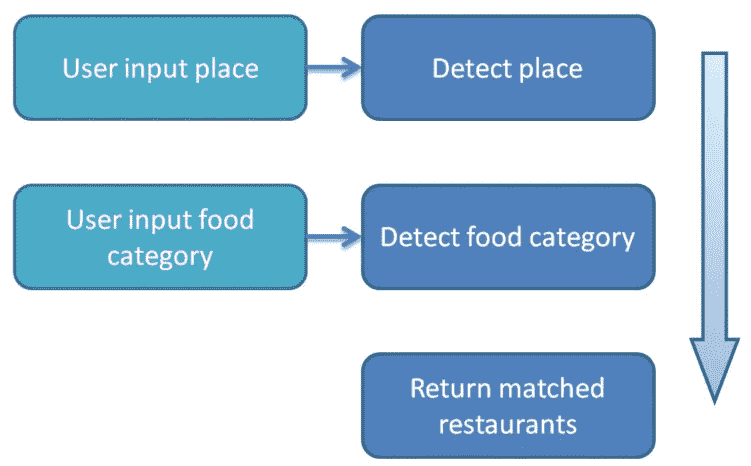
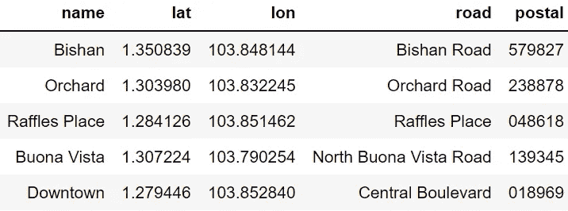
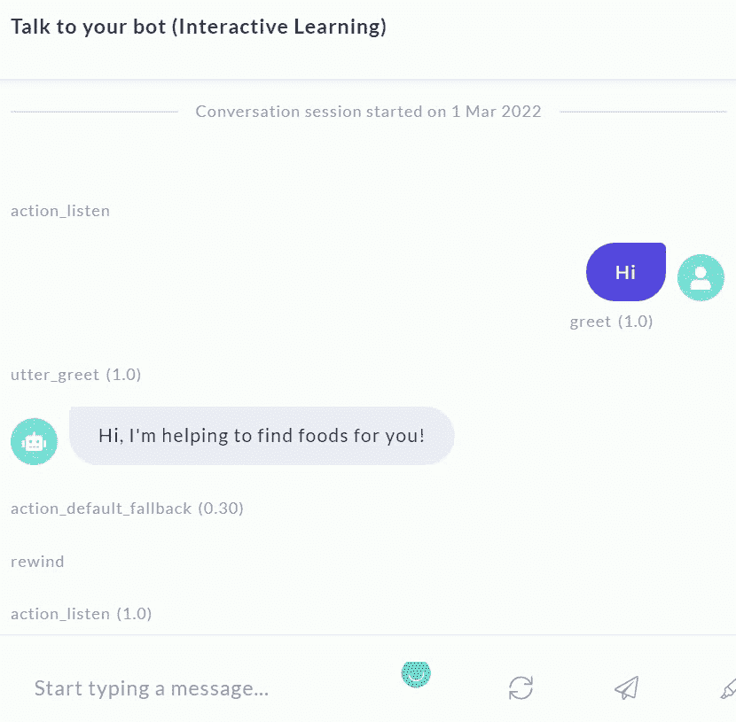

# 在几个小时内建立一个搜索食物的聊天机器人

> 原文：<https://towardsdatascience.com/build-a-food-searching-chatbot-in-hours-ca5b14c710b9>

## 使用 RASA 开发面向任务的聊天机器人的指南

[附身摄影](https://unsplash.com/@possessedphotography?utm_source=medium&utm_medium=referral)在 [Unsplash](https://unsplash.com?utm_source=medium&utm_medium=referral) 上拍照

聊天机器人是对话式用户界面，在许多应用中日益流行，如 IT 服务台、客户服务、销售支持、商业、咨询服务等。

聊天机器人有两种类型，即通用型和面向任务型机器人。多面手聊天机器人是通用和复杂的，例如 Siri，它需要许多领域的知识。特定于任务的机器人要简单得多，但在某些领域(如 FAQ)工作效率很高。

在这篇博客中，作者将带您了解使用 RASA 为食品搜索应用程序构建聊天机器人的步骤。关键步骤如下:

# 明确目标和任务

由于人工智能是当今先进技术的中心，聊天机器人也被寄予厚望，希望能够智能地解决问题，自动完成许多任务。然而，它们不能由任何东西制成。聊天机器人可能需要准确的数据和领域内的深刻知识才能像人类一样聪明地行动。任务不明确，问题范围不具体，就会容易出错。

在本文中，聊天机器人将根据用户的位置和偏好的食物类别来找到相关的食物(即餐馆)。为了使项目的范围更加清晰，这个聊天机器人专注于帮助用户在当地城市环境中找到食物。一个包含城市中受欢迎的地方(地理位置)和餐馆的迷你知识库，是后端搜索引擎所必需的。

下图显示了聊天机器人的简单流程。在 RASA 中，聊天机器人使用 NLU 模块检测用户的位置和食物类别。然后后端即动作服务器运行搜索算法来返回匹配的餐馆。

食物搜索机器人的简单任务流程

# 为迷你知识库收集数据

这个聊天机器人以新加坡市为例。下表显示了这个城市几个受欢迎的地方。地理位置信息，如纬度和经度，是从开放的街道地图(OSM)下载的。

地点数据的示例

餐馆的数据通常来自食品和旅游相关网站或其他数据提供商。然而，为了避免版权问题，作者使用了合成数据，即新加坡市的几家不真实的餐馆作为例子。这些实施例的数据如下所示。与具体食品类别相关的图片来自 [Unsplash](https://unsplash.com?utm_source=medium&utm_medium=referral) 。

餐馆数据示例

# 培训 NLU 相关模块

## 实体和意图

地点和食物类别是从用户输入中提取的关键信息。检测的主要意图是“通知地点”、“通知食品类别”和“寻找食品”意图。这些意图的培训数据示例如下:

## 表格和故事

在 RASA 中，表单用于指导用户输入所有必要的数据。对于这个例子，由于用户输入了地点和食物类别，这是 RASA 表单的一个很好的用例。

RASA 中的故事是为了平滑对话流的过渡。下面的故事显示了触发*食物探测器表单*的条件(意图)。

# 运行并测试聊天机器人

要运行聊天机器人，需要先启动后端服务器，即动作服务器。

然后你运行 rasa x(网络聊天界面)来测试聊天机器人。与机器人的简短对话显示在下面的视频中。

# 结论和进一步改进

这篇博客介绍了构建一个面向任务的聊天机器人的主要步骤，比如搜索食物。所有的代码都在我的 git [库](https://github.com/steveyx/restaurants-bot)中。

还需要做进一步的改进。例如，用户可以查询城市中受欢迎的地方、受欢迎的食物等。这些功能可以通过添加合适的意图和为这些对话流程设计故事来完成。

留下你的评论，非常感谢你的阅读！

# 参考

   