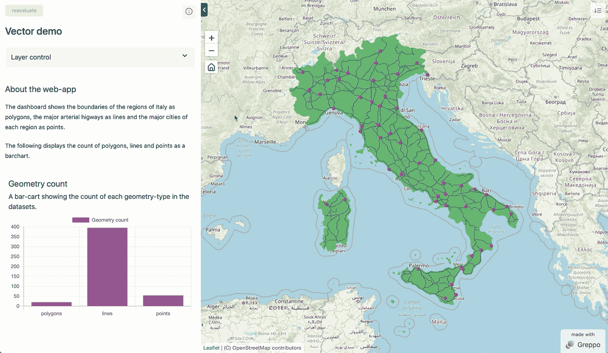
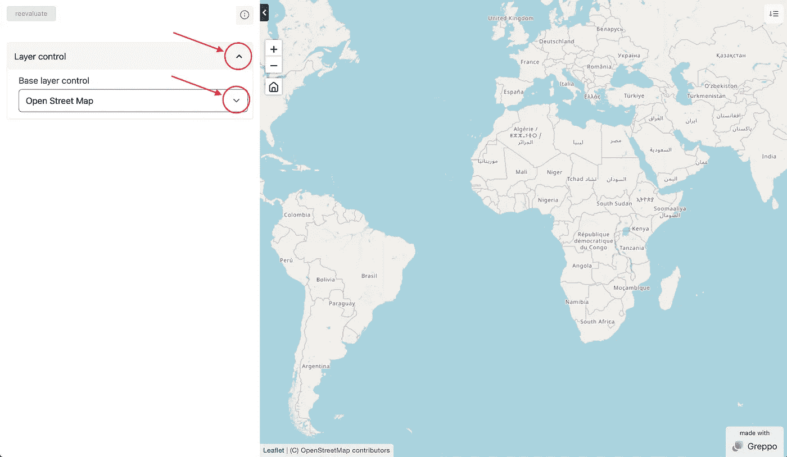
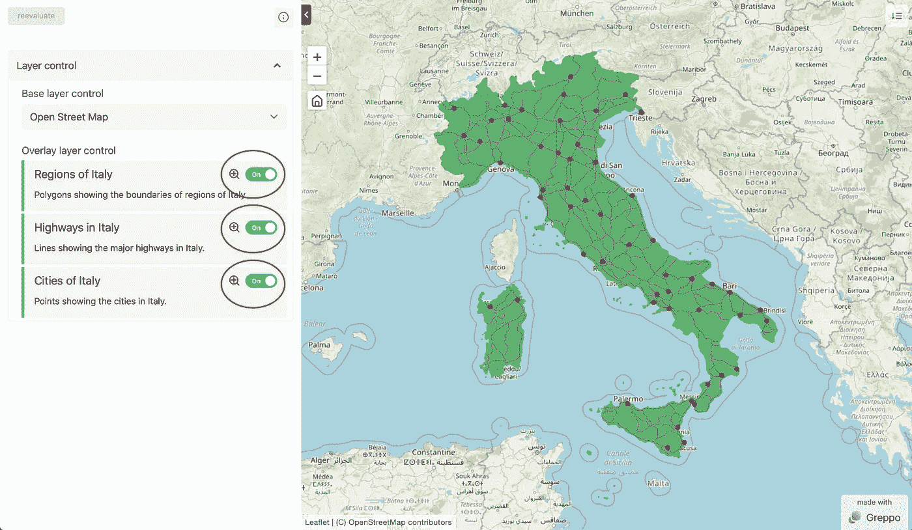
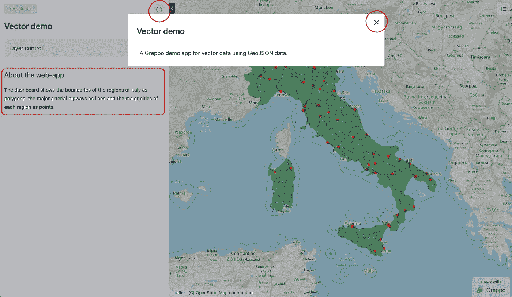
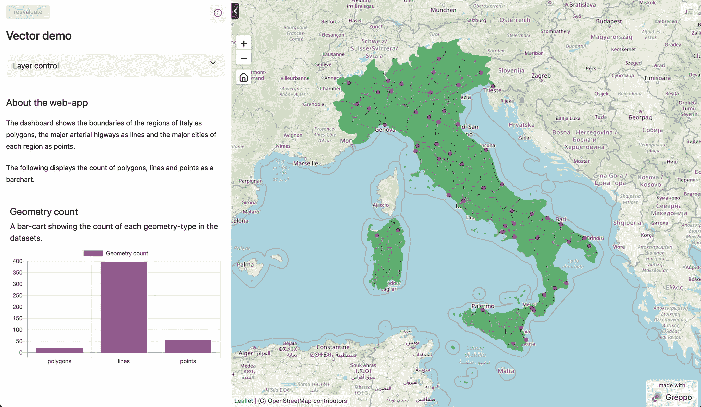

# 使用 Greppo 在 Python 中构建地理空间仪表板

> 原文：<https://towardsdatascience.com/build-a-geospatial-dashboard-in-python-using-greppo-60aff44ba6c9>

## 缺乏前端、后端和 web 开发经验会限制用 Python 制作 web 应用程序。不再是了…



使用 Python 中的 Greppo 构建的地理空间仪表板。图片作者。

地理空间数据分析已经成为数据科学中的一个常见领域。除了绘图和可视化，它主要包括通过检测和识别模式来提取知识，并建立模型进行预测。Python 仍然是数据科学中的标准，对于地理空间数据科学也是如此。支持像 [GeoPandas](https://github.com/geopandas/geopandas) 、 [Shapely](https://github.com/shapely/shapely) 和 [Rasterio](https://github.com/rasterio/rasterio) 这样的项目的社区已经使 Python 成为地理空间分析的首选。

作为一名数据科学家，与包括非技术人员在内的多个利益相关方合作是很常见的。将你的研究成果浓缩成非技术性叙述的能力非常有用。这一切都归结于沟通的结果如何能使利益相关者受益。为 Python 脚本创建仪表盘是讲述故事的有效方法。当您想要与外部利益相关者共享您的工作时，仪表板也很方便，只限制他们的交互和可视化，而不共享内部工作。

# reppo:一种构建地理空间仪表板的快速简单的方法。

# 格雷波

Greppo 是一个用于构建地理空间网络应用的开源 Python 框架。它提供了现成的前端和后端组件作为函数，充当前端交互组件和绑定的后端变量之间的 API。要了解更多关于心智模型的信息，请参考第[页](https://docs.greppo.io/mental-model.html)。

**TL；DR:没有太多的前端、后端和 web 开发经验，你可以用基本的 Python 在 5 分钟内构建和部署一个全功能的 web 应用程序。**

*   GitHub 库:[https://github.com/greppo-io/greppo](https://github.com/greppo-io/greppo)
*   文件:[https://docs.greppo.io/](https://docs.greppo.io/)
*   网址:[https://greppo.io/](https://greppo.io/)

> 在本教程中，我们将使用 Greppo 在 Python 中构建一个地理空间仪表板。我们将通过设置环境、安装、导入数据、为我们的仪表板添加组件和服务来完成工作。您需要了解 Python、GeoPandas 和地理空间分析的基础知识。

# 开始使用…

首先要做的是安装 Python 并设置您的 Python 环境。对于新手来说，可以看看这篇 [***博客文章***](https://krishadi.com/zettelkasten/python/) 来帮助你开始使用 python 环境。一旦你准备好了，让我们安装我们的依赖项。

```
pip install greppo geopandas
```

下载本教程所需的数据集。本教程的所有数据和代码都可以在这个 GitHub 资源库中找到:[GRE PPO-demo/vector-demo](https://github.com/greppo-io/greppo-demo/tree/main/vector-demo)(数据来源:[https://github.com/openpolis/geojson-italy](https://github.com/openpolis/geojson-italy))

# 编写仪表板脚本

我们从建立项目的文件夹结构开始。我将使用以下项目文件夹结构:

```
└── vector-demo
    ├── app.py
    ├── cities.geojson
    ├── regions.geojson
    └── roads.geojson
```

让我们为仪表板创建 Python 脚本。应用程序的代码进入 ***app.py*** 。

**第 0 步:服务应用**

要运行和提供应用程序，请打开一个终端并按照以下说明操作。首先，将目录(`cd`)切换到项目文件夹`vector_demo`。进入之后，激活安装了 greppo 的 Python 环境。我在这个例子中使用 pyenv。然后运行应用程序，你需要做的就是运行`greppo serve app.py`命令。命令`serve`，启动服务器并编译`app.py`中的代码，可以重命名为任何文件。注意:一定要在 app.py 所在的项目文件夹里面，或者使用`greppo serve ./vector-demo/app.py`这样的相对文件夹结构。


从终端运行和服务应用程序。图片作者。

然后您将看到 Uvicorn 服务器在指定的位置运行。将地址复制并粘贴到浏览器中。然后加载应用程序。如果您对`app.py`进行了任何更改，只需保存更改并重新加载 web-app 页面。您将在其中看到应用程序的更新更改。

**第一步:为应用程序搭建基础架构。**

即导入`greppo`包并将`base_layer`添加到地图中。

你需要先从`greppo`到`import app`。这个`app`对象将作为应用程序前端的接口，并为前端和后端之间的双向通信提供 API。



步骤 1 的结果。使用红色标记的控件进行切换。图片作者。

要将一个`base_layer`添加到您的应用程序地图中，只需使用带有所需参数的 app API 方法`app.base_layer()`。参考[文档](https://docs.greppo.io/)了解哪些是必需的，哪些是可选的。`base_layer`方法提供了两种方式来指定基础图块层。一种是使用`name`和`url`属性。另一种方法是使用一个`provider`的名字。Greppo 为此使用了 [xyzservices](https://xyzservices.readthedocs.io/en/stable/) 。有关供应商名称的列表，请点击此处查看此列表[。注:证明人名称应完整，如`CartoDB Positron`或`OpenStreetMap Mapnik`所示。](https://xyzservices.readthedocs.io/en/stable/introduction.html)

**第二步:导入数据集并将其显示为叠加图。**

使用`geopandas`，我们可以将矢量数据集作为`GeoDataFrame`导入。然后可以使用`app.vector_layer()`方法在网络应用程序的地图上显示出来。

这里我导入了三个不同的数据集，每个数据集都有`polygons` (意大利不同地区的边界)`lines`(意大利的主要公路)和`points`(意大利的主要城市)。

使用方法`app.vector_layer()`作为前端的 API，我们可以显示矢量数据。您需要传入`name`，其他参数是可选的。虽然，将`color`或`fillColor`传递给`style`是区分和识别每一层的一个很好的练习。由于前端是基于[活页](https://leafletjs.com/)的，所以所有的样式都符合活页的规格，并且可以在[文档](https://docs.greppo.io/map-components/vector-layer.html#styling-option-adopted-from-leaflet)中找到。



步骤 2 的结果。使用红色标记的控件进行切换。

你可以在这里找到所有关于 vector_layer 和样式的信息。注意:你也可以做一个 Choropleth 地图。相关文档可在[这里](https://docs.greppo.io/map-components/vector-layer.html#choropleth)找到。

**第三步:显示应用内文本、应用标题和应用描述**

对于有用的 web 应用程序，它需要携带一些文本来为用户提供一些指导和上下文。这些可以显示在组件旁边的侧边栏上。使用方法`app.display()`可以在网络应用程序上显示降价文本。用同样的方法，可以设置 app 的**标题**和**描述**。

`app.display()`接受两个参数`name`和`value`。当`value`包含要显示的文本时，`name`必须是唯一的，并携带文本的标识符。如果`name=’title’`传递的值是应用程序的标题，如果`name=’description’`传递的值是应用程序的描述。如果没有这两者中的任何一个，应用程序将使用其默认标题和描述。鼓励设置 app 的标题和描述。



步骤 3 的结果。使用红色标记的控件进行切换。图片作者。

**第四步:以图表形式显示数据**

一个数据应用程序很难不用图表显示数据。Greppo 还允许您将数据显示为图表。图表信息及其用法可在[文档](https://docs.greppo.io/chart-components/index.html)中找到。这里，作为一个例子，给出了一个条形图，`app.bar_chart()`。

图表的必需参数是`name`、`x`和`y`值。可以添加一个`description`和一个`color`来给应用程序用户一个更好的上下文。`name`和`description`与图表一起显示。



步骤 4 的结果。具有数据、显示功能、图表和控件。图片作者。

# 结论

让我们完整地看一遍我们在这里做了什么。我们的目标是使用 Greppo 创建一个地理空间 web 应用程序，显示一些 GIS 矢量数据，并添加组件，为应用程序的用户提供更好的环境。以下是该应用程序的完整代码:

这是应用程序的输出:


最后的结果。图片作者。

所以，我们有它。使用 Greppo 构建的完整网络应用程序，耗时不到 5 分钟。

这个演示的所有文件都可以在这里找到:[https://github . com/GRE PPO-io/GRE PPO-demo/tree/main/vector-demo](https://github.com/greppo-io/greppo-demo/tree/main/vector-demo)

> 查看 [***GitHub 资源库:此处***](https://github.com/greppo-io/greppo)*将在 Greppo 上得到最新更新。如果您的用例有错误、问题或功能请求，请联系 [Discord channel](https://discord.gg/RNJBjgh8gz) 或在 GitHub 上提出问题。用 Greppo 造了什么东西？贴 GitHub。*