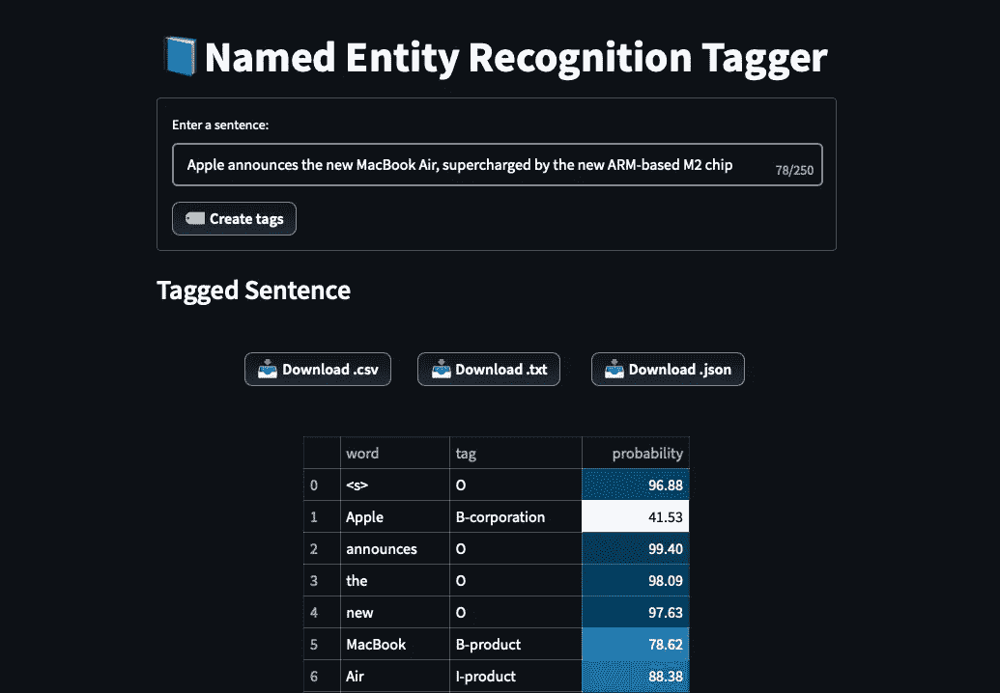
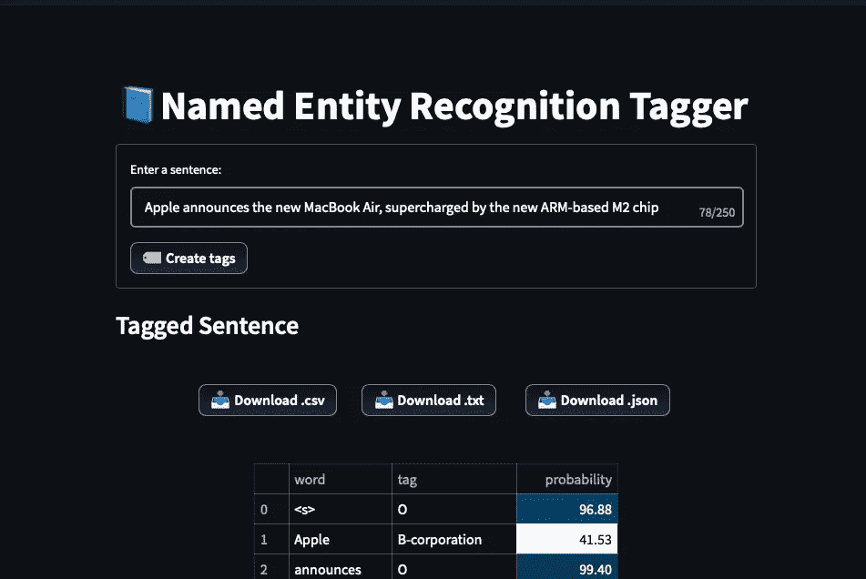
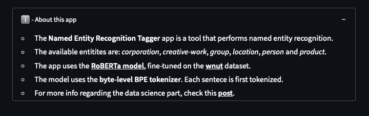
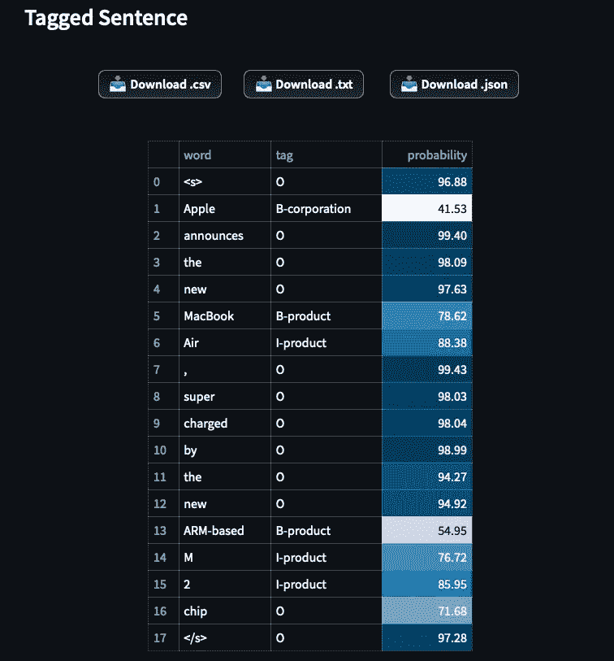

# 使用 Streamlit 构建命名实体识别应用

> 原文：<https://towardsdatascience.com/build-a-named-entity-recognition-app-with-streamlit-f157672f867f>

## 从构建应用到部署，包括代码

[](https://huggingface.co/spaces/nkaf/ner-tagger-streamlit)

使用 Streamlit 的 NER 应用程序，图片由作者提供([来源](https://huggingface.co/spaces/nkaf/ner-tagger-streamlit))

[在我之前的文章](https://medium.com/p/274c6965e2d)中，我们微调了一个命名实体识别(NER)模型，在 [**wnut_17[1]** 数据集上训练。](https://huggingface.co/datasets/wnut_17)

在本文中，我们一步一步地展示了如何将这个模型与 **Streamlit** 集成，并使用 **HugginFace Spaces 部署它。**该应用程序的目标是实时标记每个用户请求的输入句子。

> 此外，请记住，与琐碎的 ML 模型相反，在 Streamlit 上部署大型语言模型是很棘手的。我们也应对这些挑战。

让我们开始吧！

# 为什么选择 Streamlit？

Streamlit 是一个易于使用的工具，用于创建基于数据科学项目的交互式应用程序。

类似的 ML 友好工具还有 [**破折号**](https://dash.plotly.com/layout) 和 [**Gradio**](https://gradio.app) 。各有所长。例如，Gradio 有一个惊人的拖放组件，适用于图像分类模型。

一般来说，我更喜欢 Streamlit，因为:

*   到目前为止，它有一个引人注目的轨迹——在过去的一年里，Streamlit 每月至少发布一次重大更新。
*   它有一个强大的社区。论坛的成员非常乐于助人。还有，你可以在[**Streamlit Cloud**](https://streamlit.io/cloud)上免费上传你的 app。如果您的应用程序很有趣，社区经理会联系您，并在 Streamlit 网站上展示您的应用程序！他们甚至会送你礼物！

除了增长和强大的社区，Streamlit 是一个成熟的工具，适合每个数据科学领域的交互式应用程序。

接下来，让我们建立我们的应用程序！

> 完整的例子可以在这里找到[。](https://huggingface.co/spaces/nkaf/ner-tagger-streamlit/tree/main)

# 构建应用程序

本文主要关注用 Streamlit 构建和部署我们的模型。

如果你想了解更多关于模型是如何产生的，请随时查看我的[上一篇文章](https://medium.com/p/274c6965e2d)。

不过有一个变化:我们使用了来自 **HugginFace** 的`roberta-large`模型，而不是`bert-base`。 [**罗伯塔【2】**](https://arxiv.org/abs/1907.11692)**引入了动态蒙版等几个新奇的东西，让罗伯塔优于伯特。**

## **图书馆**

**首先，我们需要下面的库。为了清楚起见，请看一下`requirements.txt`文件:**

```
pytorch-lightning==0.9.0
torch==1.10.0
torchtext==0.8.0
torchvision==0.11.1 
datasets==2.3.2
numpy==1.20.3
pandas==1.3.5
streamlit==1.11.1
transformers==4.12.5
```

## **流线美学**

**我们的目标是使我们的应用程序最小化，对 UX 友好。Streamlit 是这项工作的合适工具。**

**让我们设置页面的元数据:**

**在 2 行代码中，我们设置了页面的标题、标题和图标。**

## **加载模型**

**我们为此任务创建了`load_model`函数:**

****注意以下事项:****

1.  **我们使用`[@st](http://twitter.com/st).cache`装饰器来缓存我们的模型——因为它太大了(~2BG)，我们不想每次都重新加载它。**
2.  **我们使用`allow_output_mutation=True`来告诉 Streamlit 我们的模型应该被视为一个不可变的对象——一个 *singleton* 。**

## **为标签生成添加帮助函数**

**接下来，我们添加助手函数。稍后我们将使用`tag_sentence`函数为输入的句子生成标签。**

## **添加下载结果的助手功能**

**有时，如果用户可以下载预测结果作为一个单独的文件(例如，供以后使用)会很有帮助。**

**Streamlit API 为此提供了`st.download_button`。**我们将展示如何将我们的结果转换成 *CSV* 、*文本*、**和 *JSON* 格式。对于此任务，我们使用以下帮助函数:**

**下载按钮将如下所示:**

****

> ****注意:**目前 Streamlit 存在一个 bug，有时会出现文件下载不正确的情况。**
> 
> **或者，我们可以以自定义方式在[中创建下载按钮。该组件的代码作为注释包含在应用程序的代码中。](https://discuss.streamlit.io/t/a-download-button-with-custom-css/4220)**

## **创建表单**

**我们现在已经完成了设置，并准备好构建我们的数据管道。**

**该应用程序应执行以下操作:**

1.  **接收用户输入。**
2.  **检查输入的句子是否为空。**
3.  **检查用户输入的句子是否包含一个单词(没有必要标记一个单词)。**
4.  **如果一切正常，加载我们的模型并计算输入句子的标签。**
5.  **在 UI 中呈现结果。**

**因此，我们有:**

**就是这样！文本形式将如下所示:**

****

## **可选—添加“关于”部分**

**出于 UX 的目的，我们可以在本页底部添加一个关于的**部分:****

**这是该部分的显示方式:**

****

# **部署**

**目前，有三种方法可以免费部署 Streamlit 应用程序:**

1.  **流线云**
2.  **拥抱脸空间**
3.  **赫罗库**

**所有选项都非常简单——没有成本，也不需要容器。**

**对于我们的例子，我们选择 **HugginFace Spaces** ，因为它可以更好地处理大文件。流程如下:**

## **1.设置 Git**

**首先，确保您已经安装了 git。**

## **2.安装 Git LFS**

**因为我们的模型是一个大于 1GB 的大型二进制文件，所以我们还应该安装 [**Git LFS**](https://git-lfs.github.com) **、**这些可以版本化大型文件的软件。**

**要下载它，请遵循此处的说明。该页面包括针对 **Windows** 、 **Mac、**和 **Linux** 的说明。**

## **3.添加需求文件**

**Hugginface 要求我们提供一个包含项目使用的库的`requirements.txt`文件。**

**我们可以使用`pipreqs`库立即生成一个`requirements.txt`文件。另外，`pipreqs`只生成我们的项目使用的库:**

```
pip install pipreqs
pipreqs /cd/to/project
```

## **4.登录 HugginFace 并创建一个共享空间**

**如果您还没有 HugginFace 帐户，请访问此[页面](https://huggingface.co/)。**

**然后，创建一个**空间**(你会在右上角找到)。本质上，空间充当传统的 Git repo。填写所需的详细信息并初始化 youe repo。**

**之后，克隆你的 repo，将你的项目文件添加到文件夹中，上传到**空间:****

```
git clone [https://huggingface.co/spaces/nkaf/ner-tagger-streamlit](https://huggingface.co/spaces/nkaf/ner-tagger-streamlit)
cd /cd/to/projectgit add .
git commit -m “first commit”
git push origin main
```

**就是这样！**

## **4.访问您的应用**

**你必须等待几分钟，应用程序才能初始化。然后，进入**A*PP*标签，如果一切正常，你的 web 应用就上线了！****

**您可以在此找到这个 web 应用程序的项目[！请随意输入您的句子并进行实验！](https://huggingface.co/spaces/nkaf/ner-tagger-streamlit)**

**来看几个例子吧！**

****例 1:****

```
Apple announces the new MacBook Air, supercharged by the new ARM-based M2 chip
```

****

**该模型正确地将`Apple`标记为**公司**。此外，它还能正确识别和识别`MacBook Air`和`ARM-based M2`为**产品。****

****例二:****

```
Empire State building is located in New York, a city in United States
```

****

**我们的模型再次正确地识别了句子的所有 3 个位置。**

# **结束语**

****Streamlit** 是一款易于使用的工具，在展示数据科学项目的功能方面非常高效。**

**此外，您可以将您的数据科学项目与 Streamlit 无缝集成。**

**最后，请注意我们只使用了 Python——我们可以在几乎不了解 HTML、CSS 或 Javascript 的情况下创建惊人的 Streamlit 应用程序。此外，Streamlit 还兼容流行的数据科学库，如 *Numpy* 、 *Pandas* 、 *OpenCV* 和 *Plotly* 。**

# **感谢您的阅读！**

*   **订阅我的[简讯](https://towardsdatascience.com/subscribe/@nikoskafritsas)！**
*   **在 [Linkedin](https://www.linkedin.com/in/nikos-kafritsas-b3699180/) 上关注我！**
*   **[**加入介质**](https://medium.com/@nikoskafritsas/membership) **！**(附属链接)**

# **参考**

1.  **WNUT 2017 (WNUT 2017 新兴和稀有实体认可)，许可证:CC BY 4.0，[来源](https://huggingface.co/datasets/wnut_17)**
2.  **刘等，[*RoBERTa:一种鲁棒优化的 BERT 预训练方法*](https://arxiv.org/abs/1907.11692) *(2019)***