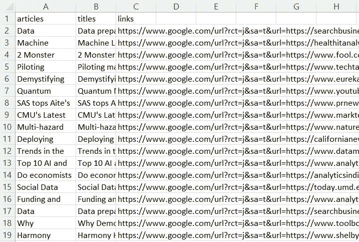
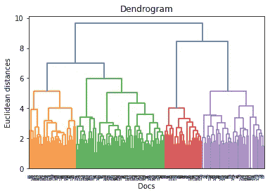
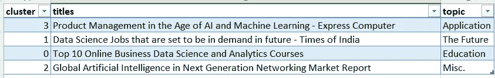

# 构建一个文件夹项目，将[几个]文档组织成主题

> 原文：<https://towardsdatascience.com/build-a-portfolio-project-for-organizing-few-documents-into-topics-b706e540fc7>

## 从预训练嵌入到层次聚类

图片来自 [Pixabay](https://pixabay.com/photos/news-daily-newspaper-press-1172463/)

试图理解数字文本时的一个挑战是确定我们是否可以将文本组织成有意义的组或主题。例如，也许我们想知道是否可以将客户的评论分为讨论登录问题的和抱怨客户服务的。

主题建模的常用方法是潜在差异分配(LDA)。尽管对这种方法的全面讨论超出了本文的范围，但简而言之，其思想是将语料库中单词的概率分配给相应的主题。在 LDA 中，我们在分析开始时为模型提供预期的主题数量。在此基础上，该模型分配概率，帮助将每个词归入特定主题。关于这个概念如何工作的更多细节，请查看[这篇文章](/latent-dirichlet-allocation-lda-9d1cd064ffa2)。

这种方法的优点是每个主题由语料库中的单个单词或标记决定。因此，这种方法允许我们给一个给定的文档分配一个以上的主题，只要文档中存在足够的标记，每个主题都有足够高的可能性。例如，假设我们的主题模型了解到像“密码、登录和访问”这样的标记与我们标记为“登录问题”的主题密切相关，而像“客户、服务和代表”这样的标记与我们标记为“客户服务投诉”的第二个主题密切相关。

现在，让我们假设我们正在审查以下客户意见:

“登录和访问[我的]帐户时遇到问题，因此[我]致电客户服务，不得不等待很长时间才能解决问题。”

很可能我们的主题模型会将最高的可能性分配给主题“登录问题”，但也可能将第二高的可能性分配给“客户服务投诉”LDA 使我们能够在给定阈值的文档中寻找多主题解决方案，我们可以基于后处理研究选择应用该阈值。

但是因为 LDA 只关注单个的标记，而没有考虑它们与其他标记的关系或相似性，所以 LDA 在处理从具有相似语义的标记中识别主题时失败了。

例如，假设您经营一家日托企业，您从父母那里收集反馈，了解他们希望孩子在日常活动中学习的概念。也许你会发现一些父母谈论“社会技能发展”的重要性，而另一些父母谈论“社会化”。

在这种情况下，我们可能希望我们的主题模型认识到，由于“社会化”和“社交”等概念之间的语义相似性，这两种想法应该被分组到一个主题中，但是 LDA 可能会将它们视为单独的主题，这取决于每个标记所在的文档中使用的其他单词。

此外，当我们只有少量数据要处理时，LDA 也有局限性。因为 LDA 过程试图将给定主题的单词概率的混合拟合到已知分布(例如，Dirichlet 分布)，所以如果单词仅在数据中出现几次，则它们对不同主题的拟合的估计将是不稳定的，从而产生通常难以解释的主题。

在本文的剩余部分，我将研究一种方法来克服 LDA 在主题分析中应用的两个主要限制。也就是说，需要大量的数据，却没有上下文敏感性。在接下来的部分中，我将介绍一个解决方案，它利用预训练的单词嵌入和层次聚类来捕获更多的上下文感知主题，这些主题可以从较小的数据集中以有意义的方式学习。向前向上！

# **问题**

我最近遇到了这个问题，我想将新闻文章分组到有意义的组中，但只有不到 200 个文本可以处理。此外，文本包括语义相似的术语，如“数据、科学、机器和学习”，我正在寻找一种主题解决方案，它仍然可以识别语义相似术语中的主题，而不是将“数据科学”放在一个主题中，将“机器学习”放在另一个主题中。

换句话说，我想要一个比传统的 LDA 更有语义意识的文本分组模型。我确实研究了更多使用 LDA 的上下文感知方法，比如 lda2vec，在这里详细描述了[。](https://multithreaded.stitchfix.com/blog/2016/05/27/lda2vec/#topic=38&lambda=1&term=)

lda2vec 方法实际上是 lda 的复杂实现，它将单词向量与文档向量相结合，以训练更具上下文感知的主题模型。然而，不利的一面是，因为该模型利用了向量表示并结合了神经网络架构，所以可训练参数的数量比更传统的 LDA 方法增加了相当多。最终，这意味着需要更多的数据和大量的计算资源来训练模型。

因此，对于我当前的问题，lda2vec 不是一个好的候选。尽管有局限性，但是这种方法确实给了我一个想法。由于我没有太多的数据，我想使用预先训练的模型可能会有所帮助。

# **解决方案**

为了解决我的问题，我尝试了以下架构:

> 1.预处理文本并生成标记
> 
> 2.使用 GloVe 100 维预训练 word2vec 模型获得每个单词的单词向量
> 
> 3.平均每个文档的单词向量以创建平均文档向量
> 
> 4.使用 Ward 方法执行层次聚类
> 
> 5.获取每个聚类的质心向量
> 
> 6.通过使用余弦相似性将文档向量与其聚类的质心向量进行比较，为每个聚类识别最具代表性的文档

对于这个实现，我使用了 1 周的 Google Alerts 来搜索与“数据科学、人工智能和机器学习”概念相关的新闻文章

为什么只有一周的新闻提醒？我每周都进行这种分析，以告知 Youtube 上的一个节目，我通过我的 [FastdatascienceAi 频道](https://www.youtube.com/channel/UCYDguzO_tswCJb9amkQU_rA)称之为“人工智能的这一周”。因此，我需要一种方法，用有限的数据每周衍生出新的主题。但是我跑题了。

## **1。预处理文本并生成令牌**

对于这个例子，我们从一个数据集开始，这个数据集是通过从我的 Gmail 地址中提取 Google 新闻提醒电子邮件而创建的。关于如何用 Python 做这件事的更多信息，请看这篇[的帖子](/need-data-why-not-use-your-email-address-2936e9894a4c)。

的。带有新闻结果的 csv 文件被放入熊猫数据框。以下是数据框的外观:

作者图片

在那里，我使用 NLTK 提供的工具来清理和标记文本。清理和标记化是自然语言处理任务的基本标准，包括删除多余的空格、非字母字符、停用词、标记化和词条化。以下是加载我的自定义清理 python 模块并使用“pre_process_lda”函数清理数据框的文本列的一些代码:

## **2 & 3。获取单词向量…**

在下一部分代码中，我们将每个标记传递给一个预训练的 Word2Vec 模型(即手套模型)，以返回每个单词在向量空间中的 100 维表示。然后，我们对每个文档的这些词向量进行平均，以获得每个文档的 100 维表示。请注意，下面的代码假设您已经下载了手套 6B 预训练的[向量](https://zenodo.org/record/4925376#.Yh0dmujMJPY)。

## **4。执行层次聚类…**

现在我们有了一个基于文档中每个标记的平均值的文档向量(在这种情况下，每个文档都是一篇新闻文章的标题)，下一个任务是确定一种将文档组织成组的方法。

因为我们期望每个文档已经包含相似的向量空间(它们都是关于数据科学、机器学习或人工智能的)，而不知道其中的子组(例如主题)的数量，并且因为我们只有少量的数据，所以我选择使用分层聚类。

层次聚类和系统树图的使用使我们能够快速分析不同组合水平的数据分组。在最高级别上，所有数据都在一个集群中，但是在最低级别上，每个文档都代表它自己唯一的“集群”层次聚类为我们提供了研究如何在这两个极端之间将数据组织成组的工具。

在这个特定的情况下，我使用 [Ward 方法](https://en.wikipedia.org/wiki/Ward%27s_method)实现了层次聚类。像 Ward 方法这样的层次聚类的最大优点之一是，我们不需要在分析之前提供预期的聚类数。

如上所述，树状图通常伴随着层次聚类方法，因为它们帮助我们在不同的聚集级别可视化聚类解决方案。此外，我们还可以看到哪些聚类可能比其他聚类更密切相关，因为较高聚合级别的组合表明两个较低级别的聚类更相似。

作者图片

在上面的结果中，我们从树状图中看到，我们的最佳解决方案是一个 4 主题解决方案。

## **5。获得每个簇的质心**

既然我们已经确定我们的最佳解决方案是 4 主题解决方案，我们的下一步是获得每个聚类的质心向量。最终，我们的目标是能够使用这些质心向量来识别最能代表质心的文档。

## **6。确定每个集群最具代表性的文件**

找到质心向量后的最后一步是将每个簇中的每个文档与其簇的质心进行比较。在此之前，我们将数据框与上一步中创建的每个文档的预测聚类(“y_hc”)和每个文档的向量连接起来。

因为我们正在比较数字向量，这是余弦相似性的一个很好的用例。余弦相似性是一个数学公式，用于确定两个数字序列之间的相似性。在这种情况下，我们有两个 100 个数字的序列(即我们的维度向量)进行比较。

因此，我们使用余弦相似度来计算每个文档和聚类质心之间的相似度。然后为每个聚类选择余弦相似度最接近 1 的文档。

以下是与每个集群相关的标题列表:

作者图片

简单地基于这个列表，我们可以为每个集群推理一个可能的标签，如下所示:

作者图片

# 结论

概括地说，我在开始时面临一个特殊的业务问题，我需要一种方法来将少量的文档组织成上下文相关的有意义的主题。为了实现一个解决方案，我利用了一个预训练的单词嵌入模型和层次聚类方法来根据标题对新闻文章进行分组。

比如参与学习数据科学、职业发展、生活或糟糕的商业决策？[加入我](https://www.facebook.com/groups/thinkdatascience)。