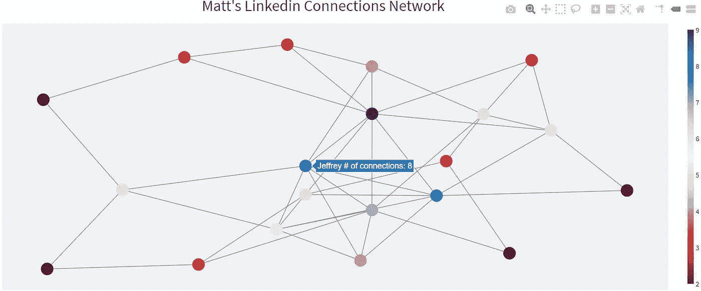
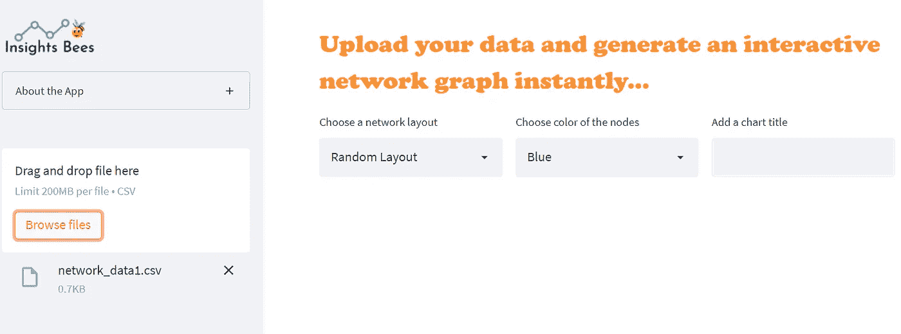
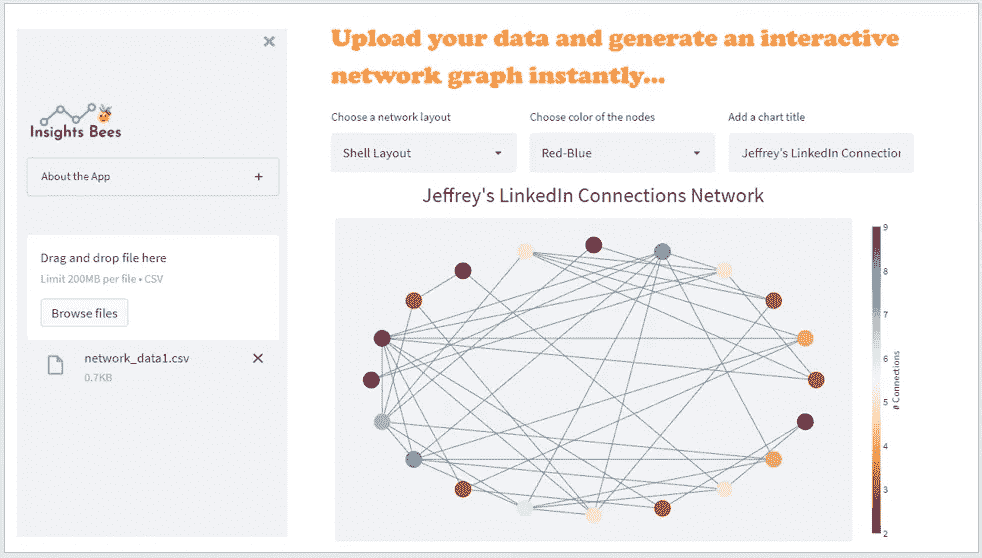

# 使用 Streamlit 构建一个简单的网络图应用程序

> 原文：<https://towardsdatascience.com/build-a-simple-network-graph-app-using-streamlit-e6d65efbae88>

## 释放 Streamlit、NetworkX 和 Plotly 的力量，寻找乐趣


图片来自 [Pixabay](https://pixabay.com//?utm_source=link-attribution&utm_medium=referral&utm_campaign=image&utm_content=927147) 的 [Gerd Altmann](https://pixabay.com/users/geralt-9301/?utm_source=link-attribution&utm_medium=referral&utm_campaign=image&utm_content=927147)

网络图(也称为网络图)是一种特殊类型的可视化，它通过节点和边来显示一组实体之间的连接。网络图中的每个实体称为“节点”，连接一对节点的线称为“边”。一个实体可以是一个人、一个事件、一个运动队或任何其他东西。网络图是可视化和分析网络中实体之间关系的有效方法。

网络图可以是有向的，也可以是无向的。节点的大小和颜色以及边的宽度可用于显示网络实体的不同属性及其关系。下面是一个简单的无向网络图的例子，节点颜色代表网络中每个节点的连接数。



作者图片

在这篇文章中，我想向你展示如何使用`Streamlit`、`NetworkX`和`Plotly`构建一个简单的应用程序来生成交互式网络图(如上图所示)。该应用程序允许用户上传一个 CSV 文件，其中包含符合特定格式的网络数据，只需要两列:一列用于源节点，另一列用于目标节点。

用户将数据上传到应用程序后，应用程序将立即生成一个无向网络图，节点的颜色代表网络中每个节点的连接数。用户还可以为图形选择不同的布局选项，或者为节点选择不同的配色方案。这是一个应用程序的简短视频演示。

作者创建的 Youtube 视频

# 先决条件

如果您是 Streamlit 的新手，请阅读下面的[文章](/streamlit-hands-on-from-zero-to-your-first-awesome-web-app-2c28f9f4e214)，并按照说明安装 Streamlit 并学习其基础知识。

</streamlit-hands-on-from-zero-to-your-first-awesome-web-app-2c28f9f4e214>  

您还需要安装以下软件包:

```
pip install plotly
pip install networkx
```

太好了！现在您已经安装了所有需要的 python 包，让我们开始构建应用程序。首先，让我们导入所有必要的库，并向侧栏添加一些小部件，向主界面添加一个标题:

1.  我们将添加一个标志(可选)
2.  我们将添加一个可折叠的扩展器小部件(“关于应用”)
3.  我们将添加一个文件上传程序，允许用户上传一个 CSV 文件到应用程序
4.  我们将使用 CSS 样式在应用程序的主界面上添加一个应用程序标题

接下来，让我们使用`NetworkX`和`Plotly`根据用户上传的数据创建网络图。在这里，我创建了一个样本网络数据集，显示了一组人在 LinkedIn 上的联系。CSV 文件只有两列——“源”列包含所有源节点,“目标”列包含所有目标节点。每行代表一对连接的节点(“边”)。这就是输入数据所需的全部内容。


示例输入数据(由作者提供)

一旦用户上传 CSV 文件到应用程序，我们将使用`NetworkX`创建一个网络图。我们还将添加三个输入小部件，允许用户选择图形的特定布局，指定他们喜欢的配色方案，并为图形添加标题。



作者图片

最后，让我们使用`Plotly`来可视化使用`NetworkX`创建的网络图。确保在`if uploaded_file is not None:`语句中添加正确缩进的代码。



作者图片

这就对了。我们用`Streamlit`、`NetworkX`、`Plotly`成功搭建了一个简单的交互式网络图 app！你当然可以对这个应用程序做更多的改进。例如，我们可以添加更多的小部件，允许用户指定节点的大小或边的宽度，以传达关于网络以及节点和边的属性的更多信息。在`plotly`部分需要更多的编码，但这肯定是可行的，我鼓励你自己尝试一下。感谢阅读，我希望你喜欢这个教程！

**数据源:**本教程中使用的样本数据集是作者出于演示目的而创建的。

**参考:Plotly 文档中的**[Python 网络图](https://plotly.com/python/network-graphs/)

你可以通过这个[推荐链接](https://medium.com/@insightsbees/membership)注册 Medium 会员(每月 5 美元)来获得我的作品和 Medium 的其他内容。通过这个链接注册，我将收到你的一部分会员费，不需要你额外付费。谢谢大家！