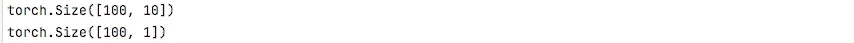
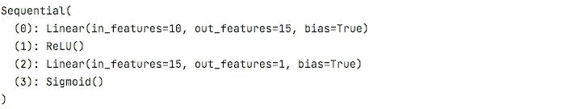
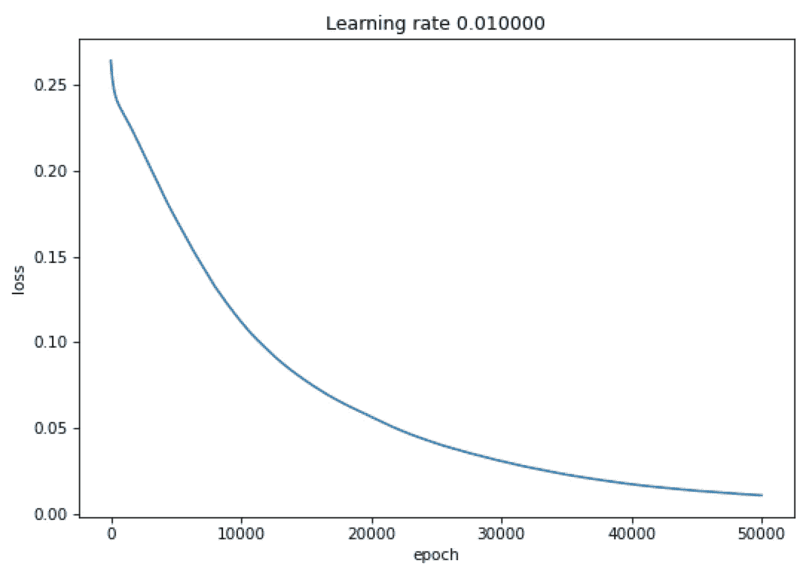

# 使用 PyTorch 构建一个简单的神经网络

> 原文：<https://towardsdatascience.com/build-a-simple-neural-network-using-pytorch-38c55158028d>

## 使用 PyTorch 构建您的第一个人工智能模型的快速简单的步骤


由 [Unsplash](https://unsplash.com/) 的 [Michal Parzuchowski](https://unsplash.com/@mparzuchowski) 拍摄

在[之前的帖子](/build-a-simple-neural-network-using-numpy-2add9aad6fc8?source=your_stories_page---------------------------)中，我们讨论了如何使用 NumPy 制作一个简单的神经网络。在本帖中，我们将讨论如何使用内置 PyTorch 函数制作一个简单的神经网络，而不是自己编写每个函数。

PyTorch 是由脸书人工智能实验室开发和维护的用于深度学习的开源 Python 库。PyTorch 使用张量(Torch。张量)来存储和操作数字的矩形数组。张量类似于 NumPy 数组，但它们也可以在 GPU 中运行。torch.nn 包可用于构建神经网络。我们将创建一个具有单个隐藏层和单个输出单元的神经网络。

1.  **导入库**

PyTorch 的安装指南可以在 PyTorch 的官方[网站](https://pytorch.org/get-started/locally/)上找到。首先，我们需要导入 PyTorch 库。

```
**import** torch
**import** torch.nn **as** nn
```

2.**数据准备**

现在，我们将定义变量，如输入大小、隐藏单元、输出大小、批量大小和学习速率。

```
n_input, n_hidden, n_out, batch_size, learning_rate = 10, 15, 1, 100, 0.01
```

我们现在将如下随机初始化虚拟输入和输出目标数据(或张量):

```
data_x = torch.randn(batch_size, n_input)
data_y = (torch.rand(size=(batch_size, 1)) < 0.5).float()
```

我们用 100 个数据样本初始化输入数据，每个样本有 10 个特征，并分别用 100 个数据点初始化输出数据。

```
print(data_x.size())
print(data_y.size())
```



**3。定义神经网络模型**

使用内置函数，我们将创建带有输出 sigmoid 层的简单序列模型，如下所示:

```
model = nn.Sequential(nn.Linear(n_input, n_hidden),
                      nn.ReLU(),
                      nn.Linear(n_hidden, n_out),
                      nn.Sigmoid())
print(model)
```



接下来，我们将为梯度下降定义损失函数和优化器。在 nn 包下，有几种不同的损失函数。这里我们将使用`nn.MSELoss`作为模型的损失函数，计算输入和目标之间的均方误差。同样，`[torch.optim](https://pytorch.org/docs/stable/optim.html#module-torch.optim)`包提供了各种优化算法。我们将使用随机梯度下降(SGD)优化器。

```
loss_function = nn.MSELoss()
optimizer = torch.optim.SGD(model.parameters(), lr=learning_rate)
```

**4。训练循环**

这里，我们将通过以下步骤定义训练循环:

*   正向传播—计算预测的 ***y*** 并计算当前损耗
*   反向传播——在每个时期之后，我们在开始反向传播之前将梯度设置为零
*   梯度下降—最后，我们将通过调用 ***optimizer.step()*** 函数来更新模型参数

```
losses = []
**for** epoch **in** range(5000):
    pred_y = model(data_x)
    loss = loss_function(pred_y, data_y)
    losses.append(loss.item())

    model.zero_grad()
    loss.backward()

    optimizer.step()
```

**5。输出**

我们可以绘制损失图，并查看模型在每个时期的训练情况。

```
**import** matplotlib.pyplot **as** plt
plt.plot(losses)
plt.ylabel(**'loss'**)
plt.xlabel(**'epoch'**)
plt.title(**"Learning rate %f"**%(learning_rate))
plt.show()
```



我们可以看到，损耗在每个时期都在减少，这表明参数正在被学习。

在本教程中，您学习了在 PyTorch 中逐步开发简单神经网络模型的方法。具体来说，您学习了如何初始化随机数据、定义神经网络模型并训练它们。使用 PyTorch 的主要优势有两方面:

1.  在图形处理单元(GPU)中使用张量来提供操作类似数字的数组的能力。
2.  基于磁带自动微分系统的深度神经网络的可用性。

恭喜你用 PyTorch 构建并训练了你的第一个神经网络！

*成为* [*这里*](https://medium.com/@rmesfrmpkr/membership) *的媒介会员，支持独立写作，每月 5 美元，获得媒介上每个故事的全部权限。*