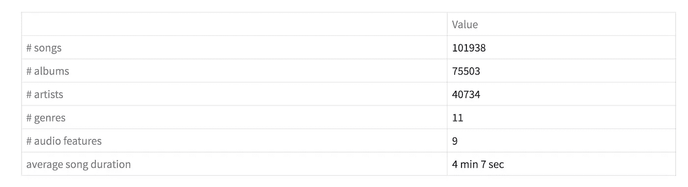
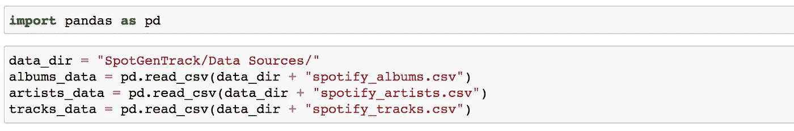
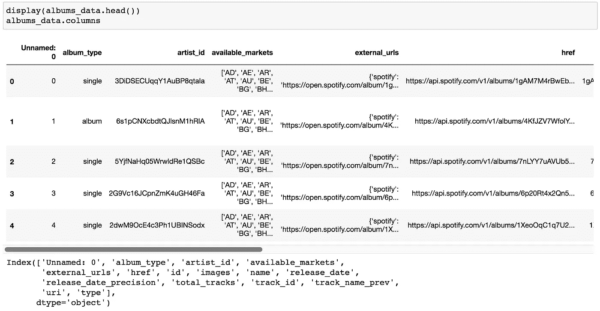
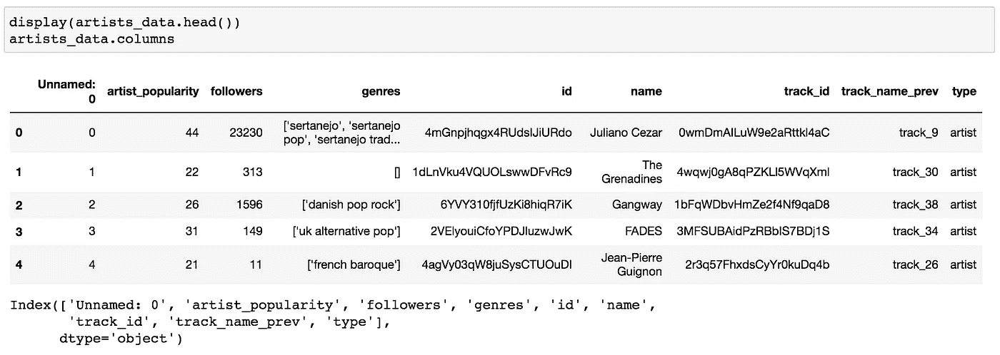
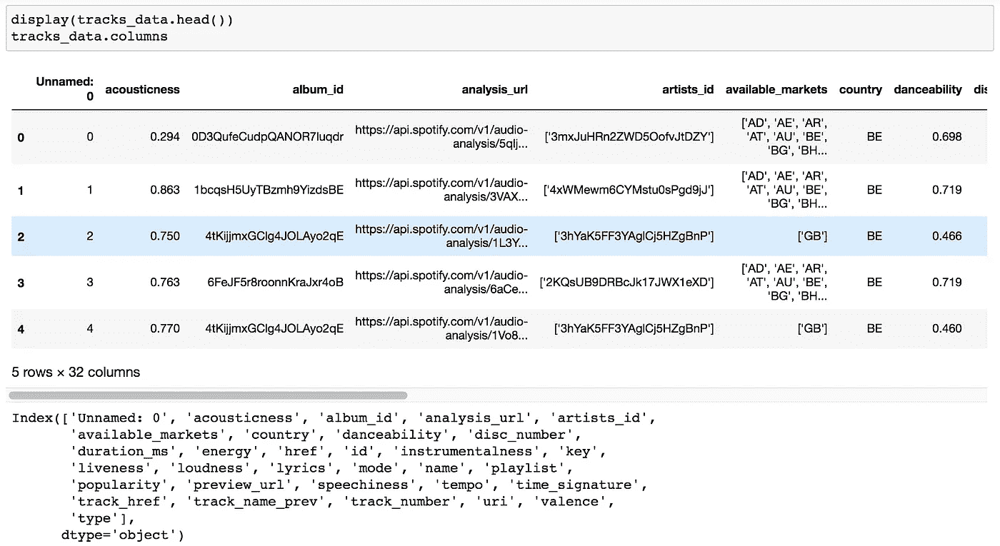
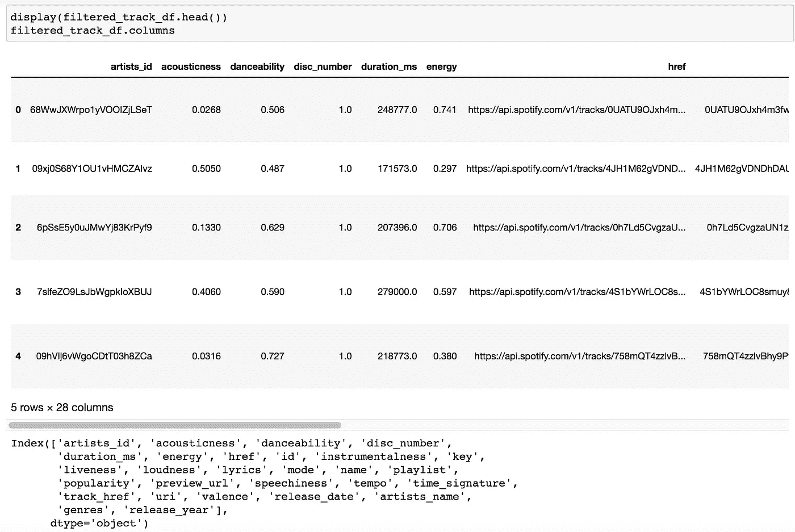
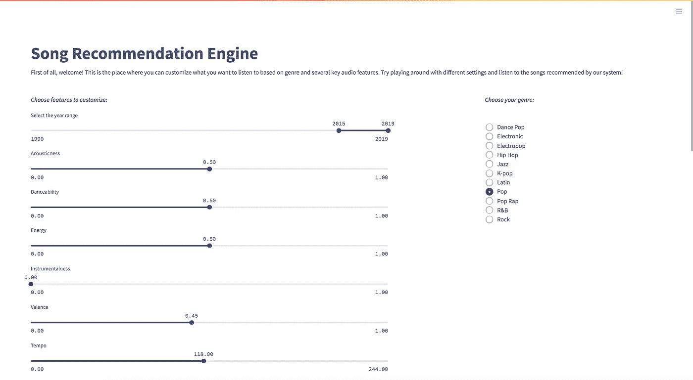
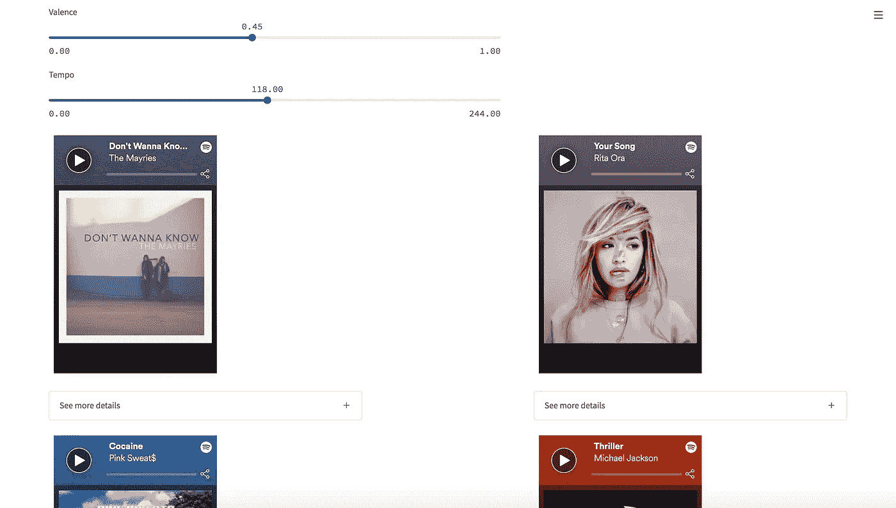
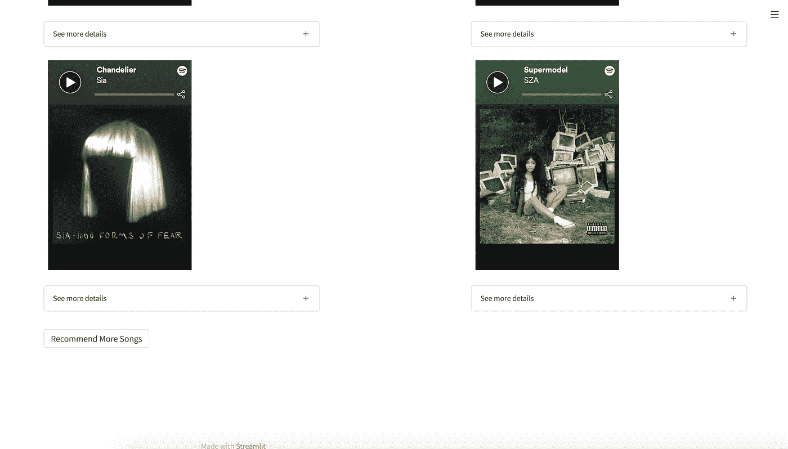
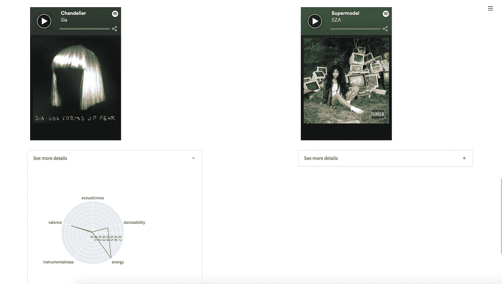

# 使用 Streamlit 构建歌曲推荐系统并在 Heroku 上部署

> 原文：<https://towardsdatascience.com/build-a-song-recommendation-system-using-streamlit-and-deploy-on-heroku-375a57ce5e85>

# 使用 Streamlit 构建歌曲推荐系统并在 Heroku 上部署

## 了解如何使用 Spotify 音乐数据集的 K 近邻构建一个简单的歌曲推荐引擎


韦斯·希克斯在 [Unsplash](https://unsplash.com?utm_source=medium&utm_medium=referral) 上的照片

# 介绍

像你我这样的音乐爱好者可能会不断渴望迎合我们个人音乐品味的新歌。无论是最近令人兴奋的 hip-pop，充满活力和活力的 k-pop，还是轻松柔和的渐进式爵士乐，我们都可以从歌曲推荐系统中受益，该系统可以推荐我们喜欢的新歌。

由于音乐数据的可用性和深度学习的进步，我们能够建立一个简单的歌曲推荐系统，可以推荐与我们个人偏好密切匹配的歌曲。这些偏好或对我们推荐系统的输入包括音乐流派、发行年份范围和几种不同的音频特征，如能量、乐器性、音质等。**在本文中，我们将用**[**Streamlit**](https://streamlit.io/)**构建这个推荐引擎，用**[**Scikit-learn**](https://scikit-learn.org/)**构建 k-近邻机器学习模型，并用**[**Heroku**](https://www.heroku.com/)**部署我们的网站。**

为了了解我们正在建设的东西，你可以在这里查看最终的应用程序:[song-recommendation-streamlit.herokuapp.com](https://song-recommendation-streamlit.herokuapp.com/)。

# 资料组

在开始构建我们的应用程序之前，我们需要一个音乐数据集。对于我们的数据集，我们将使用来自 Kaggle 的 [Spotify 和 Genius Track 数据集](https://www.kaggle.com/saurabhshahane/spotgen-music-dataset)。该数据集包含使用其 API 从 Spotify 平台收集的数千张专辑、艺术家和歌曲的信息。此外，数据集还包含歌曲的低级音频特征，以及它们的歌词。



数据集统计

## 数据集预处理

我们的数据预处理的目标是我们想要一个联合数据集，该数据集由每首歌曲及其各自的流派信息、发行年份和音频特征组成，因为这些将是我们对系统的输入。目前，数据集主要分为三个`csv` 文件:`spotify_artists.csv`、`spotify_albums.csv`和`spotify_tracks.csv`。`spotify_artists.csv`包含每个艺术家的流派信息，`spotify_albums.csv`包含每个专辑的发行日期，而`spotify_tracks.csv`包含每首歌曲的音频特征。

为了组合这三个数据集，我们可以从使用 [Pandas](https://pandas.pydata.org/) 加载这三个数据集开始。



读出数据

这是三个数据集的样子:



Spotify 专辑数据(75511 行)



Spotify 艺术家数据(56129 行)



Spotify 跟踪数据(101939 行)

现在，我们可以用`tracks`数据连接`albums`和`artists`。我们需要将专辑发行年份和艺术家流派信息与曲目数据结合起来。

```
## join artist genre information and album release date with track dataset
# drop irrelevant columns
# get only tracks after 1990
def join_genre_and_date(artist_df, album_df, track_df):
    album = album_df.rename(columns={'id':"album_id"}).set_index('album_id')
    artist = artist_df.rename(columns={'id':"artists_id",'name':"artists_name"}).set_index('artists_id')
    track = track_df.set_index('album_id').join(album['release_date'], on='album_id' )
    track.artists_id = track.artists_id.apply(lambda x: x[2:-2])
    track = track.set_index('artists_id').join(artist[['artists_name','genres']], on='artists_id' )
    track.reset_index(drop=False, inplace=True)
    track['release_year'] = pd.to_datetime(track.release_date).dt.year
    track.drop(columns = ['Unnamed: 0','country','track_name_prev','track_number','type'], inplace = True)

    return track[track.release_year >= 1990]
```

请注意，我们还从我们的曲目数据帧中删除了不相关的列，只保留了最近的歌曲(1990 年以后出版的歌曲)，以保持我们的数据集较小，这将允许我们在构建应用程序时加快加载和处理时间。

我们可以通过只包含属于我们选择的特定流派的歌曲来进一步缩小数据集的大小。

```
def get_filtered_track_df(df, genres_to_include):
    df['genres'] = df.genres.apply(lambda x: [i[1:-1] for i in str(x)[1:-1].split(", ")])
    df_exploded = df.explode("genres")[df.explode("genres")["genres"].isin(genres_to_include)]
    df_exploded.loc[df_exploded["genres"]=="korean pop", "genres"] = "k-pop"
    df_exploded_indices = list(df_exploded.index.unique())
    df = df[df.index.isin(df_exploded_indices)]
    df = df.reset_index(drop=True)
    return df
```

`get_filtered_track_df`返回的 dataframe 将删除`genres_to_include`中不属于任何流派的歌曲。然后，我们运行以下程序:

```
genres_to_include = genres = ['dance pop', 'electronic', 'electropop', 'hip hop', 'jazz', 'k-pop', 'latin', 'pop', 'pop rap', 'r&b', 'rock']
track_with_year_and_genre = join_genre_and_date(artists_data, albums_data, tracks_data)
filtered_track_df = get_filtered_track_df(track_with_year_and_genre, genres_to_include)
```

之后，我们对稍后将使用的`uri`列做一些预处理，并进一步删除不相关的列:

```
filtered_track_df["uri"] = filtered_track_df["uri"].str.replace("spotify:track:", "")
filtered_track_df = filtered_track_df.drop(columns=['analysis_url', 'available_markets'])
```

预处理后的数据如下所示:



预处理数据集

最后，我们将其保存到一个`csv`文件中:

```
filtered_track_df.to_csv("filtered_track_df.csv", index=False)
```

# 主应用程序

现在我们有了预处理过的数据集，我们可以开始构建我们的主应用程序了。我们将使用 Streamlit，这是一个 Python web 框架，用于构建机器学习和数据科学的 web 应用程序。如果这是你第一次听说它，请随意查看它的文档！

## 安装库

开始构建我们的应用程序的第一步是安装库，如果你还没有这样做的话。

```
pip install streamlit
pip install pandas
pip install plotly
pip install scikit-learn
```

除了 Streamlit，我们还将使用 Pandas 来加载我们的数据，plotly 用于可视化，scikit-learn 用于实现我们的机器学习模型。

在我们的环境中安装了库之后，我们可以创建一个名为`app.py`的文件，并开始编写 Streamlit 代码。

首先，我们首先导入我们需要的库。

```
import streamlit as st
st.set_page_config(page_title="Song Recommendation", layout="wide")import pandas as pd
from sklearn.neighbors import NearestNeighbors
import plotly.express as px
import streamlit.components.v1 as components
```

请注意，我们在导入 Streamlit 后设置页面配置，以便利用整个布局空间。

## 加载数据

导入所需的库后，我们编写一个函数来加载之前保存的预处理过的`.csv`数据。我们还使用 Streamlit 内置函数`@st.cache`保存缓存以加快加载速度。

```
[@st](http://twitter.com/st).cache(allow_output_mutation=True)
def load_data():
    df = pd.read_csv("data/filtered_track_df.csv")
    df['genres'] = df.genres.apply(lambda x: [i[1:-1] for i in str(x)[1:-1].split(", ")])
    exploded_track_df = df.explode("genres")
    return exploded_track_df
```

然后，我们定义用户可以从中选择的风格列表，以及用户可以定制的音频特性列表。请注意，这里使用的流派列表与我们预处理数据时使用的相同。我们也称上面定义的`load_data`。

```
genre_names = ['Dance Pop', 'Electronic', 'Electropop', 'Hip Hop', 'Jazz', 'K-pop', 'Latin', 'Pop', 'Pop Rap', 'R&B', 'Rock']
audio_feats = ["acousticness", "danceability", "energy", "instrumentalness", "valence", "tempo"]exploded_track_df = load_data()
```

## k-NN 机器学习模型

加载数据后，我们可以开始构建我们的机器学习模型来推荐歌曲。有许多方法可以解决这个问题。一种简单的方法是使用 k 最近邻模型来获得在距离上与用户选择的特征输入集最接近的热门歌曲。这些“特征输入”包括感兴趣的流派、发行年份范围(开始年份和结束年份)和一组音频特征(声音、可跳舞性、能量、乐器性、效价、速度)。

我们可以使用 Sklearn 来构建 k-NN 模型，并返回给定测试点的 top-k 结果。为了执行上述功能，我们编写了函数`n_neighbors_uri_audio`，它将按照排名的升序返回顶部邻居的 Spotify URIs 和音频特征值(最接近输入特征的点排在第一位)。

```
def n_neighbors_uri_audio(genre, start_year, end_year, test_feat):
    genre = genre.lower()
    genre_data = exploded_track_df[(exploded_track_df["genres"]==genre) & (exploded_track_df["release_year"]>=start_year) & (exploded_track_df["release_year"]<=end_year)]
    genre_data = genre_data.sort_values(by='popularity', ascending=False)[:500] neigh = NearestNeighbors()
    neigh.fit(genre_data[audio_feats].to_numpy()) n_neighbors = neigh.kneighbors([test_feat],       n_neighbors=len(genre_data), return_distance=False)[0] uris = genre_data.iloc[n_neighbors]["uri"].tolist()
    audios = genre_data.iloc[n_neighbors][audio_feats].to_numpy()
    return uris, audios
```

请注意，我们只使用属于某个流派的前 500 首最受欢迎的歌曲，以便我们的系统推荐的歌曲会更受欢迎。如果你不介意被推荐不太受欢迎的歌曲，请随意使用这个数字或删除它。

## 应用布局和集成

现在，终于到了构建应用程序最激动人心的部分:前端布局的时候了！在我们的主页中，我们可以有一个巨大的标题，上面写着“歌曲推荐引擎”和一个仪表板，允许用户定制他们想听的歌曲。

```
title = "Song Recommendation Engine"
st.title(title)st.write("First of all, welcome! This is the place where you can customize what you want to listen to based on genre and several key audio features. Try playing around with different settings and listen to the songs recommended by our system!")
st.markdown("##")with st.container():
    col1, col2,col3,col4 = st.columns((2,0.5,0.5,0.5))
    with col3:
        st.markdown("***Choose your genre:***")
        genre = st.radio(
            "",
            genre_names, index=genre_names.index("Pop"))
    with col1:
        st.markdown("***Choose features to customize:***")
        start_year, end_year = st.slider(
            'Select the year range',
            1990, 2019, (2015, 2019)
        )
        acousticness = st.slider(
            'Acousticness',
            0.0, 1.0, 0.5)
        danceability = st.slider(
            'Danceability',
            0.0, 1.0, 0.5)
        energy = st.slider(
            'Energy',
            0.0, 1.0, 0.5)
        instrumentalness = st.slider(
            'Instrumentalness',
            0.0, 1.0, 0.0)
        valence = st.slider(
            'Valence',
            0.0, 1.0, 0.45)
        tempo = st.slider(
            'Tempo',
            0.0, 244.0, 118.0)
```

要在 localhost 上运行 streamlit 应用程序，可以运行:

```
streamlit run app.py
```

这将呈现网页:



仪表板布局

看起来不错！你可以定制你想要的仪表盘，改变你喜欢的输入风格。

在构建仪表板之后，我们可以使用用户选择的功能来显示要推荐的歌曲。为此，我们可以调用前面定义的`n_neighbors_uri_audio`函数。为了显示推荐的歌曲，我们可以使用 [Spotify 开发者小部件](https://developer.spotify.com/documentation/widgets/generate/embed/)来显示一个使用经典 HTML 的 iframe。

```
tracks_per_page = 6
test_feat = [acousticness, danceability, energy, instrumentalness, valence, tempo]
uris, audios = n_neighbors_uri_audio(genre, start_year, end_year, test_feat)tracks = []
for uri in uris:
    track = """<iframe src="[https://open.spotify.com/embed/track/{](https://open.spotify.com/embed/track/{)}" width="260" height="380" frameborder="0" allowtransparency="true" allow="encrypted-media"></iframe>""".format(uri)
    tracks.append(track)
```

给定一组输入，我们希望能够推荐更多的歌曲，这样用户就有更多的选择，而不是只显示前 6 首歌曲。因此，我们可以添加一个“推荐更多歌曲”按钮。为了支持这一点，我们需要使用 [Streamlit 的会话状态](https://docs.streamlit.io/library/api-reference/session-state)来在每个用户会话的重新运行之间共享变量。我们可以使用会话状态来检查用户是否更改了任何输入。如果用户改变任何输入，系统需要从(顶部邻居的)开始推荐。如果用户继续按“推荐更多歌曲”按钮而不改变任何输入，则将遍历顶部邻居，直到顶部邻居列表的末尾。请记住，推荐的歌曲按其排名的升序排列。

```
if 'previous_inputs' not in st.session_state:
    st.session_state['previous_inputs'] = [genre, start_year, end_year] + test_featcurrent_inputs = [genre, start_year, end_year] + test_feat
if current_inputs != st.session_state['previous_inputs']:
    if 'start_track_i' in st.session_state:
        st.session_state['start_track_i'] = 0
    st.session_state['previous_inputs'] = current_inputsif 'start_track_i' not in st.session_state:
    st.session_state['start_track_i'] = 0
```

设置会话状态后，我们可以在布局中显示推荐的歌曲，并实现“推荐更多歌曲”按钮。我们还可以显示每首歌曲的雷达图，显示其音频特征的值。

```
with st.container():
    col1, col2, col3 = st.columns([2,1,2])
    if st.button("Recommend More Songs"):
        if st.session_state['start_track_i'] < len(tracks):
            st.session_state['start_track_i'] += tracks_per_pagecurrent_tracks = tracks[st.session_state['start_track_i']: st.session_state['start_track_i'] + tracks_per_page]
    current_audios = audios[st.session_state['start_track_i']: st.session_state['start_track_i'] + tracks_per_page]
    if st.session_state['start_track_i'] < len(tracks):
        for i, (track, audio) in enumerate(zip(current_tracks, current_audios)):
            if i%2==0:
                with col1:
                    components.html(
                        track,
                        height=400,
                    )
                    with st.expander("See more details"):
                        df = pd.DataFrame(dict(
                        r=audio[:5],
                        theta=audio_feats[:5]))
                        fig = px.line_polar(df, r='r', theta='theta', line_close=True)
                        fig.update_layout(height=400, width=340)
                        st.plotly_chart(fig)

            else:
                with col3:
                    components.html(
                        track,
                        height=400,
                    )
                    with st.expander("See more details"):
                        df = pd.DataFrame(dict(
                            r=audio[:5],
                            theta=audio_feats[:5]))
                        fig = px.line_polar(df, r='r', theta='theta', line_close=True)
                        fig.update_layout(height=400, width=340)
                        st.plotly_chart(fig)else:
        st.write("No songs left to recommend")
```

当您再次运行整个时，您将得到以下应用程序！



歌曲显示布局



歌曲显示布局



新航*吊灯*雷达图

您可以验证歌曲是否与用户选择的输入匹配，以及“推荐更多歌曲”按钮是否有效！这个应用程序最棒的地方在于，你不仅可以探索新歌，还可以直接播放歌曲预览(如果你有 Spotify，甚至可以播放整首歌)。现在你可以坐下来享受你最喜欢的音乐了！

为了方便起见，下面是`app.py`的完整代码:

# 部署

在我让你进入自己的音乐世界之前，这里有一个额外的部分来教你如何部署这个应用程序，让世界看到。

说到 web 部署，有大量选项可供选择。 [Streamlit Cloud](https://docs.streamlit.io/streamlit-cloud/get-started/deploy-an-app) 支持自己的部署服务，但是我个人觉得 [Heroku](https://www.heroku.com/) 过去非常好用，所以我就用这个。

## 创建必要的文件

以下是您需要在 Heroku 上部署的文件:

*   requirements.txt :一个文本文件，包含应用程序所需的所有依赖项及其版本的列表
*   **setup.sh** :在 Heroku 上设置 app 的 Shell 文件
*   **proc file**:Heroku 用来运行和启动 app 的入口点

在应用程序的根目录中创建这三个文件，并将以下内容复制粘贴到您自己的目录中。

**requirements.txt**

```
streamlit==1.0.0
pandas==1.3.3
plotly==5.3.1
scikit-learn==0.23.2
```

**setup.sh**

```
mkdir -p ~/.streamlit/
echo "\
[server]\n\
headless = true\n\
port = $PORT\n\
enableCORS = false\n\
" > ~/.streamlit/config.toml
```

**过程文件**

```
web: sh setup.sh && streamlit run app.py
```

## 创建一个 Github 存储库(如果还没有的话)

现在，您应该创建一个 github repo。然后，您可以使用以下代码将您的代码推送到 repo。

```
echo "# song_recommendation" >> README.md
git init
git add .
git commit -m "first commit"
git branch -M main
git remote add origin [git@github.com](mailto:git@github.com):[username]/[repo_name].git
git push -u origin main
```

运行上述命令后，您应该看到您的代码被推送到 repo。

## 创建 Heroku 帐户并安装 Heroku CLI

在收集了必要的文件和 Github repo 之后，我们现在可以创建一个 Heroku 帐户了。导航到 Heroku 的主要网站创建帐户。

[](https://www.heroku.com/) [## 云应用平台| Heroku

### 无论您是在构建简单的原型还是关键业务产品，Heroku 的全托管平台都能为您提供…

www.heroku.com](https://www.heroku.com/) 

创建帐户后，安装 Heroku CLI:

[](https://devcenter.heroku.com/articles/heroku-cli) [## Heroku CLI

### Heroku 命令行界面(CLI)使得直接从终端创建和管理您的 Heroku 应用程序变得非常容易…

devcenter.heroku.com](https://devcenter.heroku.com/articles/heroku-cli) 

## 部署到 Heroku

现在，我们有了部署到 Heroku 的所有工具！最后一步是运行以下命令登录到您的帐户，构建您的应用程序，并进行部署。

```
heroku login
heroku create [app_name]
git push heroku main
```

*注意:无论何时修改代码，都要记得在推送到 heroku main 之前进行 git add 和 commit。*

恭喜你！您现在应该可以在`[app_name].herokuapp.com`上看到您的应用正在运行。

我已经在 Heroku 上部署了这个应用程序的一个版本，你可以在这里访问:[song-recommendation-streamlit.herokuapp.com](https://song-recommendation-streamlit.herokuapp.com/)。本文中显示的代码可以在[这个 github 库](https://github.com/itsuncheng/song_recommendation)中找到。

# 结论

我希望你们都从这篇教程中学到了一些东西！简而言之，我们建立了一个歌曲推荐引擎，它可以接受用户的音乐偏好，并找到与他们最匹配的歌曲。我们通过使用 k-NN 模型来实现这一点。为了演示推荐系统，我们使用 Streamlit 构建了 web 应用程序，并将其部署在 Heroku 上。

我希望你们都喜欢这篇文章。请随意使用推荐系统，并让我知道您的想法！以后有更多精彩的帖子可以随时关注我。下期再见，注意安全！

另外，请随意查看我的其他一些有趣的帖子:

[](https://medium.datadriveninvestor.com/beginners-guide-to-web-scraping-using-beautifulsoup-and-python-999a927f20e6) [## 使用 BeautifulSoup 和 Python 的 Web 抓取初学者指南

### 简单的教程涵盖了美丽的基础知识，并举例说明了如何抓取维基百科的文章

medium.datadriveninvestor.com](https://medium.datadriveninvestor.com/beginners-guide-to-web-scraping-using-beautifulsoup-and-python-999a927f20e6) [](/beginners-guide-to-regular-expressions-in-python-d16d2fa31587) [## Python 正则表达式初学者指南

### 关于正则表达式的简单教程，涵盖了你需要知道的所有基础知识

towardsdatascience.com](/beginners-guide-to-regular-expressions-in-python-d16d2fa31587) [](/top-nlp-books-to-read-2020-12012ef41dc1) [## 2020 年最佳 NLP 读物

### 这是我个人为自然语言处理推荐的书籍列表，供实践者和理论家参考

towardsdatascience.com](/top-nlp-books-to-read-2020-12012ef41dc1) [](/top-nlp-libraries-to-use-2020-4f700cdb841f) [## 2020 年将使用的顶级 NLP 库

### AllenNLP，Fast.ai，Spacy，NLTK，TorchText，Huggingface，Gensim，OpenNMT，ParlAI，DeepPavlov

towardsdatascience.com](/top-nlp-libraries-to-use-2020-4f700cdb841f) [](/deepstyle-f8557ab9e7b) [## DeepStyle(第 1 部分):使用最先进的深度学习生成高级时尚服装和…

### 附带论文和 Github 代码提供！

towardsdatascience.com](/deepstyle-f8557ab9e7b) 

# 参考

*   [Streamlit 网站](https://streamlit.io/)
*   [Sklearn 网站](https://scikit-learn.org/)
*   [Heroku 网站](http://heroku.com)
*   [熊猫网站](https://pandas.pydata.org/)
*   [Spotify 网站](https://www.spotify.com/)
*   [Spotify 和 Genius 曲目数据集](https://www.kaggle.com/saurabhshahane/spotgen-music-dataset)，Kaggle
*   [Spotify 嵌入式 API](https://developer.spotify.com/documentation/widgets/generate/embed/) ，面向开发者的 Spotify