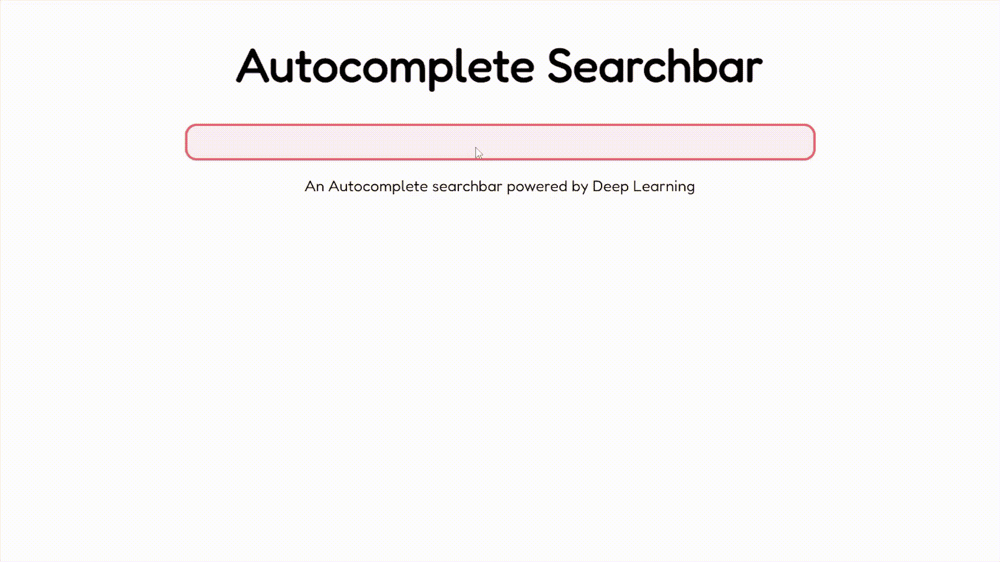
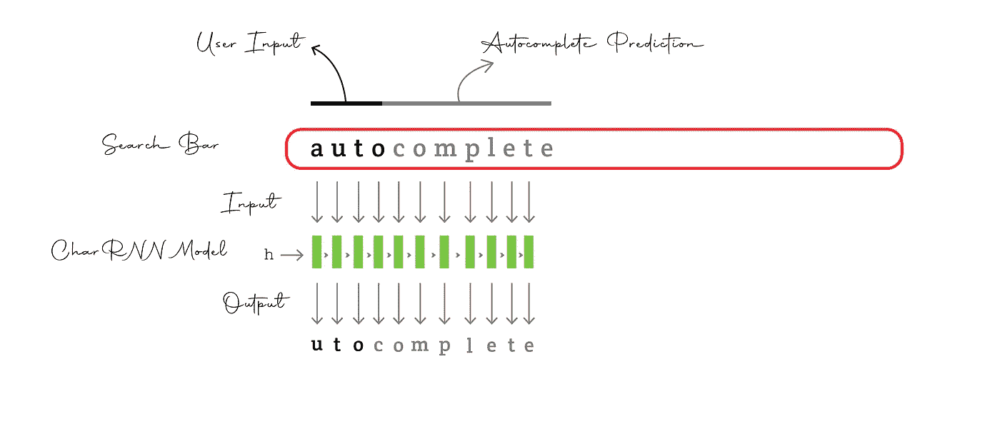
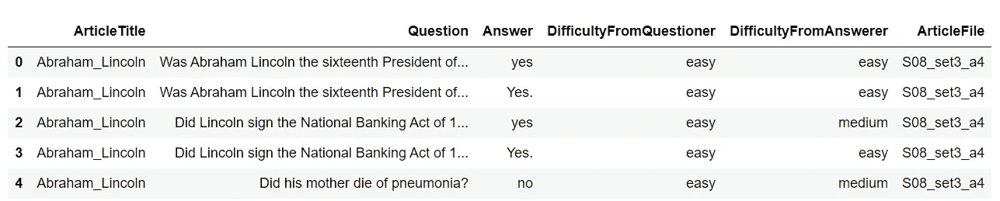
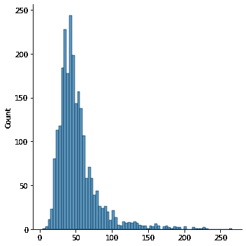
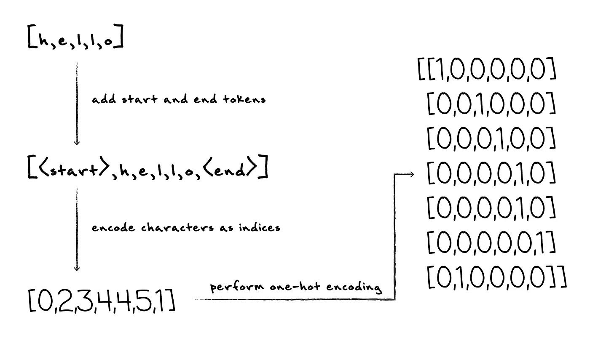
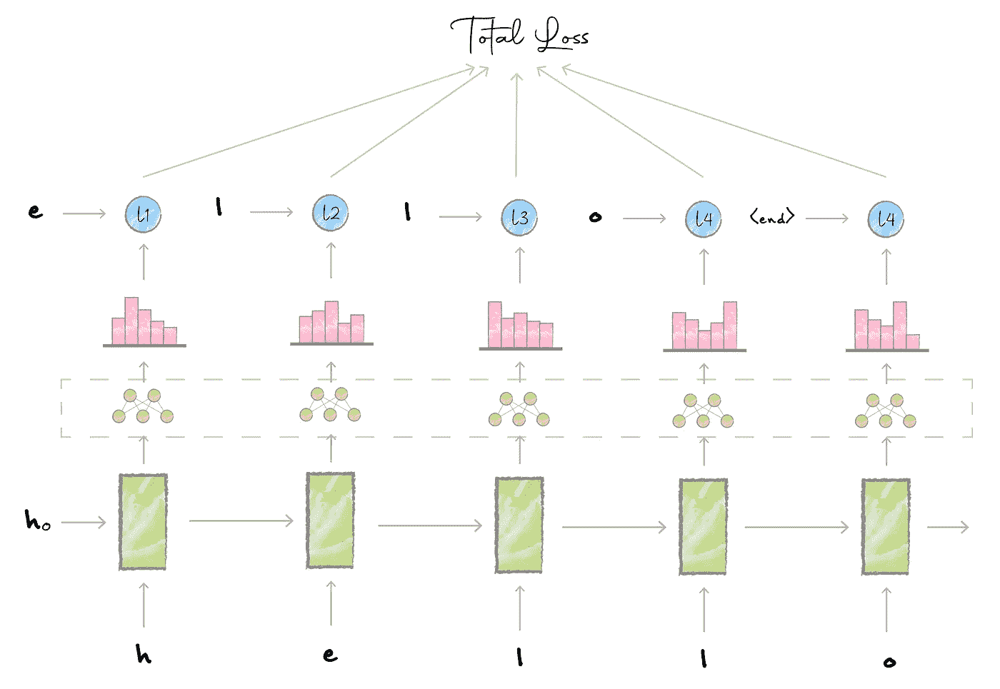
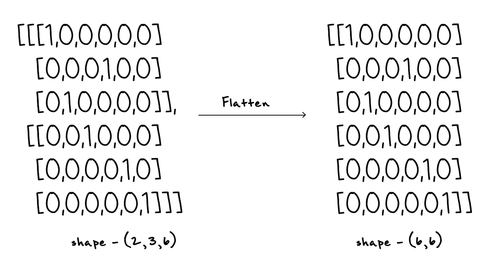
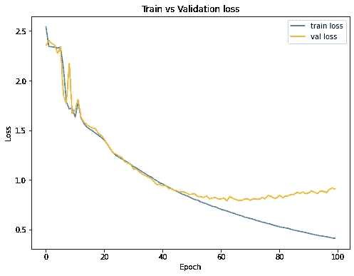
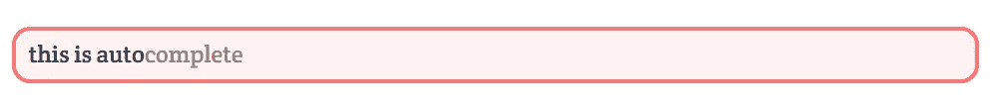

# 使用 Vue.js、FastAPI 和 WebSockets 在浏览器中构建基于人工智能的自动完成功能

> 原文：<https://towardsdatascience.com/build-an-ai-based-autocomplete-in-the-browser-using-vue-js-fastapi-and-websockets-1eb7ae19bfd8>

## 一个智能自动完成类似谷歌使用递归神经网络



我们将会建造什么

# 介绍

我喜欢谷歌搜索。它以某种方式读取我们的思想，知道我们接下来要键入什么。我必须承认，我不知道它是如何工作的，但在本文中，让我们尝试使用深度学习和递归神经网络来建立类似的东西。

# 整体直觉



作者图片

这个想法是，一旦用户开始在搜索栏中输入，我们就将输入的文本一个字符一个字符地输入到递归神经网络中，以生成自动完成的预测。

本教程分为 3 个部分:

*   建立和训练性格 RNN 模型
*   构建前端和后端
*   通过 WebSockets 建立通信

让我们开始吧。

# 准备模型

首先，让我们构建 charRNN 模型，它是应用程序的主干。

上面的笔记本包含了构建模型的代码。让我们一步一步来看:

## 数据集

现在，我们希望训练 charRNN 模型来预测用户将要提出的问题，因此让我们在问题数据集上训练该模型。

我从 [Kaggle](https://www.kaggle.com/rtatman/questionanswer-dataset) 中找到了下面的数据集(请参见最后关于数据集使用的致谢):



这个数据集是专门为问答相关任务设计的，但是，我们可以只过滤掉问题。

```
>> questions_all[10:15]
>> array(['Did Lincoln start his political career in 1832?',
       'Did Lincoln ever represent Alton & Sangamon Railroad?',
       'Which county was Lincoln born in?',
       'When did Lincoln first serve as President?',
       'Who assassinated Lincoln?'], dtype=object)
```

上面的代码片段显示了数据集中的一个小问题示例。该数据集包含来自各种主题的问题，它可以作为我们应用程序的一个良好起点，因为这些问题很短，有点像用户问 Google 的问题。

## 数据预处理

现在我们已经过滤掉了问题，下一步是清理它们并执行预处理，包括将文本转换成小写字母；以及删除标点符号、空值、制表符、换行符和多个空格。

上面的代码片段执行预处理。

## 数据统计

我们还没有完成预处理。让我们看看问题长度的分布图:



问题长度分布图

从上面的情节中，我们可以看到一个普通的问题有大约 50 个字符，但也有超过 200 个字符的问题。想想看，用户很少搜索这么长的问题，所以让我们完全删除它们，这样做是安全的，因为平均问题只有 50 个字符长。现在，我们可以将问题保留在平均值的一个标准偏差内，以包括数据集的大部分，并删除其他所有内容。

在上面的代码片段中，我们计算了分布的平均值和标准偏差，并将它们相加得到最佳长度，即距离平均值一个标准偏差的长度。最后，我们删除超过最佳长度的问题。

## 准备数据集

既然我们已经准备好了问题，我们就必须对它们进行编码和准备，以便输入到模型中。

下面的动画概述了我们将详细讨论的编码过程。


作者制作的动画

在 Pytorch 中，我们通常创建一个从 Pytorch 的`Dataset`类继承的自定义数据集类，下面是这样做的一些优点:

*   我们将对数据有更多的控制。
*   这有助于保持代码的模块化。
*   我们可以从这个 dataset 实例中创建一个 Pytorch `Dataloader`，它会自动处理数据的批处理、混排和采样，我们将在后面看到。

上面的代码片段显示了一个名为`QuestionsDataset`的自定义数据集类。让我们走一遍:

*   首先，在`__init__`方法中，我们通过从数据集中提取独特的字符来加载问题和准备好的词汇。我们还添加了一个额外的开始和结束标记，因为每当我们处理有限序列时，模型应该知道何时开始和结束句子。
*   `encode_questions`方法用于对单个问题进行编码。这里，我们首先使用我们在`__init__`方法中创建的词汇字典将问题中的字符编码为索引，然后我们执行一键编码。请注意，我们在 one-hot 编码之前，分别在句子的开头和结尾添加了开始和结束标记。您也可以使用嵌入来代替一次性编码，但是由于这里的词汇表很小，我们可以继续使用一次性编码。
*   回到`__init__`方法，我们对所有的问题进行编码，并用零填充，这样所有的问题都有相同的长度。填充允许我们批量处理问题，这可以在不影响模型性能的情况下提高训练时间。
*   我们还需要定义另外两个方法:应该返回数据集中数据点总数的`__len__`方法，以及应该返回基于索引的数据点的`__getitem__`方法。Pytorch 的`Dataloader`使用这些方法来批处理和混洗数据，我们将在下面看到。

编码过程如下图所示:



对问题进行编码

## 执行训练、验证分割

接下来，让我们将数据分成训练集和验证集，并创建数据加载器。

在上面的代码片段中，首先我们通过从所有问题中提取唯一字符来创建词汇表，定义批量大小，以及可以是词汇表中不存在的任何唯一字符的开始和结束标记。

接下来，我们以 9:1 的比率执行训练验证分割，并使用我们之前定义的`QuestionsDataset`类创建数据集。Pytorch 的`Dataloader`构造函数允许我们从这些数据集实例中创建数据加载器，它可以自动对数据进行批处理、采样和混排。

最后，我们准备好了输入模型的数据。接下来让我们建立模型。

## 构建 charRNN 模型

charRNN 模型在每个时间步长接收一个输入字符，并输出下一个适当字符的概率分布，如下所示:



作者插图

这个想法是，我们将一个编码的问题传递给递归神经网络，它在每个时间步输出一个隐藏状态。接下来，我们通过完全连接的网络传递这些隐藏状态中的每一个，以获得 logits。然后，我们从逻辑和目标计算交叉熵损失。我们计算每个时间步长的损耗，并将所有时间步长的损耗相加，得到总损耗，用于整个网络的反向传播。

这个模型的代码如下:

请注意，在输出通过完全连接的网络之前，我们对其进行了平坦化处理。这是因为每当我们计算损耗时，我们是对所有批次一起计算，而不是一批一批地计算。因此，我们沿着批次维度进行扁平化，以合并所有批次，如下所示:



拉平输出

## 训练模型

好了，让我们来训练我们的模型:

这里，我定义了一个三层 LSTM 网络，各层相互堆叠，隐藏状态大小为 512，丢失概率为 0.4。

我使用了一个 Adam 优化器，默认学习速率为 1e-3，交叉熵作为损失函数。训练和验证循环运行 100 个时期，并且每 10 个时期保存一次模型。这些超参数可以根据模型的性能进行调整。

此外，这里还有一些需要注意的事项:

*   我们在批次之间传递隐藏状态，这意味着一个批次的最终状态将是下一个批次的初始状态。
*   我们在更新模型参数之前剪切梯度，因为 rnn 面临着由于随时间反向传播而引起的梯度爆炸问题。因此，我们将幅度较大的梯度“裁剪”到特定的阈值。

训练后，我们可以绘制训练和验证曲线:



乍一看，这似乎是一个很好的情节，但如果你仔细观察，火车和验证损失彼此接近——这是一个不好的迹象。这通常意味着模型无法捕捉数据中的表示。这是有意义的，因为我们用的是一个简单的 charRNN 模型。如果我们使用基于 transformer 的模型，我们可能会提高性能，但现在让我们继续使用这个模型。

## 生成问题

现在我们的模型已经训练好了，让我们了解如何进行推理，在我们的例子中，推理是根据用户的输入来预测问题。

给这个想法一个输入字符，我们对它进行编码，并通过网络获得 logits 作为输出。然后，我们对 logits 应用 softmax 函数，以获得下一个字符的概率分布。现在，我们可以直接从这个分布中挑选最上面的字符，但是这样会导致过拟合，所以我们从分布中挑选最上面的 *k* 个字符，随机选择其中一个作为下一个字符。

下面的代码片段中的`GenerateText`类中的`predict_next_char`方法说明了这个过程。

`predict_next_char`方法接受一个输入字符和隐藏状态来预测下一个合适的字符。

现在，我们的目标是根据用户给出的上下文来预测问题。上下文也称为质数，是一组初始字符。这个想法是将这些初始字符一个一个地输入到模型中，并构建隐藏状态。接下来，使用隐藏状态和上下文中的最后一个字符，我们使用`predict_next_char`方法预测下一个字符，然后我们将这个预测的字符作为输入来预测下一个字符。我们重复这个过程，直到到达结束标记，这表示我们已经到达问题的结尾。

这个过程在`generate_text`法中有所说明。

让我们看看下面的一些例子:

# 准备前端

我们的前端将是简单的，它只是一个搜索栏，用户输入显示在前面，自动完成显示在后面，不透明度降低，如下图所示:



为了获得这种效果，想法是将两个`span`元素放在同一个`div`容器中，这可以通过将`div`容器的位置设置为相对位置并将`span`元素的位置设置为绝对位置来实现。本质上，我们相对于`div`容器放置`span`元素，这样它们可以被放在相同的位置。

代码片段如下所示:

现在，可以通过将`contenteditable`属性设置为 true 来使`span`元素在浏览器中可编辑。此外，因为我们希望在用户输入之后自动完成，所以它的 *z 索引*被设置为-1。最后，我们加入一些 CSS 来得到一个漂亮的自动完成的搜索栏。

# 通过 WebSockets 进行通信

这个想法是，一旦用户开始在浏览器中输入，文本需要作为输入发送到后端的 charRNN 模型，以生成预测。然后，预测将被发送回前端，并显示在搜索栏中用户输入后面的自动完成占位符中。

由于我们希望在前端和后端之间建立实时双向通信，WebSockets 将是理想的。

让我们构建前端、后端，并使用 WebSockets 建立通信。

# 构建后端

对于后端，我们只需围绕 charRNN 模型创建一个 API 包装器来服务请求。我在这里使用 FastAPI 来定义 WebSocket API。

让我们浏览一下代码:

首先，我们定义并加载预训练的 charRNN 模型，并将其设置为评估模式。接下来，我们定义一个使用 WebSocket 协议的路由和一个函数`predict_question`,每当请求到达这个路由时，这个函数就会被调用。

`predict_question`函数是一个异步函数，本质上意味着它不是等待一个特定的任务完成，而是执行其他部分，并在任务完成时返回。`async`关键字用于定义一个异步函数，而`await`关键字告诉*而不是*等待函数中特定任务的完成。

在这个函数中，首先我们接受来自前端服务器的握手并建立通信。然后，一旦我们从前端接收到输入文本，我们就通过 charRNN 模型运行它，以生成自动完成预测，并使用 WebSocket 协议将其发送回前端。

接下来让我们在前端添加 WebSocket 通信机制。

# 构建前端

在前端，我们需要一种机制来检测用户输入，这样我们就可以在用户开始输入时将文本发送到后端。为此，我们可以使用 Vue 指令和事件处理程序。`v-on`指令(也用`@`符号表示)监听元素上的特定事件，并在事件被触发时调用处理函数。

让我们浏览一下代码:

首先，我们在`mounted`生命周期钩子中创建 WebSocket 对象。生命周期钩子本质上是在组件创建的不同阶段被调用的函数。一旦组件被呈现到 DOM 中，就会调用`mounted`生命周期钩子，这是实例化 WebSocket 对象并与后端建立通信的好阶段。

接下来，在搜索栏元素中，我们添加了行`@input="sendText”`来监听输入事件并触发函数`sendText`，该函数获取搜索栏中的文本并将其发送到后端。一旦我们从后端接收到自动完成的预测，函数`receiveText`通过 WebSocket 对象的`onmessage`回调方法被触发，该函数填充`autoComplete`占位符，该占位符显示在搜索栏中用户输入的后面。

注意搜索栏元素中的第`@keypress=”preventInput”`行。这是一个事件处理程序，防止用户在搜索栏中键入数值或标点符号，因为记住在我们的 charRNN 模型的预处理步骤中，我们已经删除了所有内容，只保留了字母字符。因此，为了防止未识别的输入进入我们的 charRNN 模型，我们使用这个事件处理程序。

就是这样。我们已经完成了申请。让我们看看它的实际效果。

# 运行应用程序

代码可以在这个 [GitHub 库](https://github.com/wingedrasengan927/deep-autocomplete)中找到。要设置环境，请将此存储库克隆到您的工作区中:

```
git clone [https://github.com/wingedrasengan927/deep-autocomplete.git](https://github.com/wingedrasengan927/deep-autocomplete.git)
cd deep-autocomplete
```

假设您已经安装了 Kubernetes，按顺序运行以下命令:

```
kubectl apply -f ./backend/backend-deployment.yaml
kubectl apply -f ./backend/backend-service.yaml
kubectl apply -f ./frontend/frontend-deployment.yaml
kubectl apply -f ./frontend/frontend-service.yaml
```

您应该看到应用程序在`localhost:8080`运行

# 应用程序

虽然这是一个有趣的、初学者友好的项目，但我能想到的一个关键应用是构建个性化的搜索栏，使用某种模糊匹配算法来搜索想要的结果。然而，我们可能希望使用基于 Transformer 的模型来获得更好的性能。

我希望你喜欢这篇文章。让我们在 [LinkedIn](https://www.linkedin.com/in/neerajkrishnadev/) 和 [Twitter](https://twitter.com/WingedRasengan) 上连线。

# 致谢:

[这里使用的数据集](https://www.kaggle.com/rtatman/questionanswer-dataset)是由诺亚·史密斯、迈克尔·海尔曼、丽贝卡·华、谢伊·科恩、凯文·金佩尔以及卡耐基·梅隆大学和匹兹堡大学的许多学生在 2008 年至 2010 年间收集的。这里用的是 CC BY_SA 3.0 下的。如果您撰写任何涉及使用上述数据的论文，请引用该论文:

N. A .史密斯，m .海尔曼和 r .华(2008 年 9 月)。作为竞争性本科项目的问题生成。美国国家科学基金会关于问题生成、共享任务和评估挑战的研讨会论文集。