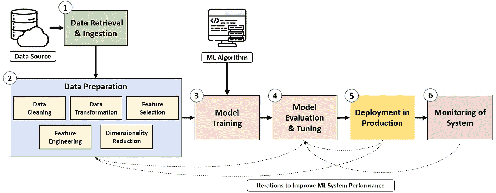
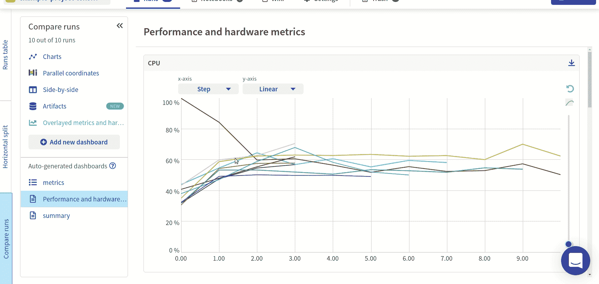
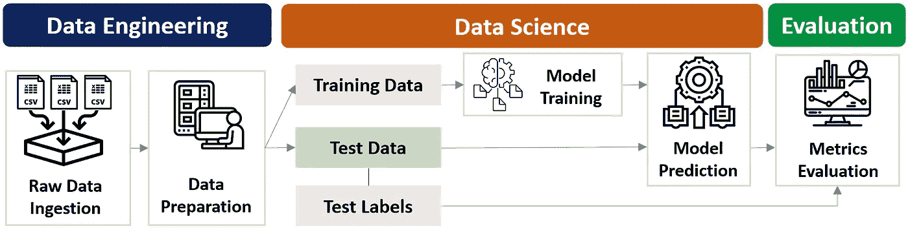
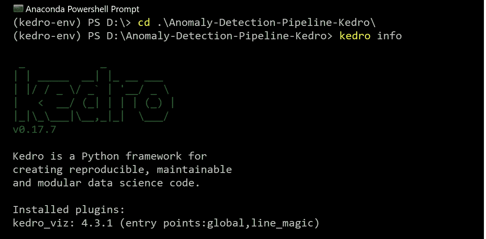
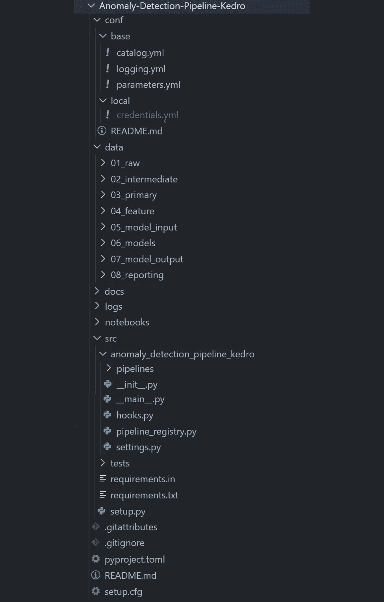
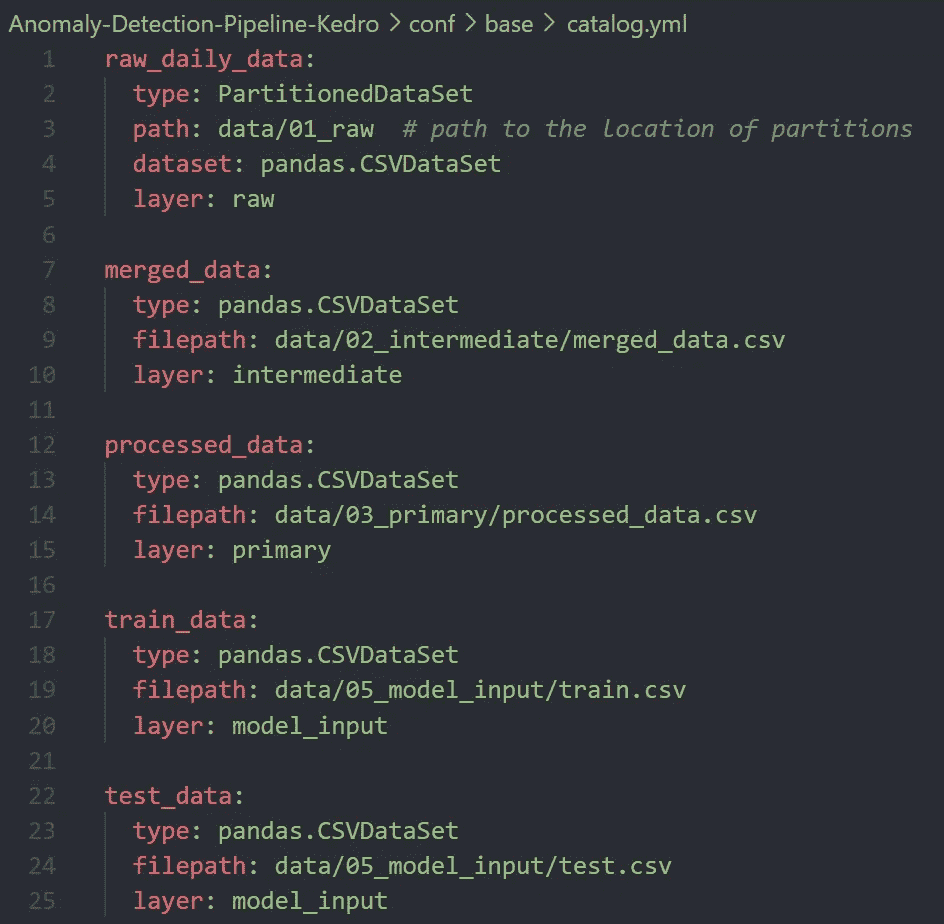
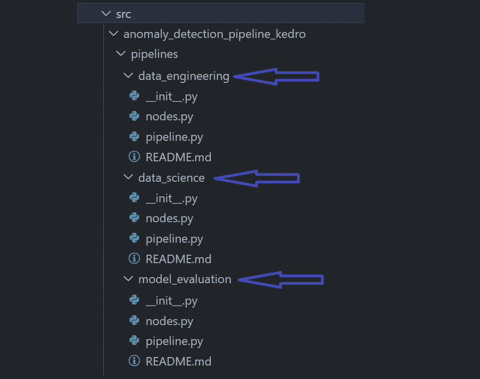
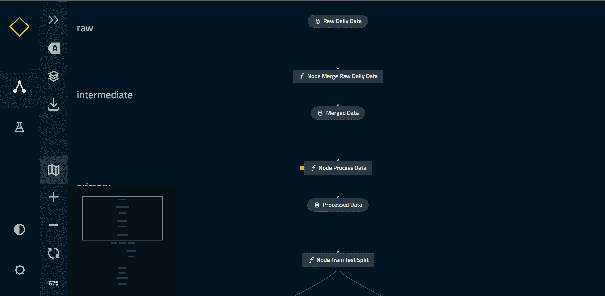
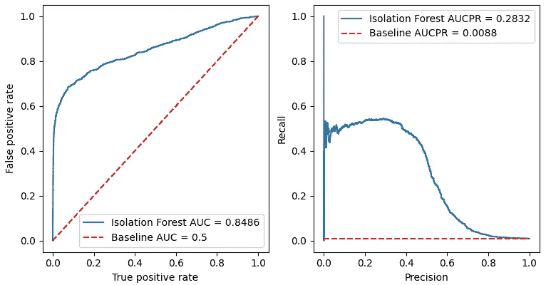
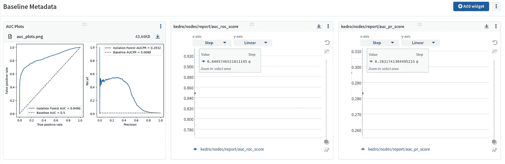

# 使用隔离林和 Kedro 构建异常检测管道

> 原文：<https://towardsdatascience.com/build-an-anomaly-detection-pipeline-with-isolation-forest-and-kedro-db5f4437bfab>

## 开发和管理用于检测欺诈性信用卡交易的数据科学管道


照片由 [Unsplash](https://unsplash.com?utm_source=medium&utm_medium=referral) 上的 [timea dombi](https://unsplash.com/@tinusphtography?utm_source=medium&utm_medium=referral) 拍摄

通过机器学习的强大功能，数据科学有望在所有行业产生巨大的商业价值。

然而， [Gartner](https://www.gartner.com/en/newsroom/press-releases/2021-11-22-gartner-forecasts-worldwide-artificial-intelligence-software-market-to-reach-62-billion-in-2022) 最近的一份报告显示，尽管有足够的数据和意图，大多数数据科学项目仍无法超越实验。

为了释放数据科学的全部潜力，机器学习模型需要作为可扩展的端到端系统部署在现实世界中，并自动管理。

本文探讨了数据科学管道背后的概念，以及如何利用 Kedro 创建金融数据异常检测管道。

> **本文首发于** [**海王。艾**](https://neptune.ai/blog/data-science-pipelines-with-kedro)

# 内容

> ***(1)****[*什么是数据科学管道？*](#0eae)***(2)***[*什么是 Kedro？*](#8f75)***(3)****[*为什么要 Kedro？*](#14ab)***(4)***[*分步指南—异常检测的数据科学管道*](#64a6)**

# **(1)什么是数据科学管道？**

**顾名思义，数据科学管道包括各种组件的无缝链接，以促进数据按预期顺利移动。**

**如果我们在网上搜索数据科学管道，我们会看到令人眼花缭乱的管道设计。好消息是，我们可以将这些管道归结为六个核心要素:**

1.  ****数据检索和摄取****
2.  ****数据准备****
3.  ****模特培训****
4.  ****模型评估和调整****
5.  ****模型部署****
6.  ****监控****

****

**作者图片**

**上图说明了这六个组件是如何连接起来形成一个管道的，在这个管道中，机器学习模型可以在生产环境中提供最佳结果。**

## **(1)数据检索和摄取**

**数据是所有数据科学项目的生命线，因此第一步是从各种数据源中识别相关的原始数据。**

**这一步比听起来更具挑战性，因为数据通常以不同的格式存储在不同的孤岛中(例如，第三方来源、内部数据库)。**

**一旦所需的数据集被正确识别，它们就被提取和整合以用于下游处理。**

## **(2)数据准备**

**数据洞察的质量取决于数据质量。因此，数据准备花费最多的时间和精力也就不足为奇了。**

**用于数据准备的技术基于手边的任务(例如，分类、回归等)。)并包括**数据**清理、**数据**变换、**特征**选择、**特征**工程等类别。**

## **(3)模型训练**

**模型训练是模型在数据中潜行，学习潜在的模式。经过训练的模型将被表示为从数据中捕获模式信息的统计函数。**

**要实现的机器学习模型的选择取决于实际任务、数据的性质和业务需求。**

## **(4)模型评估和调整**

**一旦模型训练完成，评估其表现是至关重要的。评估是通过让模型对以前没有见过的数据进行预测来完成的。它代表了它在现实世界中的表现。**

**评估指标有助于指导优化模型性能所需的更改(例如，选择不同的模型、调整超参数配置等)。).**

**机器学习开发周期是高度迭代的，因为有许多方法可以基于度量和错误分析来调整模型。**

## **(5)部署**

**一旦我们确信我们的模型可以提供出色的预测，我们就通过将它部署到生产环境中来将模型暴露给实际的操作。**

**模型部署是将模型集成到生产环境中的关键步骤，在生产环境中，模型接收实际数据并为数据驱动的业务决策生成输出。**

## **(6)监测**

**为了保持强大且持续运行的数据科学管道，我们必须监控其在部署后的表现。**

**除了模型性能和数据质量，监控指标还可以包括操作方面，如资源利用率和模型延迟。**

**在成熟的 MLOps 设置中，我们可以根据预测性能或新数据的可用性触发新的模型训练迭代。**

****

**模型监控仪表板示例| [来源](https://neptune.ai/blog/ml-model-monitoring-best-tools)(经许可使用)**

# **(2)什么是 Kedro？**

**数据科学管道的重要性刺激了许多有效构建和管理它们的框架的开发。一个这样的框架是 **Kedro** ，这是本文的重点。**

****Kedro** 是一个开源的 Python 框架，用于创建可复制的、可维护的、模块化的数据科学代码。它有助于加速数据管道，增强数据科学原型，并促进管道的再现性。**

**Kedro 将软件工程概念应用于开发生产就绪的机器学习代码，以减少成功部署模型所需的时间和精力。**

**它的影响是通过消除低质量代码的重新设计工作和无缝协作的项目模板的标准化来实现的。**

**让我们看看 Kedro 中的应用概念:**

*   ****再现性**:准确一致地跨不同管道运行和环境重新创建工作流程步骤的能力。**
*   ****模块化**:将大的代码块分解成更小的、独立的、易于理解的单元，这些单元易于测试和修改。**
*   ****可维护性**:使用标准代码模板，允许团队成员容易地理解和维护任何项目的设置，从而促进协作开发的标准化方法**
*   ****版本控制**:精确跟踪每个管道运行中使用的数据、配置和机器学习模型。**
*   ****文档**:清晰的结构化信息，便于理解**
*   ****无缝打包**:允许数据科学项目被记录并有效地运送到生产中(使用像 Airflow 或 Docker 这样的工具)。**

# **(3)为什么是 Kedro？**

**将数据科学项目从试点开发带入生产的过程充满了挑战。一些重大困难包括:**

*   **需要为生产环境重写代码，导致项目严重延迟**
*   **混乱的项目结构使得协作充满挑战**
*   **难以追踪的数据流**
*   **过于冗长且难以测试或重用的功能**
*   **难以理解的函数之间的关系**

**QuantumBlack 团队开发了 Kedro 来应对上述挑战。它诞生于这样一种信念，即数据科学代码应该从一开始就为生产做好准备。**

# **(4)分步指南:构建用于异常检测的数据科学管道**

**让我们进入激动人心的部分，通过一个实际动手的项目来学习。**

**项目用例围绕着金融**欺诈检测**。我们将使用**隔离森林**作为主要的机器学习模型，构建一个**异常检测管道**来识别信用卡交易中的异常。**

**[信用卡交易数据](https://github.com/Fraud-Detection-Handbook)由 Worldline 和[机器学习小组](http://mlg.ulb.ac.be/)合作获得。这是对真实世界信用卡交易的真实模拟，旨在包括复杂的欺诈检测问题。**

**以下可视化显示了我们最终的异常检测管道，并作为我们将在以下部分构建的**蓝图**。**

****

**项目结构|作者图片**

**您可以随时查看这个项目的 [**GitHub repo**](https://github.com/kennethleungty/Anomaly-Detection-Pipeline-Kedro) 。**

## **步骤 1 —安装 Kedro 和 Kedro-Viz**

**建议创建一个虚拟环境，以便每个项目都有其独立的环境和相关的依赖项。要使用 Kedro，官方文档建议用户[安装 Anaconda](https://www.anaconda.com/products/individual#Downloads) 。**

**因为我的 Python 版本是 3.10 以上，Anaconda 使得在兼容 Kedro 需求的**版本上创建环境(使用 **conda** 而不是 **venv** )变得很容易(也就是说，在撰写本文时，Python 是 3.6-3.8)。****

**特别是，这是生成我们的 Kedro 环境的命令(在 Anaconda Powershell 提示符中):**

```
**conda create --name kedro-env python=3.7 -y**
```

**一旦用`conda activate kedro-env`设置并激活了虚拟环境，我们就可以使用 *pip* 来安装 Kedro 和 Kedro-Viz 插件:**

```
**pip install kedro kedro-viz** 
```

**我们可以通过将目录切换到我们的项目文件夹并输入`**kedro info**`来检查 Kedro 是否正确安装。如果安装正确，我们应该看到以下内容:**

****

**作者图片**

**此时，我们可以安装项目所需的其他包了。**

```
**pip install scikit-learn matplotlib**
```

**如果我们希望将这个项目初始化为 Git 存储库，我们可以使用:**

```
**git init**
```

## **步骤 2 —项目设置**

**Kedro 的一个关键特性是创建标准的、可修改的和易于使用的项目模板。我们可以用以下代码初始化一个新的 Kedro 项目:**

```
**kedro new**
```

**在为一系列提示提供相关名称之后，我们将得到一个高度组织化的项目目录，我们可以在这个目录上进行构建:**

****

**作者图片**

**项目结构可以分为**六个**主文件夹:**

> ****/conf:** *包含指定数据源(即数据目录)、模型参数、凭证和日志信息等细节的配置文件。***
> 
> ****/数据:** *包含输入、中间和输出数据。它被组织成一个八层的***数据工程约定，以清晰地分类和构建数据的处理方式。****
> 
> ****/docs:** *包含与项目文档相关的文件。***
> 
> ****/logs:** *包含管道运行时生成的日志文件。***
> 
> ****/笔记本:***包含项目中使用的 Jupyter 笔记本，例如用于实验或初步探索性数据分析。***
> 
> ****/src:** *包含项目的源代码，如流水线步骤、数据处理、模型训练的 Python 脚本。***

## **步骤 3 —数据设置**

**数据先于科学，所以让我们从数据设置开始。原始数据(每日交易的 70 个 CSV 文件)首先放在 ***data/01_raw*** 中。**

**根据我们之前的项目蓝图，我们知道在整个过程中将会生成和利用哪些数据。因此，我们可以将这些信息翻译成 [**数据目录**](https://kedro.readthedocs.io/en/stable/05_data/01_data_catalog.html) ，这是一个项目可用的数据源注册表。**

**数据目录提供了一种定义如何存储和解析数据的一致方式，使得从管道中的任何位置加载和保存数据集变得容易。**

**我们可以在*中找到数据目录。yml* 文件—**conf/base/catalog . yml**。**

****

**作者图片**

**上图是数据目录中定义的数据源的一个片段。例如，我们首先期望我们的原始 CSV 文件被读取并合并到一个名为`merged_data.csv`的中间 CSV 数据集。**

**Kedro 有[内置数据连接器](https://kedro.readthedocs.io/en/stable/kedro.extras.datasets.html)(比如熊猫。CSVDataSet，matplotlib。MatplotlibWriter)来适应不同的数据类型。**

## **步骤 4-创建管道**

**一旦定义了我们的数据目录，我们就可以构建我们的管道。首先要理解两个关键概念: [**节点**](https://kedro.readthedocs.io/en/stable/06_nodes_and_pipelines/01_nodes.html) 和 [**管道**](https://kedro.readthedocs.io/en/stable/06_nodes_and_pipelines/02_pipeline_introduction.html) 。**

*   ****节点**是管道的构建块。它们是代表数据转换的 Python 函数，例如数据预处理、建模。**
*   ****管道**是连接在一起交付工作流的节点序列。它组织节点的依赖关系和执行顺序，连接输入和输出，同时保持代码模块化。**

**用于异常检测的完整管线可分为**三个较小的模块化管线，**我们将最终连接这些管线:**

1.  ****数据工程管道****
2.  ****数据科学管道****
3.  ****车型评估管道****

**我们可以根据指定的名称，使用以下命令实例化这些模块化管道:**

```
**kedro pipeline create data_engineering
kedro pipeline create data_science
kedro pipeline create model_evaluation**
```

**虽然管道在这个阶段是空的，但是它们的结构已经在 ***/src*** 文件夹中很好地生成了。**

****

**作者图片**

**每个管道文件夹都有相同的文件，包括 **nodes.py** (节点代码)和 **pipeline.py** (管道代码)。**

## **步骤 5 —构建数据工程管道**

**让我们先来看看数据工程管道，我们在这里处理数据，用于下游的机器学习。更具体地说，有三个预处理任务要执行:**

1.  **将原始数据集合并到中间合并数据集中**
2.  **通过仅保留预测值列并为后续训练测试拆分创建新的日期列来处理合并的数据集**
3.  **按时间顺序执行 80:20 列车测试，拆分并删除不必要的列**

**我们首先将任务脚本化为**三个独立的** **节点函数**在 **nodes.py** 中:**

**然后，我们将这些节点函数导入到 **pipeline.py** 中，以正确的顺序链接它们。**

**注意在每个节点的包装器**中*节点(..)*** ，我们指定一个名称，函数(从 ***node.py*** 导入)，以及数据目录中定义的**输入**和**输出**数据集(参见 [**步骤 3**](#7fb4) )。**

**节点包装器中的参数应该与数据目录中的数据集名称和节点函数的参数相匹配。**

**对于节点`node_process_data`，预测列的列表存储在 **conf/base/parameters.yml** 中的参数文件中。**

**我们的数据工程管道设置已经完成，但是还没有**准备好**，因为它还没有**注册**。我们将在稍后的**步骤 8** 中探讨这一点，所以让我们继续构建剩下的两条管道。**

## **步骤 6 —构建数据科学管道**

**我们管道的异常检测模型是[隔离林](https://en.wikipedia.org/wiki/Isolation_forest)。**隔离森林**是一个**无监督算法**，使用决策树构建。**

**它通过随机选择一个特征，然后在最大值和最小值之间选择一个分割值来“隔离”观察值。由于异常现象很少且不同，因此预计它们比正常观察更容易分离。**

**我们将使用 scikit-learn [实现](https://scikit-learn.org/stable/modules/generated/sklearn.ensemble.IsolationForest.html)进行隔离林建模。有两个任务(和节点)要创建— **(i)** 模型训练和 **(ii)** 模型预测(也称为推理)。**

**模型的**污染值**设置为 **0.009** ，与原始数据集中观察到的欺诈案例比例(即 0.9%)相匹配。**

**像以前一样，我们在 **pipeline.py** 中的管道函数中将节点链接在一起。**

**正如在数据目录中看到的，我们将把我们训练过的隔离森林模型作为 **pickle** 文件保存在***Data/06 _ models***中。**

## ****第 7 步—构建模型评估管道****

**虽然隔离森林是一个无监督的模型，但如果我们有地面真实标签，我们仍然可以评估它的性能。**

**在原始数据集中，有一个 **TX_FRAUD** 变量作为欺诈交易的指示器。**

**有了基础事实标签和预测的异常分数，我们可以获得评估指标并将其表示为 [AUC 和 AUCPR](https://en.wikipedia.org/wiki/Receiver_operating_characteristic) 图。**

**下面是运行模型评估节点的 **pipeline.py** 脚本。**

**这个模型评估步骤与步骤 6 中的数据科学管道是分开的。这种分离是因为我们使用的是**无监督**异常检测算法，我们并不期望总是获得真实数据。**

## ****步骤 8 —在管道注册表中注册所有管道****

**至此，创建管道的所有艰苦工作都已完成。我们现在需要通过在**管道注册表**中导入和注册所有三个模块化管道来结束。**

**return 语句中的`__default__`行表示模块化管道的默认运行顺序，在我们的例子中是所有三个模块化管道— `data_engineering`、`data_science`和`model_evaluation`。**

**Kedro 的美妙之处在于，它的模块化结构让我们能够灵活地构建我们的管道。例如，如果我们没有基本事实标签，我们可以从默认管线运行中排除`model_evaluation`。**

## **步骤 9 —可视化管道**

**在运行管道之前，最好检查一下我们到目前为止已经构建了什么。奇妙的 **Kedro-Viz** 插件让我们可以很容易地可视化整个管道结构和依赖关系。**

**鉴于其易用性、清晰度和美观的显示，许多 QuantumBlack 客户[对这一功能表达了他们的喜悦](https://www.mckinsey.com/about-us/new-at-mckinsey-blog/meet-kedro-mckinseys-first-open-source-software-tool)也就不足为奇了。**

**我们可以使用以下命令轻松生成可视化效果:**

```
**kedro viz**
```

**我们的浏览器中将会打开一个新的选项卡，我们将会看到一个漂亮的可视化工具来探索我们的管道结构。这种可视化也可以很容易地导出为一个. **png** 图像文件。**

****

**作者图片**

## **步骤 10 —运行管道**

**我们终于准备好运行我们的管道。下面的命令将执行我们之前注册的默认管道。**

```
**kedro run**
```

**运行时，管道将使用生成的数据填充各自的目录，包括异常预测和模型评估图。**

**我们还可以运行在管道注册表中注册的特定管道。例如，如果我们只想运行数据工程模块化管道(`de`)，我们可以在命令中添加`--pipeline=<NAME>`:**

```
**kedro run --pipeline de**
```

## **步骤 11 —评估管道输出**

**最后，是时候评估我们异常检测管道的输出了。特别是，让我们回顾一下评估图(保存在 ***数据/08 _ 报告*** )来看看模型的性能如何。**

****

**作者图片**

**这些图表明隔离森林模型 AUC 是 **0.8486** ，这是一个相当好的基线机器学习模型性能。**

# **附加功能**

**恭喜你走到这一步，并成功地用 Kedro 创建了一个异常检测管道！**

**除了基本的功能之外，Kedro 还有其他用于管理数据科学项目的有用特性。这里有几个值得一提的功能:**

## **(1)实验跟踪**

**Kedro 使设置实验跟踪和访问每个管道运行的记录指标变得容易。除了它的[内部实验跟踪能力](https://kedro.readthedocs.io/en/stable/03_tutorial/07_set_up_experiment_tracking.html)，Kedro 与其他 MLOps 服务整合得很好。**

**例如， [**Kedro-Neptune 插件**](https://docs.neptune.ai/integrations-and-supported-tools/automation-pipelines/kedro) 让用户享受组织良好的管道和强大的 Neptune 元数据管理用户界面的好处。**

****

**Neptune UI 仪表板示例|作者图片**

## **(2)管道切片**

**Kedro 的[管道切片功能](https://kedro.readthedocs.io/en/stable/06_nodes_and_pipelines/06_slice_a_pipeline.html)允许我们根据需要执行管道的特定部分。例如，我们可以在希望运行的管道切片中定义开始和结束节点:**

```
**kedro run --from-nodes train-test-split --to-nodes train_model**
```

## **(3)项目文档、打包和部署**

**我们可以通过在项目的根目录下运行这个命令来生成特定于项目的文档(构建在 Sphinx 框架上)。**

```
**kedro build-docs**
```

**接下来，为了将项目的[打包](https://kedro.readthedocs.io/en/stable/03_tutorial/08_package_a_project.html)为 Python 库，我们运行以下命令:**

```
**kedro package**
```

**最后，我们可以通过第三方插件 [Docker](https://github.com/kedro-org/kedro-plugins/tree/main/kedro-docker) 和 [Airflow](https://github.com/kedro-org/kedro-plugins/tree/main/kedro-airflow) 来[部署](https://kedro.readthedocs.io/en/latest/10_deployment/01_deployment_guide.html)这些打包的数据科学管道。**

# **结论**

**还有其他有趣的 Kedro 特性和教程可用，所以请查看官方文档进行进一步的探索。另外，继续前进，看看包含这个项目所有代码的 [**GitHub repo**](https://github.com/kennethleungty/Anomaly-Detection-Pipeline-Kedro) 。**

**如果您想了解 Kedro 与市场上其他流水线工具的比较，请查看下面这篇全面的 NeptuneAI 文章:**

**[](https://neptune.ai/blog/kedro-vs-zenml-vs-metaflow) [## Kedro vs ZenML vs Metaflow:应该选择哪个管道编排工具？- neptune.ai

海王星. ai](https://neptune.ai/blog/kedro-vs-zenml-vs-metaflow)** 

# **在你走之前**

**我欢迎您**加入我的数据科学学习之旅**。跟随此[媒体](https://kennethleungty.medium.com/)页面并查看我的 [GitHub](https://github.com/kennethleungty) 以了解实用和教育数据科学内容。同时，与 Kedro 一起享受构建数据科学管道的乐趣！**

**[](/end-to-end-automl-train-and-serve-with-h2o-mlflow-fastapi-and-streamlit-5d36eedfe606) [## H2O AutoML、MLflow、FastAPI 和 Streamlit 的端到端 AutoML 管道

### 关于使用一系列功能强大的工具来培训和服务 AutoML 管道的简单易懂的综合指南

towardsdatascience.com](/end-to-end-automl-train-and-serve-with-h2o-mlflow-fastapi-and-streamlit-5d36eedfe606) [](/autoxgb-for-financial-fraud-detection-f88f30d4734a) [## 利用 AutoXGB 进行金融欺诈检测

### AutoXGB 与标准 XGBoost 在检测欺诈性信用卡交易方面的对比

towardsdatascience.com](/autoxgb-for-financial-fraud-detection-f88f30d4734a) [](/key-learning-points-from-mlops-specialization-course-deeplearning-ai-andrew-ng-5d0746605752) [## MLOps 专业化认证的关键学习点—课程 1

### 面向生产的机器学习工程课程 1 的主要课程(包括课堂讲稿)

towardsdatascience.com](/key-learning-points-from-mlops-specialization-course-deeplearning-ai-andrew-ng-5d0746605752) [](https://kennethleungty.medium.com/membership) [## 通过我的推荐链接加入媒体-梁建华

### 作为一个媒体会员，你的会员费的一部分会给你阅读的作家，你可以完全接触到每一个故事…](https://kennethleungty.medium.com/membership)**