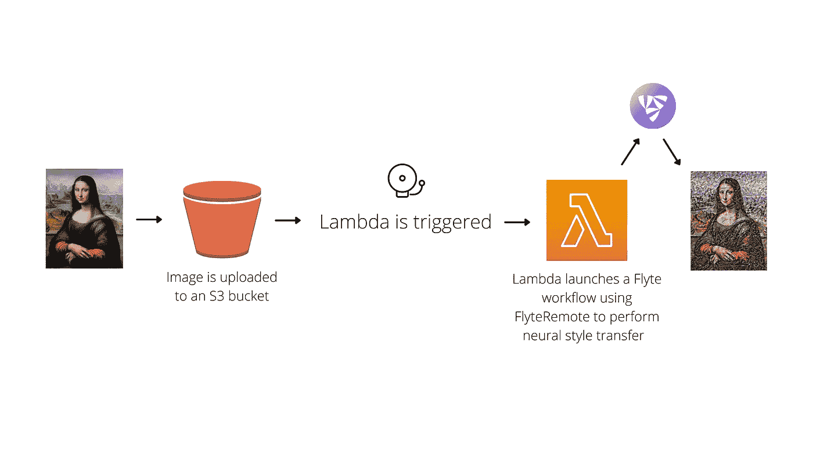
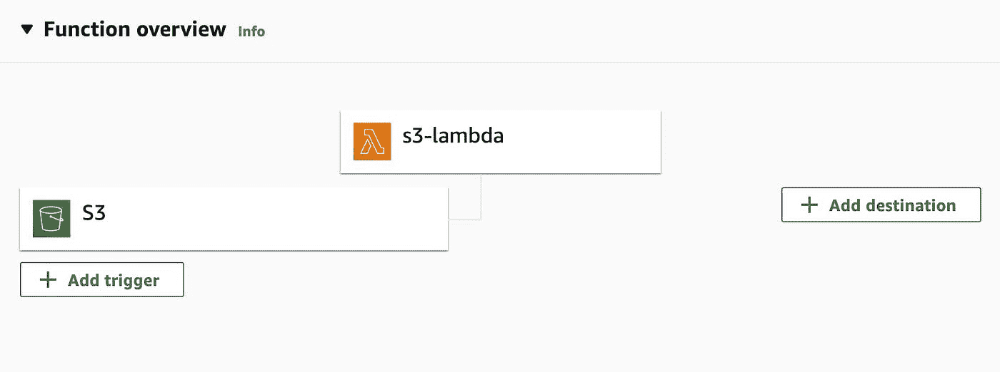

# 使用 AWS Lambda 构建一个事件驱动的神经风格传输应用程序

> 原文：<https://towardsdatascience.com/build-an-event-driven-neural-style-transfer-application-using-aws-lambda-18fa8145ef5b>


在 5 个时期和每个时期 100 个步骤之后，生成神经类型转移图像(在右侧)

为了构建一个生产就绪的 ML 应用程序并确保它的长期稳定性，我们需要考虑一长串的需求，包括模型迭代的容易程度、可再现性、基础设施、自动化、资源、内存等等。最重要的是，我们需要一个*无缝的开发者体验*。会有多难呢？

[Flyte](https://github.com/flyteorg/flyte) 可以处理前一组问题，因为:

*   这是一个工作流自动化平台，有助于维护和复制管道。
*   它提供了基础设施、资源和内存的控制旋钮。

此外，Flyte 简化了开发人员的体验。在这篇博文中，我们将看到如何使用 Flyte 和 AWS Lambda 构建一个神经风格的转换应用程序。我们将对端到端管道进行编码，并分配所需的计算来运行代码。此外，我们将设计一个事件驱动的机制来触发管道，并在用户上传图像时输出风格化的图像。*从用户的角度来看，上传图像时必须生成风格化的输出图像。*

由于应用程序必须在一个事件上被触发，例如，图像上传，对 Flyte 来说更合适的选择是使用 AWS Lambda。它是无服务器和事件驱动的计算服务。我们的神经风格传输应用程序将利用 AWS Lambda 的“事件驱动特性”。

让我们看看如何使用 Flyte 和 AWS Lambda 将管道自动化和事件驱动的服务结合在一起。



*图一。应用程序概述(图片由作者提供)*

# 应用代码

神经风格转移是将风格图像的风格应用到内容图像上。输出图像将是内容和样式图像的混合。

要开始使用代码，首先要导入并配置依赖项。

*注意:此代码改编自 TensorFlow 文档* *中的* [*神经样式传递示例。运行代码，确保* `*tensorflow*` *、* `*flytekit*` *、* `*Pillow*` *库通过* `*pip*` *安装。*](https://www.tensorflow.org/tutorials/generative/style_transfer)

`content_layers`和`style_layers`是 VGG19 模型的层，我们将使用它们来构建我们的模型，`tensor_to_image`任务将张量转换为图像。

模型建立过程的第一步是获取图像并对其进行预处理。定义一个`[@task](https://docs.flyte.org/projects/flytekit/en/latest/generated/flytekit.task.html)`来加载图像，并将其最大尺寸限制为 512 像素。

`preprocess_img`任务下载内容和样式图像文件，并使用`load_img`函数调整它们的大小。

准备好模型使用的数据后，定义一个返回样式和内容张量的 VGG19 模型。

```
class **StyleContentModel**(tf.keras.models.Model):
    def **__init__**(self, style_layers, content_layers):
        super(StyleContentModel, self).__init__()
        self.vgg = vgg_layers(style_layers + content_layers)
        self.style_layers = style_layers
        self.content_layers = content_layers
        self.num_style_layers = len(style_layers)
        self.vgg.trainable = False def **call**(self, inputs):
        "Expects float input in [0,1]"
        inputs = inputs * 255.0
        preprocessed_input = tf.keras.applications.vgg19.preprocess_input(inputs)
        outputs = self.vgg(preprocessed_input)
        style_outputs, content_outputs = (
            outputs[: self.num_style_layers],
            outputs[self.num_style_layers :],
        )
        style_outputs = [gram_matrix(style_output) for style_output in style_outputs]
        **content_dict** = {
            content_name: value
            for content_name, value in zip(self.content_layers, content_outputs)
        }
        **style_dict** = {
            style_name: value
            for style_name, value in zip(self.style_layers,    style_outputs)
        }
        return {"content": content_dict, "style": style_dict}
```

`vgg_layers`函数返回中间层输出的列表，在该列表之上构建模型(注意，我们使用的是预训练的 VGG 网络)，而`gram_matrix`函数*字面上的*描述图像的风格。当在图像上调用模型时，它返回`style_layers`的 gram 矩阵和`content_layers`的内容。

接下来是样式转换算法的实现。通过考虑两个损失的加权组合，计算总损失(样式+内容)。

```
def **style_content_loss**(outputs, content_targets, style_targets):
    style_outputs = outputs["style"]
    content_outputs = outputs["content"]
    style_loss = tf.add_n(
        [
            tf.reduce_mean((style_outputs[name] - style_targets[name]) ** 2)
            for name in style_outputs.keys()
        ]
    )
    **style_loss** *= style_weight / len(style_layers)
    content_loss = tf.add_n(
        [
            tf.reduce_mean((content_outputs[name] - content_targets[name]) ** 2)
            for name in content_outputs.keys()
        ]
    )
    **content_loss** *= content_weight / len(content_layers)
    **loss = style_loss + content_loss**
    return loss
```

从`tf.GradientTape`内调用`style_content_loss`更新图像。

```
[**@task**](http://twitter.com/task)**(requests=Resources(cpu="1", mem="5Gi", storage="5Gi", ephemeral_storage="5Gi"))**
def **train_step**(
    image: tf.Variable, content_image: tf.Tensor, style_image: tf.Tensor
) -> tf.Variable:
    opt = tf.optimizers.Adam(learning_rate=0.02, beta_1=0.99, epsilon=1e-1)
    extractor = StyleContentModel(style_layers, content_layers)
    style_targets = extractor(style_image)["style"]
    content_targets = extractor(content_image)["content"]
    **with tf.GradientTape() as tape:
        outputs = extractor(image)
        loss = style_content_loss(outputs, content_targets, style_targets)
        loss += total_variation_weight * tf.image.total_variation(image)**
    grad = tape.gradient(loss, image)
    opt.apply_gradients([(grad, image)])
    image.assign(clip_0_1(image))
    return image
```

`train_step`任务初始化样式和内容目标值(张量)，计算总变化损失，运行梯度下降，应用处理过的梯度，并在 0 和 1 之间裁剪图像的像素值。如下定义`clip_0_1`功能:

```
def **clip_0_1**(image):
    return tf.clip_by_value(image, clip_value_min=0.0, clip_value_max=1.0)
```

创建一个`[@dynamic](https://docs.flyte.org/projects/flytekit/en/latest/generated/flytekit.dynamic.html#flytekit-dynamic)`工作流，为指定数量的`epochs`和`steps_per_epoch`触发`train_step`任务。

`tf.Variable`存储内容图像。当从`tf.GradientTape`内调用时，`image`，一个`tf.Variable`被观察，操作被记录，用于自动微分。

最后，定义一个`[@workflow](https://docs.flyte.org/projects/flytekit/en/latest/generated/flytekit.workflow.html)`来封装任务并生成风格化的图像。

一旦管道被[部署](https://docs.flyte.org/en/latest/deployment/aws/index.html)，接下来的步骤将是设置 S3 桶和配置 Lambda。

# 配置 AWS S3 桶和 Lambda

图像将被上传到 S3 桶，一旦图像被上传，Lambda 将被用来触发 Flyte 工作流。

## S3 水桶

要配置 S3 存储桶，

1.  打开[亚马逊 S3 控制台](https://console.aws.amazon.com/s3/)。
2.  选择**桶**。
3.  选择**创建桶**。
4.  为存储桶命名，例如，“神经类型转移”。
5.  选择适当的 AWS 区域(确保 Lambda 在同一个 AWS 区域中创建)。
6.  阻止或解除阻止公共访问(本教程假设授予了公共访问)。
7.  选择**创建桶**。

## 希腊字母的第 11 个

Lambda 函数可以通过蓝图、容器映像或无服务器应用程序库从头开始创建。可以选择 Blueprint 来获取样本 lambda 代码，在我们的例子中，是一个 S3 blueprint。然而，由于我们需要从 Lambda 内部连接到 FlyteRemote，我们必须安装`flytekit`库。Lambda 内的库安装可以通过 [*zip 文件*](https://docs.aws.amazon.com/lambda/latest/dg/python-package.html) 或 [*容器镜像*](https://docs.aws.amazon.com/lambda/latest/dg/images-create.html) 的方式实现。

Zip 文件是让`flytekit`进入 Lambda 的最简单的方法，但是由于它对 zip 文件的大小限制，更可行的方法是使用容器映像方法。

## 容器图像

要在您的机器上创建容器映像:

1.创建一个项目目录(例如 lambda)来容纳 lambda 函数。

2.在目录中创建 4 个文件:`lambda_function.py`、`Dockerfile`、`requirements.txt`和`flyte.config`。

```
lambda
 ├── Dockerfile
 ├── flyte.config
 ├── lambda_function.py
 └── requirements.txt
```

3.`lambda_function.py`:封装代码获取上传的图片，实例化一个 [**FlyteRemote**](https://docs.flyte.org/projects/flytekit/en/latest/design/control_plane.html#design-control-plane) 对象，触发 Flyte 工作流。

ℹ️ FlyteRemote 提供了一个编程接口来与 Flyte 后端进行交互。

务必填写`endpoint`、`default_project`(如`flytesnacks`)、`default_domain`(如`development`)，以及投放计划名称(如`neural_style_transfer.example.neural_style_transfer_wf`)。

4. **flyte.config** :添加通过 flyteRemote 连接 Flyte 的配置。

5. **requirements.txt**

```
flytekit>=1.0.0
```

6. **Dockerfile** :将`lambda_function.py`、`flyte.config`、`requirements.txt`复制到根目录。将`CMD`实例化为在`lambda_function.py`文件中使用的处理程序。

7.使用以下命令在项目目录中构建 Docker 映像:

```
docker build -t neural-style-transfer .
```

8.向 Amazon ECR 注册表验证 Docker CLI。

```
aws ecr get-login-password --region <us-east-1> | docker login --username AWS --password-stdin <123456789012>.dkr.ecr.<us-east-1>.amazonaws.com
```

确保替换`<>`中的文本。

9.在 ECR 中创建一个存储库。

*   打开[亚马逊 ECR 控制台](https://console.aws.amazon.com/ecr/)。
*   选择**储存库**。
*   选择**创建存储库**(如 lambda)。

10.标记您的 Docker 映像，并将映像推送到新创建的存储库中。

```
docker tag neural-style-transfer:latest <123456789012>.dkr.ecr.<us-east-1>.amazonaws.com/lambda:neural-style-transfer-latestdocker push <123456789012>.dkr.ecr.<us-east-1>.amazonaws.com/lambda:neural-style-transfer-latest
```

确保替换注册表详细信息中的`<>`中的文本。

就是这样！您现在在 ECR 中有了自己的图像。

## λ配置

要配置 Lambda，

1.  打开 Lambda 控制台的[功能页面](https://console.aws.amazon.com/lambda/home#/functions)。
2.  选择**创建功能**。
3.  选择**容器图像**。
4.  输入函数名(如 s3-lambda)。
5.  给**容器镜像 URI** (应该可以在[亚马逊 ECR 控制台](https://console.aws.amazon.com/ecr/)->-**仓库**仪表盘中找到)。
6.  选择**创建功能**。

您现在已经配置了 lambda！

# 许可

S3 水桶和拉姆达目前是分开的实体。为了在图像上传到 S3 桶时立即触发 Lambda，我们必须在它们之间建立一个连接。

连接它们还需要设置所需的权限。但是在配置权限之前，复制 bucket 和 Lambda ARNs。

**斗 ARN** :

1.  打开[亚马逊 S3 控制台](https://console.aws.amazon.com/s3/)。
2.  选择**木桶**。
3.  选择你的桶。
4.  选择**属性**。
5.  复制 ARN。

**λARN**:

1.  打开 Lambda 控制台的[功能页面](https://console.aws.amazon.com/lambda/home#/functions)。
2.  选择**功能**。
3.  选择你的λ。
4.  选择**配置**然后选择**权限**。
5.  点击**中的角色执行**角色。
6.  复制 ARN。

## S3 水桶

要设置 S3 存储桶的权限，请执行以下操作:

1.  转到您创建的 S3 存储桶。
2.  选择**权限**。
3.  在**斗策**中，选择**编辑**。
4.  添加以下策略:

确保填写 Lambda 执行角色 ARN 和 S3 桶 ARN。

## 希腊字母的第 11 个

要为 Lambda 设置权限，请执行以下操作:

1.遵循*λARN*一节中概述的步骤 1- 4。

2.在权限下，选择**添加权限**。

3.在下拉列表中，选择**创建内嵌策略**。

4.在 **JSON** 选项卡下，粘贴以下内容:

请务必填写 S3 桶 ARN。

5.选择**审核策略**。

6.对于**名称**，输入策略的名称。

7.选择**创建策略**。

您可以将`FLYTE_CREDENTIALS_CLIENT_SECRET`添加到 lambda 的环境变量中，作为初始化 FlyteRemote 的一部分。为此:

1.  遵循*λARN*一节中概述的步骤 1–3。
2.  选择**配置**然后选择**环境变量**。
3.  设置密钥为`FLYTE_CREDENTIALS_CLIENT_SECRET`，值应该是你的秘密。

现在有趣的部分来了——将 lambda 与 S3 桶联系起来！

# 引发

要设置触发器，请执行以下操作:

1.  遵循*λARN*一节中概述的步骤 1–3。
2.  选择**配置**然后选择**触发**。
3.  点击**添加触发器**。
4.  在**选择触发器**下拉菜单中，选择 S3。
5.  在**铲斗**下选择您的 S3 铲斗。
6.  选择**添加**。



*图二。S3 和拉姆达之间应该有联系。(图片由作者提供)*

# 测试应用程序

为了测试应用程序，上传一张图片到 S3 桶。在 Flyte 控制台上，在 neural style transfer 工作流下，检查执行是否被触发。执行的输出应该是你的风格化图像！

# 后续步骤

总的来说，我们构建了一个事件驱动的应用程序，每当有新数据时，它就动态地触发和执行 ML 管道。用 Flyte 和 AWS Lambda 生产管道非常容易，如本教程所示。我们还可以在这个流程之上有一个前端应用程序，使应用程序更容易访问。

如果你想对本教程给出反馈或者对实现有疑问，请在评论中发表！