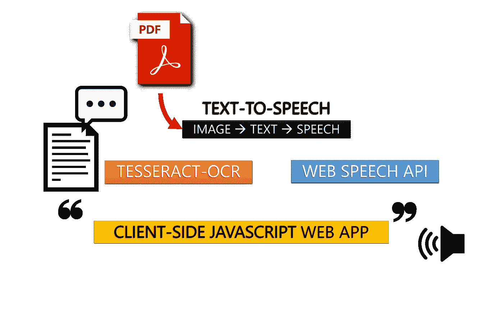
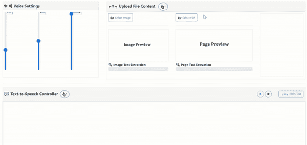
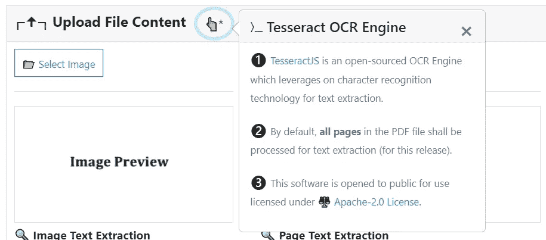
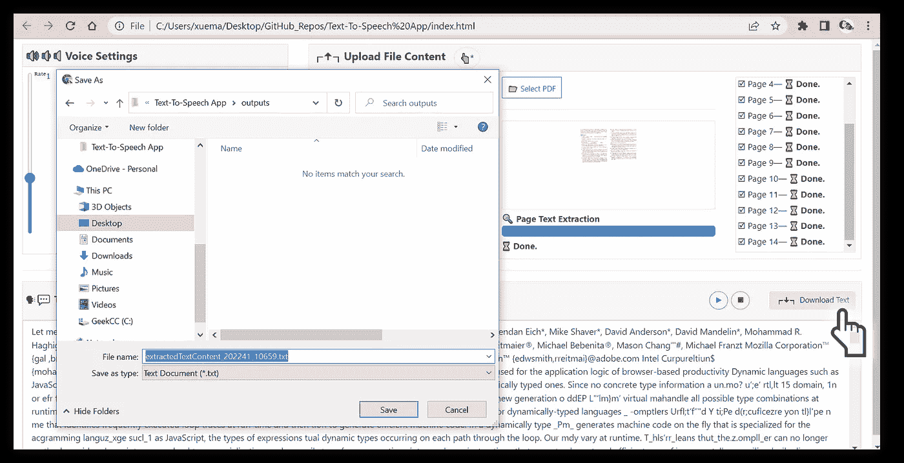

# 使用客户端 JavaScript 通过 Tesseract OCR 构建图像和 PDF 文本提取工具

> 原文：<https://towardsdatascience.com/build-an-image-pdf-text-extraction-tool-with-tesseract-ocr-using-client-side-javascript-6126031001>

## [pdf . js](https://mozilla.github.io/pdf.js/)+[tessera CT . js](https://tesseract.projectnaptha.com/)——OCR&Web 技术的融合。包括完整的代码实现。

大约十年前，光学字符识别(OCR)工具，如 [Tesseract OCR](https://github.com/tesseract-ocr/tesseract/) 引擎，只能通过 C/C+等二进制格式执行，或者打包成包装类，包括 Windows 可执行文件(。exe)、Python 包或 Java 软件开发工具包(JDK)。

随着 Web Assembly ( [WASM](https://webassembly.org/) )编译器的出现，Tesseract OCR 后来被编译成了 JavaScript 插件 [Tesseract.js](https://tesseract.projectnaptha.com/) (衷心感谢同为媒介作家的 [Jerome Wu](https://medium.com/u/8d7beadc096e?source=post_page-----6126031001--------------------------------) )。这反过来通过组合另一个 JavaScript 插件 [PDF.js](https://mozilla.github.io/pdf.js/) 的功能，实现了一个 **PDF 转文本应用**的完整客户端 JavaScript 实现。



作者插图

> *总共有 2 个* ***与 OCR 相关的附带项目*** *作为我对 OCR 实现的自我探索之旅的一部分得以实施。它们如下所示:*

## 第 1 部分:图像到文本

[](https://javascript.plainenglish.io/build-a-text-to-speech-app-using-client-side-javascript-98cd72df73bb)  

## 第二部分:PDF-to-Text✶

✶类似于[第一部分:使用客户端 JavaScript 构建一个文本到语音的应用](https://javascript.plainenglish.io/build-a-text-to-speech-app-using-client-side-javascript-98cd72df73bb)，文本提取的主要原理保持不变。唯一需要的额外中间步骤是**将上传的 PDF 文档页面转换成图像**，这将在后面的实施步骤中详细说明。

## 使用 Tesseract OCR 构建 PDF 转文本应用程序

> *对于该应用，需要实现一个* ***自托管*** *版本的 Tesseract.js v2，以支持* ***离线使用*******可移植*** *。**

***第一步。**检索 Tesseract.js v2 的以下 4 个文件*

*-[tessera CT . min . js](https://raw.githubusercontent.com/incubated-geek-cc/Text-To-Speech-App/main/js/tesseract/tesseract.min.js)
-[worker . min . js](https://raw.githubusercontent.com/incubated-geek-cc/Text-To-Speech-App/main/js/tesseract/worker.min.js)
-[tessera CT-core . wasm . js](https://raw.githubusercontent.com/incubated-geek-cc/Text-To-Speech-App/main/js/tesseract/tesseract-core.wasm.js)
-[eng.traineddata.gz](/incubated-geek-cc/Text-To-Speech-App/blob/main/js/tesseract/lang-data/4.0.0_best/eng.traineddata.gz?raw=true)**

**为简单起见，所有要提取的文本都假定为**英文***

*   *导入插件*

```
*<script src='js/tesseract/tesseract.min.js'></script>*
```

*   *继续将相应的工作属性指定为常量*
*   *将 worker 实例化封装到一个`async function`*

```
*const tesseractWorkerPath='js/tesseract/worker.min.js';
const tesseractLangPath='js/tesseract/lang-data/4.0.0_best';
const tesseractCorePath='js/tesseract/tesseract-core.wasm.js';
var worker;
async function initTesseractWorker() {
  worker = Tesseract.createWorker({
    workerPath: tesseractWorkerPath,
    langPath:  tesseractLangPath,
    corePath: tesseractCorePath
  });    
  await worker.load();
  await worker.loadLanguage('eng');
  await worker.initialize('eng');
  return new Promise((resolve) => resolve('worker initialised.'));
}*
```

***注意:**由于 app 是自托管的，相对路径需要重新定义为本地相对路径。*

***第二步。**检索 [PDF.js](https://mozilla.github.io/pdf.js/) 的以下 2 个文件*

*   *[pdf.min.js](https://raw.githubusercontent.com/incubated-geek-cc/Text-To-Speech-App/main/js/pdf/pdf.min.js)*
*   *[pdf.worker.min.js](https://raw.githubusercontent.com/incubated-geek-cc/Text-To-Speech-App/main/js/pdf/pdf.worker.min.js)*

***注意:** PDF 插件最初是由 Mozilla 开发的，用于通过 JavaScript 渲染 PDF。原始文件可以在[这里](https://github.com/mozilla/pdf.js)找到。*

*在浏览器中导入插件:*

```
*<script src='js/pdf/pdf.min.js'></script>*
```

***第三步。**为 PDF 上传创建用户界面*

*   *HTML 文件输入和 PDF 页码显示*

```
*<input id='uploadPDF' type='file' />
<hr>
Pg <span id='currentPageNo'></span> of <span id='totalPages'></span>*
```

*   *JavaScript 代码片段*

```
*const pdfWorkerPath='js/pdf/pdf.worker.min.js';
const pixelRatio=window.devicePixelRatio*2;
var uploadPDF=document.getElementById('uploadPDF');
var currentPageNo=document.getElementById('currentPageNo');
var totalPages=document.getElementById('totalPages');
var _PDF_DOC, _PAGE, noOfPages, currentPage=1;
var _CANVAS=document.createElement('canvas');
function readFileAsDataURL(file) {
  return new Promise((resolve,reject) => {
    let fileredr = new FileReader();
    fileredr.onload = () => resolve(fileredr.result);
    fileredr.onerror = () => reject(fileredr);
    fileredr.readAsDataURL(file);
  });
}
const loadImage = (url) => new Promise((resolve, reject) => {
  const img = new Image();
  img.addEventListener('load', () => resolve(img));
  img.addEventListener('error', (err) => reject(err));
  img.src = url;
});
uploadPDF.addEventListener('change', function(evt) {
  let file = evt.currentTarget.files[0];
  if(!file) return;
  readFileAsDataURL(file).then((pdf_url) => {
    pdfjsLib.GlobalWorkerOptions.workerSrc=pdfWorkerPath;
    (async () => {
      _PDF_DOC = await pdfjsLib.getDocument({ url: pdf_url });
      noOfPages = _PDF_DOC.numPages;
      totalPages.innerHTML = noOfPages;
      while(currentPage<=noOfPages) {
        await initPdfTesseractWorker();
        currentPageNo.innerHTML=currentPage;
        _PAGE = await _PDF_DOC.getPage(pageNo);
        let pdfOriginalWidth = _PAGE.getViewport(1).width;
        let viewport = _PAGE.getViewport(1);
        let viewpointHeight=viewport.height;
        _CANVAS.width=pdfOriginalWidth*pixelRatio;
        _CANVAS.height=viewpointHeight*pixelRatio;
        _CANVAS['style']['width'] = `${pdfOriginalWidth}px`;
        _CANVAS['style']['height'] = `${viewpointHeight}px`;
        _CANVAS.getContext('2d').scale(pixelRatio, pixelRatio);
        var renderContext = {
          canvasContext: _CANVAS.getContext('2d'),
          viewport: viewport
        };
        await _PAGE.render(renderContext);
        let b64str=_CANVAS.toDataURL();
        let loadedImg = await loadImage(b64str);
        let result=await worker.recognize(loadedImg);
        let extractedData=result.data;

        let wordsArr=extractedData.words;
        let combinedText='';
        for(let w of wordsArr) {
          combinedText+=(w.text)+' ';
        }
        inputTxt.insertAdjacentText('beginend', combinedText);
        await worker.terminate();
        currentPage++;
      }
    })();
  }, false);
});*
```

***解释:***

*   *`pdfjsLib.GlobalWorkerOptions.workerSrc=pdfWorkerPath;`将 PDF 插件的工作路径分配给其全局名称空间*
*   *变量`_CANVAS`是以编程方式创建的，因为 PDF.js 插件将每个页面呈现在一个 HTML 画布元素上*
*   *上传 PDF 文档时，文件以 base64 字符串的形式作为变量`pdf_url`读取，以检索`_PDF_DOC`对象*
*   *编写 while 循环是为了处理上传的 PDF 文档的各个页面。对于呈现在画布元素上的每个页面，图像数据被提取为变量`b64Str`，然后被解析为实用函数`loadImage()`。这将返回一个`Image()`元素，供 Tesseract 的工作人员提取嵌入的文本。*
*   *对于处理的每一页图像，`inputTxt.insertAdjacentText('beginend', combinedText)`将所有提取的文本添加到输入域`inputText`中，直到 PDF 的所有页面都被处理。*

***要点:**在每个 while 循环中，单个页面图像由单个实例化的 worker 处理。因此，对于后续的单个页面，需要再次实例化单个工作人员来提取嵌入的文本内容。*

## *实施预览:*

**

*作者截屏|上传 sample.pdf 文件时，会提取每页的文本，并相应地附加到下面的文本字段。*

## *完整的源代码可以在我的 GitHub repo: [文本到语音转换应用](https://github.com/incubated-geek-cc/Text-To-Speech-App)或者在[演示](https://incubated-geek-cc.github.io/Text-To-Speech-App/)中试用！*

*   *请注意，从**第一部分**添加了额外的功能。它们是:*

**

*作者图片|带**的按钮(👆*)** 可供用户选择，了解更多实施细节*

**

*作者图片|选择**【┏🠋┓下载文本】**使用户能够下载文本字段中所有提取的文本内容*

*非常感谢你坚持到这篇文章的结尾！❤希望这个实现对您有所帮助。*

*如果您对更多 GIS、数据分析和 Web 应用相关的内容感兴趣，请随时[关注我的 Medium](https://medium.com/@geek-cc) 。会非常感激—😀*

*— 🌮[请给我买一份玉米卷🎀˶❛◡❛)](https://www.buymeacoffee.com/geekcc)*

*[](https://geek-cc.medium.com/membership) *