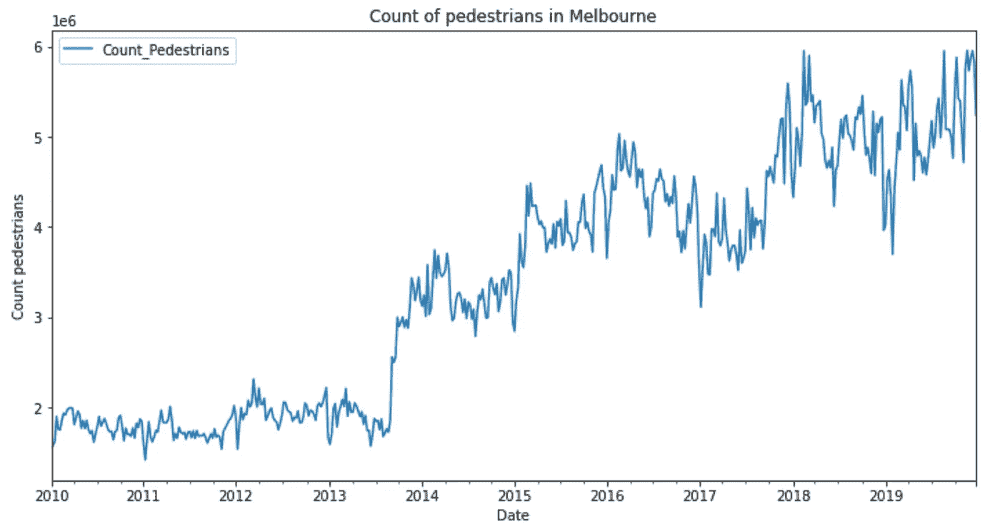
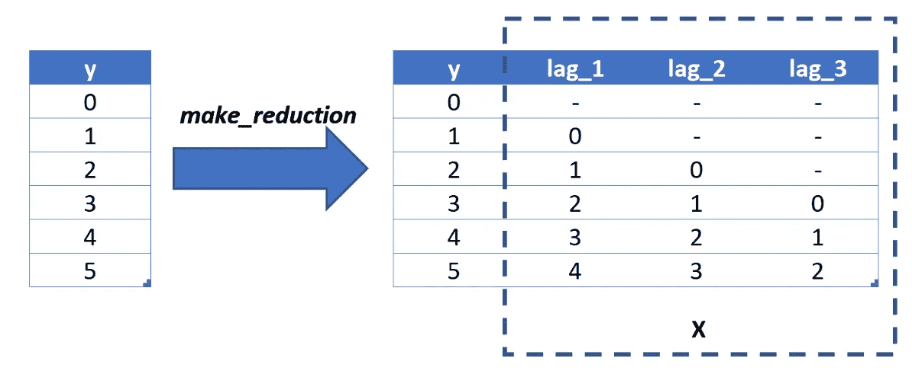
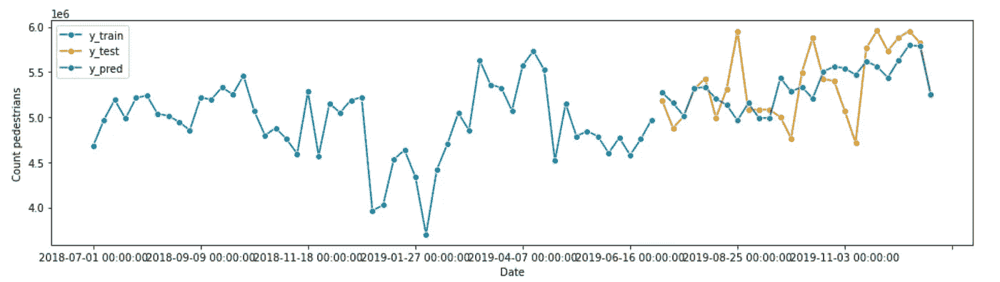
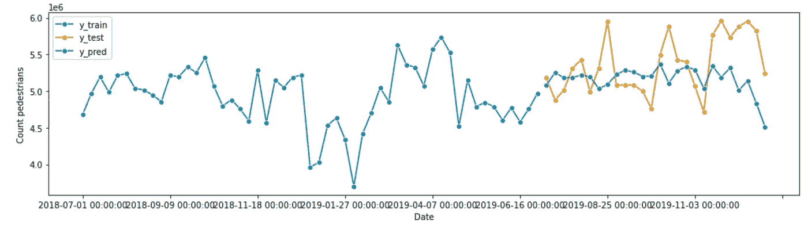
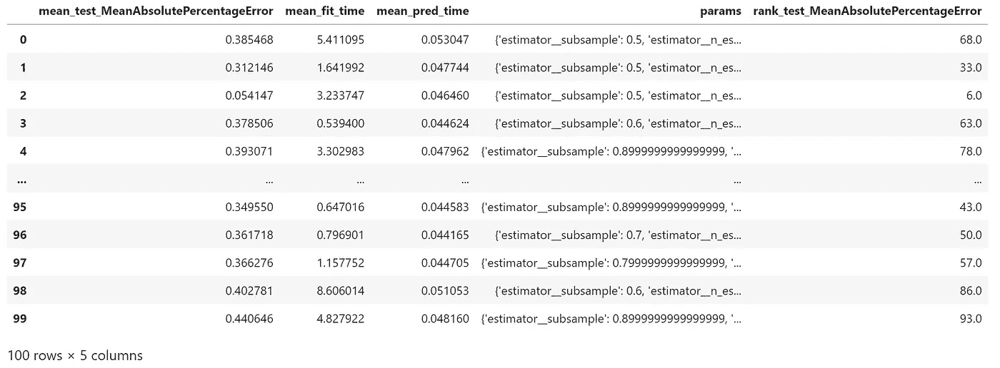
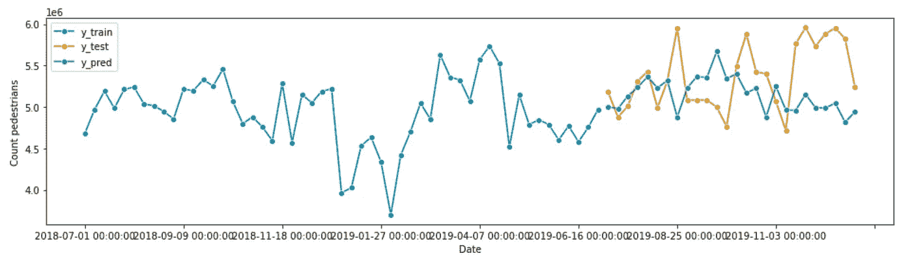
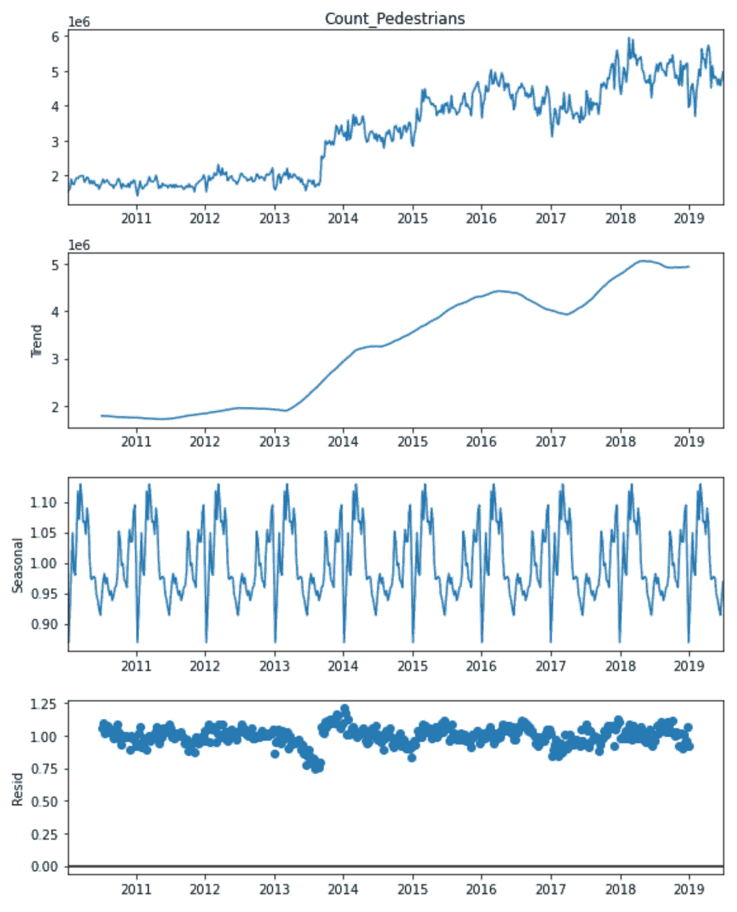
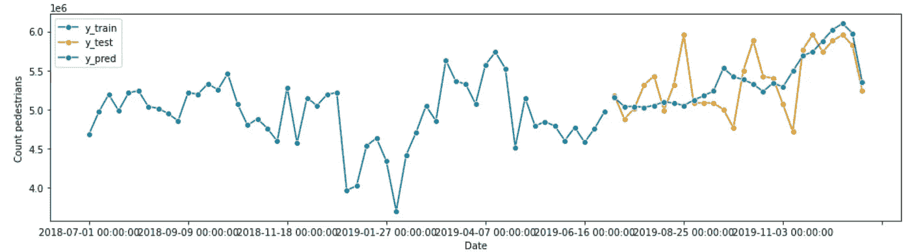

# 用 sktime 构建复杂的时间序列回归管道

> 原文：<https://towardsdatascience.com/build-complex-time-series-regression-pipelines-with-sktime-910bc25c96b6>

## 如何通过 sktime 使用 scikit-learn 和 XGBoost 模型预测


马库斯·温克勒在 [Unsplash](https://unsplash.com?utm_source=medium&utm_medium=referral) 上的照片

停止使用 *scikit-learn* 进行预测。您可以使用现有的回归管道并不意味着您应该这样做。或者，你不厌倦使用同样的老技术，如指数平滑和 ARIMA 预测吗？用更高级的算法比如梯度提升树不是更好玩吗？

使用 *sktime* ，你可以做到这一点(以及更多)。 *Sktime* 是一个库，可以让你安全地使用任何 *scikit-learn* 兼容的回归模型进行时间序列预测。本教程将讨论如何使用 *sktime* 将时间序列预测问题转化为回归问题。我还将向您展示如何用流行的库 *XGBoost* 构建一个复杂的时间序列预测器。

# 背景和动机

## 什么是时间序列预测？

时间序列预测是一种预测一个或多个未来值的技术。像回归建模一样，数据从业者可以基于历史数据拟合模型，并使用该模型预测未来的观察结果。

预测中使用的一些最流行的模型是单变量模型。单变量模型仅使用以前的观测值进行预测。[指数平滑](https://otexts.com/fpp2/expsmooth.html)模型使用过去观察值的加权平均值来预测未来值，最近的数据点被赋予更大的权重。 [ARIMA](https://otexts.com/fpp2/arima.html) 模型基于数据中的[自相关](https://otexts.com/fpp2/autocorrelation.html)进行预测。自相关测量时间序列的时移(即滞后)值之间的关系。

如果时间序列预测听起来类似于回归建模，那么你是正确的。我们可以使用回归模型进行时间序列预测。

## 为什么我们要使用回归进行时间序列预测？

您应该使用回归模型的原因之一是为了提高模型性能。回归技术是灵活的，你可以超越过去观察的单变量模型。包含时间步长要素(如星期几或节假日)可以丰富您的数据，并有可能发现数据中隐藏的趋势。

其次，你可能已经使用了流行的机器学习框架，比如 *scikit-learn* 和 *XGBoost* 。如果您已经熟悉这些库，将时间序列预测任务转换为回归问题可以节省您的时间。

然而，现代预测库，如脸书的 [*预言家*](https://facebook.github.io/prophet/) ，也提供了多变量分析的灵活性和简单的 API。尽管如此，使用回归技术进行预测应该是您的数据科学工具包中的另一个工具。

## 在时间序列回归中，我们需要注意什么？

时间序列回归并非没有问题。自相关观测违反了线性回归模型的假设。然而，更复杂的回归模型，如梯度树提升，通常对多重共线性具有鲁棒性。

此外，如果我们盲目地拟合和调整我们的回归模型，我们可能会引入数据泄漏。[数据泄漏](/avoiding-data-leakage-in-timeseries-101-25ea13fcb15f)是指在模型训练和验证阶段使用的信息，否则这些信息将无法用于预测。例如，使用 K-fold 交叉验证对数据进行随机洗牌可以让你的模型预测未来。相反，你应该使用[时态交叉验证](/dont-use-k-fold-validation-for-time-series-forecasting-30b724aaea64)。

您可以使用 [*sktime*](https://www.sktime.org/en/stable/) 框架，而不是从头开始实现时间序列回归模型。

## 为什么要用 sktime？

[*Sktime*](https://www.sktime.org/en/stable/) 是一个开源的框架，用于对时间序列进行建模的各种机器学习任务，包括时间序列回归、分类、聚类和标注。该框架结合了几个库的特性，用户体验类似于 *scikit-learn* 。

我们将使用 *sktime* 完成预测任务，因为它提供了[功能](https://www.sktime.org/en/stable/examples/01_forecasting.html#3.-Advanced-composition-patterns---pipelines,-reduction,-autoML,-and-more)，例如:

*   **归约**:使用与 *scikit-learn* API 兼容的估计器构建时间序列预测器
*   **调整**:使用带有时间交叉验证的网格搜索策略确定超参数的值
*   **评估** : *sktime* 包括几个性能指标(如 MAPE、梅斯)，并为定制评分器和回溯测试提供了一个简单的实现
*   **流水线:**是 *scikit-learn* [*流水线*](https://scikit-learn.org/stable/modules/generated/sklearn.pipeline.Pipeline.html) 的扩展，它是一系列级联的转换器，用来构建一个预测器
*   **AutoML** :自动调整策略，在一系列模型和超参数中确定最佳预测器

*Sktime* 还提供了[其他几类](https://www.sktime.org/en/stable/examples/01_forecasting.html#2.-Forecasters-in-sktime---lookup,-properties,-main-families)预测模型，包括指数平滑、ARIMA、BATS 和 Prophet。我们不会在本教程中讨论这些预测模型，但我鼓励您在模型选择阶段实现这些预测器。

# 代码示例

## 资料组

我们将在本教程中使用的数据集是澳大利亚墨尔本[1]每小时的行人计数。我们将我们的分析限制在 2010 年 1 月 1 日至 2019 年 12 月 31 日。我每周都汇总数据。

如果我们可视化我们的数据，我们可以看到大约从 2013 年年中开始的总体上升趋势。我们还可以在 12 月份看到更多的行人，可能是因为圣诞购物，在 7 月份是因为财政年度末的销售。我们的数据看起来是不稳定的，当我们运行一个扩展的 Dickey-Fuller 测试时得到了证实。



作者图片

## 线性回归的简单预测器

我们将运行的第一个示例是一个使用线性回归的简单预测器。我们先用 *sktime 的*[*temporal _ train _ test _ split*](http://temporal_train_test_split)把最后 26 周的数据作为我们的测试集。该函数不会打乱数据。因此，它适用于预测。

```
from sktime.forecasting.model_selection import temporal_train_test_splity_train, y_test = temporal_train_test_split(y, test_size=26)
```

我们还指定了我们的预测范围，即我们将预测的 26 周的测试数据。我们使用 [*预测地平线*](https://www.sktime.org/en/stable/api_reference/auto_generated/sktime.forecasting.base.ForecastingHorizon.html) 对象来实现这一点。

```
from sktime.forecasting.base import ForecastingHorizonfh = ForecastingHorizon(y_test.index, is_relative=False)
```

准备工作完成后，我们可以继续实例化我们的*scikit-learn*[*linear regression*](https://scikit-learn.org/stable/modules/generated/sklearn.linear_model.LinearRegression.html)对象，它将成为我们预测器的估计器。或者，您可以使用其他 *scikit-learn* 估算器或 *scikit-learn* API 兼容估算器，例如 *XGBoost* 。我将在下面的例子中演示这一点。

```
from sklearn.linear_model import LinearRegressionregressor = LinearRegression()
```

*Sktime 的*[*make _ reduction*](https://www.sktime.org/en/stable/api_reference/auto_generated/sktime.forecasting.compose.make_reduction.html?highlight=make_reduction)函数将时间序列转换成与我们的 *scikit-learn* 估计器兼容的表格数据。参数“window_length”控制滑动窗口变换中的滞后数。

考虑下面这个简单的时间序列，用*【y】*表示。如果我们应用我们的 *make_reduction* 函数，在窗口长度等于 3 的情况下，我们生成一个具有三个输入变量的表格数据集，分别表示为*‘lag _ 1*’、*‘lag _ 2*’和*‘lag _ 3*。该函数将一维时间序列数据集转换为与回归估计器兼容的格式。



作者图片

此外， *make_reduction* 函数有一个输入“策略”，它控制预测器如何生成其预测。当我们进行不止一步的预测时，该参数是相关的。在我们的例子中，我们预测未来 26 周的行人数量(多步)，而不仅仅是下一周(一步)。

我们的多步预测策略有三个选项可供选择:

*   **直接**:我们为我们预测的每个时期创建一个单独的模型。在我们的例子中，我们拟合了 26 个模型，每个模型进行一次预测。
*   **递归**:我们拟合单个一步先行模型。然而，我们使用前一个时间步的输出作为后面的输入。例如，我们使用下周的预测作为两周后预测的输入，等等。
*   **多输出**:一个模型用于在一次预测中预测整个时间序列范围。此选项的使用取决于是否有一个能够预测序列的模型。

在我们的例子中，我们将使用递归策略。

```
from sktime.forecasting.compose import make_reductionforecaster = make_reduction(regressor, window_length=52, strategy="recursive")
```

我们现在可以拟合我们的线性回归预测器，并根据我们的测试数据预测 26 周的行人数量。

```
forecaster.fit(y_train)
y_pred = forecaster.predict(fh)
```

然后，我们相对于训练和测试数据绘制我们的预测，以确定模型的适用性。 *Sktime* 使用 [*plot_series*](https://www.sktime.org/en/stable/api_reference/auto_generated/sktime.utils.plotting.plot_series.html?highlight=plot_series) 实用函数使这变得简单。

```
from sktime.utils.plotting import plot_seriesplot_series(y_train['2018-07-01':], y_test, y_pred, labels=["y_train", "y_test", "y_pred"], x_label='Date', y_label='Count pedestrians');
```



作者图片

我们的线性回归预测器似乎给了我们一个合理的拟合。然而，这是一个保守的预测，错过了测试数据的波峰和波谷。

我们使用[*mean _ absolute _ percentage _ error*](https://www.sktime.org/en/stable/api_reference/auto_generated/sktime.performance_metrics.forecasting.mean_absolute_percentage_error.html)*(MAPE)*来评估我们的模型，结果为 4.8%。**

```
**from sktime.performance_metrics.forecasting import mean_absolute_percentage_errorprint('MAPE: %.4f' % mean_absolute_percentage_error(y_test, y_pred, symmetric=False))**
```

**如果我们把所有这些放在一起，我们的代码看起来像这样:**

**让我们看看是否可以使用更复杂的算法，比如 *XGBoost* ，来解决这个问题。**

## **使用 XGBoost *和外部输入*进行时间序列预测**

**[*XGBoost*](https://xgboost.readthedocs.io/en/stable/) 是一个梯度推进机器的实现，因其速度和性能而流行于表格机器学习任务。我们可以使用 *XGBoost* 进行时间序列预测，因为它有一个与 *sktime 的* *make_reduction* 函数兼容的 [*scikit-learn* 包装器](https://xgboost.readthedocs.io/en/stable/python/python_api.html#module-xgboost.sklearn)。**

```
**from xgboost import XGBRegressorregressor = XGBRegressor(objective='reg:squarederror', random_state=42)
forecaster = make_reduction(regressor, window_length=52, strategy="recursive")**
```

**我们还将包括外生数据，这是另一个有助于预测的时间序列。让我们包括几个虚拟变量来表示一年中的月份，分成我们的训练集和测试集。**

```
**# Create an exogenous dataframe indicating the month
X = pd.DataFrame({'month': y.index.month}, index=y.index)
X = pd.get_dummies(X.astype(str), drop_first=True)# Split into train and test
X_train, X_test = temporal_train_test_split(X, test_size=26)**
```

**当我们调用 fit 和 predict 方法时，我们包括了外部数据。您可以在[*recursivetabularregressionpredictor*](https://www.sktime.org/en/stable/api_reference/auto_generated/sktime.forecasting.compose.RecursiveTabularRegressionForecaster.html#sktime.forecasting.compose.RecursiveTabularRegressionForecaster.fit)文档中找到更多信息。**

```
**forecaster.fit(y=y_train, X=X_train)
y_pred = forecaster.predict(fh=fh, X=X_test)**
```

**从视觉上看，我们的预测似乎比我们的线性回归预测更差。当我们看看 MAPE 时，我们的预期得到了证实，该国经济增长率已升至 7.1%。因为我们使用了默认的超参数值，所以 *XGBoost* 预测器可能是欠拟合的。**

**下面的例子将演示我们如何为我们的 *XGBoost* 预测器调整超参数。**

****

**作者图片**

**您可以在下面找到这个例子的代码。**

## **调整我们预测器的超参数**

**我们的 [*XGBRegressor*](https://xgboost.readthedocs.io/en/stable/python/python_api.html#module-xgboost.sklearn) 有几个我们可以调优的超参数，如这篇[文章](/xgboost-fine-tune-and-optimize-your-model-23d996fab663)中所述。我们希望调整预测器的超参数，看看是否可以改善性能。**

**在调整超参数之前，我们必须向数据中添加一个验证集。我们有几个由 *sktime* 实现的策略，包括一个[*single window splitter*](https://www.sktime.org/en/stable/api_reference/auto_generated/sktime.forecasting.model_selection.SingleWindowSplitter.html)、[*sliding window splitter*](https://www.sktime.org/en/stable/api_reference/auto_generated/sktime.forecasting.model_selection.SlidingWindowSplitter.html)和[*expanding window splitter*](https://www.sktime.org/en/stable/api_reference/auto_generated/sktime.forecasting.model_selection.ExpandingWindowSplitter.html)。为了简单起见，我们将创建一个单一的验证集，其大小与我们的测试集相同。然而，这篇[文章](/dont-use-k-fold-validation-for-time-series-forecasting-30b724aaea64)解释了各种策略之间的差异。**

```
**from sktime.forecasting.model_selection import SingleWindowSplittervalidation_size = 26
cv = SingleWindowSplitter(window_length=len(y)-validation_size, fh=validation_size)**
```

***Sktime* 实现了两种超参数调优策略:[随机搜索](https://www.sktime.org/en/stable/api_reference/auto_generated/sktime.forecasting.model_selection.ForecastingRandomizedSearchCV.html)和[网格搜索](https://www.sktime.org/en/stable/api_reference/auto_generated/sktime.forecasting.model_selection.ForecastingGridSearchCV.html)。我们将使用 100 次迭代的随机搜索。**

```
**from sktime.forecasting.model_selection import ForecastingRandomizedSearchCVparam_grid = {
    'estimator__max_depth': [3, 5, 6, 10, 15, 20],
    'estimator__learning_rate': [0.01, 0.1, 0.2, 0.3],
    'estimator__subsample': np.arange(0.5, 1.0, 0.1),
    'estimator__colsample_bytree': np.arange(0.4, 1.0, 0.1),
    'estimator__colsample_bylevel': np.arange(0.4, 1.0, 0.1),
    'estimator__n_estimators': [100, 500, 1000]
}regressor = XGBRegressor(objective='reg:squarederror', random_state=42)
forecaster = make_reduction(regressor, window_length=52, strategy="recursive")gscv = ForecastingRandomizedSearchCV(forecaster, cv=cv, param_distributions=param_grid, n_iter=100, random_state=42)**
```

**同样，我们适应并预测。**

```
**gscv.fit(y=y_train, X=X_train)
y_pred = gscv.predict(fh=fh, X=X_test)**
```

**但是这一次，我们可以检查我们的随机搜索对象，看看预测器如何使用超参数的不同组合来执行。**

```
**gscv.cv_results_**
```

****

**作者图片**

**有趣的是，我们的预测者在我们的测试数据上表现更差，正如我们的可视化和 MAPE 增加到 7.8%所示。**

****

**作者图片**

**您可以在下面的示例中找到完整的代码。**

## **向我们的预测渠道添加组件**

**我们以前在非平稳数据上训练我们的模型，导致预测不佳。使用 [*statsmodels*](https://www.statsmodels.org/dev/generated/statsmodels.tsa.seasonal.seasonal_decompose.html) ，我们可以分解我们的行人时间序列来观察趋势和季节性。**

```
**from statsmodels.tsa.seasonal import seasonal_decomposeresult = seasonal_decompose(y_train, model='multiplicative')
result.plot()
plt.show()**
```

**我们假设我们的时间序列是乘法的，而不是加法的，因为我们的时间序列的振荡幅度似乎随着时间的推移而增加。查看下面的分解图，我们看到我们的趋势(第二个子曲线)自 2013 年年中以来有所增加，并且有一个季节性模式，圣诞节和年中行人流量增加，而 1 月的第一周流量减少。**

****

**作者图片**

**因此，我们的预测者的表现可以通过去除时间序列的季节性和趋势性，产生一个更接近平稳的时间序列来提高。 *Sktime* 包括两个类， [*去季节器*](https://www.sktime.org/en/stable/api_reference/auto_generated/sktime.transformations.series.detrend.Deseasonalizer.html?highlight=deseasonalizer) 和 [*去渲染*](https://www.sktime.org/en/stable/api_reference/auto_generated/sktime.transformations.series.detrend.Detrender.html) *，*，我们可以将它们纳入我们的预测管道。**

```
**from sktime.forecasting.compose import TransformedTargetForecaster
from sktime.transformations.series.detrend import Deseasonalizer, Detrender
from sktime.forecasting.trend import PolynomialTrendForecasterregressor = XGBRegressor(objective='reg:squarederror', random_state=42)forecaster = TransformedTargetForecaster(
    [
        ("deseasonalize", Deseasonalizer(model="multiplicative", sp=52)),
        ("detrend", Detrender(forecaster=PolynomialTrendForecaster(degree=1))),
        ("forecast", make_reduction(regressor, window_length=52, strategy="recursive"),
        ),
    ]
)**
```

**我们可以使用随机网格搜索来调整*去季节化器*和*去渲染*的参数。例如，我们可以看到加法或乘法模型是否是最好的，或者我们希望使用什么次数的多项式来模拟趋势。**

```
**param_grid = {
    'deseasonalize__model': ['multiplicative', 'additive'],
    'detrend__forecaster__degree': [1, 2, 3],
    'forecast__estimator__max_depth': [3, 5, 6, 10, 15, 20],
    'forecast__estimator__learning_rate': [0.01, 0.1, 0.2, 0.3],
    'forecast__estimator__subsample': np.arange(0.5, 1.0, 0.1),
    'forecast__estimator__colsample_bytree': np.arange(0.4, 1.0, 0.1),
    'forecast__estimator__colsample_bylevel': np.arange(0.4, 1.0, 0.1),
    'forecast__estimator__n_estimators': [100, 500, 1000]
}gscv = ForecastingRandomizedSearchCV(forecaster, cv=cv, param_distributions=param_grid, n_iter=100, random_state=42) gscv.fit(y=y_train, X=X_train)
y_pred = gscv.predict(fh=fh, X=X_test)**
```

**调整我们的预测管道后，我们可以可视化我们的预测。我们观察到我们的预测更接近我们的趋势数据，这表明从我们的时间序列中去除季节性和趋势提高了我们模型的性能。MAPE 降至 4.7%，是我们测试的所有车型中表现最好的。**

****

**作者图片**

**下面是这个例子的完整代码。**

**Sktime 是一个多功能的库，可以让你使用与 scikit-learn 兼容的回归模型进行时间序列预测。您可以构建复杂的多步管道，甚至可以与最先进的预测算法相媲美。下次你做预测项目时，不要只使用 ARIMA。试一试。**

**喜欢你读的书吗？跟着我上[媒](https://medium.com/@rtkilian)。否则，[发微博给我](https://twitter.com/rtkilian)或者在 [LinkedIn](https://www.linkedin.com/in/rtkilian/) 上加我。**

**你可以在 [GitHub](https://github.com/rtkilian/data-science-blogging/blob/main/sktime_regression_forecasting.ipynb) 上找到这篇文章中用到的所有代码。**

**[1]墨尔本市，[行人计数系统—每月(每小时计数)](https://data.melbourne.vic.gov.au/Transport/Pedestrian-Counting-System-Monthly-counts-per-hour/b2ak-trbp) (2022)，墨尔本市公开数据，根据知识共享署名 3.0 澳大利亚发布(CC BY 3.0 AU)**