# 为 Jupyter 笔记本构建 Docker 映像，并在 Cloud 的 VertexAI 上运行

> 原文：<https://towardsdatascience.com/build-docker-image-for-jupyter-notebook-and-run-on-clouds-vertexai-9bd97c48c52d>

## 使用 Docker、Bash、Scheduler、Pub/Sub 和 Function 在 Google 云平台中自动运行任何 Python 脚本


用码头集装箱装运你的应用程序

您是否已经成功地在本地编写了一个 Python 应用程序，现在想要将其带到云中？这是一个简单易懂的详尽的一步一步的教程，讲述了如何将 Python 脚本转换成 Docker 映像并将其推送到 Google Cloud Registry。在 Google 云平台中，可以通过 Pub/Sub 在 VertexAI 中自动调用这个 Docker 镜像。本教程是在 Windows 计算机上创建的，但是对于 Linux 或 Mac，基本步骤是相同的。在本文的最后，您将能够在您的操作系统上创建自己的 Docker 映像，并在 VertexAI 中自动触发 Python 脚本。

你将经历什么:

*   安装“Docker 桌面”
*   Docker 映像和容器:构建、标记、运行和推送到 GCloud
*   通过 Bash、Scheduler、Pub/Sub 和 Function 自动运行 GCloud 的 VertexAI 中的任何 Python 脚本

# 初期状况

此目录结构中有以下文件:


Sourcecode 文件夹包含 Jupyter 笔记本“dockerVertexai”和“input.csv”文件:


Jupyter 笔记本本身只是一个很小的 Python 应用程序:

```
import pandas as pd
df=pd.read_csv('input.csv')
df['Output'] ='Now With Output added'
df.to_csv('output.csv')
```

这个脚本所做的只是导入一个名为“input”的 csv 文件:

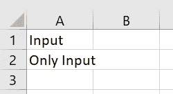

..向该数据帧添加新列“Output”，并将结果导出为新文件“output.csv”:

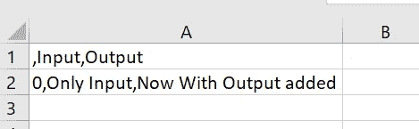

尽管这可能不是世界上最令人印象深刻的脚本，但它对您以后在 VertexAI 中轻松确认功能非常有用。此外，希望这个脚本为常见的“hello world Flask Docker”示例提供一个有用的扩展。尽管这个脚本非常简单，但它向您展示了如何不仅使用源代码文件，而且还使用 cloud 的 notebook 实例中的其他输入输出文件。有了这些知识，在云中使用 Python 就没有任何限制。

# 准备 **:**

如果还没有，您需要在开始构建 Docker 映像之前下载 Docker Desktop:

[](https://www.docker.com/products/docker-desktop/) [## Docker 桌面

### 安装 Docker 桌面-最快的容器化应用程序的方式。Docker 订阅服务协议有…

www.docker.com](https://www.docker.com/products/docker-desktop/) 

一旦下载了(在本例中是 Windows)版本，您只需打开应用程序即可启动 Docker Desktop:

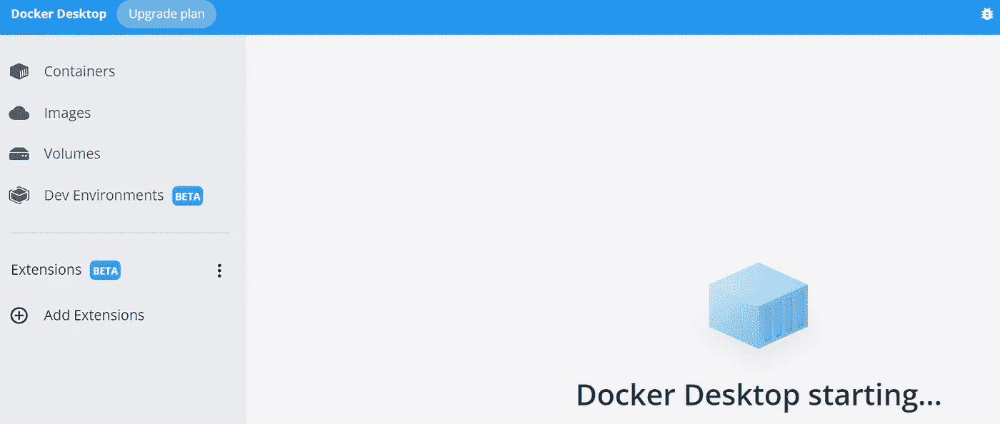

等待 Docker 桌面启动(图片由作者提供)

对于我们的目的，我们不需要做任何事情，只是启动 Docker 桌面。

下一个准备步骤是 Dockerfile 文件。

# Dockerfile 文件

先看看 docker 文件:

```
FROM gcr.io/deeplearning-platform-release/base-cpu:latest

# RUN pip install torch # you can pip install any needed package like this

RUN mkdir -p /Sourcecode 

COPY /Sourcecode /Sourcecode 
```

Dockerfile 定义稍后运行实例时将使用哪个 vm(虚拟机)映像。在这种情况下，你可以选择深度学习-平台-发布。

如果需要任何额外的 Python 包，也可以在这里安装 pip(例如，运行 pip install python-dotenv)。因为您将只使用 Pandas(它已经随 deeplearning-platform-release 一起提供)，所以没有必要 pip 安装它。

一旦实例稍后启动并运行，命令“run mkdir -p /Sourcecode”将创建一个新文件夹“Sourcecode”。

dockerfile 中的最后一个命令将把所有文件从 Sourcecode 文件夹(这是您本地机器上的路径中的文件夹，稍后您将从这里构建 docker 映像)复制到正在运行的实例中新创建的 Sourcecode 文件夹中(您将在几个步骤中再次看到这一点)。

# Dockerignore

此外，您还可以选择存储一个 Dockerignore 文件。这是为了排除执行 Python 代码不需要的包。这样做的目的是使图像尽可能小，而不是构建不必要的包。

```
__pycache__
Sourcecode/temp
```

Dockerignore 与本教程的后续步骤无关。

要构建 Docker 映像，您还可以使用 Requirement.txt 文件。在本文中，您不会使用这种方法，但是如果您感兴趣的话，您可能想阅读这篇文章(链接)。

作为最后的准备(在开始 Docker 构建之前)，您需要在 Google 云平台中部署一个项目。

# 谷歌云项目

我想你已经是这样了。如果你不知道怎么做，你可能会发现这是一个有用的[链接](https://cloud.google.com/appengine/docs/standard/nodejs/building-app/deploying-web-service)。

*在这一点上，我的建议是复制 ProjectId，因为在本教程中你会多次用到它。本例中 GCP 的项目 ID 是:social sensition-XYZ*

# 命令行界面(CLI)

gcloud (Google Cloud)命令行界面是创建和管理 Google Cloud 资源的主要 CLI 工具。CLI 工具从命令行以及脚本和其他自动化中执行许多常见的平台任务。如果你还没有下载 CLI，你可以在这里找到说明[。](https://cloud.google.com/sdk/docs/install)

您将首先初始化一个配置，以便能够在命令行中使用您的 Google Cloud 项目:

```
gcloud init
```

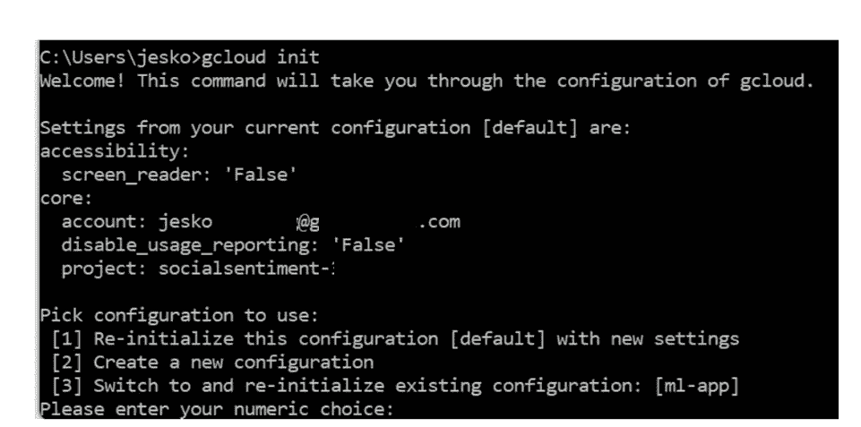

使用您现有的帐户登记:


..最后选择合适的项目编号(如果有的话)。

# 为项目启用工件注册

默认情况下，工件注册对于新项目是不可用的。所以必须先启用它(否则无法发布到 GCloud Artifact Registry)。

要启用工件注册，请执行以下命令:

```
gcloud services enable artifactregistry.googleapis.com
```

并添加一个存储库主机名列表，如 europe-west3-docker.pkg.dev:

```
gcloud auth configure-docker europe-west3-docker.pkg.dev
```

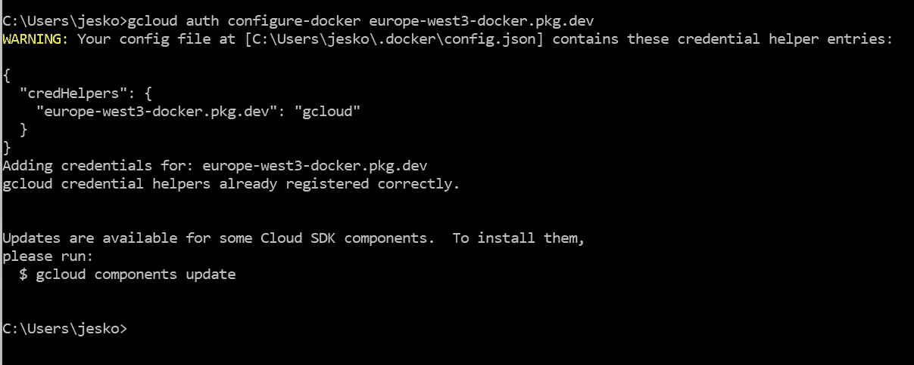

很好，您已经完成了所有准备工作，所以您终于可以开始构建 Docker 了。

# Docker 映像构建

在您的终端中，移动到存储本地文件的文件夹，并输入:

```
docker build --tag python-docker .
```

请注意圆点前的空格。

如果你收到一个错误信息，如“Docker 守护进程没有运行”，这可能是因为你忘记启动 Docker 桌面应用程序。只需启动 Docker-Desktop(就像开头提到的那样)，然后重新运行 docker build 命令。

大楼后..：

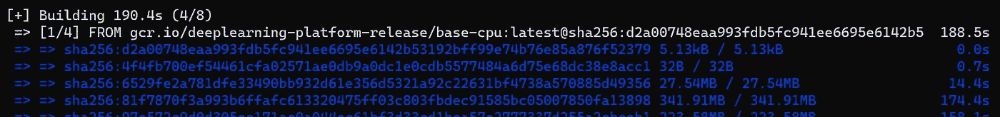

..已完成:

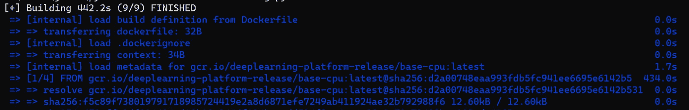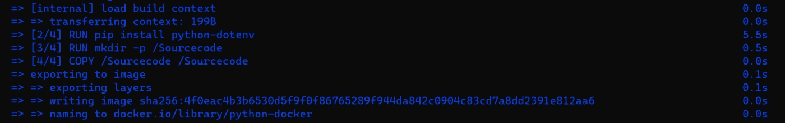

如果您没有在 docker 文件中添加命令，将不会有“运行 pip 安装”命令

..Docker 映像已经启动并运行。您还可以通过查看 Docker 桌面应用程序获得额外的保证:

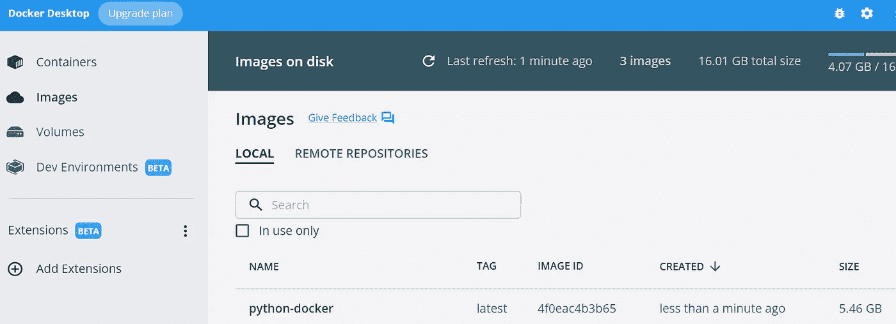

或者您也可以在您的终端中交叉检查:

```
docker images
```

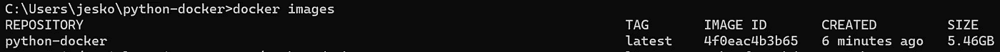

您将需要在下一步中标记 ImageID(按作者标记图像)

# Docker 图像标签

从上面的 Docker images 命令中复制并粘贴 ImageID，并将其用作 Docker 标签。其次，您需要为您的 Google Cloud 项目复制路径。这包括 Google Cloud 的项目 ID(*social senement-XYZ*)和存储库(工件设置中的名称):

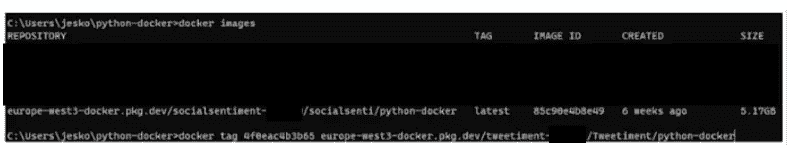

用你的项目 id(图片由作者提供)替换*社会感知空白(社会感知-XYZ)*

# 码头运行

尽管这一步与我们没有进一步的关联，但为了完整起见，还是简单地提一下。

只需使用 run 将您的映像作为容器运行:

```
docker run python-docker
```

# 工件储存库

很抱歉，在这一点上还有另一个交叉引用。但到目前为止，我们还没有在 GCloud 平台中创建工件库。但是在你推广 Docker 形象之前，这是非常重要的。幸好这是儿戏:

您必须创建一个存储库来上传工件。在您的案例 Docker 中，每个存储库可以包含受支持格式的工件。

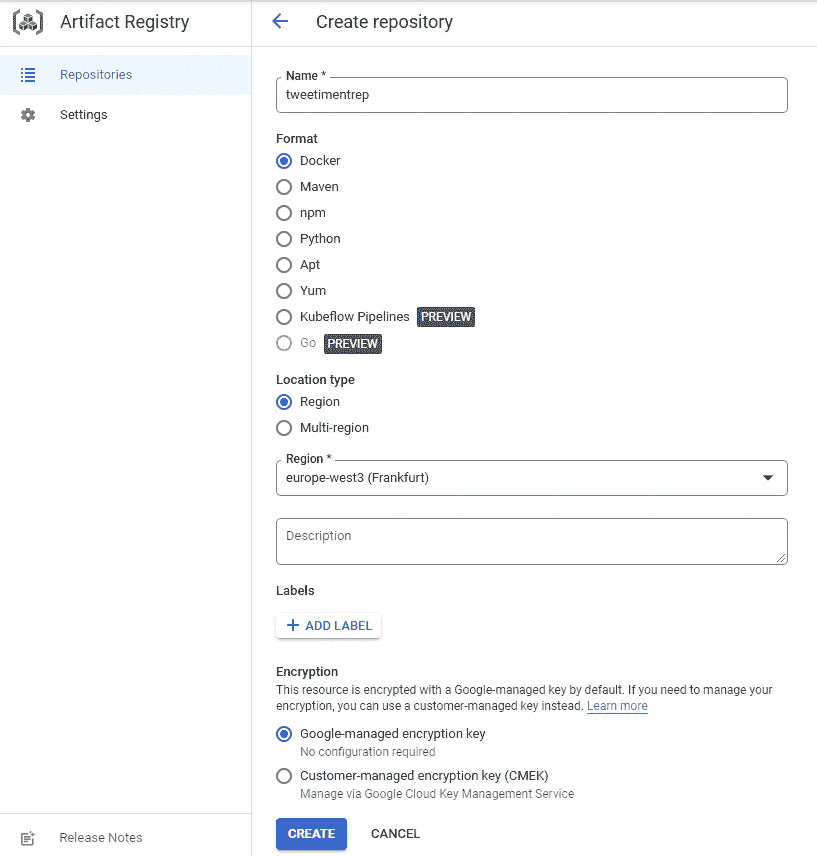

我将这个存储库称为“tweetimentrep”(图片由作者提供)

选择一个适合自己的地区。对我来说，那就是法兰克福:

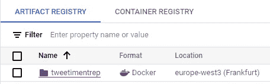

谷歌推荐工件而不是容器注册表，这就是我们选择它们的原因

注意:在继续之前，请确保您确实已经在您的 GCloud 工件中创建了一个存储库名称:

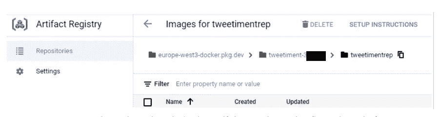

如果存储库存在，您只能标记 python-docker 图像(按作者分类的图像)

*很抱歉出现不一致:当下面提到 tweetiment-xyz 时，指的是同一个项目 social sensition-XYZ。*

# Docker 图像标签

现在继续并相应地标记您的设置:

```
docker tag 4f0eac4b3b65 europe-west3-docker.pkg.dev/tweetiment-xyz/tweetimentrep/python-docker
```

这就是你标记 Docker 图像的简单方式。

现在您已经标记了 Docker 图像，您可以将它推入 GCP 的注册表中:

```
docker push europe-west3-docker.pkg.dev/tweetiment-xyz/tweetimentrep/python-docker
```

如果您收到类似以下内容的消息:

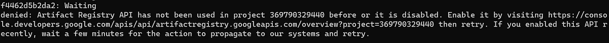

..这仅仅意味着您必须激活工件注册 API(并且不要忘记给它一个存储库名称，否则您将不能正确地标记和推送您的 Docker 映像)。

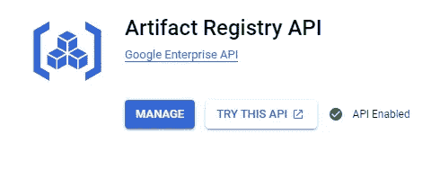

以可伸缩和集成的方式存储和管理工件(作者图片)

现在，您可以重新运行 push 命令。如果 API 仍然没有激活，只需等待几分钟，直到它激活。

推送准备就绪后:

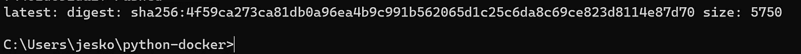

您将能够在您的工件注册表中看到它:

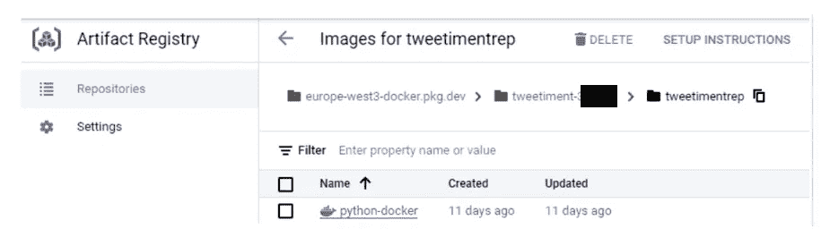

很好，您已经将 Python 代码及其文件夹结构和内容作为 Docker 映像传输到 Google Cloud 了！这意味着你可以在谷歌云中创建一个笔记本，在那里你可以手动运行 Jupyter 笔记本(或者 Python。py 代码)。

# 韦尔泰赛

了解如何手动创建笔记本实例是很有帮助的。如果不知道如何，这个链接应该是[支持](https://cloud.google.com/vertex-ai/docs/tutorials/jupyter-notebooks)。但是学习如何自动运行这样的实例更令人兴奋。要做到这一点，首先看一下一旦创建了实例，如何在 VertexAI 实例中自动运行 Python 脚本。为此，使用一个 bash 脚本(一个. sh 文件)。

# Bash 脚本

```
#!/bin/bash
# copy sourcode files from docker container to vm directory
sudo docker cp -a payload-container:/Sourcecode/ /home/jupyter
sudo -i
cd /home/jupyter/Sourcecode
# Execute notebook
ipython -c “%run dockerVertexai.ipynb”
```

现在将 startup script.sh 上传到您的云存储桶中:

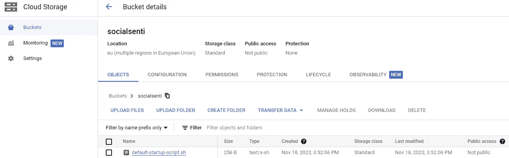

云存储是一种托管服务，用于存储(非)结构化数据(图片由作者提供)

转到 VertexAI 并激活 VertexAI API 和笔记本 API(如果还没有激活的话)。

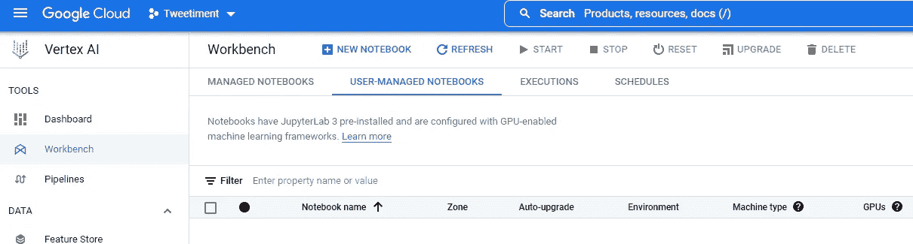

在工作台中，单击“新笔记本”，并从顶部选择“定制”作为第一个选项:

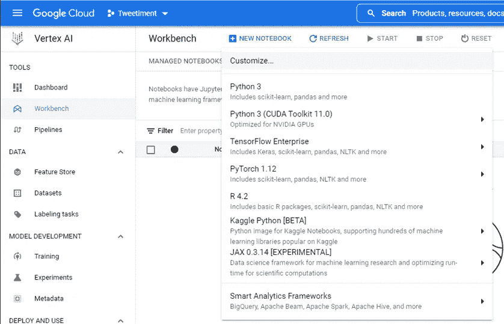

在下一个表单中，从工件注册表中选择您的容器映像。

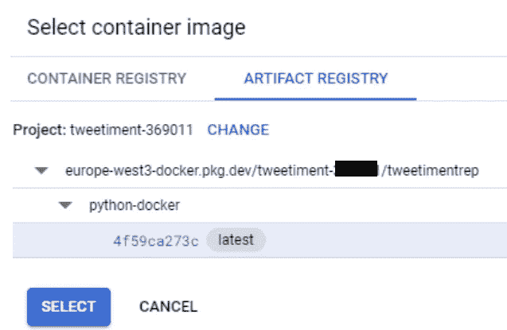

通常你会选择最常用的版本(图片由作者提供)

另外，不要忘记选择一个脚本在创建后运行。这将是你。sh 文件，这是您几分钟前刚刚保存在存储桶中的文件:

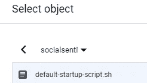

现在你可以走了:

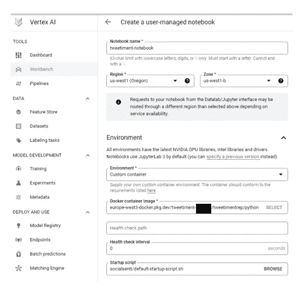

现在，您已经准备好创建 Jupyter 实验室，它还支持 Jupyter 笔记本(图片由作者提供)

多亏了启动脚本，Jupyter 笔记本在 Jupyter 实验室实例启动时被自动执行。因为存在 output.csv(以前不存在)，所以您可以确保脚本运行:

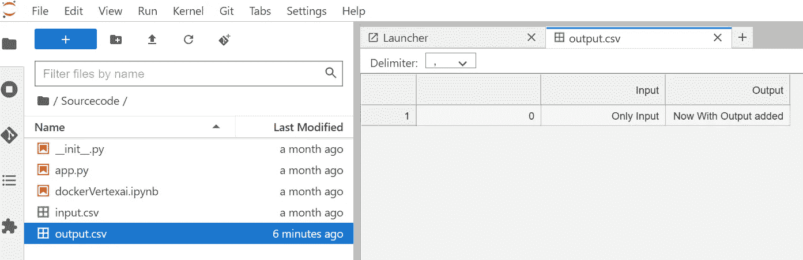

瞧，output.csv 已经自动生成(图片由作者提供)

很好，脚本被自动执行并创建了一个输出文件。但是不幸的是，这个输出文件没有被持久化。所以最好把这个文件保存在云存储中。也就是在我们之前创造的桶里。

```
from google.cloud import storage # Imports the Google Cloud client library
storage_client = storage.Client() # Instantiates a client
BUCKET_NAME =’socialsenti’
blob_name=’output.csv’
storage_client = storage.Client()
bucket = storage_client.bucket(BUCKET_NAME)
blob = bucket.blob(blob_name)
with blob.open(“w”) as f:
 f.write(“Output file has been saved into your bucket”)
with blob.open(“r”) as f:
 print(f.read())
```

将此文件添加到 Jupyter 笔记本的一个新单元中，您将看到输出文件随后会保存在您的存储桶中。

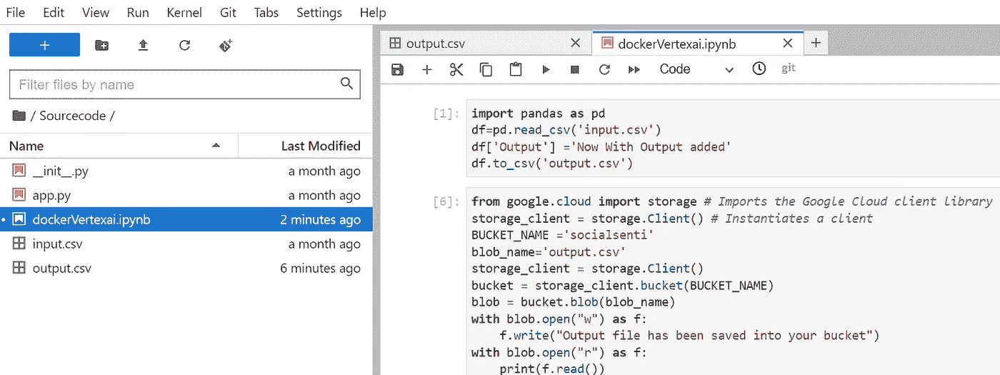

如果您想保存结果，请将其保存到存储器中(图片由作者提供)

那更好。但是仍然有一个可能的优化。因为直到现在，实例一直在运行，即使结果(输出文件)已经创建。因此，您需要一种方法在脚本结束时关闭虚拟机(最终 VertexAI 只使用 Google 计算引擎 GCE ),这样您就不会产生更多的备用成本。

现在让我们进入自动化的下一步。现在，您将从终端通过命令创建实例，而不是手动启动实例:

```
gcloud notebooks instances create instancetweetiment - container-repository=europe-west3-docker.pkg.dev/tweetiment-xyz/tweetimentrep/python-docker - container-tag=latest - machine-type=n1-standard-4 - location=us-central1-b - post-startup-script="gs://socialsenti/default-startup-script.sh"
```

或者，如果您愿意，您可以直接从 Jupyter 笔记本上运行它。

```
from google.cloud.notebooks_v1.types import Instance, VmImage, ContainerImage
from google.cloud import notebooks_v1
client = notebooks_v1.NotebookServiceClient()
notebook_instance = Instance(container_image=ContainerImage(repository="europe-west3-docker.pkg.dev/tweetiment-xyz/tweetimentrep/python-docker",),machine_type="n1-standard-8",post_startup_script="gs://socialsenti/default-startup-script.sh")
parent = "projects/tweetiment-xyz/locations/us-central1-a"
request = notebooks_v1.CreateInstanceRequest(parent=parent,instance_id="notetweeti",instance=notebook_instance,)
op = client.create_instance(request=request)
op.result()
```

为了防止第一次运行时由于缺少身份验证而出现错误，请运行以下命令。这将创建凭据文件:

```
gcloud auth application-default login
```

该凭据文件通常存储在以下路径下:

% APPDATA % \ g cloud \ application _ default _ credentials . JSON

现在，您可以通过编程方式访问 GCP。如果您已经创建了一个笔记本(无论是手动的还是编程的)，那么您可以使用这个 Python 代码来读取它。Instance_Name 是笔记本本身的名称。这段摘录来自 [GCP 文档](https://cloud.google.com/python/docs/reference/notebooks/latest/google.cloud.notebooks_v1.services.notebook_service.NotebookServiceClient):

```
from google.cloud import notebooks_v1

def sample_get_instance():
    # Create a client
    client = notebooks_v1.NotebookServiceClient()
    # Initialize request argument(s)
    request = notebooks_v1.GetInstanceRequest(
        name="projects/tweetiment-xyz/locations/us-central1-a/instances/test", 
    )
    # Make the request
    response = client.get_instance(request=request)
    # Handle the response
    print(response)
sample_get_instance()
```

如果你想安排一个重复的 Python 脚本，你可以使用谷歌的云调度器，结合云功能和发布/订阅。

# 云调度程序

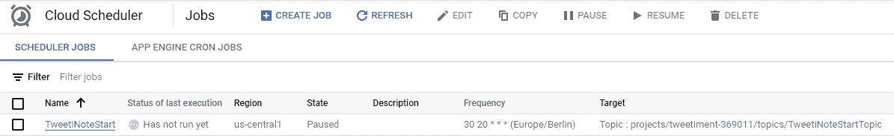

选择发布/订阅作为目标类型和适当的发布/订阅主题:

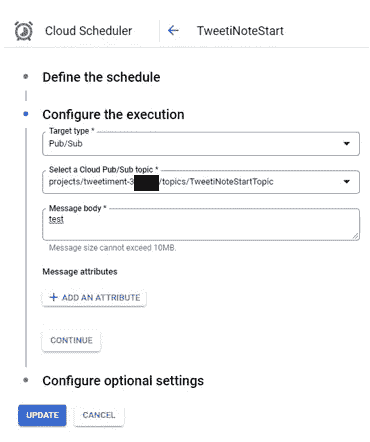

您不需要输入邮件正文(作者图片)

您可以等待，直到调度程序变为活动状态。您也可以随时手动启动它进行测试。

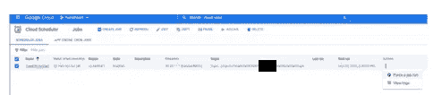

计划者很好。但是有时您也希望在网页上执行一个动作后立即执行 Python 脚本。为此，云函数是一个不错的选择。

# 云函数

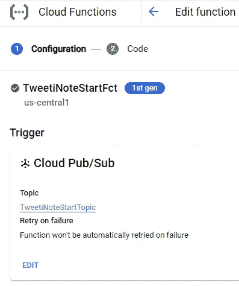

选择发布/订阅作为函数的触发器(图片由作者提供)

选择 Python 作为运行时，并输入“TweetiNoteStartTopic”作为入口点。那个入口点也将是你的函数名。所以最终云函数看起来是这样的:

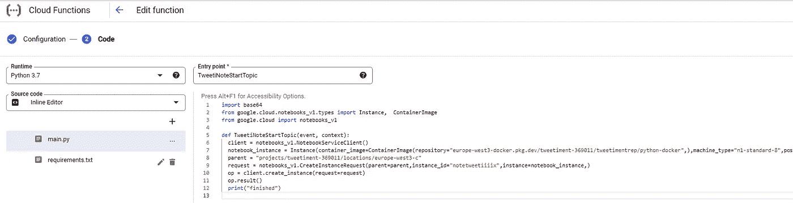

在 requirements.txt 中，您可以根据需要放置所有依赖项:

```
# Function dependencies, for example:
google-cloud-notebooks>=1.4.4
google-cloud>=0.34.0
```

您的 main.py 可能类似于:

```
import base64
from google.cloud.notebooks_v1.types import Instance,  ContainerImage
from google.cloud import notebooks_v1

def TweetiNoteStartTopic(event, context):
  client = notebooks_v1.NotebookServiceClient()
  notebook_instance = Instance(container_image=ContainerImage(repository="europe-west3-docker.pkg.dev/tweetiment-xyz/tweetimentrep/python-docker",),machine_type="n1-standard-8",post_startup_script="gs://socialsenti/default-startup-script.sh")
  parent = "projects/tweetiment-xyz/locations/us-central1-a"
  request = notebooks_v1.CreateInstanceRequest(parent=parent,instance_id="notetweeti",instance=notebook_instance,)
  op = client.create_instance(request=request)
  op.result()
  print("finished")
```

# 发布/订阅

请注意，您也可以随时触发您的云功能。只需转到 test 选项卡并输入以下 json:

{ " data ":" TweetiNoteStartTopic " }

# 恭喜

您现在可以在云中以编程方式运行任何 Python 脚本了！要么直接通过云函数作为纯 Python 脚本，要么作为虚拟机上的 Docker 容器。是 VertexAI 让你在 Jupyter 实验室环境中运行 Jupyter 笔记本，而 Jupyter 实验室环境本身运行在谷歌云引擎(GCE)上的虚拟机上。感谢谷歌硬件——你可以在 VertexAI 上编程设置——几乎没有限制。或者你以前用过 96vCPU 和 360GB Ram 吗？我认为现在自豪地穿上你的[谷歌云衬衫](https://www.googlemerchandisestore.com/)是合理的:-)

非常感谢您的阅读！希望这篇文章对你有帮助。请随时在 [LinkedIn](https://de.linkedin.com/in/jesko-rehberg-40653883) 、 [Twitter](https://twitter.com/DAR_Analytics) 或[工作室](https://jesko-rehberg.medium.com/virtual-reality-vr-for-education-a532aa5b6272)与我联系。