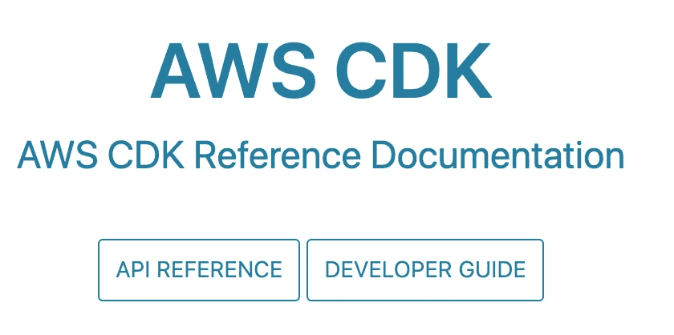
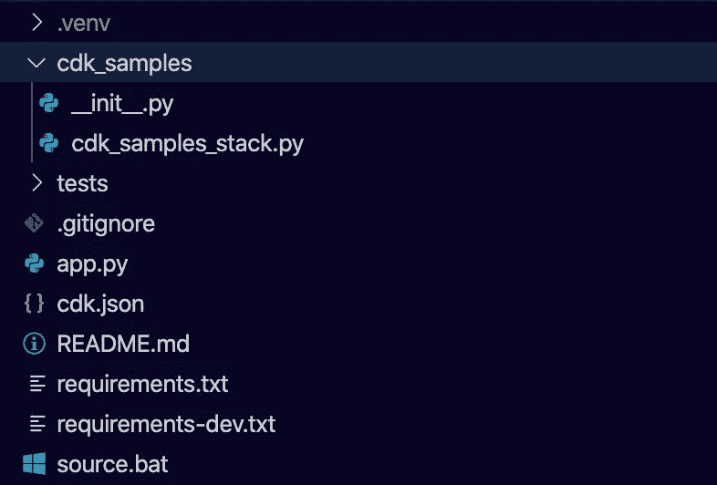
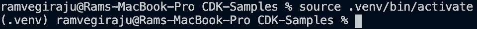
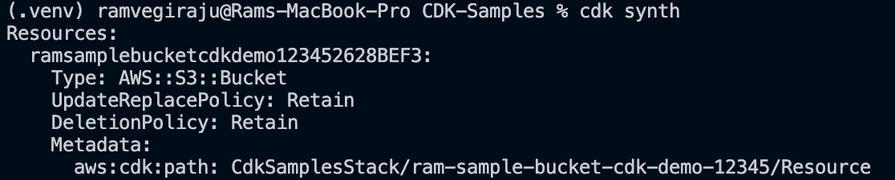
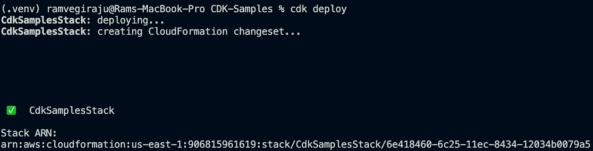
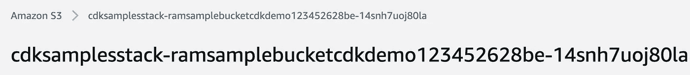
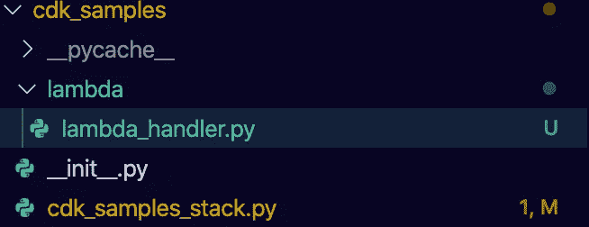
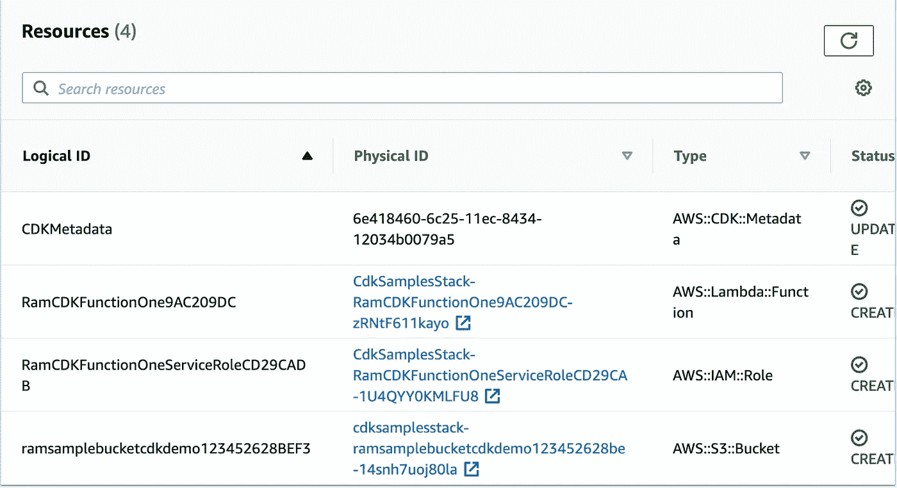
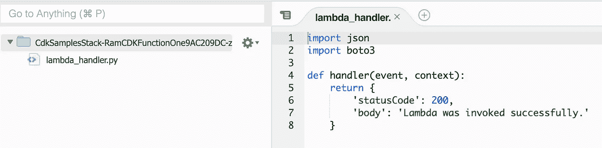

# 构建您的第一个 AWS CDK 项目

> 原文：<https://towardsdatascience.com/build-your-first-aws-cdk-project-18b1fee2ed2d>

## Python 使基础设施代码变得简单

图片来自[泰佐斯](https://unsplash.com/@tezos)的 [Unsplash](https://unsplash.com/photos/y8wjQZ9XP4A)

不久前，我写了一篇关于 AWS CloudFormation 的文章，这是一个代码为的[基础设施工具，它使得在一个中央 yaml 或 json 文件中定义和部署基础设施资源变得很容易。这使得开发人员可以轻松地跟踪和监控基础设施的任何更改，并且还可以与大多数 AWS 服务集成。虽然 CloudFormation 功能强大，但语法需要一点时间来掌握，而且肯定有一个小的学习曲线。](/infrastructure-as-code-with-aws-207239573de)

为了使这个过程更加容易，我们将研究 AWS 云开发工具包( [AWS CDK](https://aws.amazon.com/cdk/) )。AWS CDK 也作为代码工具的基础设施，但它支持许多语言，如 Python、TypeScript 和 Java，您可以使用它们来定义您的资源。这使得**部署和管理您的资源更加简单**，因为您可以使用自己选择的语言和适当的 SDK，而不是试图从头构建一个 YAML 文件或您自己的云形成集。AWS CDK 从本质上抽象出了 CloudFormation 模板构建过程，并在幕后为您处理这一部分。

在今天的文章中，我们将探索一个简单的 Python 示例，并观察我们通过 AWS CDK 定义、部署和管理资源的速度。

**注意**:对于那些刚接触 AWS 的人来说(有一些经验来完全理解这篇文章是很好的)，如果你想继续下去，请确保在下面的 [**链接**](https://aws.amazon.com/console/) 中做一个帐户。确保还安装了 [**AWS CLI**](https://aws.amazon.com/cli/) **以使用示例。我还将提供一个我们将使用的服务列表，以及更深入的定义。如果您已经熟悉这些服务，请随意跳到您感兴趣的部分。**

# 目录

1.  先决条件/设置
2.  CDK 命令
3.  构建 S3 桶和 Lambda 函数的 Python 示例
4.  其他资源和结论

## 1.先决条件/设置

在你开始工作之前，你需要一些依赖。如前所述，确保安装了 AWS CLI 并用您的安全凭证配置了。确保也安装了 pip，对于这个例子，我们将使用 Python 3.7。要安装 CDK，你需要安装[NPM](https://docs.npmjs.com/downloading-and-installing-node-js-and-npm)。要安装 CDK，请在安装 npm 后运行以下命令。

安装 cdk

要验证 CDK 已经安装并访问文档，在您的终端中运行以下命令，它会将您重定向到 CDK 文档。

访问文档

CDK 文件(作者截图)

现在我们可以专注于创建我们的 Python CDK 项目了。我创建了一个名为“cdk-samples”的目录，并在 CLI 中为该目录运行以下命令。

创建 Python CDK 应用程序

这将在您的环境中安装以下文件和目录。

已安装的目录/文件(作者截图)

首先，我们需要激活虚拟环境，之后我们可以安装任何其他依赖项。

激活 virtualenv

激活虚拟环境(作者截图)

既然已经安装了虚拟环境，请确保安装 requirements.txt。对于我们的示例，我们将向预先创建的 requirements.txt 添加 S3 和 Lambda 模块，如下所示。

通过 CLI 安装

requirements.txt

这里我们将处理两个主要文件。如果你去 cdk_samples 目录，会有一个名为**的文件 cdk_samples_stack.py** 。这是您可以在模块中定义资源的地方。对于这个例子，我们将**创建**一个 **S3 桶**和一个 **Lambda 函数**，我们将在这里使用 Python SDK 定义这两个资源。根目录中的 **app.py** 文件将合成并执行我们用资源定义的这个模块。

## 2.CDK 命令

在我们继续之前，我只想介绍一些我们将使用的常见 CDK CLI 命令，这些命令对您也很有用。

**cdk synth** :这将创建由您的代码定义的 CloudFormation 模板/堆栈。

**cdk deploy** :这将获取从 synth 命令创建的 CloudFormation 堆栈，并部署定义的资源。

**cdk bootstrap** :这与我们的例子相关，因为我们正在处理[资产](https://docs.aws.amazon.com/cdk/v2/guide/assets.html)。每当您有本地代码、Docker 映像等时，都需要在部署模板之前进行引导。这与我们的用例相关，因为我们在本地文件中定义了 Lambda 代码。

要查看所有 cdk 命令的列表，请查看文档[这里是](https://docs.aws.amazon.com/cdk/v2/guide/cli.html)。

## 3.构建 S3 桶和 Lambda 函数的 Python 示例

导航到 cdk_samples_stack 目录和其中对应的 Python 文件。首先，我们将构建一个样本 S3 桶。我们首先通过 CDK 导入将要使用的服务。

CDK 堆栈

在这里，我们现在可以定义我们想要创建的 S3 存储桶。要做到这一点，访问 [S3 CDK Python 文档](https://docs.aws.amazon.com/cdk/api/v1/python/aws_cdk.aws_s3/Bucket.html)创建一个桶。确保您的存储桶名称是全球唯一的。

创建 S3 存储桶

现在返回到根目录并在 CLI 中运行 cdk synth，您应该看到终端中显示的 CloudFormation 模板和 S3 bucket 资源。

cdk synth(作者截图)

模板部署完成后，运行 cdk deploy，资源将被部署，您可以在 AWS 控制台中看到 CloudFormation Stack ARN。

cdk 部署(作者截图)

CDK 堆栈控制台(作者截图)

如果我们导航到 S3 控制台，您应该能够看到我们刚刚创建的 S3 桶。

S3 桶创建(作者截图)

现在我们可以按照一个非常简单的过程来创建我们的 Lambda 函数。回到 cdk samples 目录，为模拟 Lambda 函数创建一个 Lambda 目录。您的目录应该如下所示。

Lambda 目录(作者截图)

对于 lambda_handler 文件，我们将添加一个存根 lambda 函数。

λ处理器

我们现在可以返回到我们的 cdk_example_stack.py 文件，并使用下面的[文档](https://docs.aws.amazon.com/cdk/api/v1/python/aws_cdk.aws_lambda.html)定义这个 Lambda 函数。

定义λ函数

现在，我们可以运行相同的 CDK CLI 命令，只是您可能需要在合成和部署之间进行引导，以考虑我们已经定义的本地 Lambda 函数。

更新的堆栈(作者截图)

如果我们查看 CloudFormation 控制台，我们现在应该会看到添加了一个 Lambda 函数，这在 Lambda 控制台中也可以看到。

使用 Lambda 资源更新堆栈(作者截图)

控制台中的 Lambda 函数(作者截图)

要清理所有资源并删除 CloudFormation 堆栈，请运行 **cdk destroy** 。

## 4.其他资源和结论

完整代码举例:[https://github.com/RamVegiraju/CDK-Examples](https://github.com/RamVegiraju/CDK-Examples)

https://github.com/aws-samples/aws-cdk-examples CDK 样本库:

在一个小时内，我们设法使用裸 Python 轻松定义和部署了一个简单的 AWS 应用程序。CDK 是一个功能强大的工具，可用于集中跟踪您的资源，并极大地简化基础架构管理。

*如果你喜欢这篇文章，请在* [*LinkedIn*](https://www.linkedin.com/in/ram-vegiraju-81272b162/) *上与我联系，并订阅我的媒体* [*简讯*](https://ram-vegiraju.medium.com/subscribe) *。如果你是新手，使用我的* [*会员推荐*](https://ram-vegiraju.medium.com/membership) *报名。*