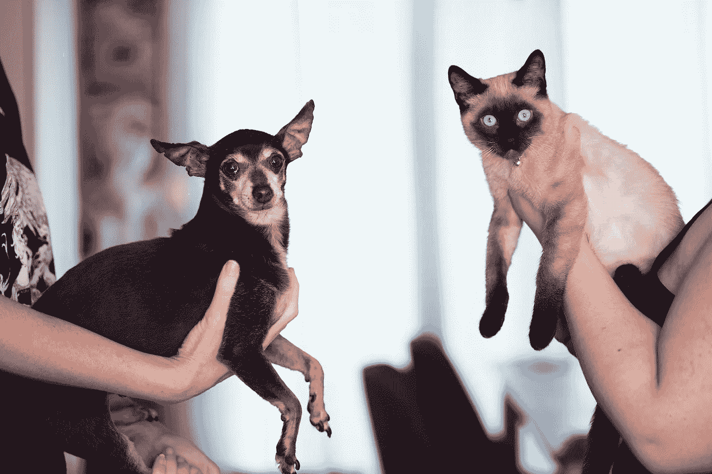
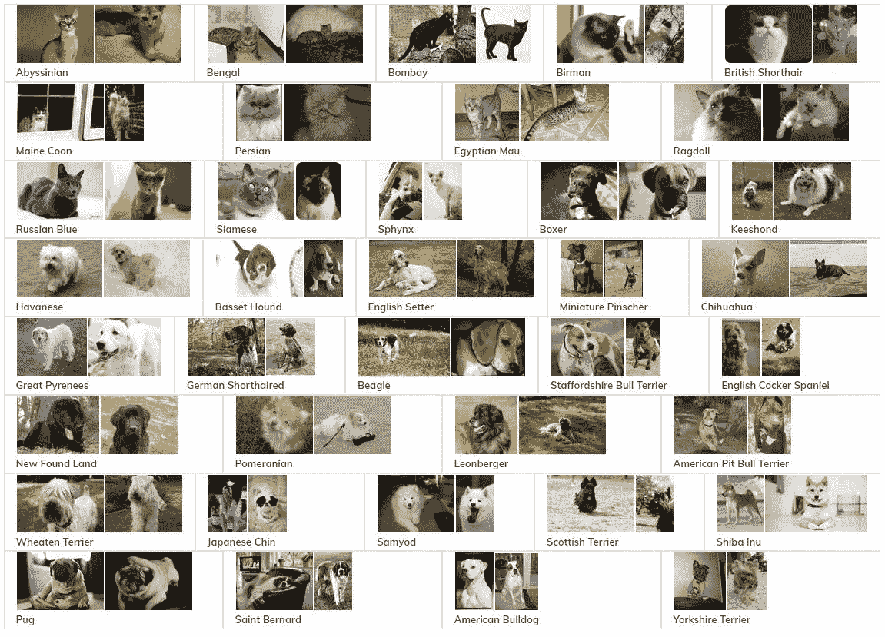
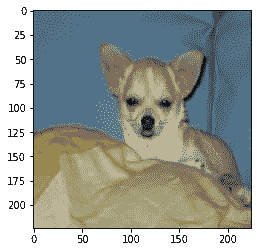
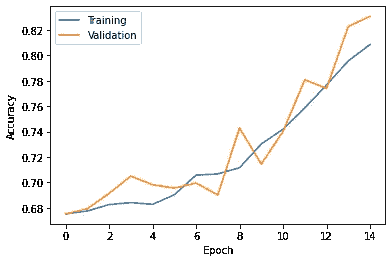
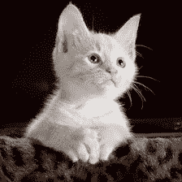

# 用 Tensorflow 构建您的第一个 CNN

> 原文：<https://towardsdatascience.com/build-your-first-cnn-with-tensorflow-a9d7394eaa2e>

## 创建第一个神经网络的分步指南



照片由[亚历山大·格雷](https://www.pexels.com/es-es/@mccutcheon/)在[像素](http://www.pexels.com/)上拍摄

计算机视觉是当今的热门话题之一。它为涉及图像的不同问题提供了可靠的解决方案。在本文中，我们将使用 Tensorflow 从头开始创建一个卷积神经网络(CNN)。然后，我们将使用它对猫和狗的图像进行分类，这是最流行的图像分类数据集之一。

本文旨在帮助该领域的新手(尤其是 Tensorflow 新手)学习获取数据、处理数据、构建模型、训练模型以及最终使用数据进行预测的基本原则。

# 什么是分类？

我们要回答的第一个问题是什么是分类。我将尽可能缩短这些原则，并提供其他有价值的文章来更深入地介绍它们。

**分类**是给给定的输入数据分配一个标签的过程。例如，我们可以对电子邮件是否是垃圾邮件进行分类。在这种情况下，对于给定的图像，我们将预测图像是猫还是狗。

关于什么是分类和最流行的算法的更详细的解释，我强烈推荐阅读下面的文章:

[](/machine-learning-classifiers-a5cc4e1b0623)  

# 卷积神经网络(CNN)

下面的关键概念是 CNN(或 ConvNet)。CNN 是一类神经网络，它将图像作为输入，对其应用一系列操作并返回输出。该输出可以是概率、图像类别的预测或另一个新图像。这取决于网络架构和我们试图解决的问题。

在这种情况下，我们将使用一个简单的 CNN 来将输入图像分类为狗或猫类。它将返回给定图像是狗还是猫的概率。

为了更多更好地理解这种神经网络在图像中执行的操作，我建议这篇文章:

[](/a-comprehensive-guide-to-convolutional-neural-networks-the-eli5-way-3bd2b1164a53)  

# 构建我们的网络

(你可以在这个 [repo](https://github.com/Psancs05/Medium/tree/master/Cats-Dogs) 中找到所有代码)

是时候开始工作并构建我们的分类器了。如前所述，我们将使用 Tensorflow 和 Keras，使用简单的 CNN 架构制作一个猫/狗分类器。

## 加载数据集

我们将使用[牛津-IIIT 宠物数据集](https://www.robots.ox.ac.uk/~vgg/data/pets/)，包含超过 7000 张猫和狗的图片。该数据集拥有 CC-BY-SA 4.0 许可证，这意味着我们可以为任何目的共享和调整数据。

首先，我们需要下面的库。

接下来，我们将加载数据集。你可以从 [Kaggle](https://www.kaggle.com/datasets/tanlikesmath/the-oxfordiiit-pet-dataset) 下载，并将文件夹复制到你的工作目录中。另外，你可以直接从数据集的[网站](https://www.robots.ox.ac.uk/~vgg/data/pets/)获取数据。

一旦我们有了数据集，它将包含一个名为*‘images’*的文件夹，里面有所有的宠物图像。

每个图像将在文件名中包含其标签。正如我们在数据集的信息中看到的，数据被分成不同的品种。



数据集信息，[链接](https://www.robots.ox.ac.uk/~vgg/data/pets/)

有 12 个品种的猫和 25 只狗。我们将遵循的策略是使用所有的狗品种作为狗图像，所有的猫品种作为猫图像。我们不考虑品种，因为我们想建立一个二元分类器。

看看我们有多少数据。

```
There are 7390 images in the dataset
```

我们可以看到，总共有 7390 张图片。现在是时候除掉这些品种了。我们将创建两个列表，一个包含所有狗的照片，另一个包含所有猫的图片。

现在我们可以看一下，看看我们有多少张每种动物的图片。

```
There are 2400 images of cats
There are 4990 images of dogs
```

该数据集有 2400 只猫和 4990 只狗。

## 数据分区

对于我们的网络，我们希望使用三个不同的集合:

*   训练:训练模型的图像。
*   验证:在训练过程中测试模型的图像。
*   test:在模型完成训练后对其进行测试的图像。

我们将使用 70%的图像进行训练，10%用于验证，剩下的 20%用于测试。

由于我们只有两个图像列表(狗和猫)，我们需要将这些列表分成不同的集合。我们将用熊猫来做这件事。

首先，我们将数据混洗并分成三组，其对应的数据分布为 70/10/20。

接下来，我们必须使用*熊猫*创建*数据帧*。

它们只有两列，一列是图像名称，另一列是标签“猫”或“狗”。

最后，我们可以连接*数据帧。*

```
There are 5173 images for training
There are 739 images for validation
There are 1478 images for testingThere are 7000 images for training
There are 1000 images for validation
There are 2000 images for testing
```

完美！我们已经从数据集创建了三个分区。

## 数据预处理

接下来的步骤是预处理所有的图像。我们希望它们具有相同的维度(因为 CNN 将需要具有相同维度的所有输入数据),并且它们的像素被归一化。这样做的原因是为了更快地训练我们的神经网络模型。

我们将使用 Keras 中的 ImageDataGenerator 类。

我们刚刚创建了 3 个新的数据集，每个数据集都有经过预处理的图像。此外，我们应用了 *shuffle* 属性来随机重组图像的顺序，并应用了 *batch_size* 来将图像加入 32 个元素的组中。这意味着我们将一次给 CNN 32 张图片。每一步中的图像越少，模型的学习效果就越好，但完成训练过程需要的时间就越长。这是一个参数，我们可以用它来检查性能如何变化。

## 形象化

如果我们想检查数据集的结果，我们可以做以下比较。

```
Batch shape:  (32, 224, 224, 3)
Label shape:  (32,)
```

我们有 32 张图片及其相关标签。此外，我们可以绘制这些图像(例如，第四个)。



该批次的第四个图像，作者

```
Label:  1.0
```

狗的标签是 1，猫的标签是 0。

## 模型

现在我们已经准备好了所有的数据，是时候构建模型了。

```
Model: "sequential" _________________________________________________________________  Layer (type)                    Output Shape            Param #    =================================================================  conv2d (Conv2D)                 (None, 222, 222, 64)    1792                                                                          max_pooling2d (MaxPooling2D)    (None, 111, 111, 64)    0                                                                                                                                             conv2d_1 (Conv2D)               (None, 109, 109, 128)   73856                                                                         max_pooling2d_1 (MaxPooling2D)  (None, 54, 54, 128)     0                                                                                                                                          conv2d_2 (Conv2D)               (None, 52, 52, 256)     295168                                                                        max_pooling2d_2 (MaxPooling2D)  (None, 26, 26, 256)     0                                                                                                                                        conv2d_3 (Conv2D)               (None, 24, 24, 512)     1180160                                                                       global_average_pooling2d (G     (None, 512)             0           lobalAveragePooling2D)                                                                                                              dense (Dense)                   (None, 1)               513
=================================================================
Total params: 1,551,489
Trainable params: 1,551,489
Non-trainable params: 0 _________________________________________________________________
```

这是一个简单的 CNN 模型，有四个卷积层和一个输出层，输出层由一个密集层和 1 个输出神经元组成。

让我们进入训练阶段。我们需要编译和拟合模型。我们将使用*二进制交叉熵*作为损失函数，因为我们正在处理带有整数标签的类(0 代表猫，1 代表狗)。优化器将是 *adam* 算法，我们将使用*精度*作为流程的度量。

我们将训练 15 个纪元的网络。

现在我们已经训练出了第一个 CNN！我们可以在训练过程中查看网络的*精度*和*损耗*值。



培训指标，按作者

最后一步是评估这个模型。为此，我们将使用测试数据集。

```
47/47 [==============================] - 10s 204ms/step - loss: 0.4277 - accuracy: 0.8051Loss: 0.4276582598686218
Accuracy: 0.8051421046257019
```

该模型的准确率为 80%。

你已经训练了你的第一个卷积神经网络，祝贺你！既然我们已经训练了新模型，我们可以用它来预测猫和狗的真实图像。这是我们可以使用模型进行预测的部分。这些图像在任何过程阶段都是前所未见的。

## 预言

预测阶段是与现实世界问题最相似的场景，在这一阶段，一旦模型被定型，它就必须对看不见的数据进行分类。

在我们的例子中，我们将预测下图的类。



由 [Pixabay](https://www.pexels.com/es-es/@pixabay/) 在[像素](http://www.pexels.com/)上制作的一只猫的图像

对于人类来说，这显然是一只可爱的猫的图像，但让我们看看我们的模型对此有什么看法。

```
array([[0.08732735]], dtype=float32)
```

在这种情况下，我们必须将影像整形为网络的输入格式，并像对所有数据集影像一样对其进行归一化。

然后我们给模型，输出是 *0.08* 。该输出可以从 0 到 1 变化，因为网络的输出层具有 sigmoid 激活函数。因为我们的猫的类是 0，狗的类是 1，所以我们的模型同意这个图像是一只猫。

你可以在这个[回购](https://github.com/Psancs05/Medium/tree/master/Cats-Dogs)中看到完整的代码。

# 后续步骤

我们已经看到了一个简单的从头开始 CNN 的方法。它的性能很好，但仍有很大的改进空间。在这里，我将列举一些可能的修改，您可以研究以增强网络。

*   改变网络架构。您可以尝试新的层，编辑现有的层或更改激活功能。你尝试的越多，你在 CNN 获得的知识就越多。
*   增加[漏失](https://keras.io/api/layers/regularization_layers/dropout/)和[批量归一化](https://keras.io/api/layers/normalization_layers/batch_normalization/)图层。有非常有用的，尤其是在更大的模型中。这些层也有助于避免模型中的过度拟合。
*   尝试新的优化训练过程。有很多不同的[优化器](https://keras.io/api/optimizers/#available-optimizers)可以用来训练网络。你可以改变它们，看看是否有改进。
*   做图像增强，这是一种从现有图像中创建新图像的技术。您可以尝试缩放、旋转或裁剪部分图像，以生成更多数据。

一旦你掌握了所有这些要点(以及你能想到的任何其他要点)，我建议着手于一个多类分类模型。例如，考虑到这次的品种，你可以使用相同的数据集。创建一个分类器，不仅区分猫和狗，而且区分数据集中可用的品种。这将是一个有趣的挑战！

我希望本教程对你有所帮助。如果您有任何问题，请随时发表评论！👋🏻​