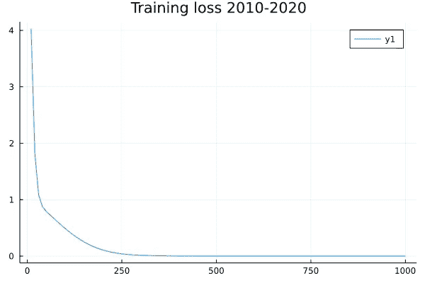

# 在 Julia 中用 Flux.jl 构建你的第一个神经网络

> 原文：<https://towardsdatascience.com/build-your-first-neural-network-with-flux-jl-in-julia-10ebdfcf2fa3>

## 没有任何外部数据的初学者教程


时代是你不应该预测的——胡尔基·奥莰·塔巴克在 Unsplash 上拍摄的照片

机器学习的第一条规则应该是**你不要用机器学习**。我的意思是，如果你有一个新项目，试着**不用机器学习**来解决。ML 很贵，很难监控、维护和运行，更不用说数据科学家可能很贵。如果你真的不能用启发式规则解决问题，那么你可以去 ML。

本教程将把上面的陈述颠倒过来。我们将使用神经网络从给定的日期时间中预测 Unix 纪元。这是为了练习，没别的。求求你，求求你不要为了学习之外的任何事情而这样做！🙏

***这一整篇教程作为冥王星笔记本提供:***

<https://github.com/niczky12/medium/blob/master/julia/epoch_pluto.jl>  

***不知道冥王星是什么？请看这篇*** [***文章***](/jupyter-notebooks-can-be-a-pain-but-i-️-pluto-f47913c5c16d) ***。***

> 要获得所有媒体文章的完整信息——包括我的——请点击这里订阅。

# 你说纪元？

澄清一下，一个[纪元时间是从 1970 年 1 月 1 日午夜起经过的**秒**](https://en.wikipedia.org/wiki/Unix_time) 。我们可以通过调用`datetime2unix`函数从 Julia 的 DateTime 中获得一个 epoch(或 unix)时间:

```
**julia>** using Dates**julia>** dt = DateTime("2021-09-01T12:45:00")2021-09-01T12:45:00**julia>** datetime2unix(dt)1.6305003e9
```

我们的目标是获取一个日期时间，并预测它在 Unix 纪元中的值。系好安全带，我们有工作要做！

# 那可是好多秒啊！


我打赌今天的日期和这张图上的沙子一样多，证明我错了！—[吉姆·盖德](https://unsplash.com/@jimgade?utm_source=unsplash&utm_medium=referral&utm_content=creditCopyText)在 [Unsplash](https://unsplash.com/s/photos/sand?utm_source=unsplash&utm_medium=referral&utm_content=creditCopyText) 上的照片

这是一个教程——而且很傻——所以我会设定一些界限。假设我们的**训练输入在 2010 年到 2020 年之间**，我们只对预测到 2030 年的值感兴趣:

现在我们知道了 y 的变化范围，我们可以取几个样本并创建我们的数据。注意，我们不需要从任何地方下载任何东西，我发现很多 ML 教程都要求你下载数据或者在不同格式之间转换。这可能会很困难，困难是不好的，所以我们将避免所有的麻烦，并制作我们自己的数据。

因为我们正在建立一个神经网络，标准化我们的输入是必须的。但是由于我们的输出是如此之大——在 1，000，000，000 的规模上——我们也将需要**标准化我们的输出**。这样，我们可以避免等待神经网络达到它需要的巨大权重。

以下是一些将 x 和 y 归一化的辅助函数:

我们也可以使用小批量来加速训练。IterTools 的`partition`函数使这变得简单:

> 如果你觉得以上令人困惑，看看我在 Julia 发表的关于广播的[文章。](/vectorize-everything-with-julia-ad04a1696944)

# 建立一个网络，训练一个网络

为了容易开始，我们将只使用一个单层和`identity`作为我们的激活函数。非常欢迎您下载[源文件](https://github.com/niczky12/medium/blob/master/julia/epoch_pluto.jl)并在 Pluto 中使用它。

上面有 3 个组件:

*   **模型**:这是我们的 NN 架构。
*   **损失**:这告诉 Flux 我们的损失函数是什么。上面我用的是 Flux 内置的均方误差。
*   **优化器**:告诉 Flux 如何更新权重的函数。

为了训练我们的网络，我们将这些数据连同输入和输出数据对一起传入`Flux.train!`，并对我们的数据进行几次迭代。令人困惑的是，每次迭代也被称为一个纪元😃。



随着时间的推移，我们的训练损失——作者制作的图表

为了预测值，我们需要将预测值重新调整到各个时期:

我还用 2020 年至 2030 年间的例子创建了一个测试集，以下是预测样本:

```
Input -> Predicted epochs as datetime | difference
2030-02-13T03:33:28 -> 2030-02-11T17:01:22.811 | -35 hours
2021-02-18T12:15:50 -> 2021-02-16T17:24:46.530 | -43 hours
2022-06-26T02:55:35 -> 2022-06-26T08:19:32.420 | 5 hours
2023-11-16T05:54:15 -> 2023-11-16T01:11:17.980 | -5 hours
2030-06-24T05:38:26 -> 2030-06-24T13:47:39.302 | 8 hours
2026-04-19T21:39:56 -> 2026-04-20T07:08:37.777 | 9 hours
2028-01-16T20:26:00 -> 2028-01-16T12:52:12.389 | -8 hours
2029-12-21T02:00:31 -> 2029-12-20T21:20:49.342 | -5 hours
2027-03-05T14:17:19 -> 2027-03-06T21:43:38.841 | 31 hours
2026-07-01T05:54:13 -> 2026-07-02T01:32:57.773 | 20 hours
```

如你所见，我们的预测并不完美，还有改进的空间，但我们的 **NN 正在收敛并产生合理的结果**。当你预测 10 年后的未来时，20 个小时的时差对于时代来说并不算太差。

# 现在轮到你了


去把他们都按下来！—[腾雅特](https://unsplash.com/@tengyart?utm_source=unsplash&utm_medium=referral&utm_content=creditCopyText)在 [Unsplash](https://unsplash.com/s/photos/buttons?utm_source=unsplash&utm_medium=referral&utm_content=creditCopyText) 上的照片

我希望你读这篇文章的时候和我写作的时候一样开心。这仅仅是开始。**你可以用上面的来开始你的 NNs 和 Flux.jl 的旅程**[冥王星笔记本在这里](https://github.com/niczky12/medium/blob/master/julia/epoch_pluto.jl)供你消遣。欢迎您更改输入样本大小、日期、优化器、损失函数、激活函数、神经网络结构等。**去野外按几个按钮！**

<https://github.com/niczky12/medium/blob/master/julia/epoch_pluto.jl>  

> 我写朱莉娅和其他很酷的东西。如果你喜欢这样的文章，请考虑关注我。

</jupyter-notebooks-can-be-a-pain-but-i-️-pluto-f47913c5c16d>  </vectorize-everything-with-julia-ad04a1696944>  <https://blog.devgenius.io/make-a-command-line-game-with-julia-a408057adcfe>  </control-flow-basics-with-julia-c4c10abf4dc2> 