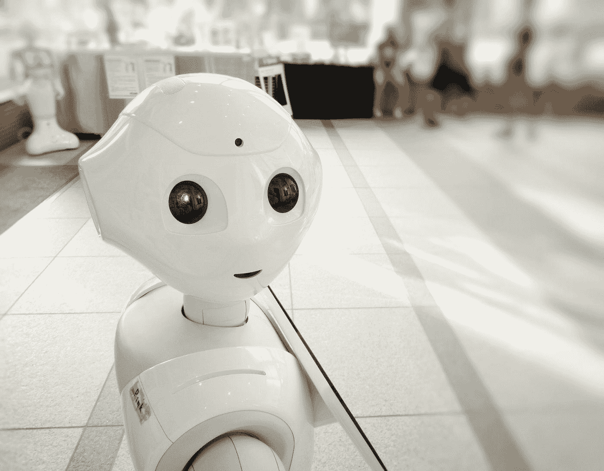

# 建立你自己的人工智能语音助手来控制你的电脑

> 原文：<https://towardsdatascience.com/build-your-own-ai-voice-assistant-to-control-your-pc-f4112a664db2>

## 一个简单的指南，告诉你如何构建你自己的人工智能助手来控制你电脑上的各种动作


[亚历山大·奈特](https://unsplash.com/@agk42?utm_source=medium&utm_medium=referral)在 [Unsplash](https://unsplash.com?utm_source=medium&utm_medium=referral) 上拍照

最近，使用虚拟助手来控制你的周围环境正在成为一种常见的做法。我们利用谷歌人工智能、Siri、Alexa、Cortana 和许多其他类似的虚拟助手，通过简单的语音或音频命令为我们完成任务。你可以要求他们播放音乐或打开一个特定的文件或任何其他类似的任务，他们会轻松地执行这些动作。

虽然这些设备很酷，但开发自己的人工智能语音自动化助理也很有趣，你可以利用它来控制你的桌面，只需借助你的声音。我们可以使用这样的人工智能与你聊天，打开视频，播放音乐，等等。

在这篇文章中，我们将致力于开发一个人工智能助手的介绍性项目，你可以利用它来控制你的 PC 或任何其他类似的设备。我们将从介绍构建这个项目所需的一些基本依赖关系开始，并继续将其全部放入一个 Python 文件中，通过该文件构建 AI 语音助手来执行您的命令。

在阅读这篇文章之前，如果你对我们从零开始构建东西的其他这样的酷项目感兴趣，我建议看看我以前的一个作品。下面提供了一个链接，您可以在这里用 Python 开发自己的天气应用程序指示器，只需不到十行代码。

[](/develop-your-weather-application-with-python-in-less-than-10-lines-6d092c6dcbc9) [## 用 Python 开发不到 10 行的天气应用程序

### 使用 Python 构建我们的天气电视广播应用程序，以接收所需位置的更新

towardsdatascience.com](/develop-your-weather-application-with-python-in-less-than-10-lines-6d092c6dcbc9) 

# 基础知识入门:

## 第 1 部分:桌面控件


照片由[本斯·博罗斯](https://unsplash.com/es/@benceboros?utm_source=medium&utm_medium=referral)在 [Unsplash](https://unsplash.com?utm_source=medium&utm_medium=referral) 拍摄

在文章的这一部分，我们将学习如何控制我们的电脑。我们将学习如何管理和处理物理屏幕上的一些基本操作。在 PyAutoGUI 的帮助下，我们可以执行这个项目所需的许多功能。这个自动化库工具允许用户以编程方式控制鼠标和键盘。

您可以使用一个简单的 pip 命令安装 PyAutoGUI 库来处理所有与光标、鼠标和键盘相关的任务，如下所示。

```
pip install PyAutoGUI
```

让我们从这个库中的一些基本命令开始，我们将需要这些命令来开发我们的语音辅助人工智能 Python 项目。几分钟后，安装应该在各自的环境中顺利完成。

首先，让我们导入 PyAutoGUI 库，如下面的代码片段所示。下一个关键步骤是知道你的工作屏幕的分辨率。我们可以使用最近安装的库中可用的尺寸功能打印默认的屏幕尺寸和屏幕高度。

```
import pyautogui# Printing the default screen width and height
screenWidth, screenHeight = pyautogui.size()print(screenWidth, screenHeight)
```

**输出:** 1920 1080

你可以注意到我的屏幕分辨率是 1920 x 1080，这应该是大多数电脑的默认屏幕尺寸。但是，如果您的显示器屏幕分辨率较高或较低，您仍然可以轻松地跟随指南。这些命令可以互换使用，以在任何分辨率下获得所需的坐标。如果你的屏幕显示分辨率和我的不匹配，一定要相应地改变一些参数。

我们将在本节中介绍的另一个基本命令是发现鼠标指针当前位置的命令。库的 position()函数将定位鼠标指针所在的当前坐标。我们可以使用这些位置在您的桌面屏幕上定位文件夹和其他重要目录。下面是执行以下操作的代码片段。

```
# Showing the current cursor position
currentMouseX, currentMouseY = pyautogui.position() # Get the XY position of the mouse.
print(currentMouseX, currentMouseY)
```

该库的另一个有趣的功能是，您可以使用下面提供的代码片段来定位当前工作屏幕上某些图像的位置以及相应的坐标。

```
# Locating on the Screen by getting the co-ordinates
x, y = pyautogui.locateCenterOnScreen("image.png")
```

我们将在本节中看到的最后一个基本命令是允许我们打开所需目录的函数。通过将光标放在左上角，我能够算出我的管理文件夹的坐标。我们可以使用 moveTo()函数将光标移动到相应的位置，以及文件夹的相应位置。然后，我们可以使用 click()命令，只需输入鼠标左键或右键的点击次数以及您想要的点击次数。

```
# Open The Admin Directory
pyautogui.moveTo(37, 35, 1)
pyautogui.click(button='left', clicks=2)
```

使用上面的代码片段，您应该能够打开 admin 文件夹，因为光标会自动移动到 admin 目录并双击它来打开它。如果您的屏幕左上角没有类似的图标，或者您有不同的屏幕分辨率，请随意尝试相应的位置和坐标。

## 第 2 部分:语音命令控制


照片由[托马斯·勒](https://unsplash.com/@thomasble?utm_source=medium&utm_medium=referral)在 [Unsplash](https://unsplash.com?utm_source=medium&utm_medium=referral) 上拍摄

在本文的这一部分，我们将了解语音识别的一些基本要求，这是这个项目的第二个最核心的部分。我们将需要一个麦克风来通过声音传递我们的命令，并相应地解释信息。建议使用语音识别库，以及您选择的文本到语音转换器。还要确保您的工作环境中安装了 PyAudio。

如果观众对文本到语音转换不太熟悉，我强烈推荐查看我以前的一篇文章，其中我用 Python 介绍了 Google 文本到语音转换，并提供了初学者代码来帮助您入门。下面提供了相同内容的链接。

[](/how-to-get-started-with-google-text-to-speech-using-python-485e43d1d544) [## 如何使用 Python 开始使用 Google 文本到语音转换

### 从零开始的文本到语音转换简介

towardsdatascience.com](/how-to-get-started-with-google-text-to-speech-using-python-485e43d1d544) 

首先，我们可以导入必要的库，如下面的代码块所示。语音识别库将使我们能够检测必要的语音命令。此外，我们还可以利用文本到语音库来传递文本命令，并将它们转换为语音，然后传递给系统来执行所需的操作。我们可以为语音识别器创建一个变量。

```
import speech_recognition as sr
import pyttsx3r = sr.Recognizer()
```

在下一步中，我们将读取用户的麦克风输入作为源，并相应地解释语音。一旦音频被识别为期望的，语音输出就显示在终端输出上。但是，如果语音未被检测到，我们可以通过必要的异常来确保用户可以相应地验证他们的设置。下面是简单语音识别的代码片段。

```
with sr.Microphone() as source:
    r.adjust_for_ambient_noise(source)
    print ("Say Something")
    audio = r.listen(source)

    try:
        text = r.recognize_google(audio)
        print("you said: ", text)

    except sr.UnknownValueError:
        print("Google Speech Recognition could not understand audio")

    except sr.RequestError as e:
        print("Could not request results from Google Speech Recognition service; {0}".format(e))
```

下一步，我们将构建 AI 语音助手的最终版本，在这里我们可以将本节中讨论的两个功能组合成一个实体来执行所需的操作。

# 开发人工智能语音助手的最终版本:



[附身摄影](https://unsplash.com/@possessedphotography?utm_source=medium&utm_medium=referral)在 [Unsplash](https://unsplash.com?utm_source=medium&utm_medium=referral) 上拍照

既然我们对本文中设备控制和语音识别这两个核心组件有了基本的理解，我们就可以开始结合这两个元素来开发我们的项目了。让我们从必要的库导入开始，如下所示。

```
import pyautogui
import speech_recognition as srr = sr.Recognizer()
```

在下一个片段中，我们将定义命令的功能，在这里我们将解释许多动作。在下面的代码块中，我只定义了几个功能，即打开我的管理目录或开始菜单。该函数接受用户提供的文本输入。我们可以添加几个其他必要的命令来进一步改进这个项目。

```
def commands(text):
    if text == "open admin":
        # Open The Admin Directory
        pyautogui.moveTo(37, 35, 1)
        pyautogui.click(button='left', clicks=2) elif text == "open start menu":
        # Open The start menu
        pyautogui.moveTo(18, 1057, 1)
        pyautogui.click(button='left', clicks=1)
```

在下一个代码块中，我们将定义接收来自用户的音频输入并相应地识别语音的功能。一旦听到音频，在将文本输入传递到我们的命令功能之前，请确保将其转换为小写。一旦构建了下面的代码，您就可以自由地测试和运行这个项目了。

```
with sr.Microphone() as source:
    r.adjust_for_ambient_noise(source)
    print ("Say Something")
    audio = r.listen(source)

    try:
        text = r.recognize_google(audio)
        print("you said: ", text)
        commands(text.lower())

    except sr.UnknownValueError:
        print("Google Speech Recognition could not understand audio")

    except sr.RequestError as e:
        print("Could not request results from Google Speech Recognition service; {0}".format(e))
```

运行项目的首选方法是最小化所有选项卡并打开终端来运行 Python 代码。您可以发出命令“open admin”来观察光标从默认位置移动到指定位置，并根据需要打开它。我的 GitHub 资源库中提供了以下项目所需的所有文件。从下面的[链接](https://github.com/Bharath-K3/AI-Voice-Assistant)中查看。

下面这个项目只是一个入门项目，让你从零开始拥有一个自己的 AI 语音助手。我们可以对下面的项目进行大量的改进和提高，我会推荐用户去尝试。我还将查看本文的第 2 部分扩展，在那里我们可以为更好的特性和性能做一些重要的改进。

# 结论:


[维卡·斯特劳贝里卡](https://unsplash.com/@vika_strawberrika?utm_source=medium&utm_medium=referral)在 [Unsplash](https://unsplash.com?utm_source=medium&utm_medium=referral) 上的照片

> “任何可以产生比人类更聪明的智能的东西——以人工智能、脑机接口或基于神经科学的人类智能增强的形式——都毫无疑问地成为最能改变世界的东西。其他的甚至都不在一个联盟里。”
> ***—埃利泽·尤科夫斯基***

对语音和声音的识别是人类理解的原始任务。通过听和读不同类型的声音和比喻，我们能够感知和回应大多数人类情感。然而，机器还没有完全理解语言背后的情感的能力。

虽然我们还没有完全能够开发出完全理解人类情感的机器，但我们已经成功地开发出了多种可以检测和理解语音的设备。当前编程时，AI 可以识别语音并创建网络映射来解释对话并执行相应的任务。

在本文中，我们开发了一个关于语音自动化系统的项目，它可以用来控制桌面上的许多操作。我们介绍了 PyAutoGUI 库处理所有光标、鼠标和键盘相关任务的基础知识。然后，我们研究了用于语音检测和处理的语音识别库。最后，我们构建了一个人工智能语音助手来控制你的电脑。

如果你想在我的文章发表后第一时间得到通知，请点击下面的[链接](https://bharath-k1297.medium.com/subscribe)订阅邮件推荐。如果你希望支持其他作者和我，请订阅下面的链接。

[](https://bharath-k1297.medium.com/membership) [## 通过我的推荐链接加入媒体

### 作为一个媒体会员，你的会员费的一部分会给你阅读的作家，你可以完全接触到每一个故事…

bharath-k1297.medium.com](https://bharath-k1297.medium.com/membership) 

如果你对这篇文章中提到的各点有任何疑问，请在下面的评论中告诉我。我会尽快给你回复。

给所有喜欢看我内容的观众一个快速更新。我很抱歉博客的延迟，因为我工作有点忙。从下个月开始，我会试着每月至少发布三到五篇文章。感谢大家一直以来的支持。

看看我的一些与本文主题相关的文章，你可能也会喜欢阅读！

[](/best-seaborn-visualizations-for-data-science-3d866f99c3a9) [## 数据科学最佳 Seaborn 可视化

### 使用 Seaborn 库探索数据科学项目的一些最佳可视化选项

towardsdatascience.com](/best-seaborn-visualizations-for-data-science-3d866f99c3a9) [](/7-python-programming-tips-to-improve-your-productivity-a57802f225b6) [## 提高生产力的 7 个 Python 编程技巧

### 通过修正一些常见的不良编程实践，使您的 Python 编码更加有效和高效

towardsdatascience.com](/7-python-programming-tips-to-improve-your-productivity-a57802f225b6) [](/develop-your-own-calendar-to-track-important-dates-with-python-c1af9e98ffc3) [## 使用 Python 开发您自己的日历来跟踪重要日期

### 开发一个日历 GUI 界面来管理您 2022 年及以后的计划

towardsdatascience.com](/develop-your-own-calendar-to-track-important-dates-with-python-c1af9e98ffc3) 

谢谢你们坚持到最后。我希望你们都喜欢这篇文章。祝大家有美好的一天！