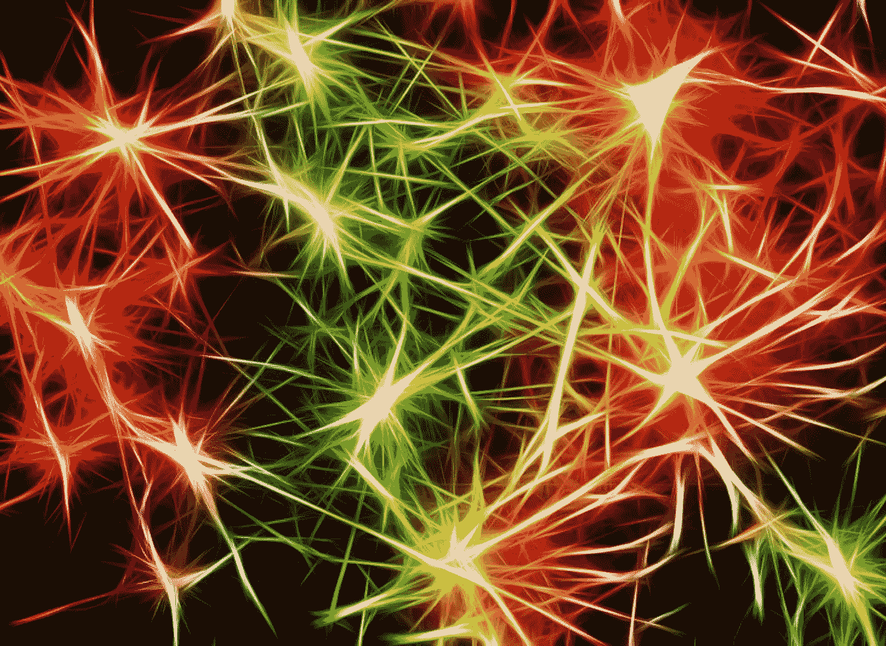
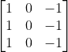
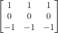
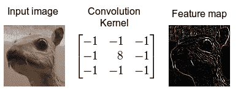
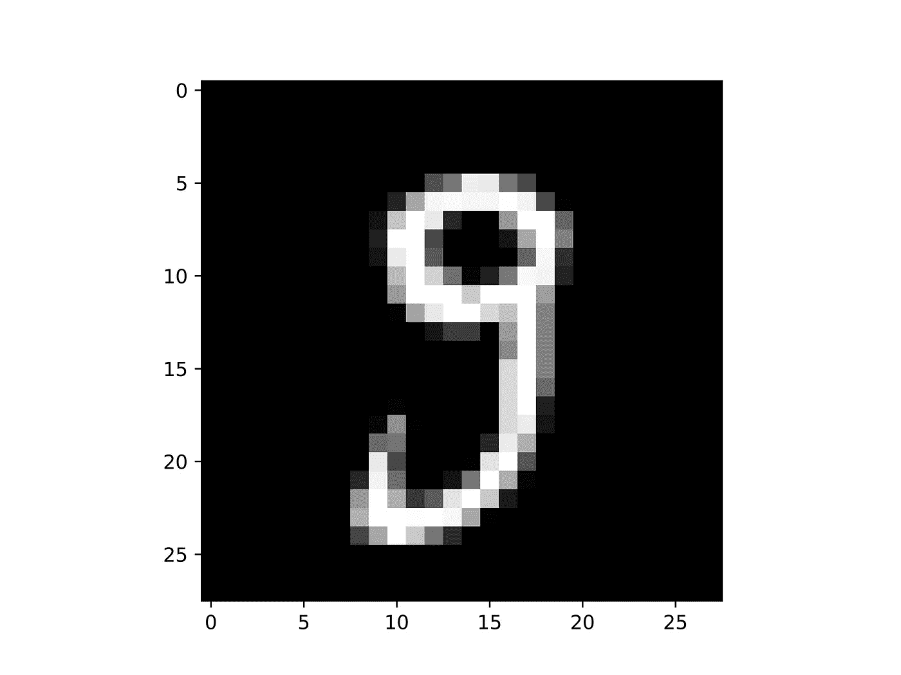
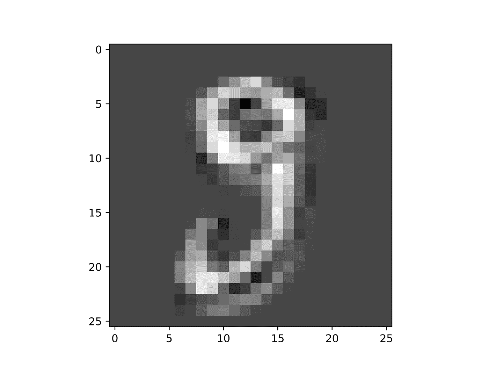

# 使用 Numpy 从头构建卷积神经网络

> 原文：<https://towardsdatascience.com/building-a-convolutional-neural-network-from-scratch-using-numpy-a22808a00a40>

## 随着计算机视觉应用在我们的生活中变得无处不在，理解卷积神经网络的工作原理对于每个数据科学从业者来说都是至关重要的

来源:canva.com

在[我之前的文章](/building-a-deep-neural-network-from-scratch-using-numpy-4f28a1df157a)中，我在没有使用 Tensorflow、Pytorch、Keras 等流行的现代深度学习库的情况下，构建了一个深度神经网络。我后来用那个网络来分类手写数字。所获得的结果不是最先进的水平，但它们仍然是令人满意的。现在我想更进一步，我的目标是只用 Numpy 开发一个卷积神经网络(CNN)。

这项任务背后的动机与创建完全连接的网络的动机相同:Python 深度学习库尽管是强大的工具，但却阻止了从业者理解底层正在发生的事情。对于 CNN 来说尤其如此，因为这个过程比经典深度网络进行的过程更不直观。唯一的解决办法就是亲自动手，尝试自己实现这些网络。

我打算把这篇文章作为一个实用的实践指南，而不是一个关于 CNN 运作原理的全面指南。因此，理论部分是狭窄的，主要服务于实践部分的理解。对于需要更好地理解卷积网络工作原理的读者，我留下了一些很好的参考资料。查看[本视频](https://www.youtube.com/watch?v=Lakz2MoHy6o&t=1273s&ab_channel=TheIndependentCode)来自[的独立代码](https://www.youtube.com/channel/UC1OLIHvAKBQy3o5LcbbxUSg)和[本完整指南](/a-comprehensive-guide-to-convolutional-neural-networks-the-eli5-way-3bd2b1164a53)。

# 什么是卷积神经网络？

卷积神经网络使用特定的架构和操作，这使它们非常适合于图像相关的任务，如图像分类、对象定位、图像分割和许多其他任务。它们大致模拟了人类的视觉皮层，其中每个生物神经元只对视野的一小部分做出反应。此外，高级神经元对其他低级神经元的输出做出反应[【1】](https://www.oreilly.com/library/view/hands-on-machine-learning/9781492032632/)。

正如我在之前的[文章](/building-a-deep-neural-network-from-scratch-using-numpy-4f28a1df157a)中所展示的，即使是经典的神经网络也可以用于像图像分类这样的任务。问题是，它们只适用于小尺寸的图像，当应用于中等或大尺寸的图像时，它们变得非常低效。原因是经典神经网络需要大量的参数。例如，一个 200x200 像素的图像有 40000 个像素，如果网络的第一层有 1000 个单元，那么仅第一层就有 4000 万个权重。由于 CNN 实现了部分连接的层和重量共享，这个问题得到了极大的缓解。

卷积神经网络的主要组件包括:

*   卷积层
*   池层

## 卷积层

卷积层由一组过滤器(也称为内核)组成，当应用于该层的输入时，会对原始图像进行某种修改。滤镜是一个矩阵，其元素值定义了对原始图像执行的修改类型。如下所示的 3x3 内核具有突出显示图像垂直边缘的效果:

不同的是，这个内核强调水平边缘:

卷积的效果。来源:[维基百科](https://en.wikipedia.org/wiki/Kernel_(image_processing))。

核中元素的值不是手动选择的，而是网络在训练期间学习的参数。

卷积的作用是隔离图像中存在的不同特征。密集层稍后会使用这些功能。

## 池层

池层非常简单。池层的任务是缩小输入图像，以减少网络的计算负载和内存消耗。减少图像尺寸，实际上意味着减少参数的数量。

池层所做的是使用一个内核(通常是 2x2 的维度)并将输入图像的一部分聚合成一个值。例如，一个 2x2 max 池内核取输入图像的 4 个像素，并只返回具有最大值的像素。

# Python 实现

所有的代码都可以在[这个 GitHub 资源库](https://github.com/andreoniriccardo/CNN-from-scratch)中找到。

 [## GitHub-andreoniriccardo/CNN-从零开始:从零开始的卷积神经网络

github.com](https://github.com/andreoniriccardo/CNN-from-scratch) 

这个实现背后的想法是创建 Python 类来表示卷积和最大池层。此外，由于这段代码后来被应用于 MNIST 分类问题，我为 softmax 层创建了一个类。

每个类都包含实现正向传播和反向传播的方法。

这些层随后被连接成一个列表，以生成实际的 CNN。

## 卷积层实现

构造器将卷积层的核的数量及其大小作为输入。我假设只使用大小为`**kernel_size**` 乘`**kernel_size**` **的平方核。**

在第 5 行，我生成了形状为`**(kernel_num, kernel_size, kernel_size)**` 的随机过滤器，并将每个元素除以内核大小的平方进行归一化。

`**patches_generator()**` 方法是一个生成器。它产生执行每个卷积步骤的图像部分。

`**forward_prop()**` 方法对上述方法生成的每个面片进行卷积。

最后，`**back_prop()**` 方法负责计算损失函数相对于层的每个权重的梯度，并相应地更新权重值。注意，这里所说的损失函数并不是网络的全局损失。取而代之的是由最大池层传递给前一卷积层的损失函数。

为了展示这个类的实际效果，我用 32 个 3x3 滤镜实例化了一个`**ConvolutionLayer**` 对象，并对一个图像应用了正向传播方法。输出由 32 个稍小的图像组成。

原始输入图像的大小为 28x28 像素，如下所示:

来源:作者。

在应用卷积层的前向传播方法之后，我获得了 32 个大小为 26×26 的图像。这里我画了其中一个:

来源:作者。

正如你所看到的，图像稍微变小了，手写数字也变得不那么清晰了。考虑到这个操作是由一个填充了随机值的过滤器执行的，所以它不代表一个经过训练的 CNN 实际执行的操作。尽管如此，你可以得到这样的想法，这些卷积提供了更小的图像，其中对象特征是孤立的。

## 最大池层实施

构造函数方法只分配内核大小值。以下方法与卷积层的方法类似，主要区别在于反向传播函数不更新任何权重。事实上，池层并不依赖于权重来执行聚合。

## Sigmoid 层实现

softmax 层使由 max 池提供的输出体积变平，并输出 10 个值。它们可以被解释为对应于数字 0-9 的图像的概率。

# 结论

你可以克隆包含代码的 [GitHub 库](https://github.com/andreoniriccardo/CNN-from-scratch)，用`**main.py**` 脚本玩。该网络当然没有达到最先进的性能，但在几个时期后达到 96%的准确率。

# 参考

[1]: [使用 Scikit-Learn、Keras 和 TensorFlow 进行机器实践学习，第二版——aurélien géRon](https://www.oreilly.com/library/view/hands-on-machine-learning/9781492032632/)

[2]: [深度学习 54: CNN_6 —用 Python 从零开始实现 CNN](https://www.youtube.com/watch?v=0zbhg79i_Bs&t=1800s&ab_channel=AhladKumar)

[3]: [卷积神经网络，深度学习。艾](https://www.coursera.org/learn/convolutional-neural-networks?specialization=deep-learning)