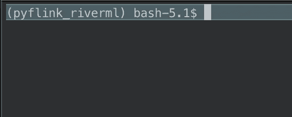
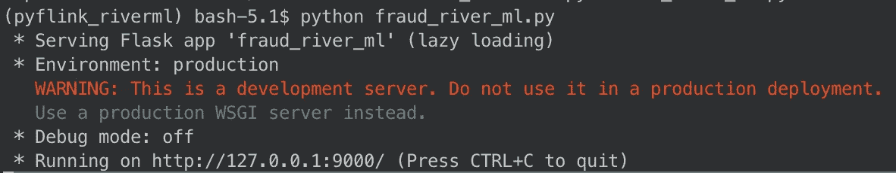

# 利用 River ML 和 Apache Flink 构建信用卡欺诈检测在线培训渠道

> 原文：<https://towardsdatascience.com/building-a-credit-card-fraud-detection-online-training-pipeline-with-river-ml-and-apache-flink-25549b89583d>

## 在本教程中，我们将回顾如何编写实时 python Apache Flink 应用程序来训练一个在线模型


来自[的照片](https://www.pexels.com/photo/natwest-atm-card-45111/?utm_content=attributionCopyText&utm_medium=referral&utm_source=pexels)

在本教程中，我们将使用的主要框架是:

*   [Flink](https://flink.apache.org/flink-architecture.html) :全分布式实时批处理框架
*   RiverML :在线学习图书馆
*   [Flask](https://opensource.com/article/18/4/flask) :用于构建 RESTful 微服务的开源 python 包

**TL；DR:代码在**[**GitHub**](https://github.com/BogdanCojocar/medium-articles/tree/master/pyflink_riverml)**上。**

## **使用 Apache Flink 构建在线培训渠道的优势**

通常我们在处理 ML 管道时至少有两个独立的过程。在第一阶段，我们用一段时间内收集的一些数据训练一个新的 ML 模型。这通常称为批量训练，根据数据量的不同，这可能是一个更慢、计算更密集的过程。在第二阶段，我们采用我们在训练中产生的模型，并在新数据上使用它来标记它，这一过程称为推理。近年来，一种新的范式出现了，它试图将训练和推理结合起来，它被称为**在线训练**。这有两个主要的好处。首先，我们不需要那么多的计算能力来进行训练，因此成本较低，并且 ML 流水线被简化。其次，用更多数据训练的改进的 ML 模型立即可用，并且在某些情况下，例如欺诈检测，这是非常重要的，因为它可以减少假阳性的情况，从而更快更好地检测欺诈。

我们的 ML 管道将有两个组件:使用 Apache Flink 完成的实时摄取部分，以及使用 Flask 和 RiverML 的 ML 服务部分，后者负责在线培训。我们将使用 Apache Flink 来读取数据，因为它是一个低延迟、高度可伸缩的平台，可用于大数据应用程序。Apache Flink 最初是为 JVM 语言开发的，现在对 python 有了很好的支持，这就是我们将在本教程中使用的。所以让我们开始吧。

## 步骤 1:为所有依赖项设置 python 环境

我们将使用`pipenv`在一个单独的环境中安装我们需要的所有 python 包。在我提供的 github 链接中，有一个我们将使用的 Pipfile:

```
[[source]]
url = "[https://pypi.org/simple](https://pypi.org/simple)"
verify_ssl = true
name = "pypi"[packages]
apache-flink = "*"
river = "*"
flask = "*"[dev-packages][requires]
python_version = "3.6"
```

正如你所看到的，我们在 python 版本中使用了`flink, river and flask`，这是一个很好的选择，可以让所有的依赖项相互兼容。

要安装`pipenv`只需运行:

```
pip install --user pipenv
```

然后在我们项目的根目录中，我们可以安装所有的库:

```
pipenv install
```

为了激活环境，我们使用 shell 命令:

```
pipenv shell
```

如果一切运行成功，您应该会看到环境被激活，如下图所示:



## 步骤 2:创建 Apache Flink python 消费者

我们将为这一步创建一个简单的 python 脚本，它将读取输入的信用卡交易，并将调用 RiverML 欺诈检测系统，算法的结果将存储在一个文件中。对于输入数据，我们将使用包含 2013 年 9 月欧洲持卡人信用卡交易的数据集。该数据集显示了两天内发生的交易，其中 284，807 笔交易中有 492 笔欺诈。数据集高度不平衡，正类(欺诈)占所有交易的 0.172%。这些数据可以在 RiverML 库中找到。

我们首先创建一个 Apache Flink 环境，这是我们摄取应用程序的入口点。这适用于我们想要创建的任何 Apache Flink 应用程序:

```
env = StreamExecutionEnvironment.get_execution_environment()
# write all the data to one file
env.set_parallelism(1)
```

作为一个完全分布式的框架，处理可以在多个线程上完成，但对于本教程的范围，我们将只使用一个线程，作为直接结果，只创建一个文件作为输出。

接下来，我们将从信用卡数据中读取一些行，并将它们存储在一个列表中。我们将使用`env.from_collection`将列表读入一个 Flink 数据流。对于本教程来说，这已经足够好了，但在生产环境中，我们可能会从 Apache Kafka 或 AWS Kinesis 等事件存储中读取这些数据，这将确保我们获得连续的记录流:

```
# get the credit card data
dataset = datasets.CreditCard()# create a small collection of items
i = 0
num_of_items = 2000
items = []
for x, y in dataset:
  if i == num_of_items:
    break
  i+=1
  items.append((json.dumps(x), y))credit_stream = env.from_collection(
        collection=items,
        type_info=Types.ROW([Types.STRING(), Types.STRING()]))
```

您还会注意到，当我们创建 Flink 数据流时，我们还需要定义一个模式。在我们的例子中，我们使用代表两个字符串的 `Types.ROW([Types.STRING(), Types.STRING()])`，第一个包含交易值，第二个是标签，可以是 0(无欺诈)和 1(欺诈)。一个交易记录的示例:

```
'{Time=0.0, V21=-0.018306777944153, V20=0.251412098239705, V23=-0.110473910188767, V22=0.277837575558899, V25=0.128539358273528, V24=0.0669280749146731, V27=0.133558376740387, V26=-0.189114843888824, V1=-1.3598071336738, V2=-0.0727811733098497, V28=-0.0210530534538215, V3=2.53634673796914, V4=1.37815522427443, V5=-0.338320769942518, V6=0.462387777762292, V7=0.239598554061257, V8=0.0986979012610507, V9=0.363786969611213, Amount=149.62, V10=0.0907941719789316, V12=-0.617800855762348, V11=-0.551599533260813, V14=-0.311169353699879, V13=-0.991389847235408, V16=-0.470400525259478, V15=1.46817697209427, V18=0.0257905801985591, V17=0.207971241929242, V19=0.403992960255733}'
```

然后我们使用数据流中的`map`方法来调用欺诈服务。在本教程的后面，我们将回顾微服务的创建和启动，但现在我们需要知道端点是`[http://localhost:9000/predict](http://localhost:9000/predict')`，我们发送的有效负载是`{x: feature, y:label}`:

```
# detect fraud in transactions
fraud_data = credit_stream.map(lambda data: \
        json.dumps(requests.post('[http://localhost:9000/predict'](http://localhost:9000/predict'), \
                   json={'x': data[0], 'y': data[1]}).json()),\ 
                   output_type=Types.STRING())
```

最后我们写出结果。我们可以注意到，我们使用`fraud_data.sink_to`来写入文件。最后，我们还告诉 Flink，我们已经准备好使用`env.execute()`来执行流水线:

```
# save the results to a file
fraud_data.sink_to(
  sink=FileSink.for_row_format(
            base_path=output_path,
            encoder=Encoder.simple_string_encoder())
        .build())# submit for execution
env.execute()
```

该文件应包含`ROCAUC`指标和结果，false 表示没有检测到欺诈:

```
{"performance": {"ROCAUC": 0.4934945788156797}, "result": false}
```

## 第三步:编写 Flask 在线培训微服务

我们将构建一个标准的 REST 服务来包装 ML 欺诈模型。这样做通常是为了让算法与摄取层松散耦合。如果我们需要部署另一个版本的模型，我们只需要在不干扰 Flink 消费者的情况下更新微服务。

最初，我们创建一个包含所有 ML 对象的类，我们将使用这些对象与发送到服务的新数据进行交互。`model`由一个标准定标器和一个逻辑回归分类器组成，前者将数据转换为零均值和单位方差，后者是检测欺诈等二元任务的最佳选择。我们还使用`ROCAUC`度量来确定算法在当前迭代中的表现。

```
class RiverML:
    # fraud detection model
    model = compose.Pipeline(
        preprocessing.StandardScaler(),
        linear_model.LogisticRegression()
    ) # ROCAUC metric to score the model as it trains
    metric = metrics.ROCAUC()
fraud_model = RiverML()
```

接下来，我们实际编写预测端点。这将是一个`POST`，因为我们需要从用户那里检索数据。这里有几个重要的步骤。`fraud_model.model.predict_one(x_data)`将对新交易进行预测。正如我们稍后将看到的，最初的预测不会很好，但是随着越来越多的数据被输入到模型中，它将给出更好的结果。然后，我们使用`fraud_model.metric.update(y_data, y_pred)`来计算`ROCAUC`指标，使用`fraud_model.model.learn_one(x_data, y_data)`来更新带有正确标签的模型。如你所见，预测和学习都在一个应用程序中完成。

```
[@app](http://twitter.com/app).route('/predict', methods=['POST'])
def predict():
    # convert into dict
    request_data = request.get_json()
    x_data = json.loads(request_data['x'])
    y_data = json.loads(request_data['y']) # do the prediction and score it
    y_pred = fraud_model.model.predict_one(x_data)
    metric = fraud_model.metric.update(y_data, y_pred) # update the model
    model = fraud_model.model.learn_one(x_data, y_data) return jsonify({'result': y_pred, 'performance': {'ROCAUC': fraud_model.metric.get()}})
```

最后，我们发回一个 JSON，其中包含实际的预测和模型的表现。

## 第四步:全部运行

要运行我们刚刚编写的 ML 管道，首先我们需要运行 flask 应用程序。要在单独的终端运行中这样做:

```
python fraud_river_ml.py
```

您应该会看到类似下图的内容，flask 告诉我们该服务可用:



现在，我们还可以在单独的终端窗口中运行 Apache Flink 消费者:

```
python flink_consumer.py --output data
```

这个 python 脚本将使用`--output`参数来定义我们存储结果的位置。这应该需要一分钟左右的时间，但是在这之后，脚本将完成运行，我们应该会在我们的位置找到一个文件。再次请注意，在生产环境中，flink 消费者脚本不应该停止运行，因为它会消耗无限的数据。

如果我们查看输出文件，我们将会看到模型是如何随时间演变的。第一次迭代将有`ROCAUC` -0.0:

```
{"performance": {"ROCAUC": -0.0}, "result": false}
{"performance": {"ROCAUC": -0.0}, "result": false}
{"performance": {"ROCAUC": -0.0}, "result": true}
{"performance": {"ROCAUC": -0.0}, "result": false}
{"performance": {"ROCAUC": -0.0}, "result": true}
{"performance": {"ROCAUC": -0.0}, "result": false}
{"performance": {"ROCAUC": -0.0}, "result": false}
{"performance": {"ROCAUC": -0.0}, "result": false}
{"performance": {"ROCAUC": -0.0}, "result": false}
{"performance": {"ROCAUC": -0.0}, "result": false}
```

但是，随着我们将越来越多的数据输入逻辑回归算法，这种情况将会得到改善:

```
{"performance": {"ROCAUC": 0.4992462311557789}, "result": false}
{"performance": {"ROCAUC": 0.4992466097438473}, "result": false}
{"performance": {"ROCAUC": 0.4992469879518072}, "result": false}
{"performance": {"ROCAUC": 0.4992473657802308}, "result": false}
{"performance": {"ROCAUC": 0.49924774322968907}, "result": false}
{"performance": {"ROCAUC": 0.4992481203007519}, "result": false}
{"performance": {"ROCAUC": 0.499248496993988}, "result": false}
{"performance": {"ROCAUC": 0.4992488733099649}, "result": false}
{"performance": {"ROCAUC": 0.49924924924924924}, "result": false}
```

就是这样！我希望你喜欢这个教程，并发现它很有用！我们看到了如何使用 Apache Flink 编写 python 应用程序，如何使用 River ML 训练在线分类器，以及如何通过结合训练层和推理层来降低成本。这是可靠和可扩展的大数据 ML 应用程序的主干，我们可以在众多提供可扩展基础设施的云提供商(如 AWS、GCP 或 Azure)之一的生产中部署这些应用程序。