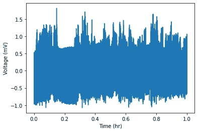
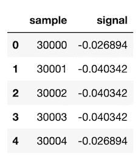
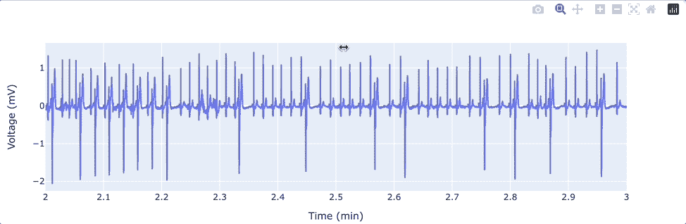
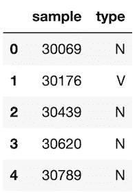
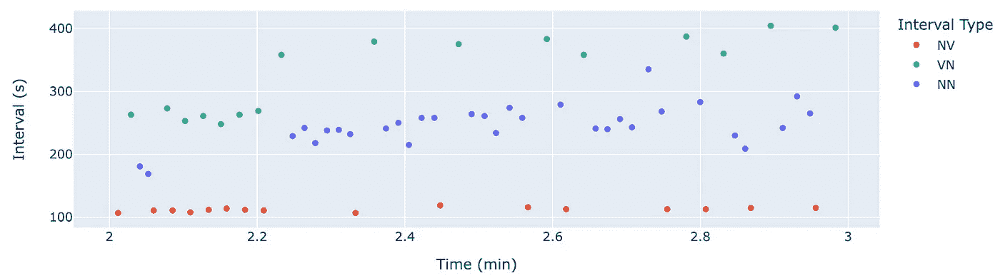
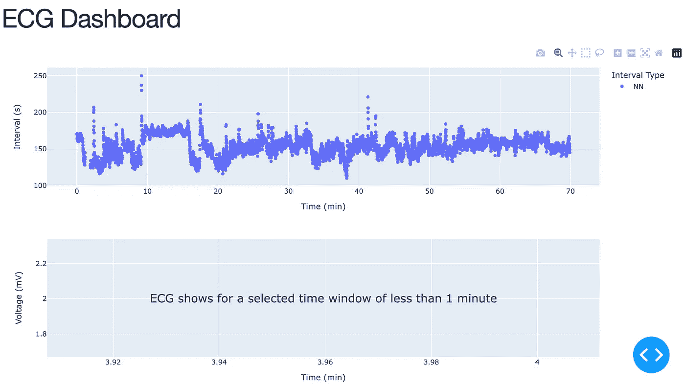
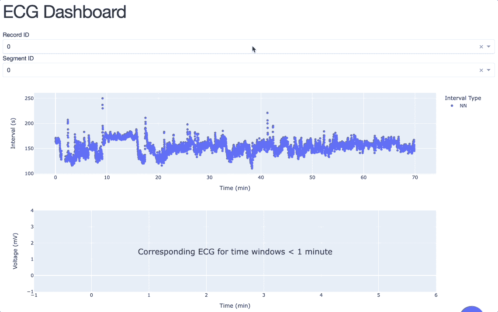
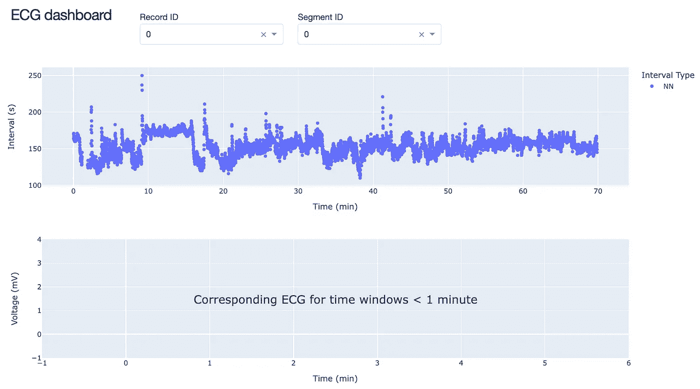
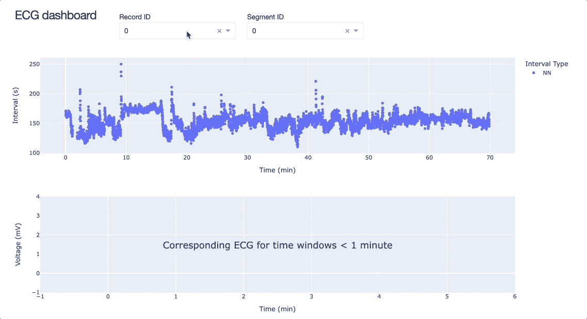
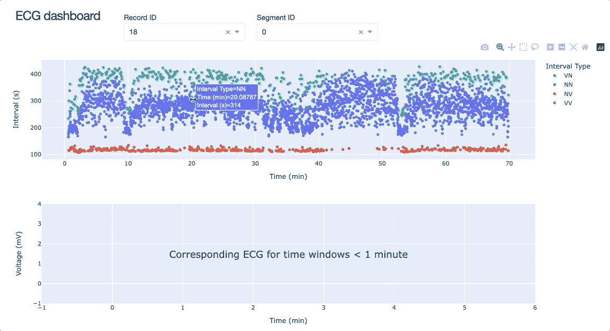

# 在 Plotly Dash 中构建仪表板

> 原文：<https://towardsdatascience.com/building-a-dashboard-in-plotly-dash-c748588e2920>

## 在生理网上浏览数千份心电图记录


Shutterstock: ID1855544260

在这篇文章中，我将分享在 [Plotly Dash](https://dash.plotly.com/) 中构建交互式仪表盘(app)的过程，以探索海量的在线数据集。我们将使用来自 Physionet [1，2]上的 [Icentia11k](https://physionet.org/content/icentia11k-continuous-ecg/1.0/) 数据库的心电图(ECG)记录，经许可使用。这篇文章的目的是帮助初学者建立他们的第一个仪表板，同时激励更有经验的读者为像 Physionet 这样的大规模在线数据集建立仪表板。

我们将建立的应用程序目前托管在[这里](https://ecg-dashboard.thomasbury.net/)。这个应用的源代码可以在这个 [Github 仓库](https://github.com/ThomasMBury/ecg-dashboard)中找到，还有本文中显示的应用的后续版本的代码。

**本帖组织如下:**

1.  动机:心电图是大数据
2.  第一步:加载和打印数据的函数
3.  Dash 样板代码:运行我们的第一个应用程序
4.  添加组件:图形
5.  添加组件:下拉菜单
6.  仪表板布局
7.  回调函数:让应用程序组件相互交流
8.  向全世界展示我们的应用程序！

# 动机:心电图是大数据


亚历山大·辛恩在 [Unsplash](https://unsplash.com?utm_source=medium&utm_medium=referral) 上拍摄的照片

心电图(ECG)是监测心脏健康的一种方便、无创的方法。随着可穿戴设备的出现，心电图可以一次持续几天，从而可以收集前所未有的大量数据。

具体有多少数据？典型的 ECG 记录频率约为 250Hz(即每秒 250 次测量)。如果患者连续 7 天佩戴监护仪，监护仪将产生 7*24*60*60*250=151，200，000 个数据点！

Physionet 有一个[公共数据库](https://physionet.org/content/icentia11k-continuous-ecg/1.0/)，其中有来自 11，000 名患者的多日心电图记录，由 [Icentia](https://www.icentia.com/) 公司提供。现在我们大约有 10 个数据点。我认为公平地说，这使我们进入了“大数据”的领域。

直接绘制如此大量的数据是不切实际的。一个小时内绘制的心电图，更不用说一整周了，显示的是一整面墙的墨迹:



[Icentia11k 生理网数据库](https://www.physionet.org/content/icentia11k-continuous-ecg/1.0/)中 0 号患者的第一小时心电图。单个图的心电图太多了！

这就是交互式可视化派上用场的地方。它们允许我们无缝地缩放和平移记录的不同部分。通过这种方式，我们可以在记录中的任何地方查看 ECG 行为，但以秒为单位的时间比以小时为单位的时间更合适。将它集成到仪表板中，我们可以添加其他功能，如下拉框，以便在不同的患者之间进行选择。此外，我们可以添加其他面板来查看除 ECG 之外的患者特征。如果这听起来很有趣，请继续阅读，因为我们在 [Physionet](https://physionet.org/content/icentia11k-continuous-ecg/1.0/) 数据库中构建了一个(最小)仪表板来探索患者的心脏动力学。

# 第一步——编写加载和可视化数据的基本函数

在我们创建仪表板之前，我们应该写下函数来加载和显示我们希望在仪表板上看到的数据。如果你想跟随代码，在一个新的目录中建立一个虚拟环境(例如使用 *venv* )并安装 Python 包 *numpy、pandas、plotly、dash* 和 *wfdb* 。这可以通过以下方式实现

现在创建一个名为`app.py`的 Python 脚本，并导入包，如下所示

Physionet 数据库包含两种形式的 ECG 数据:1)原始信号和 2)心跳注释。我们将在仪表板上显示这两种情况。

**加载原始 ECG 信号。**该数据库包含 11000 名*患者*，每个患者有大约 50 个*心电图段*。利用 Python 包 [wfdb](https://pypi.org/project/wfdb/) ，我们可以编写一个函数来加载特定患者、时间段和时间间隔的 ECG 数据:

例如，让我们在 2 分钟和 3 分钟之间加载患者 18 的心电图，分段 0:



这将使用一行程序从 Physionet 中检索 ECG 数据！我们现在需要一个函数来创建这些数据的交互式可视化:

用`fig = make_ecg_plot(df_ecg)`执行这个函数现在产生一个对象，它将成为我们仪表板的 ***组件*** 。要查看该图，您可以使用`fig.write_html('my_fig.html')`保存并在网络浏览器中打开。您应该会看到类似这样的内容:



患者 18 从第 2 分钟到第 3 分钟的交互式心电图图形可视化。

正如我们所见，当我们想要查看较长时间间隔的心电图时，心电图会变得非常密集。只关注节拍注释会更方便:

**加载节拍注释。**这些数据包含记录中每次心跳的发生时间和类型。我们将把重点限制在正常的窦性搏动(标为“N”)和室性早搏(标为“V”)。和以前一样，我们编写一个函数来加载这些数据:

让我们像以前一样加载相同的心电图。这次接收出现在特定样本号的节拍类型:



我们将通过绘制连续心跳之间经过的时间来可视化这些数据:

现在运行`make_beat_interval_plot(df_beats)`返回下图，对应于之前显示的原始 ECG 图:



患者 18 从第 2 分钟到第 3 分钟的心搏间隔图。

请注意，该图包含的数据要少得多。因此，我们将使用这种类型的图来扫描长时间内的心电图，并使用之前显示的原始心电图图来研究较短时间内发生的心脏动力学。

现在我们有了提取和绘制数据的函数，是时候开始实际构建应用程序了！

# 破折号样板代码

我们将使用以下样板代码作为起点:

属性允许我们使用预定义的 CSS 配置。我们将使用 Chris Parmer 提供的 [Dash Styleguide](https://codepen.io/chriddyp/pen/bWLwgP.css) 。

如果您将这个 Python 脚本保存为`app.py`，并使用`python app.py`运行它，您应该会看到以下消息

```
Dash is running on http://127.0.0.1:8050/
```

现在，在您的网络浏览器中访问[http://127 . 0 . 0 . 1:8050](http://127.0.0.1:8050/)/，您应该会看到文本“我的仪表板”。如果是这样，您已经有了一个可以运行的仪表板！现在是时候开始构建它了。

# 添加组件:图形

我们将从把我们早先做的数字相加开始。现在，我们将为一个默认的患者和段号制作数字(最终我们将能够用*回调函数和*来改变它，我们将在后面定义)。当用户首次启动应用程序时，将显示该默认患者。

我们现在已经制作了图形对象，但是为了在 Dash 应用程序上显示图形，我们必须将它放在`app.layout`的内容分割器(Div)中。我们列出组件的顺序就是它们在应用程序中出现的顺序。我们还为每个图形分配了一个`id`，这在我们使用*回调函数*时会变得很重要。

到目前为止，将代码放在一起(`[app_v1.py](https://github.com/ThomasMBury/ecg-dashboard/blob/main/medium/app_v1.py)`)并运行它，应该会产生一个如下所示的应用程序:



应用程序版本 1:显示交互式图形。

# 添加组件:下拉菜单

Dash 中的[下拉菜单](https://dash.plotly.com/dash-core-components/dropdown)有很多选项。需要指定的关键是`id`、默认的`value`，当然还有`options`。

以下代码将创建一个下拉框，选项范围从 0 到 10999，可用于选择数据库中的患者编号。

请注意，我们将默认值设为患者 0，这与我们之前的默认值一致。

就像图一样，下拉菜单被认为是应用程序的*组件*，必须放在`Div`中。我们将使用额外的`html`组件为下拉菜单添加一个标题。完整的 Div 如下所示

我们可以创建一个类似的 Div，其中包含一个 ECG 段号的下拉菜单。在我们的`app.layout`中列出这些 div，给出了应用程序的更新版本(`[app_v2.py](https://github.com/ThomasMBury/ecg-dashboard/blob/main/medium/app_v2.py)`)，如下所示:



应用程序版本 2:包含下拉菜单(仍然没有连接到应用程序的其余部分)

# 仪表板布局

我们 app 目前的布局并不理想。下拉菜单不必要的宽，而且放置不当。幸运的是，我们可以使用`style`属性修改每个 Div 的布局属性。它接受任意数量的 CSS 属性/值对，其中有[多个](https://www.dofactory.com/css/properties)。

对于这个应用程序，我们将调整 div 的高度、宽度和填充，以重新组织布局。它们可以被指定为绝对值，或基于用户屏幕尺寸的百分比。

让我们将标题和两个下拉菜单放在应用程序顶部的同一层。我们将标题 Div 的宽度设置为 200px，这足以容纳文本，下拉菜单的宽度设置为用户屏幕宽度的 20%。我们将设置 60px 的固定高度。选项`'display’:’inline-block’`将分隔线置于直线上。

我们的`app.layout`现在看起来是这样的:

对代码(`[app_v3.py](https://github.com/ThomasMBury/ecg-dashboard/blob/main/medium/app_v3.py)`)进行这样的调整会产生一个类似于下面这样的应用程序:



应用程序版本 3:下拉菜单和标题的新布局

现在我们已经对布局进行了排序，让我们开始连接应用程序的不同组件。目前下拉菜单与应用程序的其余部分是断开的。是时候介绍一下*回调函数了。*

# 回调函数:让应用程序组件相互交流

回调函数是仪表板最强大的功能之一。它们允许用户在与仪表板交互时获得仪表板的实时更新。


照片由 [Quino Al](https://unsplash.com/@quinoal?utm_source=medium&utm_medium=referral) 在 [Unsplash](https://unsplash.com?utm_source=medium&utm_medium=referral) 上拍摄

编写回调函数时，需要仔细考虑函数的`Input`和`Output`应该是什么。例如，我们的下拉菜单中的一个值的变化应该反映在我们的图中。这里，`Input`是下拉菜单中的新值，`Output`是绘图。

回调函数列在`app.layout`之后。它们的基本结构如下:

`@app.callback`内部的部分被称为函数*装饰器*。它使用相关的`id`和`property`将函数的输入和输出链接到应用程序的组件。

`output_id`和`input_id`是我们已经为应用程序的每个组件设置的 id。例如，患者下拉菜单的 ID 是`'dropdown_patient_id'`。

`input_property`和`output_property`是我们希望捕获的那个组件的属性。常见的例子包括用于选择下拉菜单值的`'value'`和用于选择绘图图形对象的`'figure'`。我们还将看到`'relayoutData'`专门捕捉绘图图形的当前布局。

关于回调函数的更多细节，请查看 Dash 教程。

对于我们的应用程序，我们将编写两个回调函数。第一个将连接下拉菜单节拍间隔绘图。第二个将把心搏间期图的*布局*连接到 ECG 图。

## I)下拉菜单中变化的回调函数

当用户改变我们的下拉菜单中的一个值时，我们希望节拍间隔图相应地更新。这将包括从 Physionet 加载适当的数据，然后创建绘图。这就是回调函数要做的事情。

这个回调函数的输入和输出是什么？我们的输入是来自 ID 为`'dropdown_record_id'`或 ID 为`'dropdown_segment_id'`的下拉菜单的`'value'`。输出将是 ID 为`'fig_intervals'`的人物的`'figure'`属性。

因此，回调装饰器(函数前的位)是

现在来写函数——这基本上是实现我们已经写好的函数。给定一个患者 ID，我们希望从生理网加载适当的数据，然后绘制搏动间隔图:

现在运行应用程序(`[app_v4.py](https://github.com/ThomasMBury/ecg-dashboard/blob/main/medium/app_v4.py)`)，我们看到更新下拉菜单产生了预期的效果——我们现在可以查看数据库中 11，000 名患者中任何一名患者的搏动间隔图！



应用程序版本 4:下拉菜单现在连接到节拍间隔图

## ii)绘图布局变化的回调函数

最后，我们将把心电图图放入图片中。我们希望当用户在“心跳间隔”图中选择足够小的时间窗口时，显示该图。因此我们将编写一个回调函数来检测节拍间隔图的 ***布局数据*** 的变化。

该布局数据从绘图图形的属性`'relayoutData'`获得。该回调函数还需要下拉菜单中的当前值，以便加载适当的 ECG 数据。因此，这个函数的装饰器是

当此功能被触发时，我们希望它加载并绘制所提供的 ECG 数据:

1.  触发是由于`fig_intervals`的 x 轴边界发生变化。
2.  新的界限导致时间窗口长度小于 1 分钟

如果触发是由于其他点击(如改变下拉菜单或其他布局选项)，我们可以使用`exceptions.PreventUpdate()`来“取消”回调函数。这包含在下面的函数中(有一些细微差别，我就不细说了):

使用这个新的回调函数(`[app_v5.py](https://github.com/ThomasMBury/ecg-dashboard/blob/main/medium/app_v5.py)`)运行应用程序，我们现在能够查看短于 1 分钟的时间窗的 ECG 图:



应用程序版本 ECG 图现已连接到搏动间隔图的布局

通过这一回调功能，应用程序仅在实际观察有用时加载高分辨率 ECG 数据(短时间内)，从而节省处理时间。

# 托管我们的应用

我们可以在本地运行我们的应用程序供个人使用，没有问题。然而，就其现状而言，与合作者共享并不容易，除非他们愿意建立自己的虚拟环境并通过 Python 运行。这些 Dash 应用程序的美妙之处在于，我们可以在*托管*它们，让任何有互联网连接的人都可以使用它们！


照片由 [NASA](https://unsplash.com/@nasa?utm_source=medium&utm_medium=referral) 在 [Unsplash](https://unsplash.com?utm_source=medium&utm_medium=referral) 拍摄

我们将与 Heroku 合作托管我们的应用，Heroku 是一个提供免费托管非商业应用的云平台。在这里，我将带你通过这些步骤，让这个应用程序托管遵循 Dash 提供的这些[指令](https://dash.plotly.com/deployment)。

***更新 2023 年 1 月 2 日:*** *Heroku 不再有自由层，所以我用* [*铁路*](https://railway.app/) *代替。您可以遵循下面的步骤 3–8，然后将存储库推送到 Github。从那里，我有一篇* [*文章*](https://medium.com/@thomasbury/migrating-your-dash-app-from-heroku-to-a-free-platform-afcda6693bc2) *关于如何建立铁路。*

1.  [**注册**](https://signup.heroku.com/) **成为 Heroku** 的帐户

2.**安装**[**Heroku CLI**](https://devcenter.heroku.com/articles/heroku-cli)。这允许我们从命令行与 Heroku 交互。

3.**为你的`app.py`文件创建一个干净的目录**，并用

```
git init
```

4.**创建一个虚拟环境并激活它。**我们将使用 [*venv*](https://docs.python.org/3/library/venv.html) 模块创建一个名为 *venv 的虚拟环境。*

```
python -m venv venv
source venv/bin/activate
```

5.**安装应用依赖项。**最好先用以下代码更新 pip

```
pip install --upgrade pip
```

正如我们所见，我们的应用程序需要以下 Python 包:

```
pip install numpy
pip install pandas
pip install plotly
pip install dash
pip install wfdb
```

我们还需要 [gunicorn](https://gunicorn.org/) 包，它使所有这些 Python 进程能够在 Heroku 服务器上运行。

```
pip install gunicorn
```

6.**创建 requirements.txt 文件。我们刚刚安装的 Python 包和它们的依赖项需要在一个`requirements.txt`文件中列出。这可以通过以下命令实现**

```
pip freeze > requirements.txt
```

7.**创建一个. gitignore 文件。这表明我们不希望 git 跟踪哪些文件。我们可以创建并打开文件**

```
touch .gitignore
open .gitignore
```

现在，为我们将不跟踪的文件输入以下行:

```
venv 
*.pyc 
.DS_Store 
.env
```

8.创建一个过程文件。这是部署所必需的。创建文件并使用打开它

```
touch Procfile
open Procfile
```

并输入以下文本

```
web: gunicorn app:server
```

您现在应该有一个包含`app.py`、`requirements.txt`、`.gitignore`、`Procfile`和`venv`的目录。如果是这样，你已经准备好发送这个应用程序到 Heroku！


安妮·斯普拉特在 [Unsplash](https://unsplash.com?utm_source=medium&utm_medium=referral) 上拍摄的照片

9.**创建 Heroku app。**使用 Heroku CLI 创建一个新应用程序，命令如下

```
heroku create ecg-dashboard-medium
```

其中`ecg-dashboard-medium`是您的应用程序的名称。如果你打开你的 Heroku [应用](https://dashboard.heroku.com/apps)，你应该会看到你的应用被列出来了。

10.提交更改并将 git 存储库推送到 Heroku。这是通过以下方式实现的

```
git add .
git commit -m "Our first deployment to Heroku"
git push heroku main
```

在终端输出的末尾，您应该会看到

```
https://ecg-dashboard-medium.herokuapp.com/ deployed to Heroku
```

这是您的应用程序的 URL！如果你访问它，你应该看到你的应用程序启动和运行。


照片由[阿莱西奥·索格蒂](https://unsplash.com/@asoggetti?utm_source=medium&utm_medium=referral)在 [Unsplash](https://unsplash.com?utm_source=medium&utm_medium=referral) 上拍摄

# 结论

恭喜你坚持到了最后！在这篇文章中，我们从头到尾看到了如何在 Plotly Dash 中构建和部署一个仪表板。这包括编写函数来加载和绘制我们的数据，将我们的图形作为应用程序的组件，设置布局，编写回调函数，最后，将我们的应用程序部署到公共服务器。我鼓励你现在就去构建你自己的应用——祝你好运！

# 承认

感谢 Icentia 允许本出版物使用 Icentia11k 数据集。除非另有说明，所有图片均为作者所有。

[1]谭，s .，奥尔蒂斯-加涅，s .，博登-加尼翁，n .，费克图，p .，库维尔，a .，本吉奥，y .，&科恩，J. P. (2022)。Icentia11k 单导联连续原始心电图数据集(1.0 版)。*生理网*。

[2] Goldberger，a .，Amaral，l .，Glass，l .，Hausdorff，j .，Ivanov，P. C .，Mark，r .，…，和 Stanley，H. E. (2000 年)。生理银行、生理工具包和生理网:复杂生理信号新研究资源的组成部分。循环[在线]。101 (23)，第 e215–e220 页。