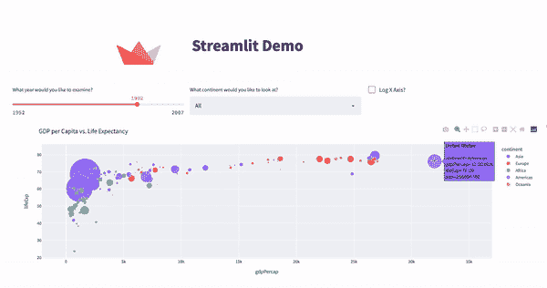
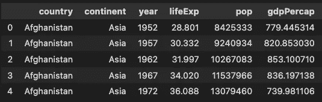
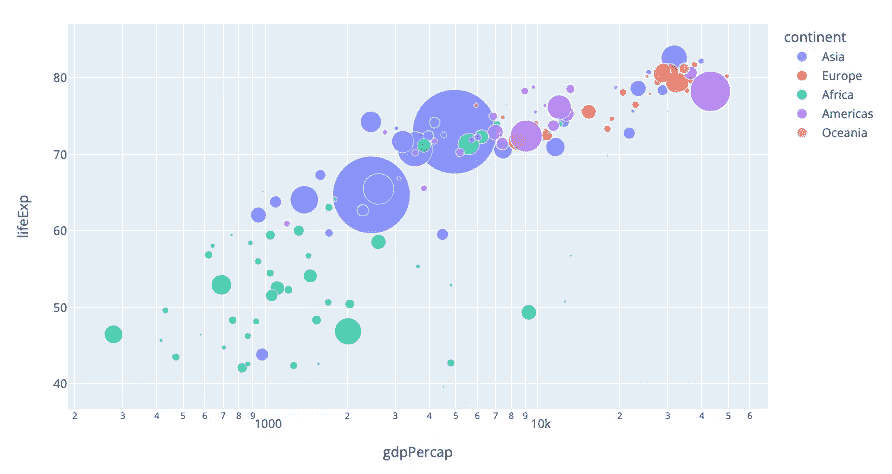
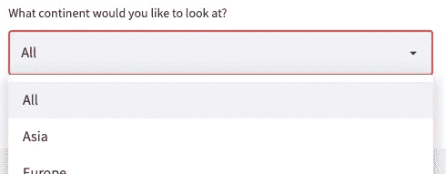
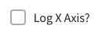
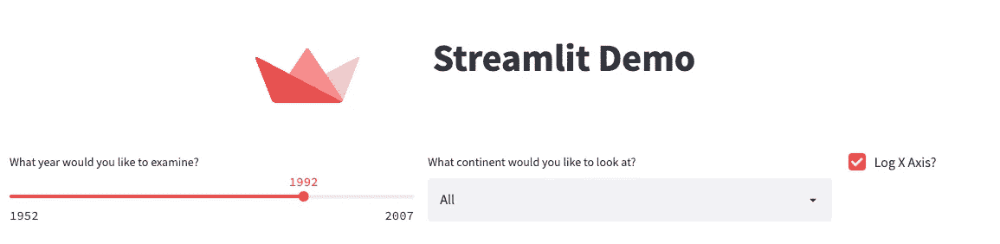

# 使用 Streamlit 在 5 分钟内构建一个仪表板

> 原文：<https://towardsdatascience.com/building-a-dashboard-in-under-5-minutes-with-streamlit-fd0c906ff886>

## 用 Python 构建数据科学应用程序的分步指南

Streamlit 是一个开源框架，允许数据科学家在几分钟内将 python 脚本转化为可共享的 web 应用程序



最终产品—作者的 GIF

本文概述了如何使用 [Streamlit](https://streamlit.io/) 创建一个交互式仪表板的简单示例，如上所示。Streamlit 与 [Plotly](https://plotly.com/python/) 图形库集成得非常好，因此使用它的经验是一个额外的奖励，并使向 Streamlit 的过渡非常无缝。

# 页眉和使用图像

在本节中，我们来看看插入 Streamlit 应用程序的标题和图像所涉及的代码。为此，我们需要使用[列](https://docs.streamlit.io/library/api-reference/layout/st.columns)特性 ***st.columns()*** ，它允许我们插入并排排列的容器。在这些列中，我们使用 ***st.image()*** 和 ***st.title()*** 来插入所需的内容。插入不同样式的文本还有许多其他选项。


由下面的代码生成的仪表板—图片由作者提供

# 插入图并根据用户输入过滤数据

在 Streamlit 中插入交互式绘图的最简单方法是使用 **Plotly** ，这是 Python(和其他语言)中的数据可视化库。当在 Plotly 中创建了一个图时，使用***ST . plot ly _ chart()***在 Streamlit 中显示它是非常容易的。

在本例中，我们将使用 Plotly 内置的预期寿命与 GDP 数据集，因为它有许多变量可以很好地展示 Streamlit 功能。



作者提供的数据图像



示例 plottly Graph—作者提供的图片

根据这些数据，我们可以使用 Plotly 创建一个非常好的绘图，但是我们希望使用 Streamlit 来允许用户更改数据的显示方式。特别是:

*   使用 ***st.slider()*** 允许用户选择要显示哪一年的数据


作者图片

*   使用***ST . select box()***允许用户选择显示哪个洲



作者图片

*   使用***ST . checkbox()***允许用户选择是否记录 x 轴



作者图片

## 过滤数据

为了过滤数据，让我们首先包括如上所示的滑块、选择框和复选框。同样，我们将使用 ***st.columns()*** 使元素并排出现，而不是垂直出现，这是 Streamlit 中的默认设置。

这里要注意的是，与前面看到的 ***st.image()*** 和 ***st.title()*** 不同，这里的 ***st.slider()*** ，***ST . select box()***和***ST . checkbox()***所有的*返回值*都是基于用户输入的内容，需要赋值给变量，如

因此，到目前为止的所有代码，我们的仪表板现在看起来像这样👇



作者图片

因此，下一步是加载数据，获取这些用户输入并生成一个图。

## 读入数据并应用过滤器

读入数据后，我们可以应用用户给我们的过滤器。

每次用户更新其中一个输入，应用程序都会刷新以反映更新。更多关于如何优化这个稍后！

# 产生和显示图

为了生成一个绘图，我们可以像在 Jupyter 笔记本中一样使用 Plotly，只是不再使用 ***fig.show()*** 来显示图像，而是使用***ST . plot ly _ chart()***来显示仪表板中的绘图。

# 最终产品

在大约 50 行代码中，我们有了一个全功能的仪表板🎉


作者 GIF

完整的代码可以在我的 GitHub 上查看[这里](https://gist.github.com/rian-dolphin/72884daf61cce654f6c7f883b99a53ca)👈

# 运行您的 Streamlit 应用

已经编写了构建一个可爱的仪表板的所有代码，现在让我们看看如何部署它。部署 Streamlit 应用程序最简单的方法是在您的本地机器上。

为此，只需打开您的命令行(终端等。)，导航至保存您的的目录。py 文件并运行如下所示的命令(用您的文件名替换 *my_file_name.py* )

```
streamlit run my_file_name.py
```

您的应用程序现在应该在默认的 web 浏览器中打开，作为一个完全交互式的页面，您可以随意摆弄🤸‍♀️

# 一些额外的提示

*   在代码的开头使用这个命令，我们可以让仪表板填满屏幕的整个宽度。有时，如果没有这一点，如果你在一个宽显示器上观看，你就不能充分利用空间。

```
st.set_page_config(layout="wide")
```

*   在 Streamlit 中，您可能有多个功能，其中一些不受某些用户输入的影响。当然，如果输入没有改变，就必须重新运行一个函数，这并不是最佳选择！ ***@st.cache*** ，如下所示，告诉 Streamlit 在重新运行那个特定的函数之前检查输入是否已经改变，这样可以节省你很多时间。文档可在[这里](https://docs.streamlit.io/library/advanced-features/caching)获得。

```
@st.cache
def my_function(i1, i2, ...):
     x = ...
     return x
```

如果你从这些文章中获得了价值，并且还不是 medium 会员，考虑使用下面的链接注册 Medium！👇

<https://medium.com/@riandolphin/membership> 