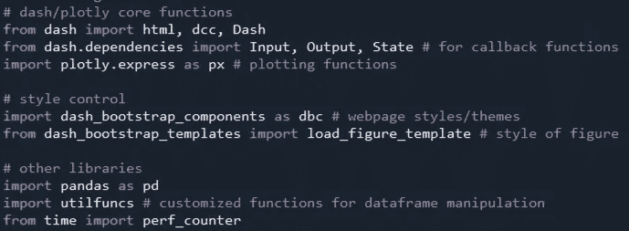
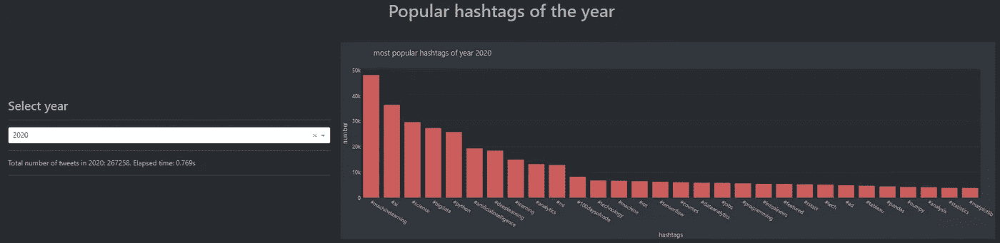
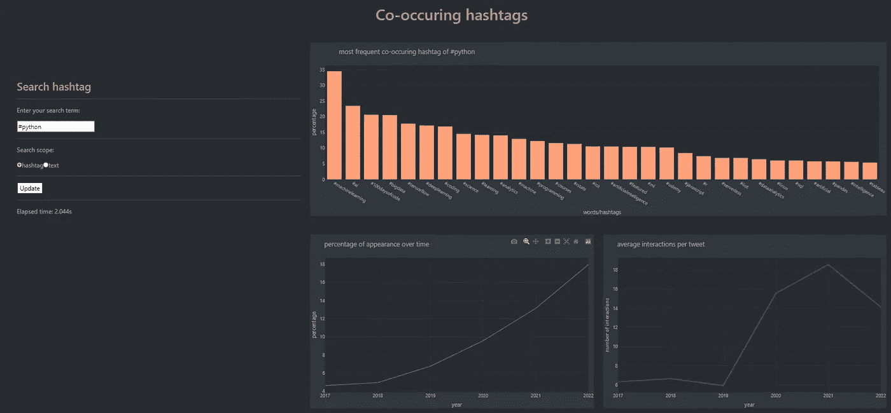
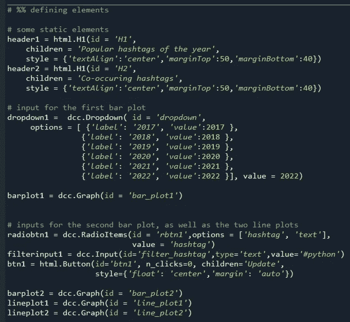
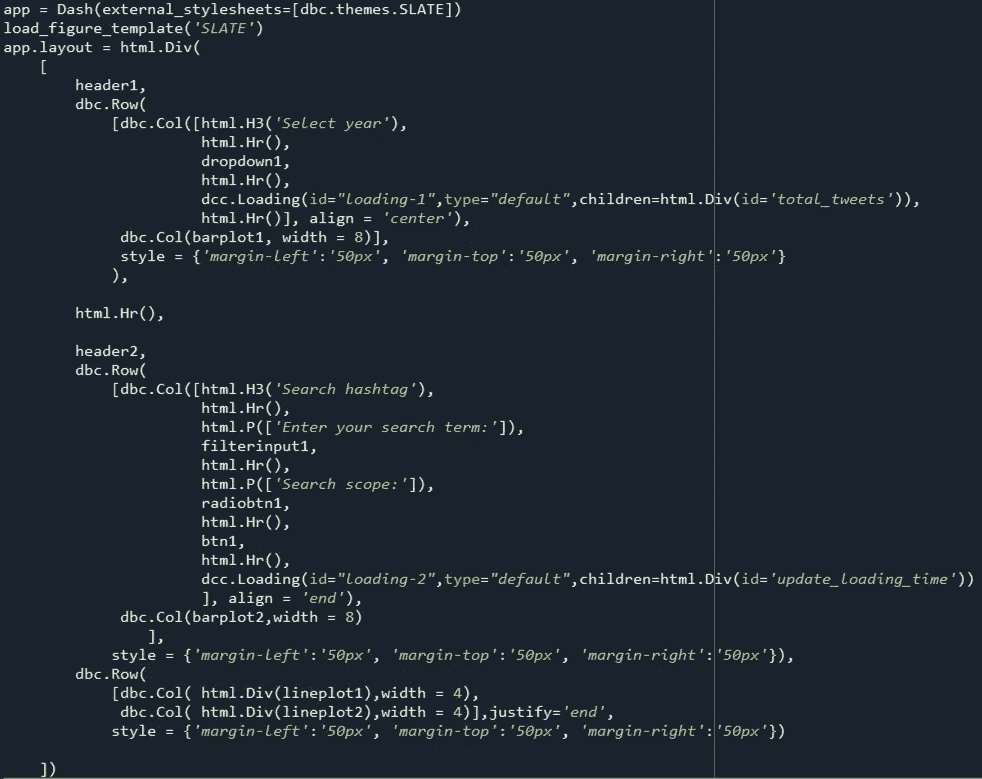
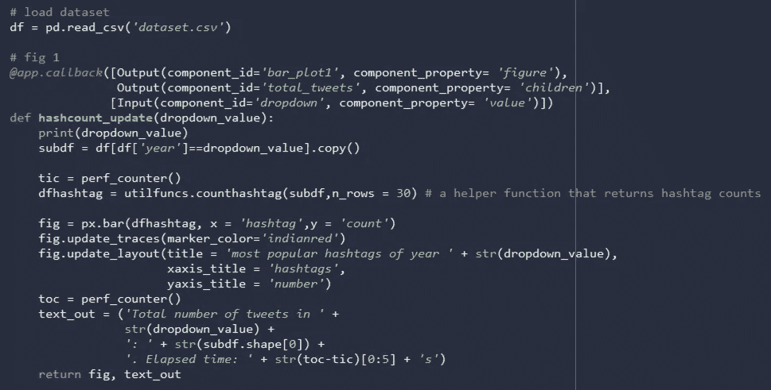
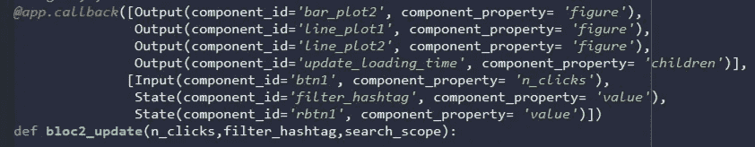
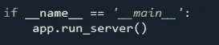
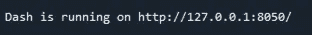

# 构建跟踪数据科学术语的仪表板

> 原文：<https://towardsdatascience.com/building-a-dashboard-to-track-data-science-buzzwords-fcfdc21dc84a>

## 一种数据驱动的方式来优先关注社交媒体

作者图片

仪表板应用程序近年来在公共场所和组织内越来越受欢迎。与书面报告相比，在面对高度复杂的主题时，仪表板为用户提供了开放式的、通常是更具吸引力的体验。它将受众的角色从被动的接受者转变为主动的探索者，从而促使他们做出明智的决策。

数据科学以其复杂性和快速的技术进步而闻名。对于数据爱好者来说，建立一个仪表板来帮助人们了解数据世界的最新趋势是一个很酷的想法。对于数据科学初学者来说，这样的仪表板也可以用于教育目的(例如，“从受欢迎的角度来看，我应该选择学习哪个深度学习框架/云平台？”).在这篇博文中，我将根据我通过 Twitter API 收集的数据集，浏览我制作的一个仪表板应用程序，以可视化 Twitter 上的数据科学术语。我跳过了数据收集部分，但是如果你感兴趣，你可以看看我之前关于学术推文分析的文章。

对于这个项目，我使用 Dash 和 Plotly。Dash 是一个用于快速构建数据应用的低代码框架。它通过抽象出所有底层技术和协议，使得构建具有交互式数据可视化的全栈 web 应用程序变得极其简单。Plotly 是一个绘图库，用于创建基于 web 的交互式可视化，通常在 Dash 应用程序中使用(尽管它也可以在 Jupyter notebook 中以独立的方式使用)。在反思创建应用程序的过程时，我发现将整个项目简化为三个相对独立的步骤是一个很有帮助的策略，每个步骤对应一个代码块。

1.  **定义 web 应用中的元素**。在这一步中，我们确定了应用程序的目标，并定义了基本元素，具体来说:1)应用程序向用户呈现了什么信息(例如，图形、文本)，以及 2)应用程序从用户那里收到了什么指示(例如，下拉菜单、单选按钮)。换句话说，我们关注应用程序的输入和输出。
2.  **定义网页的布局和风格**。在第二步中，我们将元素组织成有意义且用户友好的部分。事实上，第 1 步和第 2 步都是应用程序的“前端”,可以压缩到一个巨大的代码块中，但将它们分开处理可以大大简化代码的结构，并使未来的调整更容易。
3.  **定义元素的行为。**在这一步中，我们定义了 web 应用程序在用户触发事件时的动作。Dash 提供了回调函数机制，作为应用程序中可见元素(输入和输出)和后台计算(接收输入和返回输出的函数)之间的接口。

**数据集。**

该数据集由 144 万条包含关键词“数据科学”或“数据科学家”的英文推文组成。数据集中的记录已被匿名化；可能导致识别 twitter 用户身份的信息(例如，tweet_id、user_id、用户句柄、时间戳、地理数据、链接)已被删除。

**代码实现。**

以下是我在这个仪表板项目中使用的包:

作者图片

**第一步。**

我的目标是在仪表板中实现两个功能块。用户可以在第一个块中探索标签的流行程度，第一个块由一个条形图和一个下拉菜单组成，条形图显示最常用标签的数量，下拉菜单指定年份。

作者图片

第二块允许用户从三个方面探索感兴趣的特定标签: **1)** 与感兴趣的特定标签同时出现的最频繁的标签； **2)** 一段时间内带有该标签的推文数量； **3)** 随着时间的推移，该标签的每条推文参与次数(即平均点赞数+转发数+回复数)。我还包含了一组单选按钮，允许用户搜索与给定 hashtag 同时出现的最常见的非 hashtag 单词。

作者图片

这些元素可以用破折号来定义。 **dcc** 和仪表板。 **html** 子模块:

作者图片

**步骤二。**

在这一步，我们将上面定义的元素捆绑到一个视觉上有意义的布局中。首先，让我们通过调用 **dash 来初始化仪表板应用程序。破折号**构造器。布局可以定义为一个树状的层次结构(更多信息，见官方教程)。为了控制垂直和水平排列，我使用了 dash_bootstrap_components 模块下的 Row()和 Col()类(参见文档[这里的](https://dash-bootstrap-components.opensource.faculty.ai/docs/components/layout/))。external_stylesheets 参数是可选的，它告诉 app 对象以现代的深色外观呈现网页。第二行也是可选的，设置图片的配色方案以与网页保持一致。

作者图片

顺便提一下，代码中的“dcc.loading()”提供了一个很酷的用户友好特性，允许您在应用程序执行一些计算时显示动画加载图标，而相关的可见元素尚未刷新。这在计算耗时(> 0.5 秒)时很有用，因为它可以向用户提供视觉反馈，表明正在进行的计算的状态。

**第三步。**

现在让我们来定义应用程序的动态行为。下面的屏幕截图显示了仪表板第一个功能块的代码:

作者图片

分解一下:

*   **@app.callback** 是一个包装器，将下面的函数修改(“包装”)成一个回调函数。回调函数监听**输入**(下拉菜单，由其 HTML id 指定)。当下拉值发生变化时，包装器中的函数(hashcount_update)将被自动调用，下拉菜单的新值将作为内部函数的输入参数传递。
*   内部函数执行一些计算(创建 hashtag 计数的新数据帧),然后将两个输出传递回包装器。请注意，返回变量的顺序与@app.callback 装饰器中的输出顺序相匹配。
*   看官方教程[这里](https://dash.plotly.com/basic-callbacks)

在第二个块中，我想创建一个回调函数，它可以使用单选按钮和文本框中的信息，但只在单击“更新”按钮时执行。这里，我使用 **State()** 而不是 **Input()** 来传递来自文本框和单选按钮的值。当需要在搜索设置中进行多次更改时，这可以避免不必要的代码执行。

作者图片

**运行应用**

最后，要运行应用程序，只需在代码末尾包含“app.run_server()”:

作者图片

当执行整个脚本时，您会在控制台窗口中发现一些消息，其中应该有这样一行:

作者图片

这是此仪表板应用程序的本地主机地址。如果您将此地址复制并粘贴到浏览器，您将能够打开您的仪表板。就是这样！

我正在我的 [github](https://github.com/FugaDeng/ds_dashboard) 上分享这个应用的代码。不幸的是，由于 Twitter 的再分配政策，我无法直接分享数据集，但幸运的是，使用 Twitter 的 API 很容易获得这些数据。如果您有其他意见/想法，请随时留言。

感谢阅读！