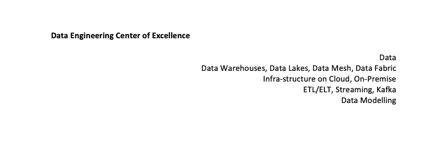
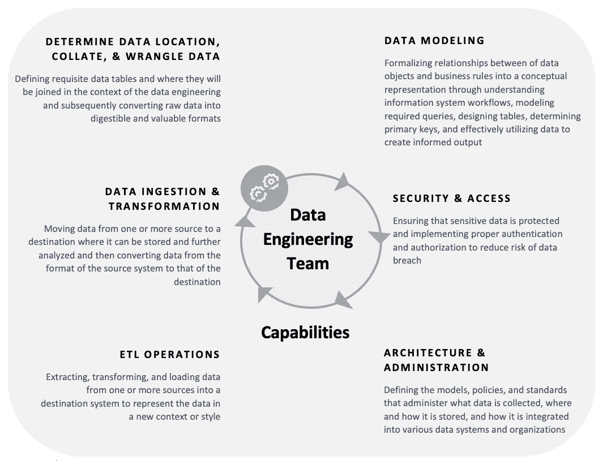

# 建立卓越的数据工程中心

> 原文：<https://towardsdatascience.com/building-a-data-engineering-center-of-excellence-b83d51cedb6a>

## 构建与当前规模相关的有效数据工程实践的基本组件。

作者图片

随着数据的重要性不断增长，变得越来越复杂，对熟练数据工程师的需求从未像现在这样大。但是什么是数据工程，为什么它如此重要？在这篇博文中，我们将讨论一个有效的数据工程实践的基本组成部分，为什么数据工程对今天的企业越来越重要，以及如何建立你自己的数据工程卓越中心！

多年来，我有幸建立、管理、领导和培养了一支规模可观的高绩效数据仓库和 ELT 工程师团队。在我的团队的帮助下，我每年都花大量时间有意识地计划和准备管理我们的数据逐月增长，并满足我们的 *20000 多名全球数据消费者*不断变化的报告和分析需求。我们构建了许多数据仓库来存储和集中从许多 OLTP 源生成的大量数据。我们通过在本地数据仓库和云中创建星型模式来实施 Kimball 方法。

目标是让我们的用户群能够对数据进行快速分析和报告；因此，我们的分析师社区和业务用户可以做出准确的数据驱动型决策。

我花了大约三年时间将数据仓库和 ETL 程序员的**团队** ( *复数*)转变成一个有凝聚力的数据工程团队。

*我在这篇文章中总结了我在建立全球数据工程团队过程中的一些经验，希望数据专业人员和各种技术水平的领导者都能从中受益。*

## 数据工程师的发展

现在是成为数据工程师的最佳时机。在过去的十年中，我们看到企业的觉醒，现在认识到他们的数据是公司的心跳，使数据工程的工作职能，确保准确，当前和高质量的数据流向依赖它的解决方案。

从历史上看，数据工程师的角色是从 ***数据仓库开发人员*** 和 ***ETL/ELT 开发人员*** (提取、转换和加载)演变而来的。

数据仓库开发人员负责设计、构建、开发、管理和维护数据仓库，以满足企业的报告需求。这主要是通过从运营和交易系统中提取数据，并使用提取转换加载方法(ETL/ ELT)将其传输到数据仓库或数据湖等存储层来实现的。数据仓库或数据湖是数据分析师、数据科学家和业务用户消费数据的地方。开发人员还执行转换，以使摄取的数据符合带有聚合数据的数据模型，从而便于分析。

> 数据工程师的主要职责是为多个用户生成并安全地提供数据。

数据工程师通过组织的每个部分监督数据的接收、转换、建模、交付和移动。数据提取发生在许多不同的数据源和应用程序中。数据工程师将数据加载到数据仓库和数据湖中，这些数据仓库和数据湖不仅是为了数据科学和预测分析计划(正如每个人都喜欢谈论的那样)，而且主要是为了数据分析师。数据分析师和数据科学家执行运营报告、探索性分析、基于服务级别协议(SLA)的商业智能报告和针对迎合数据的仪表板。在本书中，我们将讨论所有这些工作职能。

数据工程师的角色是通过数据建模和可行的数据架构，从云和本地、新的和现有的系统中获取、存储和聚合数据。没有数据工程师，分析师和数据科学家就没有有价值的数据可以使用，因此，在每个新的数据团队成立时，数据工程师是最先被雇佣的。根据企业内可用的数据和分析工具，数据工程团队的角色配置文件、结构和方法有几个选项，可以选择他们的职责应该包括哪些内容，我们将在本章中讨论。

## 数据工程小组

软件越来越多地将数据工程师传统的手工和繁琐的任务自动化。数据处理工具和技术在过去几年里有了巨大的发展，并将继续增长。例如，基于云的数据仓库(比如雪花)让数据存储和处理变得既经济又快速。数据管道服务(如[IICS 信息](https://www.informatica.com/blogs/welcome-to-informatica-intelligent-cloud-services.html)、[阿帕奇气流](https://airflow.apache.org/)、[百万富翁](https://www.matillion.com/)、[五川](http://fivetran.com))将数据提取转化为可以快速高效完成的工作。数据工程团队应该利用这些技术作为力量倍增器，采用一致和内聚的方法来集成和管理企业数据，而不仅仅是依靠遗留的孤立方法来构建具有脆弱、性能不佳、难以维护的代码的定制数据管道。继续采用后一种方法将会抑制上述企业的创新步伐，并迫使未来的重点放在管理数据基础架构问题上，而不是如何帮助您的企业创造价值。

企业数据工程团队的主要角色应该是 ***将原始数据*** 转换成可供分析的形状，为现实世界的分析和数据科学应用奠定基础。

数据工程团队应充当企业级数据的 ***管理员*** ，负责管理组织的数据，并为那些想要利用数据的人充当资源，例如报告&分析团队、数据科学团队和其他利用企业数据平台进行更多自助服务或业务组驱动分析的团队。这个团队应该充当组织知识的 ***管家*** ，管理和细化目录，以便更有效地进行分析。让我们看看一个运行良好的数据工程团队的基本职责。

## 数据工程团队的职责

数据工程团队应在企业内提供一个**共享功能**，该功能可跨越以支持报告/分析和数据科学功能，从而提供对干净、转换、格式化、可扩展和安全的数据的访问，以供分析。数据工程团队的核心职责应该包括:

> 构建、管理和优化核心数据平台基础设施
> 
> 从各种结构化和非结构化来源构建和维护定制和现成的数据集成和接收管道
> 
> 管理整体数据管道编排
> 
> 通过技术流程和业务逻辑，在加载原始数据之前或之后管理数据转换
> 
> 支持分析团队优化数据仓库的设计和性能

***数据是企业的资产。***

***数据作为一种资产应该被共享和保护。***

数据应被视为企业资产，在所有业务部门中加以利用，通过加快决策制定，并借助数据提高竞争优势，来提升公司对各自客户群的价值。良好的数据管理、法律和法规要求要求我们保护所拥有的数据免遭未经授权的访问和泄露。

换句话说，管理安全是一项至关重要的职责。

## 为什么要创建一个集中的数据工程团队？

将数据工程视为支撑分析和数据科学能力的标准和核心能力，将有助于企业发展如何处理数据和分析。企业需要停止像我们经常看到的那样，基于所涉及的技术堆栈来纵向处理数据，而转向更多的管理 ***数据结构*** 或 ***网格层*** 的横向方法，该网格层跨越整个组织，可以根据需要连接到各种技术，以推动分析计划。这是一种新的思维和工作方式，但随着各种数据组织寻求规模化，它可以提高效率。此外，为数据工程资源创建专门的结构和职业发展道路也有价值。数据工程技能集在市场上需求量很大；因此，在公司之外招聘可能成本很高。公司必须使程序员、数据库管理员和软件开发人员在职业道路上能够通过跨技术工作来获得上述技能组合所需的经验。通常，建立一个卓越的数据工程中心或能力中心是实现这种进步的第一步。

## 创建集中式数据工程团队的挑战

数据工程团队的集中化即服务方法不同于报告和分析以及数据科学团队的运营方式。原则上，这确实意味着 ***放弃对资源的某种程度的控制*** 并为这些团队如何合作和一起交付计划建立新的流程。

数据工程团队将需要证明它能够有效地支持报告和分析以及数据科学团队的需求，无论这些团队有多大。数据工程团队必须 ***有效地对工作负载*** 进行优先级排序，同时确保他们能够为分配的项目带来正确的技能和经验。

数据工程至关重要，因为它是数据驱动型公司的支柱。它使分析师能够处理干净且组织有序的数据，这是获得洞察力和做出合理决策所必需的。要构建一个有效的数据工程实践，您需要以下关键组件:

# 数据工程卓越中心

数据工程团队应该是企业内部的核心能力，但它应该有效地充当几乎所有与数据相关的事情的支持功能。它应该以协作支持的角色与报告、分析和数据科学团队互动，以使整个团队取得成功。

*数据工程团队不创造直接的商业价值* —但价值应该来自于使报告和分析以及数据科学团队更有生产力和效率，以确保通过数据分析计划向业务利益相关方交付最大价值&。为实现这一目标，数据工程能力中心的六项主要职责如下-

卓越数据工程中心-作者图片。

让我们回顾一下 ***6 个职责支柱*** —

> **1。确定整理和争论的中心数据位置**

了解并拥有一个**数据湖战略。** ( *用于大量消费数据进行分析的集中式数据储存库或数据仓库*)。定义必要的数据表以及它们在数据工程环境中的连接位置，随后将原始数据转换为可消化且有价值的格式。

> **2。数据摄取和转换**

将数据从一个或多个源移动到一个新的目的地(*您的数据湖或云数据仓库)*在那里可以存储和进一步分析数据，然后将数据从源系统的格式转换为目的地的格式

> **3。ETL/ELT 操作**

从一个或多个源中提取、转换数据并将其加载到目标系统中，以新的上下文或样式表示数据。

> **4。数据建模**

数据建模是数据工程团队的一项基本功能，当然并不是所有的数据工程师都擅长这项功能。通过理解信息系统工作流、建模所需的查询、设计表格、确定主键以及有效地利用数据来创建有根据的输出，将数据对象和业务规则之间的关系形式化为概念表示。

我见过面试中的工程师在这方面比在技术讨论中编码搞得更乱。理解维度、事实和聚合表之间的区别是很重要的。

> **5。安全和访问**

确保敏感数据得到保护，并实施适当的身份验证和授权，以降低数据泄露的风险

> **6。架构和管理**

定义模型、策略和标准，管理收集的数据、存储的位置和方式，以及如何将这些数据集成到各种分析系统中。

> 数据工程能力的六大职责重点是确定用于整理和辩论的中央数据位置、接收和转换数据、执行 ETL/ELT 操作、数据建模、安全访问和管理架构。虽然所有公司在这些职能方面都有自己的特定需求，但确保您的团队拥有必要的技能组合以奠定大数据成功的基础非常重要。

除了数据工程之外，以下是企业中需要考虑的其他能力中心:

## 分析能力中心

分析能力中心在整个公司范围内实现一致、有效和高效的 BI、分析和高级分析能力。通过报告、分析和仪表板解决方案，帮助业务职能部门进行分类、确定优先级并实现其目标，同时提供运营报告和可视化、自助服务分析以及自动生成此类见解所需的工具。

## 数据科学能力中心

数据科学能力中心旨在探索前沿技术和概念，以释放新的见解和机遇，更好地通知员工，并使用自动化人工智能和自动化人工智能解决方案(如 [H2O.ai](https://medium.com/u/9aea625dfc27?source=post_page-----b83d51cedb6a--------------------------------) 、 [Dataiku](https://medium.com/u/27e43843bc9f?source=post_page-----b83d51cedb6a--------------------------------) 、 [Aible](http://www.aible.com/) 、DataRobot、 [C3.ai](https://medium.com/u/3aaaf223f1e?source=post_page-----b83d51cedb6a--------------------------------) )创建规范的信息使用文化

## 数据治理

数据治理办公室为用户提供可信、可理解和及时的数据以提高效率，同时将数据的完整性和神圣性保留在合适的人手里以供大众消费。

> 随着公司的发展，您会希望确保数据工程能力能够支持六大职责。通过这样做，您将能够确保涵盖数据管理和分析的所有方面，并且您的数据是安全的，可以被需要它的人访问。你开始思考你的公司将如何发展了吗？您采取了哪些步骤来组建集中的数据工程团队？

感谢您的阅读！

[https://twitter.com/richiebachala](https://twitter.com/richiebachala)