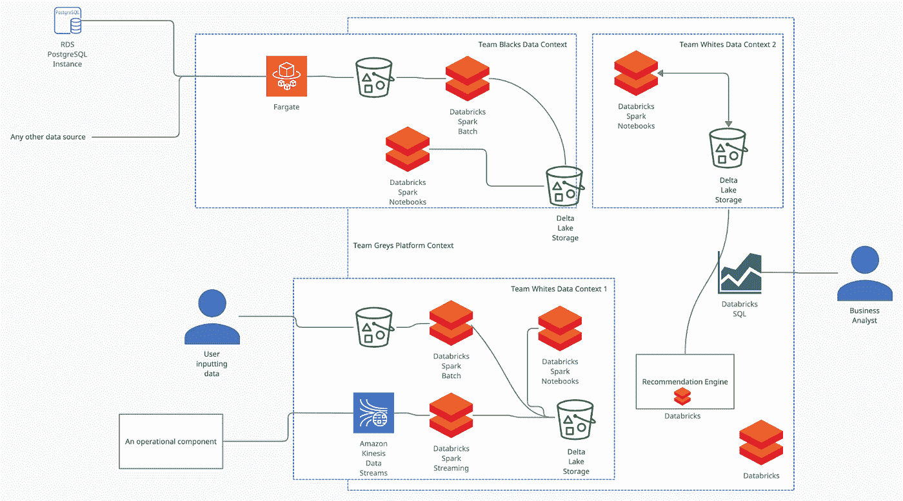
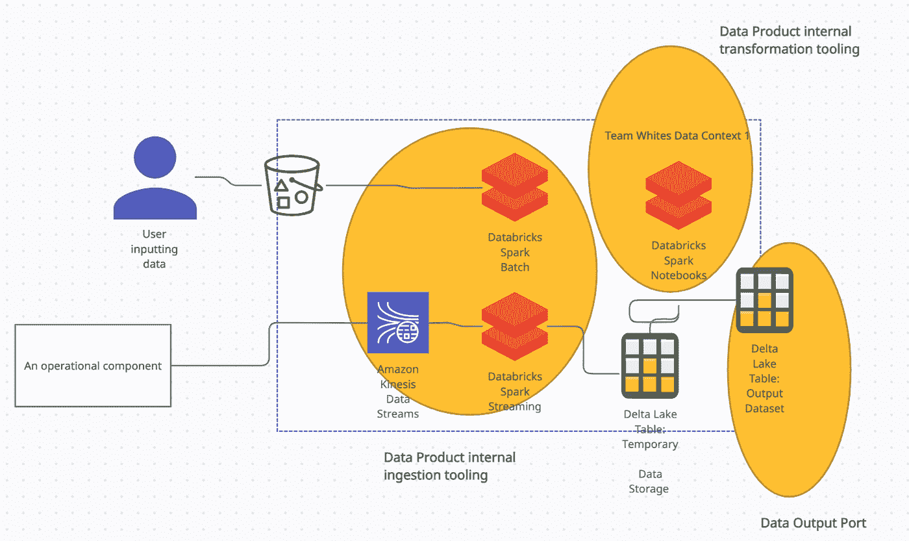
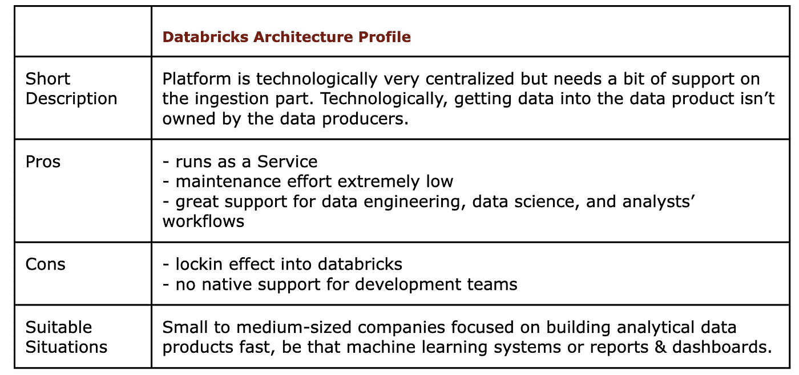

# 在数据块上构建数据网格—快速

> 原文：<https://towardsdatascience.com/building-a-data-mesh-on-databricks-fast-25bf9a9bf0b2>

## *如何在 Databricks 内部构建数据网格平台*

**(照片由** [**皮埃特罗**](https://unsplash.com/@pietrozj?utm_source=unsplash&utm_medium=referral&utm_content=creditCopyText) **上** [**下**](https://unsplash.com/s/photos/net?utm_source=unsplash&utm_medium=referral&utm_content=creditCopyText) **)**

Databricks 使团队能够以极快的速度和较低的维护需求构建数据网格平台。

但是构建一个基于数据块的数据网格平台也有意想不到的缺点。

在本文中，我将使用一个假想的团队结构概述一个可能的设置，并帮助您理解 databricks 上的数据网格是如何工作的。

*本文节选自我在 MEAP 曼宁合著的《数据网在行动》* *一书的草稿。*

## 为什么将 Databricks 作为数据网格平台？

与 AWS 和 GCP 版本的数据网格不同，Databricks 上的数据网格看起来很像一个集中式数据设置。至少在技术方面。这带来了明显的好处，即易于设置和典型的集中化好处，以及两个不太明显的缺点:

1.  通过集中大部分基础设施，我们又一次受制于中心瓶颈。使用托管共享服务时，这种影响要小得多，但它仍然存在。此外，我们在物理上将数据集中在一个地方。
2.  通过集中部分流程，我们让“data domain 所有权”变得更加难以理解。在这样的技术架构中，将焦点放在过程、人员和组织上是最重要的。

另一方面，这种数据网格可能不需要一个以上的数据工程师来维护中小型公司内部的技术基础设施。在域内部，您应该能够用每个域一名数据科学家/工程师来满足需求。

## 8.3.1 自助式数据平台架构

我们的数据网格有几个参与者。

*   团队**黑** & **白**都是开发团队，团队内部有一名数据科学家。
*   团队**灰色**只是一个独自维护平台的单人团队。
*   C **消费者**:我们有一些商业分析师和一个推荐系统，它们都主要消费数据。

我们的业务分析师精通 SQL，可以在笔记本中使用 Python 做一些工作。

下图描绘了我们这次的架构。注意上下文变得更加模糊了。你当然可以“分离出”黑白团队的上下文，但是在这种情况下我们没有这样做。

小团队如何利用 Databricks 快速创建自助式数据平台——作者。

让我们再次确定数据网格的不同组件，首先是平台的组件，然后是数据产品部分。

## 确定平台的组件

在我们的架构中，平台接口和内核主要由数据块和相关服务组成。一个人的团队可以开始为 Kinesis 和 Fargate 组件的供应提供模板或某种服务，但这可能会与拥有一个非常精简的平台团队的想法相冲突。

平台团队需要做的是提供指南，一页纸的关于如何在数据网格中使用数据块的指南。如何使用访问权限，在哪里存储所有数据产品等等。

## 确定数据产品的组成部分

所有的数据产品都是建立在数据基础之上的。下面详细描述一下。

Black 团队拥有的数据产品更复杂一些。上游数据来自运行中的 RDS 实例和一些其他系统。为此，该团队使用定制的 AWS Fargate 任务定期将数据加载到 S3 桶中。从那里开始，Databricks spark 批处理作业拾取数据，并将它们放入 Delta Lake。然后，使用 Databricks 笔记本将数据转换为数据产品，并将其再次放入三角洲湖形式，在那里向其他人公开以供使用。在这种情况下，三角洲湖数据集形成了**数据输出端口**。

白队拥有的数据产品使用两个上游数据集。用户定期将数据输入到 AWS S3 存储桶中，该存储桶由批处理作业拾取并交付到三角洲湖中进行临时存储。这形成了数据产品的推送界面。另一方面，该团队提供了一个定制的 AWS Kinesis 数据流。操作组件将数据实时推送到数据流中，然后由 Databricks 流作业拾取。同样，笔记本用于转换和产生数据输出。

【white 团队如何利用 Databricks 来获取流数据和基于推送的数据，以构建一种新的数据产品——image by the author。

white 团队的第二个数据产品展示了使用 Databricks 构建额外的派生数据产品是多么简单。White 团队只需拿起另一个笔记本，找到已经提供的两个数据产品，并将其转换为 Databricks 中的第三个新数据产品。

业务分析师可以轻松地使用 Databricks SQL 来访问和浏览数据产品。他们还可以在该框架内创建报告和仪表板。

## 评论

数据块上的工作流是特定于数据块的。团队可以使用基础设施来管理数据产品的访问权限，分析师可以使用所谓的 unity 数据目录来浏览数据。

如果我们采用这样的体系结构，数据网格原理会有所不同。以数据块为中心的架构限制了团队的自由，并且没有简单的选择来“退出”平台。因此，这种设置只有在您解决这些限制或者通过治理措施确保团队在工具选择上保持一致的情况下才能很好地工作。因此，这种体系结构确实会带来退回到非数据网状操作模式的风险。

这使得这种架构更适合年轻的公司。这个架构也更针对数据工程师和数据科学家。这意味着它的目标是内部数据人员比例较高的公司，而 GCP 和 AWS 选项也适用于软件工程师。

## 变化

Databricks 本身可以被其他更大的数据平台取代，如雪花生态系统，它已经提供了几乎所有需要从上面实施架构的组件。

要扩展这种数据网格架构，您需要为每个参与者启用“退出”选项。这可以通过添加一个外部数据目录并减少转换工具中的数据块来实现，转换工具仍然是一个强大的工具集。您的设置可能如下所示:

1.  团队将数据存储在他们自己的数据存储中
2.  摄取工具获取这些数据，并将其放入 Databricks 可访问的数据存储中。
3.  Databricks 用于对这些数据集进行转换，并生成数据产品。
4.  trinoDB 这样的查询引擎用于将不同的数据产品连接在一起。
5.  中央数据目录确保数据产品可以存储在任何地方，并且仍然可以访问和查找。

## Databricks 架构摘要

本节描述的架构非常注重最大限度地利用 Databricks 的数据转换能力。因此，它与 Databricks 平台紧密相连。我们还看到，我们需要一些帮助来将数据放入中央三角洲湖，以释放数据块的力量。

这种设置的一大优势是最少的维护工作，并为公司通常希望承担的所有分析工作负载提供了强大的支持。

另一方面，我们看到了对开发团队的有限支持和对 Databricks 平台的锁定效应。

看看下面的概要简介。

作者对 databricks 数据网格平台设置的总结。

对如何建立伟大的数据公司、伟大的数据密集型产品、成为伟大的数据团队感兴趣，还是对如何利用开源构建任何伟大的东西感兴趣？然后考虑加入我的 [*免费简讯《三个数据点周四》*](http://thdpth.com/) *。它已经成为数据初创企业、风投和数据领导者值得信赖的资源。*