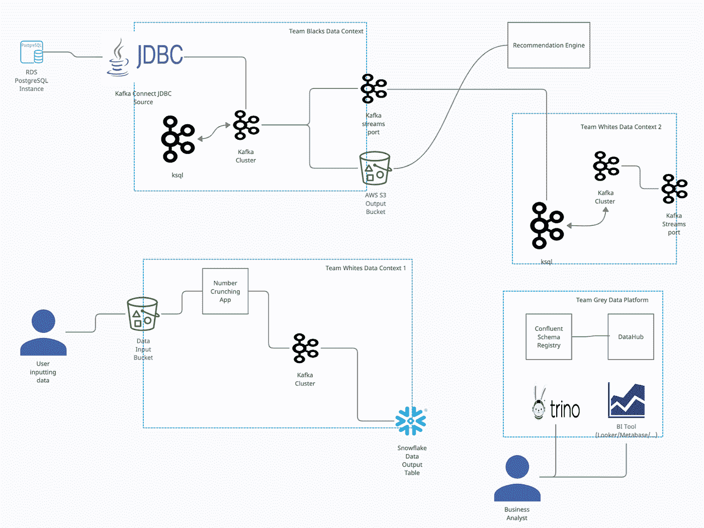
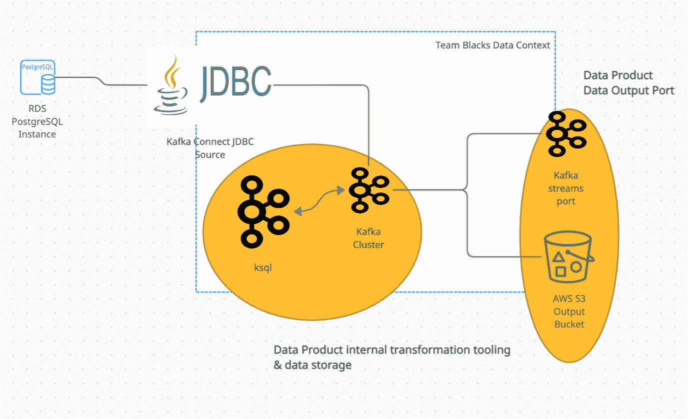
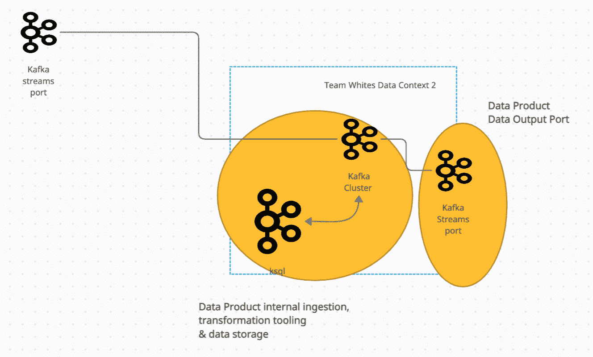
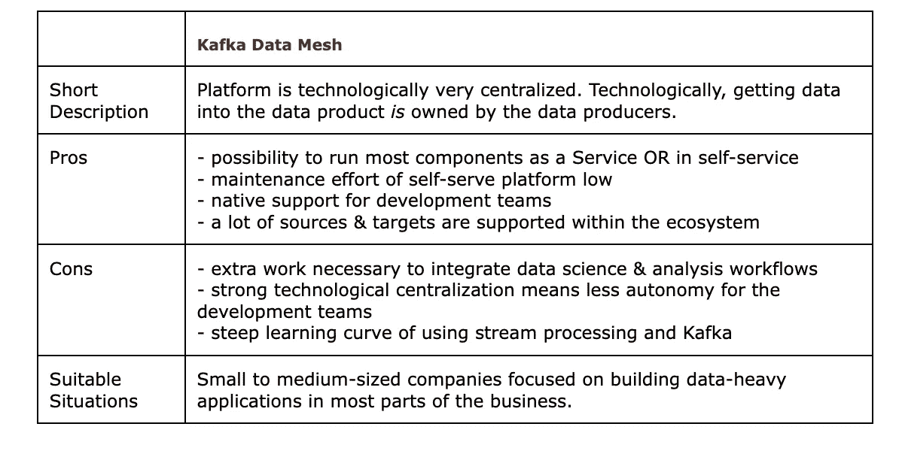

# 在卡夫卡生态系统上构建数据网格

> 原文：<https://towardsdatascience.com/building-a-data-mesh-on-the-kafka-ecosystem-399a5bd8799c>

## 面向数据密集型产品公司的数据网格。

(这就是我对卡夫卡的数据网格的想象。美国宇航局在 [Unsplash](https://unsplash.com/s/photos/data?utm_source=unsplash&utm_medium=referral&utm_content=creditCopyText) 拍摄的照片

F 为数据网格找到一个好的技术架构是很困难的，并且是一个非常公司化的过程。基于 Kafka 的数据网格对于已经在构建数据密集型产品的公司来说是一个很好的选择。

如果您的软件工程师不愿意处理大量数据，并且无法进入 Kafka 生态系统，那么这种数据网格技术架构不适合您。

但是如果你有先决条件，那么这个架构对你的公司来说是非常强大的。

我们描述的设置支持在整个公司范围内快速构建数据密集型应用程序。它将支持基于 SQL 的转换工具和遗留数据源的集成，同时仍然提供标准化的输入和输出端口。

*本文节选自《* [*数据网格在行动*](https://www.manning.com/books/data-mesh-in-action) *》由曼宁所著，第一本关于数据网格范式的实施的书，由* [*亚采克*](https://medium.com/u/c85ee68ec68d?source=post_page-----cae5b8307469--------------------------------)[*斯文*](https://medium.com/u/31ae15774b19?source=post_page-----cae5b8307469--------------------------------)[*玛丽安*](https://medium.com/@marian.siwiak) *和* [*马里乌斯*](https://medium.com/u/2a0824157028?source=post_page-----cae5b8307469--------------------------------)

# 自助式数据平台架构

为了解释数据网格平台如何在 Kafka 上工作，我选择使用一家公司内部的三个虚拟团队。

*   两个软件工程团队黑与白，
*   和一个平台团队，负责操作一些附加组件，这些组件集合了基于 Kafka 的数据网格。

下面描述了设置。花些时间来看看数据是如何在不同的数据产品之间流动的。请注意，这个数字有所减少。这里的 Kafka 集群是一个物理中心的基础设施，在称为“流&主题”的层次上有逻辑分离，这是 Kafka 内部的组织单元。

该架构使用两种关键的 Kafka 技术:

1.  使用以 Kafka 主题为载体的事件流作为**数据输出端口**，或者使用 Kafka Connect“sinks”将主题直接映射到云存储中提供的输出格式，如雪花表或 CSV 文件。
2.  默认使用 ksqlDB 作为数据产品中基于 SQL 语法的转换工具。此外，ksqlDB 被用作从 Kafka 主题携带的事件流数据输出端口获取数据的工具。

**两个团队如何在技术上实现利用卡夫卡的数据产品，作者图片。**

您应该能够快速找出该架构中的几个重要亮点:

1.  卡夫卡生态系统内部发生了很多事情。
2.  数据输入使用 Kafka 源进行标准化，这在大多数其他设置中是不存在的。
3.  数据输出端口使用 Kafka 接收器和 Kafka 主题携带的事件流进行标准化。
4.  Ksql 用于生态系统内部的转换。
5.  其他功能，如利用融合模式注册中心的中央数据目录、trino 和一些 BI 工具，是业务分析师工作所必需的。这在其他设置中更简单。

现在让我们来看看平台本身，然后详细了解数据产品。

# 识别组件

平台的界面将主要由文档组成，其余的界面是 Kafka 特有的界面。该团队可能会创建一个自述文件，以便轻松导航特定于公司的 Kafka 设置。

Black team 的数据产品从上游基于 SQL 的数据库获取数据。它使用 Kafka Connect 内置的 JDBC 源连接器将数据传输到 Kafka 主题中。KsqlDB 用于**转换**数据，并将数据集写入新的 Kafka 流和 AWS S3 桶。对于后者，再次使用 Kafka Connect AWS S3 连接器。Kafka 流可通过 Kafka 流 API 或 ksqlDB 访问，如下所示。因此，Kafka streams 端口与 AWS S3 存储桶一起成为**数据输出端口**。

【black 团队如何在 Kafka 上实施他们的数据产品，图片由作者提供。

Team White 的数据产品从 AWS S3 桶中获取数据，这种获取是通过定制的数字处理应用程序完成的。该应用程序使用 Kafka Producer API 将数据集写入 Kafka 流。Kafka Connect sink 被配置为也将这些数据转储到雪花表中。这两个组件，雪花表以及 Kafka 流端口成为**数据输出端口**。

白队的第二个数据产品的架构非常简单。它使用 ksqlDB 从 White 的第一个数据产品使用 ksqlDB 连接到现有的事件流，使用 SQL 转换数据，然后再次将其写入充当数据输出端口的事件流。

【white 团队如何利用 ksqlDB(图片由作者提供)获取另一个团队的数据以制作第二个数据产品。

在这种情况下，推荐引擎可以只获取 Kafka 流，但在我们的情况下，它更容易获取批量数据，这些数据通过标准 Kafka 接收器放入 AWS S3 存储桶。

您可能会看到，业务分析师在我们的案例中有点特殊。他们没有消费数据产品的直接方式，在 Kafka 生态系统中没有。为此，我们利用 trinoDB 作为查询引擎来查询所有数据产品，并允许在原生 SQL 中连接它们。在 trinoDB 之上，我们可以放置一个标准的商业智能工具，如 Tableau、Looker 或 Metabase，也可以以仪表板等形式提供数据。

和上一节一样，这个架构是一个比本章中解释的前两个更具体的工具。因此，我们不解释工作流和数据网格原理，而是讨论为什么这个架构更像是一个特殊用途的工具。

# 更多想法

如果您的公司专注于构建数据密集型应用程序，尤其是实时应用程序，这种架构将非常强大，因为 Kafka 提供的原生集成使得构建和组合这些应用程序非常容易。

这种架构是为开发团队大量使用而设计的。为了容纳数据工程师和数据科学家，我们需要添加一些额外的东西，比如 trinoDB。我们也没有像 databricks 或 AWS 原生设置那样，在类似笔记本的环境中进行任何原生集成。

我们可以做到这一切，只是需要额外的关注。

另一个考虑因素是模式注册中心和数据目录。Kafka 需要自己的模式注册表才能充分发挥作用。然后，需要将模式注册中心集成到外部数据目录中。所有其他体系结构也是如此，但是在所有其他体系结构中，数据目录也可以充当模式注册表，在这种情况下，我们确实需要 Kafka 特定的注册表。

其他架构中使用的大多数变体在这里也是可能的。特别是，安装更多数据工程密集型组件是最有意义的。

# 卡夫卡建筑概述

这种体系结构侧重于构建数据密集型应用程序，这些应用程序本质上不一定需要是“分析型”的。

它的目标是那些希望从产品几乎每个部分的数据中提取价值，从而构建大部分数据密集型应用程序的公司。因此，主要的焦点变成了开发团队，让他们的生活变得更加轻松。这也意味着数据工程师的生活更加艰难，或者至少需要额外的关注。

这些都是很难但不得不做的权衡。下表给出了 Kafka 数据网格的概要。

表作者。

对如何建立伟大的数据公司、伟大的数据密集型产品、成为伟大的数据团队感兴趣，还是对如何利用开源构建任何伟大的东西感兴趣？然后考虑加入我的 [*免费简讯《三个数据点周四》*](http://thdpth.com/) *。它已经成为数据初创企业、风投和数据领导者值得信赖的资源。*