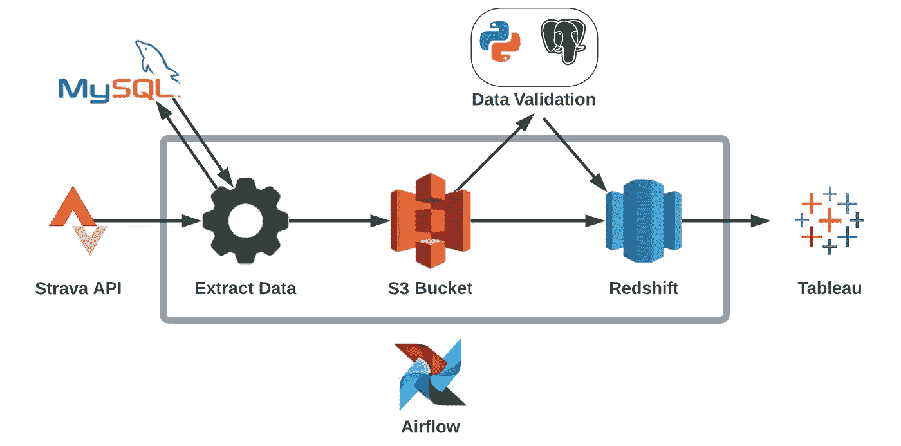
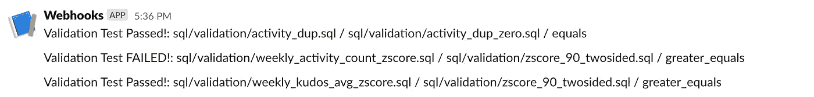
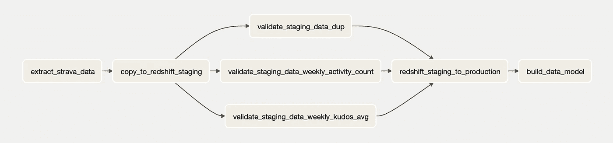
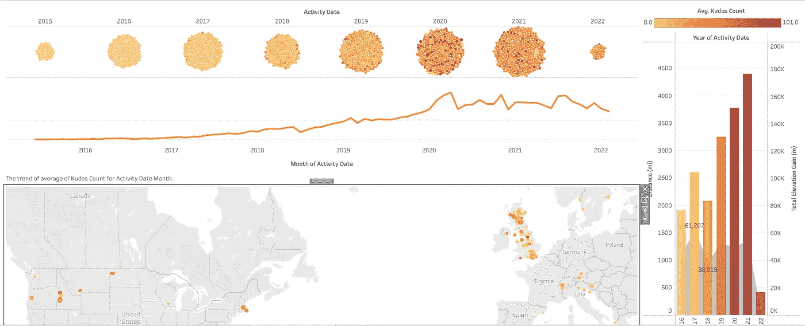
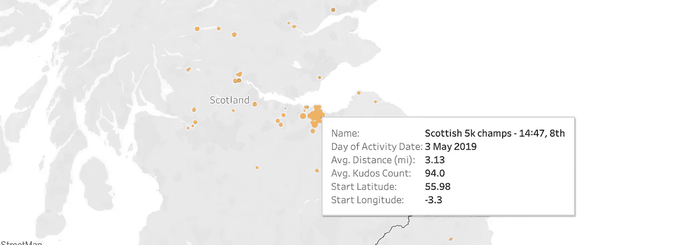

# 为我自己的 Strava 数据构建数据管道

> 原文：<https://towardsdatascience.com/building-a-data-pipeline-for-my-strava-data-98ea8b2b0767>

## 使用 Strava API、MySQL、Python、S3、Redshift 和 Airflow 对我自己的 Strava 数据进行 EtLT


马库斯·温克勒在 [Unsplash](https://unsplash.com?utm_source=medium&utm_medium=referral) 上的照片

我构建了一个 EtLT 管道，从 Strava API 获取我的 [Strava 数据](https://www.strava.com/athletes/5028644)，并将其加载到一个 [**红移**](https://aws.amazon.com/redshift/) 数据仓库中。然后，使用 [**气流**](https://airflow.apache.org) 每周运行一次该管道，以提取任何新的活动数据。最终目标是使用这个数据仓库在 **Tableau** 中构建一个自动更新的仪表板，并触发我的 [Strava Kudos 预测模型](https://github.com/jackmleitch/StravaKudos)的自动重新训练。



系统架构(图片由作者提供)

# [数据提取](https://github.com/jackmleitch/StravaDataPipline/blob/master/src/extract_strava_data.py)

我的个人 Strava 活动数据首先使用 [Strava API](https://developers.strava.com) 被增量**摄取**并被加载到 **S3 桶**中。在每次摄取运行时，我们查询 MySQL 数据库以获得最后一次提取的日期:

然后，我们使用`requests`库重复调用 REST API，直到获得从现在到`last_updated_warehosue`之间的所有活动数据。我们包含了一个`time.sleep()`命令来遵守 Strava 设置的 100 个请求/15 分钟的速率限制。我们还包含了`try: except:`块，以防止
丢失某些活动的数据。

在将数据本地导出到由竖线分隔的`.csv`文件之前，我们执行一些小的转换，比如格式化日期和时区列。因此 EtLT 中的小 t！在我们保存数据之后，它将被上传到一个 S3 存储桶中，以便以后加载到数据仓库中。

最后，我们执行一个查询，在最后的提取日期更新 MySQL 数据库。

# [数据加载](https://github.com/jackmleitch/StravaDataPipline/blob/master/src/copy_to_redshift_staging.py)

一旦数据被加载到 S3 数据湖，它就会被加载到我们的**红移**数据仓库。我们分两部分加载数据:

*   我们首先将数据从 S3 存储桶装载到一个临时表中，该表的模式与我们的生产表相同
*   然后，我们在临时表和生产表之间执行验证测试(参见数据验证部分)。如果所有关键测试都通过了，那么我们首先从生产表中删除两个表之间的所有重复项。然后，临时表中的数据被完全插入到生产表中。

# [数据验证](https://github.com/jackmleitch/StravaDataPipline/blob/master/src/validator.py)

我们用 python 实现了一个简单的框架，用于在我们的数据管道中执行基于 SQL 的数据验证检查。尽管它缺少我们期望在生产环境中看到的许多功能，但这是一个良好的开端，并为我们如何改进基础设施提供了一些见解。

`validator.py`脚本对红移执行一对 SQL 脚本，并基于比较操作符(>、<、=)比较这两个脚本。然后，根据两个执行脚本的结果，测试通过或失败。在将新获取的数据上传到 staging 表之后，但在将该表插入到 production 表之前，我们执行这个验证步骤。

首先，我实现了检查重复项的检查，将 staging 表中总活动的分布(Airflow 设置为在每周结束时执行)与平均历史周活动计数进行比较，并使用 z 分数将 Kudos 计数指标的分布与历史分布进行比较。换句话说，最后两个查询检查这些值是否在基于历史的预期值的 90%置信区间内。例如，以下查询计算给定周内上载的所有活动的 z 得分(在 staging 表中找到)。

通过跑步

```
python src/validator.py sql/validation/weekly_activity_count_zscore.sql sql/validation/zscore_90_twosided.sql greater_equals warn
```

在终端中，我们将在之前的查询中找到的 z 分数与 90%置信区间 z 分数`SELECT 1.645;`进行比较。命令末尾的“warn”告诉脚本不要出错退出，而是警告我们。另一方面，如果我们在结尾加上' halt ',脚本将会退出并显示一个错误代码，并暂停所有后续任务。

我们还实现了一个系统，通过验证测试结果向给定的松弛通道发送通知，这个验证系统是受 James Densmore 的优秀数据管道一书的管道中的数据验证一章的启发。

然后，我们将所有的测试组合到一个 shell 脚本`validate_load_data.sh`中，在将数据从 S3 存储桶加载到暂存表之后，在将数据插入到生产表之前，运行这个脚本。对上周的数据运行此管道会得到以下输出:



松弛消息(图片由作者提供)

很高兴看到我们的第二次测试失败了，因为上周我没有像往常一样跑那么多！

虽然这个验证框架非常基础，但是它是一个很好的基础，可以在以后的日子里进行构建。

# [数据转换](https://github.com/jackmleitch/StravaDataPipline/blob/master/src/build_data_model.py)

现在数据已经被接收到数据仓库中，管道中的下一步是数据转换。在这种情况下，数据转换既包括数据的非上下文操作，也包括考虑上下文和逻辑的数据建模。在这种情况下，使用 ELT 方法而不是 ETL 框架的好处是，它给我们，即最终用户，以我们需要的方式转换数据的自由，而不是拥有一个我们不能改变的固定数据模型(或者至少不能没有麻烦地改变)。在我的例子中，我将我的红移数据仓库连接到 Tableau，构建一个仪表板。例如，我们可以构建一个数据模型来提取每月统计数据:

我们还可以建立更复杂的数据模型。例如，我们可以获得按锻炼类型细分的每周总 kudos 的每周百分比变化:

更进一步的方向是利用第三方工具，如 [dbt](https://www.getdbt.com) 来实现数据建模。

# [用气流把它们组合在一起](https://github.com/jackmleitch/StravaDataPipline/blob/master/airflow/dags/elt_strava_pipeline.py)

我们创建一个 DAG 来协调我们的数据管道。我们将管道设置为每周运行，这意味着它将在每周周日上午的午夜运行一次。如下图所示，我们的 DAG 将:

*   首先，使用 Strava API 提取最近的数据，并将其上传到 S3 存储桶
*   然后，它会将这些数据加载到我们的红移集群中的临时表中
*   然后将执行 3 个验证测试，并将结果通知我们的 Slack channel
*   然后，临时表将被插入到生产表中，删除流程中的任何重复项
*   最后，将在一个新表`activity_summary_monthly`中创建一个月度聚合数据模型



DAG 图(图片由作者提供)

# 数据可视化

完成数据转换后，我们就能够使用 Tableau 构建一个交互式仪表板，当新数据被接收到数据仓库时，它会自动更新，每周更新一次。我创建的仪表板是为了调查我的 Strava 活动的声望如何随着时间和地点的变化而变化。在建立这个项目后，我关闭了红移服务器，以避免任何费用，但下面可以看到仪表板的截图。



Kudos 仪表板(图片由作者提供)



互动地图(图片由作者提供)

# [单元测试](https://github.com/jackmleitch/StravaDataPipline/tree/master/tests)

单元测试是使用 PyTest 执行的，所有测试都可以在 tests 目录中找到。例如，下面我们看到一个测试`make_strava_api_request`函数的单元测试。它断言收到了一个字典响应，并且该响应包含一个整数的“id”键。

# 进一步的方向和考虑

*   **用 docker** 改善气流:我本可以使用气流的 Docker 图像来运行 Docker 容器中的管道，这会使事情更加健壮。这也将使大规模部署管道更加容易！
*   **实现更多的验证测试**:对于一个真实的生产管道，我会在整个管道中实现更多的验证测试。例如，我可以使用像[远大前程](https://greatexpectations.io/)这样的开源工具。
*   简化流程:管道可能会以更简单的方式运行。另一种方法是使用 Cron 进行编排，使用 PostgreSQL 或 SQLite 进行存储。
*   **数据流**:为了保持仪表盘持续更新，我们可以从类似 [Kafka](https://kafka.apache.org/) 的东西中受益。

# 结束语

最后，我构建了一个数据管道来自动提取、加载和转换我的 Strava 数据。该管道每周运行一次，并自动更新交互式仪表板。

我希望你喜欢它！