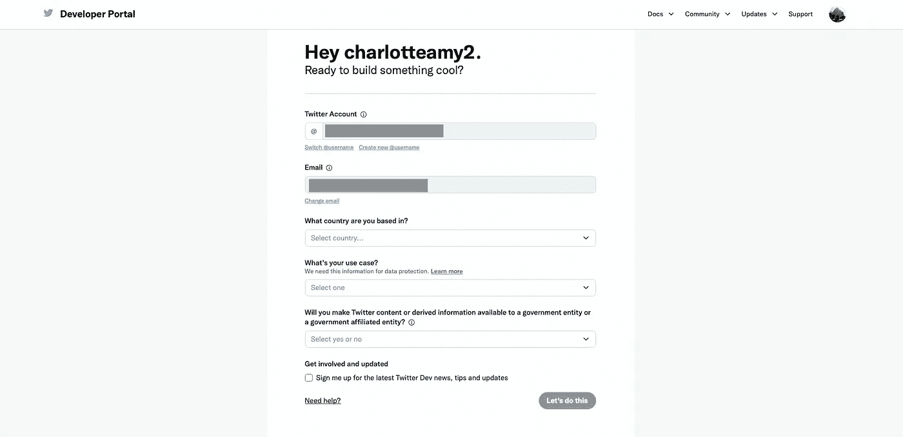
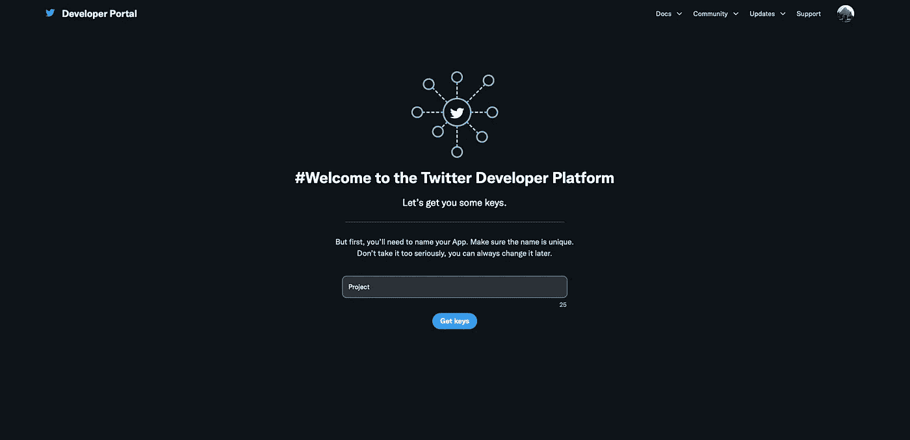
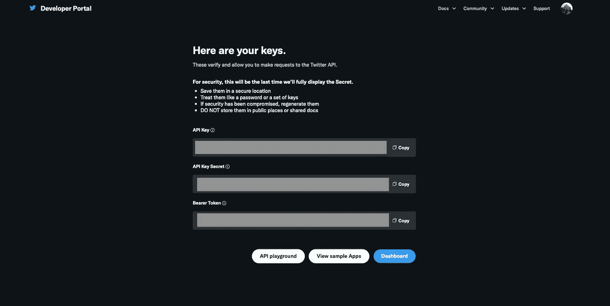
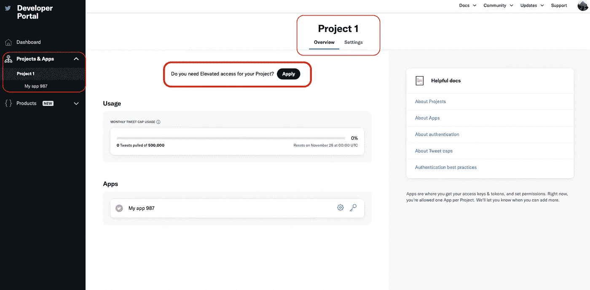
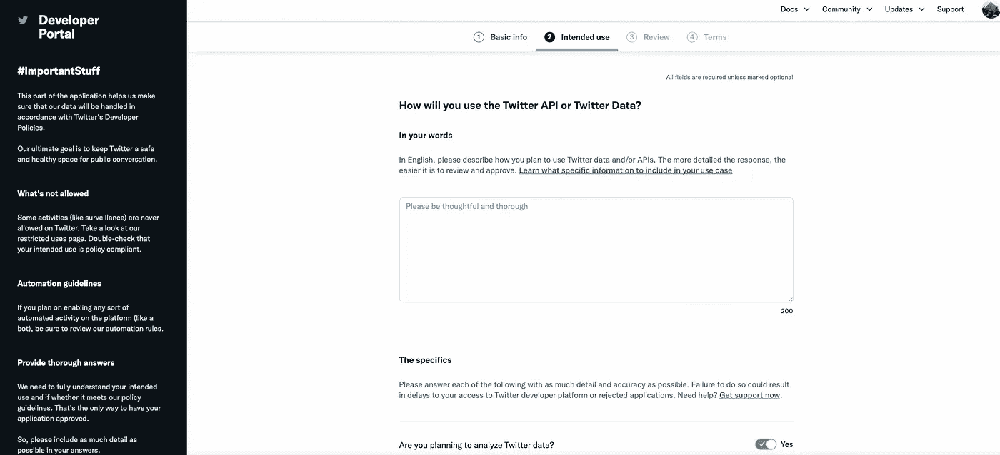
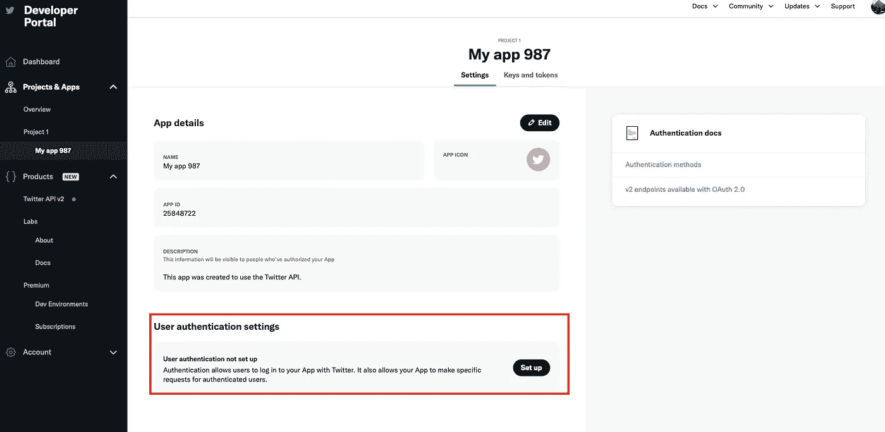
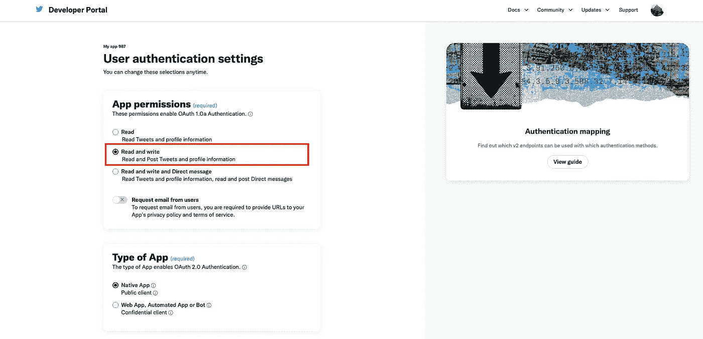
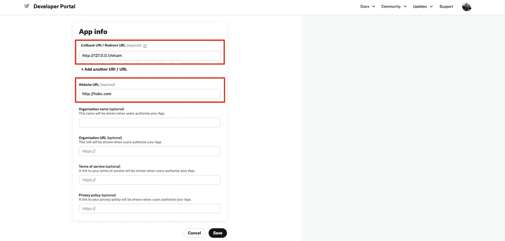
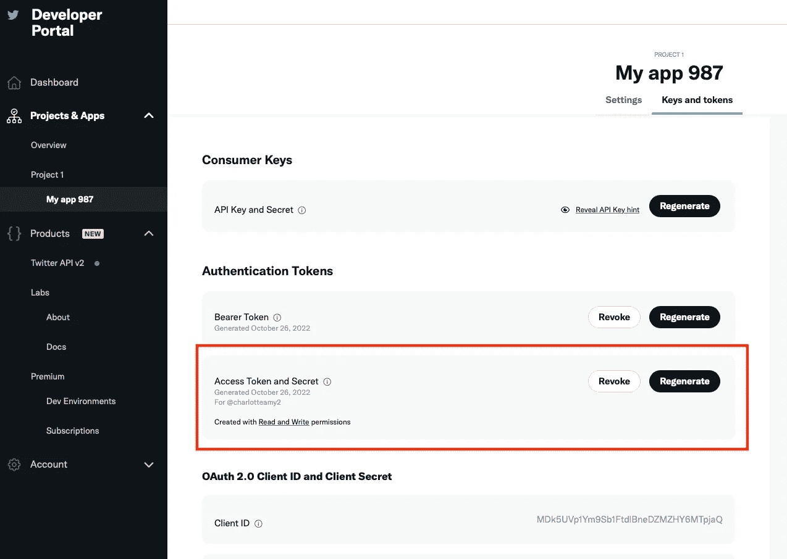

# 用 Tweepy 建立一个你被提到的推特数据集

> 原文：<https://towardsdatascience.com/building-a-dataset-of-tweets-where-youre-mentioned-using-tweepy-182106d5dcef>

## 使用 Twitter API 构建数据集的简单方法

克劳迪奥·施瓦兹在 [Unsplash](https://unsplash.com/s/photos/twitter?utm_source=unsplash&utm_medium=referral&utm_content=creditCopyText) 上的照片

对于许多公司来说，分析人们提到你公司手柄的推文是很有趣的。这些数据可用于识别客户经常向公司询问的反馈主题和问题。当我们理解了关键主题，我们就可以制定行动计划，从一开始就防止问题的发生。

Tweepy 是一个允许更容易与 Twitter API 交互的包。在这篇文章中，我将介绍如何在 Twitter 开发者平台上设置自己，并使用 Tweepy 来抓取任何提到你的句柄的推文。

首先，Twitter 发布了不同术语的定义，理解这一点很重要，因为它规定了我们如何调用 API。

## 定义(推特，2022 年)

**Tweets:** 发布到 Twitter 上的消息，包含文本、照片、GIF 和/或视频。

**提及:**包含另一个账户的 Twitter 用户名的推文，前面有“@”符号。比如:“Hello @TwitterSupport！”

回复:回复是指你回复另一个人的推文。

我们希望被提及，因为我们希望了解客户对我们的评价。

# 在 Twitter developer 上设置

最大的挑战是在 Twitter 开发者平台上建立和验证你自己。在这之后——非常简单。

去 twitter 开发者门户:[https://developer.twitter.com/en](https://developer.twitter.com/en)注册。

你需要填写一些基本的细节，并验证你的电子邮件。

作者图片

然后你将建立一个项目

作者图片

你有了项目之后，Twitter 会给你提供 API_key 和 API_key_secret。这两个都很重要，所以一定要保存好。

作者图片

接下来，您需要设置高架通道。这在你的项目页面上。

作者图片

他们会要求您确认一些基本的个人信息，然后您必须回答为什么要增强访问权限。

作者图片

最后，你必须同意条款和条件，然后你的申请将被审查。我的是即时的，但我听说可能需要几天。

现在您已获得提升的访问权限，您需要对您的应用程序启用身份验证。

作者图片

你的 app 需要有读写权限，我选了 native app。

作者图片

Twitter 请求一个回拨 URI 和一个网站 URL——这些对于您在本地运行的分析来说似乎是有问题的。对于回拨 URI，您可以使用: [http://127.0.0.1/return](http://127.0.0.1/return) 并使用任何网站作为网站 URL。

作者图片

然后我们需要得到我们需要的最后两组凭证；访问令牌和访问令牌密码。

转到应用程序中的密钥和令牌，生成访问令牌并将其保存在本地。

作者图片

我们需要用四样东西来证明自己:

1.  api_key
2.  api _ 密钥 _ 机密
3.  访问令牌
4.  访问令牌密码

我们现在有了所有四个项目，所以我们可以开始使用 Tweepy 来收集我们的提及。

# 使用 Tweepy 连接到 Twitter API

首先，确保安装了 tweepy 包。

然后导入包:

接下来，我们需要使用我们之前生成的令牌来验证我们自己。我制作了虚拟密钥，以避免让你们访问我的 twitter 账户。

我们使用以下代码初始化身份验证对象，然后设置访问令牌。最后，我们使用认证对象初始化 API。

要获得提到我们句柄的 tweets，我们需要使用 API 中的‘mentions _ timeline’。“count”参数决定返回多少条推文。

它的输出是一个 JSON 文件。我们只对 tweet 的文本感兴趣，所以我们遍历包含数据的 JSON 对象，只打印出文本元素。

完整的代码在我的 [github](https://github.com/charlotteamy/nlp/tree/main) 里。

# 结论

Twitter API 是自然语言处理(NLP)数据集的优秀资源，然而直接调用它可能具有挑战性。Tweepy 提供了一个软件包，可以更容易地获取您需要的数据，因此您可以继续为业务提供见解。在这个例子中，我想获得提及，但 Tweepy 允许您获得自己的推文，特定用户的推文，甚至通过关注/阻止用户来控制您的帐户。功能的完整列表可以在[文档](https://docs.tweepy.org/en/stable/index.html)中找到。

作为替代，如果您的公司拥有 Sprinklr(这是一个众所周知的社交媒体管理平台)的许可证，这提供了一个很好的前端来访问 Twitter API，而不需要任何代码。

# 参考

Twitter (2022) *关于不同类型的推文*。可在:[https://help.twitter.com/en/using-twitter/types-of-tweets](https://help.twitter.com/en/using-twitter/types-of-tweets)(访问时间:2022 年 10 月 26 日)。

_________

我喜欢为商业用户写关于数据科学的文章，我热衷于使用数据来提供切实的商业利益。

您可以通过 LinkedIn 与我联系，并通过 Medium 关注我，了解我的最新文章。