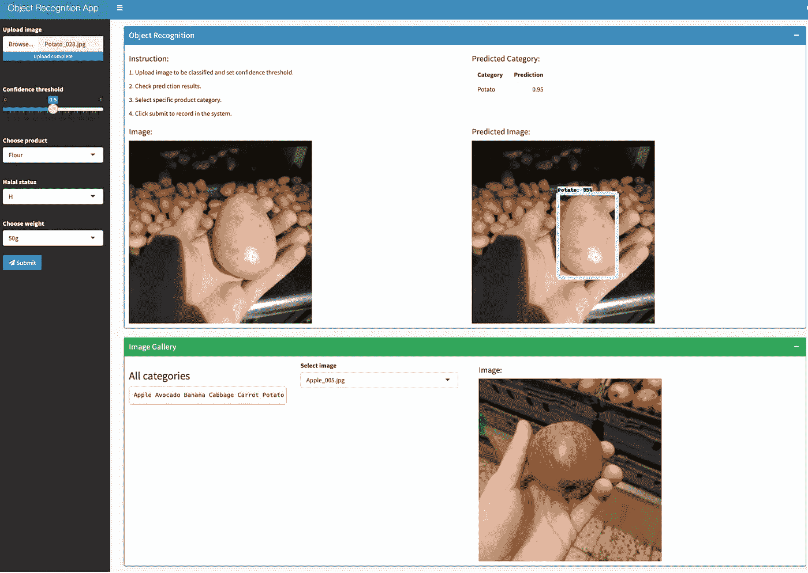
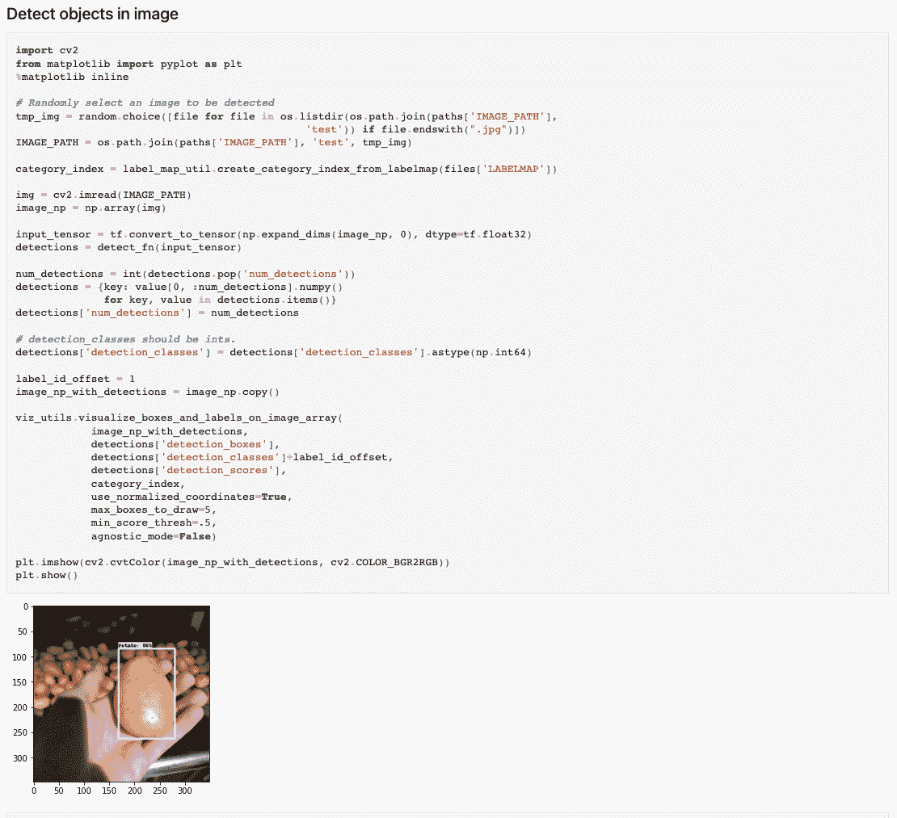
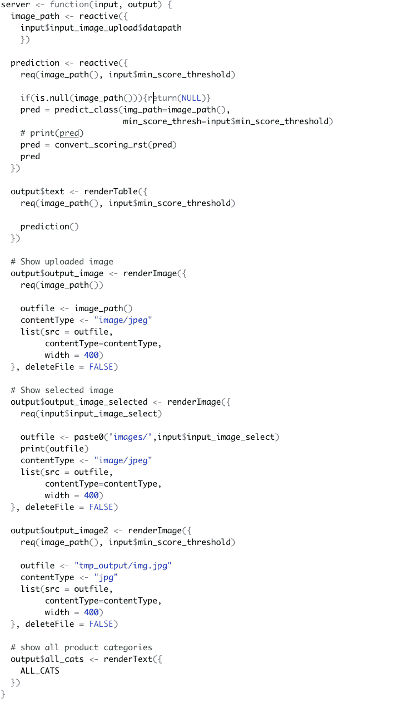
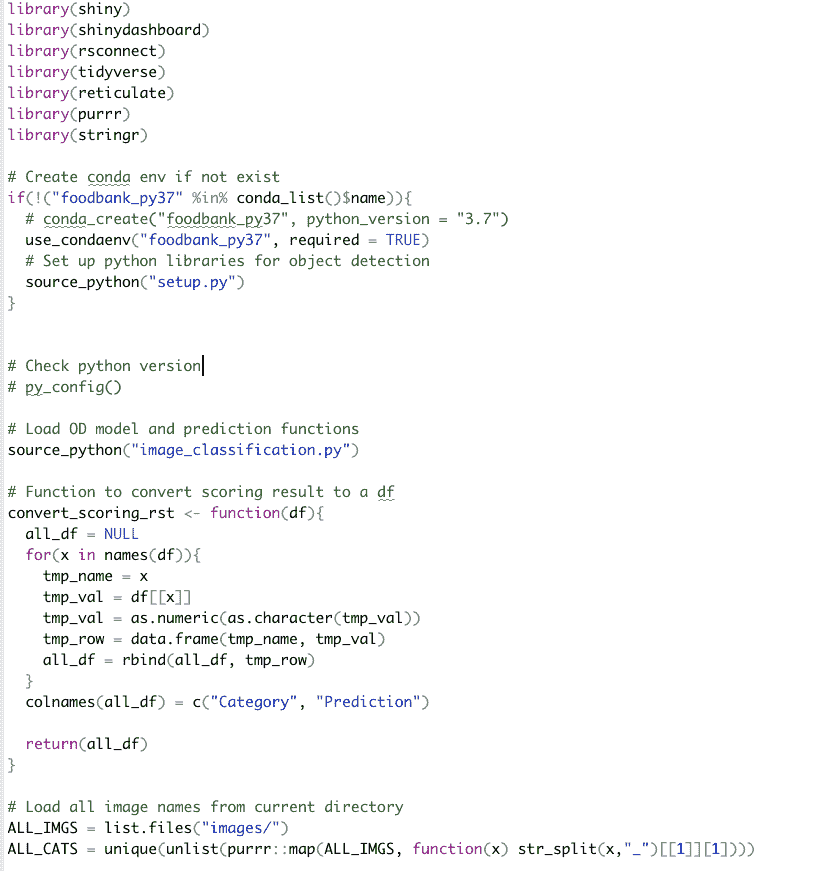

# 使用 R Shiny 和 Tensorflow 构建基于深度学习的对象检测应用程序

> 原文：<https://towardsdatascience.com/building-a-deep-learning-based-object-detection-app-using-r-shiny-and-tensorflow-5c17e93301d0>

## 了解如何基于您自己的数据集微调用于对象检测的定制深度学习模型

为对象检测训练一个像样的深度学习模型需要很多努力，当在最终用户的 web 应用程序中部署和嵌入该模型时，这变得更加复杂。在本教程中，我们打算通过提供一个如何使用 Python 和 Tensorflow 框架开发准确的深度学习模型的实际示例来解决这个看似艰巨的任务，并使用 R Shiny 框架构建一个支持动态对象检测的工作 web 应用程序。在本教程结束时，您将能够为杂货项目构建一个全面的对象识别应用程序，如下所示:



物体检测应用。图片由作者提供。

# 训练用于对象检测的深度学习模型

训练用于对象检测的执行深度学习模型需要大量数据和计算能力。为了促进开发，我们可以通过细化基于其他相关数据集预训练的调整模型来使用迁移学习。在本例中，我们选择由 [Tensorflow Hub](https://tfhub.dev/tensorflow/ssd_mobilenet_v2/fpnlite_320x320/1) 提供的 sdd mobilenet，它在速度和准确性之间提供了良好的平衡。

由于在训练全面的深度学习模型时，需要考虑多个后端逻辑，如路径和超级参数，因此我们可以创建一个中央字典来存储这些配置参数，包括设置不同的路径，安装相关的库，以及下载预训练的模型。

```
# Configuration parameters
CUSTOM_MODEL_NAME **=** 'my_ssd_mobnet' 

*# SSD has good tradeoff between speed and accuracy; can switch to other pretrained model*
PRETRAINED_MODEL_NAME **=** 'ssd_mobilenet_v2_fpnlite_320x320_coco17_tpu-8'
PRETRAINED_MODEL_URL **=** 'http://download.tensorflow.org/models/object_detection/tf2/20200711/ssd_mobilenet_v2_fpnlite_320x320_coco17_tpu-8.tar.gz'

*# TF official script to encode training data to tf record format*
TF_RECORD_SCRIPT_NAME **=** 'generate_tfrecord.py'

*# Mapping dictionary between label and integer id*
LABEL_MAP_NAME **=** 'label_map.pbtxt'

*# Define a list of folder paths to be created (if needed) and used later*
paths **=** {
    'WORKSPACE_PATH': os**.**path**.**join('Tensorflow', 'workspace'),
    'SCRIPTS_PATH': os**.**path**.**join('Tensorflow','scripts'),
    'APIMODEL_PATH': os**.**path**.**join('Tensorflow','models'),
    *# bounding box annotation*
    'ANNOTATION_PATH': os**.**path**.**join('Tensorflow', 'workspace','annotations'),
    'IMAGE_PATH': os**.**path**.**join('Tensorflow', 'workspace','images'),
    'MODEL_PATH': os**.**path**.**join('Tensorflow', 'workspace','models'),
    'PRETRAINED_MODEL_PATH': os**.**path**.**join('Tensorflow', 'workspace','pre-trained-models'),
    'CHECKPOINT_PATH': os**.**path**.**join('Tensorflow', 'workspace','models',CUSTOM_MODEL_NAME), 
    'OUTPUT_PATH': os**.**path**.**join('Tensorflow', 'workspace','models',CUSTOM_MODEL_NAME, 'export'), 
    'PROTOC_PATH':os**.**path**.**join('Tensorflow','protoc')
}

files **=** {
    'PIPELINE_CONFIG':os**.**path**.**join('Tensorflow', 'workspace','models', CUSTOM_MODEL_NAME, 'pipeline.config'),
    'TF_RECORD_SCRIPT': os**.**path**.**join(paths['SCRIPTS_PATH'], TF_RECORD_SCRIPT_NAME), 
    'LABELMAP': os**.**path**.**join(paths['ANNOTATION_PATH'], LABEL_MAP_NAME)
}# Download TF model training utility scripts from TF model zoo
**if** **not** os**.**path**.**exists(os**.**path**.**join(paths['APIMODEL_PATH'], 'research', 'objection_detection')):
    !git clone https:**//**github**.**com**/**tensorflow**/**models {paths['APIMODEL_PATH']}# Install TF object detection library
**if** os**.**name**==**'posix':  
    !apt**-**get install protobuf**-**compiler
    !cd Tensorflow**/**models**/**research **&&** protoc object_detection**/**protos**/*.**proto **--**python_out**=.** **&&** cp object_detection**/**packages**/**tf2**/**setup**.**py **.** **&&** python **-**m pip install **.**
```

我们还需要为杂货项目识别的特定任务提供训练图像和边界框。这些数据将用于通过将默认输出更改为特定设置来微调预训练模型，即识别字典中描述的六种杂货项目(苹果、鳄梨、香蕉、卷心菜、胡萝卜和土豆)。

```
**#** Download training images **import** shutil

**if** os**.**path**.**exists('object_detection_using_tensorflow'):
    shutil**.**rmtree('object_detection_using_tensorflow')

!git clone [https:**//**github**.**com**/**jackliu333**/**object_detection_using_tensorflow**.**git](https://github.com/jackliu333/object_detection_using_tensorflow.git)# Create label map
labels **=** [{'name':'Apple', 'id':1},
          {'name':'Avocado', 'id':2},
          {'name':'Banana', 'id':3},
          {'name':'Cabbage', 'id':4},
          {'name':'Carrot', 'id':5},
          {'name':'Potato', 'id':6}]

**with** open(files['LABELMAP'], 'w') **as** f:
    **for** label **in** labels:
        f**.**write('item { \n')
        f**.**write('\tname:\'{}\'\n'**.**format(label['name']))
        f**.**write('\tid:{}\n'**.**format(label['id']))
        f**.**write('}\n')
```

我们还将把数据分成训练集和测试集。请注意，这种划分需要按照类别索引进行，以便特定类别的项目不会完全分配到训练集或测试集中。

```
# Split into train test folders
tmp_folders **=** ['train', 'test']

**for** i **in** tmp_folders:
    **if** os**.**path**.**exists(os**.**path**.**join(paths['IMAGE_PATH'], i)):
        shutil**.**rmtree(os**.**path**.**join(paths['IMAGE_PATH'], i))
        !mkdir **-**p {os**.**path**.**join(paths['IMAGE_PATH'], i)}
    **else**:
        !mkdir **-**p {os**.**path**.**join(paths['IMAGE_PATH'], i)}**import** shutil

**for** i **in** range(len(labels)):
    *# print(labels[i]['name'])*
    from_path **=** os**.**path**.**join('object_detection_using_tensorflow','images',labels[i]['name'])
    *# print(from_path)*

    *# get unique file names*
    tmp_files **=** os**.**listdir(from_path)
    tmp_names **=** []
    tmp_file_types **=** []
    **for** tmp_file **in** tmp_files:
        tmp_name **=** os**.**path**.**splitext(tmp_file)[0]
        tmp_file_type **=** os**.**path**.**splitext(tmp_file)[1]
        tmp_names**.**append(tmp_name)
        tmp_file_types**.**append(tmp_file_type)
    tmp_names **=** list(set(tmp_names))
    tmp_names **=** [i **for** i **in** tmp_names **if** i **!=** '.DS_Store']
    tmp_file_types **=** list(set(tmp_file_types))
    tmp_file_types **=** [i **for** i **in** tmp_file_types **if** len(i) **!=** 0]
    *# random shuffle the files*
    random**.**shuffle(tmp_names)

    *# training and test files*
    tmp_names_train **=** tmp_names[0:int(len(tmp_names)*****0.9)]
    tmp_names_test **=** [i **for** i **in** tmp_names **if** i **not** **in** tmp_names_train]

    *# move into respective target folders*
    **for** tmp_name **in** tmp_names_train:
        **for** tmp_file_type **in** tmp_file_types:
            tmp_name_full **=** tmp_name **+** tmp_file_type
            shutil**.**copy(os**.**path**.**join(from_path, tmp_name_full), \
                        os**.**path**.**join(paths['IMAGE_PATH'], "train"))

    **for** tmp_name **in** tmp_names_test:
        **for** tmp_file_type **in** tmp_file_types:
            tmp_name_full **=** tmp_name **+** tmp_file_type
            shutil**.**copy(os**.**path**.**join(from_path, tmp_name_full), \
                        os**.**path**.**join(paths['IMAGE_PATH'], "test"))
```

结果图像数据然后被转换成 TF 记录格式，以便更快地处理。

```
*#* Create TF Record *# download conversion script*
**if** **not** os**.**path**.**exists(files['TF_RECORD_SCRIPT']):
    !git clone https:**//**github**.**com**/**nicknochnack**/**GenerateTFRecord {paths['SCRIPTS_PATH']}!python {files['TF_RECORD_SCRIPT']} **-**x {os**.**path**.**join(paths['IMAGE_PATH'], 'train')} **-**l {files['LABELMAP']} **-**o {os**.**path**.**join(paths['ANNOTATION_PATH'], 'train.record')} 
!python {files['TF_RECORD_SCRIPT']} **-**x {os**.**path**.**join(paths['IMAGE_PATH'], 'test')} **-**l {files['LABELMAP']} **-**o {os**.**path**.**join(paths['ANNOTATION_PATH'], 'test.record')}
```

在开始训练模型之前，我们需要更新一些将偏离默认设置的配置参数，以便训练管道知道我们正在基于六个类别执行对象识别。

```
**#** Update configuration file for transfer learning **import** tensorflow **as** tf
**from** object_detection.utils **import** config_util
**from** object_detection.protos **import** pipeline_pb2
**from** google.protobuf **import** text_format

*# Read current configuration file*
pipeline_config **=** pipeline_pb2**.**TrainEvalPipelineConfig()
**with** tf**.**io**.**gfile**.**GFile(files['PIPELINE_CONFIG'], "r") **as** f:                                                                                                                                                                                                                     
    proto_str **=** f**.**read()                                                                                                                                                                                                                                          
    text_format**.**Merge(proto_str, pipeline_config)  

*# Update based on new labels*
pipeline_config**.**model**.**ssd**.**num_classes **=** len(labels)
pipeline_config**.**train_config**.**batch_size **=** 4
pipeline_config**.**train_config**.**fine_tune_checkpoint **=** os**.**path**.**join(paths['PRETRAINED_MODEL_PATH'], PRETRAINED_MODEL_NAME, 'checkpoint', 'ckpt-0')
pipeline_config**.**train_config**.**fine_tune_checkpoint_type **=** "detection"
pipeline_config**.**train_input_reader**.**label_map_path**=** files['LABELMAP']
pipeline_config**.**train_input_reader**.**tf_record_input_reader**.**input_path[:] **=** [os**.**path**.**join(paths['ANNOTATION_PATH'], 'train.record')]
pipeline_config**.**eval_input_reader[0]**.**label_map_path **=** files['LABELMAP']
pipeline_config**.**eval_input_reader[0]**.**tf_record_input_reader**.**input_path[:] **=** [os**.**path**.**join(paths['ANNOTATION_PATH'], 'test.record')]

*# Write to configuration file*
config_text **=** text_format**.**MessageToString(pipeline_config)                                                                                                                                                                                                        
**with** tf**.**io**.**gfile**.**GFile(files['PIPELINE_CONFIG'], "wb") **as** f:                                                                                                                                                                                                                     
    f**.**write(config_text)
```

使用 Tensorflow 提供的训练脚本可以简化模型训练。

```
TRAINING_SCRIPT **=** os**.**path**.**join(paths['APIMODEL_PATH'], 'research', 'object_detection', 'model_main_tf2.py')
command **=** "python {} --model_dir={} --pipeline_config_path={} --num_train_steps=2000"**.**format(TRAINING_SCRIPT, paths['CHECKPOINT_PATH'],files['PIPELINE_CONFIG'])
!{command}
```

由于训练过程将保存中间检查点，即模型权重，因此我们可以选择加载哪个模型检查点并将其用于检测。

```
**#** Load trained model from checkpoint **import** os
**import** tensorflow **as** tf
**from** object_detection.utils **import** label_map_util
**from** object_detection.utils **import** visualization_utils **as** viz_utils
**from** object_detection.builders **import** model_builder
**from** object_detection.utils **import** config_util

*# Load pipeline config and build a detection model*
configs **=** config_util**.**get_configs_from_pipeline_file(files['PIPELINE_CONFIG'])
detection_model **=** model_builder**.**build(model_config**=**configs['model'], is_training**=False**)

*# Restore checkpoint*
ckpt **=** tf**.**compat**.**v2**.**train**.**Checkpoint(model**=**detection_model)
ckpt**.**restore(os**.**path**.**join(paths['CHECKPOINT_PATH'], 'ckpt-3'))**.**expect_partial()

*# @tf.function*
**def** detect_fn(image):
    image, shapes **=** detection_model**.**preprocess(image)
    prediction_dict **=** detection_model**.**predict(image, shapes)
    detections **=** detection_model**.**postprocess(prediction_dict, shapes)
    **return** detections
```

现在，我们可以通过传递从前面定义的图像文件夹中随机选择的图像来测试微调后的模型。

```
**import** cv2 
**from** matplotlib **import** pyplot **as** plt
**%**matplotlib inline

*# Randomly select an image to be detected*
tmp_img **=** random**.**choice([file **for** file **in** os**.**listdir(os**.**path**.**join(paths['IMAGE_PATH'], 
                                              'test')) **if** file**.**endswith(".jpg")])
IMAGE_PATH **=** os**.**path**.**join(paths['IMAGE_PATH'], 'test', tmp_img)

category_index **=** label_map_util**.**create_category_index_from_labelmap(files['LABELMAP'])

img **=** cv2**.**imread(IMAGE_PATH)
image_np **=** np**.**array(img)

input_tensor **=** tf**.**convert_to_tensor(np**.**expand_dims(image_np, 0), dtype**=**tf**.**float32)
detections **=** detect_fn(input_tensor)

num_detections **=** int(detections**.**pop('num_detections'))
detections **=** {key: value[0, :num_detections]**.**numpy()
              **for** key, value **in** detections**.**items()}
detections['num_detections'] **=** num_detections

*# detection_classes should be ints.*
detections['detection_classes'] **=** detections['detection_classes']**.**astype(np**.**int64)

label_id_offset **=** 1
image_np_with_detections **=** image_np**.**copy()

viz_utils**.**visualize_boxes_and_labels_on_image_array(
            image_np_with_detections,
            detections['detection_boxes'],
            detections['detection_classes']**+**label_id_offset,
            detections['detection_scores'],
            category_index,
            use_normalized_coordinates**=True**,
            max_boxes_to_draw**=**5,
            min_score_thresh**=**.5,
            agnostic_mode**=False**)

plt**.**imshow(cv2**.**cvtColor(image_np_with_detections, cv2**.**COLOR_BGR2RGB))
plt**.**show()
```



检测图像中的对象。图片由作者提供。

# 使用 R Shiny 构建 Web 应用程序

R Shiny 是构建现代 web 应用程序的一个很好的工具，不需要深入了解 HTML、CSS 或 Javascript。我们可以通过选择特定的应用程序框架并填充前端(ui)来快速启动应用程序。r)和后端(服务器。r)脚本，以及可选的全局文件(global。r)处理整个应用程序的环境。

R Shiny 中用户界面的设计可以遵循如下的网格系统，这样可以很容易地决定在特定的行或列中添加什么组件。

```
ui <- dashboardPage(
 skin=”blue”,
 #(1) Header
 dashboardHeader(title=”Object Recognition App”,#,style=”font-size: 120%; font-weight: bold; color: white”),
 titleWidth = 250,
 tags$li(class = “dropdown”),
 dropdownMenu(
 type = “notifications”, 
 icon = icon(“question-circle”),
 badgeStatus = NULL,
 headerText = “Feedback”,
 notificationItem(“Send email to developer”, icon = icon(“file”),
 href = “[liu.peng@u.nus.edu](mailto:liu.peng@u.nus.edu)”)
 )),
 #(2) Sidebar
 dashboardSidebar(
 width=250,
 fileInput(“input_image_upload”,”Upload image”, accept = c(‘.jpg’,’.jpeg’)),
 tags$br(),
 sliderInput(“min_score_threshold”,”Confidence threshold”,0,1,0.5),
 # tags$p(“Upload the image here.”)
 selectInput(inputId = “product_type”,label = “Choose product”,
 choices = c(“Flour”,”Baby Food”),
 selected = NA),
 selectInput(inputId = “halal_status”,label = “Halal status”,
 choices = c(“H”,”NH”),
 selected = NA),
 selectInput(inputId = “weight”,label = “Choose weight”,
 choices = c(“50g”,”100g”),
 selected = NA),
 actionButton(“submit”,”Submit”,icon(“paper-plane”), 
 style=”color: #fff; background-color: #337ab7; border-color: #2e6da4")
 ),

 #(3) Body

 dashboardBody(
 box(
 title = “Object Recognition”, width = 12, solidHeader = TRUE, status = “primary”,
 collapsible = T, collapsed = F,
 fluidRow(
 column(6,
 h4(“Instruction:”),
 # tags$br(),
 tags$p(“1\. Upload image to be classified and set confidence threshold.”),
 tags$p(“2\. Check prediction results.”),
 tags$p(“3\. Select specific product category.”),
 tags$p(“4\. Click submit to record in the system.”)
 ),
 column(6,
 h4(“Predicted Category:”),
 tableOutput(“text”)
 )
 ),

 fluidRow(
 column(h4(“Image:”),imageOutput(“output_image”), width=6),
 column(h4(“Predicted Image:”),imageOutput(“output_image2”), width=6)
 )
 ),
 box(
 title = “Image Gallery”, width = 12, solidHeader = TRUE, status = “success”,
 collapsible = T, collapsed = F,
 fluidRow(
 column(3,
 h3(“All categories”),
 verbatimTextOutput(“all_cats”)
 ),
 column(3, 
 selectInput(“input_image_select”, “Select image”,c(“”,ALL_IMGS),selected = “”),
 ),
 column(6,
 column(h4(“Image:”),imageOutput(“output_image_selected”), width=6),
 )
 )
 )

 # box(
 # title = “Product Recording”, width = 12, solidHeader = TRUE, status = “success”,
 # collapsible = T, collapsed = T,
 # “test”
 # )

 ))
```

服务器处理所有后端处理，例如使用预先训练的模型对上传的图像进行预测，并将预测输出返回到前端 UI。



服务器文件。图片由作者提供。

我们还在全局文件中定义了一些实用函数和环境设置。注意，R 使用 reticulate 库来处理 Python 脚本。在这种情况下，我们首先构建一个新的虚拟环境，为对象检测 conda 设置必要的背景环境，然后加载核心的图像识别 Python 函数，这些函数将以 API 的形式进行转换，与 R Shiny 生态系统进行交互。



全局文件。图片由作者提供。

# 结论

在本教程中，我们介绍了如何通过迁移学习在 Tensorflow 中微调预训练的深度学习模型以进行杂货项目识别，以及如何通过 R Shiny 构建现代 web 应用程序来为最终用户托管模型。最终产品是 R & Python 脚本的组合，其中核心 Python 功能(如对象检测)被无缝包装，并作为 API 向 R 公开，由 R 处理应用程序开发。我们希望本教程将是一个很好的起点，让您可以部署自己的模型，并以一种有效且吸引人的方式与他人分享。

所有支持数据和代码都可以在附带的 [github](https://github.com/jackliu333/object_detection_using_tensorflow) 以及下面的 YouTube 浏览中找到。