# 使用 Numpy 从头构建深度神经网络

> 原文：<https://towardsdatascience.com/building-a-deep-neural-network-from-scratch-using-numpy-4f28a1df157a>

## 现代深度学习库是强大的工具，但它们可能会导致从业者想当然地认为神经网络的功能原理是理所当然的

来源:unsplash.com

在这个项目中，我在不借助任何深度学习库(Tensorflow，Keras，Pytorch)的情况下，构建了一个深度神经网络。我之所以将自己强加于这项任务，是因为如今，使用多个 python 库提供的高级工具来构建深度和复杂的神经网络是毫不费力的。毫无疑问，这对机器学习专业人员来说是一个巨大的优势:我们只需要几行代码就可以创建强大的模型。然而，这种方法有一个很大的缺点，就是让这些网络的功能不清楚，因为它们是在“引擎盖下”发生的。

对于任何想要巩固对这些神奇工具的理解的人来说，从头开始构建深度神经网络是一个很好的练习。

这篇文章将涵盖理论和实践两部分。理论部分是理解实现的必修课。对于理论，我们需要代数和微积分的基础知识，而对于编码部分，只会用到内置的 Python 函数和 Numpy。

这种方法在存储缓存值的策略上不同于其他实现。此外，与大多数实现不同，该代码允许我们比较无限可能的网络架构，因为层和激活单元的数量是由用户定义的。

# 问题定式化

在这个应用程序中，我创建了一个深度神经网络来解决著名的 MNIST 分类问题。

[MNIST 数据集](http://yann.lecun.com/exdb/mnist/)是一个手写数字的大型数据库。该数据集包含 70，000 个小图像(28 x 28 像素)，每个图像都被标记。

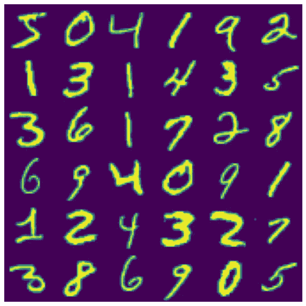

来自 [MNIST 数据集](http://yann.lecun.com/exdb/mnist/)的手写数字

# 理论

在这一节中，我将概述应用程序的理论部分。我将为正向传播和反向传播的每一步定义所有矩阵，特别注意阐明所有矩阵的维数。

## 投入

输入包括形状为 28×28 像素的 m 个训练图像。因此，每个图像由大小为 784 的一维数组表示。为了加快计算速度，我将利用矢量化技术。我将整个训练集存储在一个矩阵 X 中。X 的每一列代表一个训练示例:

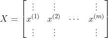

尺寸为:

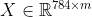

## 正向传播

为了澄清解释，让我们假设建立一个神经网络，包括:

*   输入层
*   1 个大小为 10 的隐藏层，具有 ReLu 激活功能
*   1 个大小为 10 的隐藏层，具有 Softmax 激活功能
*   输出层

所有矩阵和计算可以很容易地扩展到任何架构的全连接网络。

对于每一层，正向传播由 2 个步骤组成:

*   权重和偏差的应用
*   激活函数的计算

对于隐藏层 1，我们使用矩阵乘法和矩阵加法来应用权重和偏差:

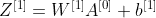

然后，我们需要计算选定的激活函数:

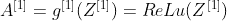

遵循矩阵乘法规则，维数为:

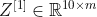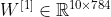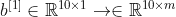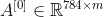

第 2 层也是如此:

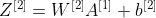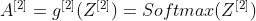

矩阵维数为:

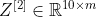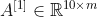

一般来说，对于任何层 l，这两个步骤都是通过这些简单的方程进行的:

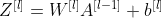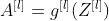

在前向传播结束时，到达层 L，我们计算预测:

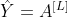

## 反向传播

反向传播的目的是计算损失函数相对于网络每层权重的偏导数。一旦我们知道了导数，我们就可以应用梯度下降优化来调整它们的值。

反向传播的第一步是计算预测的误差。将第 2 层视为最后一层，我们有:

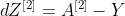

其中:

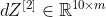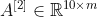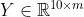

现在，我们可以计算损失函数相对于第 2 层的权重和偏差的导数:

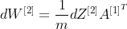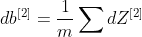

尺寸如下:

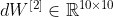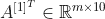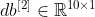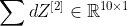

一旦我们知道了最终层的所有导数，反向传播过程就包括通过网络的各层反向传播，并如下计算偏导数:

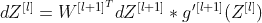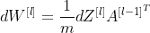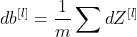

## 参数更新

知道了损失函数的梯度，我们就知道向哪个方向移动才能达到最优。因此，我们更新参数:

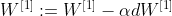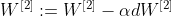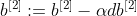

# 编码

本节介绍了用于实现深度神经网络的所有功能。完整的代码可以在我的 [GitHub 库](https://github.com/andreoniriccardo/deep-neural-network-from-scratch)中找到。

在上面链接的 GitHub 存储库中，您会找到 5 个文件:

*   “README.md”:这是一个展示项目的降价文件
*   “train.csv”:这是一个包含 MNIST 数据集训练集的 csv 文件
*   “test.csv”:这是一个包含 MNIST 数据集测试集的 csv 文件
*   “main.py”:这是一个 Python 脚本，我们将从这里运行神经网络
*   “utils.py”:这是一个 Python 文件，我们在其中定义了构建神经网络所需的函数

我们将主要关注“utils.py”文件，因为它是大部分网络实现所在的位置。

第一个功能是`**init_params**`。它将层的尺寸作为输入，并返回包含所有随机初始化的权重和偏差的字典:

接下来，我定义所有的激活函数及其导数。在这个应用程序中，我们将使用 ReLu 和 Softmax 激活。

现在好戏开始了。`**forward_prop**` 函数将输入 X 和网络参数(权重和偏差)作为输入，并返回包含每层激活的字典。输出字典还包含各图层的 Z 矩阵，作为一种缓存。这是因为在反向传播阶段需要 Z 矩阵。

`**back_prop**`函数可能是整个实现的核心。它从最后一层到第一层扫描网络，并计算关于每层的每个权重和偏差的损失函数的梯度。

在反向传播步骤期间计算的梯度稍后用于更新权重和偏差。`**update_params**` 函数处理这个任务。

接下来的两个辅助功能`**get_predictions**` 和`**get_accuracy**` 分别用于从最终层选择预测(即选择具有最高 Softmax 分数的类别)和计算预测的准确度。

最后，我将上面的所有函数总结在`**gradient_descent_optimization**` 函数中:

# 模型评估

我想尝试的第一个网络架构包括:

*   大小为 784 的输入层
*   大小为 10 的隐藏层#1 和 ReLu 激活
*   大小为 10 的隐藏层#2 和 Softmax 激活
*   大小为 1 的输出层

该层在我的 Python 代码中用列表`**[784, 10, 10]**`表示。没有必要在列表中包含输出图层，因为它没有关联的权重。从现在开始，所有的网络都将由描述其架构的 python 列表来表示。

在训练网络 1000 次迭代后，精确度收敛到大约 88%的值。

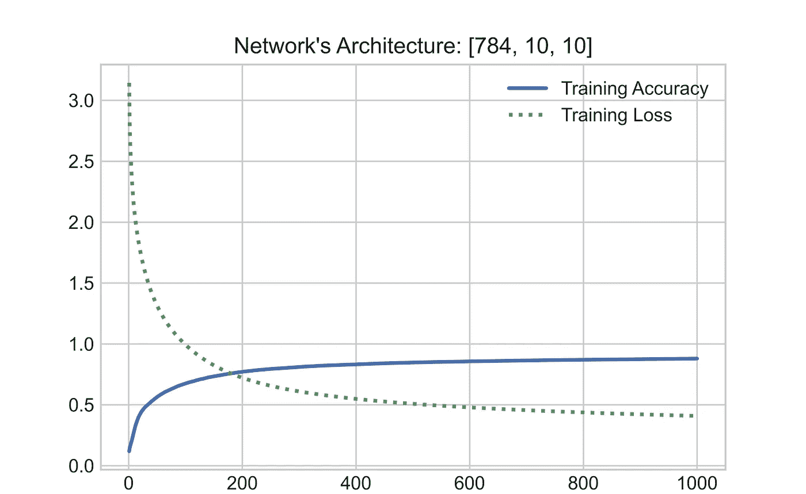

作者图片

考虑到网络的规模，这并不可怕，但是这与我们在这个任务中想要达到的结果相差甚远。一个更深更广的网络`**[784, 256, 128, 64, 10]**` ，经过 500 次迭代的训练，达到了 97%的准确率。

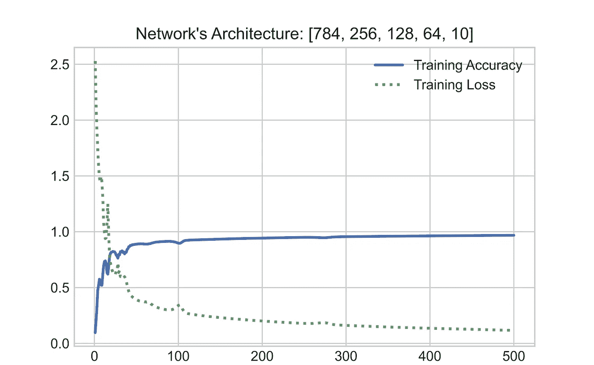

作者图片

对于第二个网络，每次迭代的训练时间显著增加，因为额外的层和神经元使其计算要求更高。

为了达到更好的图像分类效果，通常使用不同类型的网络:卷积神经网络。

请随意修改我的 [GitHub 库](https://github.com/andreoniriccardo/deep-neural-network-from-scratch)中的代码，并探索当层数和单元数改变时结果如何变化。