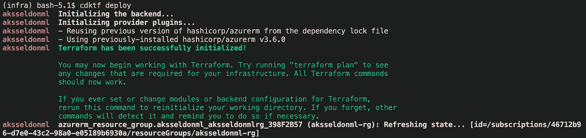
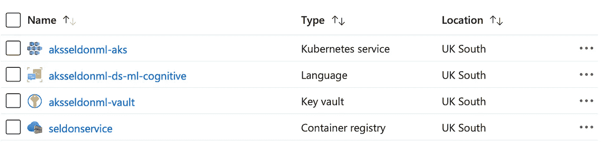
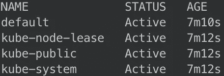
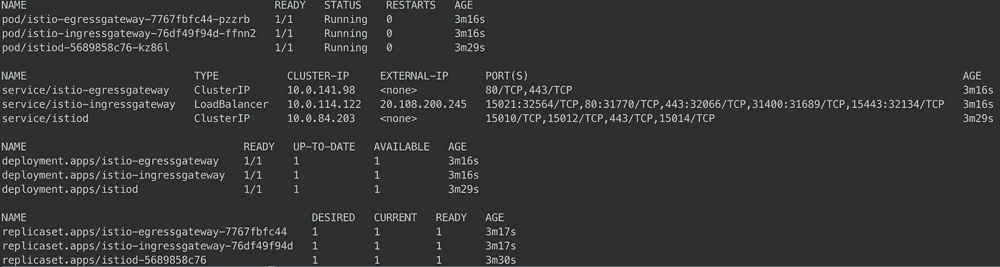
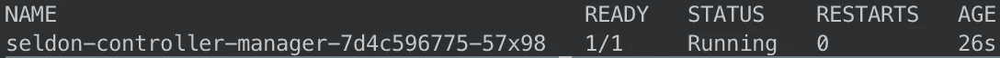
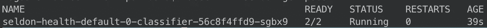
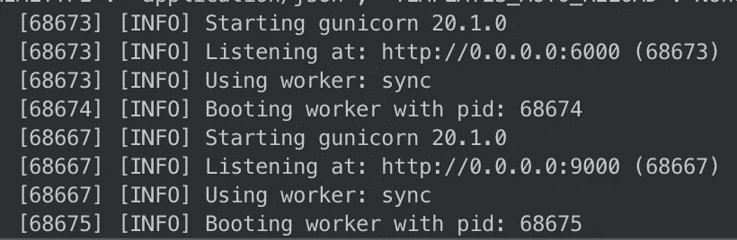

# 使用 Azure Kubernetes 服务、Seldon Core 和 Azure Cognitive 构建健康实体标签服务

> 原文：<https://towardsdatascience.com/building-a-health-entity-labelling-service-using-azure-kubernetes-service-seldon-core-and-azure-5dd6871a338>

## 在本教程中，我们将在 Azure 生态系统中完全用 Kubernetes 构建一个推理服务


照片由[像素](https://www.pexels.com/photo/multi-colored-folders-piled-up-159519/?utm_content=attributionCopyText&utm_medium=referral&utm_source=pexels)的[皮克斯拜](https://www.pexels.com/@pixabay?utm_content=attributionCopyText&utm_medium=referral&utm_source=pexels)拍摄

在本教程中，我们将使用以下技术:

*   [AKS](https://azure.microsoft.com/en-us/services/kubernetes-service/) : Azure 云上的 Azure Kubernetes 服务作为我们部署 ML 模型的平台
*   [Seldon core](https://www.seldon.io/solutions/open-source-projects/core) :开源平台，用于在 Kubernetes 上快速部署机器学习模型
*   [cdktf](https://www.terraform.io/cdktf) **:** 将允许我们用 python 在 Azure cloud 中构建基础设施
*   一个 [zure 认知服务](https://azure.microsoft.com/en-us/services/cognitive-services/)**:**Azure 中现成的 AI 服务，可以通过 API 访问
*   [s2i](https://github.com/openshift/source-to-image) :一个用于从源代码创建 docker 图像的命令行工具
*   Istio:一个开源项目，Istio 使组织能够保护、连接和监控微服务

**TL；DR:代码在**[**GitHub**](https://github.com/BogdanCojocar/medium-articles/tree/master/aks_seldon)**上。**

在本文中，我们将在 Azure 中部署一个健康搜索实体推理服务。我们将使用 cdktf 部署基础设施，并将编写一个 seldon 核心模型，该模型将与 Azure 认知服务 API 进行交互，以分析健康数据。我们还将使用 helm 在 AKS 和其他各种依赖中安装 seldon 核心。我们假设您已经在您的环境中安装了 kubectl、helm 和 azure CLI，并且您能够在基于 linux 的终端中运行这里显示的大多数命令。

# 步骤 1:编写 azure 基础设施

为了构建和部署基础设施，我们需要访问 azure 帐户(免费试用注册可用[此处](https://azure.microsoft.com/en-us/free/))和安装在我们环境中的 cdktf。我们可以使用 brew 实现这一目的:

```
brew install cdktf
```

好了，现在我们可以开始编码了。在 cdktf 中，我们需要做的第一件事是创建包含所有 azure 组件的主类，我们称之为 **MLAzureStack:**

正如我们所看到的，我们需要从 **TerraformStack** 继承，还需要创建一个**azuremprovider**来帮助与 azure cloud APIs 进行通信，以便构建所需的基础设施。

接下来，我们将创建一个资源组。这是一个逻辑容器，将容纳我们部署的所有基础架构。这是一个将你所有的资源组合在一起的好方法。

我们使用一个类 **StackVariables** 的 vars 实例，它将保存我们基础设施的所有自定义值。请访问 github repo 了解有关这方面的详细信息。

在下一部分中，我们将创建 Kubernetes 集群。我们将创建一个包含 2 个节点和 D2 V4 虚拟机的基本集群，足以托管 Seldon Core 和 Istio 安装。

我们还需要创建负责文本分析 API 的认知帐户，该 API 将运行用于标记新数据的健康实体服务。

我们必须用我们的代码创建一个 docker 容器，这个容器必须托管在 Azure 中。为此，我们将创建一个容器注册表。

我们需要的最后一项基础设施是创建一个密钥库。基本上，我们有敏感的信息，我们希望安全地存储。为此，我们创建了一个密钥库。

在 KeyVault 中，我们可以定义我们希望给予新的秘密和密钥的权限。我们还创建了两个存储库秘密，用于保存认知访问密钥和端点。访问健康实体服务 API 需要这些值。

我们现在已经准备好部署 Azure 堆栈了。我们需要从终端运行 cdktf deploy 命令:

```
cdktf deploy
```

这将初始化 terraform 提供程序并部署声明的资源:



作者图片

如果我们导航到 azure 门户，我们应该看到在资源组中创建的所有资源:



作者图片

# 步骤 2:编写谢顿核心模型

在这一节中，我们将编写谢顿模型，该模型将接收新的请求，如果遇到新的请求，将发回带标签的健康数据。

我们定义了一个`health_entity`类，它有一个`__init__`方法和一个`predict`方法，基本上负责处理请求。

作者图片

在构造函数中，我们连接到 KeyVault，得到我们之前定义的秘密。我们使用这些参数来创建一个负责处理 ML 请求的`TextAnalyticsClient`。

在`predict`方法中，我们将数据请求传递给医疗 azure 客户端。我们从 API 中取回一些`entities`和一些在它们之间定义的`relationships`。我们创建一个 JSON 响应，将所有信息返回给用户。

在我们定义了`health_entity.py`的文件夹中，我们还必须创建另一个文件`.s2i/environment`，它将包含 docker 映像中 Seldon 使用的所有环境变量。

```
MODEL_NAME=HealthModel
API_TYPE=REST
SERVICE_TYPE=MODEL
PERSISTENCE=0
```

我们可以看到，我们将创建一个标准模型，并为 REST 请求提供服务。GRPC 也得到支持。

# 步骤 3:在 AKS 中安装 Seldon 核心

为了能够在 AKS 中部署谢顿模型，我们需要在集群中安装一些东西。我们将需要 azure cli、helm 和 kubectl 来运行一些安装脚本。

要将 kubectl 连接到 Azure 集群，我们需要在 kube 配置文件中添加所需的凭证:

```
az aks get-credentials --resource-group aksseldonml-rg --name aksseldonml-aks --admin
```

我们可以测试这是否可行，使用`kubectl get ns`检查集群中可用的名称空间:



作者图片

谢顿核心需要的下一个组件是 istio。首先，我们需要使用以下方式下载它:

```
curl -L [https://istio.io/downloadIstio](https://istio.io/downloadIstio) | sh -
```

移动到 istio 包目录并将其添加到您的路径中，以便能够使用 istio 命令行实用程序`istioctl`:

```
cd istio-1.11.4 
export PATH=$PWD/bin:$PATH
```

现在，我们可以在集群上安装 istio:

```
istioctl install --set profile=demo -y
```

名称空间标签`istio-injection=enabled`指示 Istio 自动注入代理以及我们在该名称空间中部署的任何东西。我们将为包含推理模型的`seldon`名称空间设置它:

```
kubectl create namespace seldon
kubectl label namespace seldon istio-injection=enabled
```

为了让 Seldon Core 使用 Istio mesh，我们需要创建一个 Istio 网关，帮助将流量导入 mesh:

```
kubectl apply -f - << END
apiVersion: networking.istio.io/v1alpha3
**kind**: Gateway
**metadata**:
  **name**: seldon-gateway
  **namespace**: istio-system
**spec**:
  **selector**:
    **istio**: ingressgateway
  **servers**:
  - **port**:
      **number**: 80
      **name**: http
      **protocol**: HTTP
    **hosts**:
    - "*"
END
```

如果我们想检查是否所有的 Istio 组件安装正确，我们可以运行`kubectl -n istio-system get all`，我们应该有类似的东西:



作者图片

在安装 Seldon 之前，我们需要创建一个命名空间来托管它:

```
kubectl create namespace seldon-system
```

接下来，我们可以使用 helm 安装谢顿核心:

```
helm install seldon-core seldon-core-operator \
    --repo [https://storage.googleapis.com/seldon-charts](https://storage.googleapis.com/seldon-charts) \
    --set usageMetrics.enabled=true \
    --set istio.enabled=true \
    --namespace seldon-system
```

我们可以使用`kubectl -n seldon-system get pods:`检查 Seldon 控制器是否正在运行



作者图片

# 步骤 4:部署 Seldon health 服务

不需要。我们已经设置好了环境，可以进行部署。我们将使用`s2i`来构建 docker 映像。要安装它，我们可以运行:

```
brew install source-to-image
```

我们将使用`seldonio/seldon-core-s2i-python36:1.14.0-dev`作为基础构建一个 docker 映像。我们将把我们的新图像命名为`seldon-health:0.1`

```
s2i build . seldonio/seldon-core-s2i-python36:1.14.0-dev seldon-health:0.1
```

接下来，我们需要登录到我们在步骤 1 中创建的 Azure 容器。这将允许我们在注册表中推送新的映像。

```
az acr login --name seldonservice
```

我们需要标记图像，然后才能将其推送到 Azure:

```
docker tag seldon-health:0.1 seldoncontainerregistry.azurecr.io/seldon-health:0.1
```

最后，我们可以将图像发送到容器注册表中:

```
docker push seldoncontainerregistry.azurecr.io/seldon-health:0.1
```

一旦图像在 azure 容器中，我们就可以使用 kubectl 部署 seldon 模型。kubernetes 清单包含我们刚刚部署的图像:

```
kubectl apply -f - << END
apiVersion: machinelearning.seldon.io/v1
kind: SeldonDeployment
metadata:
  name: seldon-health
  namespace: seldon
spec:
  name: seldon-health
  predictors:
  - componentSpecs:
    - spec:
        containers:
        - name: classifier
          image: seldoncontainerregistry.azurecr.io/seldon-health:0.1
    graph:
      name: classifier
    name: default
    replicas: 1
END
```

我们可以使用`kubectl -n seldon get pods:`来验证部署是否成功



作者图片

# 步骤 5:测试健康服务

我们可以用两种方式来测试健康服务。首先，我们将使用`seldon-core-microservice` CLI 在本地测试代码，我们还将在 AKS 上测试部署。

我们需要安装带有 pip 的 seldon core CLI:

```
pip install seldon-core
```

然后在一个单独的终端上我们可以运行一个本地的 seldon 核心微服务服务器:

```
cd model/ && seldon-core-microservice --service-type MODEL health_entity
```

您应该能够看到一个 gunicorn 服务器开始监听端口 9000:



作者图片

在单独的终端上，我们可以运行 curl 命令来检查我们的服务:

```
curl -X POST [http://localhost:9000/api/v1.0/predictions](http://localhost:9000/api/v1.0/predictions) -H 'Content-Type: application/json' -d '{ "data": { "ndarray": ["Patient needs to take 50 mg of ibuprofen every day."] } }'
```

正如我们所看到的，我们已经在 curl 请求中发送了一些医疗信息。我们应该得到一个带有标签信息的 JSON:

```
[
   {
      "entity":{
         "name":"50 mg",
         "category":"Dosage",
         "confidence_score":0.99
      }
   },
   {
      "entity":{
         "name":"ibuprofen",
         "category":"MedicationName",
         "confidence_score":1.0
      }
   },
   {
      "entity":{
         "name":"every day",
         "category":"Frequency",
         "confidence_score":1.0
      }
   },
   {
      "relation_type":"DosageOfMedication",
      "roles":[
         {
            "role":"Dosage",
            "entity":"50 mg"
         },
         {
            "role":"Medication",
            "entity":"ibuprofen"
         }
      ]
   },
   {
      "relation_type":"FrequencyOfMedication",
      "roles":[
         {
            "role":"Medication",
            "entity":"ibuprofen"
         },
         {
            "role":"Frequency",
            "entity":"every day"
         }
      ]
   }
]
```

我们可以看到，我们得到了标记的医学术语，例如布洛芬被认为是`MedicationName`类型的实体，我们还可以看到不同术语之间的关系，如 50 mg(剂量)和布洛芬(药物),关系类型为`DosageOfMedication.`

我们也可以在 AKS 中使用类似的 curl 命令。我们需要为我们部署的 seldon health 服务获取集群 ip 和端口。为此，我们需要运行几个 kubectl 命令:

```
export INGRESS_HOST=**$(**kubectl -n istio-system get service istio-ingressgateway -o jsonpath='{.status.loadBalancer.ingress[0].ip}'**)**
export INGRESS_PORT=**$(**kubectl -n istio-system get service istio-ingressgateway -o jsonpath='{.spec.ports[?(@.name=="http2")].port}'**)**
export INGRESS_URL=$INGRESS_HOST:$INGRESS_PORT
echo $INGRESS_URL
```

一旦我们有了`INGRESS_URL`,我们可以在 curl 命令中替换它:

```
curl -X POST [http://$](http://localhost:9000/api/v1.0/predictions)INGRESS_URL[/api/v1.0/predictions](http://localhost:9000/api/v1.0/predictions) -H 'Content-Type: application/json' -d '{ "data": { "ndarray": ["Patient needs to take 50 mg of ibuprofen every day."] } }'
```

我们应该得到与本地请求相似的响应。

好了，我们终于到了教程的结尾。这是一个复杂的问题，但是我们已经设法在 Azure 中创建了一个端到端的 Kubernetes ML 解决方案。我们已经看到了如何使用 CDKTF 在 python 中创建复杂的基础设施，如何使用 helm 和 kubectl 在 Kubernetes 中安装各种框架，以及如何使用 Seldon Core 创建和部署 ML RESTful 服务，这种服务非常可扩展、安全且易于配置。