# 构建高棉语拼写检查器

> 原文：<https://towardsdatascience.com/building-a-khmer-spelling-checker-7e3356677335>

## 了解 BK 树和编辑距离(又名 Levenshtein 距离)

图片作者。

# 一.动机

最近，我有机会开发一个高棉键盘应用程序。像任何其他键盘应用程序一样，拼写检查和拼写建议是用户体验的核心功能。在尝试实现这些特性时，我遇到了一种流行的方法，它依赖于两个概念来进行拼写检查:编辑距离(又名 Levenshtein 距离)和 BK 树。因此，这篇文章将讨论这些概念及其缺点，并分享一个依赖于它们的高棉语拼写检查器的 Python 实现。

# 二。编辑距离(又名莱文斯坦距离)

编辑距离是将一个字符串转换成另一个字符串所需的最小步骤/操作数。有多种技术可以计算编辑距离。然而，最流行的是由苏联数学家弗拉基米尔·莱文斯坦提出的莱文斯坦距离。他的方法允许在编辑距离中考虑三种类型的字符串操作:插入、删除和替换/替换。在拼写检查的上下文中，编辑距离允许我们测量两个单词的**差异。**

## **算法**

**我们可以通过动态规划有效地计算编辑距离。它使用由 2D 阵列表示的矩阵来存储子串之间的临时距离，以节省计算成本。让我们看看如何计算“កាល”和“ក្បាល".”之间的编辑距离**

****步骤 1:** 初始化一个大小为(len(word1) + 1，len(word2) +1)的空 2D 数组**

**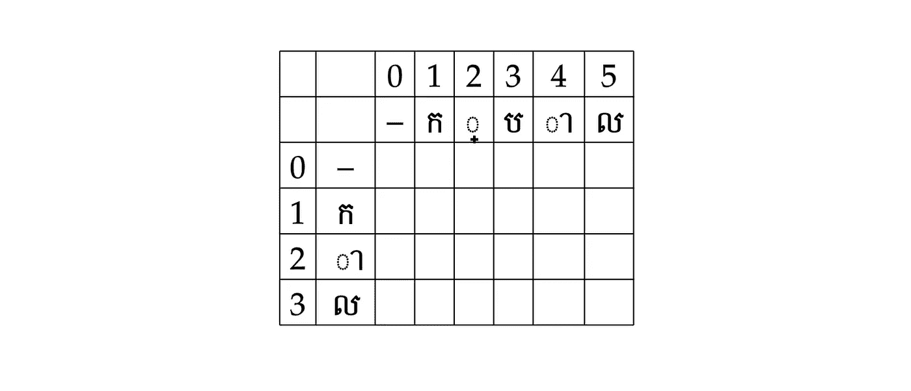**

**图 1:步骤 1-初始化 2D 阵列。图片作者。**

****第二步:**用列索引填充第一行的单元格。**

**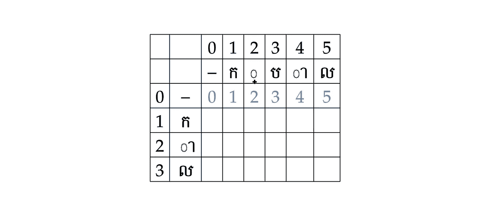**

**图 2:步骤 2-填写第一行。图片作者。**

**第三步:在第一列的单元格中填入它们的行索引。**

**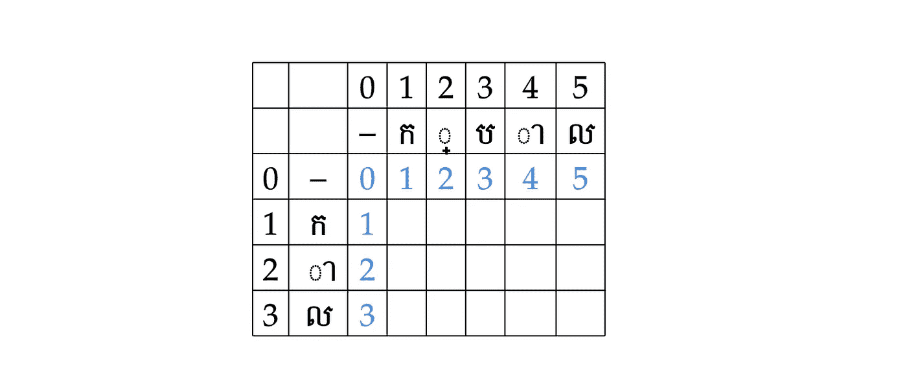**

**图 3:步骤 3-填写第一列。图片作者。**

****步骤 4:** 在位置(1，1)，我们查看该位置的两个单词的字符:单词 1 (ក)和单词 2 (ក).因为它们是相同的，所以我们将当前单元格的值设置为其左上邻居的值。因此，cell (1，1)的值变为 0。然后，我们移动到第 1 行的下一列。**

**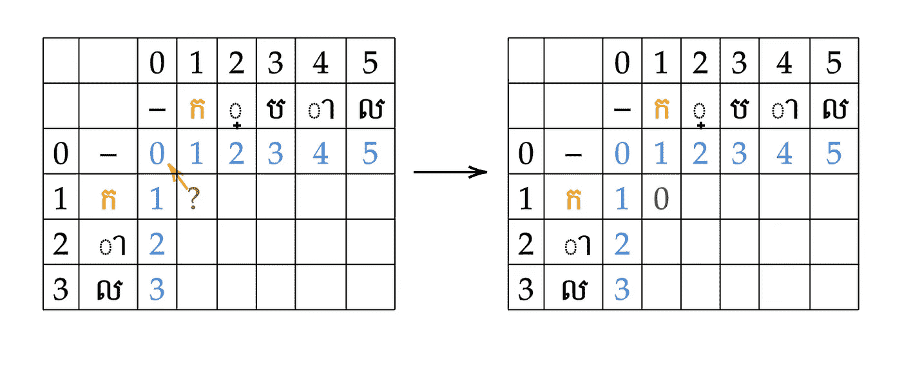**

**图 4:步骤 4——当 word1 和 word2 的字符相同时。图片作者。**

****步骤 5:** 在位置(1，2)，我们再次比较该位置的两个单词的特征:单词 1 (ក)和单词 2 (្).这一次两个人物是不同的。因此，当前单元格的值是 min([left，top，top-left]) + 1。然后，我们对剩余的单元格重复步骤 4 和 5。**

**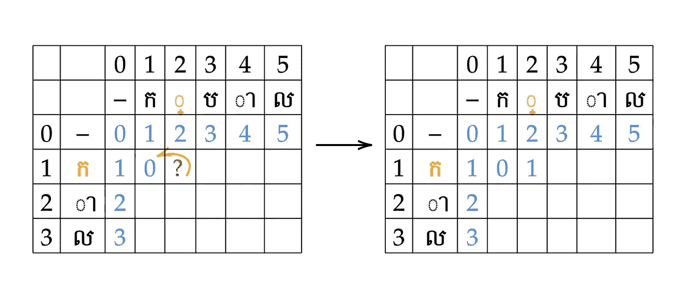**

**图 5:步骤 5——当 word1 和 word2 的字符不同时。图片作者。**

****第六步:**我们填充完所有单元格后，最小编辑距离就是 2D 矩阵的右下角单元格。因此，单词“កាល”和“ក្បាល”之间的最小编辑距离是 2。**

**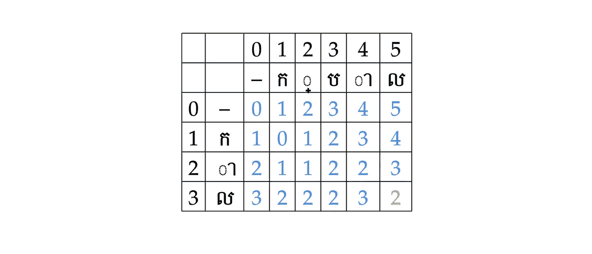**

**图 6:步骤 6-产生的 2D 矩阵和最小编辑距离。图片作者。**

**此外，为了知道哪种编辑操作组合导致最小的编辑距离，我们需要从左上角到右下角的单元格执行最短路径搜索。当然，可以有多种组合，因为可以有多条最短路径通向右下角的单元。**

# **三。BK 树**

**构建拼写检查器的一个简单方法是找到用户提供的单词与字典中所有其他单词之间的编辑距离，并将编辑距离最小的单词返回给该单词。然而，如果字典很大，这种方法需要时间和计算。BK 树允许我们通过使用利用编辑距离的树数据结构来限制所需的比较次数，从而更快地执行搜索。树中的每个节点都是一个单词。连接不同节点的每条边是该节点与其父节点之间的编辑距离。为了更好地理解 BK 树，我们可以看一个例子，看看如何为一个 4 个单词的字典构建树:{"ស្គម、ស្អាត、កាល、ក្បាល"}.然后，我们将进一步研究如何在树中搜索匹配的节点。**

## ****BK 树构造算法****

****第一步:**添加第一个单词“ស្គម”作为树的根节点。然后继续下一个词，“ស្អាត".**

****

**图 7:步骤 1-添加第一个单词作为根节点。图片作者。**

****第二步:**设置根节点为当前节点。然后计算“ស្អាត”到当前节点之间的编辑距离。所以 dist(ស្អាត，ស្គម) = 3。之后，我们查看当前节点的子节点。由于当前节点没有距离等于ស្គមdist(ស្អាត的子节点，我们插入“ស្អាត”作为当前节点的子节点。然后我们转到下一个词，“កាល".”**

****

**图 8:步骤 2-添加第二个单词。图片作者。**

****第三步:**设置根节点为当前节点。然后计算“កាល”到当前节点之间的编辑距离。所以我们得到 dist(កាល，ស្គម) = 4。类似于步骤 2，当前节点没有距离等于ស្គម).dist(កាល的子节点因此，我们插入“កាល”作为当前节点的子节点。然后我们转到下一个词，“ក្បាល".”**

**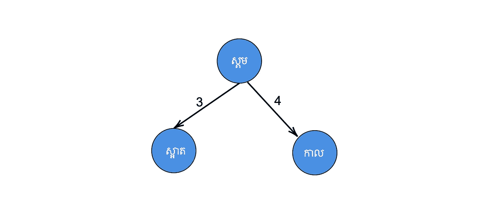**

**图 8:步骤 3-添加第三个单词。作者图片**

****第四步:**设置根节点为当前节点。然后计算“ក្បាល”到当前节点之间的编辑距离，这给我们 dist(ក្បាល，ស្គម) = 4。这一次，当前节点有一个距离为 4 的子节点，即ស្គម).的 dist(កាល在这个场景中，我们通过将子节点设置为当前节点，将插入过程下推到该子节点。之后，我们重复插入过程，当前节点为“កាល”，得到 dist(ក្បាល，កាល) = 2。在这个阶段，没有一个“កាល”的孩子的距离与កាល).的 dist(ក្បាល相等因此，我们插入“ក្បាល”作为“កាល".”的子代**

**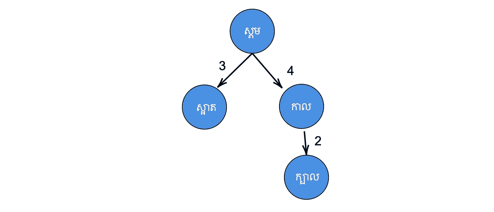**

**图 9:步骤 4-添加第四个单词(当一个孩子有相同的编辑距离时)。作者图片**

**在构建树之后，我们可以搜索它来找到匹配的节点作为单词更正。**

## **BK 树搜索**

**我们可以应用任何树搜索算法来搜索 BK-树。在我们的例子中，我选择了深度优先搜索。然而，BK-tree 给我们的一个特殊功能是能够修剪/跳过树中的大部分节点。它通过允许我们只查看编辑距离在特定容差阈值内的节点来实现这一点。更具体地说，我们只查看当前节点的子节点，其编辑距离在[dist(word，current_node)-N，dist(word，current_node) + N]之间，其中 N 是容差级别。**

**让我们看看，如果用户输入单词“កាក”,并且我们的容忍级别 N = 2，将会返回什么。**

****步骤 1:** 初始化一个空栈和一个空匹配列表。**

**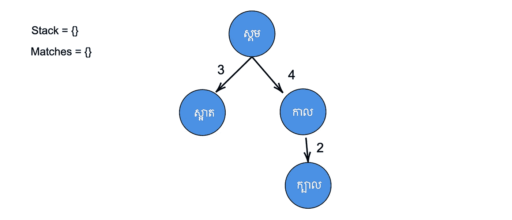**

**图 10:步骤 1-初始化空堆栈和匹配。图片作者。**

****步骤 2:** 将根节点(ស្គម)添加到堆栈中。**

**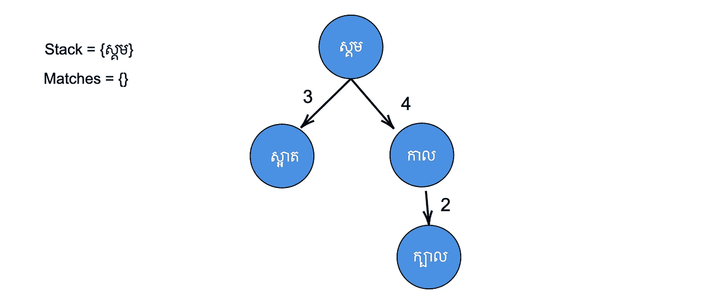**

**图 11:步骤 2——将第一个根节点添加到堆栈中。图片作者。**

****第三步:**获取堆栈顶部的节点(ស្គម).之后，我们发现 dist(ស្គម，កាក) = 4 > N。因此，我们没有将它添加到匹配列表中。然后看看它的孩子“ស្អាត”和“កាល".”对于每个孩子，如果 dist(ស្គម，កាក) - 2 ≤ dist(孩子，ស្គម) ≤ dist(ស្គម，កាក) + 2，那么我们把它加到堆栈中。在这种情况下，“ស្អាត”和“កាល”都被添加到堆栈中，因为 2 ≤ dist(ស្អាត，ស្គម) = 3 ≤ 6，2 ≤ dist(កាល，ស្គម) = 4 ≤ 6。**

**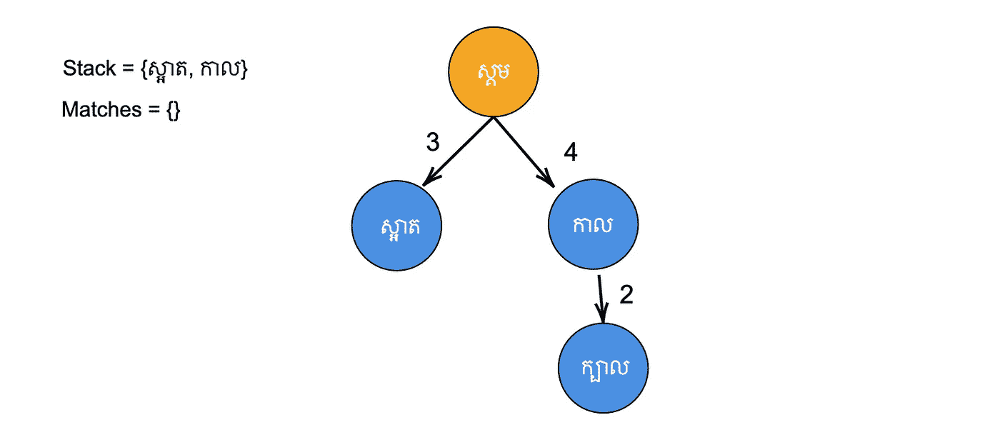**

**图 12:步骤 3-遍历树 1。图片作者。**

****第四步:**获取栈顶节点(កាល).然后，dist(កាល，កាក) = 1 ≤ N。所以我们把它添加到匹配列表中。我们再次找到可以添加到堆栈中的“កាល”的孩子。这次只能添加“ក្បាល”，因为-1 ≤ dist(ក្បាល，កាល) = 2 ≤ 3。**

**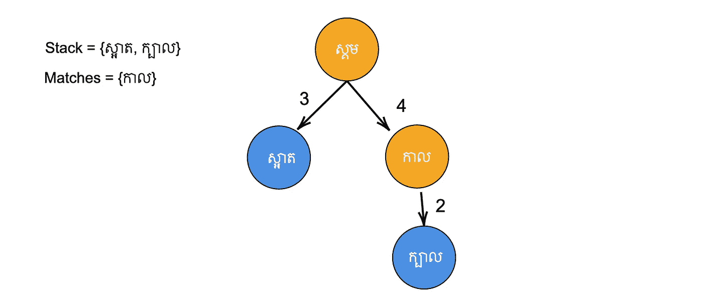**

**图 13:步骤 3-遍历树 2。图片作者。**

****步骤 5:** 获取栈顶节点(ក្បាល).然后，dist(ក្បាល，កាក) = 3 > N。因此，我们没有将它添加到匹配列表中。由于“ក្បាល”没有任何子节点，因此我们不再向堆栈中添加任何节点。**

**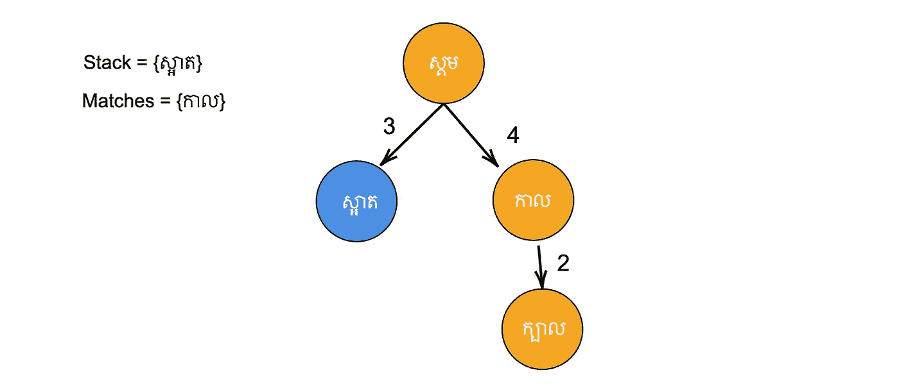**

**图 14:步骤 3-遍历树 3。图片作者。**

****第五步:**获取栈顶节点(ស្អាត).然后，dist(ស្អាត，កាក) = 4 > N。因此，我们没有将它添加到匹配列表中。由于“ស្អាត”没有任何子节点，因此我们不再向堆栈中添加任何节点。**

**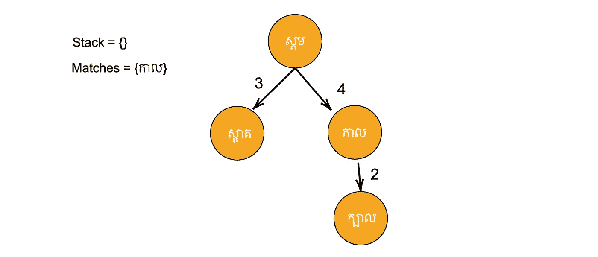**

**图 15:步骤 4-遍历树 3。图片作者。**

****步骤 7:** 由于堆栈中不再有节点，算法结束。**

**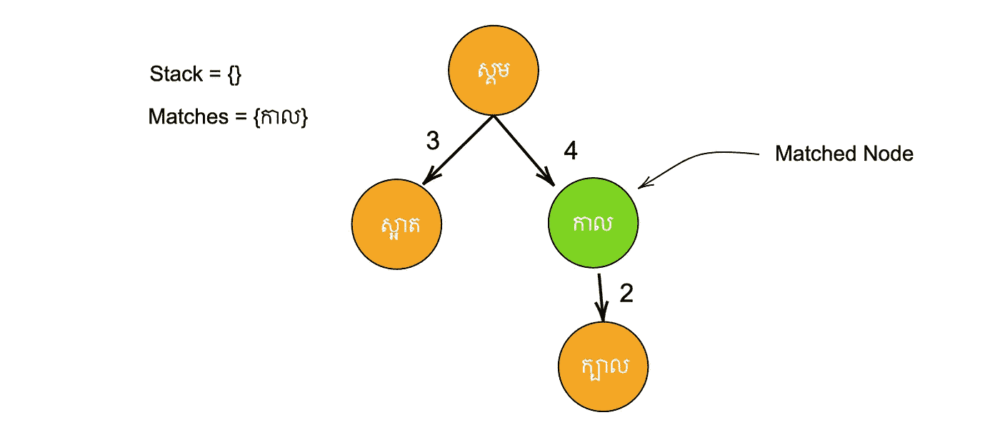**

**图 16:搜索的结果。图片作者。**

**在上面的例子中，搜索遍历了所有节点。但是，当字典中的单词量很大时，这种方法会让我们跳过很多不必要的节点。**

# **四。缺点**

**这种提供可接受结果的拼写检查和建议方法有一些缺点。**

1.  **树构建过程可能需要很长时间才能完成，因此需要预先计算并保存到文件中。**
2.  **建议的质量很大程度上取决于字典中的单词。如果这个单词不在字典中，它就不能被建议。**
3.  **它没有任何先前的上下文单词，因此建议可能不适合整个句子结构。**

# **动词 （verb 的缩写）代码**

**在了解了这些概念之后，我有机会编写一个利用它们的 python 包。我做的第一件事是准备一本高棉语词典。为了做到这一点，我从 [SBBIC](https://sbbic.org/2010/07/29/sbbic-khmer-word-list/) 下载了一个开源(麻省理工学院许可)高棉语单词数据集，并进行了一些预处理，最终得到了一个大约 4 万个独特单词的列表。然后，我使用下面的代码来构建 BK 树，将树保存到 XML 文件中，并使用它来提出拼写建议。此外，我还将它打包成一个 python 库，可以通过 pip 安装。**

## **编辑距离**

## **BK 树结构**

## **BK 树搜索/拼写检查和建议**

# **不及物动词结论**

**学习编辑距离和 BK 树让我实现了一个简单而有效的拼写检查和建议功能。我希望这篇文章能为你提供足够的理解，让你在其他编程语言中实现这些概念，并把它们扩展到不仅仅是拼写检查。快乐学习！**

# **参考**

**背靠背瑞典。(2019).*编辑两根弦之间的距离 Levenshtein 距离(LeetCode 上的“编辑距离”)*【YouTube 频道】。YouTube。从 https://www.youtube.com/watch?v=MiqoA-yF-0M[取回& t=5s](https://www.youtube.com/watch?v=MiqoA-yF-0M&t=5s)**

**EpicFactFind。(2019).*用 Levenshtein 距离和 Bk 树进行拼写检查*【YouTube 频道】。YouTube。从 https://www.youtube.com/watch?v=oIsPB2pqq_8[取回](https://www.youtube.com/watch?v=oIsPB2pqq_8)**

**茹拉夫斯基博士。*最小编辑距离*【PowerPoint 幻灯片】。斯坦福大学。从 https://web.stanford.edu/class/cs124/lec/med.pdf[取回](https://web.stanford.edu/class/cs124/lec/med.pdf)**

**北卡罗来纳州库马尔(2022 年)。 *BK-Tree |简介&实现。*极客 forGeeks。检索自[https://www . geeks forgeeks . org/bk-tree-introduction-implementation/](https://www.geeksforgeeks.org/bk-tree-introduction-implementation/)**

**米什拉，B . h .(未注明)。*布尔夏德·凯勒树(BK 树)。* OpenGenus。从 https://iq.opengenus.org/burkhard-keller-tree/[取回](https://iq.opengenus.org/burkhard-keller-tree/)**

**SBBIC。(2017). *SBBIC 高棉语词表*【数据集】。SBBIC。从 https://sbbic.org/2010/07/29/sbbic-khmer-word-list/[取回](https://sbbic.org/2010/07/29/sbbic-khmer-word-list/)**

**辛格(2020)。BK 树:未探索的数据结构。走向数据科学。检索自[https://medium . com/future-vision/bk-trees-unexplored-data-structure-EC 234 f 39052d](https://medium.com/future-vision/bk-trees-unexplored-data-structure-ec234f39052d)**

**图沙尔·罗伊——让编码变得简单。(2015).*最小编辑距离动态编程*【YouTube 频道】。YouTube。从 https://www.youtube.com/watch?v=We3YDTzNXEk[取回](https://www.youtube.com/watch?v=We3YDTzNXEk)**