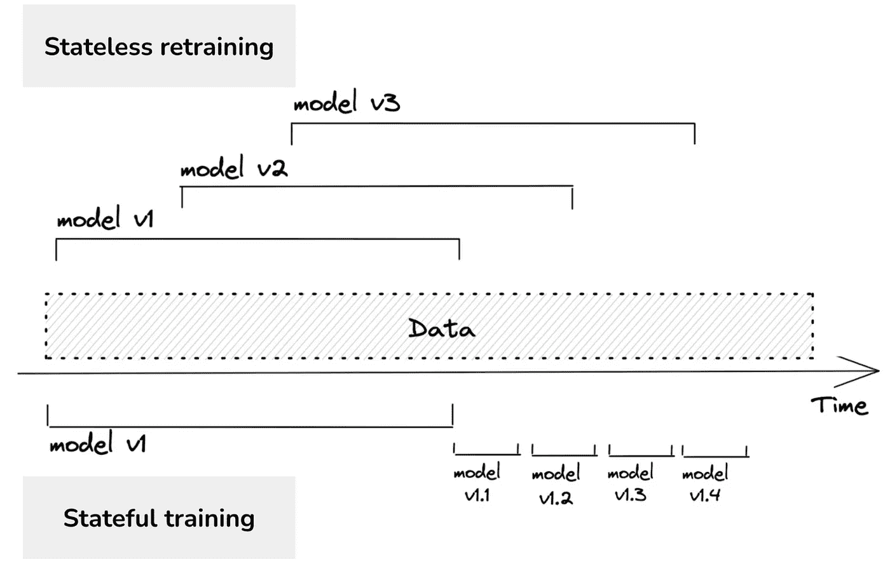
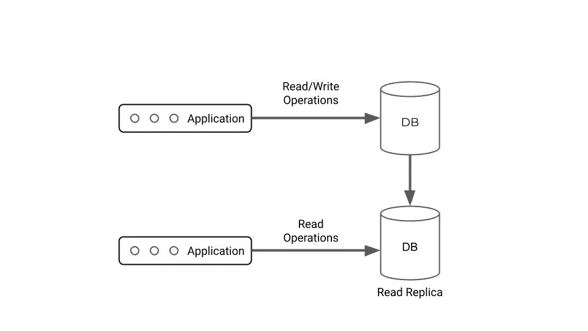
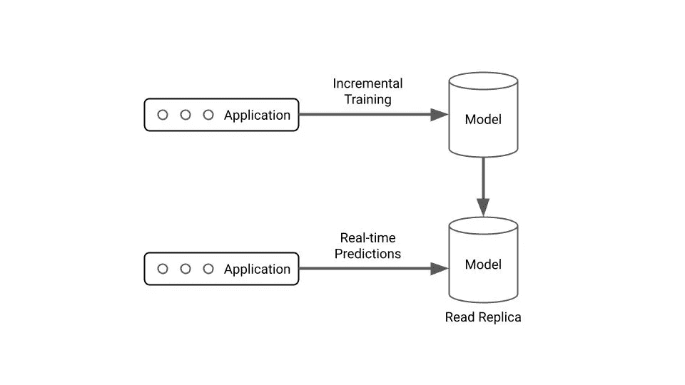

# 为在线学习构建一个有状态的 ML 应用程序

> 原文：<https://towardsdatascience.com/building-a-lil-stateful-ml-application-for-online-learning-66624d62afae>

## 使用 River、Flask、Gunicorn 和多重处理构建在线学习应用程序

我今天看到的大多数实时 ML 系统都是*无状态的*——它们训练和服务一个固定的模型工件，直到被另一个在更新数据窗口上训练的工件完全取代。如果模型被频繁地重新训练，那么无状态的模型重新训练可能是昂贵的——而如果模型没有被足够地重新训练，那么模型漂移就会成为一个问题。

另一方面，s *tateful* 再培训和部署建立在最初的模型工件之上。我们不是执行大批量的训练任务，而是进行增量训练——更频繁地更新模型权重。这样做的优点是既节省成本，又避免了模型漂移。



无状态与有状态再训练——来自 [Chip Huyen](https://huyenchip.com/2022/01/02/real-time-machine-learning-challenges-and-solutions.html)

在部署方面，这也带来了一系列独特的挑战。大多数 web 服务器+ docker 图像+模型工件的模型服务方法都假设工件和模型权重是静态的。以这种方式部署模型的新版本将意味着从像 S3 这样的 blob 存储中进行大量读取。出于对明智的系统设计的兴趣(也因为它很酷)，我想建立一个小的部署，既能在某种规模水平上进行实时预测*又能从地面实况中学习*。

# 建筑

对于这种方法，我在普遍接受的应用程序设计中找不到太多，我认为真正的设计在很大程度上取决于用例。然而，我发现将有状态 ML 应用程序与由数据库支持的有状态 web 应用程序进行比较是一个简单的类比。具体来说，我们希望一个数据库实例针对写入进行优化，另一个针对读取进行优化。



具有读取副本的有状态数据库支持的应用程序——按作者排序的图像

如果我们把 ML 模型看得更像一个有状态的、数据库支持的应用程序——因为它基本上允许读(预测)和写(用基本事实进行增量训练),会怎么样？



带有“读取副本”的有状态 ML 应用程序—由作者创建的图像

极度简化的架构。在模型服务器中，我们本质上想要一个高读取的对象/副本，以及另一个我们可以执行写入的对象/副本，这样我们的模型就可以随着时间的推移而学习。

# 模型

我想用一个“经典”的模型架构来演示这个架构(与某种 RL 相反，基于奖励的代理可能更适合)。因此，我需要使用一个库，在这个库中我可以很容易地对一个只有单一观察值的模型进行连续的训练。

一个同行最近把我放到了 [River](https://riverml.xyz/0.14.0/) 上——一个在线机器学习的 Python 库。虽然它有点类似于更熟悉的 API，如 scikit-learn，但它允许我们轻松地将有用的方法用于我们的用例。

作者代码

上面将返回类似如下的内容:

```
ROCAUC: 95.04%
```

如果您在每次迭代期间打印度量，您可以实时观察模型性能的提高，并且模型从 50–50 随机猜测机器变成训练有素的分类器。

# 应用程序

[*此处查看代码*](https://github.com/kylegallatin/stateful-ml-app) *。对于散文，请继续阅读…*

对于我的第一次尝试，我想为一个 flask 应用程序的单个实例实现这个功能，该应用程序运行在多个 gunicorn 工作进程中。这意味着如果我想更新一个变量，我需要在我的应用程序运行的每个进程中更新它。与使用 Flask 服务无状态模型部署不同，我们实际上关心 fork 后发生了什么(在我们的初始线程分裂成多个工作进程之后)，因为我们需要更新变量。

感谢互联网的魔力，这已经相当可行了——JG 有一个关于这个主题的可爱的[帖子](https://medium.com/@jgleeee/sharing-data-across-workers-in-a-gunicorn-flask-application-2ad698591875)以及一个 Github 回购，我能够派生并适应我的用例。我选择使用`multiprocessing.Manager`类在我的应用程序中跨进程共享数据。这允许我们在任何地方都可以访问的 Python 字典中存储 2 个河流模型(一个写一个读)和我们的度量。

基本应用程序本身很简单([源自 JG 的代码](https://github.com/zealotjin/wsgi_app))，用 5 个工人运行一个 flask+gunicorn 应用程序:

```
import argparse
import os
from multiprocessing import Manager

import gunicorn.app.base
from flask import Flask, request
from river import compose, linear_model, metrics, preprocessing

metric = metrics.ROCAUC()
model = compose.Pipeline(
    preprocessing.StandardScaler(), linear_model.LogisticRegression()
)
app = Flask(__name__)

...

def initialize():
    global data
    data = {}
    data["main_pid"] = os.getpid()
    manager_dict = Manager().dict()
    manager_dict["read_only_model"] = model
    manager_dict["writable_model"] = model
    manager_dict["metric"] = metric
    data["multiprocess_manager"] = manager_dict

class HttpServer(gunicorn.app.base.BaseApplication):
    def __init__(self, app, options=None):
        self.options = options or {}
        self.application = app
        super().__init__()

    def load_config(self):
        config = {
            key: value
            for key, value in self.options.items()
            if key in self.cfg.settings and value is not None
        }
        for key, value in config.items():
            self.cfg.set(key.lower(), value)

    def load(self):
        return self.application

if __name__ == "__main__":
    global data
    parser = argparse.ArgumentParser()
    parser.add_argument("--num-workers", type=int, default=5)
    parser.add_argument("--port", type=str, default="8080")
    args = parser.parse_args()
    options = {
        "bind": "%s:%s" % ("0.0.0.0", args.port),
        "workers": args.num_workers,
    }
    initialize()
    HttpServer(app, options).run()
```

这里最关键的是在`initialize()`函数中，我们定义了一个全局变量`data`——我们在其中存储了我们的`multiprocessing.Manager`对象。在该对象中，我们存储了一个可以更新的模型，一个假设不可变的“只读”模型，以及我们的度量。

之后，我们只需要添加所需的预测和模型更新路线！使用非常熟悉的 flask 语法，我们可以定义执行所需操作的端点。

```
@app.route("/predict", methods=["POST"])
def predict():
    json_request = request.json
    x = json_request["x"]
    return str(data["multiprocess_manager"]["model"].predict_one(x)), 200

@app.route("/update_model", methods=["PUT"])
def update_model():
    json_request = request.json
    x, y = json_request["x"], json_request["y"]
    model = data["multiprocess_manager"]["writable_model"]
    y_pred = model.predict_proba_one(x)
    model.learn_one(x, y)

    metric = data["multiprocess_manager"]["metric"]
    metric.update(y, y_pred)

    data["multiprocess_manager"]["metric"] = metric
    data["multiprocess_manager"]["writable_model"] = model
    data["multiprocess_manager"]["read_only_model"] = model
    return str(data["multiprocess_manager"]["metric"]), 200
```

`/predict`端点是一个 post 请求，它只获得预测。然而，`/update_model`端点将地面实况作为请求并按顺序:

1.  获取给定观察的预测概率
2.  用新的观察更新可写模型
3.  使用预测和基本事实更新指标
4.  替换我们的多处理管理器中的度量、可写模型和只读模型的值

完整代码可以参考 [Github 库](https://github.com/kylegallatin/stateful-ml-app)。如果您想运行它，请使用自述文件中的`docker`命令。应用程序启动看起来会像这样:

```
[2022-12-21 13:44:07 +0000] [8] [INFO] Starting gunicorn 20.1.0
[2022-12-21 13:44:07 +0000] [8] [INFO] Listening at: http://0.0.0.0:8080 (8)
[2022-12-21 13:44:07 +0000] [8] [INFO] Using worker: sync
[2022-12-21 13:44:07 +0000] [27] [INFO] Booting worker with pid: 27
[2022-12-21 13:44:07 +0000] [28] [INFO] Booting worker with pid: 28
[2022-12-21 13:44:07 +0000] [29] [INFO] Booting worker with pid: 29
[2022-12-21 13:44:07 +0000] [30] [INFO] Booting worker with pid: 30
[2022-12-21 13:44:07 +0000] [31] [INFO] Booting worker with pid: 31
```

为了确认它的工作，我们需要确定我们的模型确实在学习，并且这种学习在所有 gunicorn 工人中是持续的。为此，我们可以运行 repo 中的`send_requests.py`脚本。这将向`/update_model`端点发送单个示例，以便模型增量学习，并在每次传递时返回更新的度量。

当您这样做时，您将看到我的可怕的格式化的字节串响应被打印到终端，并且观看模型实时学习！

```
...
b'ROCAUC: 81.90%'
b'ROCAUC: 82.44%'
b'ROCAUC: 82.92%'
b'ROCAUC: 83.41%'
b'ROCAUC: 83.86%'
b'ROCAUC: 84.29%'
b'ROCAUC: 84.72%'
b'ROCAUC: 85.11%'
b'ROCAUC: 85.52%'
b'ROCAUC: 85.90%'
...
```

现在，我们还可以发送单个预测请求来对给定网页是否为网络钓鱼网页进行分类:

```
curl -X POST -H 'Content-Type: application/json' \
  localhost:8080/predict -d \
  '{"x": {"empty_server_form_handler": 1.0, "popup_window": 0.0, "https": 1.0, "request_from_other_domain": 0.0, "anchor_from_other_domain": 1.0, "is_popular": 0.0,"long_url": 0.0, "age_of_domain": 1, "ip_in_url": 0}}'

False
```

😱

# 未来的工作

好的，所以当我开始总结这个的时候，我开始有额外的想法和问题…

*这个会缩放吗？*

没有可能。如果我们要同时服务于从多个应用程序运行时更新我们的模型的*和*，我们可能想要部署类似 Redis 的东西来存储我们的模型(或者甚至用作实时参数服务器),而不是将我们所有的模型和度量存储在多处理管理器中。如果我将它部署到 Kubernetes，我可能会将培训/服务部署完全分离到单独的应用程序中，对 GCS 进行频繁的模型备份，在更新后添加检查点和测试，等等……但我现在不会这样做。

*替代方法？*

这么多。理论上，即使我们执行有状态的再训练，我们仍然可以有无状态的部署(部署将会用新的模型工件更频繁地更新)。这将减少人们重用现有模型部署的范例，而不会增加有状态服务的复杂性。尽管如此，将分布式离线培训技术(如联合学习或使用参数服务器)应用到在线领域还是很酷的，对吗？

这有必要吗？

取决于我想象的用例。对于学习边缘设备和案例来说，如果我们(1)有现成的基础知识，并且(2)最新的模型很重要，那就太好了。然而，在我们不知道或不能快速接收地面真相的情况下…可能不值得复杂和开销。没有什么比将一个陈旧的模型工件投入生产，然后让它坐以待毙更好的了。

不管怎样，这很有趣，我希望你喜欢它！期待更多。


来自斯凯岛的愚蠢美丽的照片用作封面照片——图片由作者提供

感谢 JG 的代码，感谢 Nick Lowry 对 River 的提醒，感谢 Cole Ingraham 的一些深思熟虑的来回帮助我塑造未来的工作，感谢 Chip Huyen 一贯的一针见血！