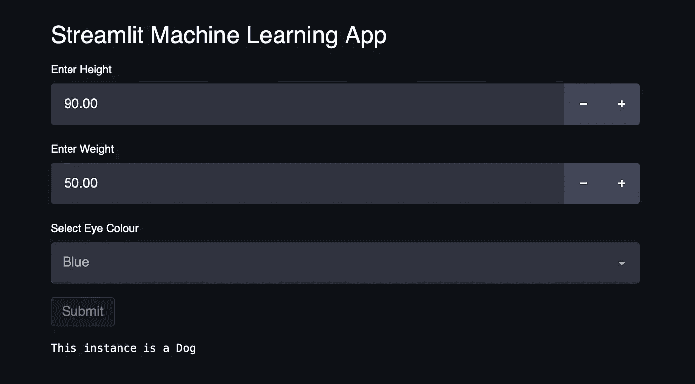
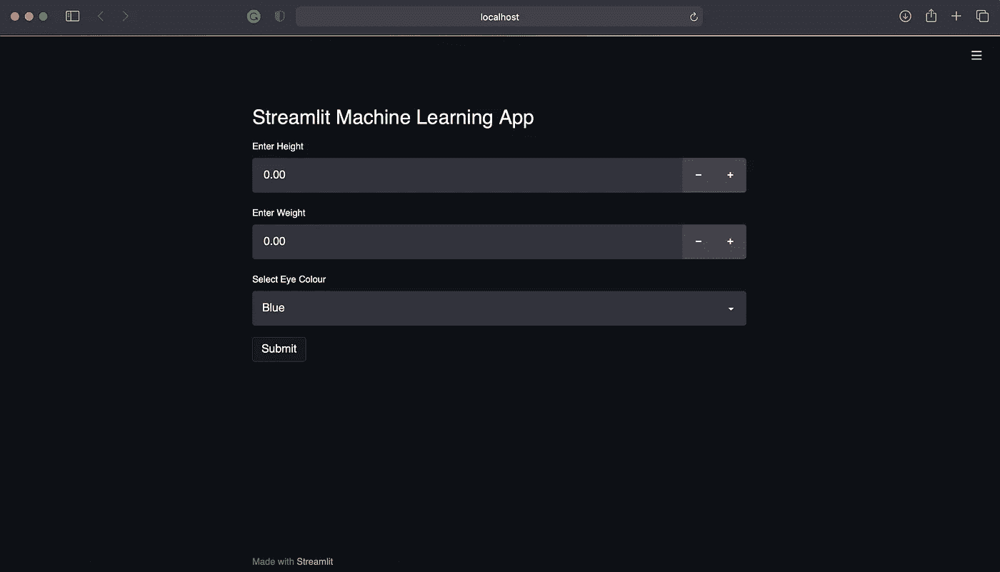
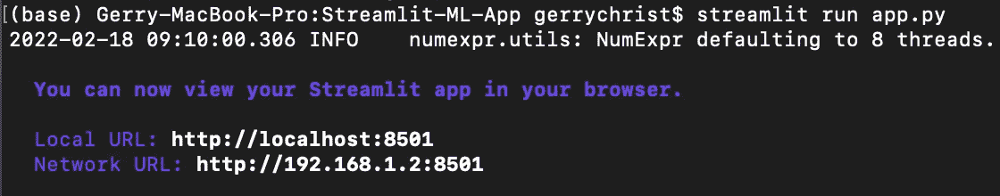
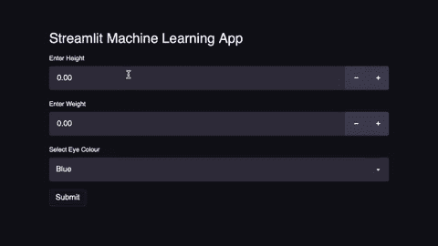

# 使用 Streamlit 构建机器学习 Web 应用程序

> 原文：<https://towardsdatascience.com/building-a-machine-learning-web-application-using-streamlit-8c3d942f7b35>

## 关于构建 Streamlit 机器学习应用程序的简单教程



作者图片

如果你是数据科学家或者数据科学专业的学生，你应该知道机器学习是如何工作的。您知道算法的细节，使用哪个库，并执行诊断。假设在一个商业环境中，你手里有一个完美的模型，结果很优秀，一切都很理想。然后呢？建议我们将代码交给相关的涉众，如果他们想看到结果，请他们运行代码，这确实很诱人。但这不是商业环境的运作方式。这个问题的一个解决方案是创建一个机器学习 web 应用程序。有了这个解决方案，利益相关者就可以通过一个网站访问和运行你的机器学习模型，而不是一些他们看不懂的代码。

在我之前的教程中，我演示了使用 Flask 创建 ML 应用程序，Flask 是 Python 中常用的 web 框架。

[](/building-a-machine-learning-web-application-using-flask-29fa9ea11dac) [## 使用 Flask 构建机器学习 Web 应用程序

### 使用 Python 和 Flask 实现机器学习 API 的简单教程

towardsdatascience.com](/building-a-machine-learning-web-application-using-flask-29fa9ea11dac) 

不幸的是，我意识到许多数据科学家缺乏必要的网页设计和工程知识来完成这样的项目。本文将介绍一种更友好的替代方法，使用 Streamlit 创建 ML 应用程序。

Streamlit 是一个 app 框架，不需要 HTML、CSS 等网页设计工具的知识(不像 Flask)。如果你完成了 Flask 教程，你会惊讶于创建一个 Streamlit 应用程序是多么简单。当然，Streamlit 也有一些限制，比如你不能控制域路由，你的设计选择也是有限的。但是我相信，作为一名数据科学家，你会发现这些限制对于你的目的来说是微不足道的。

## 机器学习模型

本节中的 Python 文件将被命名为`model.py`。

在构建 ML 应用程序之前，我们需要一个机器学习模型。我们将使用这个简单的数据来创建一个分类模型，

简单的数据带来简单的模型。我确信我不必向像你这样的机器学习专家解释下面的代码。

这是一个简单的逻辑回归模型来预测二元结果。是的，我没有做训练测试分割，也没有预测任何事情。因为对于本教程，我只需要最终的分类器。如果你跟着我，确保`clf`是你想要使用的型号。

下一步是腌制模型。酸洗仅仅意味着将模型存储到一个`.pkl`文件中。这样做的目的是将训练过程和用户体验分开(即用户不必忍受模型训练时间)。为此，将以下代码添加到`model.py`

检查文件`clf.pkl`现在是否在你的目录中。

## 应用程序

本节中的 Python 文件将被命名为`app.py`。

Streamlit 让生活变得简单，因为它结合了应用程序的后端和前端。我将给出一个 Streamlit 如何取代 HTML 的例子。

在 HTML 中，要制作一个数字输入栏，您必须编写，

```
<input type="number", name="", placeholder=""/>
```

获取该输入的值可以通过发送到后端脚本的 POST 请求来完成。在 Streamlit 中，这可以在一个文件中通过简单地编写`x = st.number_input("placeholder")`来完成，输入值直接存储在变量`x`中。

我会给出我是如何创建这个应用程序的。这应该是不言自明的。

让我简单解释一下每一行。

*   第 6 行打印出标题。这相当于 HTML 中的`<h1>`或`<h2>`标签。
*   第 9 和 12 行是输入栏。输入值存储在变量`height`和`weight`中。这相当于 HTML 中的`<input type = "number">`。
*   第 15 行是下拉输入。该选择将被记录在变量`eyes`中。该下拉菜单的选项为`Blue`和`Brown`。这相当于 HTML 中下拉菜单的`<select>`标签和选项的`<option>`标签。
*   第 18 行是一个按钮。我把它放在一个 if 语句中，因为如果按下它会简单地返回`True`。这相当于 HTML 中的`<button>`标签。
*   21 号线正在调用我们之前训练和腌制的模型。
*   第 24 行将输入存储到数据帧中，随后是第 26 行中的简单处理。这个过程正是我们在`model.py`中所做的。
*   第 29 行使用模型预测给定输入的输出。
*   第 32 行打印输出。这相当于 HTML 中的`<p>`标签。注意`print()`不会出现在 Streamlit 应用上。

运行`app.py`会给我们这个页面。



网页结果

此应用程序现已准备就绪。您可以通过使用其他 streamlit 对象来试验设计。查看文档`[https://docs.streamlit.io/](https://docs.streamlit.io/)`并在左侧栏中查找章节`API reference`了解更多可能性。

# 运行应用程序

要运行我们刚刚创建的应用程序，请转到您的终端或命令提示符。您必须将目录设置为您的项目目录。在我的例子中，文件夹名是`Streamlit-ML-App`。所以我应该在终端中写的命令是，

```
cd path/to/my/directory/Streamlit-ML-App
```

如果您不知道目录的路径，请在`model.py`中运行这段代码

```
import os
print(os.path.dirname(os.path.abspath(__file__)))
```

这段代码的输出应该是`path/to/your/directory/Streamlit-ML-App`或者你正在使用的任何文件夹名。因此，将输出复制到您的终端。别忘了加上`cd` prior。

然后你应该使用下面的命令运行你的 Python 文件`app.py`。

```
streamlit run app.py
```

如果您做的一切都正确，您应该在终端中看到这个输出，



如果本地主机页面没有自动打开，请复制其中一个 URL 并将其粘贴到您的浏览器中。

放入一些输入，测试你的机器学习模型是否已经成功实现。



最终应用

我们可以看到，对于条目`height = 90, weight = 40, eyes = 'Brown'`，我的机器学习模型预测这个实例是一只狗。对于条目，`height = 70, weight = 30, eyes = 'Blue'`模型预测这个实例是一只猫。

# 恭喜

我们已经成功创建了一个可供部署的 Streamlit 机器学习应用程序。我希望您能清楚地看到，与典型的 web 框架相比，这是多么简单。我的应用程序一点也不好看，因为它非常简单。请进一步研究 Streamlit 文档，使您的应用程序更加美观。你可以在 [GitHub](https://github.com/gerchristko/Streamlit-ML-App) 上找到我的完整代码和数据集。感谢您的阅读！