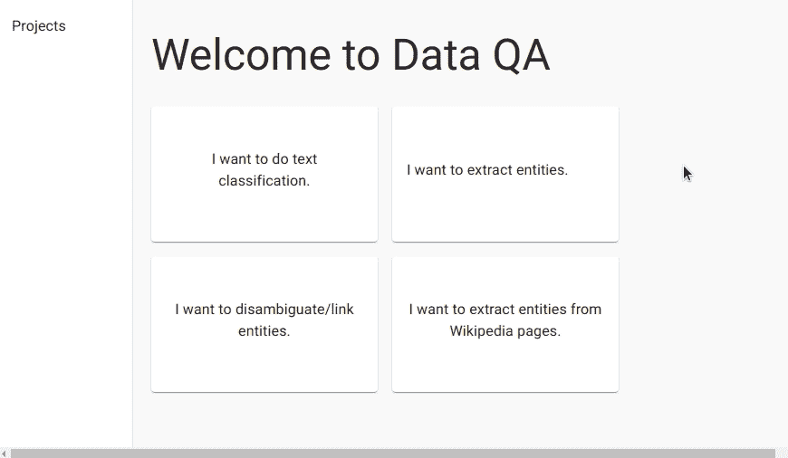
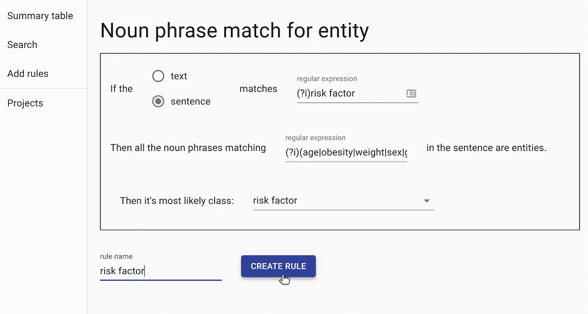
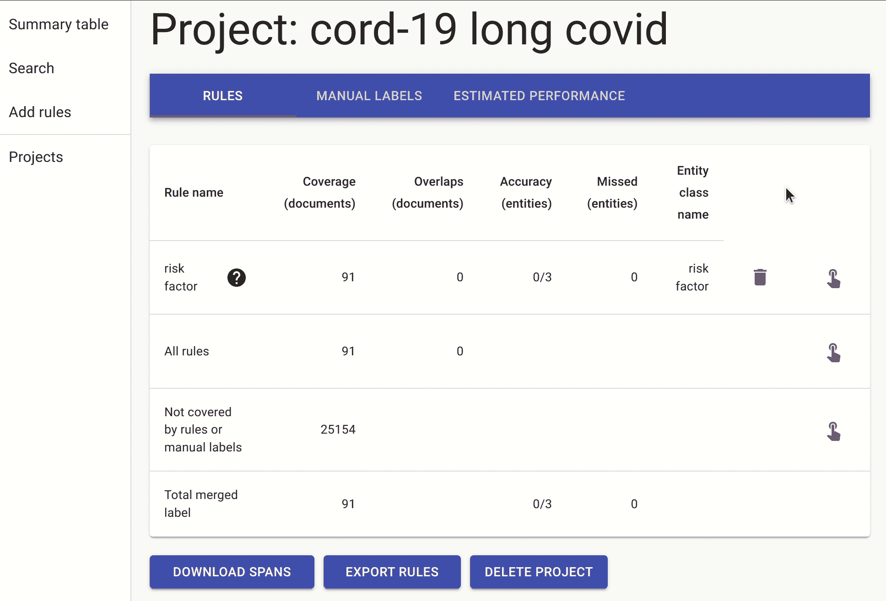
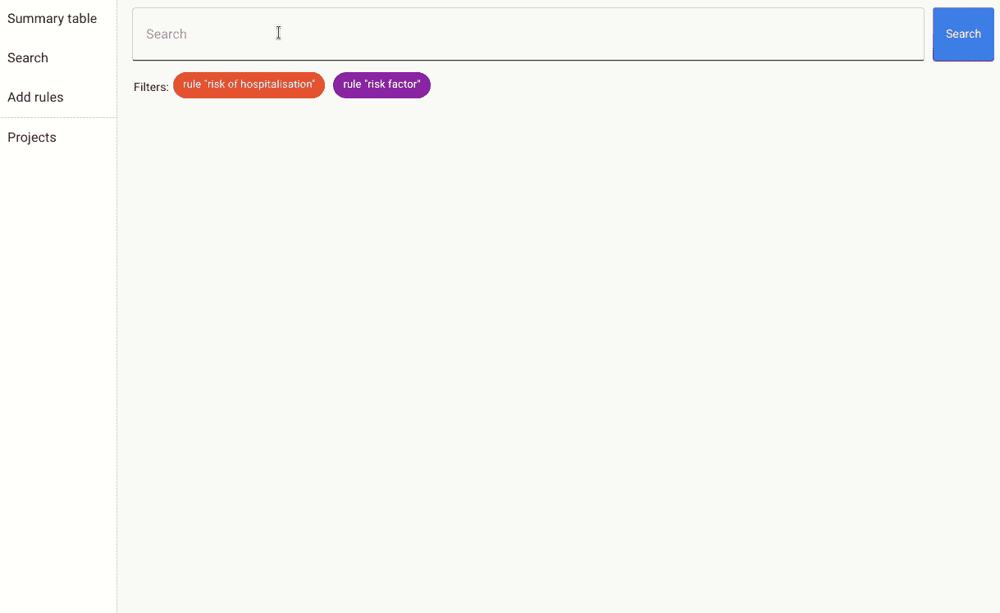
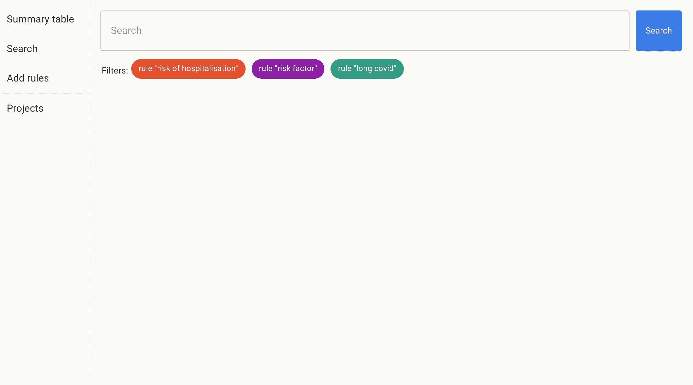

# 为新冠肺炎风险因素构建命名实体提取器

> 原文：<https://towardsdatascience.com/building-a-named-entity-extractor-for-covid-19-risk-factors-cb9bf9022b5e>

## 如何从大量数据中提取信息


照片由[龙之介·菊野](https://unsplash.com/@ryunosuke_kikuno?utm_source=medium&utm_medium=referral)在 [Unsplash](https://unsplash.com?utm_source=medium&utm_medium=referral) 上拍摄

如何从成千上万的文档中提取包含在几个句子中的信息？你如何标注一个巨大的文本语料库？

在本教程中，我们训练并构建了一个命名实体识别器(NER ),使用最大的可用医疗数据集之一来检测新冠肺炎风险因素。

# 数据集:cord-19

cord-19 数据集汇集了超过 50 万篇关于新冠肺炎和其他冠状病毒相关疾病的研究论文，并由 AllenAI 研究所定期更新。本教程使用的数据遵循了与 github 存储库中显示的数据集相似的处理:[https://github.com/allenai/cord19](https://github.com/allenai/cord19)。

我们的目标是找到医学论文中提到的导致严重 COVID 的主要危险因素。

# 我们如何继续注释这个？

使用像这样的大型语料库的一个问题是，信息只会出现在几十万个文档的几个段落中。这就像大海捞针。我们如何标注这样一个语料库？唯一的方法是将问题缩小到可能包含我们需要的信息的较小的文档子集。为此，我们可以使用正则表达式或其他类似的规则，首先搜索可能拥有我们需要的信息的候选对象。

为了探索和注释这个数据集，我们使用开源库 [DataQA](https://github.com/dataqa/dataqa) ，这是一个基于 Python 和 React 的库，用于数据探索和标记。这个 python 包包括 elasticsearch 文本搜索引擎，可以很容易地与 pip 一起安装。

我们首先为命名实体识别创建一个项目并上传数据。



在 DataQA 上为 cord-19 数据集创建一个新的 NER 项目。

在我们的文档被上传和索引后，我们需要缩小可能包含我们想要的信息的一些段落的范围。为了实现这一点，我们可以创建我们的第一个规则。规则如下:文档必须包含带有“风险因素”一词的句子，以及多个已知风险因素中的一个，如“年龄”、“肥胖”等。



缩小包含“风险因素”和多个已知风险因素之一的句子的文档范围的规则。

此规则将查找包含总结了迄今已知的所有新冠肺炎风险因素的句子的文档。这样的搜索对于主要关注关键词搜索的标准搜索引擎来说是不可能的。DataQA 还将使用规则预先标记所有已知的风险因素，使手动过程更加高效。



预先标记的示例:该规则自动提取风险因素，从而更快地标记文档。

我们包括了另一个规则，这是一个稍微不同的方式来表达同样的想法:文件必须包含一个句子，要么“风险”，然后是“住院/住院”(或以相反的顺序)，然后是一个已知的风险因素。

一旦我们有了这些规则，我们就可以用规则中的前标签来注释文档，或者进行搜索。在搜索中，我们应用规则作为过滤器，并搜索 covid 的提及，因为有许多论文讨论了其他不相关条件的风险因素。



同时有效搜索和标记文本的例子。

这样做了一段时间后，我们得到了一个由 42 个文档组成的小标签集，我们用它来训练命名实体提取器。这是一个小的训练数据集，我们的目标是看看我们是否可以快速训练 NER 来检测更多的风险因素，而不需要做任何额外的手动标记。

# 用空间建造 NER

我们使用 Spacy 来基于我们刚刚注释的数据构建命名实体提取器。我们首先需要准备训练数据。

准备来自 DataQA 的标记数据以用作训练数据。

然后，训练我们的 NER 的代码如下。我们使用一个 Spacy 管道，增加一个句子分割器来检测句子边界，并用一个新的只有“风险因素”作为实体的 NER 步骤来代替默认的步骤。然后以小批量训练管道，以避免过度配合。

# 发现新提及的风险因素

一旦我们训练了我们的 NER，我们就可以在一组未标记的文档样本上运行它，看看我们是否能找到一组在手动标记过程中没有识别出的新的风险因素。这里值得一提的是，我们正在对上述规则挑选出的文档运行我们的模型，以避免得到太多的误报。

以下是一些由 NER 确定的风险因素的例子，这些因素没有被人工标记:神经肌肉疾病、种族/民族、孕前肥胖等。

总而言之，将我们所有的发现放在一起，文献中提到的严重 covid 的前 20 个风险因素按样本中提到它们的论文数量排列如下:

```
[('diabetes', 87),
 ('hypertension', 84),
 ('age', 79),
 ('obesity', 67),
 ('smoking', 36),
 ('sex', 27),
 ('cardiovascular disease', 27),
 ('gender', 27),
 ('older age', 20),
 ('copd', 19),
 ('asthma', 18),
 ('male sex', 18),
 ('chronic kidney disease', 16),
 ('chronic obstructive pulmonary disease', 14),
 ('bmi', 13),
 ('pneumonia', 13),
 ('therapy', 12),
 ('cardiovascular', 11),
 ('cancer', 11),
 ('diabetes mellitus', 11)]
```

一些风险因素指向相同的潜在实体(例如，“年龄”和“老年”是相同的风险因素)，并且“治疗”是不属于该列表的错误位置。然而，这个列表让我们对文献中讨论的关键因素有了一些了解。

# 长 covid 呢？

鉴于数据的缺乏，很少有论文讨论长 COVID 的风险因素。因此，搜索这些提及具有挑战性，因为信息很少。

我们使用与之前相同的方法来筛选可能的候选人。这一次，论文的数量少了很多，所以我们可以直接获得信息。



经过快速搜索，我们发现了大量引用女性、年龄增长、身体质量指数增加以及第一周报告的症状数量的论文，作为新冠肺炎患者是否会发展为长期 COVID 的预测特征。

*如果您想了解更多关于 DataQA 的数据探索，请前往我们的* [*资源库*](https://github.com/dataqa/dataqa) *获取更多教程和示例。我们还提供该产品的企业版，可以直接处理 pdf 文件(查看我们的* [*网站*](https://dataqa.ai/) *)。别忘了留下一颗星来支持这个开源项目:-)*