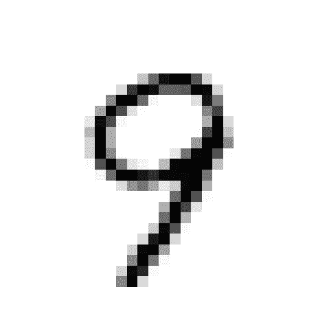
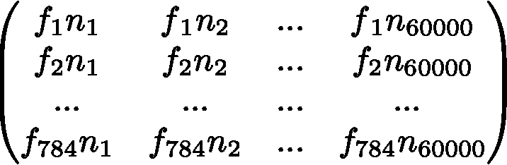
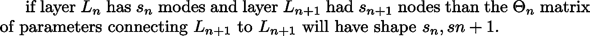
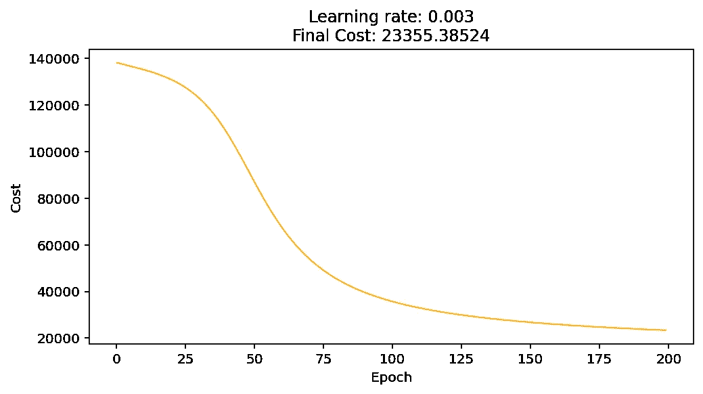
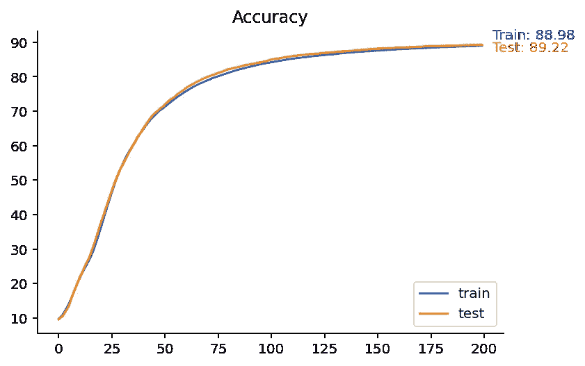
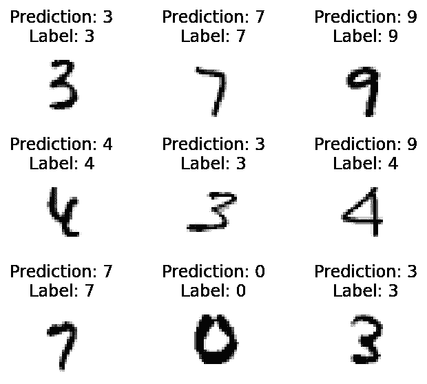

# 如何从零开始构建神经网络

> 原文：<https://towardsdatascience.com/building-a-neural-network-from-scratch-8f03c5c50adc>

## 没有框架，只有 Python


布雷特·乔丹在 [Unsplash](https://unsplash.com?utm_source=medium&utm_medium=referral) 上的照片

> “我不能创造的东西，我不理解”(理查德·费曼)

这句话是在[理查德·费曼](https://en.wikipedia.org/wiki/Richard_Feynman)去世时的[黑板](https://i.imgur.com/2yF4l.jpg)上发现的。我一直认为引用费曼的话有些老套。然而，当一句引语完美地表达了你的感受时，诉诸陈词滥调可能是合理的。

让我解释一下:我知道有几十篇关于本文主题的优秀文章、教程和视频。我们需要另一个吗？简单说说为什么我认为我的观点与众不同。本人 51 岁，无论是编程，微积分，线性代数，还是工科背景都是*零*。大约 12 个月前，我开始自学编程和人工神经网络。在大量关于深度学习的教程和课程之后，其中大多数都利用了现有的框架，如 PyTorch、sci-kit learn 和 TensorFlow，我仍然觉得我对某些概念的理解有些不对劲。当我对一件事理解不透彻的时候，我总是做同样的事情:从头开始构建。因此，我决定不借助任何框架来实现一个简单的人工神经网络(ANN 或 NN)。这篇文章说明了我的尝试的结果。也许，有些人会发现这是徒劳的。希望其他人会发现它很有帮助——甚至可能学到一些东西。

(请注意，这不是对神经网络的介绍，我也不会解释支撑算法的数学。我假设我的读者熟悉深度神经网络背后的基本概念，例如反向传播。如果你不是，你可以做得比在 YouTube 上看 [3blue1brown 的系列更糟](https://www.youtube.com/playlist?list=PLZHQObOWTQDNU6R1_67000Dx_ZCJB-3pi)。

最后，请注意，我欢迎批评和建议。如果你发现了一个错误，请随时[联系](http://sassoli.medium.com)！

有兴趣的可以在[这个 GitHub repo](https://github.com/bsassoli/NN_from_zero) 里找代码。)

# 入门指南

首先，我们导入一些库。由于我们不会使用任何深度学习或机器学习框架，所以导入的数量有限。

导入库

我决定使用 [MNIST_784 数据集](https://www.openml.org/d/554)来训练和测试这个网络。如果你正在阅读这篇文章，你可能知道， [MNIST](https://en.wikipedia.org/wiki/MNIST_database) 被认为是深度学习的“你好，世界”。这是一个由 70.000 幅手写数字灰度图像组成的数据集；用作者的话说:

> “对于那些希望在真实世界数据上尝试学习技术和模式识别方法，同时在预处理和格式化方面花费最少精力的人来说，这是一个很好的数据库。”

我们可以下载 MNIST 作为一个`python`字典(使用例如`scikit-learn`)，如下所示(我们将数据集本身存储在`data`，将标签存储在`labels`:

装载 MNIST

让我们来探索数据集。我们随机选取一个数据点来了解图像及其形状:

探索 MNIST 数据点



所以我们知道我们的图像是一个形状为 784 的向量:一个扁平的 28 x 28 的矩阵。如果我们将数据集分成具有例如 60.000 个数据点的训练集和具有 10.000 个数据点的测试集，我们将得到如下结果:*输入层大小= m*n，*其中 *m* 是样本数， *n* 是特征数。

因此，网络的输入图层大小为(60.000 x 784)。假设我们将训练数据集表示为以行表示要素，以列表示示例，那么我们将以类似如下的内容结束:



让我们首先考虑一个简单的全连接神经网络，只有一个隐藏层。假设隐藏层有 512 个节点。第一个问题是:我们如何控制从输入层到隐藏层的映射？换句话说，**权重矩阵**的大小应该是多少？输入层中的每个节点都将连接到隐藏层中的每个输入。因此，我们将需要 784 x 512 = 401，408 个权重或可训练参数。并且由于到隐藏层的每个连接将向每个加权和添加一个偏差，我们将需要 512 个偏差。作为**一般规则**:



权重矩阵的形状规则

(获得维度权限总是让我抓狂:[这个](https://www.coursera.org/learn/neural-networks-deep-learning/lecture/Rz47X/getting-your-matrix-dimensions-right)，吴恩达提供的，是我迷路时用的。)最后，这是我们得到的具有由 4 个神经元组成的单一深层的 NN:

图层的形状

(但是记住:我们需要给隐藏层的每个节点加上*偏差*。)

# 搭建舞台

先来定义一些常用的 [**激活函数**](https://machinelearningmastery.com/choose-an-activation-function-for-deep-learning/) :

激活

在本文中，我将只使用 [**整流线性单元(ReLU)**](https://machinelearningmastery.com/rectified-linear-activation-function-for-deep-learning-neural-networks/) 函数，但是 NN 应该足够灵活以适应其他选择。当我们实现神经网络时，我们会记住这一点。

对于**输出层，**我们将使用 [**softmax**](https://medium.com/data-science-bootcamp/understand-the-softmax-function-in-minutes-f3a59641e86d) **，**鉴于这是一个多类分类问题。

Softmax

在训练我们的网络之前，我们需要一些预处理函数:

1.  *归一化*功能将输入缩放至[0，1]范围，并且
2.  一个 *one-hot-encode* 函数，它将把标签数组从一个 *n* 大小的向量(其中 *n* 是样本数)变成一个 *n x m* 数组(其中 *m* 是可能的输出数)。

缩放特性有多种方式:在我们的例子中，我们将使用*最小-最大缩放*(我们也可以将每个特性除以一个特性可能取值的数量——在我们的例子中是 255):

缩放比例

为了对标签执行一次热编码，我们可以创建一个单位矩阵(即对角线上由 1 和其他地方的 0 组成的矩阵)，其形状与我们的标签向量相同，然后用标签向量本身对其进行索引，如下所示:

```
label                            encoded
-------  -------------------------------
      5  [0\. 0\. 0\. 0\. 0\. 1\. 0\. 0\. 0\. 0.]
      0  [1\. 0\. 0\. 0\. 0\. 0\. 0\. 0\. 0\. 0.]
      4  [0\. 0\. 0\. 0\. 1\. 0\. 0\. 0\. 0\. 0.]
      1  [0\. 1\. 0\. 0\. 0\. 0\. 0\. 0\. 0\. 0.]
      9  [0\. 0\. 0\. 0\. 0\. 0\. 0\. 0\. 0\. 1.]
      2  [0\. 0\. 1\. 0\. 0\. 0\. 0\. 0\. 0\. 0.]
      1  [0\. 1\. 0\. 0\. 0\. 0\. 0\. 0\. 0\. 0.]
      3  [0\. 0\. 0\. 1\. 0\. 0\. 0\. 0\. 0\. 0.]
      1  [0\. 1\. 0\. 0\. 0\. 0\. 0\. 0\. 0\. 0.]
      4  [0\. 0\. 0\. 0\. 1\. 0\. 0\. 0\. 0\. 0.]
```

标签的一键编码

因为原始数据可以以不同的方式组织，所以我决定，作为一种设计选择，将适当的整形和一次性编码留给用户:也就是说，将由他们来预处理训练数据集和测试数据集，以便将特性作为行传递，将示例作为列传递，并将标签传递给`one_hot_encode`函数。相反，缩放将由网络本身来执行。

最后，我们将需要激活函数的**导数**来执行**梯度下降**:

派生物

# 实现神经网络

我们现在已经拥有了深度神经网络所需的一切，我们将把它实现为一个`class`。所以我们需要思考:

*   一个`**init**`的方法；
*   一种**正向传播**方法；
*   如何实现**反向传播**；
*   如何**训练**网络；
*   如何计算**成本函数**；
*   方法进行**预测，**，最后:
*   一种**实现准确性等指标**的方法。

我的思考过程大致如下。我们可以将以下参数传递给构造函数:

*   带有相应标签的训练集
*   带有*标签的测试装置*
*   激活功能选项(字符串形式)
*   我们需要预测的班级数量
*   架构——我们用列表来表示，其中列表的每个元素对应于一个*深层*,并指示该层中神经元的*数量。*

然后，我们使用字典来存储这些层，并用字符串来命名它们，以便于跟踪(这也是我从[吴恩达的机器学习课程](https://www.coursera.org/learn/machine-learning?utm_source=gg&utm_medium=sem&utm_campaign=07-StanfordML-ROW&utm_content=B2C&campaignid=2070742271&adgroupid=80109820241&device=c&keyword=machine%20learning%20mooc&matchtype=b&network=g&devicemodel=&adpostion=&creativeid=516962315003&hide_mobile_promo&gclid=Cj0KCQiA_8OPBhDtARIsAKQu0gaXbQX1Gl2TcnOc5pDn7BJvioZ8XIH1m3teUKxKeJbZqy6XBKa8WHoaAlTpEALw_wcB)中学到的技巧)。

神经网络 __init__ 方法。

注意一堆`assert`语句。我再强调这一点也不为过:如果你不想花时间去调试地狱，考虑一下如何测试你的网络，并在你的方法中随意加入需要满足的条件。

当构造函数被调用来实例化一个 NN 时，它会执行一系列操作:

1.  它对训练集 X 中的特征进行归一化；
2.  它在`architecture`列表的开头添加了一个大小为 *m* 的层，其中 *m* 是特征的数量(它从第一个训练示例的形状中推断出来的)，并在末尾添加了另一个大小为 *n* (类的数量)的层；
3.  它初始化一个名为参数的空`dict`来存储偏差和权重。

一旦我们有了`init`，我们就可以考虑初始化这些参数的方法。为此，我们进行如下操作:

*   我们迭代*深*层的数量(因此，从 1 开始，到 *L* -1 结束，其中 *L* 是`architecture`列表的长度)。
*   对于每一层，我们向`parameters`字典中添加一个用于权重的键值对和另一个用于偏差的键值对
*   为了简单起见，我们通过从形状的正态分布样本中随机选取来初始化**权重**:*I 层中的节点数，*I 层中的节点数， *i+1)* 并将它们缩放 100 倍。更好的选择可能是使权重初始化依赖于所选择的激活函数(例如，参见[本文](https://machinelearningmastery.com/weight-initialization-for-deep-learning-neural-networks/))
*   **偏差**是零向量:层中的每个节点一个。我们使用关键字 *w{i}* 和带有关键字 *b{i}的每个偏置向量将每个权重矩阵存储在字典中。*

参数初始化

# 前馈、反向传播和拟合

## 前馈

现在我们来看看**正向传播**和**反向传播**的方法。

我希望这两种方法都不接受任何参数作为输入(当然，除了类本身),并且就地修改模型。为什么？因为我们将把数据传递给 **fit** 方法，并且对向前和向后传递的调用将在那里发生。(然而，我们确实需要每次向前传递返回一个**成本**值，我们将在梯度下降期间拟合模型时使用该值。)

因此，下面是我们如何实现`forward`方法。您可能记得我们初始化了两个字典:一个用于层，一个用于参数(我们使用上面的`initialize_parameters`方法填充)。对于除输入和输出层之外的每个层*中的每个节点，我们将需要一个输入(输入的加权和)和一个激活输出。我们可以在我们的`layers`字典中为模型架构中的每一个 *i* 深层分别存储为 *z{i}* 和 *a{i}* 。因此:*

*   我们迭代范围(1，架构的长度-1)；
*   为了获得该范围内每个 *i* 的`layers[zi]`,我们计算`parameters[wi]`和`layers[a-i]`的点积，再加上`parameters[bi];`
*   最后，为了获得激活输出`layers[ai]`，我们将选择的激活函数应用于`layers[zi]`。我们存储层的值，因为当我们执行反向传播时需要它们。

正向传播

作为一个实现说明:我被成本函数计算中的溢出逼疯了，直到我意识到这是由于可能被零除。因此在成本计算中为 0.00000001。

## 反向传播

反向传播算法的实现在结构上相对简单。它与前向传递的算法非常相似(这里我不打算讨论反向传播算法背后的数学，因为这已经超出了本文的范围)。我们初始化一个空的`derivatives`字典来存储渐变，并从右到左遍历各层。对于每一层，我们计算`dZ`，并使用它来计算该层的`dW`和`dB`(分别更新权重和偏差)。这就是我们之前定义的`layers`字典派上用场的地方，因为我们需要访问每一层的输入`z`和激活`a`。首先，让我们计算最后(输出)层的梯度。

对于**最外层的**层来说，`dz`仅仅是`output — ground truths`的结果。(注:`dz`是什么形状？有多少标签就有多少行，有多少训练示例就有多少列——因此，当我们用存储在`layers`中的值打点它时，我们需要转置它。请记住这一点。)

然后我们可以如下计算`dW`和`db`:

1.  权重的梯度是`dz`的点积和*从*先前*层转置*的激活(见上述注释)(实例数量的平均值)
2.  偏差的梯度只是平均的`dz`(注意，我们需要`keepdims=True`，否则，数组将被挤压成形状(1)，作为秩 1 数组，这可能导致[不明确的结果](https://www.kdnuggets.com/2020/07/numpy-handle-dimensions.html)。
3.  我们将该层激活的渐变存储在变量`dAPrev`中。

然后我们在剩余的层上循环，除了这次我们将`dz`计算为层的激活函数与`n+1th`层的激活梯度`dAPrev`的乘积。

最后，我们归还`derivatives`字典。

反向投影

## 拟合、精确度和预测

我们现在把它们放在一起训练网络。我们将一个**学习速率**和多个**时期**传递给`fit`方法。这将通过调用`initialize_parameters`来训练模型，并且对于每个时期运行一个正向传递，随后是返回梯度的反向传播。这些将依次用于更新可训练参数。在培训期间，费用将存储在一个列表中，以供将来参考。训练集和测试集(这里定义为`accuracy`)上的性能也将被存储和显示。

适合模型。

最后两部分是`predict`和`accuracies`方法。

预测和准确性。

我还定义了一堆绘图函数，我在这里省略了，但是如果你感兴趣，你可以在 Github repo 上找到它们。

## 训练网络和结果

最后，我们可以训练和测试我们的网络！让我们将数据分成一个训练集和一个测试集，并用 ReLu 执行训练(但是我们可以使用任何其他已定义的激活函数)。

然后，我们可以用适当的初始化参数实例化一个 NN:在这里，我选择了一个分别具有 128 个和 32 个神经元的 2 层架构，我将以 0.03 的学习率跨 200 个时期对其进行训练。

让我们看看结果！



作者图片



作者图片



作者图片

这个好像一点都不差！

我希望你在路上学到了一些东西。

## 参考

[1]许可:Yann LeCun 和 Corinna Cortes 拥有 MNIST 数据集的版权，该数据集是原始 NIST 数据集的衍生作品。MNIST 数据集是根据[知识共享署名-同样分享 3.0 许可条款提供的。](https://creativecommons.org/licenses/by-sa/3.0/)