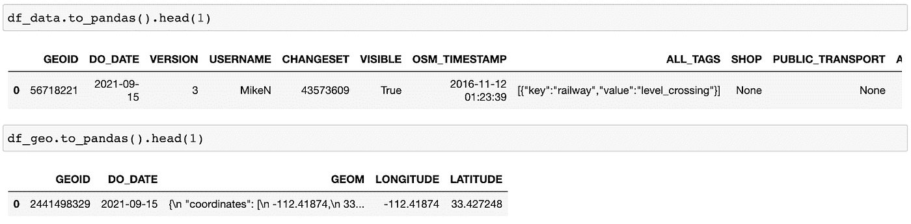
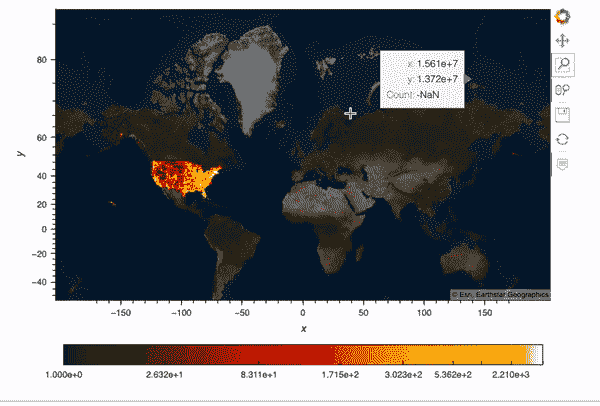
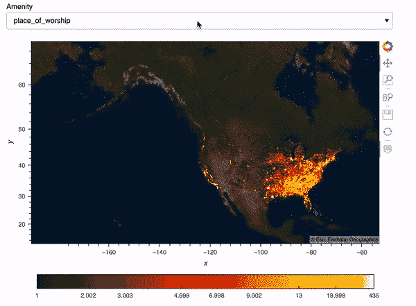
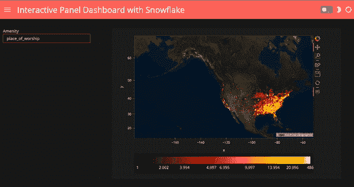

# 用 Snowpark 为 Python 构建面板仪表盘

> 原文：<https://towardsdatascience.com/building-a-panel-dashboard-with-snowpark-for-python-fe1b16e7bd75>

## 数据科学家的雪花

数据科学家通常使用 SQL 与数据仓库进行交互，但通常依赖 Python 进行数据发现、可视化和建模。如果我们可以用我们喜欢的 Python 工具直接与数据仓库交互，那该有多好？Snowflake 现在原生支持 Python 和 Snowpark for Python。它使我们的数据科学家能够用 Python 编码，同时享受 Snowflake 提供的相同的安全性、性能、治理和可管理性优势。有了这个工具，我可以与我的数据仓库交互，可视化数据，甚至直接用 Python 构建和部署模型到我的数据仓库。要了解数据库中有什么，首先要做的一件事就是可视化您的数据。在本文中，我将向您展示如何创建这个面板仪表板，以便有意义地可视化雪花数据集中的 500 万个数据点。

作者图片

# **什么是 Python 的 Snowpark？**

Snowpark for Python 允许数据科学家编写我们熟悉的 Python 代码，并在 Snowflake 中将 Python 翻译回 SQL。通过与 Anaconda 的合作，我们可以为 Snowpark 使用所有安全且精心管理的 Python 包。雪花甚至在 Anaconda 中有自己的 Python 包存储库:【https://repo.anaconda.com/pkgs/snowflake。

# **什么是面板？**

[Panel](https://panel.holoviz.org/) 构建交互式仪表盘和应用。就像 R 闪亮，但更强大。它是由我的 Anaconda 同事 Philipp Rudiger、Jean-Luc Stevens 和 Jim Bednar 开发的。Panel 是 HoloViz 生态系统中的七个库之一。如果你想了解更多关于 HoloViz 和 Panel 的知识，可以看看我之前的博文《为什么我喜欢 HoloViz、panel.holoviz.org 和 awesome-panel.org》。

# **材料**

为了这篇文章，请查看我在 Github 上的 [Jupyter 笔记本](https://github.com/sophiamyang/snowflake-example/blob/main/snowflake_plot.ipynb)。

# **设置**

本文使用了来自雪花市场的“OpenStreetMap — Nodes (USA)”数据。这些数据可以免费使用。在市场中找到这些数据，点击“获取数据”，然后你应该会看到它出现在你的“数据”中。

要访问 Snowpark for Python，您可以在命令行中运行以下命令来创建一个新的 Conda 环境，激活该环境，安装 Snowpark for Python，安装所需的 viz 包，并启动一个 Jupyter 笔记本。

现在我们可以开始在 Jupyter 笔记本上编码了。

# **进口所需模块**

首先，我们需要从 Snowpark 导入所需的模块。我将我的所有凭证保存在一个单独的文件中，并将其导入到这里，但是您应该使用自己的凭证。

# **与雪花建立连接**

我们创建一个连接到我们雪花帐户的会话。

或者，您可以使用外部浏览器进行身份验证:

# **获取数据**

接下来，我们从 OpenStreetMap 数据库中获取数据。这个数据库中有两个独立的表:数据表和地理表。Geography 表包含与数据表相关联的几何信息，如经度和纬度。下面的代码显示了从雪花中查询数据的两种方法:

*   `session.table`返回整个表格的内容。
*   `session.sql`允许我们编写 SQL 查询并返回 SQL 结果。几何数据被定义为一个[地理对象](https://docs.snowflake.com/en/sql-reference/data-types-geospatial.html)，这是一个包含经度和纬度的字典。我使用 [st_x](https://docs.snowflake.com/en/sql-reference/functions/st_x.html) 和 st_y 将经度和纬度作为两个独立的列提取出来。

# **数据处理**

这里实际上没有多少数据处理步骤。我使用来自 Snowpark for Python 的`[.join](https://docs.snowflake.com/en/LIMITEDACCESS/snowpark-python.html#joining-dataframes)`函数连接了两个表。然后我们可以将这个 Snowpark 数据框转换成我们熟悉的熊猫数据框。

# 用 Datashader 绘制 500 万个数据点

这个 OpenStreetMap 数据包含 5 百万个数据点，我想在地图上绘制它的经度和纬度信息。

Datashader 是 HoloViz 家族中的大数据可视化工具。使用 Numba(实时编译器)和 Dask(并行计算)，Datashader 可以在一台机器上非常快速地绘制出数百万甚至数十亿个数据点。如果你想了解更多关于 Datashader 如何工作的信息，请查看我之前关于 Datashader 的文章。

好的，回到我们的例子。首先，我们导入用于绘图的模块。我们需要将我们的经度和纬度转换为 Web 墨卡托坐标，以便它们能够正确地显示在地图上。然后我写了这个函数`datashader_plot`来绘制这 500 万个数据点，并用地图覆盖它们。在这个函数中，我们首先创建一个地图`map_tiles`，然后使用`hvplot`配合`rasterize=True`使用 Datashader 进行栅格化，这样就可以快速而有意义的可视化大数据。

结果显示了一个包含所有 500 万个数据点的交互图！

作者图片

# 创建交互式仪表板

如果我们想要选择设施，并根据我们选择的设施展示我们的地块，会怎么样？在这里，我创建了一个面板小部件来选择数据中的前 10 个便利设施，然后我创建了一个面板仪表板，其中的绘图对应于我们选择的便利设施。我用了 hvPlot。iteractive 创建此仪表板，了解有关 hvPlot 的更多信息。互动，查看[我之前的博文](/the-easiest-way-to-create-an-interactive-dashboard-in-python-77440f2511d1?sk=e1ea8c40c090cdbe7689333267f73b25)。

作者图片

最后，我们可以使用一个模板来使我们的仪表板看起来更好。运行`template.show()`将自动打开一个标签，显示我们的最终仪表板。

作者图片

# 部署仪表板

我希望雪花可以提供一种方法，直接在雪花上部署我们的面板应用程序，这样我所有的数据和仪表板都可以在一个地方访问——雪花。

要将这个仪表板作为 web 服务器启动，我们可以取消对`template.servable()`上面最后一行的注释，只需运行`panel serve snowflake_plot.ipynb`。有关如何将仪表板部署到服务器的详细信息，请查看[面板文档](https://panel.holoviz.org/user_guide/Server_Deployment.html)，或者我之前关于将仪表板部署到 [Google Cloud App Engine](/deploy-a-python-visualization-panel-app-to-google-cloud-cafe558fe787?sk=98a75bd79e98cba241cc6711e6fc5be5) 和 [Google Cloud Run](/deploy-a-python-visualization-panel-app-to-google-cloud-ii-416e487b44eb?sk=aac35055957ba95641a6947bbb436410) 的文章。

我真的很喜欢使用 Snowpark for Python，我对它的许多特性感到兴奋，包括 Python UDFs、模型构建和部署。我想写的东西太多了。敬请关注我的下一篇文章！

# 承认

感谢您的反馈和支持！

# **参考文献**:

*   https://panel.holoviz.org/
*   【https://datashader.org/ 
*   [https://www . snow flake . com/blog/snow flake-partners-with-and-investments-anaconda-to-bring-enterprise-grade-open-source-python-innovation-to-the-data-cloud/](https://www.snowflake.com/blog/snowflake-partners-with-and-invests-in-anaconda-to-bring-enterprise-grade-open-source-python-innovation-to-the-data-cloud/)
*   [https://www.snowflake.com/snowpark-for-python/](https://www.snowflake.com/snowpark-for-python/)

我是 Anaconda 的高级数据科学家 Sophia Yang。请随时在 [Twitter](https://twitter.com/sophiamyang) 、 [Linkedin](https://www.linkedin.com/in/sophiamyang/) 和 [YouTube](https://www.youtube.com/SophiaYangDS) :)上与我联系