# 构建随机森林分类器来预测神经尖峰

> 原文：<https://towardsdatascience.com/building-a-random-forest-classifier-for-neural-spike-data-8e523f3639e1>

## *在 Python 中构建随机森林分类器以预测真实神经细胞外尖峰的子类型的分步指南。*


[未喷涂](https://unsplash.com/photos/58Z17lnVS4U)上的 Fakurian 设计的“Braintree”

G *考虑到人脑本身神经元的异质性，分类工具通常被用来将电活动与不同的细胞类型和/或形态相关联。*这是神经科学界的一个长期问题，在不同物种、病理、大脑区域和层次之间可能有很大差异。幸运的是，随着快速增长的计算能力允许机器学习和深度学习算法的改进，神经科学家获得了进一步探究这些重要问题的工具。然而，正如 Juavinett 等人所述，在大多数情况下，编程技能在社区中的代表性不足，教授这些技能的新资源对于解决人类大脑的复杂性至关重要。

因此，为了提供一个相关的用例，在本文中，我们将为神经细胞外锋电位波形数据集构建一个随机森林分类器算法。随机森林分类器是广泛应用的监督学习模型，是解决分类问题的有效而强大的算法。可以说，它们位于分类器层次结构的顶端，旁边还有其他算法，如:逻辑回归、支持向量机、朴素贝叶斯分类器和决策树。

在此过程中，我们还将完成多维降维和聚类步骤(带有示例代码)，以建立一个有监督的学习问题。一旦完成，任何级别的程序员将能够(1)识别和绘制独特的细胞外波形,( 2)实施随机森林算法对它们进行分类。

# 什么是决策树？

返璞归真！首先，为了理解随机森林图，掌握决策树是很重要的(这将很快有意义)。*简而言之，决策树是一种由“节点”和“分支”组成的树状模型，是一种可视化展示决策及其结果的工具。*

如 [Angel Das](https://medium.com/u/8418ab50405a?source=post_page-----8e523f3639e1--------------------------------) 、 [z_ai](https://medium.com/u/1fd70d25ff14?source=post_page-----8e523f3639e1--------------------------------) 所总结的，并且如下图所示，节点可以分类如下:

*   **根节点:**起始节点。在决策树中，它通常评估最能分割数据的变量。
*   **决策节点:**根据条件分支的子节点。
*   **叶节点:**树的最终节点，不能再分支。

从根节点开始，按照 if-else 结构在决策节点对一个独立变量(连续变量或分类变量)进行拆分。沿着树向下移动，数据不断被“分割”,直到到达可以进行分类的叶节点。如果不是这种情况，则重复该过程，直到达到结果。

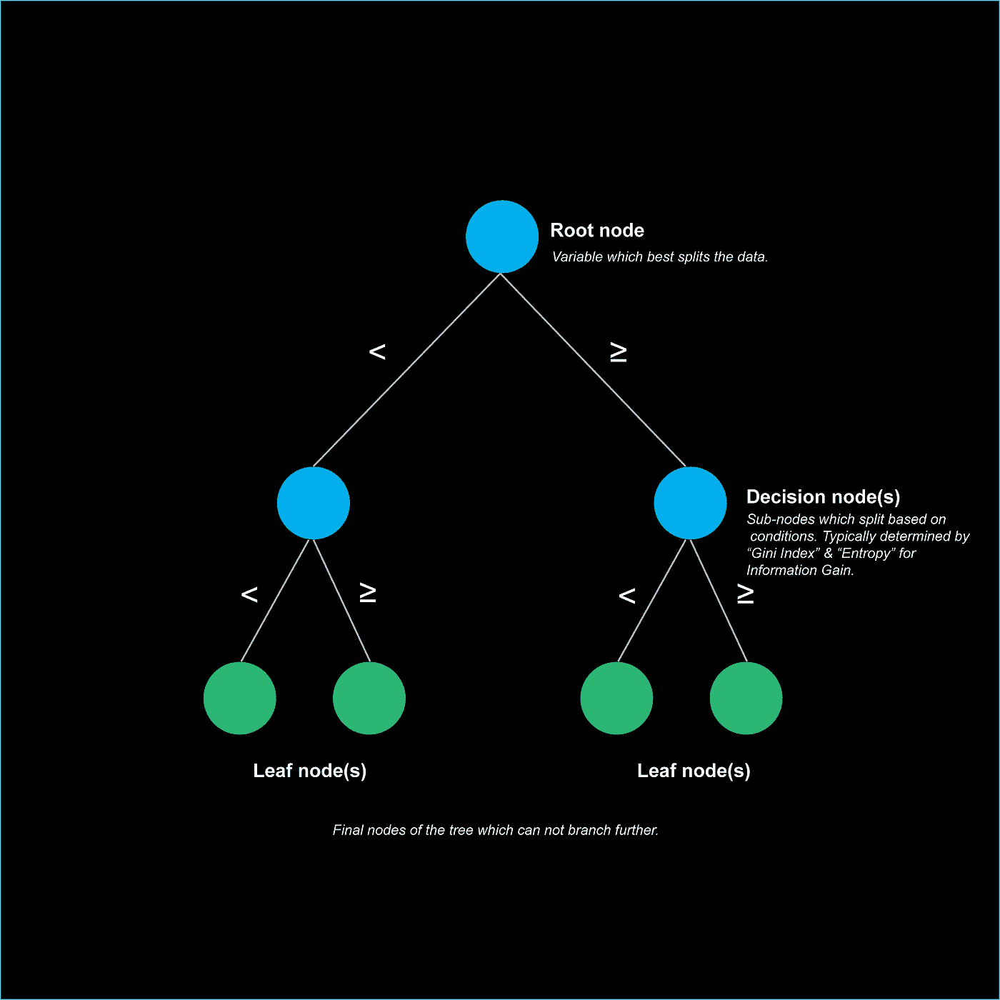

带有定义的决策树插图。图片作者。

## 决定分裂

决策树使用多种算法来决定问题的最佳分割，但**“基尼指数”和信息增益的“熵”**是最常见的标准。两者都确定了节点处标签的**杂质**，这是在判定节点处异质或混合值程度的度量。这是至关重要的，因为决策树算法找到了最佳标准，使集合成为更同质的子集(即↓杂质)而不是异质的子集(即↑杂质)。

**熵**是对一组数据的杂质的一种度量，可以通过以下公式表示:

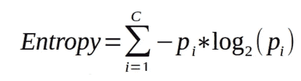

熵公式。其中“ **Pi** 表示数据集中类别“I”的概率。

通过使用熵计算，可以计算节点处的随机性或无序度。**信息增益**使用熵来量化哪个特征通过减少熵来提供关于分类的最大信息，并因此做出相应的分割:

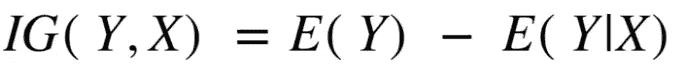

信息增益公式。从类“ **X** ”上的“ **Y** ”的熵中减去类“ **Y** 的熵。

与熵相似，**基尼系数**(也称为**基尼系数或基尼系数**)在 0 和 1 之间变化。它通过测量目标属性值的概率分布之间的差异来计算分类的杂质。0 的输出是同质的，而 1 是不纯的，这表明新的随机数据被错误分类的可能性很大。一旦实现，就进行节点分裂，这减少了这种计算的杂质。对于“C”类不同阶层，基尼公式将为:

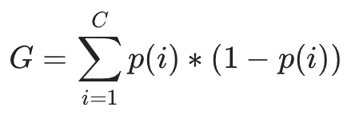

基尼系数公式，其中" **C"** 表示数据子集中的总类别数，而" **i"** 是从 C 中选择的类别。

## 决策树的衰落

虽然决策树可以为分类问题提供一个可视化的解决方案，但是使用该算法的缺点**应该被考虑在内:**

*   它们将继续形成分支，直到每个节点都是同质的。如果测试一个小样本，这就产生了一个过度拟合的问题(鲁棒性)。
*   一次仅使用一个独立变量来确定分类，这可能会导致性能和准确性问题。
*   不处理缺少的值和数值属性。

# 随机森林分类算法是如何工作的？

理解分类和回归树(CART)的基本概念的重要性在这里发挥了作用，因为**随机森林**使用许多决策树的**集合**而不是一个来做出最终决策(集合技术)。这是特别强大的，因为模型的集合将胜过单个模型。最终，这解决了与决策树相关的一些缺点，因为它提高了性能和健壮性。值得注意的是，集合中的每棵树都是相对不相关的，这很重要，因为正如[饶彤彤](https://medium.com/u/840a3210fbe7?source=post_page-----8e523f3639e1--------------------------------)所概述的:

> 这些树保护彼此免受各自错误的影响(只要它们不总是在同一个方向出错)。虽然有些树可能是错误的，但许多其他的树将是正确的，因此作为一个群体，这些树能够朝着正确的方向移动。

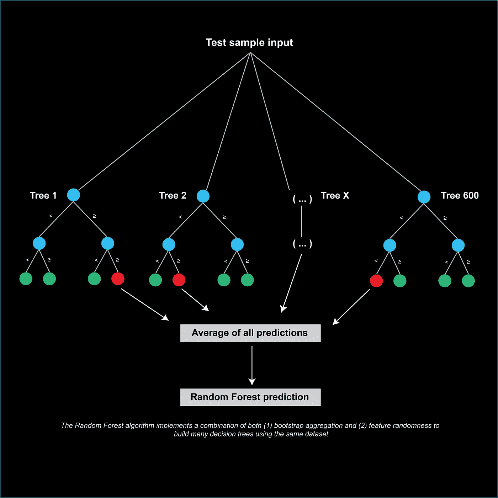

一种简化的随机森林分类算法的图示。图片作者。

## 随机森林算法如何构建多棵树？

随机森林算法实现了 **(1)引导聚合和(2)特征随机性**的组合，以使用相同的数据集构建许多决策树。总体而言，它们在这样做的同时保持相对不相关，这是一个重要的特性:

1.  **bootstrap 聚合(又名 Bootstrap 或 bagging)** 是一种技术，涉及在给定迭代次数和变量(Bootstrap 样本)的基础上随机抽样数据子集，并进行替换。来自所有迭代和样本的预测通常被平均以获得最可能的结果。重要的是要理解，它不是将数据“分块”成小的大小，并在其上训练单个树，而是仍然保持初始数据大小。这是一个应用集合模型的例子。
2.  **特征随机性**主要作用是降低决策树模型之间的相关性。与可以利用所有特征来辨别最佳节点分裂的决策树相比，随机森林算法将随机选择这些来进行决策。最终，这允许训练也在不同的特征上发生。

> **总的来说，通过这些方法，随机森林算法可以在相同数据的不同集合上进行训练(bootstrapping ),同时还可以利用不同的特征来生成预测结果。这是一个比决策树更强大的分类工具。**

## 特征重要性

最后，随机森林算法还将使用**基尼系数**(或平均减少杂质)来评估数据集中每个特征在人工分类问题上的重要性。现在知道了随机森林算法是使用决策树的集合来构建的，直观地，每个内部节点是使用基尼不纯或信息增益来选择的(如上所述)。对于每个特征，计算杂质的减少，并在集合中的所有决策树上平均，以确定特征重要性。该方法在随机森林的`[scikit-learn](https://scikit-learn.org/stable/modules/generated/sklearn.ensemble.RandomForestClassifier.html#sklearn.ensemble.RandomForestClassifier.feature_importances_)` [实现](https://scikit-learn.org/stable/modules/generated/sklearn.ensemble.RandomForestClassifier.html#sklearn.ensemble.RandomForestClassifier.feature_importances_)中可用(分类器和回归器都适用)。

# 将随机森林分类器应用于细胞外神经记录:

现在，申请！我们将使用一个公开可用的数据集，这个数据集是在授权**Attribution 4.0 International(CC by 4.0)**下[提供的。这是一组取自哺乳动物大脑的细胞外记录。](https://www.kaggle.com/joseguzman/spike-classification-based-on-waveforms/data)

> 就上下文而言，**细胞外记录**是由细胞产生的电位的记录，或者在感兴趣的细胞附近的细胞外液中，或者无创地。

## 加载库和数据集

首先，我们将导入以下库和 load required 数据集。

```
# Install the following libraries
import pandas as pd
import numpy as np
from umap import UMAP
import seaborn as sns
import matplotlib.pyplot as plt
from mpl_toolkits.axes_grid1.anchored_artists import AnchoredSizeBarfrom sklearn.model_selection import train_test_split
from sklearn.ensemble import RandomForestClassifier
from sklearn.metrics import accuracy_score
from sklearn.cluster import AgglomerativeClustering
from sklearn.neighbors import kneighbors_graph
from sklearn.cluster import KMeans
from sklearn.metrics import silhouette_samples, silhouette_score
from sklearn.metrics import classification_report
from sklearn.metrics import confusion_matrix
```

为了熟悉数据集，首先可视化数据类是很重要的。这使我们能够更好地理解数据集和组织数据的可能方式。

```
# Load waveforms
mypath = '*insert file path/waveforms.csv'
data = pd.read_csv(mypath, index_col = 'uid')# Get an overview of the data
print(f'{data.shape[0]} unique experiment identifiers (uid), recorded with a sampling frequency (KHz) of {((data.shape[1]-1)/5)}')# Class breakdown
data.organoid.value_counts()
```

看到我们有多个类，如`value_counts()`所示，我们将用唯一的颜色代码标记每个类。当在进一步的数据分析中可视化这些类时，这将被证明是有用的。

```
# Define custom colors for visualization
mycolors = {'Data_D':     '#FFA500', # orange
           'Data_G':       '#4169E1', # royalblue
           'Data_F':       '#FF4500', # orange red
           'Data_C':       '#9400D3', # darkviolet
           'Data_A':       '#32CD32', # limegreen 
           'Data_E':       '#228B22', # forestgreen
           'Data_G_V2' :   '#006400', # darkgreen 
           'Data_H':       '#00BFFF', # deepskyblue 
           'Data_E_V2':    '#DC143C', # crimson
           'Data_F_V2':    '#0000FF', # blue
           'Data_B':       '#000000', # black
           }# Add color to the DataFrame
data['color'] = data['organoid'].apply(lambda orgID: mycolors[orgID])
```

现在，我们可以想象！我在下面展示了一个简单的柱状图，总结了每节课的录音数量。然而，更多的 Python 数据可视化工具可以在[这里](/top-python-libraries-for-visualization-a-starting-guide-73402178811b)的上一篇文章中找到。

```
# Visualizing the unique experiment identifiers
fig, ax = plt.subplots(figsize=(15, 8))
sns.barplot(x=data.organoid.value_counts().index, y=data.organoid.value_counts(), palette=mycolors)# Customizing the graph
plt.xticks(rotation=30,fontsize=14)
plt.yticks(fontsize=14)
ax.set_xlabel('Class type', fontsize=16)
ax.set_ylabel('Number of waveforms', fontsize=16)
plt.rcParams["font.family"] = "Arial"# Despine
right_side = ax.spines["right"]
right_side.set_visible(False)
top_side = ax.spines["top"]
top_side.set_visible(False)plt.savefig('Figures/barplot.png', dpi = 300, bbox_inches="tight")
plt.show()
```

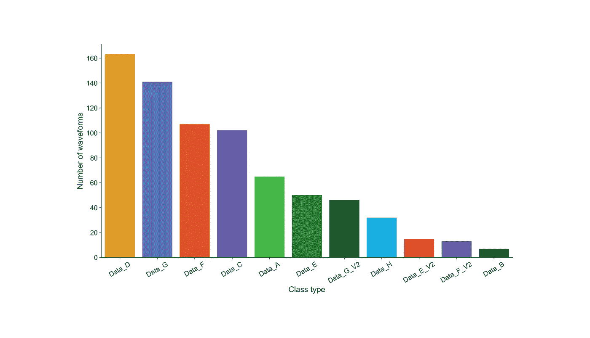

图片作者。一个条形图，突出显示了每种类型记录的波形数量的变化。

## 可视化细胞外波形

假设我们正在分析细胞外记录，我们将可视化每个数据集类产生的平均波形。这将为手头的分类问题提供进一步的见解。下面，我通过计算每个数据集类的平均轨迹，并叠加到它们的输入轨迹上来实现这一点。

```
# Isolating the waveforms for each class 
class_names = data['organoid'].unique()# Plotting mean traces for each organoid class
fig, ax = plt.subplots(1,9, figsize=(24,4.5))
for unique_class in class_names:    
        df_new = data[data['organoid'] == unique_class] #isolating # np.array conversion
        df_new = df_new.iloc[:,:-2].to_numpy() #dropped last column# Averaging across samples per organoid class 
        data_mean_perclass = np.mean(df_new, axis=0)# Sampling frequency for plot generation
        sampling_freq = np.linspace(0, 5, 150) #recording length is 5ms per 150 samplesfor i in range(class_names.shape[0]): 
            if unique_class == class_names[i]:

                # Plotting all traces behind in light color
                for row_num in range(df_new.shape[0]): 
                    ax[i].plot(sampling_freq, df_new[row_num,:], color = 'lightgray')

                # Plotting each mean waveform into a separate subplot 
                ax[i].plot(sampling_freq,data_mean_perclass, color=mycolors[unique_class], linewidth=3)
                ax[i].set_ylim([-1.8, 1.8])
                ax[i].grid()
                ax[i].axis('off')
                ax[i].title.set_text(unique_class)  
                plt.rcParams["font.family"] = "Arial"

            else: 
                continue

        # Scale bar
        scalebar = AnchoredSizeBar(ax[8].transData, 1, "1 ms", 'lower right', frameon=False, size_vertical=0.02, pad=0.1)
        ax[8].add_artist(scalebar)

plt.savefig('Figures/spikes.png', dpi = 300)
```

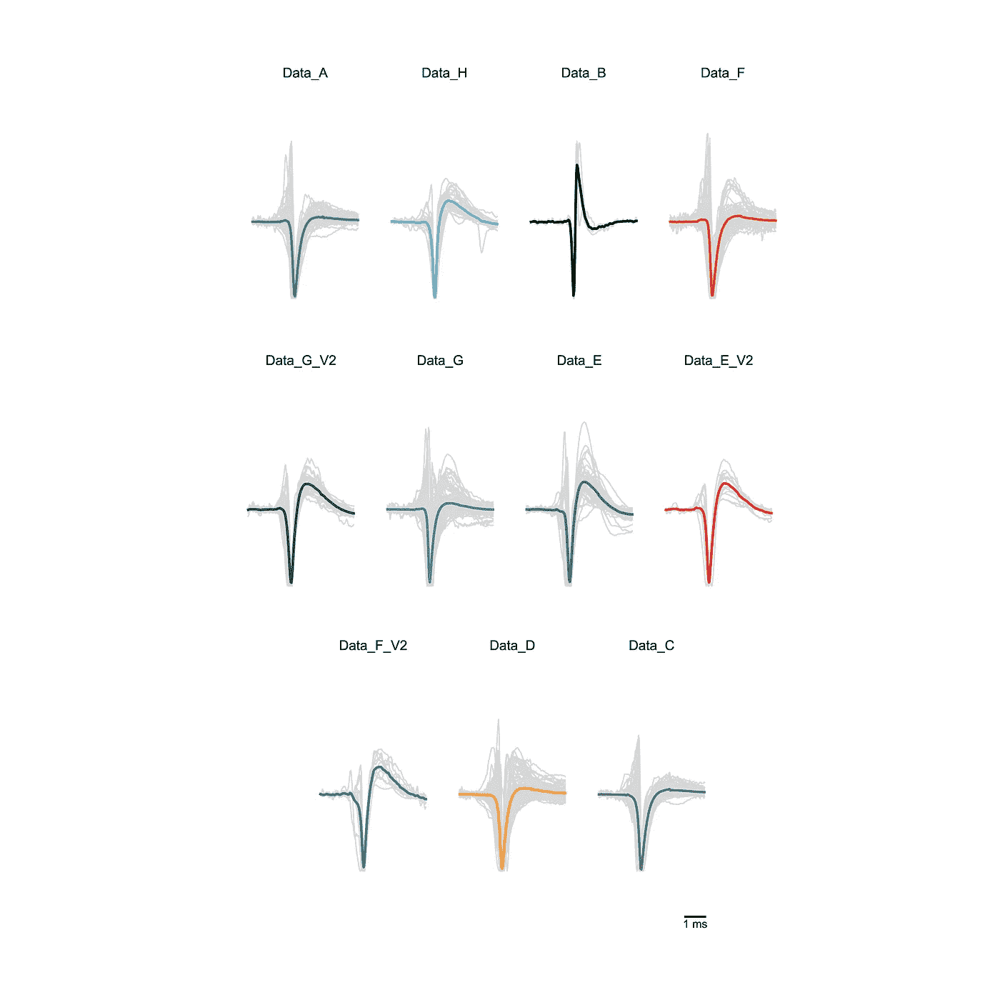

每一类的平均细胞外波形以彩色显示，并与其子图标题相对应。浅灰色表示用于产生平均输出阵列的输入信号。作者提供的图片，显示尺寸已重新格式化。

## 多维缩减

从视觉上看，波形轨迹突出显示了每个数据集类都有许多来自不同神经元细胞类型的单个尖峰波形。平均起来，可以说这些类中有些看起来很像，有些则不像。

为了更好地验证这一点，我们将使用统一流形近似和降维投影(UMAP)对细胞外波形数据进行多维降维。最后，还可以进行主成分分析或 t 分布随机邻居嵌入(t-SNE)。西瓦卡尔·西瓦拉贾 [在这里](/dimensionality-reduction-for-data-visualization-pca-vs-tsne-vs-umap-be4aa7b1cb29)概述了这些方法之间的区别。出于本文的考虑，我们将只关注前两个部分，以获取大部分方差。

```
# UMAP calculation
umap_2d = UMAP(n_components=2, random_state = 43)
projections = umap_2d.fit_transform(data.iloc[:,:-2])# Concat dataframes for seaborn scatter plot
UMAP_df = pd.DataFrame(projections, columns = ['UMAP 1','UMAP 2'])
UMAP_df_concat = pd.concat([UMAP_df,data['organoid'].reset_index(),data['color'].reset_index()], axis=1)# Figure plotting
sns.set(font_scale=1.2)
sns.set_style("whitegrid", {'axes.grid' : False})
fig1 = sns.relplot(data = UMAP_df_concat, x = "UMAP 1", y = "UMAP 2", hue="organoid", kind="scatter", palette=mycolors, height=5, aspect=1.5)
fig2 = sns.relplot(data = UMAP_df_concat, x = "UMAP 1", y = "UMAP 2", hue="organoid", kind="scatter", palette=mycolors, height=3, aspect=1.5, col='organoid', col_wrap=3)# Figure export
fig1.savefig('Figures/UMAP.png', dpi = 300)
fig2.savefig('Figures/UMAP_2.png', dpi = 300)
```

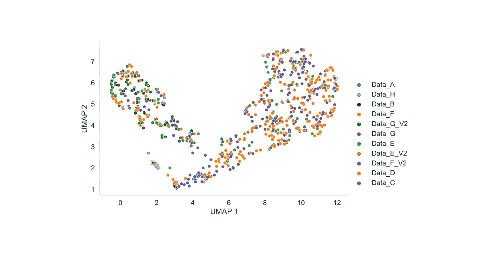

细胞外波形时间序列数据的 UMAP 图，n_components = 2。颜色对应于每个数据集类。图片作者。

从空中俯瞰，UMAP 上正在形成不同的星团。每个聚类没有同质的类别类型(由颜色变化显示)，而是来自不同类别的不同细胞外记录的组合。因此，很可能每个有机类类型都具有与其他类相似的波形比例。

为了更好地查看每个数据集对 UMAP 的贡献以及它们是如何聚类的，我们将隔离它们的数据:

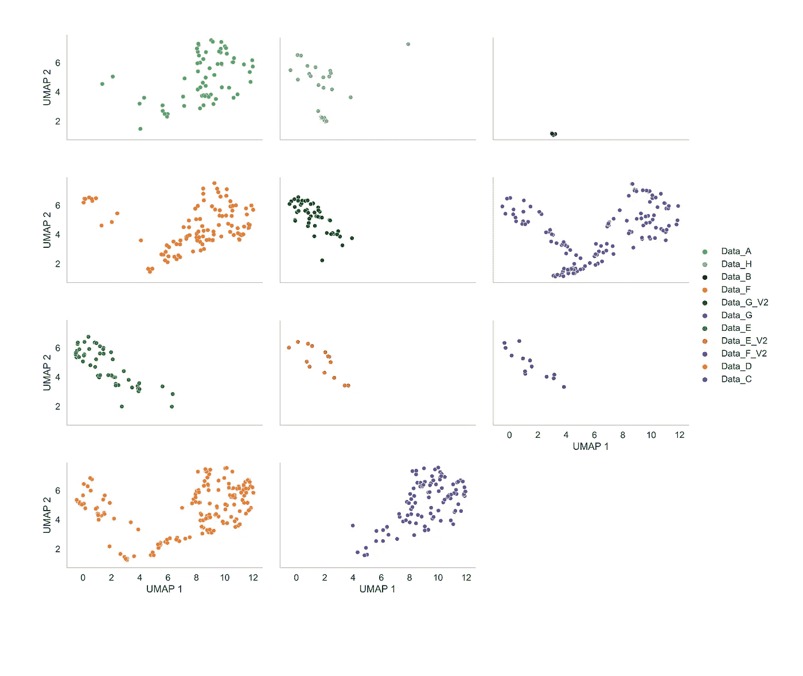

代表来自每个数据集类的独特细胞外波形时间序列数据的一系列 UMAP 子图。图片作者。

的确，来自特定数据集类的一些记录看起来更相似地聚类，而其他记录则不相似。这与我们的波形轨迹一致。接下来，我们将对数据进行聚类，为我们的随机森林算法建立一个分类问题。

## k 均值聚类

为了使用前两个分量对我们的数据进行无偏聚类，我们将利用 K-means。这种聚类方法属于聚类的划分类，用于最小化总的类内变化。为了选择最佳聚类数，*我们将利用(1)肘和(2)剪影方法:*

1.  **Elbow 方法:**计算总的类内平方和(wss)，它衡量聚类的紧密性。目的是尽可能减少这种情况。
2.  **剪影法:**我们将使用剪影法回测肘法。这种方法通过确定对象在其中的位置来测量群集的质量。高轮廓值表示“好”的聚类，而低轮廓值表示“差”的聚类。

这是这两种方法之间的微妙平衡，可以为您的数据确定最佳的聚类数。所以，让我们一步一步来:

```
# Set range of possible clusters
range_n_clusters = range(2, 11) #set as 2 to 10# Elbow method & Silhouette scores for optimal number of cluster
wcss = [] #within cluster sum of square 
silhouette_values = []
for i in range_n_clusters:

    kmeans = KMeans(n_clusters = i, random_state = 42)
    kmeans.fit(data.iloc[:,:-2])
    wcss.append(kmeans.inertia_)

    cluster_labels = kmeans.fit_predict(data.iloc[:,:-2])
    silhouette_avg = silhouette_score(data.iloc[:,:-2], cluster_labels)
    silhouette_values.append(silhouette_avg)# Isolating highest Silhouette value calculation
max_silhouette = max(silhouette_values)
max_index = silhouette_values.index(max_silhouette)
print(f'Optimum number of clusters is {range_n_clusters[max_index]}')

# Figure plotting
fig, ax = plt.subplots(1,2, figsize=(18,4.5))
ax[0].plot(range_n_clusters, wcss)
ax[1].plot(range_n_clusters, silhouette_values)
ax[0].title.set_text('The Elbow Method')
ax[1].title.set_text('Optimal Cluster Number')
ax[0].set(xlabel='Number of Clusters', ylabel='WCSS')
ax[1].set(xlabel='Number of Clusters', ylabel='Silhouette score')# Line to indicate optimum cluster number
ax[0].axvline(x=range_n_clusters[max_index], color='black', label='axvline - full height', ls='--')
ax[1].axvline(x=range_n_clusters[max_index], color='black', label='axvline - full height', ls='--')# Export figures
fig.savefig('Figures/Silhouette_elbow_method.png', dpi = 300, bbox_inches="tight")
```

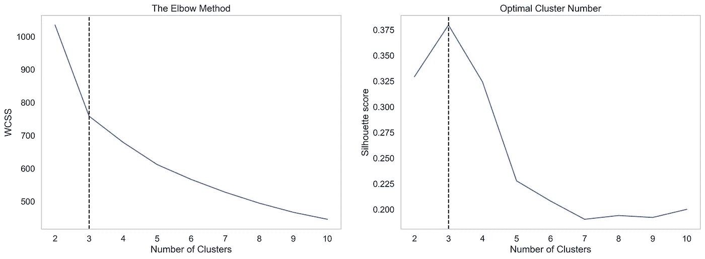

肘(左)和侧影方法(右)对神经尖峰数据集的结果。虚线突出显示了使用 K 均值聚类的最佳聚类数。图片作者。

正如图中虚线所示，*我们数据集的最佳聚类数是 3* 。原因是对于这个数字，轮廓得分最高，而组内平方和(WCSS)减少。我们将通过使用以下代码在我们的组合 UMAP 图上可视化聚类来确认这一点:

```
# Agglomerative clustering with optimal cluster number on UMAP
def clustering_agglo(df, n_clusters):
    X = df.to_numpy()
    connectivity = kneighbors_graph(X, int(len(df.index)/10), include_self=False)
    agc = AgglomerativeClustering(linkage='ward', connectivity=connectivity, n_clusters=n_clusters)
    agc.fit(X)
    print(f'Labelling {len(np.unique(agc.labels_))} clusters on original UMAP projection')
    return agc.labels_labelsAgglo = clustering_agglo(data.iloc[:,:-2],range_n_clusters[max_index])# UMAP plotting
sns.set(font_scale=1.2)
sns.set_style("whitegrid", {'axes.grid' : False})
fig = sns.relplot(data = UMAP_df_concat, x = "UMAP 1", y = "UMAP 2", hue=labelsAgglo, kind="scatter", palette=['red','blue','green'], height=5, aspect=1.5)# Add labels to original dataframe: 
data['cluster_group'] = labelsAgglo# Figure export
fig.savefig('Figures/UMAP_clusters.png', dpi = 300)
```

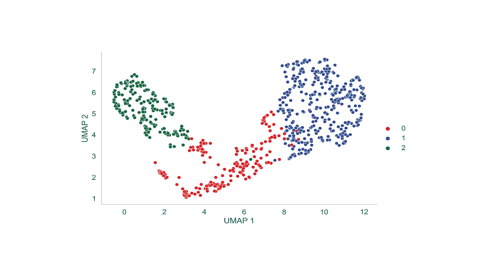

跨数据集类别记录的时序细胞外数据的 UMAP 图。颜色对应于使用 K-means 聚类确定的聚类，并使用剪影和肘方法进行验证。图片作者。

从这个图中，我们可以看到(在很大程度上)K-means 聚类有一个合理的工作！值得注意的是，UMAP 图上的聚类之间有一些重叠，但看到这是一个使用神经尖峰数据的真实数据集，这是可以预期的。现在，让我们进一步调查这些？

## 每个集群的类别和波形细分

*如前所述，从特定数据集类记录的波形聚类更相似，而其他的则不相似。*为了更好地理解这些差异，让我们来看看每个聚类的平均波形以及组成它们的数据集类别:

```
#Cluster group colour
cluster_colors=['red','blue','green']#Breakdown of each waveform cluster type by organoid class
for cluster_group in range(0,3):
    df_group = data[data['cluster_group'] == cluster_group] #isolating each cluster group
    breakdown_perclust = ((df_group.organoid.value_counts())/(df_group.shape[0]))*100

    # Getting idx for each cluster for color matching
    breakdown_perclust_df = breakdown_perclust.to_frame()
    breakdown_perclust_df['index'] = breakdown_perclust_df.index
    breakdown_perclust_df['color'] = breakdown_perclust_df['index'].apply(lambda orgID: mycolors[orgID])
    breakdown_perclust_df = breakdown_perclust_df.rename(columns = {'organoid' : 'class_breakdown_percentage'})

    # Computing mean waveforms for each cluster
    df_group_new = df_group.iloc[:,:-3].to_numpy() #dropped last columns
    data_mean_group_percluster = np.mean(df_group_new, axis=0)# Sampling frequency for plot generation
    sampling_freq = np.linspace(0, 5, 150) #recording length is 5ms per 150 samples

    # Piechart plotting
    fig, ax = plt.subplots(1,2, figsize=(16,4), gridspec_kw={'width_ratios': [2.5, 1]})
    ax[0].pie(breakdown_perclust_df['class_breakdown_percentage'], colors = breakdown_perclust_df['color'], labels = breakdown_perclust_df['index'],\
              autopct='%1.0f%%', pctdistance=0.5, labeldistance=1.1)
    title_pie = ("Cluster number: " + str(cluster_group))
    ax[0].title.set_text(title_pie)

    # Draw inner circle
    centre_circle = plt.Circle((0,0),0.70,fc='white')

    # Equal aspect ratio ensures that pie is drawn as a circle
    ax[0].add_patch(centre_circle)  
    ax[0].axis('equal')  

    # Mean waveform plotting
    ax[1].plot(sampling_freq,data_mean_group_percluster, linewidth=3, color = cluster_colors[cluster_group])
    title_waveform = ("Mean waveform for cluster number: " + str(cluster_group))
    ax[1].title.set_text(title_waveform)
    ax[1].set_ylim([-1.3, 1.3])
    ax[1].grid()
    ax[1].axis('off')
    plt.rcParams["font.family"] = "Arial"

    # Scale bar
    scalebar = AnchoredSizeBar(ax[1].transData, 1, "1 ms", 'lower right', frameon=False, size_vertical=0.02, pad=0.1)
    ax[1].add_artist(scalebar)

    # N-values
    n_value = ("N-value: " + str(df_group.shape[0]))
    plt.figtext(0.36, -0.05, n_value, ha="center", fontsize=12, bbox={"facecolor":"orange", "alpha":0.2, "pad":5})

    # Export figures
    fig_name = ("Figures/Piechart_waveform_clust" + str(cluster_group) + ".png")
    plt.savefig(fig_name, dpi = 300, bbox_inches="tight")
    plt.tight_layout()
    plt.show()
```

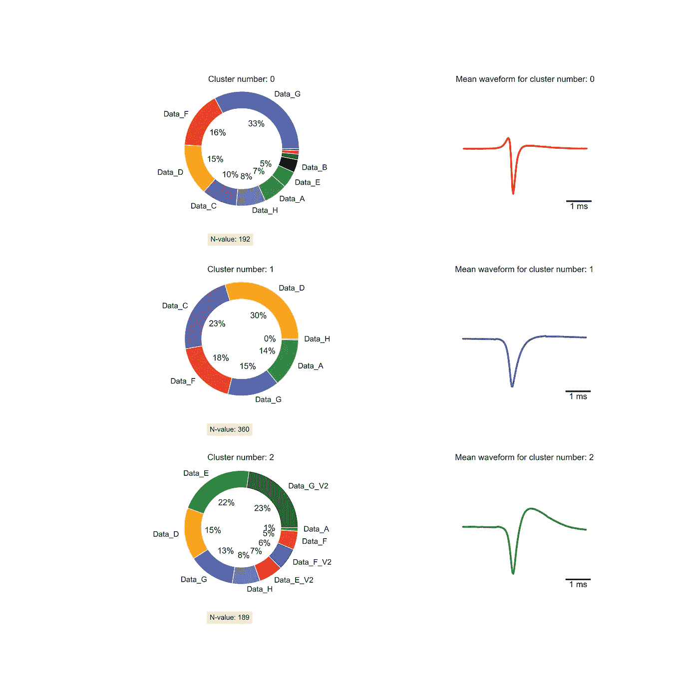

饼图(左)突出显示了每个数据集类的波形百分比及其对应的平均波形(右)。图片作者。

乍一看，可以看出不同数据集聚类之间的平均波形存在相当大的差异。此外，来自不同数据集类别的波形对聚类的贡献百分比似乎也不同。

> 现在，我们的随机森林分类器有了一个明确的分类问题！我们可以验证集群之间的这些差异。

## 将数据分成单独的训练集和测试集

为了有效地训练随机森林算法，我们将把数据分成训练集和测试集。我们预测的期望结果`y`是聚类类型，而我们的细胞外尖峰时间序列数据是`X`。

测试和训练的原因将其设置为**不允许训练数据集中有足够的数据供模型学习输入到输出的有效映射**。测试集中也没有足够的数据来有效地评估模型性能。这可以使用以下代码来完成:

```
# Split data into training and testing sets
X = data.iloc[:,:-3] #drop last 3 columns
y = data['cluster_group']
X_train, X_test, y_train, y_test = train_test_split(X, y, test_size = 0.33, random_state = 42)# check the shape of X_train and X_test
print(f'Number of entries for X_train is {X_train.shape[0]}, and the number of entries for X_test is {X_test.shape[0]}')
```

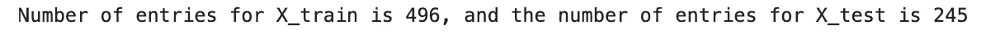

打印输出。图片作者。

## 随机森林分类

现在，让我们训练我们的随机森林分类器！我们将在许多决策树(迭代)上这样做，并测试它们的预测准确性。这里， **y_test** 是真实类标签， **y_pred** 是测试集中的预测类标签:

```
# Instantiate the Random Forest classifier 
number_int = [1,2,3,4,5,10,20,50,70,100,200,400,500]
accuracy = []
for i in number_int: 
    rfc = RandomForestClassifier(n_estimators=i, random_state=41)# Fit the model
    rfc.fit(X_train, y_train)# Predict the test set results
    y_pred = rfc.predict(X_test)

    # Append to list
    accuracy.append('{0:0.4f}'.format(accuracy_score(y_test, y_pred)))# Check accuracy score 
    print(f'Model accuracy score with {i} decision-trees is {format(accuracy_score(y_test, y_pred))}')# Figure plotting
fig, ax = plt.subplots(figsize=(7,4))
ax.plot(number_int, accuracy)
ax.title.set_text('Number of interations vs accuracy')
ax.set(xlabel='Number of iterations', ylabel='Accuracy')
plt.savefig('Figures/Iterations_accuracy.png', dpi = 300, bbox_inches="tight")
```

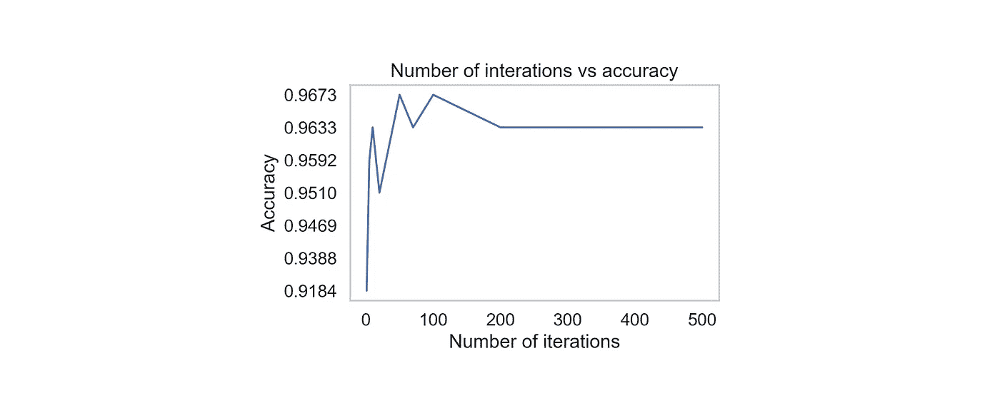

随机森林分类器的“精确度”和“迭代次数”之间的关系。图片作者。

尽管决策树的数量更多，但是在达到稳定状态之前，模型的准确度分数确实在 1 到 100 之间增加。对于 2 个决策树，它是 0.93877，而对于 500 个决策树，它是 0.9632。因此，随着模型中决策树数量的增加，预期精度也会增加。

## 混淆矩阵

最后，让我们用分类报告构建一个混淆矩阵来总结我们的随机森林分类算法的性能，并评估准确性、精确度和召回指标。

混淆矩阵将通过总结正确和不正确的预测提供我们的模型性能和产生的错误类型的指示。这些可以分为以下四类:**(1)****(TP)【2】真阳性(TN)****(3)****假阳性(FP)** 和 **(4)假阴性(FN)。** [Giulio Laurenti 博士](https://medium.com/u/2489258d6569?source=post_page-----8e523f3639e1--------------------------------)在这里更详细地解释了所述读数[。](https://medium.com/swlh/confusion-matrix-and-classification-report-88105288d48f#:~:text=The%20confusion%20matrix%20is%20an,predictions%20of%20the%20classification%20model.&text=The%20rows%20of%20the%20matrix,columns%20represent%20the%20predicted%20classes.)

```
# Confusion matrix
cm = confusion_matrix(y_test, y_pred)
print(classification_report(y_test, y_pred))# Figure plotting
cmap = sns.color_palette("Greys", as_cmap=True) # color map
fig, ax = plt.subplots(figsize=(8, 8))
cm_percent = ((cm/cm.sum(axis=0))*100)
cm_percent = np.nan_to_num(cm_percent, copy=True, nan=0.0, posinf=None, neginf=None)
sns.heatmap(cm_percent, cmap = cmap, annot=True, fmt=".2f", linewidth=1, cbar_kws={"label": "Cluster group classified (%)", "shrink": .8}, annot_kws={"size": 16}) #selecting for percentage only column 
ax.set_title('Confusion matrix')
plt.show()# Figure export
fig.savefig("Figures/Confusion_matrix.png", dpi=300, bbox_inches='tight') 
```

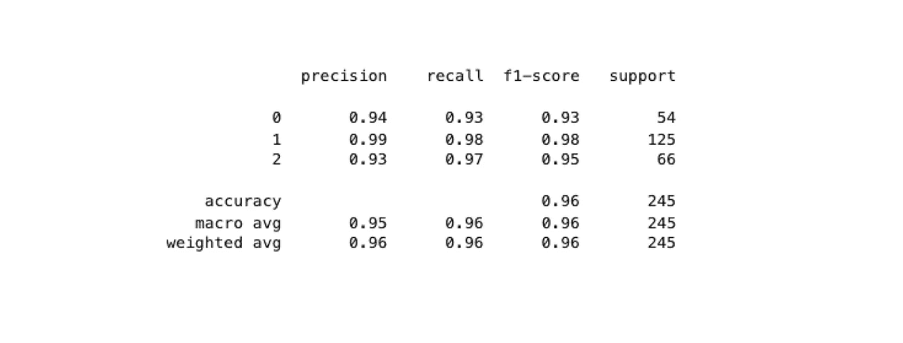

输出的混淆矩阵分类报告(截图)。图片作者。

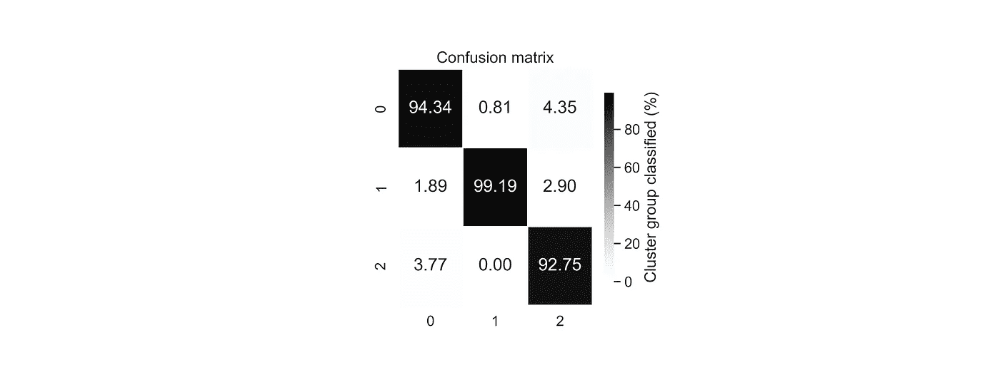

0-2 群组的混淆矩阵。不同的阴影突出显示分类为 TP、TN、FN 或 FP 的预测数相对于每个分类的总可能分类数(%)。图片作者。

# 结论

*我们做到了！我们现在已经建立了一个随机森林算法来准确和精确地分类神经尖峰数据的子集。*

在这篇文章中，我们不仅介绍了一个涉及神经细胞外数据的真实例子，还介绍了决策树和随机森林分类器背后的理论，以及在我们的工作流程中实现的多维缩减和 K-means 聚类。

虽然我们在这里讨论了使用随机森林解决分类问题，但重要的是要认识到有许多方法可以解决这些问题。因此，在未来的文章中，我们将通过覆盖使用深度学习算法和逻辑回归的分类来进一步讨论这一点。

你可以通过 [LinkedIn](https://www.linkedin.com/in/michael-zabolocki/) 联系我，通过 [Twitter](https://twitter.com/mzabolocki1) 关注我，或者在 [GitHub](https://github.com/mzabolocki) 和 [Kaggle](https://www.kaggle.com/michaelzabolocki) 上加入我。